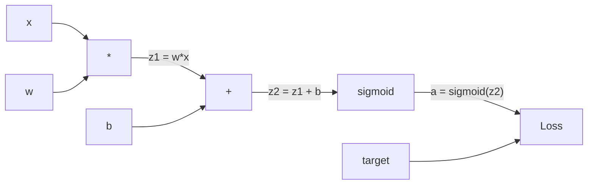
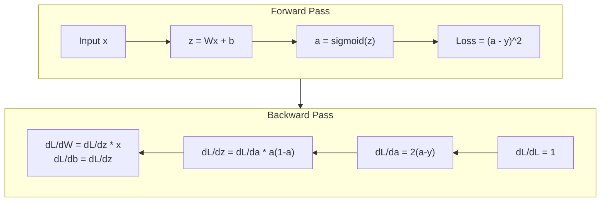
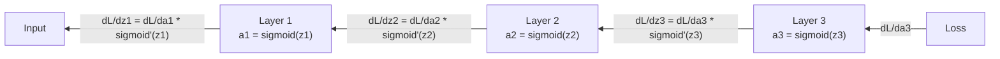

# Desde zero para realizar a propagação de volta

> A propagação de volta é fazer o aprendizado se tornar possível. Sem ela, a Rede Neural é apenas um caro gerador de números aleatórios.

**Type:** Build
**Languages:** Python
**Prerequisites:** Lesson 03.02 (Multi-Layer Networks)
**Time:** ~120 minutes

## Objectivo de aprendizagem
- Realizar um motor de autogrado baseado em Valor, ele construirá um gráfico computacional, e através de uma classificação topológica calcula o gradiente
- Use regra de cadeia 推导 adição, multiplicação 和 sigmoid de Passagem para trás
-  apenas usando você desde zero realçar motor de backpropagation, em XOR e classificação de círculo  treinar uma rede de várias camadas
- Identificação de rede sigmoide de nível profundo  problema do gradiente de desaparecimento  problema,并解释为什么 Gradient 会指数级缩小

## 问题
Sua rede tem uma camada oculta, contendo 768 entradas e 3072 saídas. É o que 2,359,296 pesos. Ele fez uma previsão errada. Qual o peso que levou a esse erro?

A prática simples é: pegue um peso, deixe-o em movimento, reinicie uma vez o Forward Pass, mensure a perda é subir ou baixar. Isso dará a este peso um gradiente.

A propagação de volta resolveu este problema. Uma vez o Forward Pass, uma vez o Backward Pass, todos os gradientes foram calculados. A chave é a regra de cadeia no cálculo, aplicada sistematicamente ao gráfico computacional.

## 概念
### Regra da cadeia, aplicada à rede

Você está na fase 01, lição 05 中见过链条规则──快速回顾: se y = f(g(x)), então dy/dx = f'(g(x)) * g'(x)── Você está em linha de cadeia de

Na rede neural, a cadeia de dados é a sequência de operações que vai da entrada à perda. Cada camada de aplicação tem o peso de carga, adicionado a desvio, reaproveitamento e ativação. A função de perda comparará a saída final com o objetivo. A propagação de dados retorna a esta cadeia para rastrear, calcular a contribuição de cada operação para o erro.

### Gráficos computacionais

Cada vez que Forward Pass, a cidade irá construir um gráfico. Cada nó é uma operação.



Forward Pass:valor de esquerda para direita流动──x 和 w 产生 z1 = w*x──加上 b 得到 z2──Sigmoid 给出激活 a──使用 Loss Function 将 a 与 target y 比较──

Passado para trás: Gradiente de direita para esquerda 流动。 de dL/da 开始(Loss 如何随激活 改变)。乘以 da/dz2(sigmoid derivative)。 obtém dL/dz2。拆分成 dL/db( é igual a dL/dz2, pois z2 = z1 + b) 和 dL/dz1。

Cada nó no gráfico durante o Passagem Atrás  há apenas uma tarefa: receber o gradiente do ascensor, multiplicar-se em sua própria derivada local, e depois para o descensor de transmissão 

### Para a frente versus para trás



Forward Pass 会存储每个中间值:z、a、每个层的输入──Backward Pass 需要这些已存储的值 来计算 Gradient──这是 Backpropagation 核心的内存-计算权衡──你用内存(存储激活)换速度(一次通过,而不是数百万次)──

### Gradiente em rede

Para uma rede de três camadas, o gradiente é ligado a cada camada:



Em cada nível, o gradiente já é multiplicado por derivada sigmoide. O derivado sigmoide é um * (1 - a), o valor máximo é 0,25 ((quando a = 0,5 时) ").

### Os gradientes desaparecem

É o problema do gradiente desaparecente. O segmoide vai reduzir a sua saída para 0 e 1 entre si. Sua derivada é sempre menor que 0,25 e acumula uma camada sigmoide suficiente para que a camada inicial seja quase incompreensível, pois a recebe a camada de segmoide.

```
sigmoid(z):     Output range [0, 1]
sigmoid'(z):    Max value 0.25 (at z = 0)

After 5 layers:   gradient * 0.25^5 = 0.001x original
After 10 layers:  gradient * 0.25^10 = 0.000001x original
```

É por isso que a rede sigmoide de nível profundo é quase impossível de treinar. O problema é o que ela atravessa.

### 推导 Gradiente de Rede de 2 camadas

Abaixo está um exemplo matemático específico: rede com entrada x 带 sigmoid de camada oculta 带 sigmoid de camada de saída, bem como MSE Loss ⋅

Passagem de Forward:
```
z1 = W1 * x + b1
a1 = sigmoid(z1)
z2 = W2 * a1 + b2
a2 = sigmoid(z2)
L = (a2 - y)^2
```

Passagem para trás (逐步应用 chain rule):
```
dL/da2 = 2(a2 - y)
da2/dz2 = a2 * (1 - a2)
dL/dz2 = dL/da2 * da2/dz2 = 2(a2 - y) * a2 * (1 - a2)

dL/dW2 = dL/dz2 * a1
dL/db2 = dL/dz2

dL/da1 = dL/dz2 * W2
da1/dz1 = a1 * (1 - a1)
dL/dz1 = dL/da1 * da1/dz1

dL/dW1 = dL/dz1 * x
dL/db1 = dL/dz1
```

Cada gradiente é uma derivação local da perda, que é seguida de volta e volta.


```figure
backprop-vanishing
```

## Construí-lo
### 步骤 1: Nodo de valor

Cada número em nossa computação se transforma em um valor. Ele armazena seus próprios dados, gradiente, e também como é criado.

```python
class Value:
    def __init__(self, data, children=(), op=''):
        self.data = data
        self.grad = 0.0
        self._backward = lambda: None
        self._children = set(children)
        self._op = op

    def __repr__(self):
        return f"Value(data={self.data:.4f}, grad={self.grad:.4f})"
```

Não há Gradiente (0.0)`_children`Será acompanhado para gerar este valor de outro valor, assim depois podemos fazer uma sorte topológica sobre o gráfico.

### 步骤 2: 带 Função de Retorno

Cada operação cria um novo valor, e define o gradiente como o fluxo é inverso.

```python
def __add__(self, other):
    other = other if isinstance(other, Value) else Value(other)
    out = Value(self.data + other.data, (self, other), '+')

    def _backward():
        self.grad += out.grad
        other.grad += out.grad

    out._backward = _backward
    return out

def __mul__(self, other):
    other = other if isinstance(other, Value) else Value(other)
    out = Value(self.data * other.data, (self, other), '*')

    def _backward():
        self.grad += other.data * out.grad
        other.grad += self.data * out.grad

    out._backward = _backward
    return out
```

 Para adição: d  a + b) / da = 1, d  a + b) / db = 1── portanto, duas entradas vão obter diretamente a saída 

对于乘法:d(a*b)/da = b,d(a*b)/db = a── cada entrada 城市获得另一个输入的值 乘以输出级别──

`+=`很关键──一个值可能会被多个操作使用──它的渐进是来自所有路径的渐进 之和──

### 步骤 3: Sigmoide e Perda

```python
import math

def sigmoid(self):
    x = self.data
    x = max(-500, min(500, x))
    s = 1.0 / (1.0 + math.exp(-x))
    out = Value(s, (self,), 'sigmoid')

    def _backward():
        self.grad += (s * (1 - s)) * out.grad

    out._backward = _backward
    return out
```

Derivada sigmoide:sigmoide(x) * (1 - sigmoide(x))。

```python
def mse_loss(predicted, target):
    diff = predicted + Value(-target)
    return diff * diff
```

单个输出的 MSE:(previsto - meta) ^2──我们把减法表达为加上一个取负的值──

### 步骤 4: Passagem para trás

Tipo topológico                                                                                                                                                                                                                                                                                                                                                                                                                                                                                                                           

```python
def backward(self):
    topo = []
    visited = set()

    def build_topo(v):
        if v not in visited:
            visited.add(v)
            for child in v._children:
                build_topo(child)
            topo.append(v)

    build_topo(self)
    self.grad = 1.0
    for v in reversed(topo):
        v._backward()
```

Desde Loss 开始(Gradiente = 1.0, pois dL/dL = 1)── em seguida, em seguida, em seguida, em seguida, em seguida, em seguida, em seguida, em seguida, em seguida, em seguida, em seguida, em seguida, em seguida, em seguida, em seguida, em seguida, em seguida, em seguida, em seguida, em seguida, em seguida, em seguida, em seguida, em seguida, em seguida, em seguida, em seguida, em seguida, em seguida, em seguida, em seguida, em seguida, em seguida, em seguida, em seguida, em seguida, em seguida, em seguida, em seguida, em seguida, em seguida, em seguida, em seguida, em seguida, em seguida, em seguida, em seguida, em seguida, em seguida, em seguida, em seguida, em seguida, em seguida, em seguida, em seguida, em seguida, em seguida, em seguida, em seguida, em seguida, em seguida, em seguida, em seguida, em seguida, em seguida, em seguida, em seguida, em seguida, em seguida, em seguida, em seguida, em seguida, em seguida, em seguida, em seguida, em seguida, em seguida, em seguida, em seguida, em seguida, em seguida, em seguida, em seguida, em seguida, em seguida, em seguida, em seguida, em seguida, em seguida, em seguida, em seguida, em seguida, em seguida, em seguida, em seguida, em seguida, em seguida, em seguida, em seguida, em seguida, em seguida, em seguida, em seguida, em seguida, em seguida, em seguida, em seguida, em seguida, em seguida, em seguida, em seguida, em seguida, em seguida, em seguida, em seguida, em seguida, em seguida, em seguida, em seguida, em seguida, em seguida, em seguida, em seguida, em seguida, em seguida, em seguida, em seguida, em seguida, em seguida, em seguida, em seguida, em seguida, em seguida, em seguida, em seguida, em seguida, em seguida, em seguida, em seguida, em seguida, em seguida, em seguida, em seguida, em seguida, em seguida, em seguida, em seguida, em seguida, em seguida, em seguida, em seguida, em seguida, em seguida, em seguida, em seguida, em seguida, em seguida, em seguida, em seguida, em seguida, em seguida, em seguida, em seguida,`_backward`Vou mandar o Gradient aos seus filhos.

### 步骤 5: camada e rede

```python
import random

class Neuron:
    def __init__(self, n_inputs):
        scale = (2.0 / n_inputs) ** 0.5
        self.weights = [Value(random.uniform(-scale, scale)) for _ in range(n_inputs)]
        self.bias = Value(0.0)

    def __call__(self, x):
        act = sum((wi * xi for wi, xi in zip(self.weights, x)), self.bias)
        return act.sigmoid()

    def parameters(self):
        return self.weights + [self.bias]


class Layer:
    def __init__(self, n_inputs, n_outputs):
        self.neurons = [Neuron(n_inputs) for _ in range(n_outputs)]

    def __call__(self, x):
        out = [n(x) for n in self.neurons]
        return out[0] if len(out) == 1 else out

    def parameters(self):
        params = []
        for n in self.neurons:
            params.extend(n.parameters())
        return params


class Network:
    def __init__(self, sizes):
        self.layers = []
        for i in range(len(sizes) - 1):
            self.layers.append(Layer(sizes[i], sizes[i + 1]))

    def __call__(self, x):
        for layer in self.layers:
            x = layer(x)
            if not isinstance(x, list):
                x = [x]
        return x[0] if len(x) == 1 else x

    def parameters(self):
        params = []
        for layer in self.layers:
            params.extend(layer.parameters())
        return params

    def zero_grad(self):
        for p in self.parameters():
            p.grad = 0.0
```

Um Neurônio recebe entrada, calcula a soma ponderada + viés, então aplica sigmoide──权重初始化按平方(2/n_inputs) 缩放, para prevenir a saturação sigmoide mais profunda da rede── uma camada é a lista dos Neurônios── uma rede é a lista dos camados──`parameters()`Método irá recolher todos os valores que podemos aprender, para que possamos atualizar-los.

### Passo 6: Treinar em XOR

```python
random.seed(42)
net = Network([2, 4, 1])

xor_data = [
    ([0.0, 0.0], 0.0),
    ([0.0, 1.0], 1.0),
    ([1.0, 0.0], 1.0),
    ([1.0, 1.0], 0.0),
]

learning_rate = 1.0

for epoch in range(1000):
    total_loss = Value(0.0)
    for inputs, target in xor_data:
        x = [Value(i) for i in inputs]
        pred = net(x)
        loss = mse_loss(pred, target)
        total_loss = total_loss + loss

    net.zero_grad()
    total_loss.backward()

    for p in net.parameters():
        p.data -= learning_rate * p.grad

    if epoch % 100 == 0:
        print(f"Epoch {epoch:4d} | Loss: {total_loss.data:.6f}")

print("\nXOR Results:")
for inputs, target in xor_data:
    x = [Value(i) for i in inputs]
    pred = net(x)
    print(f"  {inputs} -> {pred.data:.4f} (expected {target})")
```

Observar Perda Abaixo. De qualquer previsão de XOR a saída correta, totalmente calculado por Backpropagation.

### 步骤 7: Classificação de círculos

Na lição 02 , você está em círculo de classificação.

```python
random.seed(7)

def generate_circle_data(n=100):
    data = []
    for _ in range(n):
        x1 = random.uniform(-1.5, 1.5)
        x2 = random.uniform(-1.5, 1.5)
        label = 1.0 if x1 * x1 + x2 * x2 < 1.0 else 0.0
        data.append(([x1, x2], label))
    return data

circle_data = generate_circle_data(80)

circle_net = Network([2, 8, 1])
learning_rate = 0.5

for epoch in range(2000):
    random.shuffle(circle_data)
    total_loss_val = 0.0
    for inputs, target in circle_data:
        x = [Value(i) for i in inputs]
        pred = circle_net(x)
        loss = mse_loss(pred, target)
        circle_net.zero_grad()
        loss.backward()
        for p in circle_net.parameters():
            p.data -= learning_rate * p.grad
        total_loss_val += loss.data

    if epoch % 200 == 0:
        correct = 0
        for inputs, target in circle_data:
            x = [Value(i) for i in inputs]
            pred = circle_net(x)
            predicted_class = 1.0 if pred.data > 0.5 else 0.0
            if predicted_class == target:
                correct += 1
        accuracy = correct / len(circle_data) * 100
        print(f"Epoch {epoch:4d} | Loss: {total_loss_val:.4f} | Accuracy: {accuracy:.1f}%")
```

Aqui usamos SGD online - cada amostra  depois de atualizar o peso, em vez de acumular lote completo. Isso vai romper mais rapidamente a comparação, e evitar a saturação sigmoide em toda a paisagem de perda.

没有手动调参──Network 会自己发现圆形决策界限──这就是反propagation的力量:你定义建筑、损失函数和数据──算法会找到权重──

## Use-o
PyTorch usa várias linhas de código para completar todo o trabalho acima.

```python
import torch
import torch.nn as nn

model = nn.Sequential(
    nn.Linear(2, 4),
    nn.Sigmoid(),
    nn.Linear(4, 1),
    nn.Sigmoid(),
)
optimizer = torch.optim.SGD(model.parameters(), lr=1.0)
criterion = nn.MSELoss()

X = torch.tensor([[0,0],[0,1],[1,0],[1,1]], dtype=torch.float32)
y = torch.tensor([[0],[1],[1],[0]], dtype=torch.float32)

for epoch in range(1000):
    pred = model(X)
    loss = criterion(pred, y)
    optimizer.zero_grad()
    loss.backward()
    optimizer.step()

print("PyTorch XOR Results:")
with torch.no_grad():
    for i in range(4):
        pred = model(X[i])
        print(f"  {X[i].tolist()} -> {pred.item():.4f} (expected {y[i].item()})")
```

`loss.backward()`É o teu.`total_loss.backward()`- Não.`optimizer.step()`É o que escreves à mão.`p.data -= lr * p.grad`- Não.`optimizer.zero_grad()`É o teu.`net.zero_grad()`O PyTorch é responsável pela aceleração da GPU, precisão mixta, ponto de verificação de gradientes e por centenas de tipos de camadas, mas o Backward Pass continua sendo a mesma regra da cadeia, aplicada no mesmo gráfico computacional.

訓練會运行前行通行,然后运行後行通行通行通行通行通行通行通行通行通行通行通行通行通行通行通行通行通行通行通行通行通行通行通行通行通行通行通行通行通行通行通行通行通行通行通行通行通行通行通行通行通行通行通行通行通行通行通行通行通行通行通行通行通行通行通行通行通行通行通行通行通行通行通行通行通行通行通行通行通行通行通行通行通行通行通行通行通行通行通行通行通行通行通行通行通行通行通行通行通行通行通行通行通行通行通行通行通行通行通行通行通行通行通行通行通行通行通行通行通行通行通行通行通行通行通行通行通行通行通行通行通行通行通行通行通行通行通行通行通行通行通行通行通行通行通行通行通行通行通行通行通行通行通行通行通行通行通行通行通行通行通行通行通行通行通行通行通行通行通行通行通行通行通行通行通行通行通行通行通行通行通行通行通行通行通行通行通行通行通行通行通行通行通行通行通行通行通行通行通行通行通行通行通行通行通行通行通行通行通行通行通通通通通通通通通通通通通通通通通通通通通通通通通通通通通通通通通通通通通通通通通通通通通通通通通通通通通通通通通通通通通通通通通通通通通通通通通通通通通通通通通通通通通通通通通通通通通通通

## Entrega-o
本课会产出:
- `outputs/prompt-gradient-debugger.md`-- Um prompt repetivel, para diagnosticar qualquer Gradiente  problema                                                                                                                                                                                                                                                                                                                                                                                                                                                                                                              

## 练习
1. 给 Value class 添加一个 `__sub__`método ((a - b = a + (-1 * b))。`__neg__`método── através de uma comparação com a simples expressão (a - b) ^2) do cálculo manual, verificando se o gradiente é verdadeiro──

2. 给值 添加一个 `relu`método(output 为 max(0, x),derivado em x > 0 时为 1,否则为 0) ・・・ em camada oculta em relu 替换 sigmoid,并再次在 XOR 上训练──比较收速度──你应该会看到训练更快――这是第04课的预告──

3. Em Value 上 realçar um usado poderes inteiros de `__pow__`Método... Usá-lo.`mse_loss` substituir para real `(predicted - target) ** 2`Expressão: △ △ Gradiente com o original realização

4. 给训练循环 添加梯度剪切:调用 `backward()`后,把所有 Gradient clip 到 [-1, 1]──训练一个更深的网络(4+ camadas com sigmoid),并比较有无剪的损失曲线──这是你对抗爆炸梯度的第一防线──

5. Construir uma visualização: após a conclusão do treinamento XOR, imprimir Gradiente de cada parâmetro na rede.

## 关键术语
| Term | What people say | What it actually means |
|------|----------------|----------------------|
| Backpropagation | “Network 学会了” | 一种算法，通过沿 Computational Graph 反向应用 chain rule，为每个权重计算 dL/dw |
| Computational graph | “Network 结构” | 一个有向无环 graph，其中 node 是 operation，edge 承载 value（forward）和 Gradient（backward） |
| Chain rule | “把 derivative 相乘” | 如果 y = f(g(x))，那么 dy/dx = f'(g(x)) * g'(x) -- Backpropagation 的数学基础 |
| Gradient | “最陡上升方向” | Loss 相对于某个 parameter 的 partial derivative -- 告诉你如何改变该 parameter 来降低 Loss |
| Vanishing gradient | “深层 network 学不会” | 当 Gradient 通过带有 sigmoid 这类 saturating activation 的 layer 传播时，会指数级缩小 |
| Forward pass | “运行 network” | 通过顺序应用每一层的 operation，从 input 计算 output，并存储 intermediate value |
| Backward pass | “计算 Gradient” | 反向遍历 Computational Graph，在每个 node 使用 chain rule 累积 Gradient |
| Learning rate | “学习速度” | 一个控制权重更新步长的 scalar：w_new = w_old - lr * gradient |
| Topological sort | “正确顺序” | 一种 graph node 排序方式，使每个 node 都出现在其依赖的所有 node 之后 -- 确保 Gradient 在传播前已完全累积 |
| Autograd | “自动微分” | 一个在 forward computation 期间构建 Computational Graph，并自动计算 Gradient 的系统 -- PyTorch 的 engine 做的就是这个 |

## 延伸阅读
- Rumelhart, Hinton & Williams, "Aprender representações por erros de propagação de volta" (1986) -- 这篇论文让 Backpropagation 成为主流,并解锁了多层网络培训
- 3Blue1Brown, série "Networks Neural" (https://www.youtube.com/playlist?list=PLZHQObOWTQDNU6R1_67000Dx_ZCJB-3pi) --  sobre a " Backpropagation " e a melhor interpretação de como a rede de transmissão gradual
