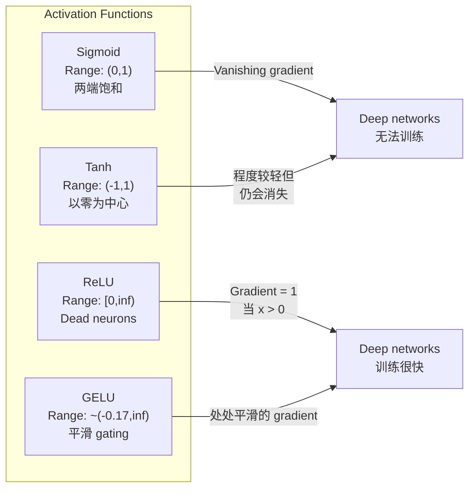
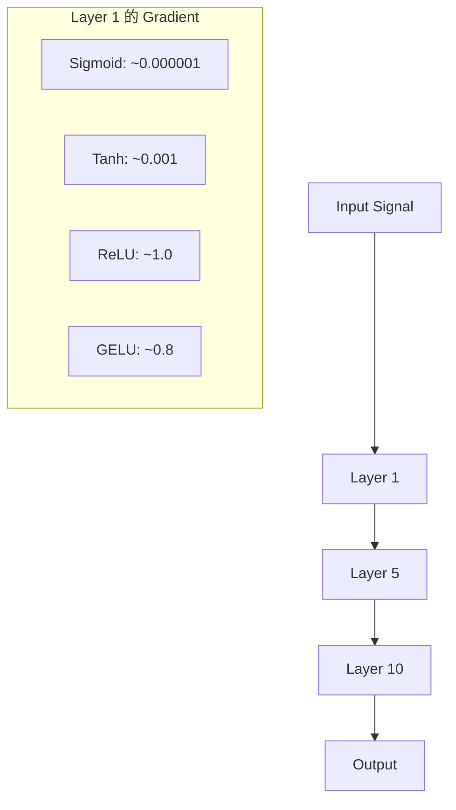
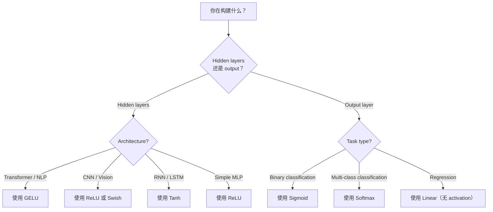

# 激活函数

> Não há nada sem linha, a sua rede de 100 camadas é apenas uma refinada multiplicação da Matriz. A ativação é o que permite que a rede neural possa pensar com curvas.

**Type:** Build
**Languages:** Python
**Prerequisites:** Lesson 03.03 (Backpropagation)
**Time:** ~75 分钟

## Objectivo de aprendizagem

- Desde zero realizar sigmoid、tanh、ReLU、Leaky ReLU、GELU、Swish 和 softmax  e seus derivados
- 通过测量不同激活在10+ 层中的激活大小,诊断消失梯度问题
- Re: Re: Re: Re: Re: Re: Re: Re: Re: Re: Re: Re: Re: Re: Re: Re: Re: Re: Re: Re: Re: Re: Re: Re: Re: Re: Re: Re: Re: Re: Re: Re: Re: Re: Re: Re: Re: Re: Re: Re: Re: Re: Re: Re: Re: Re: Re: Re: Re: Re: Re: Re: Re: Re: Re: Re: Re: Re: Re: Re: Re: Re: Re: Re: Re: Re: Re: Re: Re: Re: Re: Re: Re: Re: Re: Re: Re: Re: Re: Re: Re: Re: Re: Re: Re: Re: Re: Re: Re: Re: Re: Re: Re: Re: Re: Re: Re: Re: Re: Re: Re: Re: Re: Re: Re: Re: Re: Re: Re: Re: Re: Re: Re: Re: Re: Re: Re: Re: Re: Re: Re: Re: Re: Re: Re: Re: Re: Re: Re: Re: Re: Re: Re: Re: Re: Re: Re: Re: Re: Re: Re: Re: Re: Re: Re: Re: Re: Re: Re: Re: Re: Re: Re: Re: Re: Re: Re: Re: Re: Re: Re: Re: Re: Re: Re: Re: Re: Re: Re: Re: Re: Re: Re: Re: Re: Re: Re: Re: Re: Re: Re: Re: Re: Re: Re: Re: Re: Re: Re: Re: Re: Re: Re: Re: Re: Re: Re: Re: Re: Re: Re: Re: Re: Re: Re: Re: Re: Re: Re: Re: Re: Re: Re: Re: Re: Re: Re: Re: Re: Re: Re: Re: Re: Re: Re: Re: Re: Re: Re: Re: Re: Re: Re: Re: Re: Re: Re: Re: Re: Re: Re: Re: Re: Re: Re: Re: Re: Re: Re: Re: Re: Re: Re: Re: Re:
- Para determinar a arquitetura ((transformador、CNN、RNN、 camada de saída) escolher a função de ativação correta

## 问题

堆叠两个线性变化:y = W2(W1x + b1) + b2。展开它:y = W2W1x + W2b1 + b2。这只是 y = Ax + c一个单一线性变化──无论你堆叠多少线性层,结果都会缩成一次矩阵乘点──你的100层网络与单层 具有相同表示能力──

Não é uma curiosidade teórica. Significa que a rede linear profunda não pode aprender XOR, não pode classificar o conjunto de dados espirais, não pode reconhecer os rostos de pessoas.

Funções de ativação 打破线性── elas passam por funções não lineares 扭曲每一层的输出,让网络 能够曲决策界限、近似任意函数,并真正学习── mas se você escolher a ativação errada, seus gradientes desaparecerão até zero (sigmoid)  Deep networks (segmoid)  Explosion to infinite (explosion to infinite)  无限 (exclução sem precação)  无限 (iniciativação sem limites) ), ou seus neurônios 会永久死亡 (permanência)  带有较大负面偏见的 ReLU)    选择 (seleção) da função de ativação determina diretamente sua rede 否否能学习──

## 概念

### Por que é necessário não-linear?

A multiplicação de matriz é possível de compor. Primeiro, a matriz A é multiplicada por um vetor, depois, a matriz B é multiplicada por um resultado, equivalente a multiplicar diretamente por AB. Isto significa que são compostas dez camadas lineares, matematicamente, equivalentes a uma camada linear de uma matriz com grande dimensão. Todos esses parâmetros, todas essas profundidades são desperdiçadas.

Abaixo é a prova. Uma camada linear  calcular f ((x) = Wx + b。

```
Layer 1: h = W1 * x + b1
Layer 2: y = W2 * h + b2
```

- Não .

```
y = W2 * (W1 * x + b1) + b2
y = (W2 * W1) * x + (W2 * b1 + b2)
y = A * x + c
```

一层──在层之间插入 ativação não linear g():

```
h = g(W1 * x + b1)
y = W2 * h + b2
```

Agora代入被打破了──W2 * g(W1 * x + b1) + b2 不能再简化为单线性转换──网络可以表示非线性函数──每增加一层带激活的层,都会增加表示能力──

### Sigmoide

A rede neural funciona mais cedo.

```
sigmoid(x) = 1 / (1 + e^(-x))
```

输出范围:(0, 1)──平滑、可微, será qualquer número real mapeado para o valor similar da probabilidade──

Derivada:

```
sigmoid'(x) = sigmoid(x) * (1 - sigmoid(x))
```

O valor máximo desta derivada é 0,25, em x = 0── em backpropagation, gradientes 会逐层相乘──十层 sigmoid significa gradiente 最多会被 0.25 连续乘十次:

```
0.25^10 = 0.000000953674
```

Não chega a um milhão de sinais primitivos. É o problema do gradiente que desaparece. As primeiras camadas têm um gradiente muito pequeno, os pesos quase não se renovam.

Outro problema:sigmoide 输出始终为正(0到 1), o que significa pesos de gradientes de cima 总是同号―― isto levará à aparição de um choque de forma literal no processo de descida do gradiente.

### Tanh

Sigmoid 的居中版本──

```
tanh(x) = (e^x - e^(-x)) / (e^x + e^(-x))
```

输出范围:(-1, 1)──以零为中心,可以消除之字形问题──

Derivada:

```
tanh'(x) = 1 - tanh(x)^2
```

O maior derivado em x = 0 时为 1.0比sigmoid 好四倍――但消失梯度问题 仍然存在――对于很大的正输入或负输入,derivative 会趋近零――十层仍然会压碎梯度,只是没有那么激烈――

### - Não .

Nair 和 Hinton em 2010 vai sua introdução para o aprendizado profundo. Esta função em si se remonta ao trabalho de Fukushima em 1969, mudou tudo.

```
relu(x) = max(0, x)
```

输出范围:[0, infinito) ・derivative 非常简单:

```
relu'(x) = 1  if x > 0
            0  if x <= 0
```

Para a entrada correta, não há gradiente desaparecendo. O gradiente correta é 1, vai transmitir directamente para o passado. É por isso que as redes profundas tornam-se treináveis.

Mas tem um modo de falha: problema de neurônios mortos. Se a entrada ponderada de um neurônio 始终为负 (por causa de um maior viés negativo ou uma initialização de peso infeliz), sua saída será para sempre para zero, gradiente para sempre para zero, portanto nunca será renovada.

### ReLU em fuga

Neurônios mortos, o mais simples método de reparação.

```
leaky_relu(x) = x        if x > 0
                alpha * x if x <= 0
```

Dentre eles, o alfa é um pequeno número constante, geralmente de 0,01──a meia-axe negativa tem uma pequena inclinação em vez de zero, por isso os neurônios mortos  ainda podem obter o sinal de gradiente,并有机会恢复──.

### GELU:现代默认选择

Gaussian Error Linear Unit── proposto por Hendrycks 和 Gimpel em 2016── é a ativação em vão da BERT、GPT e da maioria dos transformadores modernos──.

```
gelu(x) = x * Phi(x)
```

Entre elas, Phi(x) é a função de distribuição cumulativa de distribuição normal padrão, em prática usada em forma aproximada:

```
gelu(x) ~= 0.5 * x * (1 + tanh(sqrt(2/pi) * (x + 0.044715 * x^3)))
```

GELU está em posição de planeamento, permite menor valor negativo ((( não como ReLU naquele modo duro cortar para zero), e há uma probabilidade de explicação: ele depende de cada entrada na distribuição Gaussian 下为正的可能性对其加权── essa gateagem plana é superior a ReLU, porque oferece um melhor fluxo de gradiente,并完全避免死神经系统问题──

### Swis / SiLU

Por Ramachandran et al. Em 2017 através de busca automática 发现的自我关闭激活──

```
swish(x) = x * sigmoid(x)
```

A forma de Swish é x * sigmoid(x)。 Google 通過在活性功能空間上進行自動搜尋 發現它一個神經網絡在設計神經網絡的一部分──

Como GELU, ele é mais fácil, não é mais fácil, e permite menor valor negativo. Diferença é muito pequena:Swish usa sigmoid como gate, enquanto GELU usa CDF gaussiano. Na prática, o desempenho é quase o mesmo.

### Softmax: saída Ativação

Não é usado em camadas ocultas. Softmax vai criar pontuações brutas.

```
softmax(x_i) = e^(x_i) / sum(e^(x_j) for all j)
```

Cada saída está entre 0 a 1 ⋅ todas as saídas e para 1⋅ que torna-se a ativação final padrão de classificação de várias classes⋅ a maior logite obterá a maior probabilidade, mas diferentemente de argmax, softmax é microbiana, e retém informações relativamente confiáveis⋅

### 形形对比



### Fluxo gradiente em relação ao



### Quando é que é que a ativação é usada?



## 动手构建

### 步骤 1: Realizar todas as funções de ativação  e seus derivados

Cada função recebe um fluto e retorna a um fluto. Cada função derivada recebe o mesmo ingresso e retorno de gradiente.

```python
import math

def sigmoid(x):
    x = max(-500, min(500, x))
    return 1.0 / (1.0 + math.exp(-x))

def sigmoid_derivative(x):
    s = sigmoid(x)
    return s * (1 - s)

def tanh_act(x):
    return math.tanh(x)

def tanh_derivative(x):
    t = math.tanh(x)
    return 1 - t * t

def relu(x):
    return max(0.0, x)

def relu_derivative(x):
    return 1.0 if x > 0 else 0.0

def leaky_relu(x, alpha=0.01):
    return x if x > 0 else alpha * x

def leaky_relu_derivative(x, alpha=0.01):
    return 1.0 if x > 0 else alpha

def gelu(x):
    return 0.5 * x * (1 + math.tanh(math.sqrt(2 / math.pi) * (x + 0.044715 * x ** 3)))

def gelu_derivative(x):
    phi = 0.5 * (1 + math.erf(x / math.sqrt(2)))
    pdf = math.exp(-0.5 * x * x) / math.sqrt(2 * math.pi)
    return phi + x * pdf

def swish(x):
    return x * sigmoid(x)

def swish_derivative(x):
    s = sigmoid(x)
    return s + x * s * (1 - s)

def softmax(xs):
    max_x = max(xs)
    exps = [math.exp(x - max_x) for x in xs]
    total = sum(exps)
    return [e / total for e in exps]
```

### Passo 2: Visualização Gradientes em onde a morte

Em -5 até 5 de 100 个均间隔点上计算梯度──imprimir um histograma de texto, mostrando cada gradiente de ativação 在哪里接近零──

```python
def gradient_scan(name, derivative_fn, start=-5, end=5, n=100):
    step = (end - start) / n
    near_zero = 0
    healthy = 0
    for i in range(n):
        x = start + i * step
        g = derivative_fn(x)
        if abs(g) < 0.01:
            near_zero += 1
        else:
            healthy += 1
    pct_dead = near_zero / n * 100
    print(f"{name:15s}: {healthy:3d} healthy, {near_zero:3d} near-zero ({pct_dead:.0f}% dead zone)")

gradient_scan("Sigmoid", sigmoid_derivative)
gradient_scan("Tanh", tanh_derivative)
gradient_scan("ReLU", relu_derivative)
gradient_scan("Leaky ReLU", leaky_relu_derivative)
gradient_scan("GELU", gelu_derivative)
gradient_scan("Swish", swish_derivative)
```

### 步骤 3: Desaparecimento Gradiente 实验

Utilize sigmoid, com ReLU, deixe um sinal passar por N 层-forward-pass.

```python
import random

def vanishing_gradient_experiment(activation_fn, name, n_layers=10, n_inputs=5):
    random.seed(42)
    values = [random.gauss(0, 1) for _ in range(n_inputs)]

    print(f"\n{name} through {n_layers} layers:")
    for layer in range(n_layers):
        weights = [random.gauss(0, 1) for _ in range(n_inputs)]
        z = sum(w * v for w, v in zip(weights, values))
        activated = activation_fn(z)
        magnitude = abs(activated)
        bar = "#" * int(magnitude * 20)
        print(f"  Layer {layer+1:2d}: magnitude = {magnitude:.6f} {bar}")
        values = [activated] * n_inputs

vanishing_gradient_experiment(sigmoid, "Sigmoid")
vanishing_gradient_experiment(relu, "ReLU")
vanishing_gradient_experiment(gelu, "GELU")
```

### 步骤 4: Neurônio morto 检测器

Criar uma rede ReLU, transmitir entradas aleatórias, calcular quantas neurônios estão ainda inactivas.

```python
def dead_neuron_detector(n_inputs=5, hidden_size=20, n_samples=1000):
    random.seed(0)
    weights = [[random.gauss(0, 1) for _ in range(n_inputs)] for _ in range(hidden_size)]
    biases = [random.gauss(0, 1) for _ in range(hidden_size)]

    fire_counts = [0] * hidden_size

    for _ in range(n_samples):
        inputs = [random.gauss(0, 1) for _ in range(n_inputs)]
        for neuron_idx in range(hidden_size):
            z = sum(w * x for w, x in zip(weights[neuron_idx], inputs)) + biases[neuron_idx]
            if relu(z) > 0:
                fire_counts[neuron_idx] += 1

    dead = sum(1 for c in fire_counts if c == 0)
    rarely_fire = sum(1 for c in fire_counts if 0 < c < n_samples * 0.05)
    healthy = hidden_size - dead - rarely_fire

    print(f"\nDead Neuron Report ({hidden_size} neurons, {n_samples} samples):")
    print(f"  Dead (never fired):     {dead}")
    print(f"  Barely alive (<5%):     {rarely_fire}")
    print(f"  Healthy:                {healthy}")
    print(f"  Dead neuron rate:       {dead/hidden_size*100:.1f}%")

    for i, c in enumerate(fire_counts):
        status = "DEAD" if c == 0 else "WEAK" if c < n_samples * 0.05 else "OK"
        bar = "#" * (c * 40 // n_samples)
        print(f"  Neuron {i:2d}: {c:4d}/{n_samples} fires [{status:4s}] {bar}")

dead_neuron_detector()
```

### 步骤 5: treinamento对比Sigmoid vs ReLU vs GELU

Em conjunto de dados de círculo, em círculo, em círculo, em círculo, em círculo, em círculo, em círculo, em círculo, em círculo, em círculo, em círculo, em círculo, em círculo, em círculo, em círculo, em círculo, em círculo, em círculo, em círculo, em círculo, em círculo, em círculo, em círculo, em círculo, em círculo, em círculo, em círculo, em círculo, em círculo, em círculo, em círculo, em círculo, em círculo, em círculo, em círculo, em círculo, em círculo, em círculo, em círculo, em círculo, em círculo, em círculo, em círculo, em círculo, em círculo, em círculo, em círculo, em círculo, em círculo, em círculo, em círculo, em círculo, em círculo, em círculo, em círculo, em círculo, em círculo, em círculo, em cír, em círculo, em círculo, em círculo, em círculo, em círculo, em círculo, em cír, em círculo, em círculo, em círculo, em círculo, em círculo, em círculo, em círculo, em círculo, em círculo, em círculo, em círculo, em círculo, em círculo, em círculo, em círculo, em círculo, em círculo, em círculo, em círculo, em círculo, em círculo, em círculo, em círculo, em círculo, em círculo, em círculo, em círculo, em círculo, em círculo, em círculo, em círculo, em círculo, em círculo, em círculo, em círculo, em círculo, em círculo, em círculo, em círculo, em círculo, em círculo, em círculo, em círculo, em círculo, em círculo, em círculo, em círculo, em círculo, em círculo, em círculo, em círculo, em círculo, em círculo, em círculo, em círculo, em círculo, em círculo, em círculo, em círculo, em círculo, em círculo,

```python
def make_circle_data(n=200, seed=42):
    random.seed(seed)
    data = []
    for _ in range(n):
        x = random.uniform(-2, 2)
        y = random.uniform(-2, 2)
        label = 1.0 if x * x + y * y < 1.5 else 0.0
        data.append(([x, y], label))
    return data


class ActivationNetwork:
    def __init__(self, activation_fn, activation_deriv, hidden_size=8, lr=0.1):
        random.seed(0)
        self.act = activation_fn
        self.act_d = activation_deriv
        self.lr = lr
        self.hidden_size = hidden_size

        self.w1 = [[random.gauss(0, 0.5) for _ in range(2)] for _ in range(hidden_size)]
        self.b1 = [0.0] * hidden_size
        self.w2 = [random.gauss(0, 0.5) for _ in range(hidden_size)]
        self.b2 = 0.0

    def forward(self, x):
        self.x = x
        self.z1 = []
        self.h = []
        for i in range(self.hidden_size):
            z = self.w1[i][0] * x[0] + self.w1[i][1] * x[1] + self.b1[i]
            self.z1.append(z)
            self.h.append(self.act(z))

        self.z2 = sum(self.w2[i] * self.h[i] for i in range(self.hidden_size)) + self.b2
        self.out = sigmoid(self.z2)
        return self.out

    def backward(self, target):
        error = self.out - target
        d_out = error * self.out * (1 - self.out)

        for i in range(self.hidden_size):
            d_h = d_out * self.w2[i] * self.act_d(self.z1[i])
            self.w2[i] -= self.lr * d_out * self.h[i]
            for j in range(2):
                self.w1[i][j] -= self.lr * d_h * self.x[j]
            self.b1[i] -= self.lr * d_h
        self.b2 -= self.lr * d_out

    def train(self, data, epochs=200):
        losses = []
        for epoch in range(epochs):
            total_loss = 0
            correct = 0
            for x, y in data:
                pred = self.forward(x)
                self.backward(y)
                total_loss += (pred - y) ** 2
                if (pred >= 0.5) == (y >= 0.5):
                    correct += 1
            avg_loss = total_loss / len(data)
            accuracy = correct / len(data) * 100
            losses.append(avg_loss)
            if epoch % 50 == 0 or epoch == epochs - 1:
                print(f"    Epoch {epoch:3d}: loss={avg_loss:.4f}, accuracy={accuracy:.1f}%")
        return losses


data = make_circle_data()

configs = [
    ("Sigmoid", sigmoid, sigmoid_derivative),
    ("ReLU", relu, relu_derivative),
    ("GELU", gelu, gelu_derivative),
]

results = {}
for name, act_fn, act_d_fn in configs:
    print(f"\n=== Training with {name} ===")
    net = ActivationNetwork(act_fn, act_d_fn, hidden_size=8, lr=0.1)
    losses = net.train(data, epochs=200)
    results[name] = losses

print("\n=== Final Loss Comparison ===")
for name, losses in results.items():
    print(f"  {name:10s}: start={losses[0]:.4f} -> end={losses[-1]:.4f} (improvement: {(1 - losses[-1]/losses[0])*100:.1f}%)")
```


```figure
softmax-temperature
```

## Use-o

PyTorch oferece simultaneamente todas essas funções em duas formas funcionais e módulos:

```python
import torch
import torch.nn as nn
import torch.nn.functional as F

x = torch.randn(4, 10)

relu_out = F.relu(x)
gelu_out = F.gelu(x)
sigmoid_out = torch.sigmoid(x)
swish_out = F.silu(x)

logits = torch.randn(4, 5)
probs = F.softmax(logits, dim=1)

model = nn.Sequential(
    nn.Linear(10, 64),
    nn.GELU(),
    nn.Linear(64, 32),
    nn.GELU(),
    nn.Linear(32, 5),
)
```

Transformador Intermediário das camadas ocultas:GELU。CNN Intermediário das camadas ocultas:ReLU。classificação de camada de saída:softmax。regressão de camada de saída:无(linear)。概率 de camada de saída:sigmoid──就是这样──先从这些默认值开始──只有你有证据时才改变它们──

RNNs e LSTMs para estado oculto Use tanh, Use gates, Use sigmoid, mas se você hoje for construído a partir de zero, você provavelmente não usará RNNs. Se os neurônios da sua rede de RLU estiverem morrendo, mudem para GELU. Não escolha com a mão o Leaky ReLU, a menos que você tenha uma razão clara para resolver o problema de neurônios mortos, e forneça um melhor fluxo de gradiente.

## 交付成果

本课会产出:
- `outputs/prompt-activation-selector.md` Um prompt de repetição, ajudá-lo para qualquer arquitetura  escolher a função de ativação correta

## 练习

1. 实现 Parametric ReLU (PReLU), em que a inclinação negativa alfa é um parâmetro aprenhável.

2. O experimento de gradiente de desaparecimento será transformado em 50 níveis de operação.

3. 实现 ELU (Unidade Linear Exponencial):elu(x) = x se x > 0, alfa * (e^x - 1) se x <= 0── em uma mesma rede 上将它的死神经元率与 ReLU对比──

4. Construir um monitor de saúde gradiente, durante o treino, executado: cada época calcula a magnitude média do gradiente de cada camada, em qualquer camada, de gradiente inferior a 0,001 ou superior a 100 horas, para imprimir um aviso.

5. Modificar treinamento em comparação, usando o conjunto de dados XOR na lição 01 em vez de círculos.

## 关键术语

| Term | 人们怎么说 | 它实际是什么意思 |
|------|----------------|----------------------|
| Activation function | “非线性部分” | 应用于每个 neuron 输出的函数，用于打破线性，使 network 能够学习 nonlinear mappings |
| Vanishing gradient | “Gradients 在 deep networks 中消失” | 当 activation 的 derivative 小于 1 时，gradients 会通过 layers 指数级缩小，使早期 layers 无法训练 |
| Exploding gradient | “Gradients 爆炸” | 当有效乘数超过 1 时，gradients 会通过 layers 指数级增长，导致训练不稳定 |
| Dead neuron | “停止学习的 neuron” | 输入永久为负的 ReLU neuron，会产生零输出和零 gradient |
| Sigmoid | “把值压缩到 0-1” | logistic function 1/(1+e^-x)，历史上很重要，但会在 deep networks 中导致 vanishing gradients |
| ReLU | “把负数裁剪为零” | max(0, x)——通过保留 gradient magnitude 让 deep learning 变得实用的 activation |
| GELU | “transformer activation” | Gaussian Error Linear Unit，一种平滑 activation，会根据输入为正的概率对输入加权 |
| Swish/SiLU | “Self-gated ReLU” | x * sigmoid(x)，通过 automated search 发现，用于 EfficientNet |
| Softmax | “把分数变成概率” | 将 logits 的 Vector 归一化为 probability distribution，其中所有值都在 (0,1) 内且总和为 1 |
| Leaky ReLU | “不会死亡的 ReLU” | max(alpha*x, x)，其中 alpha 很小（0.01），通过允许较小的 negative gradients 来防止 dead neurons |
| Saturation | “sigmoid 的平坦部分” | activation 的 derivative 趋近于零的区域，会阻断 gradient flow |
| Logit | “softmax 之前的原始分数” | 应用 softmax 或 sigmoid 之前，final layer 的未归一化输出 |

## 延伸阅读

- Nair & Hinton, "Unidades Lineares Rectificadas Melhores Máquinas Boltzmann Restritas" (2010) 介绍 ReLU 并促成深度网络 训练的论文
- Hendrycks & Gimpel, "Gaussian Error Linear Units (GELUs) " (2016)  propostou depois tornar-se transformadores 默认选择的激活函数
- Ramachandran et al., "Buscar funções de ativação" (2017) utilizar pesquisa automatizada 发现 Swish, mostrar ativação 设计可以自动化
- Glorot & Bengio, "Compreender a dificuldade de treinar redes neurais de feedforward profundas" (2010)  diagnóstico de gradientes desaparecendo/explodindo 并提出 Xavier inicialização 的论文
- Bem-vindo, Bengio, Courville, "Aprendizagem Profunda" Capítulo 6.3 (https://www.deeplearningbook.org/) Relativamente às unidades ocultas e às funções de ativação
