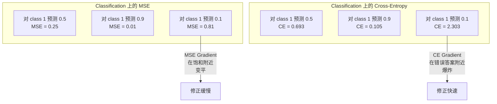
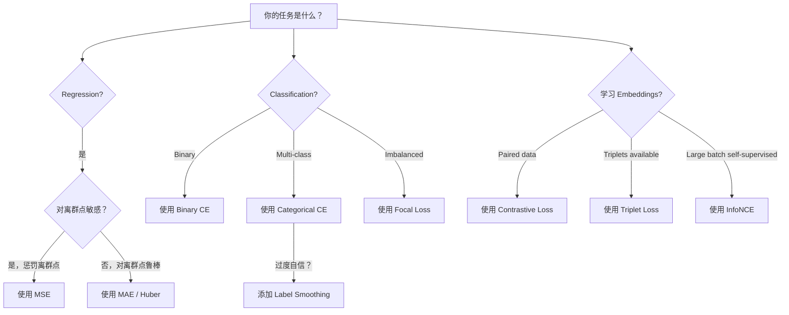
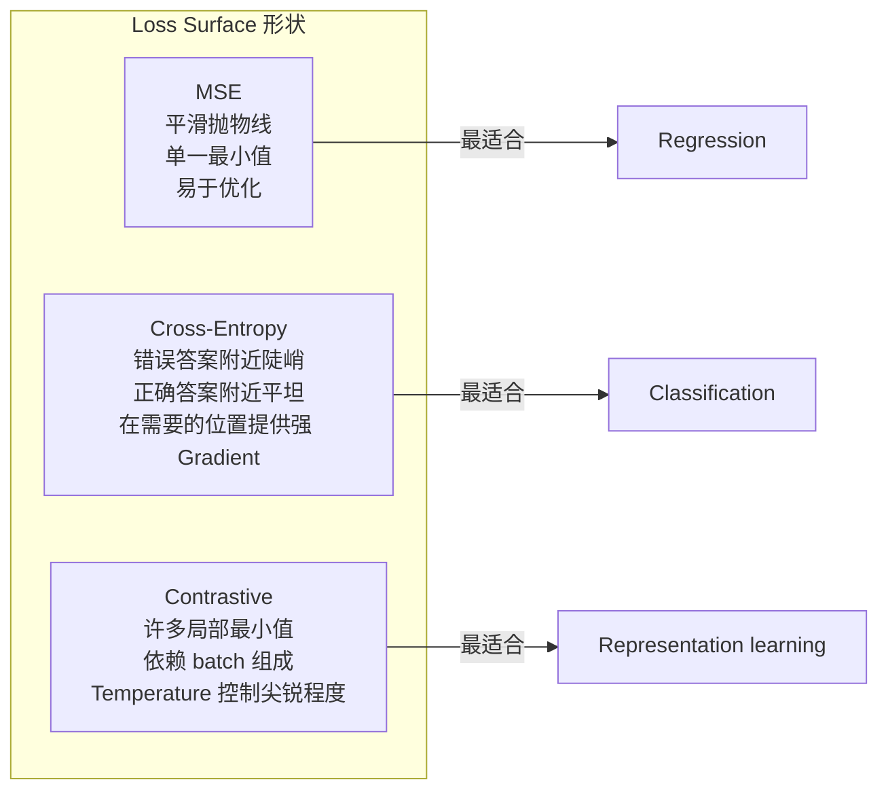

# Funções perdidas

> Sua rede neural faz uma previsão. A verdade básica dá uma resposta diferente.

**Type:** Build
**Languages:** Python
**Prerequisites:** Lesson 03.04 (Activation Functions)
**Time:** ~75 minutes

## Objectivo de aprendizagem

- Desde a realização de MSE, entropia transversal binária, entropia transversal categórica e perda contrastiva (InfoNCE), bem como seu gradiente
- 通过演示对所有样本都预测 0.5的失败模式,解释为什么MSE不适合分类
- O etiquetado de suavizamento é usado para entropia cruzada, e descreve como ele evita previsões de autoconfiança excessiva
- Para regressão, classificação binária, classificação multi-classe, assim como para inserir aprendizagem

## 问题

Em questão de classificação  MSE de minimização modelo, será muito confiante em tudo pré-anunciar 0,5── é realmente em minimização de perdas── mas também completamente inutilizado──

A função de perda é o único objeto de otimização real do modelo. Não é precisão. Não é pontuação F1. Nem é qualquer métrica do gerente. Otimizador irá tomar o gradiente da função de perda e ajustar o peso para fazer esse número mudar de pequeno. Se a função de perda não captar o que realmente importa, o modelo encontrará a maneira mais baixa matemática de satisfazê-lo, e essa maneira quase não é sempre o que você quer.

Aqui há um exemplo específico. Você tem uma classificação binária 任务。 duas categorias, 50/50 分布。 você usa MSE 作为 Loss。 modelo para cada entrada                                                                                                                                                                                                                                            

情况也会更糟──在自我监督学习中,你甚至没有标签──Contrastive Loss 完全定义学习信号:什么算相似,什么算不同,以及模型应该多用力分开它们──Contrastive Loss 写错了,你的嵌入会缩缩到一个点――cada entrada é mapeada no mesmo vector──技术上 Loss 为零──实际上没有价值──

## 概念

### Erro médio quadrado (MSE)

O cálculo da diferença entre o valor de previsão e o valor-alvo é quadrado, e a média é obtida em todas as amostras.

```
MSE = (1/n) * sum((y_pred - y_true)^2)
```

Por que o quadrado é importante: ele punirá o grande erro de forma secundária. O custo de um erro de 2 é 4 vezes o custo de um erro de 1 . O custo de um erro de 10 é 100 vezes o custo de um erro de 10 .

Número real: Se o seu modelo prever o preço da casa, a maioria das casas tem uma diferença.$10,000，但对一栋豪宅偏差 $200.000,MSE vai tentar reparar a sua casa, possivelmente prejudicar o desempenho de outras 99 casas.

MSE relativa ao valor de pré-conhecimento é:

```
dMSE/dy_pred = (2/n) * (y_pred - y_true)
```

É relacionado com erros lineares. Os erros maiores recebem maiores graus. Isto é uma característica da regressão.

### Perda de entropia cruzada

Função de perda de classificação. Origina-se da teoria da informação.

**Binary Cross-Entropy (BCE):**

```
BCE = -(y * log(p) + (1 - y) * log(1 - p))
```

Entre eles, y é a probabilidade de previsão.

Por que -log(p) Éficaz: Quando o verdadeiro marcador é 1 且你预测 p = 0,99 时,Loss is -log(0.99) = 0,01── quando você préviu p = 0,01 时,Loss is -log(0.01) = 4,6── essa diferença de 460 倍 é de entropia cruzada Éficaz.

Gradient 讲述是同一个故事:

```
dBCE/dp = -(y/p) + (1-y)/(1-p)
```

Quando y = 1 e p 接近零时, Gradiente é -1/p, vai tendência negativa infinita. O modelo recebe um grande sinal para corrigir o erro.

**Categorical Cross-Entropy:**

Utilizado para classificação multi-classe de um único objetivo de codificação.

```
CCE = -sum(y_i * log(p_i))
```

只有真实类别会贡献 Loss(因为其他所有 y_i 都是零) ⋅ Se houver 10 类别, a probabilidade de obter uma classe correcta é 0,1 ⋅随机猜测), Loss é -log(0.1) = 2.3 ⋅

### Por que a MSE não se adequa à Classificação



Quando a previsão se aproxima de 0 ou 1 时, o Gradiente MSE irá mudar de plano devido à sigmoide 和) ・ Gradiente de entropia cruzada irá compensar este ponto - - log 抵消了sigmoide's flat region,在最需要的位置给出强的 Gradient──

### Limeamento de etiquetas

                                                                                                                                                                                                                                                              

```
smooth_label = (1 - alpha) * one_hot + alpha / num_classes
```

Quando alfa = 0,1 且有 10 个类别时: objetivo não é mais [0, 0, 1, 0, ...], mas [0,01, 0.01, 0.91, 0.01,...]── o objetivo do modelo é 0,91, e não 1,0──

Por que isso é eficaz: uma tentativa de passar por softmax 输出精确 1.0 de modelos, precisa de colocar logits 推向无穷── isso levará a muita confiança, prejudicará a capacidade de generalização, e tornará o modelo à distribuição desviada fraco──Limiting de rótulos  会把目标限制在0.9 ((quando alpha=0.1 时), deixe logits 保持在合理范围内──GPT 和大多数现代模型都使用标签滑滑或其等价格形式──

### Perda contrasta

Não há etiquetas, não há categorias, só entrada para e uma questão: são semelhantes ou diferentes?

**SimCLR-style contrastive loss (NT-Xent / InfoNCE):**

取一张图像── criar seus dois aumentos视图 (crop, rotate, color jitter)── eles são um par positivo - eles devem ter embutidos semelhantes── cada outra imagem no lote forma um par negativo - eles devem ter embutidos diferentes──

```
L = -log(exp(sim(z_i, z_j) / tau) / sum(exp(sim(z_i, z_k) / tau)))
```

Entre eles sim() é similaridade cosínica, z_i 和 z_j é par positivo, procura e cobre todos os negativos,tau (temperatura)  controle da distribuição de grau de pontação。 menor temperatura = pior dificuldade de negativos = pior intensivo de separação。

Verdadeiro número: tamanho do lote 256 significa cada par positivo há 255 个负面――Temperatura tau = 0,07(SimCLR 默认值) ・・・ esta perda parece ser a maior das 256 opções em relação à similaridade - espera que a similaridade do par positivo seja a maior de todas os 256 opções─

**Triplet Loss:**

接收三个输入: âncora, positiva, igual classe, negativa, diferente classe,

```
L = max(0, d(anchor, positive) - d(anchor, negative) + margin)
```

marginal (normalmente 0.2-1.0) Força a distância positiva e negativa existem mínimos intervalos. Se o negativo estiver suficientemente longe, a perda é zero.

### Perda de foco

Usado em conjunto de dados desequilibrados. A entropia cruzada estándares, tratando de forma igual todas as amostras de diferentes tipos. A perda focal reduzirá o peso dos exemplos fáceis:

```
FL = -alpha * (1 - p_t)^gamma * log(p_t)
```

Entre eles p_t é a probabilidade de previsão de verdade, gama  controle concentração.

- Exemplo fácil (p_t = 0,9): peso = (0,1) ^ 2 = 0,01── fundamental被忽略──
- Exemplo duro (p_t = 0,1): peso = (0,9) ^2 = 0,81──完整的 Gradient 信号──

Perda focal, por Lin et al.  proposto, para detecção de objetos, 99% das áreas candidatas são de fundo (exi-negativos) ⋅ sem perda focal ⋅ quando não há perda focal ⋅ no modelo vai se inundar em exemplos de fundo fáceis, eternamente aprenderá a examinar objetos ⋅ se tiver, o modelo vai concentrar a capacidade em dificuldades realmente importantes ⋅模糊样本 върху⋅

### Função de perda 决策树



### Loss Landscape




```figure
cross-entropy-loss
```

## Construí-lo

### 步骤 1: MSE  e seu gradiente

```python
def mse(predictions, targets):
    n = len(predictions)
    total = 0.0
    for p, t in zip(predictions, targets):
        total += (p - t) ** 2
    return total / n

def mse_gradient(predictions, targets):
    n = len(predictions)
    grads = []
    for p, t in zip(predictions, targets):
        grads.append(2.0 * (p - t) / n)
    return grads
```

### 步骤 2:Entropia binária cruzada

log(0)  problema é real existência de. Se o modelo para um exemplo positivo 精确预测 0,log(0) = 负无穷.

```python
import math

def binary_cross_entropy(predictions, targets, eps=1e-15):
    n = len(predictions)
    total = 0.0
    for p, t in zip(predictions, targets):
        p_clipped = max(eps, min(1 - eps, p))
        total += -(t * math.log(p_clipped) + (1 - t) * math.log(1 - p_clipped))
    return total / n

def bce_gradient(predictions, targets, eps=1e-15):
    grads = []
    for p, t in zip(predictions, targets):
        p_clipped = max(eps, min(1 - eps, p))
        grads.append(-(t / p_clipped) + (1 - t) / (1 - p_clipped))
    return grads
```

### 步骤 3: 带 Softmax 的 Categorical Cross-Entropy

Softmax vai transformar os logits originais em probabilidade. Depois, vamos calcular a entropia cruzada.

```python
def softmax(logits):
    max_val = max(logits)
    exps = [math.exp(x - max_val) for x in logits]
    total = sum(exps)
    return [e / total for e in exps]

def categorical_cross_entropy(logits, target_index, eps=1e-15):
    probs = softmax(logits)
    p = max(eps, probs[target_index])
    return -math.log(p)

def cce_gradient(logits, target_index):
    probs = softmax(logits)
    grads = list(probs)
    grads[target_index] -= 1.0
    return grads
```

Softmax + cross-entropy de Gradient 会优雅地化简化: para classes reais, é apenas a probabilidade de previsão - 1), para todas as outras classes, é apenas a probabilidade de previsão) ⋅ Esta simplificação e elegância não é coincidência - é precisamente a razão pela qual softmax e cross-entropy foram usados em parceria ⋅

### 步骤 4: Suavemente de etiqueta

```python
def label_smoothed_cce(logits, target_index, num_classes, alpha=0.1, eps=1e-15):
    probs = softmax(logits)
    loss = 0.0
    for i in range(num_classes):
        if i == target_index:
            smooth_target = 1.0 - alpha + alpha / num_classes
        else:
            smooth_target = alpha / num_classes
        p = max(eps, probs[i])
        loss += -smooth_target * math.log(p)
    return loss
```

### 步骤 5: Perda contrastable (Perdida contrastable)

```python
def cosine_similarity(a, b):
    dot = sum(x * y for x, y in zip(a, b))
    norm_a = math.sqrt(sum(x * x for x in a))
    norm_b = math.sqrt(sum(x * x for x in b))
    if norm_a < 1e-10 or norm_b < 1e-10:
        return 0.0
    return dot / (norm_a * norm_b)

def contrastive_loss(anchor, positive, negatives, temperature=0.07):
    sim_pos = cosine_similarity(anchor, positive) / temperature
    sim_negs = [cosine_similarity(anchor, neg) / temperature for neg in negatives]

    max_sim = max(sim_pos, max(sim_negs)) if sim_negs else sim_pos
    exp_pos = math.exp(sim_pos - max_sim)
    exp_negs = [math.exp(s - max_sim) for s in sim_negs]
    total_exp = exp_pos + sum(exp_negs)

    return -math.log(max(1e-15, exp_pos / total_exp))
```

### 步骤 6: Classificação de MSE vs Cross-Entropy

Utilize两种 Loss Function 训练课 04 中 中的同一个神经网络(circle dataset) ―― observar a entropia cruzada 收得更快──

```python
import random

def sigmoid(x):
    x = max(-500, min(500, x))
    return 1.0 / (1.0 + math.exp(-x))

def make_circle_data(n=200, seed=42):
    random.seed(seed)
    data = []
    for _ in range(n):
        x = random.uniform(-2, 2)
        y = random.uniform(-2, 2)
        label = 1.0 if x * x + y * y < 1.5 else 0.0
        data.append(([x, y], label))
    return data


class LossComparisonNetwork:
    def __init__(self, loss_type="bce", hidden_size=8, lr=0.1):
        random.seed(0)
        self.loss_type = loss_type
        self.lr = lr
        self.hidden_size = hidden_size

        self.w1 = [[random.gauss(0, 0.5) for _ in range(2)] for _ in range(hidden_size)]
        self.b1 = [0.0] * hidden_size
        self.w2 = [random.gauss(0, 0.5) for _ in range(hidden_size)]
        self.b2 = 0.0

    def forward(self, x):
        self.x = x
        self.z1 = []
        self.h = []
        for i in range(self.hidden_size):
            z = self.w1[i][0] * x[0] + self.w1[i][1] * x[1] + self.b1[i]
            self.z1.append(z)
            self.h.append(max(0.0, z))

        self.z2 = sum(self.w2[i] * self.h[i] for i in range(self.hidden_size)) + self.b2
        self.out = sigmoid(self.z2)
        return self.out

    def backward(self, target):
        if self.loss_type == "mse":
            d_loss = 2.0 * (self.out - target)
        else:
            eps = 1e-15
            p = max(eps, min(1 - eps, self.out))
            d_loss = -(target / p) + (1 - target) / (1 - p)

        d_sigmoid = self.out * (1 - self.out)
        d_out = d_loss * d_sigmoid

        for i in range(self.hidden_size):
            d_relu = 1.0 if self.z1[i] > 0 else 0.0
            d_h = d_out * self.w2[i] * d_relu
            self.w2[i] -= self.lr * d_out * self.h[i]
            for j in range(2):
                self.w1[i][j] -= self.lr * d_h * self.x[j]
            self.b1[i] -= self.lr * d_h
        self.b2 -= self.lr * d_out

    def compute_loss(self, pred, target):
        if self.loss_type == "mse":
            return (pred - target) ** 2
        else:
            eps = 1e-15
            p = max(eps, min(1 - eps, pred))
            return -(target * math.log(p) + (1 - target) * math.log(1 - p))

    def train(self, data, epochs=200):
        losses = []
        for epoch in range(epochs):
            total_loss = 0.0
            correct = 0
            for x, y in data:
                pred = self.forward(x)
                self.backward(y)
                total_loss += self.compute_loss(pred, y)
                if (pred >= 0.5) == (y >= 0.5):
                    correct += 1
            avg_loss = total_loss / len(data)
            accuracy = correct / len(data) * 100
            losses.append((avg_loss, accuracy))
            if epoch % 50 == 0 or epoch == epochs - 1:
                print(f"    Epoch {epoch:3d}: loss={avg_loss:.4f}, accuracy={accuracy:.1f}%")
        return losses
```

## Use-o

PyTorch  forneceu todas as funções de perda padrão, e embutiu a estabilidade numérica:

```python
import torch
import torch.nn as nn
import torch.nn.functional as F

predictions = torch.tensor([0.9, 0.1, 0.7], requires_grad=True)
targets = torch.tensor([1.0, 0.0, 1.0])

mse_loss = F.mse_loss(predictions, targets)
bce_loss = F.binary_cross_entropy(predictions, targets)

logits = torch.randn(4, 10)
labels = torch.tensor([3, 7, 1, 9])
ce_loss = F.cross_entropy(logits, labels)
ce_smooth = F.cross_entropy(logits, labels, label_smoothing=0.1)
```

Utilização `F.cross_entropy`(Em vez de `F.nll_loss`加手动 softmax) ・ Ele irá log-softmax 和 negative log-likelihood 合并为一个数值稳定的操作――先单独应用 softmax 再取 log 稳定性更差--在大指数的相减中会丢失精度――

Para a aprendizagem contrastiva, a maioria das equipes usa auto-definição de realização, ou uso.`lightly`- Não.`pytorch-metric-learning`Assim, o ciclo central sempre é o mesmo: calcular-se em relação à semelhança, baseado em positivos e negativos, criar softmax, então Backpropagation.

## Entrega-o

本课会产出:
- `outputs/prompt-loss-function-selector.md`-- Um prompt repetível, para escolher a função de perda correta
- `outputs/prompt-loss-debugger.md`-- Um diagnóstico rápido, para tratar a perda de curva parece incorreto

## 练习

1. 实现 Huber loss(smooth L1 loss), é comparado com MSE, com MAE, e com RN.

2. Para a classificação binária, a perda focal é adicionada ao ciclo de treinamento.

3. 实现带带半硬负矿的三重损失──为 5个类别生成 2D Embedding 数据──对每一个基,找到仍然比积极更远的最硬负半硬)──将收情况与随机三重选择进行比较──

4. 运行 MSE vs cross-entropy对比, mas durante o treinamento acompanhar cada camada de magnitude gradiente── desenhar a norma média de gradiente de cada época──验证在模型最不确定早期 epochs,cross-entropy 会产生更大的 gradient──

5. 实现 KL divergência perda,并验证当真实分布是一热时,最小化 KL(true 精确预测) 会给与交叉 Entropia相同的 Gradient──然后尝试软目标──如知识蒸蒸发),其中真实分布来自教师模型的软max 输出──

## 关键术语

| Term | 人们常说的说法 | 它实际意味着什么 |
|------|----------------|----------------------|
| Loss function | “模型错得有多离谱” | 一个可微函数，将预测和目标映射到 Optimizer 要最小化的标量 |
| MSE | “平均平方误差” | 预测和目标之间平方差的均值；以二次方式惩罚大误差 |
| Cross-entropy | “Classification 的 Loss” | 使用 -log(p) 衡量预测概率分布和真实分布之间的差异 |
| Binary cross-entropy | “BCE” | 两个类别的 cross-entropy：-(y*log(p) + (1-y)*log(1-p)) |
| Label smoothing | “软化目标” | 用软值（例如 0.1/0.9）替换硬 0/1 目标，以防止过度自信并提升泛化能力 |
| Contrastive loss | “拉近，推远” | 一种通过让相似对在 Embedding 空间中更近、非相似对更远来学习表示的 Loss |
| InfoNCE | “CLIP/SimCLR Loss” | 对相似度分数进行 normalized temperature-scaled cross-entropy；将 contrastive learning 视为 Classification |
| Focal loss | “不平衡数据修复方案” | 用 (1-p_t)^gamma 加权的 cross-entropy，用于降低 easy examples 的权重并聚焦 hard examples |
| Triplet loss | “Anchor-positive-negative” | 在 Embedding 空间中，使 anchor 比 negative 至少按一个 margin 更接近 positive |
| Temperature | “尖锐度旋钮” | 作用在 logits/相似度上的标量除数，用于控制结果分布的峰值程度；越低越尖锐 |

## 延伸阅读

- Lin et al., "Perdida focal para detecção de objetos densos" (2017) -- 引入焦失,用于处理对象检测 中的极端类别不平衡(RetinaNet)
- Chen et al., "Um quadro simples para aprendizagem contrastiva de representações visuais" (SimCLR, 2020) -- Utilize NT-Xent loss defini了现代 contrastive learning 流程
- Szegedy et al., "Rethinking the Inception Architecture" (2016) -- 引入 Etiket smoothing 作为正则化技术,如今已成为多数大模型的标准做法
- Hinton et al., "Distillação do Conhecimento em uma Rede Neural" (2015) -- Using soft targets 和 KL divergência de conhecimento destilação, é modelo comprimido base
