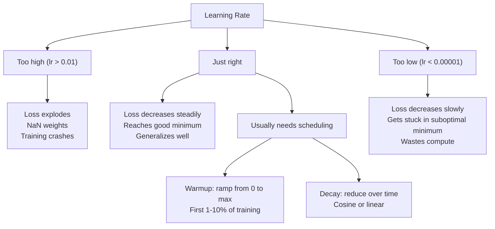
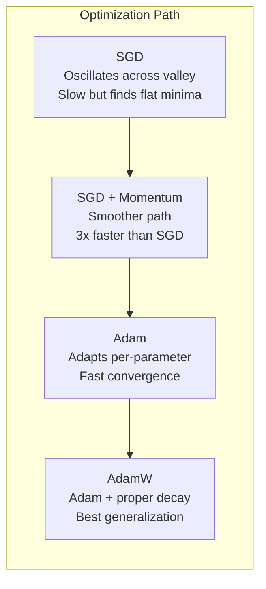
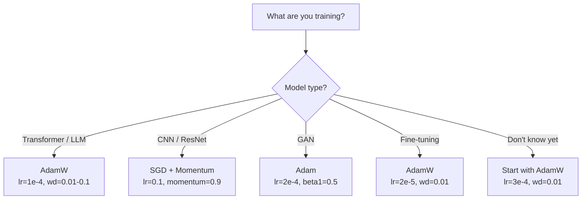

# Otimizadores

> Descenso gradual diz-te em que direção se mover. Não diz que te movas muito longe, nem diz que te movas muito rápido.

**Type:** Build
**Languages:** Python
**Prerequisites:** Lesson 03.05 (Loss Functions)
**Time:** ~75 minutes

## Objectivo de aprendizagem

- Usar Python desde zero para realizar SGD 带 momentum de SGD  Adami 和 AdamW Optimizers
-  Explicar correção de preconceito de Adam  como compensar treinamento precoce
- Mostra por que, na mesma missão, AdamW tem melhor capacidade de generalização do que L2 regularização
- Para transformadores, CNNs, GANs e ajustes finos, escolha de um optimizador e hiperparâmetros padrão

## 问题

Você já calculou o Gradiente. Você sabe que o número 4.721 de peso deve ser reduzido em 0,003 para reduzir a perda. Mas o número 0.003 é o que?

A descida do gradiente de vainilha em cada passo para cada parâmetro  aplica a mesma taxa de aprendizagem: w = w - lr * gradiente。 Isso produz três problemas, fazendo com que a formação da rede neural se torne muito dolorosa na prática。

Primeiro, os deslocamentos são muito pequenos. O descenso é muito pequeno, mas o progresso é muito pequeno. Você já viu esse fenómeno: o descenso é muito rápido e rápido, e depois entra na plataforma, não porque o modelo já está em movimento, mas porque ele está em deslocamento.

Segundo, para todos os parâmetros, usar a mesma taxa de aprendizagem é errado. Alguns pesos precisam ser reforçados significativamente. Outros pesos precisam apenas ser reforçados muito pouco.

Terceiro, pontos de sela. Em alto espaço, há uma grande área plana em que o Gradiente  aproxima-se de zero. A SGD de Vanilla pode subir a velocidade do Gradiente através dessas áreas, enquanto essa velocidade é praticamente próxima de zero. O modelo parece estar em uma área plana, mas não está em uma área plana.

Adam resolveu estes três problemas. Ele mantém duas médias em execução para cada parâmetro - gradiente médio, momento, processamento de oscilação) e gradiente quadrado médio, taxa adaptativa, processamento de diferentes dimensões).

## 概念

### Descenso de gradiente estocástico (SGD)

Otimizador de última geração.

```
w = w - lr * gradient
```

stochastic indica que você usa dados em mini-batch para estimar o gradiente, em vez de usar um conjunto completo de dados. Este ruído é realmente útil - ajuda a escapar dos mínimos locais mais altos.

A taxa de aprendizagem é única. Muito alta: perda de disseminação. Muito baixa: o treinamento vai demorar muito tempo. O melhor valor depende da arquitetura, dados, tamanho do lote, bem como da fase de treinamento atual. Para as redes modernas, o SGD de vanilla é típico de 0,01 a 0,1 mas mesmo durante um processo de treinamento, a taxa de aprendizagem ideal também vai mudar.

### Impulso

Os tipos de pequeno rol rol do monte são usados muito, mas é preciso. Não se pode apenas seguir o gradiente de avanço, mas manter uma velocidade, para acumular os gradientes passados.

```
m_t = beta * m_{t-1} + gradient
w = w - lr * m_t
```

Beta(normalmente em 0,9) controle reter muito informação histórica;; quando beta = 0,9 时, momento 大致等近 10 个 Gradientes 的平均值;;1/ (1 - 0,9) = 10);;

Por que isso pode modificar os oscilações: os gradientes de direção em direção a mesma vão acumulando-se. Os gradientes de direção de direção de volta e volta vão se contrapor.

Em condições muito difíceis, em um cenário de perdas, o SGD pode ser usado sozinho, necessitando de 10.000 passos.

### RMSProp

Primeiro método de aprendizagem adaptativa realmente eficaz por parâmetro ⋅ por Hinton em Coursera                                                                                                                                                                                                                                                                                                                                                                                                                                                                                                      

```
s_t = beta * s_{t-1} + (1 - beta) * gradient^2
w = w - lr * gradient / (sqrt(s_t) + epsilon)
```

S_t Seguir a média de execução dos gradientes quadrados. Continuar a ter maiores parâmetros de gradientes.

Isto resolveu todos os parâmetros usando a mesma taxa de aprendizagem. Um já tem um peso substancialmente atualizado.

Epsilon (normalmente 1e-8) vai em um determinado parâmetro  ainda não atualizado quando evitar a exclusão em zero.

### Adam: Momentum + RMSProp

Adam combinou duas ideias. Ele mantém duas médias móveis exponenciais para cada parâmetro.

```
m_t = beta1 * m_{t-1} + (1 - beta1) * gradient        (first moment: mean)
v_t = beta2 * v_{t-1} + (1 - beta2) * gradient^2       (second moment: variance)
```

**Bias correction**É a maioria das explicações que salta os detalhes essenciais. Em primeiro passo, m_1 = (1 - beta1) * gradiente. Quando beta1 = 0,9 时, é 0,1 * gradiente.

```
m_hat = m_t / (1 - beta1^t)
v_hat = v_t / (1 - beta2^t)
```

第 1 步且beta1 = 0,9 时:m_hat = m_1 / (1 - 0,9) = m_1 / 0.1 = 实际 Gradient。第 100 步时:(1 - 0.9^100) 约等于 1.0,因此, correção 消失──Bia correção para o anterior ~10 步非常重要,在 ~50 步后基本无关紧要──

更新公式:

```
w = w - lr * m_hat / (sqrt(v_hat) + epsilon)
```

Adam 默认值:lr = 0,001,beta1 = 0,9,beta2 = 0,999,epsilon = 1e-8。 Estes valores-默认 são aplicáveis a 80% dos problemas── quando não são utilizados, primeiro alterar lr── então alterar beta2── quase nunca alterar beta1 ou epsilon──

### AdamW: 正确处理 Desconto de peso

L2 regularização 会向损失 中添加兰布 * w^2──在瓦尼拉 SGD, this equivale à perda de peso(cada passo do peso 中减去兰布 * w)──在亚当中,这种等价关系会失效──

Loshchilov & Hutter's洞见是: quando você coloca L2 adicionado à perda, então deixe Adam 处理 Gradiente 时, adaptação de aprendizagem também irá diminuir term term regularização.

AdamW                                                                                                                                                                                                                                                                                                                                                                                                                                                                                                                            

```
w = w - lr * m_hat / (sqrt(v_hat) + epsilon) - lr * lambda * w
```

O termo de declínio de peso não é utilizado pelo fator adaptativo de Adão 缩放── cada parâmetro obtém a mesma proporção de contração──

Isto parece ser um pequeno detalhe. Não é. AdamW em quase todas as tarefas é mais fácil de obter do que a regularização de Adam + L2. É um PyTorch usado para treinar transformadores, modelos de difusão e a maioria das arquiteturas modernas.

### Taxa de aprendizagem: Hiperparâmetro mais importante



Se você apenas ajustar um hiperparâmetro, então ajustar a taxa de aprendizagem. A taxa de aprendizagem varia 10 vezes, mais importante que qualquer arquitetura que você faça.

- SGD: lr = 0,01 a 0,1
- Adam/AdamW: lr = 1e-4 a 3e-4
- Modelos pré-treinados para ajuste fino: lr = 1e-5 a 5e-5
- A taxa de aprendizagem de aquecimento: em 1-10% dos passos anteriores

### Optimizador em relação ao



### Cada tipo de Optimizer




```figure
optimizer-trajectory
```

## Construí-lo

### 步骤 1: SGD de vainilha

```python
class SGD:
    def __init__(self, lr=0.01):
        self.lr = lr

    def step(self, params, grads):
        for i in range(len(params)):
            params[i] -= self.lr * grads[i]
```

### 步骤 2: 带 Momentum de SGD

```python
class SGDMomentum:
    def __init__(self, lr=0.01, beta=0.9):
        self.lr = lr
        self.beta = beta
        self.velocities = None

    def step(self, params, grads):
        if self.velocities is None:
            self.velocities = [0.0] * len(params)
        for i in range(len(params)):
            self.velocities[i] = self.beta * self.velocities[i] + grads[i]
            params[i] -= self.lr * self.velocities[i]
```

### 步骤 3: Adão

```python
import math

class Adam:
    def __init__(self, lr=0.001, beta1=0.9, beta2=0.999, epsilon=1e-8):
        self.lr = lr
        self.beta1 = beta1
        self.beta2 = beta2
        self.epsilon = epsilon
        self.m = None
        self.v = None
        self.t = 0

    def step(self, params, grads):
        if self.m is None:
            self.m = [0.0] * len(params)
            self.v = [0.0] * len(params)

        self.t += 1

        for i in range(len(params)):
            self.m[i] = self.beta1 * self.m[i] + (1 - self.beta1) * grads[i]
            self.v[i] = self.beta2 * self.v[i] + (1 - self.beta2) * grads[i] ** 2

            m_hat = self.m[i] / (1 - self.beta1 ** self.t)
            v_hat = self.v[i] / (1 - self.beta2 ** self.t)

            params[i] -= self.lr * m_hat / (math.sqrt(v_hat) + self.epsilon)
```

### 步骤 4: AdamW

```python
class AdamW:
    def __init__(self, lr=0.001, beta1=0.9, beta2=0.999, epsilon=1e-8, weight_decay=0.01):
        self.lr = lr
        self.beta1 = beta1
        self.beta2 = beta2
        self.epsilon = epsilon
        self.weight_decay = weight_decay
        self.m = None
        self.v = None
        self.t = 0

    def step(self, params, grads):
        if self.m is None:
            self.m = [0.0] * len(params)
            self.v = [0.0] * len(params)

        self.t += 1

        for i in range(len(params)):
            self.m[i] = self.beta1 * self.m[i] + (1 - self.beta1) * grads[i]
            self.v[i] = self.beta2 * self.v[i] + (1 - self.beta2) * grads[i] ** 2

            m_hat = self.m[i] / (1 - self.beta1 ** self.t)
            v_hat = self.v[i] / (1 - self.beta2 ** self.t)

            params[i] -= self.lr * m_hat / (math.sqrt(v_hat) + self.epsilon)
            params[i] -= self.lr * self.weight_decay * params[i]
```

### 步骤 5:                                                                                                                                                                                                                                                             

Na lição 05 do conjunto de dados do círculo, use todos os quatro tipos de Optimizadores para treinar uma rede de dois níveis.

```python
import random

def sigmoid(x):
    x = max(-500, min(500, x))
    return 1.0 / (1.0 + math.exp(-x))

def make_circle_data(n=200, seed=42):
    random.seed(seed)
    data = []
    for _ in range(n):
        x = random.uniform(-2, 2)
        y = random.uniform(-2, 2)
        label = 1.0 if x * x + y * y < 1.5 else 0.0
        data.append(([x, y], label))
    return data


class OptimizerTestNetwork:
    def __init__(self, optimizer, hidden_size=8):
        random.seed(0)
        self.hidden_size = hidden_size
        self.optimizer = optimizer

        self.w1 = [[random.gauss(0, 0.5) for _ in range(2)] for _ in range(hidden_size)]
        self.b1 = [0.0] * hidden_size
        self.w2 = [random.gauss(0, 0.5) for _ in range(hidden_size)]
        self.b2 = 0.0

    def get_params(self):
        params = []
        for row in self.w1:
            params.extend(row)
        params.extend(self.b1)
        params.extend(self.w2)
        params.append(self.b2)
        return params

    def set_params(self, params):
        idx = 0
        for i in range(self.hidden_size):
            for j in range(2):
                self.w1[i][j] = params[idx]
                idx += 1
        for i in range(self.hidden_size):
            self.b1[i] = params[idx]
            idx += 1
        for i in range(self.hidden_size):
            self.w2[i] = params[idx]
            idx += 1
        self.b2 = params[idx]

    def forward(self, x):
        self.x = x
        self.z1 = []
        self.h = []
        for i in range(self.hidden_size):
            z = self.w1[i][0] * x[0] + self.w1[i][1] * x[1] + self.b1[i]
            self.z1.append(z)
            self.h.append(max(0.0, z))

        self.z2 = sum(self.w2[i] * self.h[i] for i in range(self.hidden_size)) + self.b2
        self.out = sigmoid(self.z2)
        return self.out

    def compute_grads(self, target):
        eps = 1e-15
        p = max(eps, min(1 - eps, self.out))
        d_loss = -(target / p) + (1 - target) / (1 - p)
        d_sigmoid = self.out * (1 - self.out)
        d_out = d_loss * d_sigmoid

        grads = [0.0] * (self.hidden_size * 2 + self.hidden_size + self.hidden_size + 1)
        idx = 0
        for i in range(self.hidden_size):
            d_relu = 1.0 if self.z1[i] > 0 else 0.0
            d_h = d_out * self.w2[i] * d_relu
            grads[idx] = d_h * self.x[0]
            grads[idx + 1] = d_h * self.x[1]
            idx += 2

        for i in range(self.hidden_size):
            d_relu = 1.0 if self.z1[i] > 0 else 0.0
            grads[idx] = d_out * self.w2[i] * d_relu
            idx += 1

        for i in range(self.hidden_size):
            grads[idx] = d_out * self.h[i]
            idx += 1

        grads[idx] = d_out
        return grads

    def train(self, data, epochs=300):
        losses = []
        for epoch in range(epochs):
            total_loss = 0.0
            correct = 0
            for x, y in data:
                pred = self.forward(x)
                grads = self.compute_grads(y)
                params = self.get_params()
                self.optimizer.step(params, grads)
                self.set_params(params)

                eps = 1e-15
                p = max(eps, min(1 - eps, pred))
                total_loss += -(y * math.log(p) + (1 - y) * math.log(1 - p))
                if (pred >= 0.5) == (y >= 0.5):
                    correct += 1
            avg_loss = total_loss / len(data)
            accuracy = correct / len(data) * 100
            losses.append((avg_loss, accuracy))
            if epoch % 75 == 0 or epoch == epochs - 1:
                print(f"    Epoch {epoch:3d}: loss={avg_loss:.4f}, accuracy={accuracy:.1f}%")
        return losses
```

## Use-o

Os PyTorch Optimizers 会 tratar grupos de parâmetros, clipping de gradientes e programação de taxa de aprendizagem:

```python
import torch
import torch.optim as optim

model = torch.nn.Sequential(
    torch.nn.Linear(784, 256),
    torch.nn.ReLU(),
    torch.nn.Linear(256, 10),
)

optimizer = optim.AdamW(model.parameters(), lr=3e-4, weight_decay=0.01)

scheduler = optim.lr_scheduler.CosineAnnealingLR(optimizer, T_max=100)

for epoch in range(100):
    optimizer.zero_grad()
    output = model(torch.randn(32, 784))
    loss = torch.nn.functional.cross_entropy(output, torch.randint(0, 10, (32,)))
    loss.backward()
    torch.nn.utils.clip_grad_norm_(model.parameters(), max_norm=1.0)
    optimizer.step()
    scheduler.step()
```

模式始终是:zero_grad、forward、loss、backward、(clip)、step、(schedule)。记住这个顺序──弄错它──例如在优化器.step() 之前调用 scheduler.step(((是细微 bug 的常见来源──

Para as CNNs, muitos praticantes ainda preferem usar o SGD de impulso (sgt = 0,1,momentum = 0,9,weight_decay = 1e-4), e não acompanhar o passo ou o cronograma cosínico.

## Entrega-o

本课产出:
- `outputs/prompt-optimizer-selector.md`-- um aplicativo para arquitetura arbitrária  escolher otimizador e taxa de aprendizagem

## 练习

1. 实现 Nesterov momentum, em que você está em lookahead 位置(w - lr * beta * v) em vez de atual posição calcular Gradiente。

2.  Realizar um cronograma de aquecimento de aprendizagem: em 10% das etapas do treinamento, entre 0 线性 ramp até max_lr, em seguida, decadência cosínica até 0 ⋅ comparar Adam + aquecimento com Adam sem aquecimento ⋅ medição em conjunto de dados de círculo ⋅ alcançar 90% de precisão ⋅ necessitar de quantas épocas⋅

3. Durante o treino de Adão, acompanhe a taxa de aprendizagem válida de cada parâmetro. A taxa de aprendizagem válida é lr * m_hat / (sqrt(v_hat) + eps) ⋅ desenhe a distribuição de taxas válidas após os 10、50 e 200 passos. Todos os parâmetros são atualizados à mesma velocidade?

4. 实现 gradiente clipping(conforme a norma global clipe) ・・・将max gradiente norma 设置为 1.0。使用较高学习率(Adam 的 lr=0.01)分别在有剪剪和无剪的情况下训练──统计 10 种种子中,有多少次运会发散(Loss 变为 NaN) ・・・

5. Em uma rede de grandes pesos, comparar Adam e AdamW── vai começar a classificar todos os pesos como [-5, 5] entre os valores de cadência ([[[[decaimento]]]] e [[decaimento]] de peso ([[decaimento]] = 0,1 trenagem 200 épocas── desenhar dois optimizadores trenagem trenagem trenagem trenagem trenagem trenagem trenagem trenagem trenagem trenagem trenagem trenagem trenagem trenagem trenagem trenagem trenagem trenagem trenagem trenagem trenagem trenagem trenagem trenagem trenagem trenagem trenagem trenagem trenagem trenagem trenagem trenagem trenagem trenagem trenagem trenagem trenagem trenagem trenagem trenagem trenagem trenagem trenagem trenagem trenagem trenagem trenagem trenagem trenagem trenagem trenagem trenagem trenagem trenagem trenagem trenagem trenagem trenagem trenagem trenagem trenagem trenagem trenagem trenagem trenagem trenagem trenagem trenagem trenagem trenagem trenagem trenagem trenagem trenagem trenagem trenagem trenagem trenagem trenagem trenagem trenagem trenagem trenagem trenagem trenagem trenagem trenagem trenagem trenagem trenagem trenagem trenagem trenagem trenagem trenagem trenagem trenagem trenagem trenagem trenagem trenagem trenagem trenagem trenagem trenagem trenagem trenagem trenagem trenagem tr

## 关键术语

| Term | 人们通常怎么说 | 它实际意味着什么 |
|------|----------------|----------------------|
| Learning rate | “Step size” | Gradient update 上的标量乘数；训练中影响最大的单个 hyperparameter |
| SGD | “Basic gradient descent” | Stochastic Gradient Descent：通过减去 lr * gradient 来更新 weights，Gradient 在 mini-batch 上计算 |
| Momentum | “Rolling ball analogy” | 过去 Gradients 的 exponential moving average；削弱振荡，并加速一致方向 |
| RMSProp | “Adaptive learning rate” | 用近期 Gradients 的 running RMS 除以每个 parameter 的 Gradient；均衡 learning rates |
| Adam | “The default optimizer” | 将 momentum（first moment）和 RMSProp（second moment）结合起来，并对初始 steps 进行 bias correction |
| AdamW | “Adam done right” | 带 decoupled weight decay 的 Adam；直接对 weights 应用 regularization，而不是通过 Gradient |
| Bias correction | “Warmup for running averages” | 除以 (1 - beta^t)，用于补偿 Adam 的 moment estimates 的零初始化 |
| Weight decay | “Shrink the weights” | 每一步减去 weight 值的一部分；一种惩罚大 weights 的 regularizer |
| Learning rate schedule | “Changing lr over time” | 在训练期间调整 learning rate 的函数；warmup + cosine decay 是现代默认方案 |
| Gradient clipping | “Capping the gradient norm” | 当 Gradient Vector 的 norm 超过阈值时对其进行缩放；防止 exploding gradient updates |

## 延伸阅读

- Kingma & Ba, Adam: Um Método para a Optimização Estocástica (2014) -- 原始 Adam paper,包含融合分析 和偏差修正 推导
- Loshchilov & Hutter, Descoupled Weight Decay Regularization (2017) -- provou a regularização de L2 em Adam e a perda de peso 不等价,并提出 AdamW
- Smith, Taxas de aprendizagem cíclicas para a formação de redes neurais (2017) --                                                                                                                                                                                                                                                                                                                                                                                                                                                                                                     
- Ruder, Uma visão geral de algoritmos de otimização de descendência gradativa (2016) -- 关于所有优化器 变体的最佳单篇综述,比较清晰,直觉解释也明确
