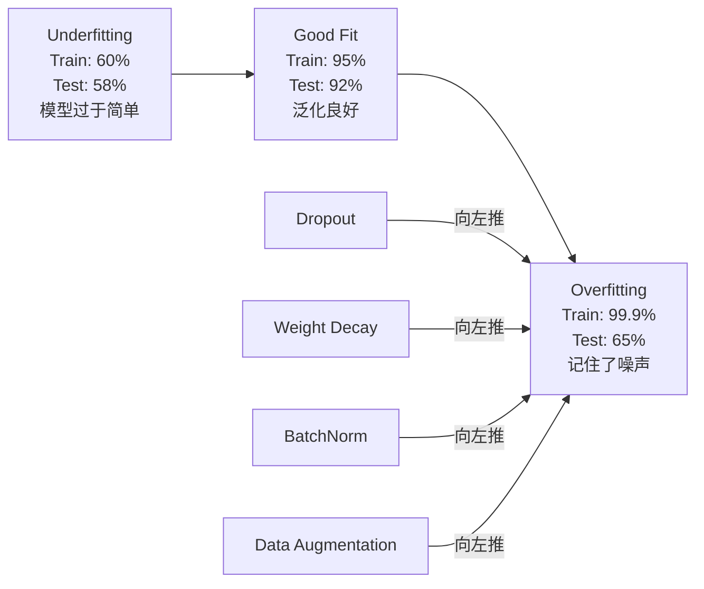
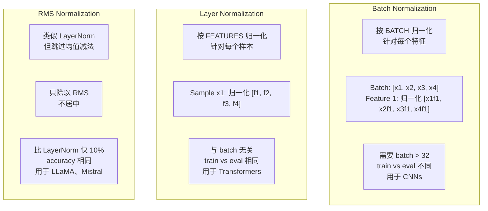
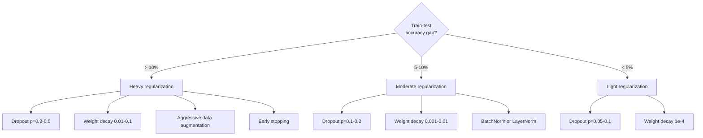

# Regularização

> Seu modelo alcança 99% nos dados de treinamento, mas apenas 60% nos dados de teste.

**Type:** Build
**Languages:** Python
**Prerequisites:** Lesson 03.06 (Optimizers)
**Time:** ~75 minutes

## Objectivo de aprendizagem
- Desde zero realizando com escala invertida de desvio de L2 de declínio de peso, normalização de lote, normalização de camada e RMSNorm
- Meter a lacuna de precisão dos testes de trem,并 através da regularização  experimentar o diagnóstico sobre-ajustamento
-  Explicar por que o Transformer utiliza LayerNorm e não BatchNorm, e por que os LLM modernos preferem RMSNorm
- De acordo com a gravidade do excesso de adaptação, aplicações de regularização correta  技术组合

## 问题
Uma rede neural com parâmetros suficientes para se lembrar de qualquer conjunto de dados não é uma hipótese. Zhang et al. (2017)                                                                                                                                                                                                                                                

É um problema de sobre-ajustamento, e o modelo é cada vez maior, o problema é cada vez mais grave. GPT-3 tem 175 bilhões de parâmetros.

 Diferença entre o desempenho de treinamento e o desempenho de teste é a diferença de sobre-ajuste. Cada técnica desta aula ataca essa diferença de diferentes ângulos.Dropout obrigar a rede a não depender de nenhum neurônio único.Desaque de peso prevenir qualquer peso individual a ser muito grande.Normalização de lote: Loss landscape, permitindo que o Optimizer encontre um mínimo mais plano, mais generalizável.Normalização de camada faz o mesmo, mas pode funcionar em batches normalizadas  sequência de tamanho de trabalho.RMSNorm Paseando o cálculo de valor médio, deixe-o rápido em cerca de 10%. Cada técnica é muito simples.Combinação, são as diferenças entre o modelo de memória e o modelo generalizado.

## 概念
### O Espectro de Excesso de Ajuste

Cada modelo está localizado em uma determinada posição, desde o sub-ajustamento (exceto simples, não captado) até o sobreajustamento (exceto complexo, até o captamento de ruído).



### Desistência

A mais simples regularização é técnica, mas há uma explicação mais elegante. Durante o treino, a probabilidade de que a saída de cada neurônio seja de zero é definida.

```
output = activation(z) * mask    where mask[i] ~ Bernoulli(1 - p)
```

Quando p = 0,5 , cada passagem avançada coloca metade dos neurônios em zero. A rede deve aprender o redundante, pois não pode prever quais neurônios podem ser usados. Isso impede a co-adaptação, ou seja, que os neurônios dependam da existência de outros neurônios específicos.

Ensemble  explicação: uma rede com N 个神经元并使用脱落的网络会创建2^N 个可能的子网络 (conjuntura de todas as neurais) ⋅ use dropout 训练近似于同时训练所有2^N 个子网络,每个都在不同的小组上训练──测试时,你使用所有神经元(无脱落),并将输出按 (1 - p)缩缩,缩缩,以匹配训练期间的期望值──这等于对2^N 个子网络的预测平均单个模型得到一个巨大的集合──

实践中,缩放会在训练期间应用,而不是测试期间应用(reversed dropout):

```
During training:  output = activation(z) * mask / (1 - p)
During testing:   output = activation(z)   (no change needed)
```

É melhor, porque o código de teste não precisa de ser abandonado.

默认比例:Transformer 使用 p = 0,1,MLPs 使用 p = 0,5,CNNs 使用 p = 0,2-0,3──更高的 dropout = 更强的规范化 = 更高的不适应风险──

### Desconto de peso (regularização L2)

Terá o direito de propriedade de peso quadrado

```
total_loss = task_loss + (lambda / 2) * sum(w_i^2)
```

O gradiente de regularização é lambda * w。 o que significa que em cada passo, cada peso será reduzido em proporção à sua grandeza em proporção a zero。 o peso grande é punido mais fortemente。 o modelo é impulsionado sem um único peso dominante.

Por que isso ajuda a generalizar: o modelo de sobre-excesso de peso geralmente tem um peso maior, aumentando o ruído dos dados de treinamento.

O hiperparâmetro lambda 控制强度──valor típico:

- Transformador 上的 AdamW Utilizar 0.01
- As emissoras de televisão de alta SGD utilizam 1e-4
- 严重 overfit 的模型使用 0.1

Como se pode ver na lição 06 discussão: perda de peso 和 L2 regularização, em SGD, mas em Adam, em em em em em em em em em em em em em em em em em em em em em em em em em em em em em em em em em em em em em em em em em em em em em em em em em em em em em em em em em em em em em em em em em em em em em em em em em em em em em em em em em em em em em em em em em em em em em em em em em em em em em em em em em em em em em em em em em em em em em em em em em em em em em em em em em em em em em em em em em em em em em em em em em em em em em em em em em em em em em em em em em em em em em em em em em em em em em em em em em em em em em em em em em em em em em em em em em em em em em em em em em em em em em em em em em em em em em em em em em em em em em em em em em em em em em em em em em em em em em em em em em em em em em em em em em em em em em em em em em em em em em em em em em em em em em em em em em em em em em em em em em em em em em em em em em em em em em em em em em em em em em em em em em em em em em em em em em em em em em em em em em em em em em em em em em em em em em em em em em em em em em em em em em em em em em em em em em em em em em em em em em em em em em em em em em em em em em em em em em em em em em em em em em em em em em em em em em em em em em em em em em em em em em em em em em em em em em em em em em em em em em em em em em em em em em em em em em em em em em em em em em em em em em em em em em em em em em em em em em em em em em em em em em em em em em em em em em em em em em em em em em

### Normalização de lote

Antes de transmitir a saída de cada camada para a camada seguinte, primeiro a redução em mini-parcela.

对于某一层一批激活:

```
mu = (1/B) * sum(x_i)           (batch mean)
sigma^2 = (1/B) * sum((x_i - mu)^2)   (batch variance)
x_hat = (x_i - mu) / sqrt(sigma^2 + eps)   (normalize)
y = gamma * x_hat + beta        (scale and shift)
```

Gamma e beta são parâmetros que podem ser aprendidos, permitindo que a rede, em melhores condições, possa revogar essa normalização. Sem eles, você forçará todas as saídas de cada camada a se tornarem em valores mínimos, e isso não é necessariamente o que a rede quer.

**Training vs inference split:**Durante o treino, mu 和 sigma proveniente do mini-batch anterior. Durante o treino, você usa média acumulada de corrida durante o treino.

BatchNorm 为什么有效仍有争议──原论文声称它减少了"internal covariate shift" (conforme os primeiros níveis de atualização, a distribuição de entrada de níveis varia)──Santurkar et al. (2018) 表明这个解释是错的──真正原因是:BatchNorm 让损失景观更平滑──Gradientes 更具预测性,Lipschitz constants 更小,Optimizer security可以采取更大的步长──这就是为什么BatchNorm 允许你使用更高的学习率 并更快收──

BatchNorm tem uma limitação fundamental: depende das estatísticas de loteamento. Quando o tamanho do loteamento é de 1 时, o valor médio e a diferença de tamanho não têm significado. Quando o loteamento é muito pequeno, o ruído da quantidade de dados é muito grande, prejudica a performance.

### Normalização de camadas

Em dimensão de características, em vez de em dimensão de lote.

```
mu = (1/D) * sum(x_j)           (feature mean)
sigma^2 = (1/D) * sum((x_j - mu)^2)   (feature variance)
x_hat = (x_j - mu) / sqrt(sigma^2 + eps)
y = gamma * x_hat + beta
```

D é a dimensão da série. Cada modelo é independente de tamanho do lote. É por isso que o transformador usa LayerNorm e não o BatchNorm.

LayerNorm 会应用在每个自我注意区 和每个 feed-forward block 之后(Post-LN),或应用在它们之前(Pre-LN,训练时更稳定) 

### RMSNorm

Não fazer valor médio de redução legal LayerNorm── por Zhang & Sennrich (2019)  proposta──

```
rms = sqrt((1/D) * sum(x_j^2))
y = gamma * x / rms
```

Quanto a estes, não há valor médio calculado, não há beta parâmetros. O resultado observado é:

LLaMA、LLaMA 2、LLaMA 3、Mistral e a maioria dos LLM modernos usam RMSNorm em vez de LayerNorm── em bilhões de parâmetros e trilhões de Tokens, esta economia de 10% é muito significativa──

### Comparação de normalização



### Como Regularização de Augmentamento de Dados

Não é uma modificação do modelo, mas uma modificação dos dados.

- Imagens: colheita aleatória, virada, rotação, nervosismo de cor, corte
- Texto: substituição de sinônimos, tradução de volta, exclusão aleatória
- Áudio: tempo de estiramento, mudança de tom, adição de ruído

 efeito e regularização É o mesmo: ele aumenta a tamanho válido do conjunto de treinamento, tornando o modelo mais difícil de lembrar de um padrão específico.

### Parar cedo

O regulador mais simples é: quando a perda de validação  começar a subir 停止训练──此时模型还没有过── na prática, você em cada época acompanha a perda de validação, conserva o melhor modelo,并继续训练一个"耐心" 窗口(normalmente 5-20 épocas)── Se a perda de validação não melhora na janela de paciência,就停止并载保存的最佳模型──

### Quando aplicar o que




```figure
l2-regularization
```

## Construí-lo
### 步骤 1: Desistência (tren e modo Eval)

```python
import random
import math


class Dropout:
    def __init__(self, p=0.5):
        self.p = p
        self.training = True
        self.mask = None

    def forward(self, x):
        if not self.training:
            return list(x)
        self.mask = []
        output = []
        for val in x:
            if random.random() < self.p:
                self.mask.append(0)
                output.append(0.0)
            else:
                self.mask.append(1)
                output.append(val / (1 - self.p))
        return output

    def backward(self, grad_output):
        grads = []
        for g, m in zip(grad_output, self.mask):
            if m == 0:
                grads.append(0.0)
            else:
                grads.append(g / (1 - self.p))
        return grads
```

### 步骤 2: L2 Descaimento de peso

```python
def l2_regularization(weights, lambda_reg):
    penalty = 0.0
    for w in weights:
        penalty += w * w
    return lambda_reg * 0.5 * penalty

def l2_gradient(weights, lambda_reg):
    return [lambda_reg * w for w in weights]
```

### 步骤 3: Normalização de lote

```python
class BatchNorm:
    def __init__(self, num_features, momentum=0.1, eps=1e-5):
        self.gamma = [1.0] * num_features
        self.beta = [0.0] * num_features
        self.eps = eps
        self.momentum = momentum
        self.running_mean = [0.0] * num_features
        self.running_var = [1.0] * num_features
        self.training = True
        self.num_features = num_features

    def forward(self, batch):
        batch_size = len(batch)
        if self.training:
            mean = [0.0] * self.num_features
            for sample in batch:
                for j in range(self.num_features):
                    mean[j] += sample[j]
            mean = [m / batch_size for m in mean]

            var = [0.0] * self.num_features
            for sample in batch:
                for j in range(self.num_features):
                    var[j] += (sample[j] - mean[j]) ** 2
            var = [v / batch_size for v in var]

            for j in range(self.num_features):
                self.running_mean[j] = (1 - self.momentum) * self.running_mean[j] + self.momentum * mean[j]
                self.running_var[j] = (1 - self.momentum) * self.running_var[j] + self.momentum * var[j]
        else:
            mean = list(self.running_mean)
            var = list(self.running_var)

        self.x_hat = []
        output = []
        for sample in batch:
            normalized = []
            out_sample = []
            for j in range(self.num_features):
                x_h = (sample[j] - mean[j]) / math.sqrt(var[j] + self.eps)
                normalized.append(x_h)
                out_sample.append(self.gamma[j] * x_h + self.beta[j])
            self.x_hat.append(normalized)
            output.append(out_sample)
        return output
```

### 步骤 4: Normalização de camadas

```python
class LayerNorm:
    def __init__(self, num_features, eps=1e-5):
        self.gamma = [1.0] * num_features
        self.beta = [0.0] * num_features
        self.eps = eps
        self.num_features = num_features

    def forward(self, x):
        mean = sum(x) / len(x)
        var = sum((xi - mean) ** 2 for xi in x) / len(x)

        self.x_hat = []
        output = []
        for j in range(self.num_features):
            x_h = (x[j] - mean) / math.sqrt(var + self.eps)
            self.x_hat.append(x_h)
            output.append(self.gamma[j] * x_h + self.beta[j])
        return output
```

### 步骤 5: RMSNorm

```python
class RMSNorm:
    def __init__(self, num_features, eps=1e-6):
        self.gamma = [1.0] * num_features
        self.eps = eps
        self.num_features = num_features

    def forward(self, x):
        rms = math.sqrt(sum(xi * xi for xi in x) / len(x) + self.eps)
        output = []
        for j in range(self.num_features):
            output.append(self.gamma[j] * x[j] / rms)
        return output
```

### 步骤 6: Formação com e sem regularização

```python
def sigmoid(x):
    x = max(-500, min(500, x))
    return 1.0 / (1.0 + math.exp(-x))


def make_circle_data(n=200, seed=42):
    random.seed(seed)
    data = []
    for _ in range(n):
        x = random.uniform(-2, 2)
        y = random.uniform(-2, 2)
        label = 1.0 if x * x + y * y < 1.5 else 0.0
        data.append(([x, y], label))
    return data


class RegularizedNetwork:
    def __init__(self, hidden_size=16, lr=0.05, dropout_p=0.0, weight_decay=0.0):
        random.seed(0)
        self.hidden_size = hidden_size
        self.lr = lr
        self.dropout_p = dropout_p
        self.weight_decay = weight_decay
        self.dropout = Dropout(p=dropout_p) if dropout_p > 0 else None

        self.w1 = [[random.gauss(0, 0.5) for _ in range(2)] for _ in range(hidden_size)]
        self.b1 = [0.0] * hidden_size
        self.w2 = [random.gauss(0, 0.5) for _ in range(hidden_size)]
        self.b2 = 0.0

    def forward(self, x, training=True):
        self.x = x
        self.z1 = []
        self.h = []
        for i in range(self.hidden_size):
            z = self.w1[i][0] * x[0] + self.w1[i][1] * x[1] + self.b1[i]
            self.z1.append(z)
            self.h.append(max(0.0, z))

        if self.dropout and training:
            self.dropout.training = True
            self.h = self.dropout.forward(self.h)
        elif self.dropout:
            self.dropout.training = False
            self.h = self.dropout.forward(self.h)

        self.z2 = sum(self.w2[i] * self.h[i] for i in range(self.hidden_size)) + self.b2
        self.out = sigmoid(self.z2)
        return self.out

    def backward(self, target):
        eps = 1e-15
        p = max(eps, min(1 - eps, self.out))
        d_loss = -(target / p) + (1 - target) / (1 - p)
        d_sigmoid = self.out * (1 - self.out)
        d_out = d_loss * d_sigmoid

        for i in range(self.hidden_size):
            d_relu = 1.0 if self.z1[i] > 0 else 0.0
            d_h = d_out * self.w2[i] * d_relu
            self.w2[i] -= self.lr * (d_out * self.h[i] + self.weight_decay * self.w2[i])
            for j in range(2):
                self.w1[i][j] -= self.lr * (d_h * self.x[j] + self.weight_decay * self.w1[i][j])
            self.b1[i] -= self.lr * d_h
        self.b2 -= self.lr * d_out

    def evaluate(self, data):
        correct = 0
        total_loss = 0.0
        for x, y in data:
            pred = self.forward(x, training=False)
            eps = 1e-15
            p = max(eps, min(1 - eps, pred))
            total_loss += -(y * math.log(p) + (1 - y) * math.log(1 - p))
            if (pred >= 0.5) == (y >= 0.5):
                correct += 1
        return total_loss / len(data), correct / len(data) * 100

    def train_model(self, train_data, test_data, epochs=300):
        history = []
        for epoch in range(epochs):
            total_loss = 0.0
            correct = 0
            for x, y in train_data:
                pred = self.forward(x, training=True)
                self.backward(y)
                eps = 1e-15
                p = max(eps, min(1 - eps, pred))
                total_loss += -(y * math.log(p) + (1 - y) * math.log(1 - p))
                if (pred >= 0.5) == (y >= 0.5):
                    correct += 1
            train_loss = total_loss / len(train_data)
            train_acc = correct / len(train_data) * 100
            test_loss, test_acc = self.evaluate(test_data)
            history.append((train_loss, train_acc, test_loss, test_acc))
            if epoch % 75 == 0 or epoch == epochs - 1:
                gap = train_acc - test_acc
                print(f"    Epoch {epoch:3d}: train_acc={train_acc:.1f}%, test_acc={test_acc:.1f}%, gap={gap:.1f}%")
        return history
```

## Use-o
PyTorch em forma modular fornece todas as normalizações e regularização:

```python
import torch
import torch.nn as nn

model = nn.Sequential(
    nn.Linear(784, 256),
    nn.BatchNorm1d(256),
    nn.ReLU(),
    nn.Dropout(0.3),
    nn.Linear(256, 128),
    nn.BatchNorm1d(128),
    nn.ReLU(),
    nn.Dropout(0.3),
    nn.Linear(128, 10),
)

model.train()
out_train = model(torch.randn(32, 784))

model.eval()
out_test = model(torch.randn(1, 784))
```

`model.train()`- Não .`model.eval()`切换非常关键──它会开/关闭 drop-out,并告诉BatchNorm  使用批量统计 还是运行统计──推理前忘记调用 `model.eval()`É um dos bugs mais comuns no Deep Learning. A precisão do teste vai mudar, porque o abandono está ainda em estado ativo, enquanto o BatchNorm ainda usa estatísticas de mini-batch.

对于Transformer,模式不同:

```python
class TransformerBlock(nn.Module):
    def __init__(self, d_model=512, nhead=8, dropout=0.1):
        super().__init__()
        self.attention = nn.MultiheadAttention(d_model, nhead, dropout=dropout)
        self.norm1 = nn.LayerNorm(d_model)
        self.ff = nn.Sequential(
            nn.Linear(d_model, d_model * 4),
            nn.GELU(),
            nn.Linear(d_model * 4, d_model),
            nn.Dropout(dropout),
        )
        self.norm2 = nn.LayerNorm(d_model)
        self.dropout = nn.Dropout(dropout)

    def forward(self, x):
        attended, _ = self.attention(x, x, x)
        x = self.norm1(x + self.dropout(attended))
        x = self.norm2(x + self.ff(x))
        return x
```

LayerNorm, em vez de BatchNorm.

## Entrega-o
本课会产出:
- `outputs/prompt-regularization-advisor.md`-- um rápido, para diagnosticar o excesso de aptidão e sugerir estratégias de regularização correta

## 练习
1. Para a realização de dados 2D drop-out espacial: não abandonar um único neurônio, mas abandonar todos os canais de recursos.

2. Use quatro tipos de treinamento: dois são necessários, dois são necessários, dois são necessários, dois são necessários, dois são necessários, dois são necessários, dois são necessários, dois são necessários, dois são necessários, dois são necessários, dois são necessários, dois são necessários, dois são necessários, dois são necessários, dois são necessários, dois são necessários, dois são necessários, dois são necessários, dois são necessários, dois são necessários, dois são necessários, dois são necessários, dois são necessários, dois são necessários, dois são necessários, dois são necessários, dois são necessários, dois são necessários, dois são necessários, dois são necessários, dois são necessários, dois são necessários, dois são necessários, dois são necessários, dois são necessários, dois são necessários, dois são necessários, dois são necessários, dois são necessários, dois são necessários, dois são necessários, dois são necessários, dois são necessários, dois são necessários, dois são necessários, dois são necessários, dois são necessários, dois são necessários, dois são necessários, dois são necessários, dois são necessários, dois são necessários, dois são necessários, dois são necessários, dois são necessários, dois são necessários, e dois são necessários, e dois são necessários.

3. Em sua rede de conjunto de dados de círculo, entre a camada oculta e a ativação, adicione uma camada BatchNorm. Em taxas de aprendizagem de 0.01、0.05 和 0.1 下,分別使用和不使用BatchNorm 訓練──BatchNorm 应该能在瓦尼拉网络 发散的更高的学习率 下实现稳定训练──

4. 实现早期停止: cada época acompanhar a perda de teste, conservar o melhor peso, se a perda de teste 连续 20 个时代 没有改善则停止――运行规律化网络 1000 个时代――报告哪个时代 拥有最佳测试精度,以及你节省了多少时代的计算――

5. Em uma rede de 4 camadas (( não apenas 2 camadas) comparar LayerNorm e RMSNorm.

## 关键术语
| Term | What people say | What it actually means |
|------|----------------|----------------------|
| Overfitting | "模型记住了数据" | 当模型的训练表现显著高于测试表现时，表示它学到了噪声而不是信号 |
| Regularization | "防止 overfitting" | 任何约束模型复杂度以改善泛化的技术：dropout、weight decay、normalization、augmentation |
| Dropout | "随机删除神经元" | 训练期间以概率 p 将随机神经元置零，迫使模型学习冗余表示；等价于训练一个 ensemble |
| Weight decay | "L2 penalty" | 每一步通过减去 lambda * w 将所有权重向零收缩；通过权重大小惩罚复杂度 |
| Batch normalization | "按 batch 归一化" | 训练期间使用 batch statistics、推理期间使用 running averages，在 batch 维度上对层输出进行归一化 |
| Layer normalization | "按样本归一化" | 在每个样本内部跨特征归一化；与 batch 无关，用于 batch size 可变的 Transformer |
| RMSNorm | "没有均值的 LayerNorm" | Root mean square normalization；从 LayerNorm 中去掉均值减法，以相同 accuracy 获得 10% 加速 |
| Early stopping | "在 overfit 前停止" | 当 validation loss 不再改善时停止训练；最简单的 regularizer，通常与其他方法一起使用 |
| Data augmentation | "用更少数据生成更多数据" | 变换训练输入（flip、crop、noise）以增加有效数据集大小，并迫使模型学习不变性 |
| Generalization gap | "Train-test split" | 训练表现与测试表现之间的差异；regularization 的目标是最小化这个 gap |

## 延伸阅读
- Srivastava et al., "Dropout: Uma maneira simples de evitar redes neurais de overfitting" (2014) -- 原始 dropout 论文,包含 ensemble 解释和大量实验
- Ioffe & Szegedy, "Batch Normalization: Accelerating Deep Network Training by Reducing Internal Covariate Shift" (2015) -- Introdução BatchNorm  e seu processo de treinamento, é um dos mais citados Deep Learning 论文
- Zhang & Sennrich, "Rot Mean Square Layer Normalization" (2019) --  demonstrar RMSNorm 能以更少计算匹配 LayerNorm precisão; foi adotado por LLaMA 和 Mistral 采用
- Zhang et al., "Compreender Deep Learning Requere Repenso Generalização" (2017) -- 里程碑论文, mostrar Rede Neural pode se lembrar de qualquer marca, desafiou a tradicional perspectiva generalizada
