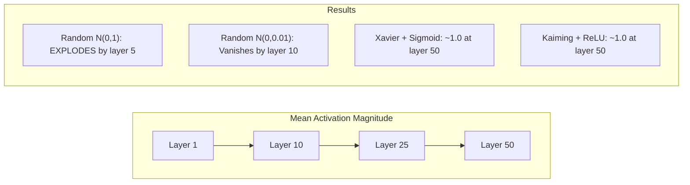
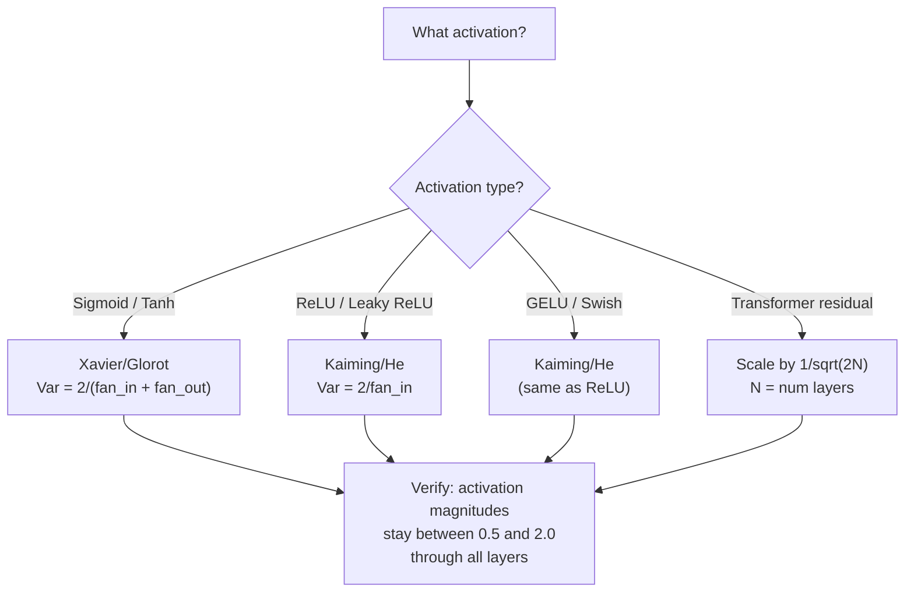

# Peso Inicialização e treinamento estabilidade

> Iniciação errada, o treino não pode começar. Iniciação é uma forma de treino.

**Type:** Build
**Languages:** Python
**Prerequisites:** Lesson 03.04 (Activation Functions), Lesson 03.07 (Regularization)
**Time:** ~90 minutes

## Objectivo de aprendizagem
- 实现 zero、random、Xavier/Glorot 和 Kaiming/He inicialização 策略,并测量它们对50层中激活幅度的影响
- 推导为什么 Xavier init 使用 Var(w) = 2/(fan_in + fan_out), enquanto Kaiming 使用 Var(w) = 2/fan_in
- 演示零初始化的对称性 问题,并解释为什么仅靠随机尺度还不够
- 将正确的初始化 策略匹配到激活函数:sigmoid/tanh 使用 Xavier,ReLU/GELU 使用 Kaiming

## 问题
Colocar todos os pesos em zero. Todos os neurônios têm a mesma função, recebem o mesmo gradiente e atualizam de forma igual. Depois de 10.000 épocas, a sua camada oculta de 512 neurônios continua a ser apenas 512 cópias do mesmo neurônio.

Atividades vão explodir em toda a rede. Até a camada 10, o valor número alcança 1e15; até a camada 20, elas se desbordam para o infinito.

A partir da distribuição normal padrão, o início aleatório é válido em 3 níveis, até 50 níveis, o sinal se acumulará para zero ou explodirá para o infinito, dependendo da escala aleatória, seja pequena ou pequena.

A inicialização de peso é a decisão mais menos avaliada do Deep Learning. Arquitetura terá artigos. Os optimistas terão artigos. A inicialização geralmente só recebe um comentário. Mas se aqui estiver errado, tudo o resto não importa.

## 概念
### O problema da simetria

Uma camada em cada neurona tem a mesma estrutura: com pesos  multiplicando entradas, adicionando viés, ativação de aplicação. Se todos os pesos começam a partir do mesmo valor, cada neurona calcula a mesma saída. Durante a propagação de volta, cada neurona recebe o mesmo gradiente. Durante a fase de atualização, cada neurona muda a mesma quantidade.

Você está preso. A rede tem centenas de parâmetros, mas todos se movem em simultâneo. Isso é chamado de simetria, e a inicialização aleatória é um método violento para quebrar. Cada neurona começa em uma posição diferente no espaço de peso, por isso cada neurona aprende características diferentes.

Mas o acaso ainda não é suficiente. A escala de acaso decide se a rede pode treinar.

### Propagação de variações através de camadas

考虑一个具有风扇_in 个输入的单层:

```
z = w1*x1 + w2*x2 + ... + w_n*x_n
```

Se cada peso wi provenientes da variação é a distribuição de Var(w), e cada entrada xi de variação é Var(x), então a variação de saída é:

```
Var(z) = fan_in * Var(w) * Var(x)
```

Se Var(w) = 1 且 fan_in = 512, então a variância de saída é a variância de entrada de 512 倍──passado 10 层:512^10 = 1.2e27── seu sinal 已爆炸──

Se Var(w) = 0,001, então variação de saída Cada nível em 0,001 * 512 = 0,512 缩小──经过 10 层:0.512^10 = 0.00013──Suo sinal 已消失──

目標:选择 Var(w), fazendo Var(z) = Var(x)。 Magnitude do sinal em cada nível manter-se constante。

### Xavier/Glorot Inicialização

Glorot e Bengio (2010) 推导了适用于 sigmoid 和 tanh ativações 的解──为了在前和后的通过 中都保持变异恒定:

```
Var(w) = 2 / (fan_in + fan_out)
```

实践中,pesos de:

```
w ~ Uniform(-limit, limit)  where limit = sqrt(6 / (fan_in + fan_out))
```

Ou:

```
w ~ Normal(0, sqrt(2 / (fan_in + fan_out)))
```

Isto é eficaz, porque a sigmoide e o tanh estão perto de zero, e as ativas positivas após a inicialização estão bem localizadas nesta região.

### Inicialização Kaiming/He

ReLU vai matar metade das saídas (todas as negativas são transformadas em zero) ⋅ válido fan_in ⋅ redução, porque em média para ver metade das entradas é colocada em zero. Xavier init ⋅ não considera isso - ele subestimou a variação necessária.

He et al. (2015) 调整了公式:

```
Var(w) = 2 / fan_in
```

Pesos de distribuição de:

```
w ~ Normal(0, sqrt(2 / fan_in))
```

O número 2 utiliza para compensar a ReLU vai colocar metade das ativações em zero. Não há sinal. Cada camada vai diminuir cerca de 0,5 vezes.

### Inicialização do transformador

GPT-2 introduziu outro modelo. As conexões residuais vão aumentar a saída de cada subcamada para a sua entrada:

```
x = x + sublayer(x)
```

Cada vez mais, a variação aumenta. Para N 个残留层, a variação aumenta em N 成比例. GPT-2 会将残留层的重量 按1/sqrt (n) 缩缩,其中 N 是层数――这能保持累积信号大小 稳定――

Llama 3 ((405B parâmetros,126 camadas) utilizou um esquema semelhante.

```mermaid
flowchart TD
    subgraph "Zero Init"
        Z1["Layer 1<br/>All weights = 0"] --> Z2["Layer 2<br/>All neurons identical"]
        Z2 --> Z3["Layer 3<br/>Still identical"]
        Z3 --> ZR["Result: 1 effective neuron<br/>regardless of width"]
    end

    subgraph "Xavier Init"
        X1["Layer 1<br/>Var = 2/(fan_in+fan_out)"] --> X2["Layer 2<br/>Signal stable"]
        X2 --> X3["Layer 50<br/>Signal stable"]
        X3 --> XR["Result: Trains with<br/>sigmoid/tanh"]
    end

    subgraph "Kaiming Init"
        K1["Layer 1<br/>Var = 2/fan_in"] --> K2["Layer 2<br/>Signal stable"]
        K2 --> K3["Layer 50<br/>Signal stable"]
        K3 --> KR["Result: Trains with<br/>ReLU/GELU"]
    end
```



###  através de 50 níveis de magnitude de ativação



### Escolhendo a intenção certa




```figure
weight-init-variance
```

## Construí-lo
### 步骤 1: Estratégias de inicialização

Inicialmente, a matriz de peso é de quatro formas.

```python
import math
import random


def zero_init(fan_in, fan_out):
    return [[0.0 for _ in range(fan_in)] for _ in range(fan_out)]


def random_init(fan_in, fan_out, scale=1.0):
    return [[random.gauss(0, scale) for _ in range(fan_in)] for _ in range(fan_out)]


def xavier_init(fan_in, fan_out):
    std = math.sqrt(2.0 / (fan_in + fan_out))
    return [[random.gauss(0, std) for _ in range(fan_in)] for _ in range(fan_out)]


def kaiming_init(fan_in, fan_out):
    std = math.sqrt(2.0 / fan_in)
    return [[random.gauss(0, std) for _ in range(fan_in)] for _ in range(fan_out)]
```

### 步骤 2: Funções de ativação

Precisamos de sigmoid, tanh e ReLU, para fazer testes com cada estratégia inicial e sua ativação prevista.

```python
def sigmoid(x):
    x = max(-500, min(500, x))
    return 1.0 / (1.0 + math.exp(-x))


def tanh_act(x):
    return math.tanh(x)


def relu(x):
    return max(0.0, x)
```

### 步骤 3: Passagem para a frente através de 50 camadas

让随机数据 通过一个深度网络,并测量每一层的平均激活大小──

```python
def forward_deep(init_fn, activation_fn, n_layers=50, width=64, n_samples=100):
    random.seed(42)
    layer_magnitudes = []

    inputs = [[random.gauss(0, 1) for _ in range(width)] for _ in range(n_samples)]

    for layer_idx in range(n_layers):
        weights = init_fn(width, width)
        biases = [0.0] * width

        new_inputs = []
        for sample in inputs:
            output = []
            for neuron_idx in range(width):
                z = sum(weights[neuron_idx][j] * sample[j] for j in range(width)) + biases[neuron_idx]
                output.append(activation_fn(z))
            new_inputs.append(output)
        inputs = new_inputs

        magnitudes = []
        for sample in inputs:
            magnitudes.append(sum(abs(v) for v in sample) / width)
        mean_mag = sum(magnitudes) / len(magnitudes)
        layer_magnitudes.append(mean_mag)

    return layer_magnitudes
```

### 步骤 4: O Experimento

运行所有组合:zero init、random N(0,1)、random N(0,0.01)、Xavier com sigmoid、Xavier com tanh、Kaiming com ReLU──打印关键层的大小──

```python
def run_experiment():
    configs = [
        ("Zero init + Sigmoid", lambda fi, fo: zero_init(fi, fo), sigmoid),
        ("Random N(0,1) + ReLU", lambda fi, fo: random_init(fi, fo, 1.0), relu),
        ("Random N(0,0.01) + ReLU", lambda fi, fo: random_init(fi, fo, 0.01), relu),
        ("Xavier + Sigmoid", xavier_init, sigmoid),
        ("Xavier + Tanh", xavier_init, tanh_act),
        ("Kaiming + ReLU", kaiming_init, relu),
    ]

    print(f"{'Strategy':<30} {'L1':>10} {'L5':>10} {'L10':>10} {'L25':>10} {'L50':>10}")
    print("-" * 80)

    for name, init_fn, act_fn in configs:
        mags = forward_deep(init_fn, act_fn)
        row = f"{name:<30}"
        for idx in [0, 4, 9, 24, 49]:
            val = mags[idx]
            if val > 1e6:
                row += f" {'EXPLODED':>10}"
            elif val < 1e-6:
                row += f" {'VANISHED':>10}"
            else:
                row += f" {val:>10.4f}"
        print(row)
```

### 步骤 5: Demonstração de Simetria

- Não. - Não.

```python
def symmetry_demo():
    random.seed(42)
    weights = zero_init(2, 4)
    biases = [0.0] * 4

    inputs = [0.5, -0.3]
    outputs = []
    for neuron_idx in range(4):
        z = sum(weights[neuron_idx][j] * inputs[j] for j in range(2)) + biases[neuron_idx]
        outputs.append(sigmoid(z))

    print("\nSymmetry Demo (4 neurons, zero init):")
    for i, out in enumerate(outputs):
        print(f"  Neuron {i}: output = {out:.6f}")
    all_same = all(abs(outputs[i] - outputs[0]) < 1e-10 for i in range(len(outputs)))
    print(f"  All identical: {all_same}")
    print(f"  Effective parameters: 1 (not {len(weights) * len(weights[0])})")
```

### 步骤 6: Relatório de Magnitude Layer-by-Layer

Magnitúdias de ativação de impressão em 50 layers

```python
def magnitude_report(name, magnitudes):
    print(f"\n{name}:")
    for i, mag in enumerate(magnitudes):
        if i % 5 == 0 or i == len(magnitudes) - 1:
            if mag > 1e6:
                bar = "X" * 50 + " EXPLODED"
            elif mag < 1e-6:
                bar = "." + " VANISHED"
            else:
                bar_len = min(50, max(1, int(mag * 10)))
                bar = "#" * bar_len
            print(f"  Layer {i+1:3d}: {bar} ({mag:.6f})")
```

## Use-o
PyTorch vai fornecer estes como funções embutidas:

```python
import torch
import torch.nn as nn

layer = nn.Linear(512, 256)

nn.init.xavier_uniform_(layer.weight)
nn.init.xavier_normal_(layer.weight)

nn.init.kaiming_uniform_(layer.weight, nonlinearity='relu')
nn.init.kaiming_normal_(layer.weight, nonlinearity='relu')

nn.init.zeros_(layer.bias)
```

Quando você está a usar`nn.Linear(512, 256)`时,PyTorch 默认使用Kaiming uniform initialisation──这就是为什么大多数简单网络 只是工作 - PyTorch 已经做出正确选择──但当你构建定制架构时,或者深入到超过20层时,你需要理解正在发生什么,并且可能需要覆盖默认设置──

Para os transformadores, os modelos de HuggingFace normalmente estão entre eles.`_init_weights`方法中处理初始化── GPT-2 的实现会按1/sqrt(N) 缩放残投影── Se você começar a construir transformador a partir de zero, precisa adicionar esse ponto consigo mesmo──

## Entrega-o
本课会产出:
- `outputs/prompt-init-strategy.md`-- um uso de diagnóstico de peso inicialização  problema并推正确策略的提示

## 练习
1. 添加 LeCun inicialização(Var = 1/fan_in,为 SELU activação 设计) ・运行50-layer experiment, usando LeCun init + tanh,并与Xavier + tanh对比──

2.  Realizar a escalação residual GPT-2:  Antes de se juntar ao fluxo residual                                                                                                                                                                                                                                                                                         

3. Crear uma função de "controle de saúde inicial", dimensionar a camada da rede de recepção e tipo de ativação, e depois sugerir a inicialização correta, e no momento inicial, causar problemas e dar aviso.

4. Utilize fan_in = 16 与 fan_in = 1024 运行实验──Xavier 和 Kaiming 会适配 fan_in,但随机 init 不会──展示随着层变大,工作和断之间的差距如何扩大──

5. 实现 ortogonalização inicial (realizar)                                                                                                                                                                                                                                                          

## 关键术语
| Term | What people say | What it actually means |
|------|----------------|----------------------|
| Weight initialization | “随机设置 starting weights” | 选择 initial weight values 的策略，它决定一个 network 是否有可能训练 |
| Symmetry breaking | “让 neurons 变得不同” | 使用 random initialization 确保 neurons 学习不同 features，而不是计算完全相同的函数 |
| Fan-in | “一个 neuron 的 inputs 数量” | incoming connections 的数量，它决定 input variance 如何在 weighted sum 中累积 |
| Fan-out | “一个 neuron 的 outputs 数量” | outgoing connections 的数量，与在 Backpropagation 期间维持 Gradient variance 有关 |
| Xavier/Glorot init | “sigmoid initialization” | Var(w) = 2/(fan_in + fan_out)，旨在通过 sigmoid 和 tanh activations 保持 variance |
| Kaiming/He init | “ReLU initialization” | Var(w) = 2/fan_in，考虑了 ReLU 会将一半 activations 置零 |
| Variance propagation | “signals 如何在 layers 中增长或缩小” | 基于 weight scale，逐层分析 activation variance 如何变化的数学分析 |
| Residual scaling | “GPT-2 的 init trick” | 将 residual connection weights 按 1/sqrt(2N) 缩放，以防止 variance 在 N 个 transformer layers 中增长 |
| Dead network | “什么都训练不了” | 一个因 initialization 不佳而导致所有 Gradients 为 zero 或所有 activations 饱和的 network |
| Exploding activations | “数值走向 infinity” | 当 weight variance 过高时，activation magnitudes 会在 layers 中指数级增长 |

## 延伸阅读
- Glorot & Bengio, "Compreender a dificuldade de treinar redes neurais de feedforward profundas" (2010) -- 原始 Xavier inicialização 论文,包含变化分析
- He et al., "Diving Deep into Rectifiers" (2015) -- introduziu para redes ReLU a inicialização de Kaiming
- Radford et al., "Modelos de Língua são Aprendizes Multitareais Não Supervisionados" (2019) -- GPT-2 论文, incluindo inicialização de escala residual
- Mishkin & Matas, "All You Need is a Good Init" (2016) -- inicialização de unidade-variância de camada-seqüencial, um método de experiência alternativa
