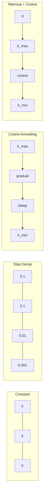
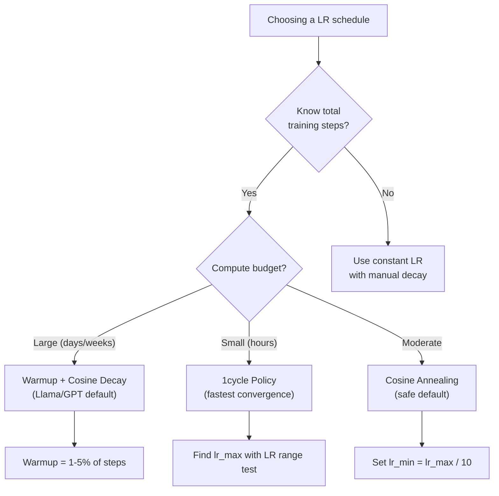
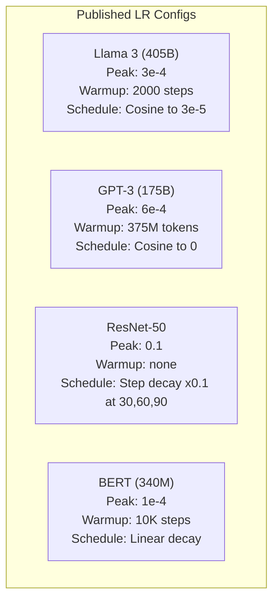

# Horários de aprendizagem e aquecimento

> A taxa de aprendizagem é o único hiperparâmetro mais importante. Não é a arquitetura. Não é o tamanho do conjunto de dados.

**类型：**Construção
**语言：**Python
**先修：**Lição 03.06 (Optimização), Lição 03.08 (Peso Inicialização)
**时间：**Cerca de 90 minutos

## Objectivo de aprendizagem

- Desde zero a realização constante, decadência de etapas, cozinha de anelação, aquecimento + cozinha e 1 ciclo de aprendizagem
- 演示学习率 选择的三种失败模式: divergência (over high) 停滞 (over low) 振荡 (over low) 没有衰退 (over high) 停滞 (over low) 振荡 (over low) 没有衰退 (over high) 停滞 (over low) 振荡 (over low) 没有衰退 (over high) 没有衰退 (over high) 
- Explica por que o Optimizer baseado em Adam precisa de aquecimento, e como estabilizar o treinamento inicial
- Comparar a velocidade de convergência de todos os cinco programas em uma mesma tarefa, e escolher o programa adequado para um orçamento de treinamento determinado

## 问题

Colocar a taxa de aprendizagem em 0,1── treino divergirá -- Perda em 3 passos saltar para infinito. Colocar-a em 0,0001── treino vai ser lento de cratera -- 100 épocas — depois, o modelo quase permanece em estado arbitrário. Colocar-a em 0,01── treino em 50 épocas anteriores é eficaz, depois a perda vai ser num mínimo que nunca chega   oscila perto, porque os passos são muito grandes──

A taxa de aprendizagem máxima não é constante. Varia durante o processo de treinamento. No início, você quer usar o espaço de treinamento de forma rápida.

过去三年发表的每个主流模型都使用了学习率时间表──Llama 3 使用峰值 lr=3e-4,2000 个加热步骤,并通过宇宙衰退 衰减到3e-5──GPT-3 使用 lr=6e-4,并进行加热375万代币──这些不是随意选择──它们是耗费数百万美元的大规模超参数扫扫的结果──

Você precisa entender os horários, porque o valor padrão não se aplica necessariamente ao seu problema. Quando você ajusta bem um modelo pré-treinado, o horário certo não é o mesmo que no treinamento zero. Quando você aumenta o tamanho do lote, o período de aquecimento também precisa mudar. Quando o treinamento acontece no passo 10.000, você precisa saber que é o horário.

## 概念

### Taxa de aprendizagem constante

O método mais simples é escolher um número, usar-o a cada passo.

```
lr(t) = lr_0
```

很少是最优的──它要么对训练末期来说太高 (((在最小 附近的振荡),要么对训练初步来说太低 ((在小步上浪费计算) ──对小模型和调试来说也可以──对任何需要训练超过一小时的任务都是糟糕的选择──

### Passo de decadência

De acordo com o ResNet 时代的老派方法── em épocas fixas 处按某因子 (normalmente 10x) reduzir a taxa de aprendizagem──

```
lr(t) = lr_0 * gamma^(floor(epoch / step_size))
```

Entre eles, gama = 0,1 e passo_dimensião = 30 expressão: LR Cada 30 épocas  redução de 10x。ResNet-50 就使用这个 -- lr=0,1,在30、60 和 90 时降低 10x。

问题是:最优衰退 点取决于数据集和架构――换到另一个问题,就需要重新调调什么时降低――转变也很突然--当速度突然变时,Loss可能会峰――

### Cossina de Annealing

De acordo com a curva cosínica, a partir da maior taxa de aprendizagem de decadência plana para o mínimo valor:

```
lr(t) = lr_min + 0.5 * (lr_max - lr_min) * (1 + cos(pi * t / T))
```

Entre eles, t é o passo anterior, t é o número de passos.

Quando t=0 时,cosine 项为 1,所以 lr = lr_max──当 t=T 时,cosine 项为 -1,所以 lr = lr_min──decay 一开始很平缓,中间加速,接近末尾时再次变得平缓──

É a escolha padrão da maioria dos treinamentos modernos. Além de lr_max e lr_min, não há necessidade de ajustar hiperparâmetros.

### Por que é que é que é que é um pequeno começo?

Adam 和其他适应优化器 会维护 Gradiente mean 和变异的运行估计――在步骤 0, estas estimativas foram iniciadas em zero―― inicialmente, algumas atualizações do Gradiente foram baseadas em estatísticas muito ruins―― se a sua taxa de aprendizagem durante este período for grande, o modelo irá avançar em grandes etapas e em direção negativa――

O aquecimento pode corrigir este problema. Primeiro, a partir de uma taxa de aprendizagem muito pequena, geralmente é lr_max / warmup_steps, até mesmo para zero), e depois, em N passos, eleva-se linearmente até lr_max. Quando você alcança a taxa de aprendizagem completa, a estatística de Adam já está estabilizada.

```
lr(t) = lr_max * (t / warmup_steps)     for t < warmup_steps
```

Typical warming up: 1-5% dos passos de treinamento total Llama 3 trained about 1.8 trilhões de tokens, warming up  2000 passos GPT-3  375 milhões de tokens  conduziu o aquecimento

### O aquecimento linear + declínio do cosino

Primeiro, a rampa linear aumenta, depois, a decadência cosínica:

```
if t < warmup_steps:
    lr(t) = lr_max * (t / warmup_steps)
else:
    progress = (t - warmup_steps) / (total_steps - warmup_steps)
    lr(t) = lr_min + 0.5 * (lr_max - lr_min) * (1 + cos(pi * progress))
```

É o que fazem os transformadores modernos usarem para aquecer o sistema.

### Política de 1 ciclo

Descoberta de Leslie Smith: em 2018, na primeira metade do treino, a taxa de aprendizagem aumentou de baixa para alta, e na segunda metade, a taxa de aprendizagem diminuiu.

理論是: alta taxa de aprendizagem 会通過向優化軌跡 中加入噪音來起起正常化作用──model 在 ramp-up 阶段會探索更多 損失風景,从而找到更好的盆──然后 ramp-down 阶段在找到最佳盆中進行精炼──

```
Phase 1 (0 to T/2):    lr ramps from lr_max/25 to lr_max
Phase 2 (T/2 to T):    lr ramps from lr_max to lr_max/10000
```

Em orçamento fixo de computação, o ciclo normalmente é mais rápido do que o de anelação cosínica.

### Lista de forma



###                                                                                                                                                                                                                                                                                                                                                                                                                                                                                                                              



### 已发表的模型 中的真实数值 已发表的模型 中的真实数值 中的真实数值 中的真实数值 中的真实数值 中的真实数值 中的真实数值 中的真实数值 中的真实数值 中的真实数值 中的真实数值 中的真实数值 中的真实数值 中的真实数值 中的真实数值 中的真实数值 中的真实数值 中的真实数值 中的真实数值 中的真实数值 中的真实数值 中的真实数值 中的真实数值 中的真实数值 中的真实数值 中的真实数值 中的真实数值 中的真实数值 中的真实数值 中的真实数值 中的真实数值 中的真实数值




```figure
lr-schedule
```

## Construí-lo

### 步骤 1: Funções de programação

Cada função 接收当前步骤,并返回该步骤的学习率──

```python
import math


def constant_schedule(step, lr=0.01, **kwargs):
    return lr


def step_decay_schedule(step, lr=0.1, step_size=100, gamma=0.1, **kwargs):
    return lr * (gamma ** (step // step_size))


def cosine_schedule(step, lr=0.01, total_steps=1000, lr_min=1e-5, **kwargs):
    if step >= total_steps:
        return lr_min
    return lr_min + 0.5 * (lr - lr_min) * (1 + math.cos(math.pi * step / total_steps))


def warmup_cosine_schedule(step, lr=0.01, total_steps=1000, warmup_steps=100, lr_min=1e-5, **kwargs):
    if total_steps <= warmup_steps:
        return lr * (step / max(warmup_steps, 1))
    if step < warmup_steps:
        return lr * step / warmup_steps
    progress = (step - warmup_steps) / (total_steps - warmup_steps)
    return lr_min + 0.5 * (lr - lr_min) * (1 + math.cos(math.pi * progress))


def one_cycle_schedule(step, lr=0.01, total_steps=1000, **kwargs):
    mid = max(total_steps // 2, 1)
    if step < mid:
        return (lr / 25) + (lr - lr / 25) * step / mid
    else:
        progress = (step - mid) / max(total_steps - mid, 1)
        return lr * (1 - progress) + (lr / 10000) * progress
```

### 步骤 2: Visualização de todos os horários

Imprimir um plano baseado no texto, mostrando cada programa em mudanças no processo de treinamento.

```python
def visualize_schedule(name, schedule_fn, total_steps=500, **kwargs):
    steps = list(range(0, total_steps, total_steps // 20))
    if total_steps - 1 not in steps:
        steps.append(total_steps - 1)

    lrs = [schedule_fn(s, total_steps=total_steps, **kwargs) for s in steps]
    max_lr = max(lrs) if max(lrs) > 0 else 1.0

    print(f"\n{name}:")
    for s, lr_val in zip(steps, lrs):
        bar_len = int(lr_val / max_lr * 40)
        bar = "#" * bar_len
        print(f"  Step {s:4d}: lr={lr_val:.6f} {bar}")
```

### 步骤 3: treinamento Rede

No conjunto de dados do círculo, usamos uma rede simples de duas camadas, a mesma que as anteriores, mas desta vez mudamos o cronograma.

```python
import random


def sigmoid(x):
    x = max(-500, min(500, x))
    return 1.0 / (1.0 + math.exp(-x))


def relu(x):
    return max(0.0, x)


def relu_deriv(x):
    return 1.0 if x > 0 else 0.0


def make_circle_data(n=200, seed=42):
    random.seed(seed)
    data = []
    for _ in range(n):
        x = random.uniform(-2, 2)
        y = random.uniform(-2, 2)
        label = 1.0 if x * x + y * y < 1.5 else 0.0
        data.append(([x, y], label))
    return data


def train_with_schedule(schedule_fn, schedule_name, data, epochs=300, base_lr=0.05, **kwargs):
    random.seed(0)
    hidden_size = 8
    total_steps = epochs * len(data)

    std = math.sqrt(2.0 / 2)
    w1 = [[random.gauss(0, std) for _ in range(2)] for _ in range(hidden_size)]
    b1 = [0.0] * hidden_size
    w2 = [random.gauss(0, std) for _ in range(hidden_size)]
    b2 = 0.0

    step = 0
    epoch_losses = []

    for epoch in range(epochs):
        total_loss = 0
        correct = 0

        for x, target in data:
            lr = schedule_fn(step, lr=base_lr, total_steps=total_steps, **kwargs)

            z1 = []
            h = []
            for i in range(hidden_size):
                z = w1[i][0] * x[0] + w1[i][1] * x[1] + b1[i]
                z1.append(z)
                h.append(relu(z))

            z2 = sum(w2[i] * h[i] for i in range(hidden_size)) + b2
            out = sigmoid(z2)

            error = out - target
            d_out = error * out * (1 - out)

            for i in range(hidden_size):
                d_h = d_out * w2[i] * relu_deriv(z1[i])
                w2[i] -= lr * d_out * h[i]
                for j in range(2):
                    w1[i][j] -= lr * d_h * x[j]
                b1[i] -= lr * d_h
            b2 -= lr * d_out

            total_loss += (out - target) ** 2
            if (out >= 0.5) == (target >= 0.5):
                correct += 1
            step += 1

        avg_loss = total_loss / len(data)
        accuracy = correct / len(data) * 100
        epoch_losses.append(avg_loss)

    return epoch_losses
```

### 步骤 4: Comparar todos os horários

Utilize cada programa de treinamento na mesma rede,并比较最终损失和融合行为.

```python
def compare_schedules(data):
    configs = [
        ("Constant", constant_schedule, {}),
        ("Step Decay", step_decay_schedule, {"step_size": 15000, "gamma": 0.1}),
        ("Cosine", cosine_schedule, {"lr_min": 1e-5}),
        ("Warmup+Cosine", warmup_cosine_schedule, {"warmup_steps": 3000, "lr_min": 1e-5}),
        ("1cycle", one_cycle_schedule, {}),
    ]

    print(f"\n{'Schedule':<20} {'Start Loss':>12} {'Mid Loss':>12} {'End Loss':>12} {'Best Loss':>12}")
    print("-" * 70)

    for name, schedule_fn, extra_kwargs in configs:
        losses = train_with_schedule(schedule_fn, name, data, epochs=300, base_lr=0.05, **extra_kwargs)
        mid_idx = len(losses) // 2
        best = min(losses)
        print(f"{name:<20} {losses[0]:>12.6f} {losses[mid_idx]:>12.6f} {losses[-1]:>12.6f} {best:>12.6f}")
```

### 步骤 5: LR 过高 vs 过低

演示三种失败模式:过高(divergence) 过低(爬行) 和刚刚好──

```python
def lr_sensitivity(data):
    learning_rates = [1.0, 0.1, 0.01, 0.001, 0.0001]

    print("\nLR Sensitivity (constant schedule, 100 epochs):")
    print(f"  {'LR':>10} {'Start Loss':>12} {'End Loss':>12} {'Status':>15}")
    print("  " + "-" * 52)

    for lr in learning_rates:
        losses = train_with_schedule(constant_schedule, f"lr={lr}", data, epochs=100, base_lr=lr)
        start = losses[0]
        end = losses[-1]

        if end > start or math.isnan(end) or end > 1.0:
            status = "DIVERGED"
        elif end > start * 0.9:
            status = "BARELY MOVED"
        elif end < 0.15:
            status = "CONVERGED"
        else:
            status = "LEARNING"

        end_str = f"{end:.6f}" if not math.isnan(end) else "NaN"
        print(f"  {lr:>10.4f} {start:>12.6f} {end_str:>12} {status:>15}")
```

## Use-o

PyTorch está em`torch.optim.lr_scheduler`Entre os agendadores:

```python
import torch
import torch.optim as optim
from torch.optim.lr_scheduler import CosineAnnealingLR, OneCycleLR, StepLR

model = nn.Sequential(nn.Linear(10, 64), nn.ReLU(), nn.Linear(64, 1))
optimizer = optim.Adam(model.parameters(), lr=3e-4)

scheduler = CosineAnnealingLR(optimizer, T_max=1000, eta_min=1e-5)

for step in range(1000):
    loss = train_step(model, optimizer)
    scheduler.step()
```

Para aquecimento + cosin, usar o agendador lambda, ou usar HuggingFace `get_cosine_schedule_with_warmup`- Não .

```python
from transformers import get_cosine_schedule_with_warmup

scheduler = get_cosine_schedule_with_warmup(
    optimizer,
    num_warmup_steps=2000,
    num_training_steps=100000,
)
```

Função HuggingFace é a maioria dos scripts de ajuste fino de Llama 和 GPT.

## Entrega-o

本课会产出:
- `outputs/prompt-lr-schedule-advisor.md`-- Um prompt, para usar de acordo com a sua formação de configuração de recomendação adequado de ritmo de aprendizagem e hiperparâmetros

## 练习

1. 实现 decadência exponencial:lr(t) = lr_0 * gamma^t, entre os quais gamma = 0,999── em conjunto de dados de círculo 上与 cosine annealing 比较──

2. 实现 learning rate range test(Leslie Smith): train几百步,同时将 LR从1e-7指数增加到1──绘制Loss vs LR──最优最大 LR 位于Loss 开始增加之前──

3. Use warmup + cosine training, but change warmup 长度:总步骤的0%、1%、5%、10%、20%── encontrar o melhor ponto de sucesso do treinamento──

4. 实现带热启动的共振: cada passo T irá reponer a taxa de aprendizagem para lr_max, e depois novamente decadência.

5. Construir um cirurgião orneário, monitorar treinamento Loss, e em Loss 稳定时自动从暖化 转换到阴;如果 Loss 太久,则降低 lr。

## 关键术语

| Term | 人们通常怎么说 | 它真正的含义 |
|------|----------------|----------------------|
| Learning rate | “model 学得有多快” | 用来乘以 Gradient、决定参数更新大小的标量 |
| Schedule | “随时间改变 LR” | 将 training step 映射到 learning rate 的 function，旨在优化 convergence |
| Warmup | “从小 LR 开始” | 在最初 N steps 中，将 LR 从接近零 linearly ramp 到目标值，以稳定 Optimizer 统计量 |
| Cosine annealing | “平滑 LR decay” | 在训练过程中，让 LR 按 cosine 曲线从 lr_max 降低到 lr_min |
| Step decay | “在 milestones 降低 LR” | 在固定 epoch intervals，将 LR 乘以一个因子（通常是 0.1） |
| 1cycle policy | “先上后下” | Leslie Smith 的方法：在单个 cycle 中将 LR 先 ramp up 再 ramp down，以获得更快 convergence |
| LR range test | “找到最佳 learning rate” | 在短时间训练中逐步增加 LR，以找到 Loss 开始 diverge 的数值 |
| Cosine with warm restarts | “重置并重复” | 周期性地将 LR 重置为 lr_max，并再次 decay（SGDR） |
| Eta min | “LR 的下限” | schedule 最终 decay 到的最小 learning rate |
| Peak learning rate | “最大 LR” | 训练过程中达到的最高 LR，通常出现在 warmup 之后 |

## 延伸阅读

- Loshchilov & Hutter, "SGDR: Descenso Gradiente Stocástico com Restarto Quente" (2017) -- introduziu o cocinar anelamento e reiniciação quente
- Smith, "Super-Convergência: Treinamento muito rápido de redes neurais usando grandes taxas de aprendizagem" (2018) -- política de 1 ciclo 论文
- Touvron et al., "Llama 2: Open Foundation and Fine-Tuned Chat Models" (2023) -- 记录了大规模使用的暖化 + cosine schedule
- Goyal et al., "Exato, grande minibatch SGD: Training ImageNet em 1 hora" (2017) -- grande batch de treinamento de escala linear norma 和 aquecimento
