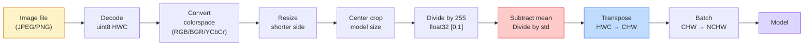
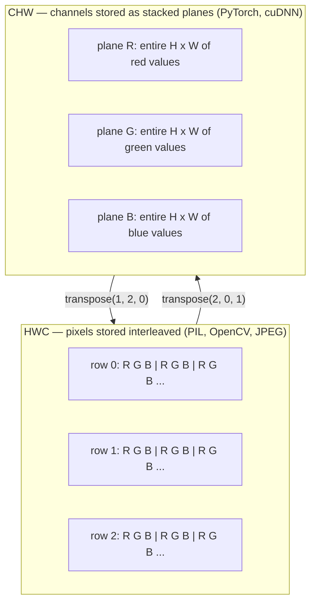

# Base de imagem  Pixel、Canais、Espaços de cores

> A imagem é uma tensão de luz. Todos os modelos de visão que você usará depois começam com este fato.

**类型：**Construir
**语言：**Python
**前置要求：**Fase 1 Lição 12 (Operações de Tensor), Fase 3 Lição 11 (Introdução a PyTorch)
**时间：**Cerca de 45 minutos

## Objectivo de aprendizagem

- Explicar como a sequência de cenários é dispersada em pixels, bem como por que a tomada e quantificação de decisões determinam a limite superior de cada modelo de download
- Crie imagens como uma matriz NumPy 读取、切片和检查,并熟练在HWC和CHW布局之间切换
- Em RGB, escala de cinza, HSV e YCbCr, a transformação explica a razão da existência de cada espaço de cores.
- 严格按照火视的预期应用 Pixel 级预处理(normalizar, padronizar, dimensionar, primeiro canal)

## 问题

Você vai ler cada artigo, download de cada peso pré-treinado, modificar cada visão API, tudo supostamente entrada com codificação específica.`uint8`Imagens transmitidas à expectativa`float32`O modelo ainda vai funcionar, e produz resultados inúteis. Se o BGR for dado à rede treinada no RGB, a precisão vai diminuir dez pontos por cento. Quando o modelo espera canais-primeiro, e você dá-lhe canais-última entrada, a primeira camada conv considerará a altitude como um canal de recursos.

Uma vez que você sabe que a convolução está em movimento, não é complexa em si mesma. O problema é que o engenheiro de visão da convenção de câmeras, JPEG, decodificador, pil, openCV, torchvision e kernel CUDA tem diferentes significados.

Esta aula irá corrigir essa base, para que o conteúdo da próxima fase possa ser construído sobre ela. Até o final, você saberá o que é um pixel, por que cada pixel tem três números em vez de um, normalize com as estatísticas da ImageNet o que realmente está sendo feito, bem como como como como mover entre os dois e três layouts usados em forma padrão na próxima fase.

## 概念

### 完整预处理 pipeline 一览

Cada sistema de visão de nível de produção é a mesma transformação reversa. Qualquer passo que for errado, o modelo vê a entrada diferente da entrada durante o treinamento.



Os dois quadros vermelhos e azuis são 80% onde a silêncio falha: falta de padronização, bem como o layout  erro¬¬¬¬¬¬¬¬¬¬¬¬¬¬¬¬¬¬¬¬¬¬¬¬¬¬¬¬¬¬¬¬¬¬¬¬¬¬¬¬¬¬¬¬¬¬¬¬¬¬¬¬¬¬¬¬¬¬¬¬¬¬¬¬¬¬¬¬¬¬¬¬¬¬¬¬¬¬¬¬¬¬¬¬¬¬¬¬¬¬¬¬¬¬¬¬¬¬¬¬¬¬¬¬¬¬¬¬¬¬¬¬¬¬¬¬¬¬¬¬¬¬¬¬¬¬¬¬¬¬¬¬¬¬¬¬¬¬¬¬¬¬¬¬¬¬¬¬¬¬¬¬¬¬¬¬¬¬¬¬¬¬¬¬¬¬¬¬¬¬¬¬¬¬¬¬¬¬¬¬¬¬¬¬¬¬¬¬¬¬¬¬¬¬¬¬¬¬¬¬¬¬¬¬¬¬¬¬¬¬¬¬¬¬¬¬¬¬¬¬¬¬¬¬¬¬¬¬¬¬¬¬¬¬¬¬¬¬¬¬¬¬¬¬¬¬¬¬¬¬¬¬¬¬¬¬¬¬¬¬¬¬¬¬¬¬¬¬¬¬¬¬¬¬¬¬¬¬¬¬¬¬¬¬¬¬¬¬¬¬¬¬¬¬¬¬¬¬¬¬¬¬¬¬¬¬¬¬¬¬¬¬¬¬¬¬¬¬¬¬¬¬¬¬¬¬¬¬¬¬¬¬¬¬¬¬¬¬¬¬¬¬¬¬¬¬¬¬¬¬¬¬¬¬¬¬¬¬¬¬¬¬¬¬¬¬¬¬¬¬¬¬¬¬¬¬¬¬¬¬¬¬¬¬¬¬¬¬¬¬¬¬¬¬¬¬¬¬¬¬¬¬¬¬¬¬¬¬¬¬¬¬¬¬¬¬¬¬¬¬¬¬¬¬¬¬¬¬¬¬¬¬¬¬¬¬¬¬¬¬¬¬¬¬¬¬¬¬¬¬¬¬¬¬¬¬¬¬¬¬¬¬¬¬¬¬¬¬¬¬¬¬¬¬¬¬¬¬

### O pixel é uma amostra, não é quadrado.

O sensor da câmera irá colocar os fotões na rede de um pequeno detector. Cada detector em um período de tempo, produz uma tensão proporcional ao número de fotões que atinge.

```
Continuous scene                 Sensor grid                     Digital image
(infinite detail)                (H x W detectors)               (H x W integers)

    ~~~~~                        +--+--+--+--+--+                 210 198 180 155 120
   - Não, não, não.
  - - - - - - - - - - - - - - - - - - - - - - - - - - - - - - - - - - - - - - - - - - - - - - - - - - - - - - - - - - - - - - - - - - - - - - - - - - - - - - - - - - - - - - - - - - - - - - - - - - - - - - - - - - - - - - - - - - - - - - - - - - - - - - - - - - - - - - - - - - - - - - - - - - - - - - - - - - - - - - - - - - - - - - - - - - - - - - - - - - - - - - - - - - - - - - - - - - - - - - - - - - - - - - - - - - - - - - - - - - - - - - - - - - - - - - - - - - - - - - - - - - - - - - - - - - - - - - - - - - - - - - - - - - - - - - - - - - - - - - - - - - - - - - - - - - - - - - - - - - - - - - - - - - - - - - - - - - - - - - - - - - - - - - - - - - - - - - - - - - - - - - - - - - - - - - - - - - - - - - - - - - - - - - - - - - - - - - - - - - - - - - - - - - - - - - - - - - - - - - - - - - - - - - - - - - - - - - - - - - - - - - - - - - - - - - - - - - - - - - - - - - - - - - - - - - - - - - - - - - - - - - - - - - - - - - - - - - - - - - - - - - - - - - - - - - - - - - - - - - - - - - - - - - - - - -
   ~~~~~                         |  |  |  |  |  |                 195 185 170 148 112
                                 +--+--+--+--+--+                 188 180 165 145 108
```

Este passo ocorre com duas escolhas, que determinam os limites superiores de todas as missões abaixo:

- **Spatial sampling**Decidir em cada cenário, a cada vez, a quantidade de detectores.
- **Intensity quantization**Decidir voltagem ⋅ 8 bits ⋅ fornecer 256 níveis, ⋅ é padrão de exibição ⋅ 10 ⋅ 12 ⋅ 16 bits ⋅ fornecer um gradiente mais liso, ⋅ para imagem médica ⋅ HDR e sensor de tubo bruto ⋅ é muito importante ⋅

O pixel não é um pequeno bloco de cores de área. É uma medida única. Quando você cresce ou gira, você está re-desempenhando esta grade de medição.

### Porque há três canais?

Um detector irá calcular o tamanho de um fóton no espectro de luz, então é a escala de cinza. Para obter a cor, o sensor vai usar o mosaico de filtros vermelhos, verdes e azuis, depois de demosaicar, em cada localização espacial há três números: detector de filtros vermelhos, detector de filtros verdes e detector de filtros azuis.

```
One pixel in memory:

    (R, G, B) = (210, 140, 30)   <- reddish-orange

An H x W RGB image:

    shape (H, W, 3)     stored as   H rows of W pixels of 3 values
                                    each in [0, 255] for uint8
```

Não é estranho. A câmera profunda vai adicionar o canal Z. O satélite vai adicionar a banda infravermelha e ultravioleta. A tomografia médica geralmente tem um canal.

### 两种布局公约:HWC和CHW

Com um tensor, duas categorias. Cada um escolhe uma delas.

```
HWC (height, width, channels)           CHW (channels, height, width)

   W ->                                    H ->
  +-----+-----+-----+                     +-----+-----+
H |R G B|R G B|R G B|                   C |R R R R R R|
| +-----+-----+-----+                   | +-----+-----+
v |R G B|R G B|R G B|                   v |G G G G G G|
  +-----+-----+-----+                     +-----+-----+
                                          |B B B B B B|
                                          +-----+-----+

   PIL, OpenCV, matplotlib,              PyTorch, most deep learning
   almost every image file on disk       frameworks, cuDNN kernels
```

A razão da existência do CHW é que o núcleo de convolução está no lado de H e W 滑动──把频道轴 放在前面, significa que cada núcleo pode ver cada canal no plano 2D, para que possa ser visto em forma de vector 化──HWC, pois este é o formato do disco 保持 HWC, pois este é o sensor 输出扫描线的方式──

Você vai entrar em 1000 vezes.

```
img_chw = img_hwc.transpose(2, 0, 1)      # NumPy
img_chw = img_hwc.permute(2, 0, 1)        # PyTorch tensor
```

Layout de memória 可视化:



### Intervalo de byte 和 dtype

Três convenções

| Convention | dtype | Range | 你会在哪里见到它 |
|------------|-------|-------|------------------|
| Raw | `uint8` | [0, 255] | Disk 上的文件、PIL、OpenCV output |
| Normalized | `float32` | [0.0, 1.0] | `img.astype('float32') / 255` 之后 |
| Standardized | `float32` | 大约 [-2, +2] | 减去 mean 并除以 std 之后 |

A rede convolucional está em entrada padronizada.`mean=[0.485, 0.456, 0.406]`- Não.`std=[0.229, 0.224, 0.225]`É em um conjunto de treinamento completo da ImageNet, para [0, 1] normalizado Pixel  calcular get de três canais de média aritmética 和 desvio padrão──把 `uint8`输入给期望标准化浮游的模型,是应用视觉中最常见的静默失败──

### Espaços de cores e por que existem

RGB é formato de captura, mas não é sempre a expressão mais útil para o modelo.

```
 RGB               HSV                       YCbCr / YUV

 R red             H hue (angle 0-360)       Y luminance (brightness)
 G green           S saturation (0-1)        Cb chroma blue-yellow
 B blue            V value/brightness (0-1)  Cr chroma red-green

 Linear to         Separates color from      Separates brightness from
 sensor output     brightness. Useful for    color. JPEG and most video
                   color thresholding, UI    codecs compress the chroma
                   sliders, simple filters   channels harder because the
                                             human eye is less sensitive
                                             to chroma detail than to Y.
```

Para a maioria das modernas CNN, você vai entrar no RGB.

- **HSV** código de currículo clássico  segmentação baseada em cores  equilíbrio de branco 
- **YCbCr** 读取 JPEG 内部、视频管道、只在Y 上操作的超分辨率模型──
- **Grayscale** OCR 、modelo de documento, bem como qualquer cor é variável de incômodo e não a situação do sinal 

A partir da escala de cinza RGB 转灰是加权和,不是平均值,因为 o olho humano é mais sensível ao verde do que ao vermelho ou ao azul:

```
Y = 0.299 R + 0.587 G + 0.114 B       (ITU-R BT.601, the classic weights)
```

### Relação de aspecto, dimensionamento e interpolação

Cada modelo tem um tamanho de entrada fixo. A maioria dos classificadores da ImageNet é 224x224, detector moderno 常用 384x384或 512x512)

- **Resize shorter side, then center crop** 标准 ImageNet recipe── manter a relação de aspecto, abandonar um bordão de píxeles──
- **Resize and pad** Manter a relação de aspecto 和 cada pixel, adicionar o lado negro。 Detecção 和 OCR
- **Resize directly to target** 拉伸图像──便宜, vai retorcer a geometria, mas para muitas tarefas de classificação 足够好──

Quando a nova rede está em desacordo com a antiga, o método de interpolação decide como calcular o meio de pixels:

```
Nearest neighbour     fastest, blocky, only choice for masks/labels
Bilinear              fast, smooth, default for most image resizing
Bicubic               slower, sharper on upscaling
Lanczos               slowest, best quality, used for final display
```

經驗法则: treino usando bilinear, você vai ver bem o activo usando bicubo ou lanço, qualquer coisa que contenha um número inteiro de ID de classe usando o mais próximo.


```figure
conv-output-size
```

## Construí-lo

### 步骤 1:carregar imagem e verificar a forma

Use Pillow, carregue qualquer JPEG ou PNG, converta em NumPy, e imprima o conteúdo que você obtém.

```python
import numpy as np
from PIL import Image

def synthetic_rgb(h=128, w=192, seed=0):
    rng = np.random.default_rng(seed)
    yy, xx = np.meshgrid(np.linspace(0, 1, h), np.linspace(0, 1, w), indexing="ij")
    r = (np.sin(xx * 6) * 0.5 + 0.5) * 255
    g = yy * 255
    b = (1 - yy) * xx * 255
    rgb = np.stack([r, g, b], axis=-1) + rng.normal(0, 6, (h, w, 3))
    return np.clip(rgb, 0, 255).astype(np.uint8)

arr = synthetic_rgb()
# 或从 disk 加载：
# arr = np.asarray(Image.open("your_image.jpg").convert("RGB"))

print(f"type:   {type(arr).__name__}")
print(f"dtype:  {arr.dtype}")
print(f"shape:  {arr.shape}     # (H, W, C)")
print(f"min:    {arr.min()}")
print(f"max:    {arr.max()}")
print(f"pixel at (0, 0): {arr[0, 0]}")
```

预期 produção:`shape: (H, W, 3)`- Não.`dtype: uint8`- O que é?`[0, 255]`Não importa o byte da câmera, o decodificador JPEG ou o gerador sintético, isto é uma representação canônica no disco.

### 步骤 2: separar o canal e não re-arrangir layout

Determine R、G、B, depois, de HWC  para PyTorch utilizando CHW

```python
R = arr[:, :, 0]
G = arr[:, :, 1]
B = arr[:, :, 2]
print(f"R shape: {R.shape}, mean: {R.mean():.1f}")
print(f"G shape: {G.shape}, mean: {G.mean():.1f}")
print(f"B shape: {B.shape}, mean: {B.mean():.1f}")

arr_chw = arr.transpose(2, 0, 1)
print(f"\nHWC shape: {arr.shape}")
print(f"CHW shape: {arr_chw.shape}")
```

Três planos em escala de cinza, cada canal um.

### 步骤 3:Conservação de grãos e HSV

Adição de graus e depois RGB-HSV.

```python
def rgb_to_grayscale(rgb):
    weights = np.array([0.299, 0.587, 0.114], dtype=np.float32)
    return (rgb.astype(np.float32) @ weights).astype(np.uint8)

def rgb_to_hsv(rgb):
    rgb_f = rgb.astype(np.float32) / 255.0
    r, g, b = rgb_f[..., 0], rgb_f[..., 1], rgb_f[..., 2]
    cmax = np.max(rgb_f, axis=-1)
    cmin = np.min(rgb_f, axis=-1)
    delta = cmax - cmin

    h = np.zeros_like(cmax)
    mask = delta > 0
    rmax = mask & (cmax == r)
    gmax = mask & (cmax == g)
    bmax = mask & (cmax == b)
    h[rmax] = ((g[rmax] - b[rmax]) / delta[rmax]) % 6
    h[gmax] = ((b[gmax] - r[gmax]) / delta[gmax]) + 2
    h[bmax] = ((r[bmax] - g[bmax]) / delta[bmax]) + 4
    h = h * 60.0

    s = np.where(cmax > 0, delta / cmax, 0)
    v = cmax
    return np.stack([h, s, v], axis=-1)

gray = rgb_to_grayscale(arr)
hsv = rgb_to_hsv(arr)
print(f"gray shape: {gray.shape}, range: [{gray.min()}, {gray.max()}]")
print(f"hsv   shape: {hsv.shape}")
print(f"hue range: [{hsv[..., 0].min():.1f}, {hsv[..., 0].max():.1f}] degrees")
print(f"sat range: [{hsv[..., 1].min():.2f}, {hsv[..., 1].max():.2f}]")
print(f"val range: [{hsv[..., 2].min():.2f}, {hsv[..., 2].max():.2f}]")
```

Hue's output unit is degree, saturation 和 value 在 [0, 1] 中──这与 OpenCV `hsv_full`Convenção 匹配──

### 步骤 4: Normalize, padronize e reverse

De byte bruto 转到预训练的 ImageNet model 期望的精确 Tensor,然后再转回来──

```python
mean = np.array([0.485, 0.456, 0.406], dtype=np.float32)
std = np.array([0.229, 0.224, 0.225], dtype=np.float32)

def preprocess_imagenet(rgb_uint8):
    x = rgb_uint8.astype(np.float32) / 255.0
    x = (x - mean) / std
    x = x.transpose(2, 0, 1)
    return x

def deprocess_imagenet(chw_float32):
    x = chw_float32.transpose(1, 2, 0)
    x = x * std + mean
    x = np.clip(x * 255.0, 0, 255).astype(np.uint8)
    return x

x = preprocess_imagenet(arr)
print(f"preprocessed shape: {x.shape}     # (C, H, W)")
print(f"preprocessed dtype: {x.dtype}")
print(f"preprocessed mean per channel:  {x.mean(axis=(1, 2)).round(3)}")
print(f"preprocessed std  per channel:  {x.std(axis=(1, 2)).round(3)}")

roundtrip = deprocess_imagenet(x)
max_diff = np.abs(roundtrip.astype(int) - arr.astype(int)).max()
print(f"roundtrip max pixel diff: {max_diff}    # 应该是 0 或 1")
```

A média por canal 应接近0,std 接近1── este par de pré-processo/desprocesso 正是每个火vision `transforms.Normalize`Chama-me a fazer coisas no fundo.

### 步骤 5: Usar três métodos de interpolação para redimensionar

Em alta escala, acima comparado com mais próximo, bilinear e bicubico, assim a diferença será mais evidente.

```python
target = (arr.shape[0] * 3, arr.shape[1] * 3)

nearest = np.asarray(Image.fromarray(arr).resize(target[::-1], Image.NEAREST))
bilinear = np.asarray(Image.fromarray(arr).resize(target[::-1], Image.BILINEAR))
bicubic = np.asarray(Image.fromarray(arr).resize(target[::-1], Image.BICUBIC))

def local_roughness(x):
    gy = np.diff(x.astype(float), axis=0)
    gx = np.diff(x.astype(float), axis=1)
    return float(np.abs(gy).mean() + np.abs(gx).mean())

for name, out in [("nearest", nearest), ("bilinear", bilinear), ("bicubic", bicubic)]:
    print(f"{name:>8}  shape={out.shape}  roughness={local_roughness(out):6.2f}")
```

A rugosidade mais próxima, dividida pelo número máximo, porque mantém a margem dura.

## Use-o

`torchvision.transforms`Vai colocar tudo o que está acima em um conjunto composto.`preprocess_imagenet`Faz coisas,并额外加入 resize 和 crop。

```python
import torch
from torchvision import transforms
from PIL import Image

img = Image.fromarray(synthetic_rgb(256, 256))

pipeline = transforms.Compose([
    transforms.Resize(256),
    transforms.CenterCrop(224),
    transforms.ToTensor(),
    transforms.Normalize(mean=[0.485, 0.456, 0.406], std=[0.229, 0.224, 0.225]),
])

x = pipeline(img)
print(f"tensor type:  {type(x).__name__}")
print(f"tensor dtype: {x.dtype}")
print(f"tensor shape: {tuple(x.shape)}      # (C, H, W)")
print(f"per-channel mean: {x.mean(dim=(1, 2)).tolist()}")
print(f"per-channel std:  {x.std(dim=(1, 2)).tolist()}")

batch = x.unsqueeze(0)
print(f"\nbatched shape: {tuple(batch.shape)}   # (N, C, H, W) — ready for a model")
```

Quatro passos, a ordem deve ser assim:`Resize(256)`A parte mais curta é reduzida a 256.`CenterCrop(224)`A partir do meio, um parche 224x224.`ToTensor()`A partir de 255 e a substituição da HWC em CHW;`Normalize`减去 ImageNet significa并除以 std──颠倒这个顺序会改变到达模型的内容──

## Entrega-o

本课会产出:

- `outputs/prompt-vision-preprocessing-audit.md` Um prompt, pode colocar qualquer modelo de cartão ou cartão de conjunto de dados 转成清单,列出团队必须遵守的精确预处理不变──
- `outputs/skill-image-tensor-inspector.md` Uma habilidade, dada tensor ou matriz de forma de imagem, relatório dtipo, layout, gama, bem como parece ser bruto, normalizado ou padronizado.

## 练习

1. **(Easy)**分別使用 OpenCV (`cv2.imread`) 和 almofada 加载一张 JPEG──打印二者的形 和 `(0, 0)`处的Pixel──解释频道顺序差异,然后写出一行转换,让OpenCV array与枕 array 完全一致──
2. **(Medium)**编写 `standardize(img, mean, std)` e inversamente, fazer o segundo pode estar em qualquer imagem`roundtrip_max_diff <= 1`测试── Sua função deve ser capaz de usar a mesma chamada, ao mesmo tempo processar imagens de HWC e batches de NCHW──
3. **(Hard)**Tome um Tensor de 3 canais ImageNet padronizado, deixe-o passar por um 1x1 conv, que conv aprender RGB para um único canal de escala cinzenta de carga de mistura.`[0.299, 0.587, 0.114]`,结结它们,并验证输出与你的手动 `rgb_to_grayscale`Em um erro de ponto flutuante 范围内匹配. Há outras transformações clássicas de espaço-color que podem ser escritas em convolução 1x1?

## 关键术语

| Term | 人们的说法 | 它实际的意思 |
|------|----------------|----------------------|
| Pixel | “一个彩色方块” | 一个 grid location 上的一次光强采样；color 用三个数字，grayscale 用一个数字 |
| Channel | “颜色” | 堆叠成 image Tensor 的并行 spatial grid 之一；在 HWC 中是最后一个 axis，在 CHW 中是第一个 |
| HWC / CHW | “shape” | image Tensor 的 axis ordering；disk 和 PIL 使用 HWC，PyTorch 和 cuDNN 使用 CHW |
| Normalize | “缩放图像” | 除以 255，让 Pixel 落在 [0, 1] 中；这是必要的，但还不充分 |
| Standardize | “零中心化” | 按 channel 减去 mean 并除以 std，使 input distribution 匹配模型训练时看到的分布 |
| Grayscale conversion | “对 channel 求平均” | 使用系数 0.299/0.587/0.114 的加权和，匹配人类 luminance perception |
| Interpolation | “resize 如何选 Pixel” | 当新 grid 与旧 grid 不对齐时决定 output value 的规则；label 用 nearest，training 用 bilinear，display 用 bicubic |
| Aspect ratio | “宽高比” | 区分“resize and pad”和“resize and stretch”的 ratio |

## 延伸阅读

- [Charles Poynton — A Guided Tour of Color Space](https://poynton.ca/PDFs/Guided_tour.pdf)  Sobre por que há tanto espaço de cores e cada uma das explicações técnicas mais importantes e claras de quando
- [PyTorch Vision Transforms Docs](https://pytorch.org/vision/stable/transforms.html) Você está em produção real de composição de transformação completa do pipeline
- [How JPEG Works (Colt McAnlis)](https://www.youtube.com/watch?v=F1kYBnY6mwg) Para a sub-sampulação de cromo ̊ DCT e por que JPEG ̊ codificar YCbCr em vez de RGB ̊
- [ImageNet Preprocessing Conventions (torchvision models)](https://pytorch.org/vision/stable/models.html)- Não .`mean=[0.485, 0.456, 0.406]`A fonte de autoridade, bem como os modelos do zoológico, cada modelo espera por que.
