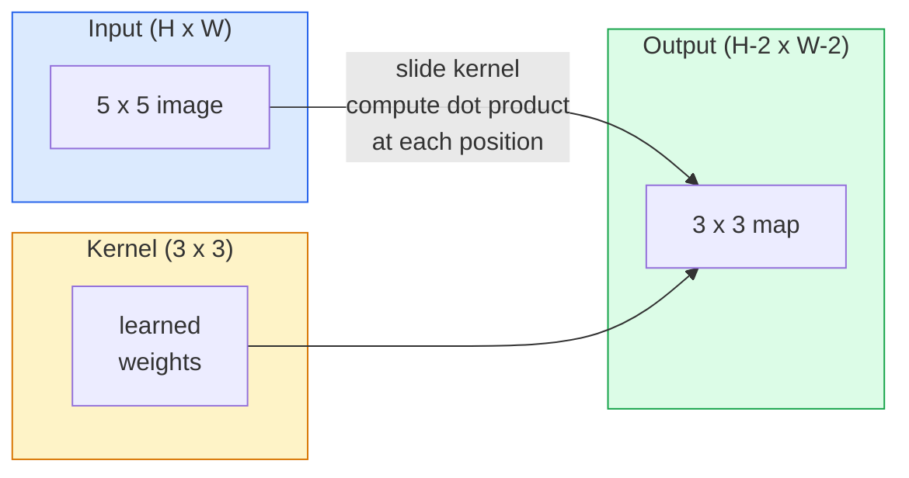
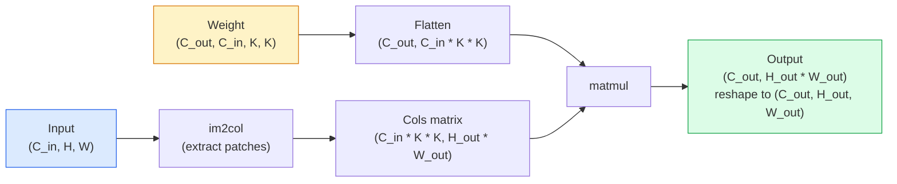

# Convolções a partir do zero

> A convolução é uma camada densa muito pequena, você a faz passar por uma imagem e em cada posição compartilha o mesmo peso.

**Type:** Build
**Languages:** Python
**Prerequisites:** Phase 3 (Deep Learning Core), Phase 4 Lesson 01 (Image Fundamentals)
**Time:** ~75 分钟

## Objectivo de aprendizagem
- Apenas usar NumPy desde zero para realizar convolução 2D, incluindo enxerto-loop  versão e vectorizada `im2col` edição
- 针对 input size、kernel size、padding 和 step of arbitrary assemblage, calculação de output space size,并解释 `(H - K + 2P) / S + 1`公式为什么成立
- Hand工设计 kernels ((edge、blur、sharpen、Sobel),并解释为什么会产生对应的激活模式
- A partir de então, a convulsão é composta em um extractor de características, e a profundidade de composição é ligada ao tamanho do campo receptivo.

## 问题
Em uma imagem RGB de 224x224 usando uma camada totalmente conectada, cada neurona precisa de 224 * 224 * 3 = 150,528 peso de entrada. Uma camada oculta de apenas 1.000 unidades já tem 1.5 bilhões de parâmetros, e isso ainda é antes de você aprender qualquer coisa útil. Pior ainda, esta camada não sabe que um cão no canto superior esquerdo e um cão no canto inferior direito são do mesmo modelo.

O modelo de imagem requer duas características:**translation equivariance**(entrada móvel, saída também com a mudança) e **parameter sharing**(Same feature detector 在所有位置运行) ――Density layers 两者都不给你──Convolution 两者都天然具备──

A convolução não foi inventada para Deep Learning. É também a compressão JPEG, a detecção de borbulhas gaussianas na Photoshop, e a mesma operação por trás de quase todos os filtros de áudio. A razão para a criação da ImageNet, que governou a rede de imagem de 2012 a 2020, é que a convolução é uma forma de se adaptar a este tipo de dados.

## 概念
### Um núcleo, deslizante

A convolução 2D vai tomar uma pequena matriz de peso chamada kernel, vai passar por entrada e em cada posição calcular cada elemento multiplicando-o e e e vai se tornar uma imagem de saída.



Um exemplo concreto de 3x3, entrada para 5x5 ((não enchido, passo 1):

```
Input X (5 x 5):                Kernel W (3 x 3):

  1  2  0  1  2                   1  0 -1
  0  1  3  1  0                   2  0 -2
  2  1  0  2  1                   1  0 -1
  1  0  2  1  3
  2  1  1  0  1

The kernel slides across every valid 3 x 3 window. Output Y is 3 x 3:

 Y[0,0] = sum( W * X[0:3, 0:3] )
 Y[0,1] = sum( W * X[0:3, 1:4] )
 Y[0,2] = sum( W * X[0:3, 2:5] )
 Y[1,0] = sum( W * X[1:4, 0:3] )
 ... and so on
```

É uma fórmula, é isso mesmo.**shared weights、locality、sliding window**É o que eu penso. Tudo o resto é contabilidade.

### Formulha de tamanho de saída

给定输入空间尺寸 `H`Dimensão do núcleo`K`Padding`P`- É um passo.`S`- Não .

```
H_out = floor( (H - K + 2P) / S ) + 1
```

Lembra-te disso. Você vai calcular isso várias vezes em cada arquitetura.

| Scenario | H | K | P | S | H_out |
|----------|---|---|---|---|-------|
| Valid conv，无 padding | 32 | 3 | 0 | 1 | 30 |
| Same conv（保持尺寸） | 32 | 3 | 1 | 1 | 32 |
| 按 2 倍 downsample | 32 | 3 | 1 | 2 | 16 |
| Pool 2x2 | 32 | 2 | 0 | 2 | 16 |
| 大 receptive field | 32 | 7 | 3 | 2 | 16 |

"Same padding" significa escolher P, para que quando S == 1 时 H_out == H。 para o número raro K, é o mesmo que P = (K - 1) / 2。 É por isso que os núcleos 3x3 ocupam o status dominante: eles são ainda o menor núcleo raro do centro de pontos。

### Padding

 Sem empolgação , cada convolução reduzirá o mapa de características  Depois de 20 , a sua imagem 224x224  se transformará em 184x184, o que também fará com que as conexões residuais de forma correspondente  se tornem complexas

```
Zero padding (P = 1) on a 5 x 5 input:

  0  0  0  0  0  0  0
  0  1  2  0  1  2  0
  0  0  1  3  1  0  0
  0  2  1  0  2  1  0       Now the kernel can centre on pixel
  0  1  0  2  1  3  0       (0, 0) and still have three rows and
  0  2  1  1  0  1  0       three columns of values to multiply.
  0  0  0  0  0  0  0
```

实践中会遇到的模式:`zero`(mais frequentemente)`reflect`(镜像边缘, em modelos gerativos evitar hard border)`replicate`(Replicar em "Jardim")`circular`(Around, em problemas toroidais 中使用)

### Passo

Passo é passo de movimento.`stride=1`É um valor de referência.`stride=2`A rede de redes sociais (CNN) não usa uma camada de pooling única, mas faz uma descensão clássica.

```
Stride 1 on a 5 x 5 input, 3 x 3 kernel:

  starts: (0,0) (0,1) (0,2)        -> output row 0
          (1,0) (1,1) (1,2)        -> output row 1
          (2,0) (2,1) (2,2)        -> output row 2

  Output: 3 x 3

Stride 2 on the same input:

  starts: (0,0) (0,2)              -> output row 0
          (2,0) (2,2)              -> output row 1

  Output: 2 x 2
```

### Canais de entrada múltiplos

Imagens de verdade têm três canais. RGB  Convolução 3x3 na entrada. Na verdade, é um 3x3x3 corpo. Cada canal de entrada tem um pedaço 3x3. Em cada posição espacial, você vai fazer multiplicações e subtrações em relação a todos os pedaços.

```
Input:   (C_in,  H,  W)        3 x 5 x 5
Kernel:  (C_in,  K,  K)        3 x 3 x 3 (one kernel)
Output:  (1,     H', W')       2D map

For a layer that produces C_out output channels, you stack C_out kernels:

Weight:  (C_out, C_in, K, K)   e.g. 64 x 3 x 3 x 3
Output:  (C_out, H', W')       64 x 3 x 3

Parameter count: C_out * C_in * K * K + C_out   (the + C_out is biases)
```

O último passo é o seu planejamento de modelos.`64 * 3 * 3 * 3 + 64 = 1,792`É muito conveniente.

### O truque do Im2Col

Loops aninhados  fácil de ler, mas muito lento. GPUs  querem que as matrizes grandes multiplicem.



Cada nível de produção de conexões  implementação  são este pensamento adicionado a cache-tiling  técnicas de algum tipo de variação                                                                                                                                                                                                                                                                                                                                                                                                                                                                                              

### Campo de recepção

单个3x3 conv 会查看9 输入像素――堆叠两个3x3 conv,第二层中的一个神经元 会查看5x5 输入像素――三个3x3 conv 给出7x7――一般来说:

```
RF after L stacked K x K convs (stride 1) = 1 + L * (K - 1)

With strides:   RF grows multiplicatively with stride along each layer.
```

A razão fundamental para "一路 3x3" 能够有效 (VGG、ResNet、ConvNeXt) é que duas convases 3x3 看到的输入区域与一个5x5 conv相似, mas参数较少,而且中间多一个非线性──


```figure
convolution-kernel
```

## Construí-lo
### 步骤 1: Pad uma matriz

Desde o mínimo primitivo 开始: um em H x W array 周补零的函数──

```python
import numpy as np

def pad2d(x, p):
    if p == 0:
        return x
    h, w = x.shape[-2:]
    out = np.zeros(x.shape[:-2] + (h + 2 * p, w + 2 * p), dtype=x.dtype)
    out[..., p:p + h, p:p + w] = x
    return out

x = np.arange(9).reshape(3, 3)
print(x)
print()
print(pad2d(x, 1))
```

- Axios de trailagem`x.shape[:-2]`É o que significa, a mesma função sem necessidade de modificação pode funcionar em`(H, W)`- Não.`(C, H, W)`Ou `(N, C, H, W)`- Não.

### 步骤 2: Utilize嵌套循环 realçar a convolução 2D

参考实现:慢,但毫不含糊.`torch.nn.functional.conv2d`Fazer coisas.

```python
def conv2d_naive(x, w, b=None, stride=1, padding=0):
    c_in, h, w_in = x.shape
    c_out, c_in_w, kh, kw = w.shape
    assert c_in == c_in_w

    x_pad = pad2d(x, padding)
    h_out = (h + 2 * padding - kh) // stride + 1
    w_out = (w_in + 2 * padding - kw) // stride + 1

    out = np.zeros((c_out, h_out, w_out), dtype=np.float32)
    for oc in range(c_out):
        for i in range(h_out):
            for j in range(w_out):
                hs = i * stride
                ws = j * stride
                patch = x_pad[:, hs:hs + kh, ws:ws + kw]
                out[oc, i, j] = np.sum(patch * w[oc])
        if b is not None:
            out[oc] += b[oc]
    return out
```

Cuatro loops em cujo cubo são os quatro loops de saída, linha, coluna, recadigo para C_in、kh、kw (c_in、kh、kw) ⋅ é o que você usa para experimentar cada realidade mais rápida da terra.

### 步骤 3: Verificação do kernel de um projeto manual

Construir um núcleo vertical Sobel, aplicá-lo a uma imagem de um passo sintetizado, e então observar a borda vertical 被点亮──

```python
def synthetic_step_image():
    img = np.zeros((1, 16, 16), dtype=np.float32)
    img[:, :, 8:] = 1.0
    return img

sobel_x = np.array([
    [[-1, 0, 1],
     [-2, 0, 2],
     [-1, 0, 1]]
], dtype=np.float32)[None]

x = synthetic_step_image()
y = conv2d_naive(x, sobel_x, padding=1)
print(y[0].round(1))
```

预期在第7 列出现较大的正值 (((左到右亮度增加),其他位置为零──这个印就是你确认数学正确的智能检查──

### 步骤 4: im2col

Colocar em cada entrada cada janela de tamanho do núcleo  transformar em uma matriz de uma linha ⋅ para `C_in=3, K=3`Cada linha tem 27 números.

```python
def im2col(x, kh, kw, stride=1, padding=0):
    c_in, h, w = x.shape
    x_pad = pad2d(x, padding)
    h_out = (h + 2 * padding - kh) // stride + 1
    w_out = (w + 2 * padding - kw) // stride + 1

    cols = np.zeros((c_in * kh * kw, h_out * w_out), dtype=x.dtype)
    col = 0
    for i in range(h_out):
        for j in range(w_out):
            hs = i * stride
            ws = j * stride
            patch = x_pad[:, hs:hs + kh, ws:ws + kw]
            cols[:, col] = patch.reshape(-1)
            col += 1
    return cols, h_out, w_out
```

Ainda é um ciclo Python, mas agora o cálculo pesado se transforma num material vetorial.

### 步骤 5: através de im2col + matmul 实现快速 conv

Use uma vez a multiplicação de matriz  substituir o ciclo quadruplo 

```python
def conv2d_im2col(x, w, b=None, stride=1, padding=0):
    c_out, c_in, kh, kw = w.shape
    cols, h_out, w_out = im2col(x, kh, kw, stride, padding)
    w_flat = w.reshape(c_out, -1)
    out = w_flat @ cols
    if b is not None:
        out += b[:, None]
    return out.reshape(c_out, h_out, w_out)
```

Verificação de exactidão: operação de dois realizados e comparação.

```python
rng = np.random.default_rng(0)
x = rng.normal(0, 1, (3, 16, 16)).astype(np.float32)
w = rng.normal(0, 1, (8, 3, 3, 3)).astype(np.float32)
b = rng.normal(0, 1, (8,)).astype(np.float32)

y_naive = conv2d_naive(x, w, b, padding=1)
y_im2col = conv2d_im2col(x, w, b, padding=1)

print(f"max abs diff: {np.max(np.abs(y_naive - y_im2col)):.2e}")
```

`max abs diff`- Não .`1e-5`左右── essa diferença é de ponto flutuante 累加顺序, não bug──

### 步骤 6: um grupo de kernels de design manual

Cinco filtros, mostrando uma única camada de convecção que pode exibir antes de qualquer treino.

```python
KERNELS = {
    "identity": np.array([[0, 0, 0], [0, 1, 0], [0, 0, 0]], dtype=np.float32),
    "blur_3x3": np.ones((3, 3), dtype=np.float32) / 9.0,
    "sharpen": np.array([[0, -1, 0], [-1, 5, -1], [0, -1, 0]], dtype=np.float32),
    "sobel_x": np.array([[-1, 0, 1], [-2, 0, 2], [-1, 0, 1]], dtype=np.float32),
    "sobel_y": np.array([[-1, -2, -1], [0, 0, 0], [1, 2, 1]], dtype=np.float32),
}

def apply_kernel(img2d, kernel):
    x = img2d[None].astype(np.float32)
    w = kernel[None, None]
    return conv2d_im2col(x, w, padding=1)[0]
```

 aplicado a imagem em escala de cinza arbitrária 上时, blur 会柔化, sharpen 会让边缘更清晰, Sobel-x 会点亮垂直边缘, Sobel-y 会点亮水平边缘──这些正是AlexNet 和 VGG 中第一个训练出的 conv layer 最终学到的模式,因为优秀的图像模型无论后续任务是什么,都需要边缘和斑探测器──

## Use-o
PyTorch `nn.Conv2d`Utilize auto-grado, kernels CUDA e cuDNN optimização  embalagem na mesma operação.

```python
import torch
import torch.nn as nn

conv = nn.Conv2d(in_channels=3, out_channels=64, kernel_size=3, stride=1, padding=1)
print(conv)
print(f"weight shape: {tuple(conv.weight.shape)}   # (C_out, C_in, K, K)")
print(f"bias shape:   {tuple(conv.bias.shape)}")
print(f"param count:  {sum(p.numel() for p in conv.parameters())}")

x = torch.randn(8, 3, 224, 224)
y = conv(x)
print(f"\ninput  shape: {tuple(x.shape)}")
print(f"output shape: {tuple(y.shape)}")
```

- Não .`padding=1`- Não .`padding=0`, , , , , , , , , , , , , , , , , , , , , , , , , , , , , , , , , , , , , , , , , , , , , , , , , , , , , , , , , , , , , , , , , , , , , , , , , , , , , , , , , , , , , , , , , , , , , , , , , , , , , , , , , , , , , , , , , , , , , , , , , , , , , , , , , , , , , , , , , , , , , , , , , , , , , , , , , , , , , , , , , , , , , , , , , , , , , , , , , , , , , , , , , , , , , , , , , , , , , , , , , , , , , , , , , , , , , , , , , , , , , , , , , , , , , , , , , , , , , , , , , , , , , , , , , , , , , , , , , , , , , , , , , , , , , , , , , , , , , , , , , , , , , , , , , , , , , , , , , , , , , , , , , , , , , , , , , , , , , , , , , , , , , , , , , , , , , , , , , , , , , , , , , , , , , , , , , , , , , , , , , , , , , , , , , , , , , , , , , , , , , , , , , , , , , , , , , , , , , , , , , , , , , , , , , , , , , , , , , , , , , , , , , , , , , , , , , , , , , , , , , , , , , , , , , , , , , , , , , , , , , , , , , , , , , , , , , , , , , , , , , , , , , , , , , , , , , , , , , , , , , , , , , , , , , ,`stride=1`- Não .`stride=2`E, quando a tensão cai para 112x112, é a mesma fórmula que tu tens.

## Entrega-o
本课会产出:

- `outputs/prompt-cnn-architect.md`: um prompt, dado tamanho de entrada determinado, orçamento paramétrio, e campo receptor objetivo, design一组`Conv2d`camadas, e em cada passo usar o K/S/P
- `outputs/skill-conv-shape-calculator.md`Uma habilidade, cada nível através da especificação da rede, e retornar para cada bloco de forma de saída, campo receptivo e contagem de parâmetros.

## 练习
1. **(Easy)**给定一个 128x128 grayscale 输入,以及一组 `[Conv3x3(s=1,p=1), Conv3x3(s=2,p=1), Conv3x3(s=1,p=1), Conv3x3(s=2,p=1)]`, calcula manualmente cada camada de dimensão do espaço de saída e campo receptivo .`nn.Sequential` fazer a verificação.
2. **(Medium)**扩展 `conv2d_naive`和 `conv2d_im2col`, deixem-nos aceitar .`groups`参数――prova `groups=C_in=C_out`Pode-se repetir a convolução de profundidade, e o seu número de parâmetros é `C * K * K`- Não .`C * C * K * K`- Não.
3. **(Hard)**Manual de realização`conv2d_im2col`De passagem para trás: given determin output Gradient, calculado `x`和 `w`de Gradiente.`torch.autograd.grad`验证──关键技巧是: Gradiente de im2col é`col2im`E tem de ser um espaço de janela.

## 关键术语
| Term | What people say | What it actually means |
|------|----------------|----------------------|
| Convolution | “滑动一个 filter” | 一个在每个空间位置用 shared weights 应用的可学习 dot product；数学上是 cross-correlation，但大家都叫它 convolution |
| Kernel / filter | “feature detector” | 一个形状为 (C_in, K, K) 的小型 weight tensor，它与输入窗口的 dot product 会产生一个输出像素 |
| Stride | “每次跳多远” | 连续 kernel placements 之间的步长；stride 2 会让每个空间维度减半 |
| Padding | “边缘上的零” | 在输入周围添加的额外值，使 kernel 可以以边界像素为中心；`same` padding 会让输出尺寸等于输入尺寸 |
| Receptive field | “neuron 能看到多少” | 某个输出 activation 所依赖的原始输入 patch，会随着深度和 stride 增长 |
| im2col | “GEMM trick” | 把每个 receptive window 重排成列，让 convolution 变成一次大型 matrix multiply，这是每个快速 conv kernel 的核心 |
| Depthwise conv | “每个 channel 一个 kernel” | 一个满足 `groups == C_in` 的 conv，每个输出 channel 只由匹配的输入 channel 计算得到；是 MobileNet 和 ConvNeXt 的 backbone |
| Translation equivariance | “输入平移，输出平移” | 输入平移 k 个像素时，输出也平移 k 个像素的性质；shared weights 天然带来这个性质 |

## 延伸阅读
- [A guide to convolution arithmetic for deep learning (Dumoulin & Visin, 2016)](https://arxiv.org/abs/1603.07285) Cada um dos cursos                                                                                                                                                                                                                                                            
- [CS231n: Convolutional Neural Networks for Visual Recognition](https://cs231n.github.io/convolutional-networks/) 经典讲解笔记, incluindo inicial im2col 解释
- [The Annotated ConvNet (fast.ai)](https://nbviewer.org/github/fastai/fastbook/blob/master/13_convolutions.ipynb) Um livro de notas de escrita manual
- [Receptive Field Arithmetic for CNNs (Dang Ha The Hien)](https://distill.pub/2019/computing-receptive-fields/)                                                                                                                                                                                                                                                              
