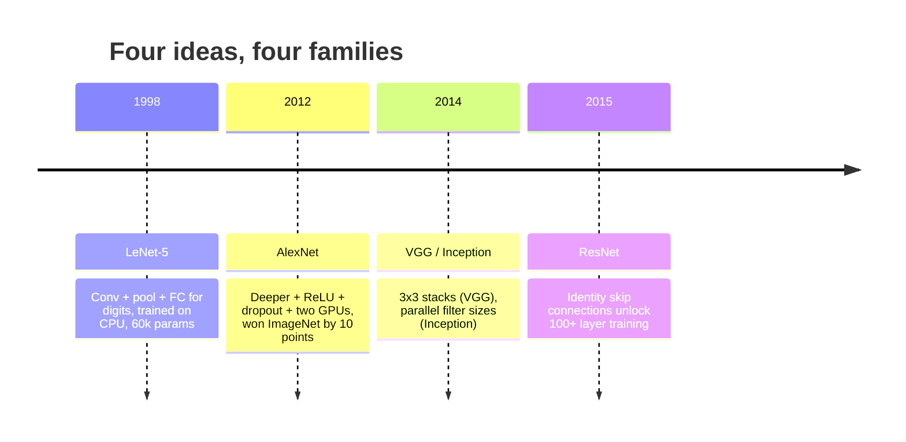
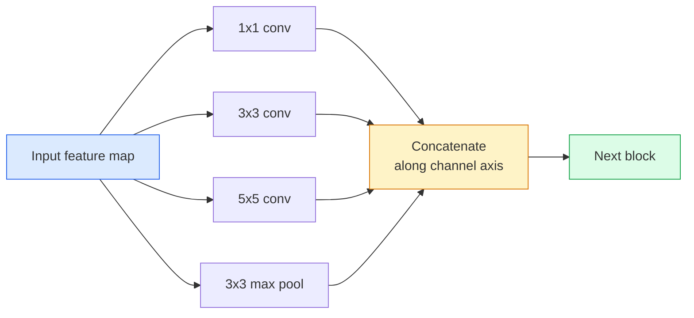
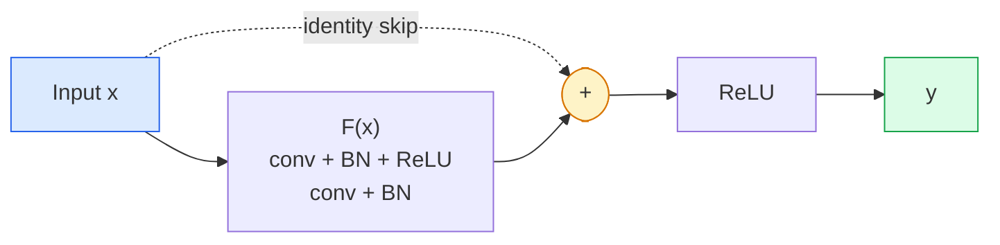

# CNNs  LeNet para ResNet

> Na última década, cada importante CNN, em essência, é a mesma convenção de não-linearidade, de forma a reajustar uma nova ideia.

**Type:** 学习 + 构建
**Languages:** Python
**先修要求：**Fase 3 Lição 11 (PyTorch), Fase 4 Lição 01 (Fundamentos da imagem), Fase 4 Lição 02 (Convergens a partir do zero)
**Time:** ~75 分钟

## Objectivo de aprendizagem
-  追踪 LeNet-5 -> AlexNet -> VGG -> Inception -> Arquitetura do ResNet,并说明每个家庭贡献的单一新想法
- Em PyTorch, implementar LeNet-5 、 um bloco de estilo VGG, bem como um ResNet BasicBlock, cada um controlado em 40 行内
- Explicar por que as conexões residuais podem transformar uma rede de 1000 camadas incompetível em um estado de vanguarda .
- 阅读一个现代脊柱 (ResNet-18, ResNet-50), e查看源码前预测 sua forma de saída、campo receptor 和 contagem de parâmetros

## 问题
Em 2011, a melhor classificação da ImageNet foi de 74% em 2012 e a melhor classificação da ImageNet foi de 95% em 2015 e a melhor classificação da imagem foi de 95% em 2015 e a melhor classificação foi de 64%. Em 2015, a ResNet atingiu 96% e não houve novos dados. Não houve nova geração de GPUs.

按顺序学习这些网络也能让你避免一个常见错误: em uma rede de tamanho LeNet 就能解决问题时,直接使用可用最大模型──MNIST 不需要ResNet──了解每个家庭的规模曲线,能告诉你应该落在曲线的位置──

## 概念
###  Alterar a visão                                                                                                                                                                                                                                                                                                                                                                                                                                                                                                                        



Na visão clássica, nada mais importante do que esta quarta mudança.

### LeNet-5 (1998)

O reconhecedor de dígitos de Yann LeCun ∼60.000 个参数── dois blocos de conv-pool ∼ duas camadas totalmente conectadas ∼ ativasão tanh── define cada modelo de CNN 继承:

```
input (1, 32, 32)
  conv 5x5 -> (6, 28, 28)
  avg pool 2x2 -> (6, 14, 14)
  conv 5x5 -> (16, 10, 10)
  avg pool 2x2 -> (16, 5, 5)
  flatten -> 400
  dense -> 120
  dense -> 84
  dense -> 10
```

O que o mundo moderno diz da CNN, ou seja, a alternar as convulsões e a desmantelar amostras, novamente, uma cabeça de classificador pequeno, é, em essência, um nível de mais, mais canais, mais, mais, mais ativas, mais, melhor LeNet.

### AlexNet (2012)

Três mudanças combinadas quebraram a ImageNet:

1. - Não .**ReLU**Substitui tanh──Gradientes não desaparecem mais──Trenagem velocidade aumenta seis vezes──
2. Em cabeça totalmente conectada 中使用 **Dropout**❖ A regularização   transformou-se numa camada, em vez de uma técnica ❖
3. **Depth and width**❖ Cinco camadas de convecção, três camadas densas, parâmetros 60M, em dois blocos de GPUs

A Figura 2 do artigo ainda mostra a divisão da GPU, ou seja, dois fluxos paralelos. Este paralelismo é uma solução de trabalho no nível do hardware, não na estrutura.

### VGG (2014)

VGG  pergunta uma questão: se usar apenas 3x3 convulsões, e continuar a aprofundar, o que acontece?

```
stack:   conv 3x3 -> conv 3x3 -> pool 2x2
repeat:  16 or 19 conv layers
```

两个3x3 convs 看到的输入区域与一个5x5 conv相等,但参数更少 (2*9*C^2 = 18C^2 vs 25*C^2),并且中间额外多多一个 ReLU──VGG 把这个观察变成完整的结构──它的简单性,即一个块类型反复堆叠,让它成为所有结构的后点参照──

- 38M parâmetros, treinamento lento, inferência

### Início (2014,同年)

O Google respondeu que o tamanho do kernel é:



Cada ramo da cidade é especializado: 1x1 para mistura de canais, 3x3 para textura local, 5x5 para padrões maiores, pooling para características invariantes de turno; concata 让下一层选择任何有用的分支.

### Problemas de degradação

Até 2015, o VGG-19 能工作, enquanto o VGG-32 不能──Deepth 本应有帮助, mas depois de mais de 20 níveis, perda de treinamento e perda de teste foram diferentes── Isto não é sobre-ajustamento── é o Optimizer 无法找到有用的重量, pois os Gradients 会穿越每一层时以乘法方式缩小──

```
Plain deep network:
  y = f_L( f_{L-1}( ... f_1(x) ... ) )

Gradient wrt early layer:
  dL/dW_1 = dL/dy * df_L/df_{L-1} * ... * df_2/df_1 * df_1/dW_1

Each multiplicative term has magnitude roughly (weight magnitude) * (activation gain).
Stack 100 of them with gains < 1 and the gradient is effectively zero.
```

O VGG pode trabalhar em 19 níveis, é por causa da norma de lote (quase em simultâneo) permite que as ativas mantenham uma boa medida.

### ResNet (2015)

Ele, Zhang, Ren, Sun propuseram uma solução para tudo.

```
standard block:   y = F(x)
residual block:   y = F(x) + x
```

`+ x`Expressão camada 总能通过把 `F(x)`推到零来选择什么都不做──A ResNet de 1.000 camadas 现在最差也不差比1-layer network 差,因为 cada bloco extra tem uma pequena escotilha de escape──有这个保证,优化器愿意让每个块 变得*稍微*有用;而稍微有用的块 堆叠100次,就是最先进的──



As duas variações deste bloco estão presentes:

- **BasicBlock**(ResNet-18, ResNet-34): dois convos 3x3, saltar 跨过二者──
- **Bottleneck**(ResNet-50, -101, -152): 1x1 para baixo, 3x3 meio, 1x1 para cima, saltar 跨过三者── quando o canal conta 很高时更便宜──

Quando saltar  deve atravessar a amostra descendente (passo=2) 时, identidade caminho 会 ser substituído por um 1x1 passo=2 conv, para as formas de correspondência.

### Por que resíduos significa "mais do que visão"?

Esta ideia realmente não se preocupa com a classificação de imagens. Ela se preocupa em transformar redes profundas de Gradientes em ferramentas de engenharia confiáveis e expansíveis. Você vai ler em cada transformador que você ler na fase seguinte, em cada bloco, tem uma conexão de salto completamente igual.


```figure
pooling
```

## Construí-lo
### 步骤 1: LeNet-5

Uma pequena e fiel LeNet.Tanh ativações, media de agregação.`nn.CrossEntropyLoss`Não são as conexões gaussianas originais.

```python
import torch
import torch.nn as nn
import torch.nn.functional as F

class LeNet5(nn.Module):
    def __init__(self, num_classes=10):
        super().__init__()
        self.conv1 = nn.Conv2d(1, 6, kernel_size=5)
        self.conv2 = nn.Conv2d(6, 16, kernel_size=5)
        self.pool = nn.AvgPool2d(2)
        self.fc1 = nn.Linear(16 * 5 * 5, 120)
        self.fc2 = nn.Linear(120, 84)
        self.fc3 = nn.Linear(84, num_classes)

    def forward(self, x):
        x = self.pool(torch.tanh(self.conv1(x)))
        x = self.pool(torch.tanh(self.conv2(x)))
        x = torch.flatten(x, 1)
        x = torch.tanh(self.fc1(x))
        x = torch.tanh(self.fc2(x))
        return self.fc3(x)

net = LeNet5()
x = torch.randn(1, 1, 32, 32)
print(f"output: {net(x).shape}")
print(f"params: {sum(p.numel() for p in net.parameters()):,}")
```

Produção esperada: `output: torch.Size([1, 10])`- Não .`params: 61,706`This is the complete digit classifier of OpenModern Vision

### 步骤 2: Um bloco VGG

Um bloco reutilizável: dois convés 3x3, ReLU, batch norm, max pool.

```python
class VGGBlock(nn.Module):
    def __init__(self, in_c, out_c):
        super().__init__()
        self.conv1 = nn.Conv2d(in_c, out_c, kernel_size=3, padding=1)
        self.bn1 = nn.BatchNorm2d(out_c)
        self.conv2 = nn.Conv2d(out_c, out_c, kernel_size=3, padding=1)
        self.bn2 = nn.BatchNorm2d(out_c)
        self.pool = nn.MaxPool2d(2)

    def forward(self, x):
        x = F.relu(self.bn1(self.conv1(x)))
        x = F.relu(self.bn2(self.conv2(x)))
        return self.pool(x)

class MiniVGG(nn.Module):
    def __init__(self, num_classes=10):
        super().__init__()
        self.stack = nn.Sequential(
            VGGBlock(3, 32),
            VGGBlock(32, 64),
            VGGBlock(64, 128),
        )
        self.head = nn.Sequential(
            nn.AdaptiveAvgPool2d(1),
            nn.Flatten(),
            nn.Linear(128, num_classes),
        )

    def forward(self, x):
        return self.head(self.stack(x))

net = MiniVGG()
x = torch.randn(1, 3, 32, 32)
print(f"output: {net(x).shape}")
print(f"params: {sum(p.numel() for p in net.parameters()):,}")
```

Em entrada de tamanho CIFAR 上使用三个VGG块,一个适应池,一个线性层――约290k参数――对CIFAR-10 已经足够――

### 步骤 3: Um ResNet BasicBlock

Bloco de construção central de ResNet-18 e ResNet-34

```python
class BasicBlock(nn.Module):
    def __init__(self, in_c, out_c, stride=1):
        super().__init__()
        self.conv1 = nn.Conv2d(in_c, out_c, kernel_size=3, stride=stride, padding=1, bias=False)
        self.bn1 = nn.BatchNorm2d(out_c)
        self.conv2 = nn.Conv2d(out_c, out_c, kernel_size=3, stride=1, padding=1, bias=False)
        self.bn2 = nn.BatchNorm2d(out_c)
        if stride != 1 or in_c != out_c:
            self.shortcut = nn.Sequential(
                nn.Conv2d(in_c, out_c, kernel_size=1, stride=stride, bias=False),
                nn.BatchNorm2d(out_c),
            )
        else:
            self.shortcut = nn.Identity()

    def forward(self, x):
        out = F.relu(self.bn1(self.conv1(x)))
        out = self.bn2(self.conv2(out))
        out = out + self.shortcut(x)
        return F.relu(out)
```

camadas de convecção`bias=False`É uma prática de batch-norm, porque o parâmetro beta do BN já tratou o viés, então, ao mesmo tempo, carrega um viés de convos é um desperdício.`shortcut`Só precisa de uma verdadeira convicção, se não é assim, é uma identidade sem operação.

### Passo 4: Uma pequena ResNet

堆叠四组 BasicBlocks, obter um adaptado para entrada de tamanho CIFAR de ResNet de trabalho.

```python
class TinyResNet(nn.Module):
    def __init__(self, num_classes=10):
        super().__init__()
        self.stem = nn.Sequential(
            nn.Conv2d(3, 32, kernel_size=3, stride=1, padding=1, bias=False),
            nn.BatchNorm2d(32),
            nn.ReLU(inplace=True),
        )
        self.layer1 = self._make_group(32, 32, num_blocks=2, stride=1)
        self.layer2 = self._make_group(32, 64, num_blocks=2, stride=2)
        self.layer3 = self._make_group(64, 128, num_blocks=2, stride=2)
        self.layer4 = self._make_group(128, 256, num_blocks=2, stride=2)
        self.head = nn.Sequential(
            nn.AdaptiveAvgPool2d(1),
            nn.Flatten(),
            nn.Linear(256, num_classes),
        )

    def _make_group(self, in_c, out_c, num_blocks, stride):
        blocks = [BasicBlock(in_c, out_c, stride=stride)]
        for _ in range(num_blocks - 1):
            blocks.append(BasicBlock(out_c, out_c, stride=1))
        return nn.Sequential(*blocks)

    def forward(self, x):
        x = self.stem(x)
        x = self.layer1(x)
        x = self.layer2(x)
        x = self.layer3(x)
        x = self.layer4(x)
        return self.head(x)

net = TinyResNet()
x = torch.randn(1, 3, 32, 32)
print(f"output: {net(x).shape}")
print(f"params: {sum(p.numel() for p in net.parameters()):,}")
```

Quatro blocos, cada grupo dois. Segundo passo de uso 2. Por cada downsample, o número de canais é duplicado.

### 步骤 5: Comparar eficiência de parâmetro a característica

Quando a mesma entrada é transmitida através de três redes, o número de parâmetros é comparado.

```python
def summary(name, net, x):
    y = net(x)
    params = sum(p.numel() for p in net.parameters())
    print(f"{name:12s}  input {tuple(x.shape)} -> output {tuple(y.shape)}  params {params:>10,}")

x = torch.randn(1, 3, 32, 32)
summary("LeNet5",     LeNet5(),       torch.randn(1, 1, 32, 32))
summary("MiniVGG",    MiniVGG(),      x)
summary("TinyResNet", TinyResNet(),   x)
```

Três modelos, três tempos, número de parâmetros 相差三数级── para a precisão do CIFAR-10, treinar várias épocas 后大致需要:LeNet 60%,MiniVGG 89%,TinyResNet 93%──

## Use-o
`torchvision.models`提供上所有模型的预训练版本──不同家族的电话签名 完全一致,这正是脊柱抽象的意义──

```python
from torchvision.models import resnet18, ResNet18_Weights, vgg16, VGG16_Weights

r18 = resnet18(weights=ResNet18_Weights.IMAGENET1K_V1)
r18.eval()

print(f"ResNet-18 params: {sum(p.numel() for p in r18.parameters()):,}")
print(r18.layer1[0])
print()

v16 = vgg16(weights=VGG16_Weights.IMAGENET1K_V1)
v16.eval()
print(f"VGG-16   params: {sum(p.numel() for p in v16.parameters()):,}")
```

ResNet-18 tem parâmetros 11,7M;. VGG-16 tem 138M;. A precisão top-1 da ImageNet  aproxima (69,8% vs 71,6%)  Conexões residuais                                                                                                                                                                                                                                                                                                                                                                                                                                                                                  

Para a aprendizagem de transferência, a preparação é sempre a mesma: carga pré-treinada, congelamento da coluna vertebral, substituição da cabeça do classificador.

```python
for p in r18.parameters():
    p.requires_grad = False
r18.fc = nn.Linear(r18.fc.in_features, 10)
```

三行── agora você possui um classificador CIFAR de 10 classes, que herdou as representações treinadas da ImageNet──

## Entrega-o
本课会产出:

- `outputs/prompt-backbone-selector.md`Uma resposta rápida, de acordo com a tarefa, tamanho do conjunto de dados e orçamento de cálculo, selecionar a família CNN (LeNet/VGG/ResNet/MobileNet/ConvNeXt)
- `outputs/skill-residual-block-reviewer.md`Uma habilidade, vai aprender o módulo PyTorch e marcar o saltar da conexão  erro                                                                                                                                                                                                                                                                                                                                                                                                                                                                                                      

## 练习
1. **(Easy)**Hand动逐层计算 `TinyResNet`Os parâmetros`sum(p.numel() for p in net.parameters())`Para o orçamento de parâmetros, a principal parte foi para onde, para convsBN, ou para o cabeçalho do classificador?
2. **(Medium)** implementar o bloco de garganta de engarrafamento (1x1 -> 3x3 -> 1x1 com salto), e usá-lo para construir uma rede de estilo ResNet-50 da CIFAR.`TinyResNet`Comparado.
3. **(Hard)**De`BasicBlock`Na figura 1, o resultado da rede profunda simples é que os dois mais baixos são perdidos em comparação com os outros.

## 关键术语
| Term | What people say | What it actually means |
|------|----------------|----------------------|
| Backbone | “模型” | 产生 feature map 并馈送给 task head 的 convolutional blocks 堆栈 |
| Residual connection | “Skip connection” | `y = F(x) + x`；通过将 F 设为零，让 Optimizer 学习 identity，从而让任意 depth 可训练 |
| BasicBlock | “两个带 skip 的 3x3 convs” | ResNet-18/34 的 building block：conv-BN-ReLU-conv-BN-add-ReLU |
| Bottleneck | “1x1 down，3x3，1x1 up” | ResNet-50/101/152 block；在高 channel counts 下成本低，因为 3x3 运行在缩减后的 width 上 |
| Degradation problem | “更深反而更差” | 超过约 20 个 plain conv layers 后，training error 和 test error 都会增加；由 residual connections 解决，而不是靠更多数据 |
| Stem | “第一层” | 将 3-channel input 转换为基础 feature width 的初始 conv；ImageNet 通常是 7x7 stride 2，CIFAR 通常是 3x3 stride 1 |
| Head | “分类器” | final backbone block 之后的 layers：adaptive pool、flatten、linear(s) |
| Transfer learning | “Pretrained weights” | 加载在 ImageNet 上训练过的 backbone，并且只在你的 task 上 fine-tune head |

## 延伸阅读
- [Deep Residual Learning for Image Recognition (He et al., 2015)](https://arxiv.org/abs/1512.03385) ResNet 论文; 每张图都值得研究
- [Very Deep Convolutional Networks (Simonyan & Zisserman, 2014)](https://arxiv.org/abs/1409.1556) VGG 论文; ainda é entender por que é o melhor referência para 3x3
- [ImageNet Classification with Deep CNNs (Krizhevsky et al., 2012)](https://papers.nips.cc/paper_files/paper/2012/hash/c399862d3b9d6b76c8436e924a68c45b-Abstract.html) AlexNet;终结 mão-feature 时代的论文
- [Going Deeper with Convolutions (Szegedy et al., 2014)](https://arxiv.org/abs/1409.4842) Iniciação v1; ainda aparecerá em transformadores de visão
