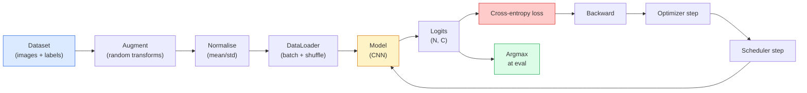

# Classificação de imagens

> O classificador é uma função da distribuição de probabilidade de pixels para classes superiores.

**Type:** Build
**Languages:** Python
**Prerequisites:** Phase 2 Lesson 09 (Model Evaluation), Phase 3 Lesson 10 (Mini Framework), Phase 4 Lesson 03 (CNNs)
**Time:** ~75 minutes

## Objectivo de aprendizagem

- Em CIFAR-10 上构建端到端图像分类管道:dataset、augmentation、model、training loop、evaluation
- 解释每个组件的作用(dataloader、loss、optimizer、scheduler、augmentation),并预测其中任意一个出错会如何体现在 Loss 曲线上
- Desde zero para conseguir mistura, corte e suavização de rótulos, e explicar quando vale a pena adicioná-los
- 阅读混矩阵 和 per-class precision/recall table, usando a precisão agregada 之外的信息诊断数据集与模型的失败模式

## 问题

Cada tarefa de visão final, em algum nível, será redigida para a classificação de imagem. A detecção irá fazer uma classificação. A segmentação irá fazer uma classificação. A recuperação irá fazer uma classificação de semelhança com os centros de classe. A classificação será feita, ou seja, o ciclo de dados, a política de aumento, perda, avaliação será feita.

A maioria dos bugs de classificação não estão no modelo. Eles estão no pipeline: degradação de normalização, não há mistura de treinamento, aumento de rotulagem de rótulos, divisão de validação de dados de treinamento, contaminação, depois de 30 anos.

Esta aula vai ser feita manualmente e toda a linha de condução será examinada.`torchvision.datasets`Tudo o que pode estar escondido.

## 核心概念

### Linha de classificação



Cada linha neste ciclo pode estar com bugs. Recebe logs brutos, não softmax, então faça qualquer coisa antes de perder.`model(x).softmax()`Aumentas só devem ser usadas para insumos, não devem ser usadas para rótulos, exceto mistura, porque ela mistura simultaneamente os dois.`optimizer.zero_grad()` deve executar cada passo uma vez; saltando ele vai acumular Gradiente, parece que a taxa de aprendizagem 极不稳定── cada um destes bugs fará com que a curva de aprendizagem se torne plana, mas não lança erros──

### Entropia cruzada ̊ logits com softmax

classificador 会为每张图像产生 `C`个数字, denominado logits. 应用 softmax 会把它们转换为概率分布:

```
softmax(z)_i = exp(z_i) / sum_j exp(z_j)
```

Cross-entropy 衡量正确 class 的负记录概率:

```
CE(z, y) = -log( softmax(z)_y )
        = -z_y + log( sum_j exp(z_j) )
```

Forma do lado direito é forma do número de valores estáveis (log-sum-exp)`nn.CrossEntropyLoss`会在一个 op 中融合 softmax + NLL,并直接接收原始logits──自己先应用 softmax 几乎总是 bug,因为你计算的是 log(softmax(softmax(z))),这是一个没有意义的量──

### Por que a ampliação é eficaz

A CNN tem preconceito indutivo em relação à tradução, mas não tem invariância interna em relação às culturas, as viradas, o nervio de cores ou a oclusão. A única maneira de fazer estas invariâncias é para que elas possam ser visualizadas através de pixels.

```
Original crop:  "dog facing left"
Flip:           "dog facing right"       <- same label, different pixels
Rotate(+15):    "dog, slight tilt"
Colour jitter:  "dog in warmer light"
RandomErasing:  "dog with patch missing"
```

规则是:augmentation 必须保留标签──对数字做切割和旋转可能将将6 变成9; para esse conjunto de dados, você deve usar menores intervalos de rotação,并选择尊重数字-specific invariances──

### Mistura e corte

Normalmente, a ampliação vai transformar pixels, mas mantém os rótulos para um único calor.**Mixup**和 **cutmix**Vai passar a mesma hora para quebrar este ponto.

```
Mixup:
  lambda ~ Beta(a, a)
  x = lambda * x_i + (1 - lambda) * x_j
  y = lambda * y_i + (1 - lambda) * y_j

Cutmix:
  paste a random rectangle of x_j into x_i
  y = area-weighted mix of y_i and y_j
```

É útil: modelo não relembra metas de ponta, mas sim aprende entre as aulas. Perda de treinamento aumentará, precisão de teste aumentará. É qualquer classificador.

### Limeamento de rótulos

Não mexa com os meus amigos.`[0, 0, 1, 0, 0]`Como objetivo de treinamento, mas usá-lo.`[eps/C, eps/C, 1-eps, eps/C, eps/C]`, entre os `eps`É como 0.1 este tipo de pequeno valor. Impede o modelo de produzir qualquer logite de ponta, e quase a zero custo para melhorar a calibração. Desde PyTorch 1.10 起, já está em`nn.CrossEntropyLoss(label_smoothing=0.1)`- Não.

### Avaliação fora da precisão

A precisão agregada irá ocultar o desequilíbrio. Se você sempre prever a classe de maioria, também pode obter 90%.

- **Per-class accuracy** Cada classe um número; irá imediatamente expor a classe de desempenho insuficiente.
- **Confusion matrix** Gradeira C x C, em que a linha i col j = classe verdadeira i é pré-estimada para a quantidade de classes j; diagonal é verdadeiramente pré-estimada, fora de diagonal 才是模型 问题所在。
- **Top-1 / Top-5** Classe verdadeira se está no top 1 ou top 5 previsiões; Top-5 para ImageNet  é importante, porque classes como Norwich Terrier 和 Norfolk Terrier 确实存在差义──
- **Calibration (ECE)** 0,8 confiança prevê que há 80% do tempo é correto? redes modernas  sistematicamente super confiantes; pode ser usado para escalar a temperatura ou suavizar a etiqueta 修正──


```figure
receptive-field
```

## Construí-lo

### 步骤 1: conjunto de dados sintéticos de determinação

CIFAR-10  está localizado no disco. Para fazer com que esta aula seja replicável e rápida, construímos um conjunto de dados sintético que pareça com o CIFAR, ou seja, com estrutura específica de classe, modelo, que deve ser aprendido com imagens 32x32 RGB.

```python
import numpy as np
import torch
from torch.utils.data import Dataset


def synthetic_cifar(num_per_class=1000, num_classes=10, seed=0):
    rng = np.random.default_rng(seed)
    X = []
    Y = []
    for c in range(num_classes):
        centre = rng.uniform(0, 1, (3,))
        freq = 2 + c
        for _ in range(num_per_class):
            yy, xx = np.meshgrid(np.linspace(0, 1, 32), np.linspace(0, 1, 32), indexing="ij")
            r = np.sin(xx * freq) * 0.5 + centre[0]
            g = np.cos(yy * freq) * 0.5 + centre[1]
            b = (xx + yy) * 0.5 * centre[2]
            img = np.stack([r, g, b], axis=-1)
            img += rng.normal(0, 0.08, img.shape)
            img = np.clip(img, 0, 1)
            X.append(img.astype(np.float32))
            Y.append(c)
    X = np.stack(X)
    Y = np.array(Y)
    idx = rng.permutation(len(X))
    return X[idx], Y[idx]


class ArrayDataset(Dataset):
    def __init__(self, X, Y, transform=None):
        self.X = X
        self.Y = Y
        self.transform = transform

    def __len__(self):
        return len(self.X)

    def __getitem__(self, i):
        img = self.X[i]
        if self.transform is not None:
            img = self.transform(img)
        img = torch.from_numpy(img).permute(2, 0, 1)
        return img, int(self.Y[i])
```

Cada classe tem sua própria paleta de cores e padrão de frequência, mais um ruído gaussiano, que obriga o modelo a aprender o sinal, em vez de pixels de memória.

### 步骤 2:Normalização e aumento

Cada canal de visão tem estas duas transformações.

```python
def standardize(mean, std):
    mean = np.array(mean, dtype=np.float32)
    std = np.array(std, dtype=np.float32)
    def _fn(img):
        return (img - mean) / std
    return _fn


def random_hflip(p=0.5):
    def _fn(img):
        if np.random.random() < p:
            return img[:, ::-1, :].copy()
        return img
    return _fn


def random_crop(pad=4):
    def _fn(img):
        h, w = img.shape[:2]
        padded = np.pad(img, ((pad, pad), (pad, pad), (0, 0)), mode="reflect")
        y = np.random.randint(0, 2 * pad)
        x = np.random.randint(0, 2 * pad)
        return padded[y:y + h, x:x + w, :]
    return _fn


def compose(*fns):
    def _fn(img):
        for fn in fns:
            img = fn(img)
        return img
    return _fn
```

Em vez de usar o pad refletido antes da colheita, o pad zero é um sinal, o modelo irá ignorá-lo de uma forma inútil.

### 步骤 3: Mistura

Na etapa de treinamento 内部混合两张图像 和两个标签── é realizada para a transformação de lote, portanto, está localizada perto do passo anterior, em vez de dentro do conjunto de dados──

```python
def mixup_batch(x, y, num_classes, alpha=0.2):
    if alpha <= 0:
        return x, torch.nn.functional.one_hot(y, num_classes).float()
    lam = float(np.random.beta(alpha, alpha))
    idx = torch.randperm(x.size(0), device=x.device)
    x_mixed = lam * x + (1 - lam) * x[idx]
    y_onehot = torch.nn.functional.one_hot(y, num_classes).float()
    y_mixed = lam * y_onehot + (1 - lam) * y_onehot[idx]
    return x_mixed, y_mixed


def soft_cross_entropy(logits, soft_targets):
    log_probs = torch.log_softmax(logits, dim=-1)
    return -(soft_targets * log_probs).sum(dim=-1).mean()
```

`soft_cross_entropy`É contra a entropia cruzada da distribuição de etiquetas macias. Quando o alvo é um único calor, ele se torna um único calor normal.

### 步骤 4: Localização

完整配方: atravessar uma vez os dados, cada lote 计算一次 gradientes, cada época 执行一次时间表步──

```python
import torch
import torch.nn as nn
from torch.utils.data import DataLoader
from torch.optim import SGD
from torch.optim.lr_scheduler import CosineAnnealingLR

def train_one_epoch(model, loader, optimizer, device, num_classes, use_mixup=True):
    model.train()
    total, correct, loss_sum = 0, 0, 0.0
    for x, y in loader:
        x, y = x.to(device), y.to(device)
        if use_mixup:
            x_m, y_soft = mixup_batch(x, y, num_classes)
            logits = model(x_m)
            loss = soft_cross_entropy(logits, y_soft)
        else:
            logits = model(x)
            loss = nn.functional.cross_entropy(logits, y, label_smoothing=0.1)
        optimizer.zero_grad()
        loss.backward()
        optimizer.step()
        loss_sum += loss.item() * x.size(0)
        total += x.size(0)
        # Training accuracy vs the un-mixed labels `y` is only an approximation
        # when mixup is on (the model saw soft targets, not y). Treat it as a
        # rough progress signal; rely on val accuracy for real performance.
        with torch.no_grad():
            pred = logits.argmax(dim=-1)
            correct += (pred == y).sum().item()
    return loss_sum / total, correct / total


@torch.no_grad()
def evaluate(model, loader, device, num_classes):
    model.eval()
    total, correct = 0, 0
    loss_sum = 0.0
    cm = torch.zeros(num_classes, num_classes, dtype=torch.long)
    for x, y in loader:
        x, y = x.to(device), y.to(device)
        logits = model(x)
        loss = nn.functional.cross_entropy(logits, y)
        pred = logits.argmax(dim=-1)
        for t, p in zip(y.cpu(), pred.cpu()):
            cm[t, p] += 1
        loss_sum += loss.item() * x.size(0)
        total += x.size(0)
        correct += (pred == y).sum().item()
    return loss_sum / total, correct / total, cm
```

Cada vez que escrevo um ciclo de treinamento , temos de verificar cinco invariantes:

1. formação 前调用 `model.train()`, Avaliação 前调用 `model.eval()`, que vai mudar o abandono e o batch norm  comportamento.
2. Em`.backward()`Pre-realização`.zero_grad()`- Não.
3. 累积 métricas 时使用 `.item()`, assim não vai deixar o gráfico de computação sobreviver.
4. avaliação 期间使用 `@torch.no_grad()`, economizar tempo e memória, prevenir pequenos acidentes.
5. Para logits brutos fazer argmax, em vez de para softmax fazer argmax, o resultado é o mesmo, menos uma opção.

### 步骤 5: Rassemblage

Utilize 上一课的`TinyResNet`Treinar algumas épocas, depois avaliar.

```python
from main import synthetic_cifar, ArrayDataset
from main import standardize, random_hflip, random_crop, compose
from main import mixup_batch, soft_cross_entropy
from main import train_one_epoch, evaluate
# TinyResNet comes from the previous lesson (03-cnns-lenet-to-resnet).
# Adjust the import path to wherever you stored the previous lesson's code.
from cnns_lenet_to_resnet import TinyResNet  # example placeholder

X, Y = synthetic_cifar(num_per_class=500)
split = int(0.9 * len(X))
X_train, Y_train = X[:split], Y[:split]
X_val, Y_val = X[split:], Y[split:]

mean = [0.5, 0.5, 0.5]
std = [0.25, 0.25, 0.25]
train_tf = compose(random_hflip(), random_crop(pad=4), standardize(mean, std))
eval_tf = standardize(mean, std)

train_ds = ArrayDataset(X_train, Y_train, transform=train_tf)
val_ds = ArrayDataset(X_val, Y_val, transform=eval_tf)

train_loader = DataLoader(train_ds, batch_size=128, shuffle=True, num_workers=0)
val_loader = DataLoader(val_ds, batch_size=256, shuffle=False, num_workers=0)

device = "cuda" if torch.cuda.is_available() else "cpu"
model = TinyResNet(num_classes=10).to(device)
optimizer = SGD(model.parameters(), lr=0.1, momentum=0.9, weight_decay=5e-4, nesterov=True)
scheduler = CosineAnnealingLR(optimizer, T_max=10)

for epoch in range(10):
    tr_loss, tr_acc = train_one_epoch(model, train_loader, optimizer, device, 10, use_mixup=True)
    va_loss, va_acc, _ = evaluate(model, val_loader, device, 10)
    scheduler.step()
    print(f"epoch {epoch:2d}  lr {scheduler.get_last_lr()[0]:.4f}  "
          f"train {tr_loss:.3f}/{tr_acc:.3f}  val {va_loss:.3f}/{va_acc:.3f}")
```

Em conjunto de dados sintéticos, ele alcançará em cinco épocas dentro de uma precisão de validação quase perfeita, isso é o ponto: o pipeline é correto, o modelo pode aprender algo.

### 步骤 6: ler matriz de confusão

                                                                                                                                                                                                                                                              

```python
def print_confusion(cm, labels=None):
    c = cm.shape[0]
    labels = labels or [str(i) for i in range(c)]
    print(f"{'':>6}" + "".join(f"{l:>5}" for l in labels))
    for i in range(c):
        row = cm[i].tolist()
        print(f"{labels[i]:>6}" + "".join(f"{v:>5}" for v in row))
    print()
    tp = cm.diag().float()
    fp = cm.sum(dim=0).float() - tp
    fn = cm.sum(dim=1).float() - tp
    prec = tp / (tp + fp).clamp_min(1)
    rec = tp / (tp + fn).clamp_min(1)
    f1 = 2 * prec * rec / (prec + rec).clamp_min(1e-9)
    for i in range(c):
        print(f"{labels[i]:>6}  prec {prec[i]:.3f}  rec {rec[i]:.3f}  f1 {f1[i]:.3f}")

_, _, cm = evaluate(model, val_loader, device, 10)
print_confusion(cm)
```

行是真实类,列是预测;; entre as classes 3 e 5 出现了一非方形数, significa que o modelo 混了这两类,并为定向数据收集或类特定增强提供起点;;

## Use-o

`torchvision`Vai colocar tudo o que está acima em um componente de uso habitual. Para o verdadeiro CIFAR-10, o pipeline completo só precisa de quatro linhas, mais um ciclo de treinamento.

```python
from torchvision.datasets import CIFAR10
from torchvision.transforms import Compose, RandomCrop, RandomHorizontalFlip, ToTensor, Normalize

mean = (0.4914, 0.4822, 0.4465)
std = (0.2470, 0.2435, 0.2616)
train_tf = Compose([
    RandomCrop(32, padding=4, padding_mode="reflect"),
    RandomHorizontalFlip(),
    ToTensor(),
    Normalize(mean, std),
])
eval_tf = Compose([ToTensor(), Normalize(mean, std)])

train_ds = CIFAR10(root="./data", train=True,  download=True, transform=train_tf)
val_ds   = CIFAR10(root="./data", train=False, download=True, transform=eval_tf)
```

Há dois pontos a notar:**dataset-specific**No entanto, eles são calculados no conjunto de treinamento CIFAR-10, e não na ImageNet; o pad de reflexão é a política de colheita padrão da comunidade.

## Entrega-o

本课会产出:

- `outputs/prompt-classifier-pipeline-auditor.md` Um plano de treinamento de auditoria para verificar se as cinco invariantes acima estão satisfeitas, e expõe a primeira violação.
- `outputs/skill-classification-diagnostics.md` Uma habilidade, dados matriz de confusão e nomes de classes 列表后,总结 per class failures,并提出最有影响力的单个修复──

## 练习

1. **(Easy)**Em conjunto de dados sintéticos, usando o mesmo modelo, separando-se os treinos com mistura e sem mistura, cada treinamento apresenta cinco épocas.
2. **(Medium)**实现 Cutout: 中随机把一个8x8 方块置零,并运行ablation,对比无增强、hflip+crop、hflip+crop+cutout、hflip+crop+mixup──报告每种设置的 val精度──
3. **(Hard)**Construir o pipeline CIFAR-100 ((100 classes, o mesmo tamanho de entrada),并复现一次ResNet-34 training run,使结果与发表精度差在1% 以内──额外任务:sweep 三个学习率 和两个权重衰退,记录到本地 CSV,并生成最终的混-matrix-top-confusions表──

## 关键术语

| Term | 人们通常怎么说 | 它实际是什么意思 |
|------|----------------|----------------------|
| Logits | “Raw outputs” | 每张图像对应的 pre-softmax C 维 Vector；cross-entropy 期望接收它们，而不是 softmaxed values |
| Cross-entropy | “The loss” | 正确 class 的 negative log-probability；在一个稳定 op 中结合 log-softmax 和 NLL |
| DataLoader | “The batcher” | 用 shuffling、batching 和（可选）multi-worker loading 包装 dataset；一半 training bugs 都会被怪到它头上 |
| Augmentation | “Random transforms” | training time 的任何 pixel-level transform，只要它保留 label；教会 CNN 它原生不具备的 invariances |
| Mixup / Cutmix | “Mix two images” | 同时混合 inputs 和 labels，让 classifier 学习平滑插值，而不是硬边界 |
| Label smoothing | “Softer targets” | 用 (1-eps, eps/(C-1), ...) 替换 one-hot；改善 calibration，并略微提升 accuracy |
| Top-k accuracy | “Top-5” | 正确 class 位于 k 个最高 probability predictions 之中；用于包含真实歧义 classes 的 datasets |
| Confusion matrix | “Where errors live” | C x C table，其中 entry (i, j) 统计 true class i 被预测为 j 的 images 数量；diagonal 是正确项，off-diagonal 告诉你该修什么 |

## 延伸阅读

- [CS231n: Training Neural Networks](https://cs231n.github.io/neural-networks-3/)                                                                                                                                                                                                                                                                                                                                                                                                                                                                                                                            
- [Bag of Tricks for Image Classification (He et al., 2019)](https://arxiv.org/abs/1812.01187) Todos os pequenos habilidades combinadas, podem fazer a precisão da ResNet da ImageNet aumentar 3-4%
- [mixup: Beyond Empirical Risk Minimization (Zhang et al., 2017)](https://arxiv.org/abs/1710.09412) O primeiro misturado de papel; 3 páginas de teoria adicionada a experiências convincentes
- [Why temperature scaling matters (Guo et al., 2017)](https://arxiv.org/abs/1706.04599)Este artigo provou que as redes modernas existem erroneamente, e corrigiram com um parâmetro escalar.
