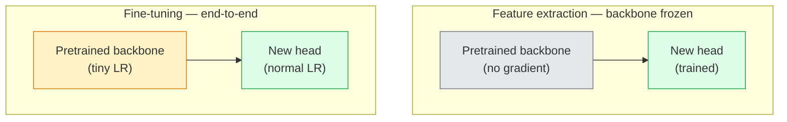

# Transferência de aprendizagem e ajuste perfeito

> Outras pessoas já gastaram milhões de GPUs, dando uma rede neural para identificar o que é o que é um componente de um objeto. Antes de treinar seu próprio modelo, você deve usar essas características.

**Type:** Build
**Languages:** Python
**Prerequisites:** Phase 4 Lesson 03 (CNNs), Phase 4 Lesson 04 (Image Classification)
**Time:** ~75 minutes

## Objectivo de aprendizagem
- 区分 recurso extração 和 ajuste fino,并 de acordo com o tamanho do conjunto de dados, distância de domínio 和 orçamento de computação 选择合适方法
- Carregar a espinha dorsal pré-treinada, substituir a cabeça do classificador e em 20 行 apenas treinamento cabeça  obter linha de base disponível
- Usando taxas de aprendizagem discriminativas  gradualmente descifrar as camadas, fazer as características genéricas iniciais de atualização menor que as características específicas de tarefas do período seguinte
- 诊断三类常见失败: blocos descongelados 上 LR 过高导致特征漂移、小数据集 上 BN estatísticas colapso, bem como esquecimento catastrófico

## 问题
Em ImageNet, treinar uma ResNet-50 requer cerca de 2.000 horas de GPUs. Poucas equipes podem suportar esse orçamento para cada tarefa que precisa ser feita online. Quase todas as equipes realmente conectadas são uma espinha dorsal pré-treinada, juntamente com uma nova cabeça, enquanto esta cabeça é treinada em algumas centenas ou milhares de imagens específicas de tarefas.

Não é um atalho. Qualquer um que tenha treinado na ImageNet, a CNN, seu primeiro conv bloco, vai aprender bordas e filtros similares a Gabor. Os seguintes blocos, como os de Gábor, vão aprender texturas e simples motivos. Os blocos intermediários, como os de Gábor, vão aprender partes de objetos. Os últimos blocos, como os de Gábor, vão começar a aprender quase 1.000 categorias da ImageNet. Os primeiros 90% desta estrutura de nível podem ser transferidos para imagens médicas, inspeção industrial, dados por satélite, bem como para qualquer outra visão, porque as bordas e texturas da natureza são limitadas. Os últimos 10% são apenas a parte que realmente precisa de treinamento.

Faça uma boa transferência há três bugs em espera de você: usar uma taxa de aprendizagem excessiva para destruir recursos pré-treinados; resolver excessivamente para causar falta de informações; deixar que as estatísticas de execução do BatchNorm se desloquem para um conjunto de dados minúsculo, enquanto o resto da rede neural nunca aprendeu nada desse conjunto de dados.

## 概念
### Features提取 vs fine tuning

两种模式, depender de você ter mais confiança em características pré-treinadas, bem como quanto você tem dados.



经验法则:

| Dataset size | Domain distance | Recipe |
|--------------|-----------------|--------|
| < 1k images | 接近 ImageNet | 冻结 backbone，只训练 head |
| 1k-10k | 接近 | 冻结前 2-3 个 stages，fine-tune 其余部分 |
| 10k-100k | 任意 | 使用 discriminative LR 进行 end-to-end fine-tune |
| 100k+ | 远 | Fine-tune 全部参数；如果 domain 足够远，考虑从零训练 |

 aproximar-se da ImageNet大致 significa que tem conteúdo semelhante a objetos de fotos RGB naturais。Cansamento médico CT, imagens de satélite e microscopia  pertencem a domínios distantes, características  ainda são úteis, mas você precisa permitir mais camadas 适应。

### Por que o congelamento funciona ?

As características da ImageNet aprendidas pela CNN não são especificamente destinadas a estas 1.000 categorias. Eles são especialmente adaptados às características estatísticas das imagens naturais: bordas específicas de direções, texturas, padrões de contraste, formas primitivas. Estas características estatísticas são muito estáveis em quase todos os domínios visuais que o ser humano pode dizer. É por isso que um modelo treinado na ImageNet, em CIFAR-10 com um novo zero-shot  avaliação, só adiciona uma cabeça linear (conforme a espinha dorsal não-tune) para alcançar 80% + de precisão.

### Taxas de aprendizagem discriminatórias

Quando você realmente resolve, as camadas iniciais  devem ser mais lentas do que as últimas  treinar mais lentamente  As camadas iniciais  codificar são as características genéricas que você quer manter; as camadas iniciais  codificar são as que você precisa ajustar significativamente a estrutura específica da tarefa 

```
Typical recipe:

  stage 0 (stem + first group): lr = base_lr / 100    (mostly fixed)
  stage 1:                       lr = base_lr / 10
  stage 2:                       lr = base_lr / 3
  stage 3 (last backbone group): lr = base_lr
  head:                          lr = base_lr  (or slightly higher)
```

Em PyTorch, isto é apenas transmitir para o grupo de parâmetros do Optimizer.

### O problema BatchNorm

Elas são as que estão na imagem.`running_mean`和 `running_var`Buffers. Se a sua missão tiver uma distribuição de pixels diferente, por exemplo, diferentes iluminações, diferentes sensores, diferentes espaços de cores, então esses buffers são os seguintes:

1. **在 train mode 下 fine-tune BN。**让 BN 随其它部分一起更新运行统计――当任务数据集 中等大小(>= 5k exemplos)
2. **在 eval mode 下冻结 BN。**Conserve as estatísticas da ImageNet, apenas treine pesos. Quando o seu conjunto de dados é pequeno até a média móvel da BN.
3. **用 GroupNorm 替换 BN。**完全移除 moving-average 问题── Usado para detecção e segmentação de espinha dorsal, pois cada GPU 很小的批量──

Aqui faz erros, faz com que a precisão seja baixa de 5 a 15%.

### Design da cabeça

A cabeça do classificador é de 1 a 3 camadas lineares, adicionando um drop-out opcional. Cada espinha dorsal da torcha tem uma cabeça padrão, você precisa substituí-la.

```
backbone.fc = nn.Linear(backbone.fc.in_features, num_classes)          # ResNet
backbone.classifier[1] = nn.Linear(..., num_classes)                    # EfficientNet, MobileNet
backbone.heads.head = nn.Linear(..., num_classes)                       # torchvision ViT
```

Para pequenos conjuntos de dados, uma única camada linear geralmente é suficiente.  Quando a distribuição de tarefas e a distribuição de treinamento da coluna vertebral estão mais distantes, adicionar camada oculta  Linear -> ReLU -> Dropout -> Linear)

### Desintegração de LR por camadas

É a versão mais simples de LR de "modern fine-tuning" (que é usada em "BEiT"",DINOv2"",ViT-B") não é dividir as camadas em fases, mas fazer com que cada camada de LR seja menor do que a seguinte:

```
lr_layer_k = base_lr * decay^(L - k)
```

Quando decomposição = 0,75 且 L = 12 blocos transformadores 时,第一个块的训练 LR 是头 LR 的 `0.75^11 ≈ 0.04x` Isto é mais importante para os tons finos do transformador do que para as CNNs; para as CNNs, as LRs agrupadas em palcos geralmente já são suficientes

### O que avaliar

Transmissão de aprendizagem de corridas  precisa de dois você em arranque de corrida no número de seguimento não:

- **Pretrained-only accuracy**A precisão da cabeça... é o teu chão.
- **Fine-tuned accuracy** treinamento de ponta a ponta 后同一个模型的精度──这是你的天花──

Se ajustado mais bem que apenas pré-treinado, você terá uma taxa de aprendizagem ou um bug BN.


```figure
transfer-learning
```

## Construí-lo
### 步骤 1: Carregar uma espinha dorsal pré-entrenada e inspecioná-la

```python
import torch
import torch.nn as nn
from torchvision.models import resnet18, ResNet18_Weights

backbone = resnet18(weights=ResNet18_Weights.IMAGENET1K_V1)
print(backbone)
print()
print("classifier head:", backbone.fc)
print("feature dim:", backbone.fc.in_features)
```

`ResNet18`Há quatro etapas.`layer1..layer4`), extra um tronco 和一个 `fc`cabeça. Cada espinha dorsal de classificação torchvision tem uma estrutura semelhante.

### 步骤 2: Extração de características  congelar tudo, substituir a cabeça

```python
def make_feature_extractor(num_classes=10):
    model = resnet18(weights=ResNet18_Weights.IMAGENET1K_V1)
    for p in model.parameters():
        p.requires_grad = False
    model.fc = nn.Linear(model.fc.in_features, num_classes)
    return model

model = make_feature_extractor(num_classes=10)
trainable = sum(p.numel() for p in model.parameters() if p.requires_grad)
frozen = sum(p.numel() for p in model.parameters() if not p.requires_grad)
print(f"trainable: {trainable:>10,}")
print(f"frozen:    {frozen:>10,}")
```

Só ...`model.fc`É treinável. A espinha é um extrator de características congeladas.

### 步骤 3: Ajuste discriminatório

Uma utilidade, para construir grupos de parâmetros de taxas de aprendizagem específicas de estágio.

```python
def discriminative_param_groups(model, base_lr=1e-3, decay=0.3):
    stages = [
        ["conv1", "bn1"],
        ["layer1"],
        ["layer2"],
        ["layer3"],
        ["layer4"],
        ["fc"],
    ]
    groups = []
    for i, names in enumerate(stages):
        lr = base_lr * (decay ** (len(stages) - 1 - i))
        params = [p for n, p in model.named_parameters()
                  if any(n.startswith(k) for k in names)]
        if params:
            groups.append({"params": params, "lr": lr, "name": "_".join(names)})
    return groups

model = resnet18(weights=ResNet18_Weights.IMAGENET1K_V1)
model.fc = nn.Linear(model.fc.in_features, 10)
for p in model.parameters():
    p.requires_grad = True

groups = discriminative_param_groups(model)
for g in groups:
    print(f"{g['name']:>10s}  lr={g['lr']:.2e}  params={sum(p.numel() for p in g['params']):>8,}")
```

`decay=0.3`Indicar que a taxa de treinamento de cada fase é de 30% da fase seguinte.`fc`- Não .`base_lr`- Não .`layer4`- Não .`0.3 * base_lr`- Não .`conv1`- Não .`0.3^5 * base_lr ≈ 0.00243 * base_lr` Parece muito extremo; experiência sobre isso realmente é eficaz

### 步骤 4: BatchNorm de manipulação

Utilizando a BN executando estatísticas e não resolvendo seus pesos assistente.

```python
def freeze_bn_stats(model):
    for m in model.modules():
        if isinstance(m, (nn.BatchNorm1d, nn.BatchNorm2d, nn.BatchNorm3d)):
            m.eval()
            for p in m.parameters():
                p.requires_grad = False
    return model
```

Em cada época , começamos a definir .`model.train()`Depois, ajudas-te.`model.train()`Vai cortar todo o conteúdo para o modo de treinamento; esta função só vai cortar as camadas BN de volta em volta.

### 步骤 5: Um ciclo mínimo de ajuste fino de ponta a ponta

```python
from torch.optim import SGD
from torch.utils.data import DataLoader
from torch.optim.lr_scheduler import CosineAnnealingLR
import torch.nn.functional as F

def fine_tune(model, train_loader, val_loader, device, epochs=5, base_lr=1e-3, freeze_bn=False):
    model = model.to(device)
    groups = discriminative_param_groups(model, base_lr=base_lr)
    optimizer = SGD(groups, momentum=0.9, weight_decay=1e-4, nesterov=True)
    scheduler = CosineAnnealingLR(optimizer, T_max=epochs)

    for epoch in range(epochs):
        model.train()
        if freeze_bn:
            freeze_bn_stats(model)
        tr_loss, tr_correct, tr_total = 0.0, 0, 0
        for x, y in train_loader:
            x, y = x.to(device), y.to(device)
            logits = model(x)
            loss = F.cross_entropy(logits, y, label_smoothing=0.1)
            optimizer.zero_grad()
            loss.backward()
            optimizer.step()
            tr_loss += loss.item() * x.size(0)
            tr_total += x.size(0)
            tr_correct += (logits.argmax(-1) == y).sum().item()
        scheduler.step()

        model.eval()
        va_total, va_correct = 0, 0
        with torch.no_grad():
            for x, y in val_loader:
                x, y = x.to(device), y.to(device)
                pred = model(x).argmax(-1)
                va_total += x.size(0)
                va_correct += (pred == y).sum().item()
        print(f"epoch {epoch}  train {tr_loss/tr_total:.3f}/{tr_correct/tr_total:.3f}  "
              f"val {va_correct/va_total:.3f}")
    return model
```

Usar a receita acima em CIFAR-10 para treinar cinco épocas, pode ser usado.`ResNet18-IMAGENET1K_V1`De cerca de 70% de precisão de sonda linear de tiro zero 提升到大约 93% de precisão de sintonização fina―如果只训练头而完全不动脊柱,精度会在大约86% 进入高原―

### 步骤 6: Descongelamento progressivo

Uma forma de uma fase de cada época de fim em fim, é a de uma fase extra, a fim de diminuir a sua variação.

```python
def progressive_unfreeze_schedule(model):
    stages = ["layer4", "layer3", "layer2", "layer1"]
    yielded = set()

    def start():
        for p in model.parameters():
            p.requires_grad = False
        for p in model.fc.parameters():
            p.requires_grad = True

    def unfreeze(epoch):
        if epoch < len(stages):
            name = stages[epoch]
            yielded.add(name)
            for n, p in model.named_parameters():
                if n.startswith(name):
                    p.requires_grad = True
            return name
        return None

    return start, unfreeze
```

Na primeira época , antes de ser usado uma vez .`start()`                                                                                                                                                                                                                                                              `unfreeze(epoch)` Cada vez que os parâmetros treinables                                                                                                                                                                                                                                                                                                                                                                                                                                                                                                                 

## Use-o
Para a maioria das tarefas reais,`torchvision.models`Além disso, o código é suficiente. Mas o mecanismo acima é mais pesado, só é importante quando você se depara com problemas de biblioteca que não podem ser resolvidos.

```python
from torchvision.models import resnet50, ResNet50_Weights

model = resnet50(weights=ResNet50_Weights.IMAGENET1K_V2)
model.fc = nn.Linear(model.fc.in_features, num_classes)
optimizer = torch.optim.AdamW(model.parameters(), lr=1e-4, weight_decay=1e-4)
```

 Outras duas deficiências de nível de produção:

- `timm`提供约800 个预训练视觉脊椎,并带一致的API(`timm.create_model("resnet50", pretrained=True, num_classes=10)`Para qualquer melodia fina fora do zoológico, são escolhas padrão.
-  Para transformadores,`transformers.AutoModelForImageClassification.from_pretrained(name, num_labels=N)`O que é que é o que é o que é o que é o que é o que é o que é o que é o que é o que é o que é o que é o que é o que é o que é o que é o que é o que é o que é o que é o que é o que é o que é o que é o que é o que é o que é o que é o que é o que é o que é o que é o que é o que é o que é o que é o que é?

## Entrega-o
本课会产出:

- `outputs/prompt-fine-tune-planner.md` Um prompt, irá de acordo com o tamanho do conjunto de dados, distância do domínio e orçamento de cálculo, escolher a extração de recursos, afinamento progressivo ou afinamento de ponta a ponta.
- `outputs/skill-freeze-inspector.md` Uma habilidade, dada ao modelo PyTorch 后, irá relatar quais parâmetros são treinables, quais camadas BatchNorm 处于评估模式, bem como o Optimização 否否真的得到了训练的参数──

## 练习
1. **(Easy)**Em um mesmo conjunto de dados CIFAR sintético,`ResNet18`分别作为线性探测器(脊椎结结结) 和完整细调 进行训练──并排报告两者精度──解释哪个缺口 说明特征转移 效果好,哪个缺口 说明效果不好──
2. **(Medium)**Estou a tentar introduzir um bug:`base_lr = 1e-1`, em vez de cabeça acima. Demonstrar perda de treinamento. Explode, depois através da aplicação.`discriminative_param_groups`assistente  recuperação── registro cada etapa  começando a desenvolver                                                                                                                                                                                                                                                                                                                                                                                                                                                                                                                
3. **(Hard)**选取一个医学成像数据集 (ex.: CheXpert-small、PatchCamelyon 或 HAM10000),比较三种制度:(a) ImageNet-pre-entrenado espinha dorsal congelada + cabeça linear;(b) ImageNet-pre-entrenado de ponta a ponta de sintonia fina;(c) treinamento de arranjo──报告每种方法的精度和计算成本──在什么数据集尺寸下,开始具备竞争力?

## 关键术语
| Term | What people say | What it actually means |
|------|----------------|----------------------|
| Feature extraction | “Freeze and train head” | Backbone parameters 冻结，只有新的 classifier head 接收 Gradient |
| Fine-tuning | “Retrain end-to-end” | 所有 parameters 都 trainable，通常使用比 scratch training 小得多的 LR |
| Discriminative LR | “Smaller LR for early layers” | Optimizer parameter groups，其中 early-stage LR 是 late-stage LR 的一部分 |
| Layer-wise LR decay | “Smooth LR gradient” | 每层 LR 乘以 decay^(L - k)；常见于 transformer fine-tunes |
| Catastrophic forgetting | “The model lost ImageNet” | 过高 LR 在新任务信号被学到之前覆盖了 pretrained features |
| BN statistics drift | “Running mean is wrong” | BatchNorm running_mean/var 是在不同于当前任务的 distribution 上计算的，会悄悄损害 accuracy |
| Linear probe | “Frozen backbone + linear head” | 对 pretrained features 的评估，即 frozen representation 之上最佳 linear classifier 的 accuracy |
| Catastrophic collapse | “Everything predicts one class” | 当 fine-tuning 的 LR 高到在 head 的 Gradient 能稳定之前就破坏 features 时发生 |

## 延伸阅读
- [How transferable are features in deep neural networks? (Yosinski et al., 2014)](https://arxiv.org/abs/1411.1792) Este artigo avaliou as características entre diferentes camadas 
- [Universal Language Model Fine-tuning (ULMFiT, Howard & Ruder, 2018)](https://arxiv.org/abs/1801.06146) A receita inicial discriminativa LR / descongelamento progressivo; estes pensamentos podem ser transferidos diretamente para a visão
- [timm documentation](https://huggingface.co/docs/timm) 现代 visão espinha dorsal 以 e sua treinamento时精确细调默认的参考
- [A Simple Framework for Linear-Probe Evaluation (Kornblith et al., 2019)](https://arxiv.org/abs/1805.08974) Por que a precisão da sonda linear  é importante, bem como como como correctamente relatá-lo
