# 目标检测  Desde zero realizar YOLO

> Detecção é Classificação + Regressão, em cada posição do mapa de características, em seguida, usando supressão não máxima 清理结果──

**类型：**Construção
**语言：**Python
**前置要求：**Fase 4 Lição 03 (CNNs), Fase 4 Lição 04 (Classificação de imagens), Fase 4 Lição 05 (Aprendizagem de transferência)
**时间：**Cerca de 75 minutos

## Objectivo de aprendizagem

-  explicar grid-and-anchor  desenhar como transformar a detecção em previsão densa  problemas,并说明输出テンসর 中每个数字的含义
- 计算 box   间 Intersecção-over-Union,并从零 conseguir suprimir não-máxima
- Em um espinha dorsal pré-treinada, construção de uma cabeça de estilo minimalista, incluindo classificação, objetos e perdas de regressão de caixa
- 读懂一行检测测度量(precision@0.5, recall, mAP@0.5, mAP@0.5:0.95),并判断下一步应该调整哪个扣

## 问题

Classificação 会说 Este quadro é um cão ── Detecção 会说 em pixels (112, 40, 280, 210) 处有一只狗,处在 (400, 180, 560, 310) 处有一只猫,画面中没有其他东西── esta alteração estrutural 预测数量可变的带标签盒, em vez de cada quadro um rótulo é cada sistema de condução automática 每个监控产品、每个文档布局解析器 和每条工厂视觉产线的依赖能力──

Detecção também é o lugar onde todos os engenhos de visão aparecem simultaneamente. Você quer que a caixa 准确(cabeça de regressão), você quer que cada caixa tenha classe 正确(cabeça de classificação), você quer que o modelo saiba quando não há nada que precisa de ser verificado.

YOLO(You Only Look Once, Redmon et al. 2016) é uma forma de design, que passa por conv net de uma única vez para a frente passar 让所有这些实时运行起来;同样结构决策至今仍然是现代探测器(YOLOv8, YOLOv9, YOLO-NAS, RT-DETR) do espinha dorsal do YOLOv8, YOLOv9, YOLO-NAS, RT-DETR (YOLOv9, YOLO-NAS, RT-DETR) 

## 概念

### Detecção  como previsão densa

Classificador Cada张图输出 C 个数字――YOLO 风格探测器 每张图输出 `(S x S x (5 + C))`个数字, em que S é o tamanho da grade espacial.

```mermaid
flowchart LR
    IMG["Input 416x416 RGB"] --> BB["Backbone<br/>(ResNet, DarkNet, ...)"]
    BB --> FM["Feature map<br/>(C_feat, 13, 13)"]
    FM --> HEAD["Detection head<br/>(1x1 convs)"]
    HEAD --> OUT["Output tensor<br/>(13, 13, B * (5 + C))"]
    OUT --> DEC["Decode<br/>(grid + sigmoid + exp)"]
    DEC --> NMS["Non-max suppression"]
    NMS --> RESULT["Final boxes"]

    style IMG fill:#dbeafe,stroke:#2563eb
    style HEAD fill:#fef3c7,stroke:#d97706
    style NMS fill:#fecaca,stroke:#dc2626
    style RESULT fill:#dcfce7,stroke:#16a34a
```



Cada um .`S * S`célula de rede 会预测 `B`Para cada caixa:

- 4 个数字描述几何信息:`tx, ty, tw, th`- Não.
- 1 个数字是对象性分数: Existe um objeto no centro desta célula?
- C 个数字是类概率──

Número total de células:`B * (5 + C)` Para o COV,`S=13, B=2, C=20`, é cada célula 50 números.

### Por que precisamos de redes e âncoras

朴素 Regressão 会为每个对象 预测绝对坐标形式 的                                                                                                                                                                                                                                                                                                                                                                                                                                                                                                          `(x, y, w, h)` Isto é difícil para a rede conv, pois imagens de plano não devem fazer todas as previsões de plano mover a mesma quantidade cada objeto está no espaço  rede  através de distribuir cada caixa de verdade base para uma célula de rede no centro para resolver o problema; apenas essa célula  é responsável por esse objeto 

Ancores  resolver o segundo problema──3x3 conv  muito difícil de partir de uma célula de 16 pixels campo receptivo de característica                                                                                                                                                                                                                                                                                                                                                                                                                                                                                               `B`个先验盒形(ankores),并从每个ankor 预测小的deltas──模型学习选择正确的ankor 并微调它,而不是从零 Regressão──

```
Anchor box priors (example for 416x416 input):

  small:   (30,  60)
  medium:  (75,  170)
  large:   (200, 380)

At each grid cell, every anchor emits (tx, ty, tw, th, obj, c_1, ..., c_C).
```

O detector moderno geralmente usa FPN, em diferentes resoluções 上 use different anchor sets 浅层高分辨率 mapa 上放小 anchor,深层低分辨率 mapa 上放大 anchor──

### Previsões

Originário`tx, ty, tw, th`Não são coordenadas de caixa; elas são necessárias em desenho pré-transformado de metas de regressão:

```
centre x  = (sigmoid(tx) + cell_x) * stride
centre y  = (sigmoid(ty) + cell_y) * stride
width     = anchor_w * exp(tw)
height    = anchor_h * exp(th)
```

`sigmoid`Meter o centro de movimento em uma célula.`exp`Deixe a largura ser liberada da âncora e não ocorra nenhum movimento.`stride`Coloque as coordenadas da grade em pixels. Este decodificador é o mesmo em todas as versões do YOLO.

### IU

Detecção medição de duas caixas de comparação de métricas comuns:

```
IoU(A, B) = area(A intersect B) / area(A union B)
```

IoU = 1 mostra completamente igual; IoU = 0 mostra não há sobreposição.

### Repressão não máxima

Na ancoragem vizinha, a rede de cones de treinamento geralmente se encontra em um mesmo objeto.

```
NMS(boxes, scores, iou_threshold):
    sort boxes by score descending
    keep = []
    while boxes not empty:
        pick the top-scoring box, add to keep
        remove every box with IoU > iou_threshold to the picked box
    return keep
```

典型值:object detection 中为0.45──近期探测器 会用 `soft-NMS`- Não.`DIoU-NMS`替代标准NMS,或直接学习抑制 (RT-DETR), mas o objetivo estrutural é o mesmo.

### Perdas

A perda de YOLO é de três perdas de peso.

```
L = lambda_coord * L_box(pred, target, where obj=1)
  + lambda_obj   * L_obj(pred, 1,     where obj=1)
  + lambda_noobj * L_obj(pred, 0,     where obj=0)
  + lambda_cls   * L_cls(pred, target, where obj=1)
```

只有包含对象的细胞 才会贡献框回归和分类损失──不含对象的细胞 只贡献对象性损失──教模型保持沉默──`lambda_noobj`Normalmente, cerca de 0,5, porque a maioria das células são vazias, ou então irá conduzir a perda total.

现代变体会把 MSE box loss 换成 CIoU / DIoU(直接优化 IoU), usar perda focal 处理类失衡,并用质量焦失平衡对象性──三组件结构保持不变──

### Metricas de detecção

A precisão não pode ser transferida diretamente para a detecção.

- **Precision@IoU=0.5** Em previsões positivas, há muita verdade real.
- **Recall@IoU=0.5** Em objetos reais, nós encontramos muito.
- **AP@0.5** Pós-graduação de 0,5                                                                                                                                                                                                                                                          
- **mAP@0.5:0.95** Em limiares de 0,5, 0,55, ..., 0,95 上对 AP 求平均──COCO métrica;最严格,也最有信息量──

Se um detector em mAP@0.5 上很强, mas em mAP@0.5:0.95 上很弱,说明定位大致正确但不够紧;用更好的盒回归损失修复──如果探测器精度高、回忆低,说明它过于保守;降低信心门或提高对象权重──


```figure
object-detection-nms
```

## Construí-lo

### 步骤 1: Eu

整节课的核心工具──作用于两者 `(x1, y1, x2, y2)`Arrays de caixa de formato:

```python
import numpy as np

def box_iou(boxes_a, boxes_b):
    ax1, ay1, ax2, ay2 = boxes_a[:, 0], boxes_a[:, 1], boxes_a[:, 2], boxes_a[:, 3]
    bx1, by1, bx2, by2 = boxes_b[:, 0], boxes_b[:, 1], boxes_b[:, 2], boxes_b[:, 3]

    inter_x1 = np.maximum(ax1[:, None], bx1[None, :])
    inter_y1 = np.maximum(ay1[:, None], by1[None, :])
    inter_x2 = np.minimum(ax2[:, None], bx2[None, :])
    inter_y2 = np.minimum(ay2[:, None], by2[None, :])

    inter_w = np.clip(inter_x2 - inter_x1, 0, None)
    inter_h = np.clip(inter_y2 - inter_y1, 0, None)
    inter = inter_w * inter_h

    area_a = (ax2 - ax1) * (ay2 - ay1)
    area_b = (bx2 - bx1) * (by2 - by1)
    union = area_a[:, None] + area_b[None, :] - inter
    return inter / np.clip(union, 1e-8, None)
```

 Volta para um `(N_a, N_b)`de par de IoUs Matrix―                                                                                                                                                                                                                                                           `(1, 4)`- Não.

### 步骤 2: Repressão não máxima

```python
def nms(boxes, scores, iou_threshold=0.45):
    order = np.argsort(-scores)
    keep = []
    while len(order) > 0:
        i = order[0]
        keep.append(i)
        if len(order) == 1:
            break
        rest = order[1:]
        ious = box_iou(boxes[[i]], boxes[rest])[0]
        order = rest[ious <= iou_threshold]
    return np.array(keep, dtype=np.int64)
```

                                                                                                                                                                                                                                                                                                                                                                                                                                                                                                                             `O(N log N)`Complicidade, e em mesma entrada correspondente`torchvision.ops.nms`De comportamento.

### 步骤 3:Codificação e decodificação de caixa

Em coordenadas de píxeles e rede  Regressão real `(tx, ty, tw, th)`Objectivos  之间转换──

```python
def encode(box_xyxy, cell_x, cell_y, stride, anchor_wh):
    x1, y1, x2, y2 = box_xyxy
    cx = 0.5 * (x1 + x2)
    cy = 0.5 * (y1 + y2)
    w = x2 - x1
    h = y2 - y1
    tx = cx / stride - cell_x
    ty = cy / stride - cell_y
    tw = np.log(w / anchor_wh[0] + 1e-8)
    th = np.log(h / anchor_wh[1] + 1e-8)
    return np.array([tx, ty, tw, th])


def decode(tx_ty_tw_th, cell_x, cell_y, stride, anchor_wh):
    tx, ty, tw, th = tx_ty_tw_th
    cx = (sigmoid(tx) + cell_x) * stride
    cy = (sigmoid(ty) + cell_y) * stride
    w = anchor_wh[0] * np.exp(tw)
    h = anchor_wh[1] * np.exp(th)
    return np.array([cx - w / 2, cy - h / 2, cx + w / 2, cy + h / 2])


def sigmoid(x):
    return 1.0 / (1.0 + np.exp(-x))
```

测试:encodear uma caixa Recodear Você deve conseguir muito perto do resultado original`tx`Não no intervalo pós-sigmoide, o inverso sigmoide não é totalmente reversível, portanto haverá ligeiras diferenças)

### 步骤 4: Uma cabeça YOLO mínima

Mapa de características de um 1x1 conve, remodelação para`(B, S, S, num_anchors, 5 + C)`- Não.

```python
import torch
import torch.nn as nn

class YOLOHead(nn.Module):
    def __init__(self, in_c, num_anchors, num_classes):
        super().__init__()
        self.num_anchors = num_anchors
        self.num_classes = num_classes
        self.conv = nn.Conv2d(in_c, num_anchors * (5 + num_classes), kernel_size=1)

    def forward(self, x):
        n, _, h, w = x.shape
        y = self.conv(x)
        y = y.view(n, self.num_anchors, 5 + self.num_classes, h, w)
        y = y.permute(0, 3, 4, 1, 2).contiguous()
        return y
```

输出 forma:`(N, H, W, num_anchors, 5 + C)`❖ Última dimensão de conservação `[tx, ty, tw, th, obj, cls_0, ..., cls_{C-1}]`- Não.

### 步骤 5: atribuição de verdade fundamental

Para cada caixa de verdade, decide qual.`(cell, anchor)`- É o meu.

```python
def assign_targets(boxes_xyxy, classes, anchors, stride, grid_size, num_classes):
    num_anchors = len(anchors)
    target = np.zeros((grid_size, grid_size, num_anchors, 5 + num_classes), dtype=np.float32)
    has_obj = np.zeros((grid_size, grid_size, num_anchors), dtype=bool)

    for box, cls in zip(boxes_xyxy, classes):
        x1, y1, x2, y2 = box
        cx, cy = 0.5 * (x1 + x2), 0.5 * (y1 + y2)
        gx, gy = int(cx / stride), int(cy / stride)
        bw, bh = x2 - x1, y2 - y1

        ious = np.array([
            (min(bw, aw) * min(bh, ah)) / (bw * bh + aw * ah - min(bw, aw) * min(bh, ah))
            for aw, ah in anchors
        ])
        best = int(np.argmax(ious))
        aw, ah = anchors[best]

        target[gy, gx, best, 0] = cx / stride - gx
        target[gy, gx, best, 1] = cy / stride - gy
        target[gy, gx, best, 2] = np.log(bw / aw + 1e-8)
        target[gy, gx, best, 3] = np.log(bh / ah + 1e-8)
        target[gy, gx, best, 4] = 1.0
        target[gy, gx, best, 5 + cls] = 1.0
        has_obj[gy, gx, best] = True
    return target, has_obj
```

A seleção de âncora é  com a verdade do terreno                                                                                                                                                                                                                                                                                                                                                                                                                                                                                                                

### Passo 6: Três perdas

```python
def yolo_loss(pred, target, has_obj, lambda_coord=5.0, lambda_obj=1.0, lambda_noobj=0.5, lambda_cls=1.0):
    has_obj_t = torch.from_numpy(has_obj).bool()
    target_t = torch.from_numpy(target).float()

    # box-regression loss: only on cells with objects
    box_pred = pred[..., :4][has_obj_t]
    box_true = target_t[..., :4][has_obj_t]
    loss_box = torch.nn.functional.mse_loss(box_pred, box_true, reduction="sum")

    # objectness loss
    obj_pred = pred[..., 4]
    obj_true = target_t[..., 4]
    loss_obj_pos = torch.nn.functional.binary_cross_entropy_with_logits(
        obj_pred[has_obj_t], obj_true[has_obj_t], reduction="sum")
    loss_obj_neg = torch.nn.functional.binary_cross_entropy_with_logits(
        obj_pred[~has_obj_t], obj_true[~has_obj_t], reduction="sum")

    # classification loss on cells with objects
    cls_pred = pred[..., 5:][has_obj_t]
    cls_true = target_t[..., 5:][has_obj_t]
    loss_cls = torch.nn.functional.binary_cross_entropy_with_logits(
        cls_pred, cls_true, reduction="sum")

    total = (lambda_coord * loss_box
             + lambda_obj * loss_obj_pos
             + lambda_noobj * loss_obj_neg
             + lambda_cls * loss_cls)
    return total, {"box": loss_box.item(), "obj_pos": loss_obj_pos.item(),
                   "obj_neg": loss_obj_neg.item(), "cls": loss_cls.item()}
```

5 hiperparâmetros, cada tutorial de YOLO, quer seja o código duro, quer seja o varredor, a proporção é importante:`lambda_coord=5, lambda_noobj=0.5`O papel original YOLOv1 foi publicado em 17 de janeiro de 2007, e até hoje é um valor de referência razoável.

### 步骤 7: Inferência

Decodear o cabeçalho original, aplicar sigmoid/exp, em função do limiar de objetividade 过, em seguida, executar NMS。

```python
def postprocess(pred_tensor, anchors, stride, img_size, conf_threshold=0.25, iou_threshold=0.45):
    pred = pred_tensor.detach().cpu().numpy()
    grid_h, grid_w = pred.shape[1], pred.shape[2]
    num_anchors = len(anchors)

    boxes, scores, classes = [], [], []
    for gy in range(grid_h):
        for gx in range(grid_w):
            for a in range(num_anchors):
                tx, ty, tw, th, obj, *cls = pred[0, gy, gx, a]
                score = sigmoid(obj) * sigmoid(np.array(cls)).max()
                if score < conf_threshold:
                    continue
                cls_idx = int(np.argmax(cls))
                cx = (sigmoid(tx) + gx) * stride
                cy = (sigmoid(ty) + gy) * stride
                w = anchors[a][0] * np.exp(tw)
                h = anchors[a][1] * np.exp(th)
                boxes.append([cx - w / 2, cy - h / 2, cx + w / 2, cy + h / 2])
                scores.append(float(score))
                classes.append(cls_idx)

    if not boxes:
        return np.zeros((0, 4)), np.zeros((0,)), np.zeros((0,), dtype=int)
    boxes = np.array(boxes)
    scores = np.array(scores)
    classes = np.array(classes)
    keep = nms(boxes, scores, iou_threshold)
    return boxes[keep], scores[keep], classes[keep]
```

É o caminho completo para avaliar: cabeça -> decodificação -> limiar -> NMS。

## Use-o

`torchvision.models.detection` forneceu detectores de classe de produção com a mesma estrutura conceitual 

```python
import torch
from torchvision.models.detection import fasterrcnn_resnet50_fpn_v2

model = fasterrcnn_resnet50_fpn_v2(weights="DEFAULT")
model.eval()
with torch.no_grad():
    predictions = model([torch.randn(3, 400, 600)])
print(predictions[0].keys())
print(f"boxes:  {predictions[0]['boxes'].shape}")
print(f"scores: {predictions[0]['scores'].shape}")
print(f"labels: {predictions[0]['labels'].shape}")
```

 para os canais de inferência em tempo real,`ultralytics`(YOLOv8/v9) é um padrão de escolha:`from ultralytics import YOLO; model = YOLO('yolov8n.pt'); model(img)` O modelo irá processar internamente a decodificação e o NMS, e retornará ao mesmo que você construiu acima `boxes / scores / labels`Três grupos.

## Entrega-o

本课会产出:

- `outputs/prompt-detection-metric-reader.md`Um instante, um passo.`precision, recall, AP, mAP@0.5:0.95`Transformado em uma frase diagnóstico e mais útil para a próxima experiência.
- `outputs/skill-anchor-designer.md`Uma habilidade, dado a caixas de verdade base, depois de um`(w, h)`上运行 k-means,并返回 cada nível FPN conjuntos de âncora e selecionar âncora correta Número de estatísticas de cobertura necessárias

## 练习

1. **（简单）** realização `box_iou`, e 1000 组随机盒对上与 `torchvision.ops.box_iou`Para comparar, a maior diferença absoluta é menor que a maior diferença absoluta.`1e-6`- Não.
2. **（中等）**- Não .`yolo_loss`移植为使用 `CIoU`Em um conjunto de dados sintéticos de 100 imagens 上展示:
3. **（困难）**实现 múltiple-escala inferência: em três resoluções irá a mesma imagem modelo de entrada, juntar-se às previsões de caixa, e finalmente executar uma vez NMS── em conjunto mantido 升升 mAP 量相比单尺度 inferência──

## 关键术语

| Term | 人们怎么说 | 它实际是什么意思 |
|------|----------------|----------------------|
| Anchor | “Box prior” | 每个 grid cell 上的预定义 box shape，network 从中预测 deltas，而不是预测绝对坐标 |
| IoU | “Overlap” | 两个 box 的 Intersection-over-union；detection 中通用的相似度度量 |
| NMS | “Deduplicate” | 贪心算法，保留最高分 predictions，并移除高于阈值的重叠 predictions |
| Objectness | “Is there something here” | 每个 anchor、每个 cell 的 scalar，用于预测是否有 object 的中心落在该 cell 中 |
| Grid stride | “Downsample factor” | 每个 grid cell 对应的 pixels 数；416-px input 配 13-grid head 时 stride 为 32 |
| mAP | “Mean average precision” | precision-recall curve 下方面积的平均值，对 classes 求平均，并且（对 COCO）也对 IoU thresholds 求平均 |
| AP@0.5 | “PASCAL VOC AP” | IoU threshold 0.5 下的 average precision；该 metric 的宽松版本 |
| mAP@0.5:0.95 | “COCO AP” | 在 IoU thresholds 0.5..0.95、步长 0.05 上求平均；严格版本，也是当前社区标准 |

## 延伸阅读

- [YOLOv1: You Only Look Once (Redmon et al., 2016)](https://arxiv.org/abs/1506.02640)O papel de fundação; cada YOLO posterior foi uma melhoria na estrutura.
- [YOLOv3 (Redmon & Farhadi, 2018)](https://arxiv.org/abs/1804.02767) Introdução de cabeças de estilo FPN em várias escalas; até hoje ainda há um diagrama mais claro
- [Ultralytics YOLOv8 docs](https://docs.ultralytics.com) 当前生产参考; abrangem formatos de conjuntos de dados, aumentos, receitas de formação
- [The Illustrated Guide to Object Detection (Jonathan Hui)](https://jonathan-hui.medium.com/object-detection-series-24d03a12f904) Para o zoológico de detectores completos 导览; Para entender a relação entre DETR、RetinaNet、FCOS e YOLO é muito valiosa
