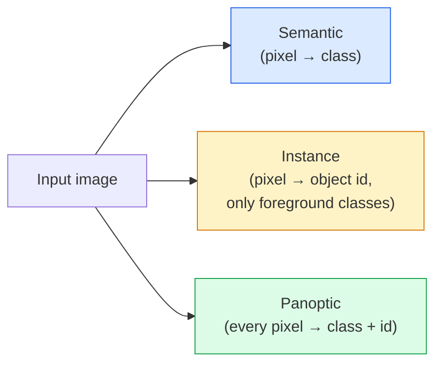
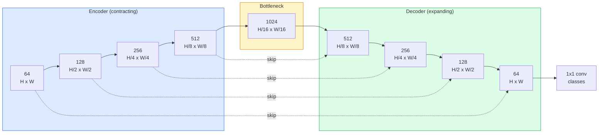

# Segmentação semântica  U-Net

> Segmentação é para cada pixel  Classificação. U-Net                                                                                                                                                                                                                                                                                                                                                                                                                                                                                                              

**Type:** Build
**Languages:** Python
**Prerequisites:** Phase 4 Lesson 03 (CNNs), Phase 4 Lesson 04 (Image Classification)
**Time:** ~75 minutes

## Objectivo de aprendizagem
- 区分 semântica、instância 和 panóptica segmentação,并为给定问题选择正确任务
- Em PyTorch, desde zero construção U-Net, contém blocos de codificação, garganta de engarrafamento, decodificador de convulsões transpostas, bem como conexões de salto
-                                                                                                                                                                                                                                                                                                                                                                                                                                                                                                                              
- 按类 解读 IoU 和 Dice métricas,并诊断低分是来自小物体回忆、限度精度,还是类失衡

## 问题
Classificação para cada imagem 输出一个标签──Detecção para cada imagem 输出少量框──Segmentação para cada pixel 输出一个标签──对于大小为`H x W`De entrada, saída é forma `H x W`(semântica) ou `H x W x N_instances`Isto significa que cada imagem tem milhões de previsões, não uma.

A estrutura da segmentação explica por que ela suporta quase todas as visões de previsão densa. Produtos: imagem médica (mascaras de tumor)  condução autônoma (estrada, faixa, obstáculo)  satélite (pedras de construção, limites de culturas)  análise de documentos (zona de layout)  robótica (regiões compreensíveis)  Estas tarefas não podem ser realizadas para que o objeto possa desenhar uma caixa para resolver; elas precisam de uma silhueta precisa.

架构问题说起来简单,但解决起来不简单:你需要网络同时看图片的全球背景 (tude que tipo de cena é essa) e detalhes de pixels locais (tude que pixel é a estrada, onde é o pavimento) 标准 CNN 会在空间维度上压缩以获得背景,但这会丢失.

## 概念
### 语义 vs 实例 vs 全景



- **Semantic**Expresso que este pixel é uma estrada, aquele pixel é um carro.
- **Instance**Expresso: Este pixel é o carro #3, aquele pixel é o carro #5.
- **Panoptic**Para que os dois se juntem: cada pixel recebe uma etiqueta de classe, cada instância recebe uma identificação única, coisas e coisas são segmentadas.

本课涵盖语义──下一课(Máscara R-CNN) abrangendo instância──

### A forma da U-Net



Encoder vai resolver o espaço  reduzir metade quatro vezes,并将频道 翻倍──decoder 反向执行:将空间分辨率 翻倍四次,并将频道 减半──Skip connections 会在每个分辨率上把匹配的编码功能与解码功能 进行连接──最终的1x1 conv 在全分辨率下将`64 -> num_classes`- Não.

Por que saltar conexões é necessário: quando o decodificador tenta produzir previsões de nível de píxel, ele só vê muito pequenos mapas de recursos. Não saltar, não consegue localizar as bordas com precisão, porque essas informações já estão comprimidas no encodificador.

### Transposto versus amostra de ascensão bilinear

O decodificador  deve expandir as dimensões espaciais 

- **Transposed convolution**(`nn.ConvTranspose2d`)  可学习的上方示例──历史上的 U-Net 默认方案──如果步骤和内核尺寸 不能整除,可能产生棋牌文物──
- **Bilinear upsample + 3x3 conv** 平滑 upsample 后接一个 conv──Artifactos, 更少, parâmetros, 更少,现在是现代默认方案──

O segundo é o que se pode ver no projeto real.

### Grade de pixels de cima de entropia cruzada

对于包含C 个类的语义细分,model output是 `(N, C, H, W)`❖ O alvo é `(N, H, W)`, contém IDs de classe inteira. A entropia cruzada é completamente a mesma que a Classificação, apenas aplicada em cada posição espacial.

```
Loss = mean over (n, h, w) of -log( softmax(logits[n, :, h, w])[target[n, h, w]] )
```

PyTorch 中的 `F.cross_entropy`Não é preciso remodelar.

### Perda de dados e por que precisa dela

A entropia cruzada é igual a cada pixel. Quando a maior parte da estrutura de ocupação de uma classe é errada.

Perda de dados  através da optimização direta da mascara prevista e da sobreposição entre a mascara verdadeira  para resolver este problema:

```
Dice(p, y) = 2 * sum(p * y) / (sum(p) + sum(y) + epsilon)
Dice_loss = 1 - Dice
```

Entre eles `p`é um mapa de probabilidade de sigmoid/softmax de uma classe,`y`É a máscara de verdade binária. Só quando se sobrepõem, perdas são para zero. Porque é baseada em relação, desequilíbrio de classes não está mais relacionado.

实践中, utilização **combined loss**- Não .

```
L = L_cross_entropy + lambda * L_dice       (lambda ~ 1)
```

A entropia cruzada no treinamento   inicial fornecer um gradiente estável; Dice  posterior   formação                                                                                                                                                                                                                                                                                                                                                                                                                                                                                                   

### Metricas de avaliação

- **Pixel accuracy** 预测正确的像素 百分比──计算便宜──与分类中的精度一样,在不平衡的数据上会失效──
- **IoU per class** Cada classe de máscara de intersecção sobre a união; entre as classes 求平均 = mIoU。
- **Dice (F1 on pixels)** 类似 IoU;`Dice = 2 * IoU / (1 + IoU)`❖ Imagem médica, mais preferido Dice, condução da comunidade, mais preferido IoU;
- **Boundary F1**  Medir as fronteiras previstas e a proximidade das fronteiras da verdade e da terra, mesmo que um pequeno desvio seja punido.   Para as tarefas de alta precisão de inspeção de semicondutores, etc.       

                                                                                                                                                                                                                                                                                                                                                                                                                                                                                                                             

### Resolução de entrada 权衡

O codificador da U-Net vai reduzir a resolução em 4 vezes, por isso a entrada deve ser feita em 16 partes. Imagens médicas geralmente são 512x512 ou 1024x1024.`H * W * C_max`缩放,在1024x1024 且瓶为1024 时,前途通过 已经会使用数GB VRAM──

Duas soluções de trabalho:
1. Tire a entrada de 256x256 telhas de sobreposição, e depois costure-las.
2. Usar convulsões dilatadas  substituir garganta de engarrafamento, em manter maior resolução espacial                                                                                                                                                                                                                                                                                                                                                                                                                                                                                                   

Para o primeiro modelo, usar entrada 256x256 e U-Net baseado em 64 canais pode ser usado em 8 GB de VRAM para treinamento confortável.


```figure
segmentation-flood
```

## Construí-lo
### 步骤 1: Bloco de codificação

两个3x3 convs,带批量规范和 ReLU;;第一 conv 改变频道数;第二保持不变;;

```python
import torch
import torch.nn as nn
import torch.nn.functional as F

class DoubleConv(nn.Module):
    def __init__(self, in_c, out_c):
        super().__init__()
        self.net = nn.Sequential(
            nn.Conv2d(in_c, out_c, kernel_size=3, padding=1, bias=False),
            nn.BatchNorm2d(out_c),
            nn.ReLU(inplace=True),
            nn.Conv2d(out_c, out_c, kernel_size=3, padding=1, bias=False),
            nn.BatchNorm2d(out_c),
            nn.ReLU(inplace=True),
        )

    def forward(self, x):
        return self.net(x)
```

Este bloco vai ser usado de novo.`bias=False`É porque a beta do BN já tratou o viés.

### 步骤 2: Blocos para baixo e para cima

```python
class Down(nn.Module):
    def __init__(self, in_c, out_c):
        super().__init__()
        self.net = nn.Sequential(
            nn.MaxPool2d(2),
            DoubleConv(in_c, out_c),
        )

    def forward(self, x):
        return self.net(x)


class Up(nn.Module):
    def __init__(self, in_c, out_c):
        super().__init__()
        self.up = nn.Upsample(scale_factor=2, mode="bilinear", align_corners=False)
        self.conv = DoubleConv(in_c, out_c)

    def forward(self, x, skip):
        x = self.up(x)
        if x.shape[-2:] != skip.shape[-2:]:
            x = F.interpolate(x, size=skip.shape[-2:], mode="bilinear", align_corners=False)
        x = torch.cat([skip, x], dim=1)
        return self.conv(x)
```

Só para verificar a forma espacial.`shape[-2:]`) pode processar dimensões não pode ser submetido a 16 entradas;`F.interpolate`O teor de tensão de um conjunto de tensões é muito mais elevado do que o teor de tensão de um conjunto de tensões.

### 步骤 3: A U-Net

```python
class UNet(nn.Module):
    def __init__(self, in_channels=3, num_classes=2, base=64):
        super().__init__()
        self.inc = DoubleConv(in_channels, base)
        self.d1 = Down(base, base * 2)
        self.d2 = Down(base * 2, base * 4)
        self.d3 = Down(base * 4, base * 8)
        self.d4 = Down(base * 8, base * 16)
        self.u1 = Up(base * 16 + base * 8, base * 8)
        self.u2 = Up(base * 8 + base * 4, base * 4)
        self.u3 = Up(base * 4 + base * 2, base * 2)
        self.u4 = Up(base * 2 + base, base)
        self.outc = nn.Conv2d(base, num_classes, kernel_size=1)

    def forward(self, x):
        x1 = self.inc(x)
        x2 = self.d1(x1)
        x3 = self.d2(x2)
        x4 = self.d3(x3)
        x5 = self.d4(x4)
        x = self.u1(x5, x4)
        x = self.u2(x, x3)
        x = self.u3(x, x2)
        x = self.u4(x, x1)
        return self.outc(x)

net = UNet(in_channels=3, num_classes=2, base=32)
x = torch.randn(1, 3, 256, 256)
print(f"output: {net(x).shape}")
print(f"params: {sum(p.numel() for p in net.parameters()):,}")
```

Forma de saída `(1, 2, 256, 256)` Comparável ao tamanho espacial da entrada, contendo `num_classes`- Os canais.`base=32`Parâmetros de 7,7 M.

### 步骤 4: Perdas

```python
def dice_loss(logits, targets, num_classes, eps=1e-6):
    probs = F.softmax(logits, dim=1)
    targets_one_hot = F.one_hot(targets, num_classes).permute(0, 3, 1, 2).float()
    dims = (0, 2, 3)
    intersection = (probs * targets_one_hot).sum(dim=dims)
    denom = probs.sum(dim=dims) + targets_one_hot.sum(dim=dims)
    dice = (2 * intersection + eps) / (denom + eps)
    return 1 - dice.mean()


def combined_loss(logits, targets, num_classes, lam=1.0):
    ce = F.cross_entropy(logits, targets)
    dc = dice_loss(logits, targets, num_classes)
    return ce + lam * dc, {"ce": ce.item(), "dice": dc.item()}
```

Dias 按类 计算后再平均(macro Dias) 。`eps`防止 batch 中缺失某些类 时出现除零──

### 步骤 5: Metrica de IUI

```python
@torch.no_grad()
def iou_per_class(logits, targets, num_classes):
    preds = logits.argmax(dim=1)
    ious = torch.zeros(num_classes)
    for c in range(num_classes):
        pred_c = (preds == c)
        true_c = (targets == c)
        inter = (pred_c & true_c).sum().float()
        union = (pred_c | true_c).sum().float()
        ious[c] = (inter / union) if union > 0 else torch.tensor(float("nan"))
    return ious
```

返回长度为 C's Vector。`nan`标记批 中缺失类  计算 mIoU 时不要把这些值纳入平均――

### 步骤 6: conjunto de dados sintéticos para verificação de ponta a ponta

Em fundos coloridos, as formas são geradas, fazendo com que a rede tenha de aprender a forma, em vez de a cor de píxeles.

```python
import numpy as np
from torch.utils.data import Dataset, DataLoader

def synthetic_segmentation(num_samples=200, size=64, seed=0):
    rng = np.random.default_rng(seed)
    images = np.zeros((num_samples, size, size, 3), dtype=np.float32)
    masks = np.zeros((num_samples, size, size), dtype=np.int64)
    for i in range(num_samples):
        bg = rng.uniform(0, 1, (3,))
        images[i] = bg
        masks[i] = 0
        num_shapes = rng.integers(1, 4)
        for _ in range(num_shapes):
            cls = int(rng.integers(1, 3))
            color = rng.uniform(0, 1, (3,))
            cx, cy = rng.integers(10, size - 10, size=2)
            r = int(rng.integers(4, 12))
            yy, xx = np.meshgrid(np.arange(size), np.arange(size), indexing="ij")
            if cls == 1:
                mask = (xx - cx) ** 2 + (yy - cy) ** 2 < r ** 2
            else:
                mask = (np.abs(xx - cx) < r) & (np.abs(yy - cy) < r)
            images[i][mask] = color
            masks[i][mask] = cls
        images[i] += rng.normal(0, 0.02, images[i].shape)
        images[i] = np.clip(images[i], 0, 1)
    return images, masks


class SegDataset(Dataset):
    def __init__(self, images, masks):
        self.images = images
        self.masks = masks

    def __len__(self):
        return len(self.images)

    def __getitem__(self, i):
        img = torch.from_numpy(self.images[i]).permute(2, 0, 1).float()
        mask = torch.from_numpy(self.masks[i]).long()
        return img, mask
```

Três classes: fundo (0) 、círculos (1) 、quadrados (2)  Rede 必須学会区分形──

### 步骤 7: Loop de treinamento

```python
def train_one_epoch(model, loader, optimizer, device, num_classes):
    model.train()
    loss_sum, total = 0.0, 0
    iou_sum = torch.zeros(num_classes)
    for x, y in loader:
        x, y = x.to(device), y.to(device)
        logits = model(x)
        loss, _ = combined_loss(logits, y, num_classes)
        optimizer.zero_grad()
        loss.backward()
        optimizer.step()
        loss_sum += loss.item() * x.size(0)
        total += x.size(0)
        iou_sum += iou_per_class(logits, y, num_classes).nan_to_num(0)
    return loss_sum / total, iou_sum / len(loader)
```

Em conjunto de dados sintéticos 上运行 10-30 épocas, observar classes de forma mIoU 爬升到0.9 以上──注意,`nan_to_num(0)`A partir de 1 de janeiro de 2013, o grupo de pesquisa de pesquisa de pesquisa de pesquisa de pesquisa de pesquisa de pesquisa de pesquisa de pesquisa de pesquisa de pesquisa de pesquisa de pesquisa de pesquisa de pesquisa de pesquisa de pesquisa de pesquisa de pesquisa de pesquisa de pesquisa de pesquisa de pesquisa de pesquisa de pesquisa de pesquisa de pesquisa de pesquisa de pesquisa de pesquisa de pesquisa de pesquisa de pesquisa de pesquisa de pesquisa de pesquisa de pesquisa de pesquisa de pesquisa de pesquisa de pesquisa de pesquisa de pesquisa de pesquisa de pesquisa de pesquisa de pesquisa de pesquisa de pesquisa de pesquisa de pesquisa de pesquisa de pesquisa de pesquisa de pesquisa de pesquisa de pesquisa de pesquisa de pesquisa de pesquisa de pesquisa de pesquisa de pesquisa de pesquisa de pesquisa de pesquisa de pesquisa de pesquisa de pesquisa de pesquisa de pesquisa de pesquisa de pesquisa de pesquisa de pesquisa de pesquisa de pesquisa de pesquisa de pesquisa de pesquisa de pesquisa de pesquisa de pesquisa de pesquisa de pesquisa de pesquisa de pesquisa de pesquisa de pesquisa de pesquisa de pesquisa de pesquisa de pesquisa de pesquisa de pesquisa de pesquisa de pesquisa de pesquisa de pesquisa de pesquisa de pesquisa de pesquisa de pesquisa de pesquisa de pesquisa de pesquisa de pesquisa de pesquisa de pesquisa de pesquisa de pesquisa de pesquisa de pesquisa de pesquisa de pesquisa de pesquisa de pesquisa de pesquisa de pesquisa de pesquisa de pesquisa de pesquisa de pesquisa de pesquisa de pesquisa de pesquisa de pesquisa de pesquisa de pesquisa de pesquisa de pesquisa de pesquisa de pesquisa de pesquisa de pesquisa de pesquisa de pesquisa de pesquisa de pesquisa de pesquisa de pesquisa de pesquisa de pesquisa de pesquisa de pesquisa de pesquisa de pesquisa de pesquisa de pesquisa de pesquisa de pesquisa de pesquisa de pesquisa de pesquisa de pesquisa de pesquisa de pesquisa de pesquisa de pesquisa de pesquisa de pesquisa de pesquisa de pesquisa de pesquisa de pesquisa de pesquisa de`torch.nanmean`Não é aqui que se encontra a média.

## Use-o
 para a produção,`segmentation_models_pytorch`("smp") usando qualquer torchvision ou timm backbone 封装了所有标准分类架构──三行代码:

```python
import segmentation_models_pytorch as smp

model = smp.Unet(
    encoder_name="resnet34",
    encoder_weights="imagenet",
    in_channels=3,
    classes=3,
)
```

实际工作中 também vale a pena saber:
- **DeepLabV3+**Usar convases dilatadas  substituir baseadas em max-pool de downsampling, fazer garganta  manter resolução; em satélite e dados de condução  上边界更快──
- **SegFormer**将 conv encoder 替换为等级变压器; em muitos benchmarks 上是当前SOTA。
- **Mask2Former**- Não .**OneFormer**Na arquitetura única, um conjunto semântico, instância e segmentação panóptica.

É o terceiro.`smp`Ou `transformers`O seu sistema pode ser usado como substituto de drop-in, e o seu carregador de dados é o mesmo.

## Entrega-o
本课产出:

- `outputs/prompt-segmentation-task-picker.md` Um prompt, usado para fazer uma seleção entre a segmentação semântica e panóptica,并为给定任务命名架构──
- `outputs/skill-segmentation-mask-inspector.md` Uma habilidade, para relatar a distribuição de classes  estatísticas de mascaras previstas, bem como as classes sub-previsíveis ou confusas.

## 练习
1. **(Easy)**Por tarefa de segmentação binária ((prefeitura vs fundo) realização `bce_dice_loss` Em conjunto de dados sintético de duas classes 上验证, quando em primeiro plano apenas representa 5% de pixels 时, perda combinada em comparação com o BCE 收更快──
2. **(Medium)**- Não .`nn.Upsample + conv`up-block 替换为 `nn.ConvTranspose2d`up-block──在合成数据集上训练二者并比较 mIoU──观察 transposed-conv 版本中棋牌文物 出现位置──
3. **(Hard)**選取一個真實分區數據集 ((Oxford-IIIT Petes、Citiescapes mini split,或一組醫學),并將 U-Net 訓練到距離 `smp.Unet`Referência não excede 2 pontos de UIO¬, relatório por classe UIO, e identifique quais classes de UIO  participar em dados  ganhar mais 

## 关键术语
| Term | What people say | What it actually means |
|------|----------------|----------------------|
| Semantic segmentation | “标注每个 pixel” | 对每个 pixel 进行 C classes 的 Classification；同一 class 的 instances 会合并 |
| Instance segmentation | “标注每个 object” | 分离同一 class 的不同 instances；仅 foreground |
| Panoptic segmentation | “Semantic + instance” | 每个 pixel 得到一个 class；每个 thing instance 还得到一个唯一 id |
| Skip connection | “U-Net bridge” | 将 encoder features concatenate 到匹配 resolution 的 decoder features 中；保留 high-frequency detail |
| Transposed conv | “Deconvolution” | 可学习的 upsampling；可能产生 checkerboard artifacts |
| Dice loss | “Overlap loss” | 1 - 2|A ∩ B| / (|A| + |B|)；直接优化 mask overlap，并且对 class imbalance 鲁棒 |
| mIoU | “Mean intersection over union” | 跨 classes 平均 IoU；segmentation 的 community-standard metric |
| Boundary F1 | “Boundary accuracy” | 只在 boundary pixels 上计算的 F1 score；对 precision-critical tasks 很重要 |

## 延伸阅读
- [U-Net: Convolutional Networks for Biomedical Image Segmentation (Ronneberger et al., 2015)](https://arxiv.org/abs/1505.04597)Papel original; todos vão repetir a figura na segunda página
- [Fully Convolutional Networks (Long et al., 2015)](https://arxiv.org/abs/1411.4038) 首个将分区 变成端到端 conv problema de papel
- [segmentation_models_pytorch](https://github.com/qubvel/segmentation_models.pytorch) Segmentação de produção de referência; contém todas as arquiteturas padrão
- [Lessons learned from training SOTA segmentation (kaggle.com competitions)](https://www.kaggle.com/code/iafoss/carvana-unet-pytorch) 讲解为什么TTA、pseudo-etiquetado 和 classe de pesos em dados reais são importantes
