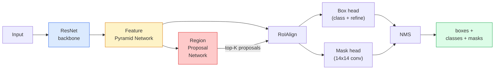

# Segmentação de instâncias  Máscara R-CNN

> 给Faster R-CNN detector加上一个很小的面具分支,就得到实例细分点在RoIAlign,而且看起来更难――

**Type:** Build + Learn
**Languages:** Python
**Prerequisites:** Phase 4 Lesson 06 (YOLO), Phase 4 Lesson 07 (U-Net)
**Time:** ~75 minutes

## Objectivo de aprendizagem
- 端到端追踪 Máscara R-CNN 架构: espinha dorsal、FPN、RPN、RoIAlign、cabeça de caixa、cabeça de máscara
- Desde zero realizando RoIAlign,并 explicar por que RoIPool não é mais usado
- Utilize torchvision `maskrcnn_resnet50_fpn_v2`modelo pré-treinado 生成 produção massa de máscaras de instância,并正确读取它的输出格式
- 通過交換盒 和 maski heads,并保持脊椎 结, 在小型自定义数据集上精细调 Mask R-CNN

## 问题
Segmentação semântica para cada classe  dá uma máscara―Segmentação de instância para cada objeto  dá uma máscara, mesmo que dois objetos pertenham à mesma classe―Statistics individual number、跨 tracking, bem como objetos de medição  de cada bloco  de bordas na parede  de cada célula das imagens visuais) todos necessitam de segmentação de instância―

Mascar R-CNN (He et al., 2017) 通过把实例细分重新表述为检测-plus-a-mask来解决这个问题―― Este design é muito simples, até os próximos cinco anos, quase todos os artigos sobre a segmentação de instâncias são variações da Mascar R-CNN, enquanto a implementação da torchvision até hoje ainda é uma escolha de produção de pequenos conjuntos de dados――

困难的工程问题是采样: como cortar uma região de características de tamanho fixo de uma caixa de propostas, enquanto o ponto de esquina dessa caixa não está ligado aos limites de pixels?

## 概念
### A arquitetura



需要理解五个部分:

1. **Backbone** Em ImageNet 上训练的ResNet-50 或ResNet-101──生成步骤为 4、8、16、32 de características mapas 层级──
2. **FPN (Feature Pyramid Network)** ligações laterais de cima para baixo, deixe cada nível ter recursos significativos de canais C;; Detecção de consulta com o tamanho do objeto  nível FPN 
3. **RPN (Region Proposal Network)** Uma pequena cabeça de convecção, em cada posição de âncora 上预测 Aqui há algum objeto?以及我该如何精细盒?──每张图像产生约1000 建议──
4. **RoIAlign** De nível FPN arbitrário  de caixa arbitrário 中采样固定大小(por exemplo 7x7) de parche de características── usar amostragem bilinear, não fazer quantização──
5. **Heads** 两层盒头,用于精细盒并选择类;再加一个小型卷头,为每一个提案 输出一个 `28x28`Mascara binária.

### Por que RoIAlign, e não RoIPool

O R-CNN inicial Fast usa RoIPool, que divide a caixa de proposta em uma grade, em cada célula, obtém a maior característica, e coloca todos os estágios em torno para o número completo. Essa redondadura fará com que o mapa de características e as coordenadas dos pixels de entrada o pixel de característica seja o máximo de erro em um pixel de mapa de características completo.

```
RoIPool:
  box (34.7, 51.3, 98.2, 142.9)
  round -> (34, 51, 98, 142)
  split grid -> round each cell boundary
  misalignment accumulates at every step

RoIAlign:
  box (34.7, 51.3, 98.2, 142.9)
  sample at exact float coordinates using bilinear interpolation
  no rounding anywhere
```

RoIAlign 能在 COCO 上免费提升 3-4 个点的面具 AP── agora cada detector de localização de cada重视 都会使用它, incluindo YOLOv7 seg、RT-DETR、Mask2Former──

### A RPN num parágrafo

Em cada posição do mapa de características, coloque K 个 个不同尺寸和形状的基箱. 对于每个基箱 预测一个对象性分数,以及一个回归抵消,用来将基变成更贴合对象的盒. 根据分数保留前约1000个盒,在IoU 0.7 下应用 NMS,然后把保留下来的盒 交给头. RPN utiliza sua própria mini-loss 训练, sua estrutura é semelhante à YOLO loss of Lesson 6, apenas duas classes de objetos / não object) 

### A cabeça da máscara

Para cada proposta, a cabeça de máscara é uma pequena FCN: quatro convases 3x3, uma 2x deconv, uma final de 1x1, em`28x28`resolução 下生成 `num_classes`个输出频道──只保留与预测类对应的频道;其他频道会被忽视──这将掩盖预测与分类解──

Colocar uma amostra de máscara de 28x28 para a proposta.

### Perdas

Mascaras R-CNN tem quatro tipos de perdas.

```
L = L_rpn_cls + L_rpn_box + L_box_cls + L_box_reg + L_mask
```

- `L_rpn_cls`- Não .`L_rpn_box` Objetividade das propostas do RPN + caixa Regressão。
- `L_box_cls` classificador de cabeças 上针对 (C+1) classes(incluem fundo) de entropia cruzada。
- `L_box_reg` Refinamento da caixa de cabeças 
- `L_mask` 28x28 saída de máscara 上的每像素二进制交叉

Cada perda tem seu próprio peso em comum; a implementação da torchvision irá expor-as como argumentos de construção.

### Formatos de saída

`torchvision.models.detection.maskrcnn_resnet50_fpn_v2`Retorno a uma lista de ditos, cada imagem em relação a um ditos:

```
{
    "boxes":  (N, 4) in (x1, y1, x2, y2) pixel coordinates,
    "labels": (N,) class IDs, 0 = background so indices are 1-based,
    "scores": (N,) confidence scores,
    "masks":  (N, 1, H, W) float masks in [0, 1] — threshold at 0.5 for binary,
}
```

Mascara 已是全像分辨率──28x28 output head 已在内部完成上样子──


```figure
cv3-roialign-sampling
```

## Construí-lo
### 步骤 1: RoIA align desde o zero

Mascar R-CNN este componente, com código para entender do que com letras descrição mais simples.

```python
import torch
import torch.nn.functional as F

def roi_align_single(feature, box, output_size=7, spatial_scale=1 / 16.0):
    """
    feature: (C, H, W) single-image feature map
    box: (x1, y1, x2, y2) in original image pixel coordinates
    output_size: side of the output grid (7 for box head, 14 for mask head)
    spatial_scale: reciprocal of the feature map stride
    """
    C, H, W = feature.shape
    x1, y1, x2, y2 = [c * spatial_scale - 0.5 for c in box]
    bin_w = (x2 - x1) / output_size
    bin_h = (y2 - y1) / output_size

    grid_y = torch.linspace(y1 + bin_h / 2, y2 - bin_h / 2, output_size)
    grid_x = torch.linspace(x1 + bin_w / 2, x2 - bin_w / 2, output_size)
    yy, xx = torch.meshgrid(grid_y, grid_x, indexing="ij")

    gx = 2 * (xx + 0.5) / W - 1
    gy = 2 * (yy + 0.5) / H - 1
    grid = torch.stack([gx, gy], dim=-1).unsqueeze(0)
    sampled = F.grid_sample(feature.unsqueeze(0), grid, mode="bilinear",
                            align_corners=False)
    return sampled.squeeze(0)
```

Cada valor numérico vem de posição bilinearmente amostrada. Não há arredondamento, não há quantização, nem há gradientes perdidos.

### 步骤 2: Comparar com o RoIAlign da torchvision

```python
from torchvision.ops import roi_align

feature = torch.randn(1, 16, 50, 50)
boxes = torch.tensor([[0, 10, 20, 100, 90]], dtype=torch.float32)  # (batch_idx, x1, y1, x2, y2)

ours = roi_align_single(feature[0], boxes[0, 1:].tolist(), output_size=7, spatial_scale=1/4)
theirs = roi_align(feature, boxes, output_size=(7, 7), spatial_scale=1/4, sampling_ratio=1, aligned=True)[0]

print(f"shape ours:   {tuple(ours.shape)}")
print(f"shape theirs: {tuple(theirs.shape)}")
print(f"max|diff|:    {(ours - theirs).abs().max().item():.3e}")
```

Em`sampling_ratio=1`且 `aligned=True`时,两者能在 `1e-5`É um bom jogo.

### 步骤 3: Carregar uma máscara R-CNN pré-treinada

```python
import torch
from torchvision.models.detection import maskrcnn_resnet50_fpn_v2, MaskRCNN_ResNet50_FPN_V2_Weights

model = maskrcnn_resnet50_fpn_v2(weights=MaskRCNN_ResNet50_FPN_V2_Weights.DEFAULT)
model.eval()
print(f"params: {sum(p.numel() for p in model.parameters()):,}")
print(f"classes (including background): {len(model.roi_heads.box_predictor.cls_score.out_features * [0])}")
```

46M parâmetros, 91 classes ((COCO) ⋅ primeira classe ((id 0) é o fundo; modelo real de teste todo o conteúdo são do id 1 开始。

### 步骤 4: Execute inferência

```python
with torch.no_grad():
    x = torch.randn(3, 400, 600)
    predictions = model([x])
p = predictions[0]
print(f"boxes:  {tuple(p['boxes'].shape)}")
print(f"labels: {tuple(p['labels'].shape)}")
print(f"scores: {tuple(p['scores'].shape)}")
print(f"masks:  {tuple(p['masks'].shape)}")
```

Forma do tensor da máscara é `(N, 1, H, W)`△ 0,5 por limiar, para cada objeto  get mascara binária:

```python
binary_masks = (p['masks'] > 0.5).squeeze(1)  # (N, H, W) boolean
```

### 步骤 5: Troca as cabeças para uma contagem de classes personalizada

常见的细调配方:复用脊椎、FPN 和 RPN; substituir duas cabeças de classificadores。

```python
from torchvision.models.detection.faster_rcnn import FastRCNNPredictor
from torchvision.models.detection.mask_rcnn import MaskRCNNPredictor

def build_custom_maskrcnn(num_classes):
    model = maskrcnn_resnet50_fpn_v2(weights=MaskRCNN_ResNet50_FPN_V2_Weights.DEFAULT)
    in_features = model.roi_heads.box_predictor.cls_score.in_features
    model.roi_heads.box_predictor = FastRCNNPredictor(in_features, num_classes)
    in_features_mask = model.roi_heads.mask_predictor.conv5_mask.in_channels
    hidden_layer = 256
    model.roi_heads.mask_predictor = MaskRCNNPredictor(in_features_mask, hidden_layer, num_classes)
    return model

custom = build_custom_maskrcnn(num_classes=5)
print(f"custom cls_score.out_features: {custom.roi_heads.box_predictor.cls_score.out_features}")
```

`num_classes`必須包含背景类,因此一個有4 物体类的数据集应使用 `num_classes=5`- Não.

### 步骤 6: Congelhe o que não precisa de treinamento

Em pequenos conjuntos de dados, 结脊椎和FPN── apenas deixe RPN objetividade + regressão, bem como duas cabeças,

```python
def freeze_backbone_and_fpn(model):
    # torchvision Mask R-CNN packs the FPN inside `model.backbone` (as
    # `model.backbone.fpn`), so iterating `model.backbone.parameters()` covers
    # both the ResNet feature layers and the FPN lateral/output convs.
    for p in model.backbone.parameters():
        p.requires_grad = False
    return model

custom = freeze_backbone_and_fpn(custom)
trainable = sum(p.numel() for p in custom.parameters() if p.requires_grad)
print(f"trainable after freeze: {trainable:,}")
```

Em dados de 500 imagens, essa é a diferença entre recepção e sobre-ajustamento.

## Use-o
Mascaras R-CNN completa ciclo de treinamento  apenas 40 行, e entre diferentes tarefas é fundamental: substituir conjuntos de dados, em seguida, começar a treinar.

```python
def train_step(model, images, targets, optimizer):
    model.train()
    loss_dict = model(images, targets)
    losses = sum(loss for loss in loss_dict.values())
    optimizer.zero_grad()
    losses.backward()
    optimizer.step()
    return {k: v.item() for k, v in loss_dict.items()}
```

`targets`A lista deve conter cada imagem que corresponde a um ditado, entre os quais:`boxes`- Não.`labels`和 `masks`(como `(num_instances, H, W)`tensores binários) ⋅ modelo em treinamento ⋅ retornar quatro perdas ⋅ dit, ⋅ eval ⋅ retornar previsões ⋅ lista, ⋅`model.training`Decidir.

`pycocotools`O avaliador irá fazer uma análise de dois números para determinar se a caixa é a cabeça da máscara ou a cabeça da máscara.

## Entrega-o
本课会产出:

- `outputs/prompt-instance-vs-semantic-router.md` Um prompt, vai apresentar três questões,并选择 instance vs semântica vs panóptica,以及精确的起始模型──
- `outputs/skill-mask-rcnn-head-swapper.md`Uma habilidade, uma nova.`num_classes`, para um modelo de detecção de torcha arbitrário.

## 练习
1. **(Easy)**Em 100 caixas aleatórias`torchvision.ops.roi_align`验证你的RoIAlign──报告最大绝对差值──同时运行RoIPool(pre-2017 behavior),并显示它在靠近边界的盒子上会偏离约1-2个特色图像素──
2. **(Medium)**Em um conjunto de dados personalizados de 50 imagens ((qualquer duas classes: balões, peixes, buracos, logos) para ajustar em forma fina`maskrcnn_resnet50_fpn_v2`结脊椎, treino 20 épocas, relatório máscara AP@0.5。
3. **(Hard)**Para usar a cabeça de máscara do R-CNN, a MAP deve ser substituída por uma versão de 56x56 em vez de 28x28.

## 关键术语
| Term | What people say | What it actually means |
|------|----------------|----------------------|
| Mask R-CNN | “Detection plus masks” | Faster R-CNN + 一个小型 FCN head，为每个 proposal 的每个 class 预测一个 28x28 mask |
| FPN | “Feature pyramid” | top-down + lateral connections，让每个 stride level 都有 C channels 的语义丰富 features |
| RPN | “Region proposer” | 一个小型 conv head，每张图像生成约 1000 个 object/no-object proposals |
| RoIAlign | “No-rounding crop” | 从任意 float-coordinate box 中以 bilinear 方式采样固定大小的 feature grid |
| RoIPool | “Pre-2017 crop” | 与 RoIAlign 用途相同，但会 round box coordinates；已经过时 |
| Mask AP | “Instance mAP” | 使用 mask IoU 而不是 box IoU 计算的 average precision；COCO instance segmentation metric |
| Binary mask head | “Per-class mask” | 为每个 proposal 的每个 class 预测一个 binary mask；只保留 predicted class 的 channel |
| Background class | “Class 0” | 兜底的 “no object” class；真实 classes 的 indices 从 1 开始 |

## 延伸阅读
- [Mask R-CNN (He et al., 2017)](https://arxiv.org/abs/1703.06870) 论文; Sobre o RoIAlign 的第3节是关键阅读
- [FPN: Feature Pyramid Networks (Lin et al., 2017)](https://arxiv.org/abs/1612.03144) FPN 论文; cada detector moderno
- [torchvision Mask R-CNN tutorial](https://pytorch.org/tutorials/intermediate/torchvision_tutorial.html) Loop de ajuste fino
- [Detectron2 model zoo](https://github.com/facebookresearch/detectron2/blob/main/MODEL_ZOO.md) Implementações de nível de produção, fornecendo quase todas as detecções e segmentação de pesos treinados de variações
