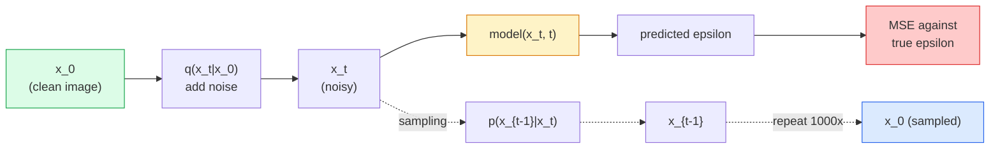

# 图像生成  Modelos de difusão

> O Modelo de Difusão é aprender a denotar. Treinar a remoção de um pequeno pedaço de ruído de imagens com ruído, reverso e repetido.

**Type:** Build
**Languages:** Python
**Prerequisites:** Phase 4 Lesson 07 (U-Net), Phase 1 Lesson 06 (Probability), Phase 3 Lesson 06 (Optimizers)
**Time:** ~75 分钟

## Objectivo de aprendizagem

- 推导 processo de som avançado `x_0 -> x_1 -> ... -> x_T`, e explica por que fechou .`q(x_t | x_0)`Para qualquer cidade
- 实现 um objetivo de treinamento de estilo DDPM, para regressar a cada passo do ruído, e realizar um amostragem de ruído puro  gradualmente retornar à imagem
- Construir uma U-Net condicionada no tempo(小到可以在CPU上训练), para prever ruído de qualquer passo do tempo
-                                                                                                                                                                                                                                                                                                                                                                                                                                                                                                                              

## 问题

Os GANs são geração única: ruído  entrada  saída de imagens, apenas precisa de uma passagem para a frente. Eles são rápidos, mas muito difíceis de treinar. Os modelos de difusão são geração de geração: de ruído puro  início, através de pequenos passos denoise, imagens gradualmente surgem. Eles são lentos, mas fáceis de treinar.

Além de treinar a estabilidade, a estrutura da difusão também desbloqueou todas as capacidades na geração moderna de imagens: condicionamento de texto, pintura, edição de imagens, super-resolução, estilo controlado. Cada passo do ciclo de amostragem é injetado em um novo conjunto. É esse gancho que faz com que a difusão estável, imagens, DALL-E 3 , Midjourney, bem como todos os modelos de imagem controlables que você usará, sejam baseados na difusão.

A "Stable Diffusion" irá integrá-la num sistema de produção, que contém um codificador de texto VAE e um guia sem classificador.

## 核心概念

### processo avançado

取一张图像 `x_0` 加入少量 Gaussian noise 得到 `x_1`△ re-instação de menor volume de ruído  get `x_2`Continuar a fazer o T                                                                                                                                                                                                                                                                                                                                                                                                                                                                                                                        `x_T`差不多与纯高斯噪音 区分── quase impossível comparar-se ao ruído gaussiano.

```
q(x_t | x_{t-1}) = N(x_t; sqrt(1 - beta_t) * x_{t-1},  beta_t * I)
```

`beta_t`É um menor cronograma de variação, geralmente em T=1000 步内 de 0,0001 线性增长到0.02── cada passo reduzirá ligeiramente o sinal e injetará um novo ruído──

### 闭式跳转

Passo a passo, o ruído é uma cadeia de Markov, mas matematicamente pode ser dobrado.`x_0`amostra 出 `x_t`- Não.

```
Define alpha_t = 1 - beta_t
Define alpha_bar_t = prod_{s=1..t} alpha_s

Then:
  q(x_t | x_0) = N(x_t; sqrt(alpha_bar_t) * x_0,  (1 - alpha_bar_t) * I)

Equivalently:
  x_t = sqrt(alpha_bar_t) * x_0 + sqrt(1 - alpha_bar_t) * epsilon
  where epsilon ~ N(0, I)
```

Esta única forma de difusão é capaz de ser implementada.`t`, directamente de`x_0`amostra 出 `x_t`,并一步完成训练, não precisa de simular a cadeia completa de Markov.

### processo inverso

Processo avançado é fixo.`p(x_{t-1} | x_t)`É uma rede neural que precisa aprender o seu conteúdo.`x_{t-1}`; prevêem o ruído no segundo passo `epsilon`, e depois , por uma fórmula matemática ,`x_{t-1}`- Não.



### 訓練 Perda

 Para cada passo de treinamento:

1. amostra 一张真实图像 `x_0`- Não.
2. De [1, T] 中均样本 一个时间步骤 `t`- Não.
3. ruído de amostra `epsilon ~ N(0, I)`- Não.
4. 计算 `x_t = sqrt(alpha_bar_t) * x_0 + sqrt(1 - alpha_bar_t) * epsilon`- Não.
5. Utilizando a rede 预测 `epsilon_theta(x_t, t)`- Não.
6. O que é que é ?`|| epsilon - epsilon_theta(x_t, t) ||^2`- Não.

É assim. Não há colisão, não há oscilação.

### amostragem (DDPM)

生成时: de`x_T ~ N(0, I)`Começo, passo a passo, para trás.

```
for t = T, T-1, ..., 1:
    eps = model(x_t, t)
    x_{t-1} = (1 / sqrt(alpha_t)) * (x_t - (beta_t / sqrt(1 - alpha_bar_t)) * eps) + sqrt(beta_t) * z
    where z ~ N(0, I) if t > 1, else 0
return x_0
```

O essencial é que, embora a condição inversa não tenha uma forma de encerramento conhecida, para este processo avançado gaussiano específico, ele tem um encerramento.

### Porquê mil passos?

O objetivo da seleção de cronograma de ruído avançado é fazer com que cada passo se inscreva no ruído suficiente, fazendo com que o passo inverso seja quase como Gaussian.

### DDIM:快 20 倍的采样

訓練相同,樣本化改變──DDIM(Song et al., 2020) definiu um processo inverso de determinação, pode saltar passos de tempo em caso de não re-entrenamento── usando o DDIM com 50 步樣本化, pode obter cerca de 1000 步 DDPM的質量──cada sistema de produção utiliza DDIM或更快的变体──DPM-Solver、Euler ancestral)──

### Condicionamento de tempo

rede `epsilon_theta(x_t, t)`需要知道它正在指明 哪个时间步骤──现代 Diffusion Models 通过突状时间嵌入 注入 `t`(A mesma ideia de codificação posicional em transformadores), e em cada nível de U-Net, adicione-o a mapas de recursos acima.

```
t_embedding = sinusoidal(t)
feature_map += MLP(t_embedding)
```

Sem condicionamento de tempo, a rede precisa de adivinhar o nível de ruído da imagem, isso também pode funcionar, mas a eficiência da amostra será muito baixa.


```figure
cv-diffusion-image
```

## Construí-lo

### 步骤 1: Programa de ruído

```python
import torch

def linear_beta_schedule(T=1000, beta_start=1e-4, beta_end=2e-2):
    return torch.linspace(beta_start, beta_end, T)


def precompute_schedule(betas):
    alphas = 1.0 - betas
    alphas_cumprod = torch.cumprod(alphas, dim=0)
    return {
        "betas": betas,
        "alphas": alphas,
        "alphas_cumprod": alphas_cumprod,
        "sqrt_alphas_cumprod": torch.sqrt(alphas_cumprod),
        "sqrt_one_minus_alphas_cumprod": torch.sqrt(1.0 - alphas_cumprod),
        "sqrt_recip_alphas": torch.sqrt(1.0 / alphas),
    }

schedule = precompute_schedule(linear_beta_schedule(T=1000))
```

previamente calcular uma vez, durante o treinamento e a amostragem quando o índice é reunido

### 步骤 2: Diffusão avançada (q_sample)

```python
def q_sample(x0, t, noise, schedule):
    sqrt_a = schedule["sqrt_alphas_cumprod"][t].view(-1, 1, 1, 1)
    sqrt_one_minus_a = schedule["sqrt_one_minus_alphas_cumprod"][t].view(-1, 1, 1, 1)
    return sqrt_a * x0 + sqrt_one_minus_a * noise
```

Uma linha fechada.`t`É um lote de etapas, lote de cada imagem em relação a uma.

### 步骤 3: Uma pequena U-Net condicionada no tempo

```python
import torch.nn as nn
import torch.nn.functional as F
import math

def timestep_embedding(t, dim=64):
    half = dim // 2
    freqs = torch.exp(-math.log(10000) * torch.arange(half, device=t.device) / half)
    args = t[:, None].float() * freqs[None]
    emb = torch.cat([args.sin(), args.cos()], dim=-1)
    return emb


class TinyUNet(nn.Module):
    def __init__(self, img_channels=3, base=32, t_dim=64):
        super().__init__()
        self.t_mlp = nn.Sequential(
            nn.Linear(t_dim, base * 4),
            nn.SiLU(),
            nn.Linear(base * 4, base * 4),
        )
        self.t_dim = t_dim
        self.enc1 = nn.Conv2d(img_channels, base, 3, padding=1)
        self.enc2 = nn.Conv2d(base, base * 2, 4, stride=2, padding=1)
        self.mid = nn.Conv2d(base * 2, base * 2, 3, padding=1)
        self.dec1 = nn.ConvTranspose2d(base * 2, base, 4, stride=2, padding=1)
        self.dec2 = nn.Conv2d(base * 2, img_channels, 3, padding=1)
        self.time_proj = nn.Linear(base * 4, base * 2)

    def forward(self, x, t):
        t_emb = timestep_embedding(t, self.t_dim)
        t_emb = self.t_mlp(t_emb)
        t_proj = self.time_proj(t_emb)[:, :, None, None]

        h1 = F.silu(self.enc1(x))
        h2 = F.silu(self.enc2(h1)) + t_proj
        h3 = F.silu(self.mid(h2))
        d1 = F.silu(self.dec1(h3))
        d2 = torch.cat([d1, h1], dim=1)
        return self.dec2(d2)
```

两层 U-Net, e em gargalo de botão Inject time conditioning── para uso em imagens reais, precisa ampliar profundidade e largura──

### 步骤 4: Loop de treinamento

```python
def train_step(model, x0, schedule, optimizer, device, T=1000):
    model.train()
    x0 = x0.to(device)
    bs = x0.size(0)
    t = torch.randint(0, T, (bs,), device=device)
    noise = torch.randn_like(x0)
    x_t = q_sample(x0, t, noise, schedule)
    pred = model(x_t, t)
    loss = F.mse_loss(pred, noise)
    optimizer.zero_grad()
    loss.backward()
    optimizer.step()
    return loss.item()
```

Não há jogo GAN, não há perda especial, só uma vez MSE 调用.

### 步骤 5: Amostra (DDPM)

```python
@torch.no_grad()
def sample(model, schedule, shape, T=1000, device="cpu"):
    model.eval()
    x = torch.randn(shape, device=device)
    betas = schedule["betas"].to(device)
    sqrt_one_minus_a = schedule["sqrt_one_minus_alphas_cumprod"].to(device)
    sqrt_recip_alphas = schedule["sqrt_recip_alphas"].to(device)

    for t in reversed(range(T)):
        t_batch = torch.full((shape[0],), t, dtype=torch.long, device=device)
        eps = model(x, t_batch)
        coef = betas[t] / sqrt_one_minus_a[t]
        mean = sqrt_recip_alphas[t] * (x - coef * eps)
        if t > 0:
            x = mean + torch.sqrt(betas[t]) * torch.randn_like(x)
        else:
            x = mean
    return x
```

Para fazer uma série de amostras, é preciso passar 1000 vezes para a frente.

### 步骤 6: amostragem DDIM (definitividade, aproximadamente 20 vezes)

```python
@torch.no_grad()
def sample_ddim(model, schedule, shape, steps=50, T=1000, device="cpu", eta=0.0):
    model.eval()
    x = torch.randn(shape, device=device)
    alphas_cumprod = schedule["alphas_cumprod"].to(device)

    ts = torch.linspace(T - 1, 0, steps + 1).long()
    for i in range(steps):
        t = ts[i]
        t_prev = ts[i + 1]
        t_batch = torch.full((shape[0],), t, dtype=torch.long, device=device)
        eps = model(x, t_batch)
        a_t = alphas_cumprod[t]
        a_prev = alphas_cumprod[t_prev] if t_prev >= 0 else torch.tensor(1.0, device=device)
        x0_pred = (x - torch.sqrt(1 - a_t) * eps) / torch.sqrt(a_t)
        sigma = eta * torch.sqrt((1 - a_prev) / (1 - a_t) * (1 - a_t / a_prev))
        dir_xt = torch.sqrt(1 - a_prev - sigma ** 2) * eps
        noise = sigma * torch.randn_like(x) if eta > 0 else 0
        x = torch.sqrt(a_prev) * x0_pred + dir_xt + noise
    return x
```

`eta=0`É totalmente definida: o mesmo ruído:`eta=1`Vai voltar a DDPM.

## Use-o

Produção de produtos`diffusers`- Não .

```python
from diffusers import DDPMScheduler, UNet2DModel

unet = UNet2DModel(sample_size=32, in_channels=3, out_channels=3, layers_per_block=2)
scheduler = DDPMScheduler(num_train_timesteps=1000)
```

Esta biblioteca fornece atuais agendadores ((DDPM、DDIM、DPM-Solver、Euler、Heun)、可配置的 U-Nets、text-to-image 和 image-to-image pipelines, bem como auxiliares de ajuste fino do LoRA。

No estudo,`k-diffusion`(Katherine Crowson) Há as melhores variantes de amostragem e a melhor referência para a realização.

## Entrega-o

本课会产出:

- `outputs/prompt-diffusion-sampler-picker.md` Um prompt, será baseado em objetivos de qualidade 延迟预算和条件定制 类型选择 DDPM / DDIM / DPM-Solver / Euler。
- `outputs/skill-noise-schedule-designer.md` Uma habilidade, de acordo com o nível de corrupção T 和 objetivo 生成線形、cosine 或 sigmoid beta schedule,并附带信号-噪音比 随时变化诊断图──

## 练习

1. **（简单）**可视化前进过程:取一张图像,并绘制 `t in [0, 100, 250, 500, 750, 1000]`时的 `x_t`❖ O teste `x_1000`Parece um barulho gaussiano.
2. **（中等）**Em conjunto de dados de círculos sintéticos, a TinyUNet 20 épocas, e mostra 16 círculos.
3. **（困难）**实现 cosine noise schedule ((Nichol & Dhariwal, 2021):`alpha_bar_t = cos^2((t/T + s) / (1 + s) * pi / 2)` Usar cronogramas lineares e cosinais                                                                                                                                                                                                                                                                                                                                                                                                                                                                                                                 

## 关键术语

| Term | 人们通常怎么说 | 实际含义 |
|------|----------------|----------------------|
| Forward process | “随时间加入 noise” | 一个固定的 Markov chain，会在 T 步内把图像破坏成 Gaussian noise |
| Reverse process | “一步步 denoise” | 学到的分布，会从 noise 逐步走回图像 |
| Epsilon prediction | “预测 noise” | 训练目标：`epsilon_theta(x_t, t)` 预测在第 t 步加入的 noise |
| Beta schedule | “noise 大小” | T 个小 variance 组成的序列，定义每一步进入多少 noise |
| alpha_bar_t | “累计保留因子” | 到时间 t 为止的 (1 - beta_s) 乘积；t 越大，剩余信号越少 |
| DDPM sampler | “Ancestral，随机” | 从每个 x_{t-1} 的 conditional Gaussian 中 sample；1000 步 |
| DDIM sampler | “确定性，快速” | 将 sampling 重写为确定性 ODE；20-100 步即可得到相似质量 |
| Time conditioning | “告诉 model 当前是哪个 t” | 注入 U-Net 的 t 的 sinusoidal embedding，让它知道 noise level |

## 延伸阅读

- [Denoising Diffusion Probabilistic Models (Ho et al., 2020)](https://arxiv.org/abs/2006.11239) 让 Diffusion 变得实用和 FID 上击败 GANs 的论文
- [Improved DDPM (Nichol & Dhariwal, 2021)](https://arxiv.org/abs/2102.09672) programação cosínica 和 v-parametrização
- [DDIM (Song, Meng, Ermon, 2020)](https://arxiv.org/abs/2010.02502) 让实时推断 成为可能的确定性样本
- [Elucidating the Design Space of Diffusion (Karras et al., 2022)](https://arxiv.org/abs/2206.00364) Para cada Diffusion design selection 统一视角; atual melhor referência
