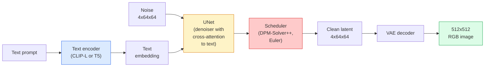

# Difusão estável  架构与细调

> A Diffusão Estavel é uma forma de DDPM, que opera no espaço latente do VAE, através da atenção cruzada, em termos de texto, usando um solvente ODE de rápida determinação.

**Type:** Learn + Use
**Languages:** Python
**Prerequisites:** Phase 4 Lesson 10 (Diffusion), Phase 7 Lesson 02 (Self-Attention)
**Time:** ~75 分钟

## Objectivo de aprendizagem
-  acompanhar o fluxo de difusão estável de cinco componentes: VAE, codificador de texto, U-Net, cronógrafo, verificador de segurança, e compreender o que eles fazem realmente
- Explicar a difusão latente, bem como por que se exercitar no espaço latente 4x64x64 (em vez de treinar em 3x512x512) pode ser reduzido 48x em caso de perda de qualidade
- Utilização `diffusers`生成图像,运行图像-to-image、inpainting 和 ControlNet 引导的生成
- Em pequenos conjuntos de dados de auto-definção, com LoRA de ajuste fino, Diffusão estável e inferência 时加载 LoRA adaptador

## 问题
直接在 512x512 RGB 图像上训练 DDPM 成本很高. Cada etapa de treinamento precisa passar por uma U-Net fazer Backpropagation, enquanto esta U-Net 看到的是 3x512x512 = 786,432 个输入值;采样也需要通过同一个 U-Net 进行50+次前进通过.

让开权重文本图像 变得实用技巧是 **latent diffusion**(Rombach et al., CVPR 2022)  Treinar um VAE, vai 3x512x512 图像映射到4x64x64 latent tensor 再映射回来, então em esse espaço latente 中做 Diffusion──计算量下降 `(3*512*512)/(4*64*64) = 48x` Em um mesmo bloco de GPU, o tempo de amostragem diminui de algumas décadas para dois segundos.

Quase todos os modelos de geração de imagens modernos SDXL、SD3、FLUX、HunyuanDiT、Wan-Video são modelos de difusão latente, apenas em autoencoder、denoiser(U-Net ou DiT) e em conteúdo condicionado têm mudanças.

## 概念
### O oleoduto



- **VAE** 结的自动编码器──Encoder 将图像转换为潜藏的(用于img2img 和训练)──Decoder 将潜藏的图像转回──
- **Text encoder** Encoder de texto CLIP ((SD 1.x/2.x)、CLIP-L + CLIP-G(SDXL) ou T5-XXL(SD3/FLUX)。
- **U-Net** denoiser──incluem níveis de atenção cruzada, em cada nível de resolução, desde os latentes de assistência até a incorporação de texto──
- **Scheduler** 采样算法(DDIM、Euler、DPM-Solver++) ・・・ seleccion sigmas,并将预测的噪音 混合回 latente──
- **Safety checker** 可選的输出图像 NSFW / 非法内容过器──

### Orientação sem classificador (CFG)

Normal text conditionalizações para cada pedido `c` 学习 `epsilon_theta(x_t, t, c)`O CFG está na mesma rede, mas 10% do tempo é perdido.`c`(substituição para embutidos em espaço), para obter um modelo único de som condicional e sem condições.

```
eps = eps_uncond + w * (eps_cond - eps_uncond)
```

`w`É a escala de orientação.`w=0`É incondicional.`w=1`É normal condicional,`w>1`O preço é de baixa variabilidade.`w=7.5`- Não.

O CFG é o texto-à-imagem  pode alcançar a qualidade de produção  Não há, a velocidade para a saída é muito fraca; se tiver, a velocidade irá dominar

### Geometria do espaço latente

O VAE de 4 canais latente não é apenas uma imagem comprimida. É um manifold, em que o cálculo operacional é feito em uma variedade de técnicas de engenharia rápida e interpolação, e também a Diffusion U-Net.

两个结果:

1. **Img2img**= Para codificar imagens como latentes, incluir parte de ruído, executar denoiso, re-decodificar.
2. **Inpainting**= Comparado com img2img, mas denotador apenas actualizar a máscara 区域; não mascara 区域 reserva para o codigo latente。

### A arquitetura da U-Net

SD U-Net é uma versão grande da TinyUNet, e aumentou três pontos:

- Em cada resolução espacial.**Transformer blocks**, contém auto-atenção + atenção transversal para a incorporação de texto.
- Através da codificação sinusoidal , obtemos o MLP .**Time embedding**- Não.
- Encoder e decoder em relação à resolução**Skip connections**- Não.

SD 1.5 de total de parâmetros: cerca de 860M。SDXL: cerca de 2.6B。FLUX: cerca de 12B。 O aumento dos parâmetros é principalmente proveniente da Attention 层。

### Ajuste fino do LoRA

Para a Diffusão Estabilizada fazer um ajuste completo  necessita de 20+ GB de VRAM,并更新 860M 个参数。LoRA(Low-Rank Adaptação) manter o modelo base 结,并向 Attention 层注入小型级分解矩阵。 Usado para o adaptador LoRA do SD geralmente é de 10-50 MB, em blocos de consumo de GPUs, em treinamento de 10-60 minutos, e em inferência 时作为 drop-in modificação 加载。

```
Original: W_q : (d_in, d_out)   frozen
LoRA:     W_q + alpha * (A @ B)   where A : (d_in, r), B : (r, d_out)

r is typically 4-32.
```

LoRA é a forma de distribuição de quase todos os locais de música.

### Os agendamentos que verão

- **DDIM** 确定性, cerca de 50 passos, simples.
- **Euler ancestral** 随机性,30-50 passos,样本略有创意──
- **DPM-Solver++ 2M Karras** 确定性,20-30 passos, produção默认选择──
- **LCM / TCD / Turbo** modelos de consistência e variantes destiladas;

Em`diffusers`O programa de mudança de rotas só precisa de uma linha de mudança, às vezes não precisa de qualquer reformulação.


```figure
cv3-latent-compression
```

## Construí-lo
本课端到端使用 `diffusers`, em vez de zero reconstrução Estabilidade de difusão. Você precisa reconstruir a parte (VAE, codificador de texto, U-Net, cronógrafo) são em si mesmos os temas de cada curso; o objetivo é familiarizar-se com a API de produção.

### 步骤 1: Texto para imagem

```python
import torch
from diffusers import StableDiffusionPipeline

pipe = StableDiffusionPipeline.from_pretrained(
    "runwayml/stable-diffusion-v1-5",
    torch_dtype=torch.float16,
).to("cuda")

image = pipe(
    prompt="a dog riding a skateboard in tokyo, studio ghibli style",
    guidance_scale=7.5,
    num_inference_steps=25,
    generator=torch.Generator("cuda").manual_seed(42),
).images[0]
image.save("dog.png")
```

`float16`Em caso de perda de qualidade invisível, a VRAM será reduzida em metade.`num_inference_steps=25`O efeito é equivalente ao uso de DDIM 时 `num_inference_steps=50`- Não.

### 步骤 2: Troca o cronograma

```python
from diffusers import DPMSolverMultistepScheduler, EulerAncestralDiscreteScheduler

pipe.scheduler = DPMSolverMultistepScheduler.from_config(pipe.scheduler.config)
pipe.scheduler = EulerAncestralDiscreteScheduler.from_config(pipe.scheduler.config)
```

O estado do cronograma com pesos da U-Net 解── pode treinar no DDPM, e depois usar o cronograma arbitrário 采样──

### 步骤 3: Imagem para imagem

```python
from diffusers import StableDiffusionImg2ImgPipeline
from PIL import Image

img2img = StableDiffusionImg2ImgPipeline.from_pretrained(
    "runwayml/stable-diffusion-v1-5",
    torch_dtype=torch.float16,
).to("cuda")

init_image = Image.open("dog.png").convert("RGB").resize((512, 512))
out = img2img(
    prompt="a dog riding a skateboard, oil painting",
    image=init_image,
    strength=0.6,
    guidance_scale=7.5,
).images[0]
```

`strength`Expressão em denúncia  antes de incluir o volume de ruído ((0.0 = 不变, 1.0 = 完全重新生成) ⋅0.5-0.7 é o padrão de transferência de estilo ⋅

### 步骤 4: Pintura

```python
from diffusers import StableDiffusionInpaintPipeline

inpaint = StableDiffusionInpaintPipeline.from_pretrained(
    "runwayml/stable-diffusion-inpainting",
    torch_dtype=torch.float16,
).to("cuda")

image = Image.open("dog.png").convert("RGB").resize((512, 512))
mask = Image.open("dog_mask.png").convert("L").resize((512, 512))

out = inpaint(
    prompt="a cat",
    image=image,
    mask_image=mask,
    guidance_scale=7.5,
).images[0]
```

A imagem branca dentro da máscara é a área a reproduzir.

### 步骤 5: Carregamento de LoRA

```python
pipe.load_lora_weights("sayakpaul/sd-lora-ghibli")
pipe.fuse_lora(lora_scale=0.8)

image = pipe(prompt="a village square in ghibli style").images[0]
```

`lora_scale`控制强度;0.0 = 无效,1.0 = 完整效果──`fuse_lora`Vai adaptar o original para o peso, mas vai impedir a mudança.`pipe.unfuse_lora()`- Não.

### 步骤 6: Formação do LoRA (esquema)

A formação real do LoRA está localizada`peft`Ou `diffusers.training`O seu currículo é:

```python
# Pseudocode
for step, batch in enumerate(dataloader):
    images, prompts = batch
    latents = vae.encode(images).latent_dist.sample() * 0.18215

    t = torch.randint(0, num_train_timesteps, (batch_size,))
    noise = torch.randn_like(latents)
    noisy_latents = scheduler.add_noise(latents, noise, t)

    text_emb = text_encoder(tokenizer(prompts))

    pred_noise = unet(noisy_latents, t, text_emb)  # LoRA weights injected here

    loss = F.mse_loss(pred_noise, noise)
    loss.backward()
    optimizer.step()
```

只有LoRA matrices 会接收 Gradient;base U-Net、VAE 和 text encoder都被结──使用批量为 1 和梯次检查点时,这可以适应8GBVRAM──

## Use-o
Na produção, as decisões que você realmente precisa fazer são:

- **Model family**SD 1.5 Utilizado em código aberto  comunidade de melodias finas, SDXL Utilizado em mais alta fidelidade, SD3 / FLUX Utilizado em estado de arte 和 rigoroso requisitos de licença。
- **Scheduler**:20-30 passos Utilize DPM-Solver++ 2M Karras; quando a latência 低于 1s 时使用 LCM-LoRA──
- **Precision**0480/4090 上使用 `float16`,A100 及更新设备上使用 `bfloat16`,VRAM 紧张时使用 `int8`(por via `bitsandbytes`Ou `compel`)。
- **Conditioning**Se precisar de um controlo mais forte, em linha de base 之上加入ControlNet(canny、depth、pose)

 para a produção em massa,`AUTO1111`- Não .`ComfyUI`É um instrumento comunitário; para produção de API, uso `diffusers`+ `accelerate`, ou usando compilação TensorRT `optimum-nvidia`- Não.

## Entrega-o
本课产出:

- `outputs/prompt-sd-pipeline-planner.md` Um prompt, irá basear-se no orçamento de latência, meta de fidelidade e restrição de licenciamento, escolha SD 1.5 / SDXL / SD3 / FLUX, bem como agendador e precisão.
- `outputs/skill-lora-training-setup.md` Uma habilidade, utilizada para definir um conjunto de dados para a elaboração de uma configuração completa de treinamento de LoRA, incluindo títulos, classificação, tamanho de lote e taxa de aprendizagem.

## 练习
1. **(Easy)**Utilização `[1, 3, 5, 7.5, 10, 15]`Em meio`guidance_scale`生成同一个提示──descrever como as imagens mudam── em que direção os artefatos começam a aparecer?
2. **(Medium)**選取任意真实照片, em `[0.2, 0.4, 0.6, 0.8, 1.0]`de `strength`Por aqui.`StableDiffusionImg2ImgPipeline`Qual força pode manter a estrutura ao mesmo tempo em que muda o estilo? Por que 1.0 irá ignorar completamente a entrada?
3. **(Hard)**Utilize um único objeto (物、logo、角色) de 10-20 张 image train a LoRA, e gerar um novo cenário do objeto.

## 关键术语
| Term | What people say | What it actually means |
|------|----------------|----------------------|
| Latent diffusion | “在 latents 中 diffuse” | 在 VAE latent space（4x64x64）而不是 pixel space（3x512x512）中运行整个 DDPM；节省 48x 计算量 |
| VAE scale factor | “0.18215” | 将 VAE 的原始 latent 重新缩放到大致 unit variance 的常数；硬编码在每个 SD pipeline 中 |
| Classifier-free guidance | “CFG” | 混合 conditional 和 unconditional noise predictions；影响最大的 inference knob |
| Scheduler | “Sampler” | 将 noise + model predictions 转换为 denoised latent trajectory 的算法 |
| LoRA | “Low-rank adapter” | 小型 rank-decomposition matrices，可在不触碰 base weights 的情况下 fine-tune Attention 层 |
| Cross-attention | “Text-image attention” | 从 latent tokens 到 text tokens 的 Attention；在每个 U-Net 层级注入 prompt 信息 |
| ControlNet | “Structure conditioning” | 一个单独训练的 adapter，用额外输入（canny、depth、pose、segmentation）引导 SD |
| DPM-Solver++ | “默认 scheduler” | 二阶确定性 ODE solver；在低 step counts（20-30）下拥有最佳质量（2026 年） |

## 延伸阅读
- [High-Resolution Image Synthesis with Latent Diffusion (Rombach et al., 2022)](https://arxiv.org/abs/2112.10752) Estabilidade de difusão 论文; contém prova de que cada ablação é razoável para o design
- [Classifier-Free Diffusion Guidance (Ho & Salimans, 2022)](https://arxiv.org/abs/2207.12598) CFG 论文
- [LoRA: Low-Rank Adaptation of Large Language Models (Hu et al., 2021)](https://arxiv.org/abs/2106.09685) LoRA foi inicialmente usado para a PNL; quase não precisa de modificações para se mudar para SD
- [diffusers documentation](https://huggingface.co/docs/diffusers) Referência de cada oleoduto SD / SDXL / SD3 / FLUX
