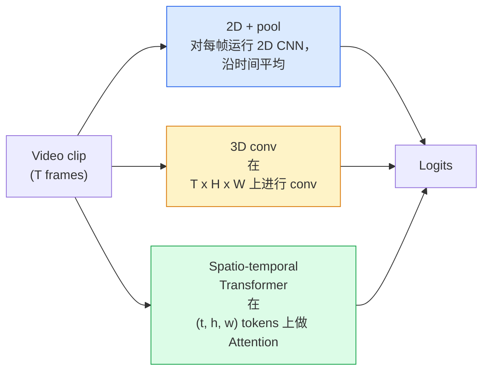

# Video Compreensão  时间建模

> 视频 é uma série de imagens, adicionando-as às regras físicas que as ligam. Cada modelo de vídeo deve considerar o tempo como um eixo extra.

**类型：**学习 + 构建
**语言：**Python
**先修要求：**Fase 4 Lição 03(CNNs),Fase 4 Lição 04(Classificação de imagem)
**时间：**- 45 minutos.

## Objectivo de aprendizagem

- 区分三种主要视频建模方法(2D+pool、3D conv、espacio-temporal Transformer),并预测它们在成本和准确率上取舍
- Em PyTorch, implementar a amostragem de quadros, a agregação temporal, bem como um classificador de linha de base 2D+pool
-  Explicar por que os kernels 3D podem muito bem mover os pesos da ImageNet, bem como as diferenças entre os conjuntos 2+1D
- Compreender os conjuntos de dados de reconhecimento de ação padrão com métricas: Kinética-400/600、UCF101、Algo-Algo V2; nível de vídeo e nível de vídeo top-1 precisão

## 问题

Um vídeo de 30 segundos ∼ 30 fps contém 900 张图像── simplesmente, classificação de vídeo é executar 900 vezes classificação de imagem, então fazer algum tipo de aglutinação── quando o movimento é praticamente em cada um deles, esse método é eficaz ̇ ̇ ̇ ̇ ̇ ̇ ̇ ̇ ̇ ̇ ̇ ̇ ̇ ̇ ̇ ̇ ̇ ̇ ̇ ̇ ̇ ̇ ̇ ̇ ̇ ̇ ̇ ̇ ̇ ̇ ̇ ̇ ̇ ̇ ̇ ̇ ̇ ̇ ̇ ̇ ̇ ̇ ̇ ̇ ̇ ̇ ̇ ̇ ̇ ̇ ̇ ̇ ̇ ̇ ̇ ̇ ̇ ̇ ̇ ̇ ̇ ̇ ̇ ̇ ̇ ̇ ̇ ̇ ̇ ̇ ̇ ̇ ̇ ̇ ̇ ̇ ̇ ̇ ̇ ̇ ̇ ̇ ̇ ̇ ̇ ̇ ̇ ̇ ̇ ̇ ̇ ̇ ̇ ̇ ̇ ̇ ̇ ̇ ̇ ̇ ̇ ̇ ̇ ̇ ̇ ̇ ̇ ̇ ̇ ̇ ̇ ̇ ̇ ̇ ̇ ̇ ̇ ̇ ̇ ̇ ̇ ̇ ̇ ̇ ̇ ̇ ̇ ̇ ̇ ̇ ̇ ̇ ̇ ̇ ̇ ̇ ̇ ̇ ̇ ̇ ̇ ̇ ̇ ̇ ̇ ̇ ̇ ̇ ̇ ̇ ̇ ̇ ̇ ̇ ̇ ̇ ̇ ̇ ̇ ̇ ̇ ̇ ̇ ̇ ̇ ̇ ̇ ̇ ̇ ̇ ̇ ̇ ̇ ̇ ̇ ̇ ̇ ̇ ̇ ̇ ̇ ̇ ̇ ̇ ̇ ̇ ̇ ̇ ̇ ̇ ̇ ̇ ̇ ̇ ̇ ̇ ̇ ̇ ̇ ̇ ̇ ̇ ̇ ̇ ̇ ̇ ̇ ̇ ̇ ̇ ̇ ̇ ̇ ̇ ̇ ̇ ̇ ̇ ̇ ̇ ̇ ̇ ̇ ̇ 

A questão central de cada arquitetura de vídeo é: estrutura temporal, em que momento, como é construída? A resposta determina tudo o mais, incluindo custos de cálculo, estratégias de treinamento, se pode usar pesos ImageNet e quais conjuntos de dados o modelo irá treinar.

O mecanismo central da imagem já está em vigor, enquanto a compreensão do vídeo se concentra principalmente na dimensão do tempo.

## 核心概念

### 3 tipos de construções



### 2D + piscina

取一个2D CNN(ResNet、EfficientNet、ViT) ⋅在每个采样上独立运行它──对每的嵌入做平均(或最大pool,或注意池)──将聚向量输入分类器──

优点:
- A pré-treinamento da ImageNet pode ser transferida diretamente.
- 实现最简单――
- 便宜:T  * 单张图像推理成本──

缺点:
- 无法建模 动作──Ação = concentração de aparências──
- A agregação temporal é insensível à ordem; a porta aberta e a porta fechada parecem iguais.

适用场景: para a aparência como tarefa principal 小视频数据集上的转移学习、初始基线──

### Convolções 3D

Para realizar convistas em tempo e espaço, os kernels 2D (H, W) serão substituídos por kernels 3D (T, H, W).

I3D 技巧: Pegue um modelo pré-treinado 2D ImageNet, vai cada núcleo 2D 沿新时间轴复制, తద్膨胀──a um 3x3 2D conv 变成一个 3x3x3 3D conv──这让3D model 拥有强大的预训重量,而不是从零开始训练──

优点:
- 直接建模moção
- Inflação I3D  fornecer transferência de aprendizagem gratuita

缺点:
- Por exemplo, a teoria de que o núcleo temporal é um núcleo temporal é um núcleo temporal.
- Os núcleos temporais 很小;长程 motion 需要 pyramid 或双流方法──

适用场景:motion is signal's action recognition (o movimento é o reconhecimento de ação de sinais)

### 时空 Transformadores

将视频 Tokenize 成空间-time patches 网格, e fazer entre todos os patches  Atenção──TimeSformer、ViViT、Video Swin、VideoMAE──

 Importantes Padrões de atenção:
- **Joint** Em (t, h, w) 上 fazer uma grande atenção──对 `T*H*W`呈二次复杂度;昂贵──
- **Divided** Cada bloco fazer duas vezes Atenção: uma vez ao longo do tempo, uma vez ao longo do espaço.
- **Factorised** Atenção temporal e atenção espacial em blocos 交换──

优点:
- Em todos os principais benchmarks, alcançar a precisão SOTA.
- 通過补丁通胀 从 image Transformers(ViT)迁移──
- 通過稀有注意 支持长文段视频──

缺点:
- 計算需求高──
- 需要谨慎选择 Atenção padrão, senão tempo de execução 会膨胀──

适用场景:大数据集、高保真 vídeo compreensão、multi-modal vídeo+tarefas de texto。

### Amostragem de quadros

Um clip de 10 segundos 、30 fps tem 300 ;

- **Uniform sampling** 在片中均选取 T ──2D+pool 的默认选择──
- **Dense sampling** 随机连续 T-frame window──3D convs 中常见,因为 motion 需要相邻──
- **Multi-clip** De um mesmo vídeo, em geral, são utilizadas várias janelas de T-frame, diferentes categorias, e em teste, previsões médias.

T normalmente é 8、16、32 ou 64、 maior T = mais sinal temporal, também significa mais cálculo。

### Avaliação

Dois níveis:
- **Clip-level accuracy** 模型 ver um clip de T-frame, relatar top-k―
- **Video-level accuracy** Previsões de nível de clipes de cada vídeo  média; mais alta e mais estável

始终报告两者──一个分数为78% clip / 82% video 模型高度依赖试验时间平均;一个分数为80% / 81% 模型在每片 上更强──

### O que você vai encontrar

- **Kinetics-400 / 600 / 700** 通用 action dataset──400k clips; URLs do YouTube(很多现在已经失效)──
- **Something-Something V2** 由 motion 定义的行动(moving X from left to right)── Impossível usar 2D+pool 解决──
- **UCF-101**- Não.**HMDB-51** 更老、更小, mas ainda são relatados.
- **AVA** Em espaço e tempo, a ação *localização*;


```figure
v4-video-temporal
```

## Construí-lo

### 步骤 1: Amostra de quadro

适用于

```python
import numpy as np

def sample_uniform(num_frames_total, T):
    if num_frames_total <= T:
        return list(range(num_frames_total)) + [num_frames_total - 1] * (T - num_frames_total)
    step = num_frames_total / T
    return [int(i * step) for i in range(T)]


def sample_dense(num_frames_total, T, rng=None):
    rng = rng or np.random.default_rng()
    if num_frames_total <= T:
        return list(range(num_frames_total)) + [num_frames_total - 1] * (T - num_frames_total)
    start = int(rng.integers(0, num_frames_total - T + 1))
    return list(range(start, start + T))
```

Os dois estão de volta .`T`Indices, utilizados para tensor de vídeo de pedaços.

### 步骤 2: uma linha de base 2D + pool

Em cada dia, a 2D ResNet-18 funciona com recursos de pool médio, depois,

```python
import torch
import torch.nn as nn
from torchvision.models import resnet18, ResNet18_Weights

class FramePool(nn.Module):
    def __init__(self, num_classes=400, pretrained=True):
        super().__init__()
        weights = ResNet18_Weights.IMAGENET1K_V1 if pretrained else None
        backbone = resnet18(weights=weights)
        self.features = nn.Sequential(*(list(backbone.children())[:-1]))  # global avg pool kept
        self.head = nn.Linear(512, num_classes)

    def forward(self, x):
        # x: (N, T, 3, H, W)
        N, T = x.shape[:2]
        x = x.view(N * T, *x.shape[2:])
        feats = self.features(x).view(N, T, -1)
        pooled = feats.mean(dim=1)
        return self.head(pooled)

model = FramePool(num_classes=10)
x = torch.randn(2, 8, 3, 224, 224)
print(f"output: {model(x).shape}")
print(f"params: {sum(p.numel() for p in model.parameters()):,}")
```

Em tarefas aparentemente pesadas, esta linha de base geralmente é apenas de 5-10 pontos mais baixa do que os modelos 3D reais, às vezes até melhor, porque ela usa uma espinha dorsal mais forte da ImageNet.

### 步骤 3: Convoltura 3D inflada em estilo I3D

通過新時間軸重复重重重重重重重重重重重重重重重重重重重重重重重重重重重重重重重重重重重重重重重重重重重重重重重重重重重重重重重重重重重重重重重重重重重重重重重重重重重重重重重重重重重重重重重重重重重重重重重重重重重重重重重重重重重重重重重重重重重重重重重重重重重重重重重重重重重重重重重重重重重重重重重重重重重重重重重重重重重重重重重重重重重重重重重重重重重重重重重重重重重重重重重重重重重重重重重重重重重重重重重重重重重重重重重重重重重重重重重重重重重重重重重重重重重重重重重重重重重重重重重重重重重重重重重重重重重重重重重重重重重重重重重重重重重重重重重重重重重重重重重重重重重重重重重重重重重重重重重重重重重重重重重重重重重重重重重重重重重重重重重重重重重重重重重重重重重重重重重重重重重重重重重重重重重重重重重重重重重重重重重重重重重重重重重重重重重重重重重重重重重重重重重重重重重重重重重重重重重重重重重重重重重重重重重重重重重重重重重重重重重重重重重重重重重重重重重重重重重重重重重重重重重重重重重重重重重重重重重重重重重重重重重重重重重重重重重重重重重重重重重重重重重重重重重重重重重重重重重重重重重重重重重

```python
def inflate_2d_to_3d(conv2d, time_kernel=3):
    out_c, in_c, kh, kw = conv2d.weight.shape
    weight_3d = conv2d.weight.data.unsqueeze(2)  # (out, in, 1, kh, kw)
    weight_3d = weight_3d.repeat(1, 1, time_kernel, 1, 1) / time_kernel
    conv3d = nn.Conv3d(in_c, out_c, kernel_size=(time_kernel, kh, kw),
                        padding=(time_kernel // 2, conv2d.padding[0], conv2d.padding[1]),
                        stride=(1, conv2d.stride[0], conv2d.stride[1]),
                        bias=False)
    conv3d.weight.data = weight_3d
    return conv3d

conv2d = nn.Conv2d(3, 64, kernel_size=3, padding=1, bias=False)
conv3d = inflate_2d_to_3d(conv2d, time_kernel=3)
print(f"2D weight shape:  {tuple(conv2d.weight.shape)}")
print(f"3D weight shape:  {tuple(conv3d.weight.shape)}")
x = torch.randn(1, 3, 8, 56, 56)
print(f"3D output shape:  {tuple(conv3d(x).shape)}")
```

Além de`time_kernel`Atividade de atividade é muito importante para não causar danos na primeira vez na divulgação de estatísticas de batch-norma.

### 步骤 4: Factorizado (2+1) D con

Para a análise de um campo de recepção, menor de parametros, em certos benchmarks, a taxa de precisão é melhor.

```python
class Conv2Plus1D(nn.Module):
    def __init__(self, in_c, out_c, kernel_size=3):
        super().__init__()
        mid_c = (in_c * out_c * kernel_size * kernel_size * kernel_size) \
                // (in_c * kernel_size * kernel_size + out_c * kernel_size)
        self.spatial = nn.Conv3d(in_c, mid_c, kernel_size=(1, kernel_size, kernel_size),
                                 padding=(0, kernel_size // 2, kernel_size // 2), bias=False)
        self.bn = nn.BatchNorm3d(mid_c)
        self.act = nn.ReLU(inplace=True)
        self.temporal = nn.Conv3d(mid_c, out_c, kernel_size=(kernel_size, 1, 1),
                                  padding=(kernel_size // 2, 0, 0), bias=False)

    def forward(self, x):
        return self.temporal(self.act(self.bn(self.spatial(x))))

c = Conv2Plus1D(3, 64)
x = torch.randn(1, 3, 8, 56, 56)
print(f"(2+1)D output: {tuple(c(x).shape)}")
```

Completa rede R(2+1) D é igual a uma ResNet-18, apenas substituir cada 3x3 conv para `Conv2Plus1D`- Não.

## Use-o

两个库覆盖了生产级视频工作:

- `torchvision.models.video` R(2+1) D、MViT、Swin3D, com pesos de cinética pré-entrenados。API Com modelos de imagem 相同──
- `pytorchvideo`(Meta)  modelo zoológico 、 utilizado para carregadores de dados de Kinetics / SSv2 / AVA 、 normas transformações 、

对于视频模型视频语言 (vidéus em língua de visão) 视频字幕化,视频QA),使用 `transformers`(`VideoMAE`- Não.`VideoLLaMA`- Não.`InternVideo`)。

## Entrega-o

本课会产出:

- `outputs/prompt-video-architecture-picker.md` Um prompt, de acordo com a aparência-vs-moção, tamanho do conjunto de dados e orçamento de cálculo  escolher 2D+pool / I3D / (2+1)D / Transformer。
- `outputs/skill-frame-sampler-auditor.md` Uma habilidade, usada para verificar o padrão de vídeo pipeline,并标记常见错误:off-by-one index,`num_frames < T`时 amostragem 不均、缺少 aspecto-preservando a cultura etc.

## 练习

1. **（简单）**計算 FramePool 在 T=8 时的FLOPs(近似值),并与 T=8 的 I3D-style 3D ResNet对比──说明为什么2D+pool 便宜 3-5 倍──
2. **（中等）**生成一合成视频数据集:随机小球朝随机方向移动,并按运动方向标注(左到右、右到左、斜面) ⋅ Em seu treinamento FramePool── mostrar sua precisão de velocidade perto do nível do tempo, de modo a provar apenas por aparência não é suficiente para completar tarefas de movimento──
3. **（困难）**通過將 ResNet-18 中的每個 Conv2d 替换为 `Conv2Plus1D`, construir um R(2+1) D-18── usando o ImageNet-pre-treinado ResNet-18 inflar o primeiro conv de pesos── em exercício 2 do conjunto de dados de movimento 上训练,并超过 FramePool──

## 关键术语

| Term | 人们常说 | 实际含义 |
|------|----------------|----------------------|
| 2D + pool | “Per-frame classifier” | 在每个采样帧上运行 2D CNN，跨时间 average-pool features，然后分类 |
| 3D convolution | “Spatio-temporal kernel” | 在 (T, H, W) 上进行 conv 的 kernel；可以原生建模 motion |
| Inflation | “Lift 2D weights to 3D” | 通过沿新的时间轴重复 2D conv 的 weights 来初始化 3D conv weights，然后除以 kernel_T 以保持 activation scale |
| (2+1)D | “Factorised conv” | 将 3D 拆成 2D spatial + 1D temporal；参数更少，中间多一个非线性 |
| Divided attention | “Time then space” | 每层有两次 Attention 的 Transformer block：一次在同一帧的 tokens 上，一次在同一位置的 tokens 上 |
| Clip | “T-frame window” | T 帧的采样子序列；video model 消费的单位 |
| Clip vs video accuracy | “Two eval settings” | Clip = 每个视频一个 sample，video = 对多个 sampled clips 取平均 |
| Kinetics | “The ImageNet of video” | 400-700 个 action classes，300k+ YouTube clips，标准 video pretraining corpus |

## 延伸阅读

- [I3D: Quo Vadis, Action Recognition (Carreira & Zisserman, 2017)](https://arxiv.org/abs/1705.07750)                                                                                                                                                                                                                                                                                                                                                                                                                                                                                                                            
- [R(2+1)D: A Closer Look at Spatiotemporal Convolutions (Tran et al., 2018)](https://arxiv.org/abs/1711.11248) con factorizado, até hoje ainda é forte linha de base
- [TimeSformer: Is Space-Time Attention All You Need? (Bertasius et al., 2021)](https://arxiv.org/abs/2102.05095)Primeiro Transformador de vídeo forte
- [VideoMAE (Tong et al., 2022)](https://arxiv.org/abs/2203.12602) Usado em vídeo de autoencoder mascarado pré-treino; actual principal receita de pré-treino
