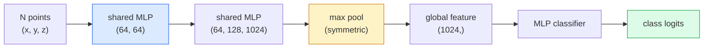

# Visão 3D  Nuvens de ponto e NeRFs

> Visão 3D tem duas formas. A nuvem de pontos é a saída original do sensor. A NeRF é o campo volumétrico que se aprende.

**类型：**Aprender + Construir
**语言：**Python
**先修：**Fase 4 Lição 03 (CNNs), Fase 1 Lição 12 (Operações de tensão)
**时间：**- 45 minutos.

## Objectivo de aprendizagem
- 区分显式(nuvem de pontos, rede, voxel) 和隐式(segnação de distância campo, NeRF) representações 3D,并理解各自适用场景
- Compreender a função simétrica da PointNet: como fazer com que a rede neural tenha uma permutação invariante
-  acompanhamento do NeRF para a frente pass: casting de raios  renderização volumétrica  codificação de posição  densidade MLP + cabeçalho de cor
- Utilização `nerfstudio`Ou `instant-ngp`Baseada em imagens de poses de menor quantidade , realização de reconstrução 3D pré-treinada

## 问题
A câmera  produz imagem 2D。LIDAR  produz um conjunto de pontos 3D sem ordem。 Estrutura-de-movimento pipeline  produz escassos pontos-chave 3D nuvem。NeRF pode ser usado para reconstruir imagens de poses com pouca quantidade de imagens em 3D。Todos eles pertencem à visão, mas não são como o tensor denso que a CNN quer。

Visão 3D  é importante, pois quase todas as tarefas de robôs de alto valor estão em 3D: agarrar, evitar obstáculos, navegação, oclusão de AR, captura de conteúdo 3D. Apenas entender a engenharia de visão de imagens 2D, será excluída da parte mais rápida do crescimento deste campo.

Estas duas categorias de representações, por diferentes razões, são dominadas.

## 概念
### Nuvens de ponto

Nuvem de pontos é um conjunto de pontos em N, cada ponto pode ser escolhido com características de cor, intensidade, normalidade.

```
cloud = [
  (x1, y1, z1, r1, g1, b1),
  (x2, y2, z2, r2, g2, b2),
  ...
  (xN, yN, zN, rN, gN, bN),
]
```

Não há rede, não há conectividade.

- **Permutation invariance** 输出不能依赖点的顺序──
- **Variable N** 单个模型 必须能够处理不同大小的云――

PointNet (Qi et al., 2017) utilizou uma ideia para resolver duas coisas: para cada aplicativo de ponto compartilhado MLP, e depois com função simétrica ((max pool)聚合── resultado é um vetor de tamanho fixo, e não depende da ordem──

```
f(P) = max_{p in P} MLP(p)
```

É o núcleo inteiro da PointNet.

### A arquitetura PointNet



MLP compartilhado  significa o mesmo MLP 独立地运行在每个点上──为了效率, normalmente se realiza por 1x1 conv de dimensão de ponto.

### Campo de Radiância Neural (NeRFs)

NeRFs (Mildenhall et al., 2020)  plantearam a questão:  我们能否从 N 张照片重建一个3D场景? `(x, y, z, viewing_direction)`映射到 `(density, colour)`染新视角 é um ciclo de transmissão de raios em torno da rede.

```
NeRF MLP:  (x, y, z, theta, phi) -> (sigma, r, g, b)

To render a pixel (u, v) of a new view:
  1. Cast a ray from the camera through pixel (u, v)
  2. Sample points along the ray at distances t_1, t_2, ..., t_N
  3. Query the MLP at each point
  4. Composite the colours weighted by (1 - exp(-sigma * dt))
  5. The sum is the rendered pixel colour
```

Loss 会将染出像素与训练照片中的地面真相像素 进行比较──通过染步骤做 Backprop 来更新 MLP──没有3D地面真相,没有显式几何学场景 存储在MLP weights中──

### Codificação de posição do NeRF

作用在 `(x, y, z)`O MLP de vanilla de cima não pode indicar alta frequência, porque os MLP de cima em baixo são de baixa frequência.

```
gamma(p) = (sin(2^0 pi p), cos(2^0 pi p), sin(2^1 pi p), cos(2^1 pi p), ...)
```

O máximo até L=10 níveis de frequência. Isto é o mesmo que os transformadores usam para posições, também aparecerá novamente no condicionamento de tempo de difusão.

### Renderamento volumétrico

```
C(r) = sum_i T_i * (1 - exp(-sigma_i * delta_i)) * c_i

T_i  = exp(- sum_{j<i} sigma_j * delta_j)
delta_i = t_{i+1} - t_i
```

`T_i`É transmitência, é que há muita luz que pode chegar ao ponto.`(1 - exp(-sigma_i * delta_i))`É um ponto de opacidade.`c_i`É cor. O pixel final é o aumento do raio.

### O que substituiu as NeRF

純 NeRFs 訓練慢(数小时), 染也慢(每张图数秒) ・・・

- **Instant-NGP**(2022)  codificação de rede de hash 替代 MLP 的位置输入;数秒内完成训练──
- **Mip-NeRF 360** 处理无限场景 和 antialiasing──
- **3D Gaussian Splatting**(2023)  Usando milhões de Gaussians 3D  substituir campo volumétrico; 数分钟训练,实时染──当前生产环境的默认选择──

Em 2026 quase todos os produtos reais de NeRF são, na verdade, 3D Gaussian splatting.

### Setos de dados e referências

- **ShapeNet** Classificação e segmentação de modelos CAD 3D como nuvens de pontos 
- **ScanNet** Usado para escaneamento de segmentação real.
- **KITTI** Utilizado para condução autônoma de Outdoor LIDAR Point Clouds。
- **NeRF Synthetic**- Não .**Blended MVS** Usado para visualizar conjuntos de dados de imagens de imagem de fotos de síntese.
- **Mip-NeRF 360**conjunto de dados  cenas reais ilimitadas。


```figure
nerf-rays
```

## Construí-lo
### 步骤 1: Classificador de PointNet

```python
import torch
import torch.nn as nn

class PointNet(nn.Module):
    def __init__(self, num_classes=10):
        super().__init__()
        self.mlp1 = nn.Sequential(
            nn.Conv1d(3, 64, 1),    nn.BatchNorm1d(64),   nn.ReLU(inplace=True),
            nn.Conv1d(64, 64, 1),   nn.BatchNorm1d(64),   nn.ReLU(inplace=True),
        )
        self.mlp2 = nn.Sequential(
            nn.Conv1d(64, 128, 1),  nn.BatchNorm1d(128),  nn.ReLU(inplace=True),
            nn.Conv1d(128, 1024, 1), nn.BatchNorm1d(1024), nn.ReLU(inplace=True),
        )
        self.head = nn.Sequential(
            nn.Linear(1024, 512),   nn.BatchNorm1d(512),  nn.ReLU(inplace=True),
            nn.Dropout(0.3),
            nn.Linear(512, 256),    nn.BatchNorm1d(256),  nn.ReLU(inplace=True),
            nn.Dropout(0.3),
            nn.Linear(256, num_classes),
        )

    def forward(self, x):
        # x: (N, 3, num_points) — transposed for Conv1d
        x = self.mlp1(x)
        x = self.mlp2(x)
        x = torch.max(x, dim=-1)[0]       # (N, 1024)
        return self.head(x)

pts = torch.randn(4, 3, 1024)
net = PointNet(num_classes=10)
print(f"output: {net(pts).shape}")
print(f"params: {sum(p.numel() for p in net.parameters()):,}")
```

约1.6M parâmetros― cada nuvem 运行在 1,024 个点上―

### 步骤 2: codificação de posição

```python
def positional_encoding(x, L=10):
    """
    x: (..., D) -> (..., D * 2 * L)
    """
    freqs = 2.0 ** torch.arange(L, dtype=x.dtype, device=x.device)
    args = x.unsqueeze(-1) * freqs * 3.141592653589793
    sinc = torch.cat([args.sin(), args.cos()], dim=-1)
    return sinc.reshape(*x.shape[:-1], -1)

x = torch.randn(5, 3)
y = positional_encoding(x, L=10)
print(f"input:  {x.shape}")
print(f"encoded: {y.shape}     # (5, 60)")
```

- Não .`2^l * pi`Vai-me dar frequências cada vez maiores.

### 步骤 3: Minus NeRF MLP

```python
class TinyNeRF(nn.Module):
    def __init__(self, L_pos=10, L_dir=4, hidden=128):
        super().__init__()
        self.L_pos = L_pos
        self.L_dir = L_dir
        pos_dim = 3 * 2 * L_pos
        dir_dim = 3 * 2 * L_dir
        self.trunk = nn.Sequential(
            nn.Linear(pos_dim, hidden), nn.ReLU(inplace=True),
            nn.Linear(hidden, hidden),  nn.ReLU(inplace=True),
            nn.Linear(hidden, hidden),  nn.ReLU(inplace=True),
            nn.Linear(hidden, hidden),  nn.ReLU(inplace=True),
        )
        self.sigma = nn.Linear(hidden, 1)
        self.color = nn.Sequential(
            nn.Linear(hidden + dir_dim, hidden // 2), nn.ReLU(inplace=True),
            nn.Linear(hidden // 2, 3), nn.Sigmoid(),
        )

    def forward(self, x, d):
        x_enc = positional_encoding(x, self.L_pos)
        d_enc = positional_encoding(d, self.L_dir)
        h = self.trunk(x_enc)
        sigma = torch.relu(self.sigma(h)).squeeze(-1)
        rgb = self.color(torch.cat([h, d_enc], dim=-1))
        return sigma, rgb

nerf = TinyNeRF()
x = torch.randn(128, 3)
d = torch.randn(128, 3)
s, c = nerf(x, d)
print(f"sigma: {s.shape}   rgb: {c.shape}")
```

Comparado com o NeRF original, há 2 profundidades de 8 troncos de MLP) em comparação muito pequeno.

### 步骤 4: Render volumétrico ao longo de um raio

```python
def volumetric_render(sigma, rgb, t_vals):
    """
    sigma: (..., N_samples)
    rgb:   (..., N_samples, 3)
    t_vals: (N_samples,) distances along the ray
    """
    delta = torch.cat([t_vals[1:] - t_vals[:-1], torch.full_like(t_vals[:1], 1e10)])
    alpha = 1.0 - torch.exp(-sigma * delta)
    trans = torch.cumprod(torch.cat([torch.ones_like(alpha[..., :1]), 1.0 - alpha + 1e-10], dim=-1), dim=-1)[..., :-1]
    weights = alpha * trans
    rendered = (weights.unsqueeze(-1) * rgb).sum(dim=-2)
    depth = (weights * t_vals).sum(dim=-1)
    return rendered, depth, weights


N = 64
t_vals = torch.linspace(2.0, 6.0, N)
sigma = torch.rand(N) * 0.5
rgb = torch.rand(N, 3)
rendered, depth, weights = volumetric_render(sigma, rgb, t_vals)
print(f"rendered colour: {rendered.tolist()}")
print(f"depth:           {depth.item():.2f}")
```

Um raio, 64 amostras, juntas para ser um pixel RGB e uma profundidade.

## Use-o
Usados para o trabalho real:

- `nerfstudio`(Tancik et al.)  当前用于 NeRF / Instant-NGP / Gaussian Splatting 的参考图书馆──命令行加网观看器──
- `pytorch3d`(Meta)  renderização diferenciável  utilidades de nuvem de ponto  operações de rede 
- `open3d` Processamento em nuvem de ponto, registo, visualização.

O espalteamento gaussiano 3D já substituiu fundamentalmente as NeRFs, pois se espalha a uma velocidade de 100 vezes mais rápida.

## Entrega-o
本课产出:

- `outputs/prompt-3d-task-router.md` Um prompt, irá de acordo com a tarefa 和 dados de entrada 路由到合适的3D representação ((nuvem de pontos, rede, voxel, NeRF, Gaussian splat) 
- `outputs/skill-point-cloud-loader.md`Uma habilidade para escrever PyTorch.`Dataset`,carrega .ply / .pcd / .xyz 文件,并 conduzir a normalização correcta, centrando e tomando amostras de pontos,

## 练习
1. **（Easy）**证明 PointNet é permutation-invariant:将同一个云运行两次,一次保持原顺序,一次打乱点――验证输出除了浮点噪音之外完全相同──
2. **（Medium）**实现 uma função de geração de raios mínimos: dado a intrínseca da câmera 和 pose, para cada pixel de imagem H x W 生成射源和方向──
3. **（Hard）**Em quadros de cores de cubos de renderização  sintetizando conjunto de dados 上训练 TinyNeRF(可通过可分化 rendering或简单射线追踪 生成) ⋅ relatório época 1、10 和 100   ⋅ ⋅ ⋅ ⋅ ⋅ ⋅ ⋅ ⋅ ⋅ ⋅ ⋅ ⋅ ⋅ ⋅ ⋅ ⋅ ⋅ ⋅ ⋅ ⋅ ⋅ ⋅ ⋅ ⋅ ⋅ ⋅ ⋅ ⋅ ⋅ ⋅ ⋅ ⋅ ⋅ ⋅ ⋅ ⋅ ⋅ ⋅ ⋅ ⋅ ⋅ ⋅ ⋅ ⋅ ⋅ ⋅ ⋅ ⋅ ⋅ ⋅ ⋅ ⋅ ⋅ ⋅ ⋅ ⋅ ⋅ ⋅ ⋅ ⋅ ⋅ ⋅ ⋅ ⋅ ⋅ ⋅ ⋅ ⋅ ⋅ ⋅ ⋅ ⋅ ⋅ ⋅ ⋅ ⋅ ⋅ ⋅ ⋅ ⋅ ⋅ ⋅ ⋅ ⋅ ⋅ ⋅ ⋅ ⋅ ⋅ ⋅ ⋅ ⋅ ⋅ ⋅ ⋅ ⋅ ⋅ ⋅ ⋅ ⋅ ⋅ ⋅ ⋅ ⋅ ⋅ ⋅ ⋅ ⋅ ⋅ ⋅ ⋅ ⋅ ⋅ ⋅ ⋅ ⋅ ⋅ ⋅ ⋅ ⋅ ⋅ ⋅ ⋅                                                                                                                                                                                                               

## 关键术语
| Term | 人们常说 | 实际含义 |
|------|----------------|----------------------|
| Point cloud | “来自 LIDAR 的 3D points” | 无序的 (x, y, z) 集合 + 每个点可选的 features |
| PointNet | “第一个用于 point clouds 的 neural net” | 每个点一个 shared MLP + symmetric (max) pool；结构上天然 permutation-invariant |
| NeRF | “本身就是 scene 的 MLP” | 将 (x, y, z, dir) 映射到 (density, colour) 的 network；通过 ray casting 渲染 |
| Positional encoding | “Fourier features” | 将每个 coordinate 编码为多个 frequencies 下的 sin/cos，以克服 MLP 的低频偏置 |
| Volumetric rendering | “Ray integration” | 使用 transmittance 和 alpha 将 ray 上的 samples 合成为单个 pixel |
| Instant-NGP | “Hash-grid NeRF” | 用 multi-resolution hash grid 替换 NeRF 的 coordinate MLP；快 100-1000 倍 |
| 3D Gaussian splatting | “数百万个 Gaussians” | Scene = 3D Gaussians 的集合；实时渲染，数分钟训练 |
| SDF | “Signed distance field” | 返回到最近 surface 的 signed distance 的 function；另一种 implicit representation |

## 延伸阅读
- [PointNet (Qi et al., 2017)](https://arxiv.org/abs/1612.00593) Classificador de permutação-invariante
- [NeRF (Mildenhall et al., 2020)](https://arxiv.org/abs/2003.08934) 让从照片进行3D重建 成为神经网络问题 的论文
- [Instant-NGP (Müller et al., 2022)](https://arxiv.org/abs/2201.05989) Grades de hash,1000 倍加速
- [3D Gaussian Splatting (Kerbl et al., 2023)](https://arxiv.org/abs/2308.04079) Na produção substituem NeRFs arquitetura
