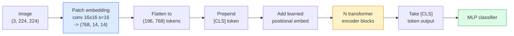

# Transformadores de visão (ViT)

> Vai cortar imagens em pedaços, vai cortar cada pedaço em uma palavra, vai fazer o transformador padrão.

**类型：**Construção
**语言：**Python
**前置要求：**Fase 7 Lição 02 (Atenção à Si Mesmo), Fase 4 Lição 04 (Classificação de Imagem)
**时间：**- 45 minutos.

## Objectivo de aprendizagem

- Desde implementar embutição de patch zero, aprendizado de embutição posicional, token de classe e blocos de codificação de transformador, construção de um ViT mínimo
- Explique por que ViT  foi considerado necessário ao nível do mar, até que DeiT e MAE provaram que não foi assim
- Desde um ângulo de construção anterior comparar ViT、Swin 和 ConvNeXt ((无先验、local window attention、conv backbone)
- Utilização `timm`和标准 linear-probe / fine-tune 流程,在小数据集上 fine-tune 预训练 ViT

## 问题

Durante dez anos, a convulsão  quase é o mesmo termo que a visão por computador. A CNN tem fortes preconceitos indutivos, incluindo a equivalência de localidade e tradução, ninguém acha que você pode substituí-los.

O resultado foi que os transformadores não tinham experiência útil, mas podiam aprender essa experiência com dados suficientes.

Até 2026, a pura CNN em dispositivos de ponta continua a ter concorrência, mas os transformadores dominaram quase todas as outras direções: segmentação, detecção, detecção, multimodal, vídeo, vídeo, vídeo, vídeo, vídeo, vídeo, vídeo, vídeo, vídeo, vídeo, vídeo, vídeo, vídeo, vídeo, vídeo, vídeo, vídeo, vídeo, vídeo, vídeo, vídeo, vídeo, vídeo, vídeo, vídeo, vídeo, vídeo, vídeo, vídeo, vídeo, vídeo, vídeo, vídeo, vídeo, vídeo, vídeo, vídeo, vídeo, vídeo, vídeo, vídeo, vídeo, vídeo, vídeo, vídeo, vídeo, vídeo, vídeo, vídeo, vídeo, vídeo, vídeo, vídeo, vídeo, vídeo, vídeo, vídeo, vídeo, vídeo, vídeo, vídeo, vídeo, vídeo, vídeo, vídeo, vídeo, vídeo, vídeo, vídeo, vídeo, vídeo, vídeo, vídeo, vídeo, vídeo, vídeo, vídeo, vídeo, vídeo, vídeo, vídeo, vídeo, vídeo, vídeo, vídeo, vídeo, vídeo, etc.

## 核心概念

### 流程



七个步骤――Patches -> tokens -> attention -> classifier──每个变体(DeiT、Swin、ConvNeXt、MAE pre-entrenamento)都只改变这七步中的一个两个,其余保持不变──

### Embedagem de parche

Primeiro conv é o chave. O núcleo de tamanho 16, passo 16, portanto, um张 224x224 图像会变成 14x14 的网格, composto por 16x16 parches, cada parche é projetado em 768-dim embuendo.

```
Input:  (3, 224, 224)
Conv (3 -> 768, k=16, s=16, no padding):
Output: (768, 14, 14)
Flatten spatial: (196, 768)
```

196 patches = 196 tokens。 dimensão de cada token é 768(ViT-B)、1024(ViT-L) ou 1280(ViT-H)。

### Token de classe

Em seguida, adicione um vetor aprendido:

```
tokens = [CLS; patch_1; patch_2; ...; patch_196]   shape (197, 768)
```

Passei por N 个 blocos de transformador 后,`[CLS]`saída é o total da imagem.

### Embarcação posicional

Transformadores 没有内置的空间位置概念──为每个代币加上一个学习向量:

```
tokens = tokens + learned_pos_embedding   (also shape (197, 768))
```

Esta incorporação é um parâmetro do modelo; treinamento baseado em gradiente fará com que se adapte à estrutura de imagem 2D. Também existe um alternativo sinusoidal 2D, mas na prática é muito pouco usado.

### Bloco de codificação do transformador

标准结构──Multi-head auto-attenção、MLP、conexões residuais、pre-LayerNorm──

```
x = x + MSA(LN(x))
x = x + MLP(LN(x))

MLP is two-layer with GELU: Linear(d -> 4d) -> GELU -> Linear(4d -> d)
```

ViT-B/16                                                                                                                                                                                                                                                                                                                                                                                                                                                                                                                         

### Por que usar pre-LN

早期 transformadores 使用 post-LN(`x = LN(x + sublayer(x))`), em caso de não aquecimento, o treino excede os 6-8 níveis é muito difícil.`x = x + sublayer(LN(x))`O programa de formação em formação em formação em formação em formação em formação em formação em formação em formação em formação em formação em formação em formação em formação em formação em formação em formação em formação em formação em formação em formação em formação em formação em formação em formação em formação em formação em formação em formação em formação em formação em formação em formação em formação em formação em formação em formação em formação em formação em formação em formação em formação em formação em formação em formação em formação em formação em formação em formação em formação em formação em formação em formação em formação em formação em formação em formação em formação em formação em formação em formação em formação em formação em formação em formação em formação em formação em formação em formação em formação em formação em formação em formação em formação em formação em formação em formação em formação em formação em formação em formação em formação em formação em formação em formação em formação em formação em formação em formação em formação em formação em formação em formação em formação em formação em formação em formação em formação em formação em formação em formação em formação em formação em formação em formação em formação em formação em formação em formação em formação em formação em formação em formação em formação em formação em formação em formação em formação em formação em formação em formação em formação em formação em formação em formação em formação em formação em formação em formação em formação em formação em formação em formação em formação em formação em formação em formação em formação em formação em formação em formação em formação em formação em formação em formação em formação em formação em formação em formação em formação em formação em formação em formação em formação em formação em formação em formação em formação em formação em formação em formação em formação em formação em formação em formação em formação em formação em formação em formação em formação em formação em formação em formação em formação em formação em formação em formação em formação em formação em formação em formação em formação em formação em formação em formação em formação em formação em formação em formação em formação em formação em formação em formação em formação em formação em formação em formação em formação em formação em formação em formação em formação em formação em formação em formação em formação em formação em formação em formação em formação em formação em formação em formação em formação em formação em formação em formação em formação em formação em uma formação em uma formação em uma formação em uma formação em uma formação em uma formação em uma formação em uma formação em uma formação em uma formação em uma formação em uma formação em uma formação em uma formação em uma formação em uma formação em uma formação em uma formação em uma formação em uma formação em uma formação em uma formação em uma formação em

### Tamanho do parche 权衡

- 16x16 patches -> 196 tokens, padrão de configuração
- 32x32 patches -> 49 tokens, mais rápido mas resolução menor.
- 8x8 patches -> 784 tokens, mais preciso, mas O(n^2) atenção custo 扩展性很差──

Pior patches = piores tokens = piores, mas menos espaço.

### DeiT em ImageNet-1k 上训练 ViT

O primeiro é que a tecnologia ViT precisa de JFT-300M para superar a CNN.

1. Aumento pesado:Aumento aleatório, mistura, corte, mistura, apagamento aleatório,
2. Profundidade estocástica (trenagem)
3. Aumento repetido ((( mesma imagem em cada lote 中采样 3 次)
4. Desde professor da CNN  realizar destilação 可选,会进一步提升精度)

Cada equipamento moderno de treinamento ViT são originários da DeiT.

### Swin vs ConvNeXt

- **Swin**(Liu et al., 2021)   Baseada em atenção de janela;. Cada bloco apenas em janela local para realizar atenção; trocar blocos 会移動 window, para atravessar janelas 混合信息。
- **ConvNeXt**(Liu et al., 2022)  重新设计的CNN,匹配 Swin的架构选择(profundamente convs、LayerNorm、GELU、inverted bottleneck) 

Em 2026 anos, ConvNeXt-V2 和 Swin-V2 都是生产级选择;正确选择取决于你的推理堆(ConvNeXt 更适应边编译) 和预训 corpus──

### Pre-treinamento de MAE

Mascarado Autoencoder(He et al., 2022):随机 mask 75% de patches, treinador encoder apenas processar 25% de visible, re-entrenar um pequeno decoder, de acordo com a saída do encoder 重建被 mask 的 patches──预训完成后,丢弃 decoder 并细调编码──

MAE 让 ViT apenas usar ImageNet-1k também pode ser treinado, alcançar SOTA, e é um aparelho auto-supervisionado de forma padrão.


```figure
batchnorm-inference
```

## Construí-lo

### 步骤 1: Embedamento de parche

```python
import torch
import torch.nn as nn

class PatchEmbedding(nn.Module):
    def __init__(self, in_channels=3, patch_size=16, dim=192, image_size=64):
        super().__init__()
        assert image_size % patch_size == 0
        self.proj = nn.Conv2d(in_channels, dim, kernel_size=patch_size, stride=patch_size)
        num_patches = (image_size // patch_size) ** 2
        self.num_patches = num_patches

    def forward(self, x):
        x = self.proj(x)
        return x.flatten(2).transpose(1, 2)
```

Um conv, um plano, um transposado... é o passo completo para a imagem.

### 步骤 2: Bloco de transformador

Pre-LN, auto-atenção multi-head, MLP, conexões residuais de GELU.

```python
class Block(nn.Module):
    def __init__(self, dim, num_heads, mlp_ratio=4, dropout=0.0):
        super().__init__()
        self.ln1 = nn.LayerNorm(dim)
        self.attn = nn.MultiheadAttention(dim, num_heads, dropout=dropout, batch_first=True)
        self.ln2 = nn.LayerNorm(dim)
        self.mlp = nn.Sequential(
            nn.Linear(dim, dim * mlp_ratio),
            nn.GELU(),
            nn.Dropout(dropout),
            nn.Linear(dim * mlp_ratio, dim),
            nn.Dropout(dropout),
        )

    def forward(self, x):
        a, _ = self.attn(self.ln1(x), self.ln1(x), self.ln1(x), need_weights=False)
        x = x + a
        x = x + self.mlp(self.ln2(x))
        return x
```

`nn.MultiheadAttention`负责拆分头,scaled dot-product 和 output projection──`batch_first=True`, portanto, as formas é `(N, seq, dim)`- Não.

### 步骤 3: ViT

```python
class ViT(nn.Module):
    def __init__(self, image_size=64, patch_size=16, in_channels=3,
                 num_classes=10, dim=192, depth=6, num_heads=3, mlp_ratio=4):
        super().__init__()
        self.patch = PatchEmbedding(in_channels, patch_size, dim, image_size)
        num_patches = self.patch.num_patches
        self.cls_token = nn.Parameter(torch.zeros(1, 1, dim))
        self.pos_embed = nn.Parameter(torch.zeros(1, num_patches + 1, dim))
        self.blocks = nn.ModuleList([
            Block(dim, num_heads, mlp_ratio) for _ in range(depth)
        ])
        self.ln = nn.LayerNorm(dim)
        self.head = nn.Linear(dim, num_classes)
        nn.init.trunc_normal_(self.pos_embed, std=0.02)
        nn.init.trunc_normal_(self.cls_token, std=0.02)

    def forward(self, x):
        x = self.patch(x)
        cls = self.cls_token.expand(x.size(0), -1, -1)
        x = torch.cat([cls, x], dim=1)
        x = x + self.pos_embed
        for blk in self.blocks:
            x = blk(x)
        x = self.ln(x[:, 0])
        return self.head(x)

vit = ViT(image_size=64, patch_size=16, num_classes=10, dim=192, depth=6, num_heads=3)
x = torch.randn(2, 3, 64, 64)
print(f"output: {vit(x).shape}")
print(f"params: {sum(p.numel() for p in vit.parameters()):,}")
```

Aproximadamente 2,8 M parâmetros, um ViT pequeno que pode ser processado na CPU.`dim=768, depth=12, num_heads=12`- Não.

### 步骤 4: Verificação de sanidade  单图像 inferência

```python
logits = vit(torch.randn(1, 3, 64, 64))
print(f"logits: {logits}")
print(f"probs:  {logits.softmax(-1)}")
```

应该能无错运行──Probabilidades 总和为 1──

## Use-o

`timm`提供了所有 ViT 变体及其ImageNet pré-entrenados pesos──一行代码:

```python
import timm

model = timm.create_model("vit_base_patch16_224", pretrained=True, num_classes=10)
```

`timm`É a produção de transformadores de visão de 2026 anos. Está na mesma API.

对于多模工作 (imagem + texto),`transformers`提供 CLIP、SigLIP、BLIP-2、LLaVA── estes modelos de codificação de imagem são de algum tipo de ViT 变体──

## Entrega-o

本课会产出:

- `outputs/prompt-vit-vs-cnn-picker.md` Um prompt, de acordo com o tamanho do conjunto de dados, computação e estaca de inferência, em ViT, ConvNeXt ou Swin 之间做选择──
- `outputs/skill-vit-patch-and-pos-embed-inspector.md` Uma habilidade, para verificar a inserção de parche de ViT e as formas de inserção posicional se correspondem ao modelo esperado de comprimento de sequência, capturando o bug de transplante mais comum.

## 练习

1. **（Easy）**Imprimir sobre pequeno ViT 中一次前传的每个中间 tensor shape──确认:input `(N, 3, 64, 64)`-> parches `(N, 16, 192)`-> com CLS `(N, 17, 192)`-> entrada do classificador `(N, 192)`-> saída `(N, num_classes)`- Não.
2. **（Medium）**Na lição 4 de sintética-CIFAR , sintonização de dados num treino prévio .`timm`ViT-S/16── Com o mesmo dados, a ajuste da ResNet-18 fazer comparação── relatório tempo de treinamento 和 precisão final──
3. **（Hard）**Para pequenas VT                                                                                                                                                                                                                                                                                                                                                                                                                                                                                                                          

## 关键术语

| Term | 人们常说 | 实际含义 |
|------|----------------|----------------------|
| Patch embedding | “第一个 conv” | kernel size = stride = patch size 的 conv；将图像转换为 token embeddings 的网格 |
| Class token | “[CLS]” | 加在 token sequence 前面的 learned vector；它的最终 output 是全局图像表示 |
| Positional embedding | “Learned pos” | 添加到每个 token 上的 learned vector，让 transformer 知道每个 patch 来自哪里 |
| Pre-LN | “LayerNorm before sublayer” | 稳定的 transformer 变体：使用 `x + sublayer(LN(x))`，而不是 `LN(x + sublayer(x))` |
| Multi-head attention | “Parallel attention” | 标准 transformer attention，被拆分为 num_heads 个独立子空间，之后再 concatenated |
| ViT-B/16 | “Base, patch 16” | 规范尺寸：dim=768、depth=12、heads=12、patch_size=16、image=224；约 86M params |
| DeiT | “Data-efficient ViT” | 只用 ImageNet-1k 并配合强 augmentation 训练的 ViT；证明大型 pretraining datasets 并非绝对必要 |
| MAE | “Masked autoencoder” | Self-supervised pretraining：mask 75% 的 patches 并重建；主流 ViT pretraining 配方 |

## 延伸阅读

- [An Image is Worth 16x16 Words (Dosovitskiy et al., 2020)](https://arxiv.org/abs/2010.11929) ViT 论文
- [DeiT: Data-efficient Image Transformers (Touvron et al., 2020)](https://arxiv.org/abs/2012.12877) 如何只使用ImageNet-1k 训练ViT
- [Masked Autoencoders are Scalable Vision Learners (He et al., 2022)](https://arxiv.org/abs/2111.06377) MAE 预训练
- [timm documentation](https://huggingface.co/docs/timm) Referência de cada transformador de visão que você usa na produção
