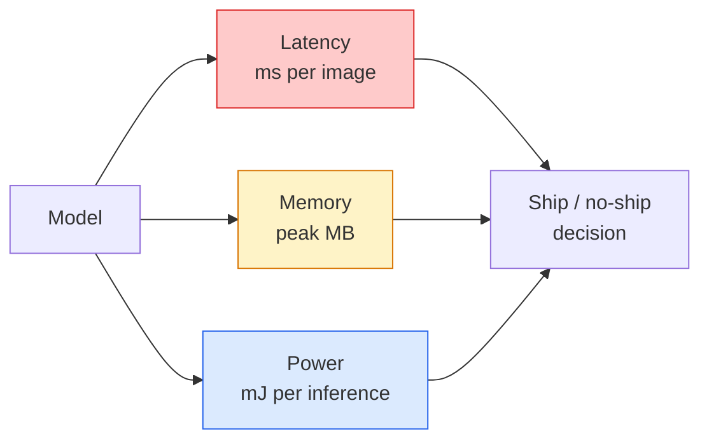

# Visão em tempo real  边缘部署

> A inferência de borda é fazer um modelo de 90 pontos de precisão funcionar em 30 fps em apenas 2 GB de RAM em dispositivos. A precisão de cada ponto de percentual deve ser trocada com latência de milésimo de segundo.

**Type:** Learn + Build
**Languages:** Python
**Prerequisites:** Phase 4 Lesson 04 (Image Classification), Phase 10 Lesson 11 (Quantization)
**Time:** ~75 minutes

## Objectivo de aprendizagem
- 测量任意 PyTorch model 的推理延迟、峰值存储和吞吐量,并读懂 FLOPs / params / latency 之间的权衡
- Utilize PyTorch's post-treinamento quantização irá quantificar o modelo de visão para INT8,并验证精度损失 < 1%
- 导出到ONNX,并使用ONNX Runtime或TensorRT 编译;说出三种最常见的导出失败原因及其修复方式
- 解释在边缘 约束下何时选择 MobileNetV3、EfficientNet-Lite、ConvNeXt-Tiny ou MobileViT

## 问题
O modelo de visão de treinamento é geralmente um ponto flutuante 巨兽──100M parâmetros、 cada passagem para frente 10 GFLOPs、2 GB VRAM── tudo isso não pode ser instalado em dispositivos móveis、 unidades de infotainment no carro、 máquinas industriais ou drones── entregar um sistema de visão, o que significa colocar a mesma capacidade de previsão dentro de um orçamento de 100 vezes menor.

A grande parte do trabalho é feita por três rotas: escolha de modelo (utilizando a mesma receita de uma arquitetura menor)  quantização (utilizando o INT8 para substituir o FP32) e tempo de execução de inferência (ONNX Runtime, TensorRT, Core ML, TFLite) 

Este curso primeiro estabelece a disciplina de medição (non è possibile misurare è impossibile ottimizzare), e depois fala sobre estes três ciclos. O objetivo não é aprender a completar cada tipo de corrida de borda, mas saber quais alavancas existem e como verificar cada alavanca.

## 概念
### Três orçamentos



- **Latency**P50 平均值会掩盖对实时系统 非常重要的尾部行为──
- **Peak memory**O valor máximo que já foi visto em dispositivos, e não na média estável, é o principal motivo de que os objetivos embutidos acima do OOM sejam fatais.
- **Power / energy**Por exemplo, a utilização de um sistema de processamento de processamento (CPU) ou de um sistema de processamento de processamento de processamento de processamento de processamento (GPU) pode ser utilizada em um sistema de processamento de processamento de processamento de processamento de processamento de processamento de processamento de processamento de processamento de processamento de processamento de processamento de processamento de processamento de processamento de processamento de processamento de processamento de processamento de processamento de processamento de processamento de processamento de processamento de processamento de processamento de processamento de processamento de processamento de processamento de processamento de processamento de processamento de processamento de processamento de processamento de processamento de processamento de processamento de processamento de processamento de processamento de processamento de processamento de processamento de processamento de processamento de processamento de processamento de processamento de processamento de processamento de processamento de processamento de processamento de processamento de processamento de processamento de processamento de processamento de processamento de processamento de processamento de processamento de processamento de processamento de processamento de processamento de processamento de processamento de processamento de processamento de processamento de processamento de processamento de processamento de processamento de processamento de processamento de processador de processamento de processador de processador de processador de processador de processador de processador de processador de processador de processador de processador de processador de processador de processador de processador de processador de processador de processador de processador de processador de processador de processador de processador de processador de processador de processador de processador de processador de processador de processador de processador de processador de processador de processador de processador de processador de processador de processador de processador de processador de processador de processador de processador de processador de processador de processador de processador de processador de processador de processador de processador de processador de processador de processador de processador de processador de processador de processador de processador de processador de processador de processador de processador de processador de processador de processador de processador de processador de processador de processador de processador de processador de processador de processador de

Edge  decisão depende de um 張 (modelo, latência, memória, precisão) 表── cada elemento ‧ ‧ ‧ ‧ ‧ ‧ ‧ ‧ ‧ ‧ ‧ ‧ ‧ ‧ ‧ ‧ ‧ ‧ ‧ ‧ ‧ ‧ ‧ ‧ ‧ ‧ ‧ ‧ ‧ ‧ ‧ ‧ ‧ ‧ ‧ ‧ ‧ ‧ ‧ ‧ ‧ ‧ ‧ ‧ ‧ ‧ ‧ ‧ ‧ ‧ ‧ ‧ ‧ ‧ ‧ ‧ ‧ ‧ ‧ ‧ ‧ ‧ ‧ ‧ ‧ ‧ ‧ ‧ ‧ ‧ ‧ ‧ ‧ ‧ ‧ ‧ ‧ ‧ ‧ ‧ ‧ ‧ ‧ ‧ ‧ ‧ ‧ ‧ ‧ ‧ ‧ ‧ ‧ ‧ ‧ ‧ ‧ ‧ ‧ ‧ ‧ ‧ ‧ ‧ ‧ ‧ ‧ ‧ ‧ ‧ ‧ ‧ ‧ ‧ ‧ ‧ ‧ ‧ ‧ ‧ ‧ ‧ ‧ ‧ ‧ ‧ ‧ ‧ ‧ ‧ ‧ ‧ ‧ ‧ ‧ ‧ ‧ ‧ ‧ ‧ ‧ ‧ ‧ ‧ ‧ ‧ ‧ ‧ ‧ ‧ ‧ ‧ ‧ ‧ ‧ ‧ ‧ ‧ ‧ ‧ ‧ ‧ ‧ ‧ ‧ ‧ ‧ ‧ ‧ ‧ ‧ ‧ ‧ ‧ ‧ ‧ ‧ ‧ ‧ ‧ ‧ ‧ ‧ ‧ ‧ ‧ ‧ ‧ ‧ ‧ ‧ ‧ ‧ ‧ ‧ ‧ ‧ ‧ ‧ ‧ ‧ ‧ ‧ ‧ ‧ ‧ ‧ ‧ ‧ ‧ ‧ ‧ ‧ ‧ ‧ ‧ ‧ ‧ ‧ ‧ ‧ ‧ ‧ ‧ ‧ ‧ ‧ ‧ ‧ ‧ ‧ ‧ ‧ ‧ ‧ ‧ ‧ ‧ ‧ ‧ ‧ ‧ 

### Disciplina de medição

Cada vez que o perfil de borda deve seguir três regras:

1. Em primeiro lugar, eu tenho de passar 5 a 10 vezes.**Warm up**modelo── cold cache and JIT compilação 会产生不代表性的 primeira quantidade──
2. Em bloco cronometrado 前后用 `torch.cuda.synchronize()` **Synchronise**Cargas de trabalho de GPUs. Não, você percebe que é o despacho do kernel, e não a execução do kernel.
3. O tamanho de entrada **Fix**Até resolução de produção. 224x224 Alta latência não é 512x512 Alta latência.

### FLOPs  como proxy

FLOPs (FLOPs) são uma forma barata de proxy de latência sem relação com dispositivos. Ele se adapta à comparação de arquitetura, mas como um relógio de parede absolutamente normal, pode causar erros. Um modelo de FLOPs de 10% pode ser usado em prática em 2x, porque usa opções mais adequadas para hardware.

规则: fazer pesquisas de arquitetura com FLOPs, fazer decisões de implantação com latência no dispositivo.

### Quantização 一段话说明

Utilize INT8  substituir pesos FP32 和 ativações。 tamanho do modelo  reduzir 4x, largura de banda de memória  reduzir 4x, em equipamento de hardware de kernels INT8  reduzir 2-4x(todos os modernos SoCs móveis 所有带 Tensor Cores 的 NVIDIA GPU) ⋅ missões de visão  perda de precisão acima normalmente é de 0,1-1 个百分点, usando quantização estática pós-treinamento 即可达到──

Tipo:

- **Dynamic**                                                                                                                                                                                                                                                              
- **Static (post-training)** 量化 weights, em pequeno conjunto de calibração 上校准激活范围──比动态 快得多──
- **Quantisation-aware training (QAT)** Durante o treino, simulação de quantização, deixe o modelo aprender a adaptá-lo.

Para a visão, a quantização estática pós-treino com 5% de trabalho obtém 95% de benefícios.

### Trituramento e destilação

- **Pruning** 移除不重要 weights (em base em magnitude) ou canais (em base em grandeza)     移除不重要重量 (em base em magnitude)       移除不重要重量 (em base em magnitude)                                                                                                                                                                                                                          
- **Distillation** 訓練一個小學生 去模仿大師的logits──通常能恢复缩小模型 后损失的大部分精度──生产边模型的标准做法──  訓練一个小学生 去模仿大师的逻辑──通常能恢复缩小模型 后损失的大部分精度── 后损失的大部分精度── 后损失的大部分精度── 后损失的大部分精度── 后损失的大部分精度── 后损失的大部分精度── 后损损的大部分精度── 后损的大部分精度── 后损的大部分精度── 后损的大部分精度── 后损的大部分精度── 后损的大部分精度── 后损的大部分精度── 后损的大部分精度── 后损的大部分精度── 后损的精度── 后损的 后损失的

### Horários de execução de interferência

- **PyTorch eager** 慢,不适用于部署── apenas para desenvolvimento──
- **TorchScript** legado── já foi `torch.compile`O preço de exportação é de 0,5%
- **ONNX Runtime** Centro de execução de computadores.
- **TensorRT** Compilador de NVIDIA── em GPUs NVIDIA(estação de trabalho 和 Jetson) em latência
- **Core ML** Tempo de execução do iOS/macOS da Apple.`.mlmodel`Ou `.mlpackage`- Não.
- **TFLite** Google Android / ARM runtime── necessário `.tflite`- Não.
- **OpenVINO** Tempo de execução da CPU/VPU da Intel.`.xml`+ `.bin`- Não.

实践中:export PyTorch -> ONNX -> 为 target 选择 runtime。ONNX é lingua franca。

### Arquitetura de ponta

| Budget | Model | Why |
|--------|-------|-----|
| < 3M params | MobileNetV3-Small | 到处都能编译，是很好的 baseline |
| 3-10M | EfficientNet-Lite-B0 | TFLite 上每 param 的 accuracy 最好 |
| 10-20M | ConvNeXt-Tiny | accuracy-per-param 最好，且 CPU-friendly |
| 20-30M | MobileViT-S or EfficientViT | 具备 ImageNet accuracy 的 Transformer |
| 30-80M | Swin-V2-Tiny | 如果 stack 支持 window attention |

A menos que haja uma razão clara para não fazê-lo, então quantifique tudo isto em INT8


```figure
cnn-param-count
```

## Construí-lo
### 步骤 1: Medir a latência

```python
import time
import torch

def measure_latency(model, input_shape, device="cpu", warmup=10, iters=50):
    model = model.to(device).eval()
    x = torch.randn(input_shape, device=device)
    with torch.no_grad():
        for _ in range(warmup):
            model(x)
        if device == "cuda":
            torch.cuda.synchronize()
        times = []
        for _ in range(iters):
            if device == "cuda":
                torch.cuda.synchronize()
            t0 = time.perf_counter()
            model(x)
            if device == "cuda":
                torch.cuda.synchronize()
            times.append((time.perf_counter() - t0) * 1000)
    times.sort()
    return {
        "p50_ms": times[len(times) // 2],
        "p95_ms": times[int(len(times) * 0.95)],
        "p99_ms": times[int(len(times) * 0.99)],
        "mean_ms": sum(times) / len(times),
    }
```

Acalentar, sincronizar, usar `time.perf_counter()` Relacionar percentil, não apenas significa

### 步骤 2: Parâmetro e FLOP contagem

```python
def parameter_count(model):
    return sum(p.numel() for p in model.parameters())

def flops_estimate(model, input_shape):
    """
    Rough FLOP count for a conv/linear-only model. For production use `fvcore` or `ptflops`.
    """
    total = 0
    def conv_hook(m, inp, out):
        nonlocal total
        c_out, c_in, kh, kw = m.weight.shape
        h, w = out.shape[-2:]
        total += 2 * c_in * c_out * kh * kw * h * w
    def linear_hook(m, inp, out):
        nonlocal total
        total += 2 * m.in_features * m.out_features
    hooks = []
    for m in model.modules():
        if isinstance(m, torch.nn.Conv2d):
            hooks.append(m.register_forward_hook(conv_hook))
        elif isinstance(m, torch.nn.Linear):
            hooks.append(m.register_forward_hook(linear_hook))
    model.eval()
    with torch.no_grad():
        model(torch.randn(input_shape))
    for h in hooks:
        h.remove()
    return total
```

                                                                                                                                                                                                                                                                                                                                                                                                                                                                                                                             `fvcore.nn.FlopCountAnalysis`Ou `ptflops`• podem tratar de forma correta cada tipo de módulo.

### 步骤 3: Quantização estática pós-treino

```python
def quantise_ptq(model, calibration_loader, backend="x86"):
    import torch.ao.quantization as tq
    model = model.eval().cpu()
    model.qconfig = tq.get_default_qconfig(backend)
    tq.prepare(model, inplace=True)
    with torch.no_grad():
        for x, _ in calibration_loader:
            model(x)
    tq.convert(model, inplace=True)
    return model
```

Três passos:configure,prepare,insert observadores,converte,alibra os dados reais,fuse + quantize,`Conv -> BN -> ReLU`-> `ConvBnReLU`), pode ser`torch.ao.quantization.fuse_modules`Tratamento.

### 步骤 4: 导出到 ONNX

```python
def export_onnx(model, sample_input, path="model.onnx"):
    model = model.eval()
    torch.onnx.export(
        model,
        sample_input,
        path,
        input_names=["input"],
        output_names=["output"],
        dynamic_axes={"input": {0: "batch"}, "output": {0: "batch"}},
        opset_version=17,
    )
    return path
```

`opset_version=17`É o valor de segurança de 2026`dynamic_axes`让你可以使用任意批量 运行ONNX模型──

### 步骤 5: Benchmark e comparação de diferentes regimes

```python
import torch.nn as nn
from torchvision.models import mobilenet_v3_small

def compare_regimes():
    model = mobilenet_v3_small(weights=None, num_classes=10)
    params = parameter_count(model)
    flops = flops_estimate(model, (1, 3, 224, 224))
    lat_fp32 = measure_latency(model, (1, 3, 224, 224), device="cpu")
    print(f"FP32 MobileNetV3-Small: {params:,} params  {flops/1e9:.2f} GFLOPs  "
          f"p50={lat_fp32['p50_ms']:.2f}ms  p95={lat_fp32['p95_ms']:.2f}ms")
```

Para o`resnet50`- Não.`efficientnet_v2_s`和 `convnext_tiny`运行同函数,你就能得到部署决策所需的比较表──

## Use-o
As pilhas de produção normalmente recebem até três rotas:

- **Web / serverless**O sistema operacional de computadores (CPU ou CUDA) é o mais simples, para a maioria dos casos é bom.
- **NVIDIA edge (Jetson, GPU server)**- TonsorRT, atraso, melhor esforço de engenharia.
- **Mobile**:PyTorch -> ONNX -> Core ML (iOS) ou TFLite (Android)

测量方面,`torch-tb-profiler`- Não.`nvprof`- Não .`nsys`, bem como os instrumentos do macOS podem dar uma ruptura camada por camada.`benchmark_app`(OpenVINO) 和 `trtexec`(TensorRT) Pode dar num número CLI independente.

## Entrega-o
本课会产出:

- `outputs/prompt-edge-deployment-planner.md` Um prompt, irá basear-se no dispositivo alvo 和 latency SLA  escolher a estratégia de quantização 和 runtime。
- `outputs/skill-latency-profiler.md` Uma habilidade, para escrever um script completo de benchmarking de latência, que inclui aquecimento, sincronização, percentiis e rastreamento de memória.

## 练习
1. **(Easy)**Em CPU de cima com 224x224  medida `resnet18`- Não.`mobilenet_v3_small`- Não.`efficientnet_v2_s`和 `convnext_tiny`de p50 latência, notação, notação, notação, notação, notação, notação, notação, notação, notação, notação, notação, notação, notação, notação, notação, notação, notação, notação, notação, notação, notação, notação, notação, notação, notação, notação, notação, notação, notação, notação, notação, notação, notação, notação, notação, notação, notação, notação, notação, notação, notação, notação, notação, notação, notação, notação, notação, notação, notação, notação, notação, notação, notação, notação, notação, notação, notação, notação, notação, notação, notação, notação, notação, notação, notação, notação, notação, notação, notação, notação, notação, notação, notação, notação, notação, notação, notação, notação, notação, notação, notação, notação, notação
2. **(Medium)**Para o`mobilenet_v3_small` aplicada quantização estática pós-treinamento― relatório CIFAR-10 ou similar data sets held out subset 上的 FP32 vs INT8 latency 和 accuracy loss―
3. **(Hard)**- Não .`convnext_tiny`- Importar para ONNX, usar.`CPUExecutionProvider` através `onnxruntime`运行,并将延迟与 PyTorch eager baseline比较──找出ONNX Runtime 第一个更快的层,并解释原因──

## 关键术语
| Term | What people say | What it actually means |
|------|----------------|----------------------|
| Latency | “有多快” | 从 input 到 output 的时间；看 p50/p95/p99 percentiles，而不是 mean |
| FLOPs | “Model size” | 每次 forward pass 的 floating-point ops；compute cost 的粗略 proxy |
| INT8 quantisation | “8-bit” | 用 8-bit integers 替代 FP32 weights/activations；体积约小 4x，速度快 2-4x |
| PTQ | “Post-training quantisation” | 在不 retraining 的情况下量化 trained model；简单，通常足够 |
| QAT | “Quantisation-aware training” | 训练期间模拟 quantisation；accuracy 最好，需要 labelled data |
| ONNX | “中立格式” | 每个主流 inference runtime 都支持的 model exchange format |
| TensorRT | “NVIDIA compiler” | 将 ONNX 编译为面向 NVIDIA GPUs 的 optimised engine |
| Distillation | “Teacher -> student” | 训练 small model 去模仿 big model 的 logits；恢复大部分损失的 accuracy |

## 延伸阅读
- [EfficientNet (Tan & Le, 2019)](https://arxiv.org/abs/1905.11946) Escalagem de compostos de alta eficiência
- [MobileNetV3 (Howard et al., 2019)](https://arxiv.org/abs/1905.02244)Arquitetura móvel-primeira, contendo h-swish e squeeze-excite
- [A Practical Guide to TensorRT Optimization (NVIDIA)](https://developer.nvidia.com/blog/accelerating-model-inference-with-tensorrt-tips-and-best-practices-for-pytorch-users/) 如何真正获得论文中的吞吐量数
- [ONNX Runtime docs](https://onnxruntime.ai/docs/) quantificação, otimização de gráficos, selecção de fornecedores
