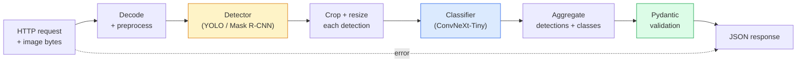

# 构建完整 Vision Pipeline  Capstone

> O sistema de visão de nível de produção é uma cadeia composta por modelos e regras, e através de contratos de dados 串联起来── componentes da estação já estão prontos; esta pedra angular irá colocá-los de um lado para outro conectados──

**Type:** Build
**Languages:** Python
**Prerequisites:** Phase 4 Lessons 01-15
**Time:** ~120 minutes

## Objectivo de aprendizagem
- Designar um pipeline de visão de nível de produção, para testar objetos ∼ para suas categorias, e emitir JSON estruturado, ao mesmo tempo em que processar todos os caminhos falhados
- O sistema de detecção de dados (mascareta R-CNN ou YOLO) e o contrato de dados (Pydantic)
- Para o pipeline de extremo em extremo  fazer benchmark,并识别第一瓶頸 (adultamente, primeiro é pré-processamento, depois é detector)
-  lançar um mínimo FastAPI serviço, aceitar upload de imagem, operar pipeline,并返回带有分类的检测结果

## 问题
单个视觉模型 很有用;视觉产品是由它们组成的链条──零售货架审计是检测仪 加产品分类器 再加价格-OCR管道──自动驾驶是2D detector 加3D detector加段加跟踪仪加规划仪──医疗预查是分类仪加地区分类仪加临床医师 UI──

Colocar estas ligações, é o que distingue o protótipo ML e a parte chave do produto. Cada interface entre os modelos é uma nova fonte de bug. Cada transformação de coordenadas, cada normalização, cada tamanho da máscara, pode tornar-se um ponto de falha silenciosa.

Esta pedra final construir o menor pipeline disponível: detecção + classificação + saída estruturada + camada de serviço。Fase 4 Outros conteúdos da fase 4 podem ser inseridos nesta estrutura:把 Mask R-CNN 换成 YOLOv8, adicionar cabeça OCR, adicionar ramo de segmentação, adicionar rastreador。A estrutura é estável; componentes são podendo ser inseridos。

## 概念
### O oleoduto



七个阶段── dois modelos de fase 开销很大; outros cinco estágios são os locais onde o bug aparece mais frequentemente──

### Utilizando Pydantic  definição Contrato de dados

Cada modelo de fronteira se transforma num objeto de tipificação. Isso transforma o fracasso do silêncio em um fracasso evidente.

```
Detection(
    box: tuple[float, float, float, float],   # (x1, y1, x2, y2), absolute pixels
    score: float,                              # [0, 1]
    class_id: int,                             # from detector's label map
    mask: Optional[list[list[int]]],           # RLE-encoded if present
)

PipelineResult(
    image_id: str,
    detections: list[Detection],
    classifications: list[Classification],
    inference_ms: float,
)
```

Quando o detector voltar é`(cx, cy, w, h)`Não é?`(x1, y1, x2, y2)`Quando a validação do Pydantic vai falhar, você vai descobrir o problema imediatamente, em vez de tentar uma colheita de baixa velocidade, é apenas silenciosamente voltar para a área em branco.

### 延迟花在哪里 延迟花在哪里

Quase todos os canais de visão estão satisfeitos.

1. **Preprocessing 通常是最大的单个模块。**解码 JPEG、转换颜色空间、尺寸, são todos CPU-bound, e são facilmente ignorados.
2. **Detector 主导 GPU 时间。**70-90% do tempo de GPU gasto em detecção avança passar.
3. **Postprocessing（NMS、RLE encode/decode）在 GPU 上便宜，在 CPU 上昂贵。**É preciso usar o ambiente real para fazer um perfil.

Compreender a distribuição, para tornar a otimização em uma lista prioritária.

### Modos de falha

- **Empty detections** 返回空列表, não se quebrar.
- **Out-of-bounds boxes** cortar 前                                                                                                                                                                                                                                                             
- **Tiny crops** Para classificador                                                                                                                                                                                                                                                            
- **Corrupt upload** 返回带有具体错误代码 的 400 resposta, em vez de 500。
- **Model load failure** Em startup de serviço  fracassado, em vez de em primeiro pedido 时失败。

O processo de produção de nível irá tratar cada situação, em vez de escrever um generalizado.`try/except`Para que não se esqueça de tudo, cada um tem um código de nome e resposta.

### Batchamento

O serviço de nível de produção serve vários clientes. Em relação ao pedido de detecção e classificação, o batch pode aumentar o rendimento.`torchserve`和 `triton`O serviço de carga pré-previsível de pequeno porte geralmente realiza-se por si mesmo em micro-batcher.


```figure
v4-vision-pipeline
```

## Construí-lo
### 步骤 1: Contratos de dados

```python
from pydantic import BaseModel, Field
from typing import List, Optional, Tuple

class Detection(BaseModel):
    box: Tuple[float, float, float, float]
    score: float = Field(ge=0, le=1)
    class_id: int = Field(ge=0)
    mask_rle: Optional[str] = None


class Classification(BaseModel):
    detection_index: int
    class_id: int
    class_name: str
    score: float = Field(ge=0, le=1)


class PipelineResult(BaseModel):
    image_id: str
    detections: List[Detection]
    classifications: List[Classification]
    inference_ms: float
```

O código de 5 segundos, pode ser usado para qualquer tipo de pipeline.

### 步骤 2: Uma minúscula linha de condução

```python
import time
import numpy as np
import torch
from PIL import Image

class VisionPipeline:
    def __init__(self, detector, classifier, class_names,
                 device="cpu", min_crop=32):
        self.detector = detector.to(device).eval()
        self.classifier = classifier.to(device).eval()
        self.class_names = class_names
        self.device = device
        self.min_crop = min_crop

    def preprocess(self, image):
        """
        image: PIL.Image or np.ndarray (H, W, 3) uint8
        returns: CHW float tensor on device
        """
        if isinstance(image, Image.Image):
            image = np.asarray(image.convert("RGB"))
        tensor = torch.from_numpy(image).permute(2, 0, 1).float() / 255.0
        return tensor.to(self.device)

    @torch.no_grad()
    def detect(self, image_tensor):
        return self.detector([image_tensor])[0]

    @torch.no_grad()
    def classify(self, crops):
        if len(crops) == 0:
            return []
        batch = torch.stack(crops).to(self.device)
        logits = self.classifier(batch)
        probs = logits.softmax(-1)
        scores, cls = probs.max(-1)
        return list(zip(cls.tolist(), scores.tolist()))

    def run(self, image, image_id="anonymous"):
        t0 = time.perf_counter()
        tensor = self.preprocess(image)
        det = self.detect(tensor)

        crops = []
        detections = []
        valid_indices = []
        for i, (box, score, cls) in enumerate(zip(det["boxes"], det["scores"], det["labels"])):
            x1, y1, x2, y2 = [max(0, int(b)) for b in box.tolist()]
            x2 = min(x2, tensor.shape[-1])
            y2 = min(y2, tensor.shape[-2])
            detections.append(Detection(
                box=(x1, y1, x2, y2),
                score=float(score),
                class_id=int(cls),
            ))
            if (x2 - x1) < self.min_crop or (y2 - y1) < self.min_crop:
                continue
            crop = tensor[:, y1:y2, x1:x2]
            crop = torch.nn.functional.interpolate(
                crop.unsqueeze(0),
                size=(224, 224),
                mode="bilinear",
                align_corners=False,
            )[0]
            crops.append(crop)
            valid_indices.append(i)

        class_preds = self.classify(crops)

        classifications = []
        for valid_idx, (cls_id, cls_score) in zip(valid_indices, class_preds):
            classifications.append(Classification(
                detection_index=valid_idx,
                class_id=int(cls_id),
                class_name=self.class_names[cls_id],
                score=float(cls_score),
            ))

        return PipelineResult(
            image_id=image_id,
            detections=detections,
            classifications=classifications,
            inference_ms=(time.perf_counter() - t0) * 1000,
        )
```

Cada interface é tipográfica. Cada caminho de falha tem uma decisão de tratamento clara.

### 步骤 3: Conectar um detector e um classificador

```python
from torchvision.models.detection import maskrcnn_resnet50_fpn_v2
from torchvision.models import convnext_tiny

# Use ImageNet-pretrained weights for a realistic pipeline without training
detector = maskrcnn_resnet50_fpn_v2(weights="DEFAULT")
classifier = convnext_tiny(weights="DEFAULT")
class_names = [f"imagenet_class_{i}" for i in range(1000)]

pipe = VisionPipeline(detector, classifier, class_names)

# Smoke test with a synthetic image
test_image = (np.random.rand(400, 600, 3) * 255).astype(np.uint8)
result = pipe.run(test_image, image_id="demo")
print(result.model_dump_json(indent=2)[:500])
```

### 步骤 4: Serviço FastAPI

```python
from fastapi import FastAPI, UploadFile, HTTPException
from io import BytesIO

app = FastAPI()
pipe = None  # initialised on startup

@app.on_event("startup")
def load():
    global pipe
    detector = maskrcnn_resnet50_fpn_v2(weights="DEFAULT").eval()
    classifier = convnext_tiny(weights="DEFAULT").eval()
    pipe = VisionPipeline(detector, classifier, class_names=[f"c{i}" for i in range(1000)])

@app.post("/detect")
async def detect_endpoint(file: UploadFile):
    if file.content_type not in {"image/jpeg", "image/png", "image/webp"}:
        raise HTTPException(status_code=400, detail="unsupported image type")
    data = await file.read()
    try:
        img = Image.open(BytesIO(data)).convert("RGB")
    except Exception:
        raise HTTPException(status_code=400, detail="cannot decode image")
    result = pipe.run(img, image_id=file.filename or "upload")
    return result.model_dump()
```

Utilização `uvicorn main:app --host 0.0.0.0 --port 8000`运行。使用 `curl -F 'file=@dog.jpg' http://localhost:8000/detect`- Não.

### 步骤 5: Benchmark Esta linha de condução

```python
import time

def benchmark(pipe, num_runs=20, image_size=(400, 600)):
    img = (np.random.rand(*image_size, 3) * 255).astype(np.uint8)
    pipe.run(img)  # warm up

    stages = {"preprocess": [], "detect": [], "classify": [], "total": []}
    for _ in range(num_runs):
        t0 = time.perf_counter()
        tensor = pipe.preprocess(img)
        t1 = time.perf_counter()
        det = pipe.detect(tensor)
        t2 = time.perf_counter()
        crops = []
        for box in det["boxes"]:
            x1, y1, x2, y2 = [max(0, int(b)) for b in box.tolist()]
            x2 = min(x2, tensor.shape[-1])
            y2 = min(y2, tensor.shape[-2])
            if (x2 - x1) >= pipe.min_crop and (y2 - y1) >= pipe.min_crop:
                crop = tensor[:, y1:y2, x1:x2]
                crop = torch.nn.functional.interpolate(
                    crop.unsqueeze(0), size=(224, 224), mode="bilinear", align_corners=False
                )[0]
                crops.append(crop)
        pipe.classify(crops)
        t3 = time.perf_counter()
        stages["preprocess"].append((t1 - t0) * 1000)
        stages["detect"].append((t2 - t1) * 1000)
        stages["classify"].append((t3 - t2) * 1000)
        stages["total"].append((t3 - t0) * 1000)

    for stage, times in stages.items():
        times.sort()
        print(f"{stage:12s}  p50={times[len(times)//2]:7.1f} ms  p95={times[int(len(times)*0.95)]:7.1f} ms")
```

A CPU acima da produção típica: pré-processo ~ 3 ms, detecta 300-500 ms, classifica 20-40 ms, total 350-550 ms.

## Use-o
O modelo de produção final será recebido na mesma estrutura, adicionado:

- **Model versioning** 始终在回应 中记录 modelo nome 和 weights hash。
- **Per-request trace IDs** 记录 cada fase de cada pedido, assim podemos colocar a resposta lenta 和 fase 关联起来.
- **Fallback path** Se o tempo de classificação for interrompido, retorne não com a detecção da classificação, em vez de fazer todo o pedido 失败。
- **Safety filters** Filtro NSFW / PII 后分类 后、resposta 离开服务 之前运行。
- **Batch endpoint**Um .`/detect_batch`, aceitar URL de imagem 列表 para processamento em massa。

 para a produção de serviço,`torchserve`- Não.`Triton Inference Server`和 `BentoML`开箱即可处理批发,版本, métricas, e controlo de saúde.`FastAPI`适合原型 和小规模产品──

## Entrega-o
本课会产出:

- `outputs/prompt-vision-service-shape-reviewer.md` Um prompt, para verificar o serviço de visão 代码中的合同/响应形式 违规,并指出第一个破裂 bug──
- `outputs/skill-pipeline-budget-planner.md` Uma habilidade, dado um objetivo de latência e de rendimento, para cada fase do pipeline, distribuir o orçamento de tempo, e marcar qual estágio irá ultrapassar o orçamento o primeiro.

## 练习
1. **(Easy)**Em um conjunto de dados livre, 10 imagens são executadas em um conjunto de dados livre.
2. **(Medium)**- Não .`Detection`Adicione campo de saída de máscara,并将其编码为RLE──验证 Mesmo que a imagem de 10 objetos, JSON também permaneça em 1MB abaixo──
3. **(Hard)**Em classificador, adicione um micro-batcher: coleta o máximo de 10 ms de colheita, use uma chamada de GPU para classificá-los todos, e depois, conforme pedido, retorne o resultado.

## 关键术语
| Term | What people say | What it actually means |
|------|----------------|----------------------|
| Pipeline | “系统” | 由 preprocessing、inference 和 postprocessing step 组成的有序链条，每一对 step 之间都有类型化 interface |
| Data contract | “schema” | 每个 stage 的 input 和 output 都必须符合的 Pydantic / dataclass 定义；在边界处捕获 integration bug |
| Preprocessing | “model 之前” | 解码、颜色转换、resizing、normalising；通常是最大的 CPU 时间消耗点 |
| Postprocessing | “model 之后” | NMS、mask resize、threshold、RLE encode；在 GPU 上便宜，在 CPU 上昂贵 |
| Microbatcher | “先收集再 forward” | 在固定窗口内等待多个 request，然后运行一次 batched forward pass 的 aggregator |
| Trace ID | “Request id” | 每个 request 的标识符，会在每个 stage 记录，因此 slow request 可以端到端追踪 |
| Failure code | “命名错误” | 每类 failure 都有具体 error code，而不是泛化的 500；支持 client retry logic |
| Health check | “Readiness probe” | 一个低成本 endpoint，用于报告 service 是否可以响应；loadbalancer 依赖它 |

## 延伸阅读
- [Full Stack Deep Learning — Deploying Models](https://fullstackdeeplearning.com/course/2022/lecture-5-deployment/) O clássico da implementação do ML em nível de produção
- [BentoML docs](https://docs.bentoml.com) 支持批发,版本和计量服务框架
- [torchserve docs](https://pytorch.org/serve/) PyTorch 官方 biblioteca de serviço
- [NVIDIA Triton Inference Server](https://developer.nvidia.com/triton-inference-server) 支持批发和多型的高吞吐量服务
