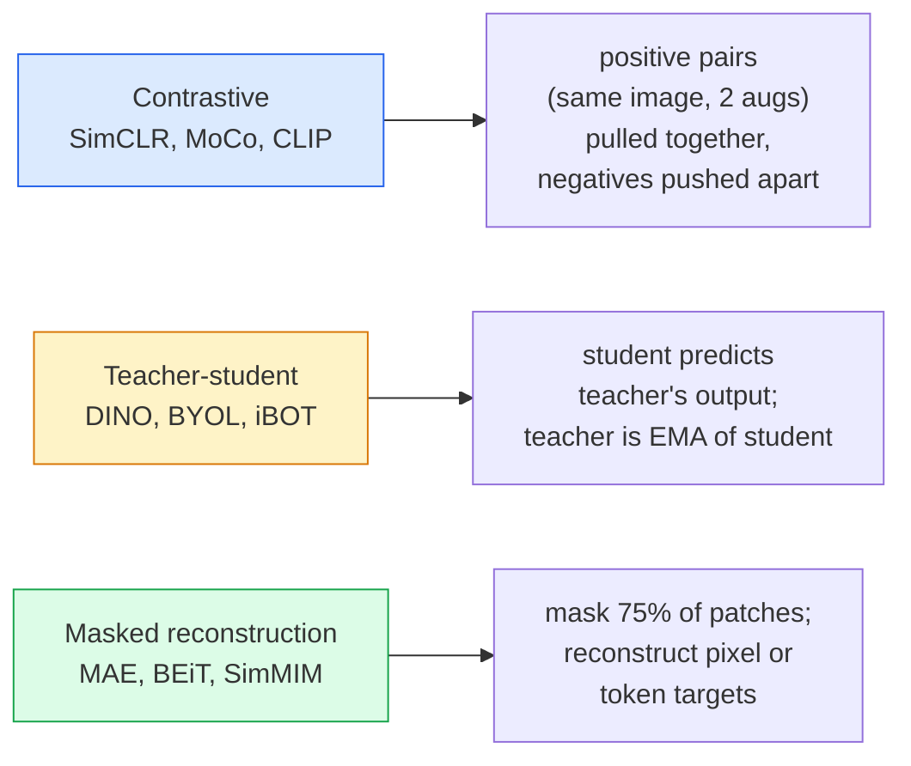

# Visão auto-supervisionada  SimCLR, DINO, MAE

> Etiquetas é um pacote de visão supervisionada. Auto-supervisão pré-treinamento.

**类型：**学习 + 构建
**语言：**Python
**先修要求：**Fase 4 Lição 04(Classificação de imagens),Fase 4 Lição 14 ((ViT)
**时间：**Cerca de 75 minutos

## Objectivo de aprendizagem

- 理三大 自治家族  contrastive  SimCLR) 、 professor-aluno  DINO) 、 reconstrução mascarada  MAE)  并说明每种在优化什么
- Desde zero para a perda de InfoNCE, não explica por que o tamanho do lote é 512 disponível, enquanto o tamanho do lote é 32
- Explicação de porquê o 75% da MAE não é um índice de mascaramento arbitrário, bem como por que é diferente do 15% do texto do BERT
- Utilize DINOv2 ou MAE ImageNet checkpoints  realizar sondas lineares e recuperação de tiros zero

## 问题

Supervisado ImageNet tem 1,3 milhões de张 com imagens marcadas, segundo estimativas, o custo de marcação é de 10 milhões de dólares. Médicos e industriais dados são menores, o custo de marcação também é maior.

A aprendizagem auto-supervisionada é a resposta. Uma ViT moderna auto-supervisionada em LAION ou JFT, em sintonia fina, pode alcançar ou superar a imagem supervisionada.

Conceptos de transformação são: tarefa de antexto  model é treinado para completar tarefas  Não é necessariamente uma tarefa descendente。 o essencial é saber se ela obriga o modelo a aprender características úteis。 pré-estima de escala cinzenta color da imagem、 rotando imagem e fazer o modelo se classificar em ângulos rotativos、parches de máscara e reconstruí-los  Estes métodos funcionam bem── poder dimensionar três métodos: aprendizagem contraditória、destilação professor-estudante e reconstrução mascarada。

## 概念

### Três famílias



### Aprendizagem contrastable (SimCLR)

取一张图像,应用两次随机增强,获得两次视图――将二者送入同一个编码加投影头――最小化一个损失,含义是 两种嵌入式 应该接近,并且 这个嵌入式 应该远离批量中的所有其他图像的嵌入式──

```
Loss for positive pair (z_i, z_j) among 2N views per batch:

   L_ij = -log( exp(sim(z_i, z_j) / tau) / sum_k in batch \ {i} exp(sim(z_i, z_k) / tau) )

sim = cosine similarity
tau = temperature (0.1 standard)
```

É o que significa que a perda de InfoNCE é muito importante. É necessário que cada bateria tenha muitos aspectos negativos.

### Professor-aluno ((DINO)

∆ duas estruturas de rede idênticas: aluno e professor. ∆ professor é o aluno ∆ peso da média móvel exponencial ∆EMA) ∆

```
loss = CE( student_output(view_1),  teacher_output(view_2) )
     + CE( student_output(view_2),  teacher_output(view_1) )

teacher_weights = m * teacher_weights + (1 - m) * student_weights   (m ≈ 0.996)
```

Por que não se desmorona 成预测一个常量: teacher's输遇被集中了(减去每个维度的平均值)并磨磨了(除以较小温度) ・集中了 防止某个维度占主导;磨磨了 防止输出崩 为均──

DINO é a base para a escalação de DINOv2, DINOv2 em 142M 张 curated images 上训练──所得特征是当前零射视觉检索和密集预测的SOTA──

### Reconstrução mascarada (MAE)

Mascarar um ViT  75% dos patches de entrada                                                                                                                                                                                                                                                         

```
Encoder:  visible 25% of patches -> features
Decoder:  features + mask tokens at masked positions -> reconstructed pixels
Loss:     MSE between reconstructed and original pixels on masked patches only
```

让 MAE 有效的关键设计选择:

- **75% mask ratio** 很高──迫使编码学习语义特征; reconstruir 25% 会接近微不足道(相邻像素的相关性太强,以至于CNN都能轻松完成)。
- **Asymmetric encoder/decoder** Grande tipo de codificador ViT apenas ver patches visíveis; pequeno decodificador ((8-camada,512-dim) processamento reconstrução。比朴素 BEiT pré-treinamento 快3 倍。
- **Pixel-space reconstruction target** Meta tokenizada do BEIT mais simples, e melhor efeito no ViT 上.

Depois do treinamento, deixe o decodificador.

### Por que é 75% e não 15%?

Mascara BERT 15% de tokens──mascara MAE 75%── diferença está na densidade de informação──

- Língua natural Cada token de  muito alto                                                                                                                                                                                                                                                          
- Os pixels dos parches de imagem são muito baixos. Um domínio vizinho não mascarado geralmente pode quase precisamente determinar os pixels dos parches mascarados.

75%  suficientemente alto, fazendo simples de espaço fora de forma impossível de resolver tarefas; o codificador  deve mostrar o conteúdo da imagem 

### Avaliação por sonda linear

Auto-supervisão de pré-treino                                                                                                                                                                                                                                                                                                                                                                                                                                                                                                                    **linear probe**:结 encoder, sobre ele baseado em imagens de imagem de rede 训练一个单层线性分类器――报告 top-1 accuracy――

- SimCLR ResNet-50: cerca de 71%(2020)
- DINO ViT-S/16: cerca de 77% ((2021)
- MAE ViT-L/16: cerca de 76% ((2022)
- DINOv2 ViT-g/14: cerca de 86% ((2023)

A sonda linear é uma medida pura da qualidade das características; o ajuste fino geralmente aumenta 2-5 pontos, mas também entra em contato com o impacto da reestruturação da cabeça.


```figure
data-augmentation
```

## Construí-lo

### 步骤 1: Duas visões de aumento de tubo

```python
import torch
import torchvision.transforms as T

two_view_train = lambda: T.Compose([
    T.RandomResizedCrop(96, scale=(0.2, 1.0)),
    T.RandomHorizontalFlip(),
    T.ColorJitter(0.4, 0.4, 0.4, 0.1),
    T.RandomGrayscale(p=0.2),
    T.ToTensor(),
])


class TwoViewDataset(torch.utils.data.Dataset):
    def __init__(self, base):
        self.base = base
        self.aug = two_view_train()

    def __len__(self):
        return len(self.base)

    def __getitem__(self, i):
        img, _ = self.base[i]
        v1 = self.aug(img)
        v2 = self.aug(img)
        return v1, v2
```

Cada um .__getitem__Return the same image's two augmented views; não precisa de rótulos。

### 步骤 2: Perda de informação

```python
import torch.nn.functional as F

def info_nce(z1, z2, tau=0.1):
    """
    z1, z2: (N, D) L2-normalised embeddings of paired views
    """
    N, D = z1.shape
    z = torch.cat([z1, z2], dim=0)  # (2N, D)
    sim = z @ z.T / tau              # (2N, 2N)

    mask = torch.eye(2 * N, dtype=torch.bool, device=z.device)
    sim = sim.masked_fill(mask, float("-inf"))

    targets = torch.cat([torch.arange(N, 2 * N), torch.arange(0, N)]).to(z.device)
    return F.cross_entropy(sim, targets)
```

调用前先对 Embedding  realizar a normalização L2。`tau=0.1`SimCLR 默认值; menor valor vai fazer perda mais alta, não precisa de mais negativos.

### 步骤 3: Verificação de sanidade InfoNCE

```python
z1 = F.normalize(torch.randn(16, 32), dim=-1)
z2 = z1.clone()
loss_same = info_nce(z1, z2, tau=0.1).item()
z2_random = F.normalize(torch.randn(16, 32), dim=-1)
loss_random = info_nce(z1, z2_random, tau=0.1).item()
print(f"InfoNCE with identical pairs:  {loss_same:.3f}")
print(f"InfoNCE with random pairs:     {loss_random:.3f}")
```

Para os pares similares, devem ser perdidas mais baixas (para o lote grande e a temperatura baixa, para o lote inferior).

### 步骤 4: Mascaramento no estilo MAE

```python
def random_mask_indices(num_patches, mask_ratio=0.75, seed=0):
    g = torch.Generator().manual_seed(seed)
    n_keep = int(num_patches * (1 - mask_ratio))
    perm = torch.randperm(num_patches, generator=g)
    visible = perm[:n_keep]
    masked = perm[n_keep:]
    return visible.sort().values, masked.sort().values


num_patches = 196
visible, masked = random_mask_indices(num_patches, mask_ratio=0.75)
print(f"visible: {len(visible)} / {num_patches}")
print(f"masked:  {len(masked)} / {num_patches}")
```

简单、快速,并且对给定种子是决定性的──真实MAE 实现将对其进行批发,并保留每个样品的面具──

## Use-o

DINOv2 é o padrão de produção de 2026:

```python
import torch
from transformers import AutoImageProcessor, AutoModel

processor = AutoImageProcessor.from_pretrained("facebook/dinov2-base")
model = AutoModel.from_pretrained("facebook/dinov2-base")
model.eval()

# Per-image embeddings for zero-shot retrieval
with torch.no_grad():
    inputs = processor(images=[pil_image], return_tensors="pt")
    outputs = model(**inputs)
    embedding = outputs.last_hidden_state[:, 0]  # CLS token
```

O seu 768-dim Embedding é moderno de recuperação de imagens, correspondência densa e transferência de tiros zero.

 para embutidos de imagem-texto, SigLIP ou OpenCLIP é um regime de tratamento;`timm`O repo forneceu todos os pontos de controlo da MAE.

## Entrega-o

本课会产出:

- `outputs/prompt-ssl-pretraining-picker.md` Um prompt, de acordo com o tamanho do conjunto de dados, calcular e fazer a tarefa de downstream selecionar SimCLR / MAE / DINOv2。
- `outputs/skill-linear-probe-runner.md` Uma habilidade, para codificador congelado + conjunto de dados rotulado 编写线性探査评估──

## 练习

1. **（Easy）**验证: Para embutidos de boa qualidade, a temperatura baixa irá causar perda de InfoNCE, para embutidos de qualquer tipo, a temperatura baixa irá causar perda, para aumentar a produção de um `tau in [0.05, 0.1, 0.2, 0.5]`Com relação à perda.
2. **（Medium）**实现 um centro de amortecimento de estilo DINO── exibir se não estiver centrado, o aluno irá entrar em várias épocas dentro do colapso para o vector de quantidade constante──
3. **（Hard）**Utilize Lesson 10 中的TinyUNet 作为脊柱,在CIFAR-100上训练 MAE──报告 10、50 和 200 épocas 时的线性探测精度──展示在同一个1000图片子集上,MAE-pre-trained linear probe 优于从头监督线性探测──

## 关键术语

| Term | 人们的说法 | 实际含义 |
|------|----------------|----------------------|
| Self-supervised | “Label-free” | 一种 pretext task，用于从无标注数据中产生有用 representations |
| Pretext task | “假任务” | SSL 期间使用的 objective（reconstruct patches、match views）；pretraining 后会被丢弃 |
| Linear probe | “Frozen encoder + linear head” | 标准 SSL 评估：只在 frozen features 之上训练一个 linear classifier |
| InfoNCE | “Contrastive loss” | 对 cosine similarities 做 softmax；positive pair 是目标类别，所有其他项都是 negatives |
| EMA teacher | “Moving-average teacher” | 权重是 student 的 exponential moving average 的 teacher；BYOL、MoCo、DINO 使用它 |
| Mask ratio | “隐藏的 patches 百分比” | MAE 期间被 mask 的 patches 比例；vision 为 75%，text 为 15% |
| Representation collapse | “Constant output” | SSL 失败模式：encoder 对所有输入输出一个常量 Vector；通过 centring、sharpening 或 negatives 防止 |
| DINOv2 | “生产级 SSL backbone” | Meta 2023 年的 self-supervised ViT；2026 年最强的通用 image features |

## 延伸阅读

- [SimCLR (Chen et al., 2020)](https://arxiv.org/abs/2002.05709) aprendizagem contrastada 参考
- [DINO (Caron et al., 2021)](https://arxiv.org/abs/2104.14294) 带动力、中心化、磨练的教师-student
- [MAE (He et al., 2022)](https://arxiv.org/abs/2111.06377) 面向 ViT de autoencoder mascarado pré-treino
- [DINOv2 (Oquab et al., 2023)](https://arxiv.org/abs/2304.07193) A auto-supervisão da VT  expandir-se para a qualidade de produção
