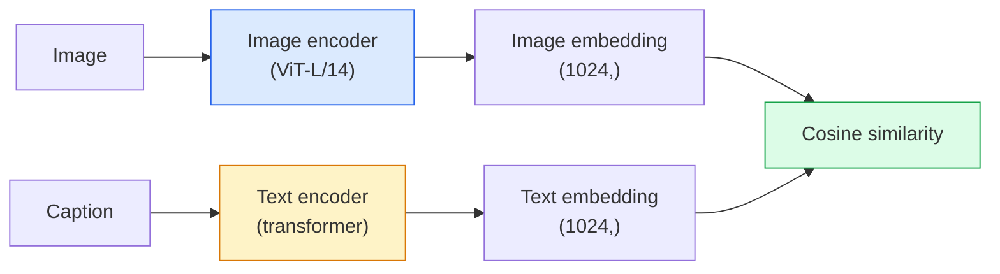

# Visão de vocabulário aberto  CLIP

> Colocar um codificador de imagem e um codificador de texto, começar a treinar, fazer o correspondente (imagem, legenda) para o mesmo ponto no espaço de compartilhamento.

**Type:** Build + Use
**Languages:** Python
**Prerequisites:** Phase 4 Lesson 14 (ViT), Phase 4 Lesson 17 (Self-Supervised)
**Time:** ~45 分钟

## Objectivo de aprendizagem

- Explicação da arquitetura de duas torres do CLIP e objetivo de treinamento contraditório
- Utilize CLIP pre-treinado (ou SigLIP) para realizar classificação de tiro zero, sem necessidade de qualquer treinamento específico de tarefa
- Desde zero para realizar classificação de tiro zero: instruções de classe de código 計算 cosine similarity 取 argmax
- 区分 CLIP、SigLIP、OpenCLIP 和 LLaVA/LLaMA-vision models cada um deles para o que será usado em 2026

## 问题

传统分类器是闭词库:一个1000级ImageNet模型只能预测1000个标签── cada nova categoria precisa de dados etiquetados 和重新训练的头──

CLIP(Radford et al., OpenAI 2021) mostrou que, em 400 milhões de pares de (imagem, legenda) de web capturados em treinamento, pode obter um modelo, que pode ser inferido em qualquer classe de coleção, enquanto essas classes só precisam ser descritas em linguagem natural.

Esta capacidade  transferência de tiro zero  é cada sistema de visão moderno                                                                                                                                                                                                                                                                                                                                                                                                                                                                                                           

## 概念

### Duas torres



 dois codificadores  última                                                                                                                                                                                                                                                           

### 目標

给定一个包含 N 个 (imagem, legenda) pares de lote, construir uma matriz de similaridade NxN。训练两个编码器,使 diagonal(combinação pares) com alta similaridade, enquanto fora de diagonais(non-combinação) com baixa similaridade。

```
sim_matrix = image_embeddings @ text_embeddings.T / tau

loss_i2t = cross_entropy(sim_matrix,       targets=arange(N))
loss_t2i = cross_entropy(sim_matrix.T,     targets=arange(N))
loss = (loss_i2t + loss_t2i) / 2
```

É simétrico, porque a recuperação de imagem a texto e texto a imagem devem ser utilizadas.`tau`(temperatura) normalmente como parâmetro escalar, inicialmente é de 0,07──

### SigLIP: melhor perda

SigLIP(Zhai et al., 2023) usou sigmoide por par  substituído softmax:

```
loss = mean over pairs of log(1 + exp(-y_ij * sim_ij))
y_ij = +1 if matching, -1 otherwise
```

Per-pair Loss  remove CLIP necessária para a normalização de nível de lote.

### Classificação de tiros zero

- Não é o que é?

1. Para cada classe, um prompt: "uma foto de uma classe".
2. Use o codificador de texto codificar todas as instruções de classe -> `T`Forma (C, d)
3. Imagem de teste de codificação -> `I`Forma (1, d)
4. Similhança = `I @ T.T`Forma (1, C)
5. Argmax -> classe prevista。

Engenharia rápida 很重要──OpenAI 为 ImageNet 发布了80 个提示模板("uma foto de um {}"、"uma foto borrada de um {}"、"um esboço de um {}"、...)── em cada classe embaixadas em todos os modelos 取平均,可以额外提升 1-3% top-1 precisão──

### 2026 ano cenário de utilização de modelos CLIP

- **Zero-shot classification**直接使用──
- **Image retrieval** Encodem todas as imagens, em inferência 时 embuchar consulta。
- **Text-conditioned detection**O DINO ŌWL-ViT irá CLIP a torre de texto em seu detector.
- **Text-conditioned segmentation**CLIPSeg;SAM 通過 CLIP 使用文本即刻输入──
- **VLMs**LLaVA、Qwen-VL、InternVL irá codificar a visão da família CLIP 接入 LLM。
- **Text-to-image gen**Stable Diffusion、DALL-E 3 以 CLIP text embuilding 为条件──

Uma vez que você tem espaço de inserção compartilhada, cada tarefa de visão + linguagem se transforma em distância calculada.


```figure
clip-contrastive
```

## Construí-lo

### 步骤 1: um modelo de duas torres muito pequeno

O CLIP verdadeiro é o transformador ViT +. Em esta aula, as torres são baseadas em pequenas MLPs com recursos de pré-ação, portanto, o sinal de treinamento também pode ser visto na CPU.

```python
import torch
import torch.nn as nn
import torch.nn.functional as F


class TwoTower(nn.Module):
    def __init__(self, img_in=128, txt_in=64, emb=64):
        super().__init__()
        self.image_proj = nn.Sequential(nn.Linear(img_in, 128), nn.ReLU(), nn.Linear(128, emb))
        self.text_proj = nn.Sequential(nn.Linear(txt_in, 128), nn.ReLU(), nn.Linear(128, emb))
        self.logit_scale = nn.Parameter(torch.ones([]) * 2.6592)  # ln(1/0.07)

    def forward(self, img_feats, txt_feats):
        i = F.normalize(self.image_proj(img_feats), dim=-1)
        t = F.normalize(self.text_proj(txt_feats), dim=-1)
        return i, t, self.logit_scale.exp()
```

两个投影,共享-dim output,学习温度,形与真实Clip API 相同,

### 步骤 2:Perdida contrastavel

```python
def clip_loss(image_emb, text_emb, logit_scale):
    N = image_emb.size(0)
    sim = logit_scale * image_emb @ text_emb.T
    targets = torch.arange(N, device=sim.device)
    l_i = F.cross_entropy(sim, targets)
    l_t = F.cross_entropy(sim.T, targets)
    return (l_i + l_t) / 2
```

Simétrica, mas há um risco muito mais difícil.

### 步骤 3: Classificador de tiro zero

```python
@torch.no_grad()
def zero_shot_classify(model, image_feats, class_text_feats, class_names):
    """
    image_feats:      (N, img_in)
    class_text_feats: (C, txt_in)   one averaged embedding per class
    """
    i = F.normalize(model.image_proj(image_feats), dim=-1)
    t = F.normalize(model.text_proj(class_text_feats), dim=-1)
    sim = i @ t.T
    pred = sim.argmax(dim=-1)
    return [class_names[p] for p in pred.tolist()]
```

Cada passo é um passo. É o procedimento de zero-shot preciso usado no ponto de verificação CLIP da produção.

### 步骤 4: Verificação de sanidade

```python
torch.manual_seed(0)
model = TwoTower()

img = torch.randn(8, 128)
txt = torch.randn(8, 64)
i, t, scale = model(img, txt)
loss = clip_loss(i, t, scale)
print(f"batch size: {i.size(0)}   loss: {loss.item():.3f}")
```

Para o modelo de arranque, a perda deve aproximar-se.`log(N) = log(8) = 2.08` Este ainda não foi o objetivo de entropia cruzada simétrica da estrutura.

## Use-o

O OpenCLIP é uma das principais opções comunitárias para o ano de 2026.

```python
import open_clip
import torch
from PIL import Image

model, _, preprocess = open_clip.create_model_and_transforms("ViT-B-32", pretrained="laion2b_s34b_b79k")
tokenizer = open_clip.get_tokenizer("ViT-B-32")

image = preprocess(Image.open("dog.jpg")).unsqueeze(0)
text = tokenizer(["a photo of a dog", "a photo of a cat", "a photo of a car"])

with torch.no_grad():
    image_features = model.encode_image(image)
    text_features = model.encode_text(text)
    image_features = image_features / image_features.norm(dim=-1, keepdim=True)
    text_features = text_features / text_features.norm(dim=-1, keepdim=True)
    probs = (100.0 * image_features @ text_features.T).softmax(dim=-1)

print(probs)
```

SigLIP 更新, em pequena escala, treinamento melhor, e mais adequado ao novo trabalho:`google/siglip-base-patch16-224`                                                                                                                                                                                                                                                              

## Entrega-o

本课会产出:

- `outputs/prompt-zero-shot-class-picker.md`Um prompt, usado em classes determinadas 列表和域 时, para modelos de classe de design CLIP de tiro zero 
- `outputs/skill-image-text-retriever.md`Uma habilidade, usando qualquer ponto de verificação CLIP construir índice de inserção de imagem, apoiar consulta por texto 和 consulta por imagem。

## 练习

1. **（Easy）**Use o OpenCLIP ViT-B/32 pré-treinado, e use o CIFAR-10 上80 template prompt set fazer classificação zero-shot.
2. **（Medium）**Na mesma tarefa CIFAR-10 上比较单模板("uma foto de um {}") com embalagens médias de 80 modelos──量化差距并解释为什么模板有帮助──
3. **（Hard）**Construir um índice de recuperação de imagens de tiros zero: com o CLIP embebeber 1.000 张 imagens, construir o índice FAISS, fazer uma consulta com a descrição em linguagem natural.

## 关键术语

| Term | 人们怎么说 | 它实际意味着什么 |
|------|----------------|----------------------|
| Two-tower | "Dual encoder" | 独立的 image 和 text encoders，末端是 shared-dim projection head |
| Zero-shot | "No task-specific training" | 在 inference 时分类到仅由文本描述的 classes；不接触 labels |
| Temperature / logit_scale | "tau" | 在 softmax 前缩放 similarity matrix 的 learned scalar |
| Prompt template | "A photo of a {}" | 包裹 class names 的自然语言包装器；平均多个 templates 会提升 zero-shot accuracy |
| CLIP | "Image+text model" | 2021 年的 OpenAI model；2026 年该领域的通用语汇 |
| SigLIP | "Sigmoid CLIP" | 将 softmax 替换为 per-pair sigmoid；在小 batch 下训练更好 |
| OpenCLIP | "Open reproduction" | 社区在 LAION 上训练的 CLIP variants；open-source pipelines 的 production default |
| VLM | "Vision-language model" | CLIP-family encoder 加上 LLM，训练用来回答关于 images 的问题 |

## 延伸阅读

- [CLIP：从自然语言监督中学习可迁移视觉模型（Radford et al., 2021）](https://arxiv.org/abs/2103.00020)
- [SigLIP：用于 Language-Image Pre-Training 的 Sigmoid Loss（Zhai et al., 2023）](https://arxiv.org/abs/2303.15343)
- [OpenCLIP](https://github.com/mlfoundations/open_clip)Base de código comunitário
- [DINOv2 vs CLIP vs MAE：features comparison](https://huggingface.co/blog/dinov2)incluindo os casos de uso do HF
