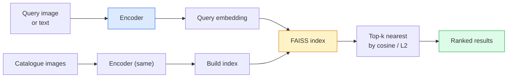

# Retorno de imagem e aprendizado métrico

> Sistema de recuperação irá de acordo com o espaço de inserção da distância entre a classificação dos candidatos.

**Type:** Build
**Languages:** Python
**Prerequisites:** Phase 4 Lesson 14 (ViT), Phase 4 Lesson 18 (CLIP)
**Time:** ~45 minutes

## Objectivo de aprendizagem
- 解释 triplet、contrastive 和 proxy-based metric learning losses,并为给定数据集选择合适的方法
- 正确实现 L2-normalization 和 cosine similarity,并审计 "o mesmo item" e "a mesma classe" recuperação de diferenças
- Construir índice FAISS, usando texto e imagem para consultar,并为持久查询集 报告 recall@K
- Vai usar DINOv2、CLIP 和 SigLIP para incorporar espinhas, e saber quando as suas vitórias acontecerão.

## 问题
Retrieval em produção de sistemas de visão não existe: detecção duplicada, busca de imagem reversa, busca visual, "encontrar produtos semelhantes")

两个设计决策决定整个系统――Embedding,也就是由什么模型产生 Vector――Index,也就是如何在规模化场景中找到近邻――到2026年,都已商品化(DINOv2 用于Embedding,FAISS 用于索引), isso melhorou o seu ponto de encontro: dificuldade está em definir o que é semelhante em sua aplicação*, então, moldar o espaço de embebedimento, fazer a distância se adequar a essa definição――

Este tipo de formação é o aprendizado métrico. É uma disciplina de pequeno e alto nível.

## 概念
### Recuperação num olhar



### As quatro famílias perdidas

| Loss | Requires | Pros | Cons |
|------|----------|------|------|
| **Contrastive** | (anchor, positive) + negatives | 简单，可用于任何 pair label | 没有大量 negatives 时收敛较慢 |
| **Triplet** | (anchor, positive, negative) | 直观；可直接控制 margin | Hard-triplet mining 成本高 |
| **NT-Xent / InfoNCE** | Pairs + batch-mined negatives | 可扩展到大 batch | 需要大 batch 或 momentum queue |
| **Proxy-based (ProxyNCA)** | 仅 class labels | 快速、稳定、无需 mining | 在小数据集上可能 overfit 到 proxies |

Para a maioria dos casos de produção, primeiro com a espinha dorsal pré-treinada  começar; apenas quando embutições fora da prateleira em seu test collection não tiverem desempenho, reajuste a metrica de aprendizagem de melhoração.

### Perda de triplet formalmente

```
L = max(0, ||f(a) - f(p)||^2 - ||f(a) - f(n)||^2 + margin)
```

Colocar âncora`a`拉近 positivo `p`, Põe-o em negativo .`n`,并使用 `margin`确保间隔──三图结构可以泛化到任何相似度排序──

Mineração  很重要:trilhos fáceis(`n`Já estou .`a`很远) Contribuição零 Perda; apenas triplos duros 才能教会模型──Medi-duro mineração(`n`- Não .`p`Mais longe, mas ainda em margem, é o programa da FaceNet de 2016, e ainda é o principal.

### Similhança cosínica vs L2

- Dois tipos de métricas, dois tipos de regras:

- **Cosine**: Vector 之间的角── necessita de L2-normalizadas embutidos──
- **L2**Distância euclidiana: pode ser utilizada em bruto ou em embutidos normalizados, mas normalmente em L2 normalizado + em L2 em quadrado 搭配.

Para a maioria das redes modernas, ambas são equivalentes:`||a|| = ||b|| = 1`时,`||a - b||^2 = 2 - 2 cos(a, b)`△选择与你的嵌入 训练一致的约定;混用会改变 "mais próximo" 的含义──

### Recall@K

标准 retrieval metric:

```
recall@K = fraction of queries where at least one correct match is in the top K results
```

Não há nenhuma forma de fazer isso. Não há nenhuma forma de fazer isso.

 Para a detecção de duplicados, precisão@K é mais importante, pois cada falso positivo são erros visíveis do usuário.

### FAISS num único parágrafo

Facebook AI Similarity Search── фак实标准的近邻搜索 库──三种索引 选择:

- `IndexFlatIP`- Não .`IndexFlatL2` força bruta 精确 无需训练──可用到约1M vetores──
- `IndexIVFFlat` 划分为K个细胞,只搜索近近的少数细胞──近似、快速、需要训练数据──
- `IndexHNSW` baseado em gráficos, em grande quantidade de consultas, tamanho do índice 较大──

Para 100k vetores, você pode pensar em cosina semelhança 上使用 `IndexFlatIP` Para 10M, utilização `IndexIVFFlat`◊ Para 100M+,结合产品量化 (quantização do produto)`IndexIVFPQ`)。

### Recuperação de nível de instância versus nível de categoria

Dois problemas semelhantes, mas muito diferentes:

- **Category-level** "在我的目录 中找猫──" Semelhança condicional de classe; embutidos fora de caixa CLIP / DINOv2 效果很好──
- **Instance-level** "Encontrar este produto no meu catálogo"                                                                                                                                                                                                                                                        

Antes de escolher um modelo, sempre pergunte primeiro o que você resolveu.


```figure
metric-embedding
```

## Construí-lo
### 步骤 1: Perda de triplet

```python
import torch
import torch.nn.functional as F

def triplet_loss(anchor, positive, negative, margin=0.2):
    d_ap = F.pairwise_distance(anchor, positive, p=2)
    d_an = F.pairwise_distance(anchor, negative, p=2)
    return F.relu(d_ap - d_an + margin).mean()
```

I. Aplicável a embutidos normalizados ou crus L2.

### 步骤 2: Mineração semi-dura

给定一批嵌和标签,为每一个头 找到最难的半硬负面──

```python
def semi_hard_negatives(emb, labels, margin=0.2):
    dist = torch.cdist(emb, emb)
    same_class = labels[:, None] == labels[None, :]
    diff_class = ~same_class
    N = emb.size(0)

    positives = dist.clone()
    positives[~same_class] = float("-inf")
    positives.fill_diagonal_(float("-inf"))
    pos_idx = positives.argmax(dim=1)

    semi_hard = dist.clone()
    semi_hard[same_class] = float("inf")
    d_ap = dist[torch.arange(N), pos_idx].unsqueeze(1)
    semi_hard[dist <= d_ap] = float("inf")
    neg_idx = semi_hard.argmin(dim=1)

    fallback_mask = semi_hard[torch.arange(N), neg_idx] == float("inf")
    if fallback_mask.any():
        hardest = dist.clone()
        hardest[same_class] = float("inf")
        neg_idx = torch.where(fallback_mask, hardest.argmin(dim=1), neg_idx)
    return pos_idx, neg_idx
```

Cada âncora recebe o positivo mais difícil da classe, bem como um negativo semia-duro em relação ao positivo, mas em margem.

### 步骤 3: Recall@K

```python
def recall_at_k(query_emb, gallery_emb, query_labels, gallery_labels, k=1):
    sim = query_emb @ gallery_emb.T
    _, top_k = sim.topk(k, dim=-1)
    matches = (gallery_labels[top_k] == query_labels[:, None]).any(dim=-1)
    return matches.float().mean().item()
```

Em embedamentos normalizados L2 上按内部产品 取 top-k, igual a按 cosine 取 top-k;; relatório pelo menos uma verdadeira procura média de vizinho;;

### 步骤 4: Colocá-lo juntos

```python
import torch
import torch.nn as nn
from torch.optim import Adam

class Encoder(nn.Module):
    def __init__(self, in_dim=128, emb_dim=64):
        super().__init__()
        self.net = nn.Sequential(
            nn.Linear(in_dim, 128), nn.ReLU(),
            nn.Linear(128, emb_dim),
        )

    def forward(self, x):
        return F.normalize(self.net(x), dim=-1)

torch.manual_seed(0)
num_classes = 6
protos = F.normalize(torch.randn(num_classes, 128), dim=-1)

def sample_batch(bs=32):
    labels = torch.randint(0, num_classes, (bs,))
    x = protos[labels] + 0.15 * torch.randn(bs, 128)
    return x, labels

enc = Encoder()
opt = Adam(enc.parameters(), lr=3e-3)

for step in range(200):
    x, y = sample_batch(32)
    emb = enc(x)
    pos_idx, neg_idx = semi_hard_negatives(emb, y)
    loss = triplet_loss(emb, emb[pos_idx], emb[neg_idx])
    opt.zero_grad(); loss.backward(); opt.step()
```

Depois de alguns centenas de passos, os clusters de incorporação formarão cada classe um cluster.

## Use-o
Produção de 2026:

- **DINOv2 + FAISS** 通用 visual retrieval──可 off-the-shelf 使用──
- **CLIP + FAISS** Quando a consulta é texto ⋅
- **Fine-tuned DINOv2 + FAISS** recuperação a nível de instância, re-identificação facial, moda, comércio eletrônico.
- **Milvus / Weaviate / Qdrant**  em torno de FAISS ou HNSW de vector DB embalagem gerenciada。

Para a recuperação de instâncias SOTA, a combinação é: DINOv2 espinha dorsal, adicionar cabeçalho de embutida, em pares marcados por instâncias 上用三板或 InfoNCE Loss fine-tune, e estabelecer índice em FAISS。

## Entrega-o
本课产出:

- `outputs/prompt-retrieval-loss-picker.md` Um prompt, usado para obter dados  problem choose triplet / InfoNCE / ProxyNCA。
- `outputs/skill-recall-at-k-runner.md` Uma habilidade, para escrever干净的回忆@K avaliação harness, incluindo trens/val/galeria divisões 和正确的数据契约──

## 练习
1. **(Easy)**运行 运行 运行 运行 运行 运行 运行 运行 运行 运行 运行 运行 运行 运行 运行 运行 运行 运行 运行 运行 运行 运行 运行 运行 运行 运行 运行 运行 运行 运行 运行 运行 运行 运行 运行 运行 运行 运行 运行 运行 运行 运行 运行 运行 运行 运行 运行 运行 运行 运行 运行 运行 运行 运行 运行 运行 运行 运行 运行 运行 运行 运行 运行 运行 运行 运行 运行 运行 运行 运行 运行 运行 运行 运行 运行 运行 运行 运行 运行 运行 运行 运行 运行 运行 运行 运行 运行 运行 运行 运行 运行 运行 运行 运行 运行 运行 运行 运行 运运运行 运行 运运运运行 运运运运运运运运运运运运运运运运 运 运 运 运 运 运 运 运 运 运 运 运 运 运 运 运 运 运 运 运 运 运 运 运 运 运 运 运 运 运 运 运 运 运 运 运 运 运 运 运 运 运 运 运 运 运 运 运 运 运 运 运 运 运 运 运 运 运 运 运 运 运 运 运 运 运 运 运 运 运 运 运 运 运 运 运 运 运 运 运 运 运 运
2. **(Medium)**添加 ProxyNCA Loss 实现: cada classe 一个学会的"proxy",在宇宙相似性上做标准交叉 Entropia── comparar com a perda de triplet 在玩具数据上的收速度──
3. **(Hard)**取 1,000 张 ImageNet validação de imagens, através HuggingFace usando DINOv2 生成 Embeddings, construir FAISS índice plano,并报告以同一批图像为查询 时的回忆@{1, 5, 10}(应为 1.0),以及以持久分割 和 ImageNet 作为 ground truth 时的结果──

## 关键术语
| Term | What people say | What it actually means |
|------|----------------|----------------------|
| Metric learning | "Shape the space" | 训练一个 encoder，使其输出空间中的距离反映目标相似度 |
| Triplet loss | "Pull and push" | L = max(0, d(a, p) - d(a, n) + margin)；经典的 metric-learning Loss |
| Semi-hard mining | "Useful negatives" | 比 positive 更远但仍在 margin 内的 negatives；经验上信息量最大 |
| Proxy-based loss | "Class prototypes" | 每个 class 一个 learned proxy；对 similarity-to-proxies 做 cross-entropy；无需 pair mining |
| Recall@K | "Top-K hit rate" | top K 中至少有一个正确结果的查询比例 |
| Instance retrieval | "Find this exact thing" | 细粒度匹配；off-the-shelf features 通常表现不足 |
| FAISS | "The NN library" | Facebook 的 nearest-neighbour 库；支持精确和近似 indexes |
| HNSW | "Graph index" | Hierarchical navigable small world；内存开销小的快速近似 NN |

## 延伸阅读
- [FaceNet: A Unified Embedding for Face Recognition (Schroff et al., 2015)](https://arxiv.org/abs/1503.03832) perda de triplet / semi-hard mining 论文
- [In Defense of the Triplet Loss for Person Re-Identification (Hermans et al., 2017)](https://arxiv.org/abs/1703.07737) Triplato de ajuste fino 实践指南
- [FAISS documentation](https://github.com/facebookresearch/faiss/wiki) Cada índice, cada trade-off
- [SMoT: Metric Learning Taxonomy (Kim et al., 2021)](https://arxiv.org/abs/2010.06927) 现代 perdas  e suas relações
