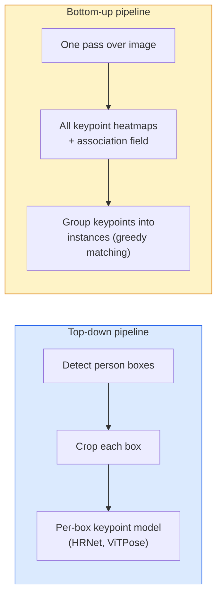

# Detecção de pontos-chave e estimativa de posição

> Uma pose é um conjunto de pontos-chave organizados. Um detector de pontos-chave é um regressor de mapas de calor.

**Type:** Build
**Languages:** Python
**Prerequisites:** Phase 4 Lesson 06 (Detection), Phase 4 Lesson 07 (U-Net)
**Time:** ~45 分钟

## Objectivo de aprendizagem
- 区分 cima-abaixo e baixo-abaixo estimativa de posição,并说明各自何时使用
- Utilize Gaussian-per-keypoint target para K 个 keypoints mapas de calor de regressão e inferir 时提取 coordenadas de pontos-chave
- 解释 Parte de campos de afinidade (PAFs), bem como canais de baixo para cima  como colocar pontos-chave 关联成 instâncias
- Usar MediaPipe Pose ou MMPose para fazer a estimativa de pontos-chave de produção, e entender o formato de sua saída

## 问题
Tarefas chave têm muitos nomes: pose humana ((17 articulações corporais) 、marcos faciais ((68 ou 478 个点) 、mão ((21 个点) 、 pose animal 、 pose objeto robótico 、 marcos anatômicos médicos。 eles todos compartilham da mesma estrutura:

A avaliação de posições é a base para a captura de movimento, aplicativos de fitness, análise esportiva, controle de gestos, animação, experimentação de AR e captura robótica.

工程問題在于尺度──单图、单人 Pose 是一个20ms 问题──人群中的多人 Pose 需要在30fps 下运行,则是一个构建完全不同的问题──

## 概念
### De cima para baixo versus baixo para cima



- **Top-down** Pre-experimentar pessoas, re-experimentar cada colheita 运行 por pessoa modelo de ponto chave 
- **Bottom-up** Uma vez para frente passar 预测 todos os pontos-chave加一个协会字段;再把它们分组── não importa o tamanho da multidão 如何,耗时恒定──

Top-down (HRNet, ViTPose) é o principal esquema; bottom-up (OpenPose, HigherHRNet) é o principal esquema entre cenas lotadas.

### Regressão do mapa de calor

Não há regressão direta.`(x, y)`Mas para cada ponto chave, pré-determinar um.`H x W`Mapa de calor, no centro da verdadeira posição, há uma mancha gaussiana.

```
target[k, y, x] = exp(-((x - cx_k)^2 + (y - cy_k)^2) / (2 sigma^2))
```

Em inferência, o argmax de cada heatmap é a localização do ponto chave da previsão.

Por que os mapas de calor são melhores do que a regressão direta?

### Localização de subpixels

Argmax  dá um número inteiro                                                                                                                                                                                                                                                                                                                                                                                                                                                                                                                      `(dx, dy) = 0.25 * (heatmap[y, x+1] - heatmap[y, x-1], ...)`Direcção:

### Campo de afinidade parcial (PAFs)

OpenPose usa técnicas de associação de baixo para cima. Para cada par de pontos-chave de ligação (por exemplo, ombro esquerdo até cotovelo esquerdo), prevê um campo de 2 canais, codificação de um vector unitário de um ponto para outro ponto.

```
For each connection (limb):
  PAF channels: 2 (unit vector x, y)
  Line integral: sum over sample points of (PAF . line_direction)
  Higher integral = stronger match
```

Este método é ótimo, e não é necessário para culturas por pessoa, assim pode se expandir para qualquer tamanho da multidão.

### Pontos-chave COCO

标准的 body-pose dataset: 每个人 17 个关键点,使用PCK(Percentagem de Pontos-chave Correctos) 和 OKS(Objeto de Pontos-chave Similarity) como métricas。OKS é o análogo de ponto-chave do IoU, também é um indicador do relatório COCO mAP@OKS。

### 2D vs 3D

- **2D pose** Coordenadas de imagem; já alcançou a produção de qualidade (MediaPipe, HRNet, ViTPose) 
- **3D pose** coordenadas do mundo / câmera; ainda está activo estudo direção──
  - Use um pequeno MLP para elevar as previsões 2D para 3D.
  -  direta da imagem fazer regressão 3D  PyMAF, MHFormer)
  - Configurações de visualização múltipla (CMU Panoptic) para a verdade do solo.


```figure
cv3-pose-heatmap
```

## Construí-lo
### 步骤 1: meta da mapa de calor de Gaussian

```python
import numpy as np
import torch

def gaussian_heatmap(size, cx, cy, sigma=2.0):
    yy, xx = np.meshgrid(np.arange(size), np.arange(size), indexing="ij")
    return np.exp(-((xx - cx) ** 2 + (yy - cy) ** 2) / (2 * sigma ** 2)).astype(np.float32)

hm = gaussian_heatmap(64, 32, 32, sigma=2.0)
print(f"peak: {hm.max():.3f} at ({hm.argmax() % 64}, {hm.argmax() // 64})")
```

Ao longo do eixo do canal, juntar mapas de calor por ponto chave, obtemos um tensor-alvo completo.

### 步骤 2: Cabeça de teclado pequena

Um modelo de estilo U-Net, para saída de K 个 heatmap canais.

```python
import torch.nn as nn
import torch.nn.functional as F

class TinyKeypointNet(nn.Module):
    def __init__(self, num_keypoints=4, base=16):
        super().__init__()
        self.down1 = nn.Sequential(nn.Conv2d(3, base, 3, 2, 1), nn.ReLU(inplace=True))
        self.down2 = nn.Sequential(nn.Conv2d(base, base * 2, 3, 2, 1), nn.ReLU(inplace=True))
        self.mid = nn.Sequential(nn.Conv2d(base * 2, base * 2, 3, 1, 1), nn.ReLU(inplace=True))
        self.up1 = nn.ConvTranspose2d(base * 2, base, 2, 2)
        self.up2 = nn.ConvTranspose2d(base, num_keypoints, 2, 2)

    def forward(self, x):
        h1 = self.down1(x)
        h2 = self.down2(h1)
        h3 = self.mid(h2)
        u1 = self.up1(h3)
        return self.up2(u1)
```

输入 `(N, 3, H, W)`, exportação`(N, K, H, W)`❖ Perda é em relação aos alvos gaussianos de MSE por pixel―

### 步骤 3: Inferência  extrair coordenadas de pontos-chave

```python
def heatmap_to_coords(heatmaps):
    """
    heatmaps: (N, K, H, W)
    returns:  (N, K, 2) float coordinates in image pixels
    """
    N, K, H, W = heatmaps.shape
    hm = heatmaps.reshape(N, K, -1)
    idx = hm.argmax(dim=-1)
    ys = (idx // W).float()
    xs = (idx % W).float()
    return torch.stack([xs, ys], dim=-1)

coords = heatmap_to_coords(torch.randn(2, 4, 32, 32))
print(f"coords: {coords.shape}")  # (2, 4, 2)
```

Para refinamento de sub-pixels, em argmax                                                                                                                                                                                                                                                                                                                                                                                                                                                                                                                 

### 步骤 4: conjunto de dados sintético de pontos-chave

很简单: em tela branca 上画四个点,并学习预测它们──

```python
def make_synthetic_sample(size=64):
    img = np.ones((3, size, size), dtype=np.float32)
    rng = np.random.default_rng()
    kps = rng.integers(8, size - 8, size=(4, 2))
    for cx, cy in kps:
        img[:, cy - 2:cy + 2, cx - 2:cx + 2] = 0.0
    hms = np.stack([gaussian_heatmap(size, cx, cy) for cx, cy in kps])
    return img, hms, kps
```

Esta tarefa é simples, modelo pequeno, em um minuto, vai aprender.

### 步骤 5: Formação

```python
model = TinyKeypointNet(num_keypoints=4)
opt = torch.optim.Adam(model.parameters(), lr=3e-3)

for step in range(200):
    batch = [make_synthetic_sample() for _ in range(16)]
    imgs = torch.from_numpy(np.stack([b[0] for b in batch]))
    hms = torch.from_numpy(np.stack([b[1] for b in batch]))
    pred = model(imgs)
    # Upsample pred to full resolution
    pred = F.interpolate(pred, size=hms.shape[-2:], mode="bilinear", align_corners=False)
    loss = F.mse_loss(pred, hms)
    opt.zero_grad(); loss.backward(); opt.step()
```

## Use-o
- **MediaPipe Pose** Estimador de posições de nível de produção do Google; fornece WebGL + runtimes móveis, atraso inferior a 10ms。
- **MMPose**(OpenMMLab)  全面的研究代码库;包含每种SOTA architecture 及预训练的权重──
- **YOLOv8-pose** 最快的实时多人姿势, usando uma única passagem para frente。
- **transformers HumanDPT / PoseAnything** Usar a pose de vocabulário aberto (qualquer objeto, conjunto de pontos-chave) de novas abordagens de linguagem de visão.

## Entrega-o
本课产出:

- `outputs/prompt-pose-stack-picker.md` Um prompt, disponível de acordo com a latência, o tamanho da multidão, bem como 2D vs 3D 需求选择 MediaPipe / YOLOv8-pose / HRNet / ViTPose。
- `outputs/skill-heatmap-to-coords.md` Uma habilidade, para escrever cada modelo de produção de postura, que será usada até a rotina de sub-pixel de heatmap-to-coordinate.

## 练习
1. **(Easy)**Em conjunto de dados sintético de 4 pontos 上训练小键点模型──报告200 steps 后预测与真键点 之间的平均L2错误──
2. **(Medium)**Add sub-pixel refinamento: dado determinado argmax posição, em x e y direções usando pixels próximos parabola 1D adequada― relatório em relação ao inteiro argmax ganho de precisão―
3. **(Hard)**Construir um conjunto de dados sintéticos de 2 pessoas, em que cada imagem mostra duas instâncias de padrão de 4 pontos-chave── treinar um pipeline de baixo para cima com PAFs, prever qual ponto-chave perta a qual instância,并评估 OKS──

## 关键术语
| Term | 人们怎么说 | 它实际是什么意思 |
|------|----------------|----------------------|
| Keypoint | "一个 landmark" | object 上的一个特定有序点（joint、corner、feature） |
| Pose | "skeleton" | 属于一个 instance 的一组有序 keypoints |
| Top-down | "先 detect，再 pose" | Two-stage pipeline：person detector + per-crop keypoint model；准确率最高 |
| Bottom-up | "先 pose，后 group" | Single-pass all-keypoint prediction + grouping；在 crowd size 上耗时恒定 |
| Heatmap | "Gaussian target" | 每个 keypoint 一个 H x W tensor，峰值位于真实位置；首选的 Regression target |
| PAF | "Part Affinity Field" | 编码 limb directions 的 2-channel unit vector field；用于把 keypoints 分组为 instances |
| OKS | "Keypoint IoU" | Object Keypoint Similarity；COCO 的 pose metric |
| HRNet | "High-Resolution Net" | 主流 top-down keypoint architecture；全程保留 high-res features |

## 延伸阅读
- [OpenPose (Cao et al., 2017)](https://arxiv.org/abs/1812.08008) Utilizando PAFs de baixo para cima; ainda é o melhor material de instrução deste método
- [HRNet (Sun et al., 2019)](https://arxiv.org/abs/1902.09212) de cima para baixo 参考架构
- [ViTPose (Xu et al., 2022)](https://arxiv.org/abs/2204.12484) Utilize simples ViT  como espinha dorsal de pose; em muitos benchmarks 上是当前 SOTA
- [MediaPipe Pose](https://developers.google.com/mediapipe/solutions/vision/pose_landmarker) Produção de nível em tempo real;2026 部署最快的堆
