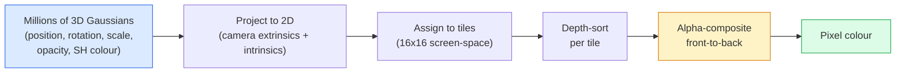

# Desde zero realização 3D Gaussian Splatting

> Uma cena é um grupo de milhões de Gaussians 3D composto de nuvens. Cada Gaussiano tem posição, orientação, escala, opacidade, bem como uma dependência de cor de direção de visão.

**类型：**Construção
**语言：**Python
**先修要求：**Fase 4 Lição 13 (3D Vision & NeRF) Fase 1 Lição 12 (Tensor Operations) Fase 4 Lição 10 (Bases de difusão opcionais)
**时间：**Cerca de 90 minutos

## Objectivo de aprendizagem

- Explicação de porquê até 2026 anos, 3D Gaussian Splating  já substituído NeRF, tornou-se um modelo de produção de reconstrução 3D fotorrealista
- Dizer que cada Gaussian de seis classes de parametros ((posição, rotação quadriônio, escala, opacidade, harmonica esférica cor, característica opcional), bem como cada classe contribui quantas flutuantes
- Desde zero realizando um uso`alpha`composição de 2D Gaussian rasterizer de espalteamento, e depois explicar 3D  situação como projetar para o mesmo ciclo
- Utilização `nerfstudio`- Não.`gsplat`Ou `SuperSplat`De 20-50 张照片 reconstruir uma cena,并导出为 `KHR_gaussian_splatting`Extensão glTF ou OpenUSD 26.03 `UsdVolParticleField3DGaussianSplat`esquema

## 问题

O NeRF armazenará o cenário em um peso de MLP. Todos os pixels de cada cenário precisam de uma linha de luz.

3D Gaussian Splating(Kerbl、Kopanas、Leimkühler、Drettakis,SIGGRAPH 2023) substituíram tudo isso. Uma cena é uma coleção de Gaussian 3D obviamente ∼ ∼ ∼ ∼ ∼ ∼ ∼ ∼ ∼ ∼ ∼ ∼ ∼ ∼ ∼ ∼ ∼ ∼ ∼ ∼ ∼ ∼ ∼ ∼ ∼ ∼ ∼ ∼ ∼ ∼ ∼ ∼ ∼ ∼ ∼ ∼ ∼ ∼ ∼ ∼ ∼ ∼ ∼ ∼ ∼ ∼ ∼ ∼ ∼ ∼ ∼ ∼ ∼ ∼ ∼ ∼ ∼ ∼ ∼ ∼ ∼ ∼ ∼ ∼ ∼ ∼ ∼ ∼ ∼ ∼ ∼ ∼ ∼ ∼ ∼ ∼ ∼ ∼ ∼ ∼ ∼ ∼ ∼ ∼ ∼ ∼ ∼ ∼ ∼ ∼ ∼ ∼ ∼ ∼ ∼ ∼ ∼ ∼ ∼ ∼ ∼ ∼ ∼ ∼ ∼ ∼ ∼ ∼ ∼ ∼ ∼ ∼ ∼ ∼ ∼ ∼ ∼ ∼ ∼ ∼ ∼ ∼ ∼ ∼ ∼ ∼ ∼ ∼ ∼ ∼ ∼ ∼ ∼ ∼ ∼ ∼ ∼ ∼ ∼ ∼ ∼ ∼ ∼ ∼ ∼ ∼ ∼ ∼ ∼ ∼ ∼ ∼ ∼ ∼ ∼ ∼ ∼ ∼ ∼ ∼ ∼ ∼ ∼ ∼ ∼ ∼ ∼ ∼ ∼ ∼ ∼ ∼ ∼ ∼ ∼ ∼ ∼ ∼ ∼ ∼ ∼ ∼ ∼ ∼ ∼ ∼ ∼ ∼ ∼ ∼ ∼ ∼ ∼ ∼ ∼ ∼ ∼ ∼ ∼ ∼   ∼ ∼     ∼ ∼   ∼ ∼ ∼   ∼       ∼   ∼    ∼ ∼          ∼ 

O modelo de mente é muito simples, mas matematicamente há elementos de atividade suficientes, de modo que a maioria das apresentações começa a rasterizar, depois salta a projeção e os armônicos esféricos.

## 核心概念

### Um Gaussiano que leva o que ?

Um Gauss 3D é uma mancha parametrizada no espaço, com estas características:

```
position         mu         (3,)    centre in world coordinates
rotation         q          (4,)    unit quaternion encoding orientation
scale            s          (3,)    log-scales per axis (exponentiated at render time)
opacity          alpha      (1,)    post-sigmoid opacity [0, 1]
SH coefficients  c_lm       (3 * (L+1)^2,)   view-dependent colour
```

Rotation + escala 会构建一个3x3 covariance:`Sigma = R S S^T R^T`∼ é assim que o Gaussian em 3D ∼ forma em 3D ∼ harmonicas esféricas                                                                                                                                                                                                                                                                                                                                                                                                                                                                                                     

Uma cena de Gaussian geralmente tem 1-5 milhões de Gaussians. Cada armazenamento tem cerca de 60 flutuantes.

### É rasterizante, não é a marcha de raios.



五个步骤,全都对 GPU 友好──没有每个像素的 MLP query──一张RTX 3080 Ti pode ser colorido em 147 fps 600.000 spots──

### projeção 步骤

                                                                                                                                                                                                                                                                                                                                                                                                                                                                                                                             `mu`、 têm covariância 3D `Sigma`O Gaussian 3D, vai fazer uma projeção para a posição da tela.`mu'`、 têm covariância 2D `Sigma'`O Gaussian 2D:

```
mu' = project(mu)
Sigma' = J W Sigma W^T J^T          (2 x 2)

W = viewing transform (rotation + translation of camera)
J = Jacobian of the perspective projection at mu'
```

A pegada Gaussiana 2D é uma elipse, sua essência é`Sigma'`de vetores próprios. Cada pixel dentro desta elipse recebe a contribuição de Gaussian.`exp(-0.5 * (p - mu')^T Sigma'^-1 (p - mu'))`- Não.

### composição alfa 规则

对于一个像素,覆盖它的高ussians会按前向排序 排序 排序 排序 排序 排序 排序 排序 排序 排序 排序 排序 排序 排序 排序 排序 排序 排序 排序 排序 排序 排序 排序 排序 排序 排序 排序 排序 排序 排序 排序 排序 排序 排序 排序 排序 排序 排序 排序 排序 排序 排序 排序 排序 排序 排序 排序 排序 排序 排序 排序 排序 排序 排序 排序 排序 排序 排序 排序 排序 排序 排序 排序 排序 排序 排序 排序 排序 排序 排序 排序 排序 排序 排序 排序 排序 排序 排序 排序 排序 排序 排序 排序 排序 排序 排序 排序 排序 排序 排序 排序 排序 排序 排序 排序 排序 排序 排序 排 排 排 排 排 排 排 排 排 排 排 排 排 排 排 排 排 排 排 排 排 排 排 排 排 排 排 排 排 排 排 排 排 排 排 排 排 排 排 排 排 排 排 排 排 排 排 排 排 排 排 排 排 排 排 排 排 排 排 排 排 排 排 排 排 排 排 排 排 排 排 排 排 排 排 排 排 排 排 排 排 排 排 排 排 排 排 排 排 排 排 排 排 排 排 排 排 排 排 排 

```
C_pixel = sum_i alpha_i * T_i * c_i

T_i = prod_{j < i} (1 - alpha_j)       transmittance up to i
alpha_i = opacity_i * exp(-0.5 * d^T Sigma'^-1 d)   local contribution
c_i = eval_SH(SH_i, view_direction)    view-dependent colour
```

Isto é com**NeRF 的 volumetric render 是同一个方程**, apenas embora aqui seja calculado num conjunto de Gaussianos raros de forma evidente, em vez de em amostras densas de raios acima.

### Por que é diferenciável

Cada passo: projeto, atribuição de tátil, composição alfa, avaliação SH, tudo em relação ao Gaussian 参数是可分化的──给定一张地面真相图像,计算 rendered pixel Loss,通过 rasteriser 进行后后支持,使用渐进下降 更新所有`(mu, q, s, alpha, c_lm)`Depois de 30 mil vezes, os Gaussianos encontrarão a posição, a medida e a cor certas.

### Densificação e poda

O número fixo de Gaussians 无法覆盖复杂场景――o treinamento inclui dois mecanismos de auto-adaptação:

- **Clone**Quando um Gaussian tem magnitude gradiente muito alta mas a escala muito pequena, na sua posição atual, ele será construído como um Gaussian.
- **Split**Quando um gradiente gaussiano de grande escala é muito alto, ele será dividido em dois gaussianos menores.
- **Prune**A sua contribuição é de:

Densificação Cada N vezes Iteração 运行一次── 一场景通常会从约100k 个初始高西人 (do ponto SfM初始化) 增长到训练结束时的1-5M──

### Usage of the word compreender os armônicos esféricos

Cor dependente de visão é a função na face da unidade`c(direction)`A harmonia esférica é base de Fourier na superfície do globo.`L`Cada canal vai ter um .`(L+1)^2`个基函数──为一个新视角评估颜色,就是将学到的SH系数与在观看方向上求值的基础做点产品──Degree 0 = 一个系数 = constante color──Degree 3 = 16 个系数 = 足以捕捉拉伯特色的阴影、特殊和轻微反射──3D Gaussian Splating 论文默认使用度 3──

### Tecnologia de produção de 2026

```
1. Capture         smartphone / DJI drone / handheld scanner
2. SfM / MVS       COLMAP or GLOMAP derives camera poses + sparse points
3. Train 3DGS      nerfstudio / gsplat / inria official / PostShot (~10-30 min on RTX 4090)
4. Edit            SuperSplat / SplatForge (clean floaters, segment)
5. Export          .ply -> glTF KHR_gaussian_splatting or .usd (OpenUSD 26.03)
6. View            Cesium / Unreal / Babylon.js / Three.js / Vision Pro
```

### 4D e gerador

- **4D Gaussian Splatting**Gaussians é uma função de tempo; usado em vídeo volumétrico.
- **Generative splats**Mas, como é que é possível?
- **3D Gaussian Unscented Transform**NVIDIA NuRec utiliza para simulação de condução autônoma de variações.


```figure
cv3-gaussian-splat
```

## Construí-lo

### 步骤 1: um Gaussian 2D

Primeiro construímos um rasterizador 2D. Depois da projeção, vamos voltar a ver.

```python
import torch
import torch.nn as nn
import torch.nn.functional as F


def eval_2d_gaussian(means, covs, points):
    """
    means:  (G, 2)      centres
    covs:   (G, 2, 2)   covariance matrices
    points: (H, W, 2)   pixel coordinates
    returns: (G, H, W)  density at every pixel for every Gaussian
    """
    G = means.size(0)
    H, W, _ = points.shape
    flat = points.view(-1, 2)
    inv = torch.linalg.inv(covs)
    diff = flat[None, :, :] - means[:, None, :]
    d = torch.einsum("gpi,gij,gpj->gp", diff, inv, diff)
    density = torch.exp(-0.5 * d)
    return density.view(G, H, W)
```

`einsum`会对每个 (Gaussian, pixel) par 计算 quadratic form `diff^T Sigma^-1 diff`- Não.

### 步骤 2:2D rasterizador de espalteamento

A composição de alfa de frente para trás. Em profundidade em 2D não há sentido, então usamos um escalar gaussiano aprendido para expressar a ordem.

```python
def rasterise_2d(means, covs, colours, opacities, depths, image_size):
    """
    means:     (G, 2)
    covs:      (G, 2, 2)
    colours:   (G, 3)
    opacities: (G,)     in [0, 1]
    depths:    (G,)     per-Gaussian scalar used for ordering
    image_size: (H, W)
    returns:   (H, W, 3) rendered image
    """
    H, W = image_size
    yy, xx = torch.meshgrid(
        torch.arange(H, dtype=torch.float32, device=means.device),
        torch.arange(W, dtype=torch.float32, device=means.device),
        indexing="ij",
    )
    points = torch.stack([xx, yy], dim=-1)

    densities = eval_2d_gaussian(means, covs, points)
    alphas = opacities[:, None, None] * densities
    alphas = alphas.clamp(0.0, 0.99)

    order = torch.argsort(depths)
    alphas = alphas[order]
    colours_sorted = colours[order]

    T = torch.ones(H, W, device=means.device)
    out = torch.zeros(H, W, 3, device=means.device)
    for i in range(means.size(0)):
        a = alphas[i]
        out += (T * a)[..., None] * colours_sorted[i][None, None, :]
        T = T * (1.0 - a)
    return out
```

Não é rápido, realmente implementado, usar kernels CUDA baseados em telhas, mas matemática é totalmente correta, e totalmente diferenciável.

### Passo 3: Uma cena de espartilhamento 2D treinável

```python
class Splats2D(nn.Module):
    def __init__(self, num_splats=128, image_size=64, seed=0):
        super().__init__()
        g = torch.Generator().manual_seed(seed)
        H, W = image_size, image_size
        self.means = nn.Parameter(torch.rand(num_splats, 2, generator=g) * torch.tensor([W, H]))
        self.log_scale = nn.Parameter(torch.ones(num_splats, 2) * math.log(2.0))
        self.rot = nn.Parameter(torch.zeros(num_splats))  # single angle in 2D
        self.colour_logits = nn.Parameter(torch.randn(num_splats, 3, generator=g) * 0.5)
        self.opacity_logit = nn.Parameter(torch.zeros(num_splats))
        self.depth = nn.Parameter(torch.rand(num_splats, generator=g))

    def covs(self):
        s = torch.exp(self.log_scale)
        c, si = torch.cos(self.rot), torch.sin(self.rot)
        R = torch.stack([
            torch.stack([c, -si], dim=-1),
            torch.stack([si, c], dim=-1),
        ], dim=-2)
        S = torch.diag_embed(s ** 2)
        return R @ S @ R.transpose(-1, -2)

    def forward(self, image_size):
        covs = self.covs()
        colours = torch.sigmoid(self.colour_logits)
        opacities = torch.sigmoid(self.opacity_logit)
        return rasterise_2d(self.means, covs, colours, opacities, self.depth, image_size)
```

`log_scale`- Não.`opacity_logit`和 `colour_logits`são parâmetros não restritos, em tempo de renderização 通过合适的激活 映射──这是每个3DGS 实现的标准模式──

### 步骤 4:将 2D Gaussians 拟合到目标图像

```python
import math
import numpy as np

def make_target(size=64):
    yy, xx = np.meshgrid(np.arange(size), np.arange(size), indexing="ij")
    img = np.zeros((size, size, 3), dtype=np.float32)
    # Red circle
    mask = (xx - 20) ** 2 + (yy - 20) ** 2 < 10 ** 2
    img[mask] = [1.0, 0.2, 0.2]
    # Blue square
    mask = (np.abs(xx - 45) < 8) & (np.abs(yy - 40) < 8)
    img[mask] = [0.2, 0.3, 1.0]
    return torch.from_numpy(img)


target = make_target(64)
model = Splats2D(num_splats=64, image_size=64)
opt = torch.optim.Adam(model.parameters(), lr=0.05)

for step in range(200):
    pred = model((64, 64))
    loss = F.mse_loss(pred, target)
    opt.zero_grad(); loss.backward(); opt.step()
    if step % 40 == 0:
        print(f"step {step:3d}  mse {loss.item():.4f}")
```

经过 200 步,64 个高西人会收收到这两个形状中──这是整个思路:在显式几何原始的上做渐进的下降──

### Passo 5: de 2D para 3D

3D                                                                                                                                                                                                                                                                                                                                                                                                                                                                                                                            

1. Cada rotação gaussiana é um quaternion, e não um único ângulo.
2. A covariância é`R S S^T R^T`, entre os `R`Por Quaternion 构建,`S = diag(exp(log_scale))`- Não.
3. Projecção `(mu, Sigma) -> (mu', Sigma')`Utilize extrínsecas da câmera, bem como em`mu`Projeção de perspectiva Jacobiana.
4. A cor transforma-se em expansão esférica-harmónica; em direção de visão 上评估它──
5. Depth-sort vem do real câmera-espaço z, em vez de aprender escalado.

Cada produção realiza-se`gsplat`- Não.`inria/gaussian-splatting`- Não.`nerfstudio`Tudo isso é feito com kernels CUDA baseados em azulejos.

### 步骤 6: Avaliação das armônicas esféricas

A base de SH de máxima até 3o grau Cada canal tem 16 pontos. Avaliação:

```python
def eval_sh_degree_3(sh_coeffs, dirs):
    """
    sh_coeffs: (..., 16, 3)   last dim is RGB channels
    dirs:      (..., 3)       unit vectors
    returns:   (..., 3)
    """
    C0 = 0.282094791773878
    C1 = 0.488602511902920
    C2 = [1.092548430592079, 1.092548430592079,
          0.315391565252520, 1.092548430592079,
          0.546274215296039]
    x, y, z = dirs[..., 0], dirs[..., 1], dirs[..., 2]
    x2, y2, z2 = x * x, y * y, z * z
    xy, yz, xz = x * y, y * z, x * z

    result = C0 * sh_coeffs[..., 0, :]
    result = result - C1 * y[..., None] * sh_coeffs[..., 1, :]
    result = result + C1 * z[..., None] * sh_coeffs[..., 2, :]
    result = result - C1 * x[..., None] * sh_coeffs[..., 3, :]

    result = result + C2[0] * xy[..., None] * sh_coeffs[..., 4, :]
    result = result + C2[1] * yz[..., None] * sh_coeffs[..., 5, :]
    result = result + C2[2] * (2.0 * z2 - x2 - y2)[..., None] * sh_coeffs[..., 6, :]
    result = result + C2[3] * xz[..., None] * sh_coeffs[..., 7, :]
    result = result + C2[4] * (x2 - y2)[..., None] * sh_coeffs[..., 8, :]

    # degree 3 terms omitted here for brevity; full 16-coefficient version in the code file
    return result
```

Aprender`sh_coeffs`存储该Gaussian 在每个方向上的颜色──在 render time,将其与当前视觉方向 求值,就得到一个3向向 RGB──

## Use-o

Real 3DGS 工作请使用 `gsplat`(Meta) ou `nerfstudio`- Não .

```bash
pip install nerfstudio gsplat
ns-download-data example
ns-train splatfacto --data path/to/data
```

`splatfacto`É um treinador 3DGS do estúdio de nervos. Para um cenário típico, a última vez que funciona no RTX 4090 precisa de 10-30 minutos.

2026 ano de importância:

- `.ply`O que é que é o "Gaucian Cloud"?
- `.splat`:PlayCanvas / SuperSplat quantizada 格式──
- glTF `KHR_gaussian_splatting`:Khronos 标准,可在观众 间移植(2026 年 2 月 RC) 』
- OpenUSD `UsdVolParticleField3DGaussianSplat`:USD-nativo, usado nas linhas de NVIDIA Omniverse e Vision Pro。

Para cenas 4D / dinâmicas,`4DGS`和 `Deformable-3DGS`Utilizando meios variáveis de tempo e opacidades  ampliar o mesmo mecanismo¬¬¬¬¬¬¬¬¬¬¬¬¬¬¬¬¬¬¬¬¬¬¬¬¬¬¬¬¬¬¬¬¬¬¬¬¬¬¬¬¬¬¬¬¬¬¬¬¬¬¬¬¬¬¬¬¬¬¬¬¬¬¬¬¬¬¬¬¬¬¬¬¬¬¬¬¬¬¬¬¬¬¬¬¬¬¬¬¬¬¬¬¬¬¬¬¬¬¬¬¬¬¬¬¬¬¬¬¬¬¬¬¬¬¬¬¬¬¬¬¬¬¬¬¬¬¬¬¬¬¬¬¬¬¬¬¬¬¬¬¬¬¬¬¬¬¬¬¬¬¬¬¬¬¬¬¬¬¬¬¬¬¬¬¬¬¬¬¬¬¬¬¬¬¬¬¬¬¬¬¬¬¬¬¬¬¬¬¬¬¬¬¬¬¬¬¬¬¬¬¬¬¬¬¬¬¬¬¬¬¬¬¬¬¬¬¬¬¬¬¬¬¬¬¬¬¬¬¬¬¬¬¬¬¬¬¬¬¬¬¬¬¬¬¬¬¬¬¬¬¬¬¬¬¬¬¬¬¬¬¬¬¬¬¬¬¬¬¬¬¬¬¬¬¬¬¬¬¬¬¬¬¬¬¬¬¬¬¬¬¬¬¬¬¬¬¬¬¬¬¬¬¬¬¬¬¬¬¬¬¬¬¬¬¬¬¬¬¬¬¬¬¬¬¬¬¬¬¬¬¬¬¬¬¬¬¬¬¬¬¬¬¬¬¬¬¬¬¬¬¬¬¬¬¬¬¬¬¬¬¬¬¬¬¬¬¬¬¬¬¬¬¬¬¬¬¬¬¬¬¬¬¬¬¬¬¬¬¬¬¬¬¬¬¬¬¬¬¬¬¬¬¬¬¬¬¬¬¬¬¬¬¬¬¬¬¬¬¬¬¬¬¬¬¬¬¬¬¬¬¬¬¬¬¬¬¬¬¬¬¬¬¬¬¬¬¬¬¬¬¬¬¬¬¬¬¬¬¬¬¬¬¬¬¬¬¬¬¬¬¬¬¬¬¬¬¬¬¬¬¬¬¬¬¬¬¬¬¬¬¬¬

## Entrega-o

本课会产出:

- `outputs/prompt-3dgs-capture-planner.md`Uma resposta, usada para capturar sessões de cenário determinado (foto número, caminho da câmera, iluminação)
- `outputs/skill-3dgs-export-router.md`: uma habilidade, para usar em base ao visualizador ou motor 选择合适的出口格式(`.ply`- Não .`.splat`/ glTF / USD)

## 练习

1. **（简单）**Em outra imagem sintética, o treinador de espartilho 2D acima.`num_splats`Em`[16, 64, 256]`MSE vs. Step, em cada caso,
2. **（中等）**                                                                                                                                                                                                                                                                                                                                                                                                                                                                                                                             
3. **（困难）**Clone `nerfstudio`, Crie 20 fotos de qualquer cena que quiseres ,`splatfacto`导出到glTF `KHR_gaussian_splatting`, e em um espectador ((Three.js `GaussianSplats3D`、SuperSplat、Babylon.js V9) 中打开──報告訓練時間、Gaussians 数量和染 fps──

## 关键术语

| Term | 人们通常怎么说 | 它实际意味着什么 |
|------|----------------|----------------------|
| 3DGS | "Gaussian splats" | 将场景显式表示为数百万个 3D Gaussians，每个 Gaussian 带有 position、rotation、scale、opacity、SH colour |
| Covariance | "Shape of the Gaussian" | `Sigma = R S S^T R^T`；一个 Gaussian 的 orientation 与 anisotropic scale |
| Alpha compositing | "Back-to-front blend" | 与 NeRF 的 volumetric render 相同的方程，但现在作用在显式稀疏集合上 |
| Densification | "Clone and split" | 在 reconstruction under-fit 的位置自适应添加新 Gaussians |
| Pruning | "Delete low-opacity" | 移除训练过程中 opacity 已塌缩到接近零的 Gaussians |
| Spherical harmonics | "View-dependent colour" | 球面上的 Fourier basis；将 colour 存储为 viewing direction 的函数 |
| Splatfacto | "nerfstudio's 3DGS" | 2026 年训练 3DGS 最简单的路径 |
| `KHR_gaussian_splatting` | "glTF standard" | Khronos 2026 extension，使 3DGS 能在 viewers 和 engines 之间移植 |

## 延伸阅读

- [3D Gaussian Splatting for Real-Time Radiance Field Rendering (Kerbl et al., SIGGRAPH 2023)](https://repo-sam.inria.fr/fungraph/3d-gaussian-splatting/) 原始论文
- [gsplat (Meta/nerfstudio)](https://github.com/nerfstudio-project/gsplat) Classe de produção de rasterizador CUDA
- [nerfstudio Splatfacto](https://docs.nerf.studio/nerfology/methods/splat.html) 参考训练方案
- [Khronos KHR_gaussian_splatting extension](https://github.com/KhronosGroup/glTF/blob/main/extensions/2.0/Khronos/KHR_gaussian_splatting/README.md) 2026 ano de forma transplantable
- [OpenUSD 26.03 release notes](https://openusd.org/release/)- Não .`UsdVolParticleField3DGaussianSplat`esquema
- [THE FUTURE 3D State of Gaussian Splatting 2026](https://www.thefuture3d.com/blog-0/2026/4/4/state-of-gaussian-splatting-2026) 行业概览
