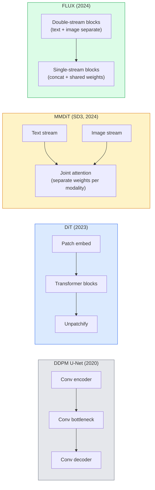

# Transformadores de difusão e fluxo rectificado

> U-Net não é o segredo da difusão. Substitui-o para Transformer, substitui o cronograma de ruído para fluxo de rotas diretas, e de repente obtém SD3 、 FLUX, bem como cada modelo de texto para imagem de 2026 ‖

**类型：**学习 + 构建
**语言：**Python
**前置要求：**Fase 4 Lição 10 (DDPM de difusão), Fase 4 Lição 14 (ViT), Fase 7 Lição 02 (Autoatenção)
**时间：**Cerca de 75 minutos

## Objectivo de aprendizagem

-                                                                                                                                                                                                                                                                                                                                                                                                                                                                                                                              
- Explicação do fluxo rectificado: por que o ruído e os dados são ligados a um modelo que pode ser usado em 20 passos em vez de 1000 passos para completar a pesquisa
- Realizar um pequeno bloco de DiT e um ciclo de treinamento de fluxo rectificado, ambos controlados em 100 行内
- 按架构、参数数和许可 区分模型变体(SD3、FLUX.1-dev、FLUX.1-schnell、Z-Image、Qwen-Image)

## 问题

Lição 10 Utilizando o denotador U-Net  Construir um DDPM ⋅ Esta configuração dominou 2020-2023 ⋅: U-Net + programa beta + perda de previsão de ruído ⋅ produziu a Diffusão Estabil 1.5 ⋅ 2.1 和 DALL-E 2 ⋅

Cada modelo de texto-imagem mais avançado de 2026 já passou por ele. Estabilidade Diffusão 3、FLUX、SD4、Z-Image、Qwen-Image、Hunyuan-Image não usa uma U-Net. Eles usam Transformadores de Diffusão (DiT) ・SD3 和 FLUX também transformam o cronograma de ruído DDPM em fluxo rectificado, o que transformará o caminho do ruído para os dados em direitação, e através da consistência ou variantes destiladas 支持 1-4 步推理──

Esta transformação é importante, porque está a ser gerada de imagens baseadas em difusão, tornou-se controlada, imediatamente precisa, e suficientemente rápida para entrar em produção.

## 核心概念

### Da U-Net para o Transformador



- **DiT**(Peebles & Xie, 2023)  Usando um Transformador semelhante ao ViT  substituir U-Net, em parches latentes 上运行── através da norma de camada adaptativa (AdaLN)  realizar condicionamento──
- **MMDiT**(SD3, Esser et al., 2024) 为文本代币和图像代币 使用两个拥有独立权重的流,并共享一个共同关注――
- **FLUX**(Black Forest Labs, 2024) 前 N 个块 像 SD3 一样采用双流,后续块将代币连锁并共享重量(单流),以提高更深层结构的效率──
- **Z-Image**(2025)  um alto-eficácia de parâmetros 6B de corrente única DiT, desafiou                                                                                                                                                                                                                                                  

### Usage of the word " fluxo corrigido "

DDPM vai definir o processo avançado como um SDE barulhento, entre os quais`x_t`O inverso do aprendizado é o segundo SDE, que requer 1000 pequenos passos para resolver.

Fluxo corrigido  define dados limpos e ruído puro **直线**插值:

```
x_t = (1 - t) * x_0 + t * epsilon,     t in [0, 1]
```

Treinar uma rede para prever a velocidade`v_theta(x_t, t) = epsilon - x_0`也就是沿着从清洁数据到噪音的直线路径的前进方向(`dx_t/dt`O ODE é mais próximo da linha reta, portanto, as etapas de integração necessárias para a adoção são muito menores.

SD3 será denominado **Rectified Flow Matching** FLUX、Z-Image 和大多数 2026年模型 使用相同的目标──典型推断:20-30 个 艾勒步骤(determinizista),相比旧DDPM 体系中的50+ DDIM步骤──Distilled / turbo / schnell / LCM variantes pode reduzir-se a 1-4 步──

### Condicionamento AdaLN

DiTs           **adaptive layer norm**Em tempo e classe / texto 上做 condicionamento: do condicionamento Vêctor 中预测 `scale`和 `shift`, e depois aplicá-los em LayerNorm. Isto é mais fácil do que a modulação de estilo FiLM em U-Nets.

```
cond -> MLP -> (scale, shift, gate)
norm(x) * (1 + scale) + shift, then residual add * gate
```

### Encoderadores de texto em SD3 e FLUX

- **SD3**Utilize três codificadores de texto: dois modelos CLIP + T5-XXL。 Embaixamentos são concatenados 后作为文本调节 送入图像流──
- **FLUX**Use um CLIP-L + T5-XXL
- **Qwen-Image / Z-Image**Variantes utilizadas com seus LLM base para codificadores de texto de desenvolvimento próprio.

O codificador de texto é o SD3/FLUX 之所以比SD1.5 更能理解提示的重要原因──单独T5-XXL 就有4.7B参数──

### Orientação livre de classificadores  ainda成立

Fluxo rectificado  alteração é o amostragem, não o condicionamento. Guia livre de classificadores                                                                                                                                                                                                                                                   

### Consistência, Turbo, Schnell, LCM

O modelo de destilação de muitos passos em um modelo de poucos passos em um rápido passo.

- **LCM (Latent Consistency Model)**Treinar um aluno, fazê-lo ser capaz de qualquer intermediário.`x_t`Uma fase de previsão final`x_0`- Não.
- **SDXL Turbo / FLUX schnell** utilizar destilação de difusão adversária 訓練的 1-4 步模型──
- **SD Turbo**将 OpenAI-style Consistence Models 适配到潜伏传播──

 qualquer novo modelo de produção de serviço geralmente são simultaneamente lançados um full quality checkpoint 和一个turbo / schnell variant。Schnell(((em alemãofast, Black Forest Labs                                                                                                                                                                                                                                      

### Paisagem Modelo de 2026

| Model | Size | Architecture | License |
|-------|------|--------------|---------|
| Stable Diffusion 3 Medium | 2B | MMDiT | SAI Community |
| Stable Diffusion 3.5 Large | 8B | MMDiT | SAI Community |
| FLUX.1-dev | 12B | Double + Single Stream DiT | non-commercial |
| FLUX.1-schnell | 12B | same, distilled | Apache 2.0 |
| FLUX.2 | — | iterated FLUX.1 | mixed |
| Z-Image | 6B | S3-DiT (Scalable Single-Stream) | permissive |
| Qwen-Image | ~20B | DiT + Qwen text tower | Apache 2.0 |
| Hunyuan-Image-3.0 | ~80B | DiT | research |
| SD4 Turbo | 3B | DiT + distillation | SAI Commercial |

FLUX.1-schnell é o modelo de código aberto de 2026 默认选择──Z-Image é líder em eficiência──FLUX.2 和 SD4 é o modelo de qualidade mais confiável atual──

### Por que esta fase de transformação é importante

DDPM + U-Net 能工作──DiT + fluxo rectificado 工作得**更好、更快，并且扩展得更干净** Esta transformação é semelhante à NLP: duas arquiteturas resolvem o mesmo problema, mas os transformadores podem mais se expandir e agora ocupam o domínio.


```figure
cv3-rectified-flow
```

## Construí-lo

### 步骤 1: Traz o bloco de DiT do AdaLN

```python
import torch
import torch.nn as nn


class AdaLNZero(nn.Module):
    """
    Adaptive LayerNorm with a gate. Predicts (scale, shift, gate) from the conditioning.
    Init such that the whole block starts as identity ("zero init").
    """

    def __init__(self, dim, cond_dim):
        super().__init__()
        self.norm = nn.LayerNorm(dim, elementwise_affine=False)
        self.mlp = nn.Linear(cond_dim, dim * 3)
        nn.init.zeros_(self.mlp.weight)
        nn.init.zeros_(self.mlp.bias)

    def forward(self, x, cond):
        scale, shift, gate = self.mlp(cond).chunk(3, dim=-1)
        h = self.norm(x) * (1 + scale.unsqueeze(1)) + shift.unsqueeze(1)
        return h, gate.unsqueeze(1)


class DiTBlock(nn.Module):
    def __init__(self, dim=192, heads=3, mlp_ratio=4, cond_dim=192):
        super().__init__()
        self.adaln1 = AdaLNZero(dim, cond_dim)
        self.attn = nn.MultiheadAttention(dim, heads, batch_first=True)
        self.adaln2 = AdaLNZero(dim, cond_dim)
        self.mlp = nn.Sequential(
            nn.Linear(dim, dim * mlp_ratio),
            nn.GELU(),
            nn.Linear(dim * mlp_ratio, dim),
        )

    def forward(self, x, cond):
        h, gate1 = self.adaln1(x, cond)
        a, _ = self.attn(h, h, h, need_weights=False)
        x = x + gate1 * a
        h, gate2 = self.adaln2(x, cond)
        x = x + gate2 * self.mlp(h)
        return x
```

`AdaLNZero`Um começo é um mapeamento de identidade, porque seus pesos MLP são iniciados em zero.

### Passo 2: Uma pequena DiT

```python
def timestep_embedding(t, dim):
    import math
    half = dim // 2
    freqs = torch.exp(-math.log(10000) * torch.arange(half, device=t.device) / half)
    args = t[:, None].float() * freqs[None]
    return torch.cat([args.sin(), args.cos()], dim=-1)


class TinyDiT(nn.Module):
    def __init__(self, image_size=16, patch_size=2, in_channels=3, dim=96, depth=4, heads=3):
        super().__init__()
        self.patch_size = patch_size
        self.num_patches = (image_size // patch_size) ** 2
        self.patch = nn.Conv2d(in_channels, dim, kernel_size=patch_size, stride=patch_size)
        self.pos = nn.Parameter(torch.zeros(1, self.num_patches, dim))
        self.time_mlp = nn.Sequential(
            nn.Linear(dim, dim * 2),
            nn.SiLU(),
            nn.Linear(dim * 2, dim),
        )
        self.blocks = nn.ModuleList([DiTBlock(dim, heads, cond_dim=dim) for _ in range(depth)])
        self.norm_out = nn.LayerNorm(dim, elementwise_affine=False)
        self.head = nn.Linear(dim, patch_size * patch_size * in_channels)

    def forward(self, x, t):
        n = x.size(0)
        x = self.patch(x)
        x = x.flatten(2).transpose(1, 2) + self.pos
        t_emb = self.time_mlp(timestep_embedding(t, self.pos.size(-1)))
        for blk in self.blocks:
            x = blk(x, t_emb)
        x = self.norm_out(x)
        x = self.head(x)
        return self._unpatchify(x, n)

    def _unpatchify(self, x, n):
        p = self.patch_size
        h = w = int(self.num_patches ** 0.5)
        x = x.view(n, h, w, p, p, -1).permute(0, 5, 1, 3, 2, 4).reshape(n, -1, h * p, w * p)
        return x
```

### 步骤 3: Treinamento de fluxo rectificado

```python
import torch.nn.functional as F

def rectified_flow_train_step(model, x0, optimizer, device):
    model.train()
    x0 = x0.to(device)
    n = x0.size(0)
    t = torch.rand(n, device=device)
    epsilon = torch.randn_like(x0)
    x_t = (1 - t[:, None, None, None]) * x0 + t[:, None, None, None] * epsilon

    target_velocity = epsilon - x0
    pred_velocity = model(x_t, t)

    loss = F.mse_loss(pred_velocity, target_velocity)
    optimizer.zero_grad()
    loss.backward()
    optimizer.step()
    return loss.item()
```

Com a perda de previsão de ruído do DDPM (Lessão 10)`epsilon`,而是预测 **velocity** `epsilon - x_0`, que segue a direcção de inserção de valores em direcção ao ruído dos dados.

### 步骤 4: Euler amostragem

O fluxo retificado é um ODE. O método de Euler é o método mais simples, e para um bom modelo de fluxo retificado, praticamente igual a soluções de ordem superior em 20+ passos.

```python
@torch.no_grad()
def rectified_flow_sample(model, shape, steps=20, device="cpu"):
    model.eval()
    x = torch.randn(shape, device=device)
    dt = 1.0 / steps
    t = torch.ones(shape[0], device=device)
    for _ in range(steps):
        v = model(x, t)
        x = x - dt * v
        t = t - dt
    return x
```

20 步── Em um modelo de treinamento bom, isso produzirá amostras comparáveis com a DDPM de 1000 passos──

### 步骤 5: Teste de fumo de ponta a ponta

```python
import numpy as np

def synthetic_blobs(num=200, size=16, seed=0):
    rng = np.random.default_rng(seed)
    out = np.zeros((num, 3, size, size), dtype=np.float32)
    yy, xx = np.meshgrid(np.arange(size), np.arange(size), indexing="ij")
    for i in range(num):
        cx, cy = rng.uniform(4, size - 4, size=2)
        r = rng.uniform(2, 4)
        mask = (xx - cx) ** 2 + (yy - cy) ** 2 < r ** 2
        colour = rng.uniform(-1, 1, size=3)
        for c in range(3):
            out[i, c][mask] = colour[c]
    return torch.from_numpy(out)
```

Usar fluxo rectificado neste conjunto de dados para treinar um `TinyDiT`❖ 500 passos ◦ Depois, as saídas de amostragem ◦ devem parecer manchas de cor tontas ◦

## Use-o

对于使用FLUX / SD3 / Z-Image 的真实图像生成,`diffusers`Para cada modelo  fornecer API unificada:

```python
from diffusers import FluxPipeline, StableDiffusion3Pipeline
import torch

pipe = FluxPipeline.from_pretrained(
    "black-forest-labs/FLUX.1-schnell",
    torch_dtype=torch.bfloat16,
).to("cuda")

out = pipe(
    prompt="a golden retriever surfing a tsunami, hyperrealistic, studio lighting",
    guidance_scale=0.0,           # schnell was trained without CFG
    num_inference_steps=4,
    max_sequence_length=256,
).images[0]
out.save("surf.png")
```

Três.`FLUX.1-schnell`Quatro passos completados.`black-forest-labs/FLUX.1-dev`A produção de CFG é de 20 a 30 passos para obter uma qualidade mais elevada.

                                                                                                                                                                                                                                                                                                                                                                                                                                                                                                                             

```python
pipe = StableDiffusion3Pipeline.from_pretrained(
    "stabilityai/stable-diffusion-3.5-large",
    torch_dtype=torch.bfloat16,
).to("cuda")
out = pipe(prompt, guidance_scale=3.5, num_inference_steps=28).images[0]
```

## Entrega-o

本课会产出:

- `outputs/prompt-dit-model-picker.md`在给定质量、延迟和许可 约束时,在 SD3、FLUX.1-dev、FLUX.1-schnell、Z-Image、SD4 Turbo 之间做选择──
- `outputs/skill-rectified-flow-trainer.md` redactar um ciclo de treinamento de fluxo rectificado completo, contendo amostragem AdaLN DiT 和 Euler

## 练习

1. **（简单）**Em conjunto de dados de blob sintético, a formação acima da TinyDiT 500 passos.
2. **（中等）**通過把一個學習級 拼接到時間 拼接上 嵌上,加入文字調節 (→ 分分的10 个斑點 类) ──分别用类0、5 和 9 采样,并验证颜色匹配──
3. **（困难）**计算在同样大小的网络、同样数据、同样训练步数下,rectified-flow与DDPM 版本生成样品 之间的 Fréchet distance (FID proxy) ⋅报告哪一个收更快──

## 关键术语

| Term | 人们常说 | 实际含义 |
|------|----------------|----------------------|
| DiT | “Diffusion transformer” | 替代 U-Net 作为 diffusion denoiser 的 Transformer；在 patchified latents 上运行 |
| AdaLN | “Adaptive layer norm” | 通过学习到的 scale、shift、gate 进行 timestep/text conditioning，并在 LayerNorm 之后应用；每个现代 DiT 的标准做法 |
| MMDiT | “Multi-modal DiT (SD3)” | 为 text tokens 和 image tokens 使用独立 weight streams，并共享一个 joint self-attention |
| Single-stream / double-stream | “FLUX trick” | 前 N 个 blocks 为 double-stream（每种 modality 使用独立 weights），后续 blocks 为 single-stream（concat + shared weights），以提升效率 |
| Rectified flow | “Straight-line noise-to-data” | data 与 noise 之间的线性插值；网络预测 velocity；inference 所需 ODE steps 更少 |
| Velocity target | “epsilon - x_0” | rectified flow 中的 Regression target；从 clean data 指向 noise |
| CFG guidance | “classifier-free guidance” | 混合 conditional 与 unconditional predictions；rectified-flow models 中仍然使用 |
| Schnell / turbo / LCM | “1-4 step distillation” | 从 full-quality models distill 得到的小步数 variants；用于生产实时场景 |

## 延伸阅读

- [Scalable Diffusion Models with Transformers (Peebles & Xie, 2023)](https://arxiv.org/abs/2212.09748)DiT 论文
- [Scaling Rectified Flow Transformers (Esser et al., SD3 paper)](https://arxiv.org/abs/2403.03206) MMDiT de grande dimensão e fluxo rectificado
- [FLUX.1 model card and technical report (Black Forest Labs)](https://huggingface.co/black-forest-labs/FLUX.1-dev)doble + single-stream 细节
- [Z-Image: Efficient Image Generation Foundation Model (2025)](https://arxiv.org/html/2511.22699v1)6B DiT de corrente única
- [Elucidating the Design Space of Diffusion (Karras et al., 2022)](https://arxiv.org/abs/2206.00364) Referência para cada difusão  Design trade-off
- [Latent Consistency Models (Luo et al., 2023)](https://arxiv.org/abs/2310.04378)LCM-LoRA  como conseguir a inferência em 4 etapas
