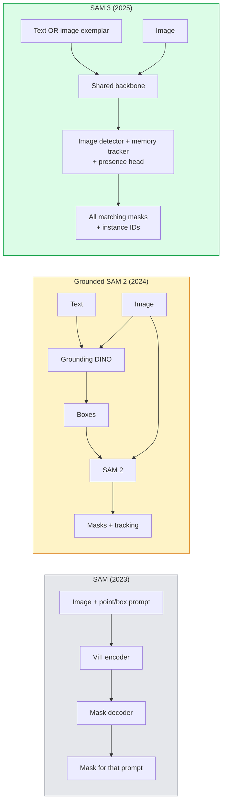

# SAM 3 e Segmentação de Vocabulário Aberto

> 给模型一个文本提示和一张图像,即可获得每个匹配对象的面具──SAM 3 让它变成一个单独的前进通行──

**类型：**Utilização + 构建
**语言：**Python
**先修要求：**Fase 4 Lição 07 (U-Net), Fase 4 Lição 08 (Máscara R-CNN), Fase 4 Lição 18 (CLIP)
**时间：**- 60 minutos.

## Objectivo de aprendizagem

- 区分 SAM(só instruções visuais)、Grounded SAM / SAM 2(detector + SAM) e SAM 3(via Segmentação de conceito Promptable 原生支持文本提示)
- 解释 SAM 3 架构:spine shared + imagem detector + memória baseada em vídeo tracker + presença cabeça + desenho descoplado detector-tracker
- Uso de cara abraçada .`transformers`SAM 3 集成 realizar detecção de texto-promulgada ‧segmentação ‧ rastreamento de vídeo
- De acordo com a latência, a complexidade do conceito e o objetivo de implantação, entre SAM 3 e SAM 2 baseado em SAM 2 e YOLO-World e SAM-MI

## 问题

SAM de 2023 é um modelo de apenas suportar o visual prompt: você clica em um ponto ou desenha uma caixa, ele retorna uma máscara. Para encontrar tudo no quadro, você precisa de um detector.

SAM 3(Meta,2025 年 11 月, ICLR 2026) comprimido este grau.**Promptable Concept Segmentation (PCS)**◊结合 2026 年 3 月的 Object Multiplex 更新(SAM 3.1), pode ser altamente eficaz em vídeo para acompanhar várias instâncias do mesmo conceito。

Esta aula se concentra na transformação estrutural que representa. A segmentação 2D, detecção e a fixação de imagens de texto já estão combinadas em um modelo. A questão de produção não é mais o que vou fazer, mas o que é um modelo rápido que pode ser usado para processar o meu caso de uso.

## 概念

### 3o modelo



### Segmentação de conceitos

concept prompt 是一个简短的名词短语(`"yellow school bus"`- Não.`"striped red umbrella"`- Não.`"hand holding a mug"`) ou um exemplo de imagem. O modelo irá retornar a imagem para cada instância do conceito correspondente.

Isto é diferente do SAM visual-pronto clássico.

1. Não precisa de cada instância  fornecer um prompt: um prompt de texto  retornar todos os correspondentes.
2. Vocabulário aberto: conceito pode ser qualquer conteúdo que possa ser descrito em linguagem natural.
3. Uma vez de volta em várias instâncias, em vez de cada prompt de volta em uma máscara.

### 关键架构组件

- **Shared backbone**Uma imagem de ViT 处理图片── detetor head 和 memória-based tracker 都从中读取信息──
- **Presence head**O conceito de pré-existência não existe na imagem.
- **Decoupled detector-tracker**: detecção a nível de imagem, acompanhamento a nível de vídeo, utilização de cabeças independentes, evitar interferências mútuas.
- **Memory bank**: transframe  armazenamento de cada instância características, para rastreamento de vídeo( com SAM 2 utilização do mesmo mecanismo)

### Formação em grande escala

SAM 3 em **400 万个 unique concepts**上训练, estes conceitos são desenvolvidos por um motor de dados, que é criado por AI + Auditoria Artificial.**SA-CO benchmark**Conter 270K conceitos únicos, em comparação com os benchmarks anteriores, grande 50 vezes.

### SAM 3.1 Objeto Multiplex

2026 年 3 月更新:**Object Multiplex** Introdução de um mecanismo de memória compartilhada, usado para acompanhar simultaneamente várias instâncias do mesmo conceito.                                                                                                                                                                                                                                                 

### 2026 ano SAM em terra  ainda é importante cenário

- Quando precisares de substituir um detector de vocabulário aberto específico
- Quando a licença SAM 3 (HF 上) é bloqueada,
- Quando você precisa de mais controle do que o limite de detecção do SAM 3.
- Utilizado para o trabalho de investigação / ablação do componente detector.

Os canais modulares  ainda têm valor  para a maioria dos trabalhos de produção, o SAM 3 é a resposta mais simples

### YOLO-World vs SAM 3

- **YOLO-World**: Apenas detector de vocabulário aberto (((sem máscaras)― em tempo real―
- **SAM 3**: segmentação completa + rastreamento.

生产场景划分:YOLO-World 适合快速检测-only pipelines(robotica de navegação, fast dashboards),SAM 3 适合任何需要面具或跟踪的场景──

### SAM-MI 效率

SAM-MI(2025-2026) resolver o gargalho de engarrafamento do decodificador SAM──关键思想:

- **Sparse point prompting**Usando menos pontos de seleção, em vez de pedidos densos; vai decodificar chamadas  reduzir 96%。
- **Shallow mask aggregation**A partir de agora, a nova versão da versão será lançada em um novo formato.
- **Decoupled mask injection**O decodificador recebe as características da máscara, em vez de re-carregá-la.

Resultado: em referências de vocabulário aberto, comparação com o SAM baseado  aproximadamente 1,6× velocidade.

### Formato de saída de três modelos

它们都回归相同的一般结构(盒子 + 标签 + 积分 + 面具 + ID), isso é muito útil: seu down游管道 不需要根据运行的模型来分支──


```figure
cv3-open-vocab
```

## Construção

### 步骤 1: Construção rápida

Construir um auxiliar, transformar as palavras do usuário em SAM 3 Concept Prompts 列表── é a fronteira entre o conteúdo que o usuário entra e o que o modelo consome.

```python
def split_concepts(sentence):
    """
    Heuristic splitter for multi-concept prompts.
    Returns list of short noun phrases.
    """
    for sep in [",", ";", "and", "or", "&"]:
        if sep in sentence:
            parts = [p.strip() for p in sentence.replace("and ", ",").split(",")]
            return [p for p in parts if p]
    return [sentence.strip()]

print(split_concepts("cats, dogs and balloons"))
```

SAM 3 Cada passagem avançada  aceitar um conceito; para consultas de conceitos múltiplos, ciclo ou bateria de tratamento.

### 步骤 2:Assistentes de pós-processamento

Para a fase 4 do lição 16, o contrato de pipeline.

```python
from dataclasses import dataclass
from typing import List

@dataclass
class ConceptDetection:
    concept: str
    instance_id: int
    box: tuple          # (x1, y1, x2, y2)
    score: float
    mask_rle: str       # run-length encoded


def rle_encode(binary_mask):
    flat = binary_mask.flatten().astype("uint8")
    runs = []
    prev, count = flat[0], 0
    for v in flat:
        if v == prev:
            count += 1
        else:
            runs.append((int(prev), count))
            prev, count = v, 1
    runs.append((int(prev), count))
    return ";".join(f"{v}x{c}" for v, c in runs)
```

Mesmo que haja muitas máscaras de alta resolução, o RLE também pode fazer com que as cargas de resposta sejam menores.

### 步骤 3:统一的 segmentação de vocabulário aberto interface

Quando o backend é alterado, o código não precisa ser alterado.

```python
from abc import ABC, abstractmethod
import numpy as np

class OpenVocabSeg(ABC):
    @abstractmethod
    def detect(self, image: np.ndarray, concept: str) -> List[ConceptDetection]:
        ...


class StubOpenVocabSeg(OpenVocabSeg):
    """
    Deterministic stub used for pipeline testing when real models are not loaded.
    """
    def detect(self, image, concept):
        h, w = image.shape[:2]
        return [
            ConceptDetection(
                concept=concept,
                instance_id=0,
                box=(w * 0.2, h * 0.3, w * 0.5, h * 0.8),
                score=0.89,
                mask_rle="0x100;1x50;0x200",
            ),
            ConceptDetection(
                concept=concept,
                instance_id=1,
                box=(w * 0.55, h * 0.25, w * 0.85, h * 0.75),
                score=0.74,
                mask_rle="0x80;1x40;0x220",
            ),
        ]
```

Verdadeiro.`SAM3OpenVocabSeg`Subclasse 会封装 `transformers.Sam3Model`和 `Sam3Processor`- Não.

### 步骤 4: Acogimento da face SAM 3 用法(referência)

                                                                                                                                                                                                                                                                                                                                                                                                                                                                                                                             `transformers`集成:

```python
from transformers import Sam3Processor, Sam3Model
import torch

processor = Sam3Processor.from_pretrained("facebook/sam3")
model = Sam3Model.from_pretrained("facebook/sam3").eval()

inputs = processor(images=pil_image, return_tensors="pt")
inputs = processor.set_text_prompt(inputs, "yellow school bus")

with torch.no_grad():
    outputs = model(**inputs)

masks = processor.post_process_masks(
    outputs.masks, inputs.original_sizes, inputs.reshaped_input_sizes
)
boxes = outputs.boxes
scores = outputs.scores
```

Um instante, uma vez, de volta a todos os correspondentes.

### Passo 5: Messa SAM 2 em terra

Uma referência honesta: O que vai acontecer com o SAM 3 em troca do SAM 2 no real?

- Latência:SAM 3 省掉一次前传 (não há detector independente), mas o modelo em si é mais pesado; normalmente, o sistema tem um ritmo ou um pouco de velocidade.
- Precidez:SAM 3 在 raros ou conceitos compostos`"striped red umbrella"`(→ "Propriedade de um Estado")
- Flexibilidade: SAM 2 em terra permite substituir detectores ((DINO-X、Florência-2、DINO em terra 1.5); SAM 3 é monolitico。

结论:SAM 3 é uma escolha padrão da segção de vocabulário aberto de 2026 anos. Quando você precisa de flexibilidade de detector ou termos de licença diferentes, o SAM 2 baseado ainda é a resposta correta.

## Utilização

O modelo de produção:

- **Real-time annotation**:SAM 3 + CVAT's label-as-text-prompt feature。标注员选择一个标签名;SAM 3 预标注每个匹配的实例──再进行审核和修复──
- **Video analytics**:SAM 3.1 Object Multiplex Utilizado para rastreamento de objetos múltiplos;将 frames 输入 memória-based tracker。
- **Robotics**:SAM 3 Used for open-vocaba manipulation ((pick up the red cup); como planejamento primitivo 运行。
- **Medical imaging**A aplicação de um sistema de informação e de informação é necessária para a aplicação de um sistema de informação e informação.

Ultralítica em seu pacote Python em embalagem SAM 3:

```python
from ultralytics import SAM

model = SAM("sam3.pt")
results = model(image_path, prompts="yellow school bus")
```

Com YOLO 和 SAM 2 Use the same interface.

## 交付

本课会产出:

- `outputs/prompt-open-vocab-stack-picker.md`Uma baseada na latência, complexidade do conceito e licenciamento escolher SAM 3 / SAM 2 / YOLO-World / SAM-MI 
- `outputs/skill-concept-prompt-designer.md`Uma boa forma de fazer o SAM 3 Concept Prompts é a habilidade de dividir, desambiguar, reversões.

## 练习

1. **（Easy）**Em 10 imagens, você vai executar o SAM 3, e usar os seus próprios conceitos de seleção.
2. **（Medium）**Em SAM 3 之之之之构建一个 点击-to-incluir /点击-to-exclud UI:text prompt 返回候选实例;用户点击保留哪些算作 positive──将最终概念集合 输出为 JSON──
3. **（Hard）**Em conjunto de conceitos autodefinidos (por exemplo, 5 componentes eletrônicos) de sintonização de SAM 3, cada tipo de 20 imagens rotuladas, comparado com o mesmo conjunto de testes de SAM 3 de zero-shot; medir melhoria da UIO da máscara,

## 关键术语

| Term | 人们通常怎么说 | 实际含义 |
|------|----------------|----------------------|
| Open-vocabulary segmentation | “Segment by text” | 为自然语言描述的 objects 生成 masks，而不是使用固定 label set |
| PCS | “Promptable Concept Segmentation” | SAM 3 的核心任务：给定一个 noun-phrase 或 image exemplar，segment 所有匹配 instances |
| Concept prompt | “The text input” | 简短名词短语或 image exemplar；不是完整句子 |
| Presence head | “Is it here?” | SAM 3 中的模块，用于在 localisation 之前判断 concept 是否存在于 image 中 |
| SA-CO | “SAM 3 benchmark” | 包含 270K concepts 的 open-vocabulary segmentation benchmark；比以往 open-vocab benchmarks 大 50 倍 |
| Object Multiplex | “SAM 3.1 update” | Shared-memory multi-object tracking；快速联合跟踪多个 instances |
| Grounded SAM 2 | “Modular pipeline” | Detector + SAM 2 级联；当 detector 替换很重要时仍然相关 |
| SAM-MI | “Efficient SAM variant” | Mask Injection，相比 Grounded-SAM 实现 1.6x speedup |

## 延伸阅读

- [SAM 3: Segment Anything with Concepts (arXiv 2511.16719)](https://arxiv.org/abs/2511.16719)
- [SAM 3.1 Object Multiplex (Meta AI, March 2026)](https://ai.meta.com/blog/segment-anything-model-3/)
- [SAM 3 model page on Hugging Face](https://huggingface.co/facebook/sam3)
- [Grounded SAM 2 tutorial (PyImageSearch)](https://pyimagesearch.com/2026/01/19/grounded-sam-2-from-open-set-detection-to-segmentation-and-tracking/)
- [Ultralytics SAM 3 docs](https://docs.ultralytics.com/models/sam-3/)
- [SAM3-I: Instruction-aware SAM (arXiv 2512.04585)](https://arxiv.org/abs/2512.04585)
