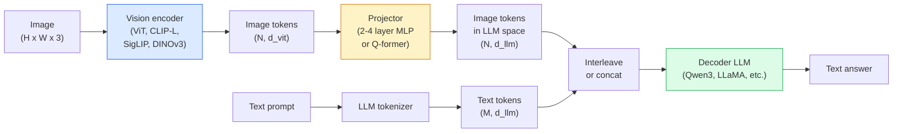

# Modelos de Língua de Visão  ViT-MLP-LLM 模式

> O codificador de visão transformará imagens em tokens. O projeto MLP irá mapear esses tokens para o espaço de incorporação do LLM. O modelo de linguagem completará o restante do trabalho.

**类型：**学习 + 使用
**语言：**Python
**前置要求：**Fase 4 Lição 14 (ViT), Fase 4 Lição 18 (CLIP), Fase 7 Lição 02 (Autoatenção)
**时间：**- 75 minutos.

## Objectivo de aprendizagem

- Explicar o que contribuem os três componentes
- Em termos de parametros, comprimento de contexto e desempenho de referência, Qwen3-VL, InternVL3.5 LLaVA-Next e GLM-4.6V
- Explicar DeepStack: Por que as funcionalidades de vários níveis da ViT são mais apertadas do que a única característica de última camada
- Em ambiente de produção, a taxa de erro transmodal (CMER) é usada para medir a alucinação VLM, e baseia-se no sinal para a ação.

## 问题

CLIP (Fase 4 Lição 18) para imagens e texto fornecer espaço de inserção compartilhada, o que é suficiente para suportar classificação de tiros zero e recuperação. Não pode responder

Modelos de Língua de Visão (VLMs)  Qwen3-VL、InternVL3.5、LLaVA-Next、GLM-4.6V  Vai criar um codificador de imagens CLIP-família 接到一个完整的语言模型 上。模型看一张图像加一个问题,然后生成答案── até 2026 年, VLMs de código aberto em benchmarks multimodal (MMMU, MMBench, DocVQA, ChartQA, MathVista, OSWorld) 上已经可以比肩甚至超过 GPT-5 和 Gemini-2.5-Pro──

Esse grupo de três componentes (ViT, projeto, LLM) é a estrutura padrão. A diferença entre os modelos é o uso de quais ViT, quais projetores, quais LLM, dados de treinamento e receita de alinhamento. Uma vez que você entende esse modelo, substituir qualquer componente é um trabalho mecânico.

## 概念

### ViT-MLP-LLM 架构



1. **Vision encoder** 预训练 ViT(CLIP-L/14、SigLIP、DINOv3, ou variante afinada)
2. **Projector** 一个小模块(2-4 层 MLP, ou Q-former),将视觉代币映射到LLM embed dimension──大多数细调发生在这里──
3. **LLM** modelo de linguagem apenas para decodificador ((Qwen3、Llama、Mistral、GLM、InternLM) ・・・按序读取 visão + tokens de texto,并生成文本。

Em prática, o codificador de visão e o LLM, em geral, mantêm-se congelados, apenas treinando o projeto, de modo a poder suportar com baixo custo sinais de bilhões de parâmetros.

### DeepStack

Normal projeção apenas usando a última camada de ViT camada。DeepStack(Qwen3-VL) vai de várias ViT profundidade de amostragem recursos e vai colocá-los em pilha ∼.

### Três fases de treinamento

现代 VLMs 分阶段训练:

1. **Alignment** congelar ViT 和 LLM── apenas em pares de imagem-capção 上訓練投影機──教会投影機 将视野空間 映射到语言空間──
2. **Pre-training** 解所有部分── 大规模交错图像文本数据(500M+ pares) 上训练──构建模型的视觉知识──
3. **Instruction tuning** 在精选的(图像, question, answer) 三元组上细调──教会对话行为 和任务格式──这一步把视觉意识的LM变成可用助手──

A maioria dos LoRA fine-tunes irá usar o conjunto de dados de marcação de pequena escala para a 3a fase.

### 模型家族比较(2026年初)

| Model | Params | Vision encoder | LLM | Context | Strengths |
|-------|--------|----------------|-----|---------|-----------|
| Qwen3-VL-235B-A22B (MoE) | 235B (22B active) | custom ViT + DeepStack | Qwen3 | 256K | 综合 SOTA，GUI agent |
| Qwen3-VL-30B-A3B (MoE) | 30B (3B active) | custom ViT + DeepStack | Qwen3 | 256K | 更小的 MoE 替代方案 |
| Qwen3-VL-8B (dense) | 8B | custom ViT | Qwen3 | 128K | 生产环境 dense 默认选择 |
| InternVL3.5-38B | 38B | InternViT-6B | Qwen3 + GPT-OSS | 128K | MMBench / MMVet 表现强 |
| InternVL3.5-241B-A28B | 241B (28B active) | InternViT-6B | Qwen3 | 128K | 可与 GPT-4o 竞争 |
| LLaVA-Next 72B | 72B | SigLIP | Llama-3 | 32K | 开放，易于 fine-tune |
| GLM-4.6V | ~70B | custom | GLM | 64K | Open-source，OCR 强 |
| MiniCPM-V-2.6 | 8B | SigLIP | MiniCPM | 32K | 适合边缘部署 |

### Agentes visuais

Qwen3-VL-235B em OSWorld  alcançar o desempenho global de topo, OSWorld é orientado para**visual agents**O modelo pode ser usado para avaliar a interface gráfica operacional (GUI) e ver imagens de tela, entender a interface e fazer ações de saída (click, type, scroll).

### Agente 能力 + RoPE 变体

VLMs precisam saber que algo no vídeo está acontecendo**什么时候**△Qwen3-VL de T-RoPE (impregnados de posição rotativa temporária) evolução**基于文本的时间 alignment**, é que vai ser um símbolo de texto de timestamp de forma clara com quadros de vídeo 交错――模型看`<timestamp 00:32>`Quadro, rápido, podemos pensar no tempo.

### Aligamento 问题

爬取数据集 12% de pares de imagem-texto 包含并未完全由图像支的描述── utilizando este tipo de treinamento de dados para alucinar, ou seja, fazer objetos、errorar números、虚构关系── no ambiente de produção, este é o principal modelo de fracasso──

Skywork.ai  introduziu **Cross-Modal Error Rate (CMER)**Para o rastrear:

```
CMER = fraction of outputs where the text confidence is high but the image-text similarity (via a CLIP-family checker) is low
```

O alto CMER significa que o modelo está dizendo com confiança que não está sendo financiado por imagens. O monitoramento do CMER, e considerá-lo como KPI de produção, reduzirá a taxa de alucinação em sua implantação em cerca de 35%.

### Use LoRA / QLoRA  realizar ajustes finos

Para 70B VLM fazer o ajuste completo 超出大多数团队的能力范围──在注意+投影器层上使用LoRA(排名 16-64),或使用4bit base weights 的QLoRA,可以装进单张A100 / H100──成本:5,000-50,000个样本,$100-$5.000                                                                                                                                                                                                                                                                                                                                                                                                                                                                                                                             

### Raciocínio espacial  ainda薄弱

Quando você está usando VLMs em benchmarks de raciocínio espacial ((abrindo-abaixo, esquerda-direita, contabilidade, distância) em cima, o resultado é de 50-60%. Se o seu caso de uso depender de qual objeto está em outro objeto, você precisa de uma grande quantidade de testes, o desempenho genérico de VLM é inferior ao humano. Para tarefas de espaço pura, melhor alternativa do que VLM inclui:


```figure
v4-vlm-projector
```

## Construí-lo

### 步骤 1: Projector

É a parte mais habitual do seu treino.

```python
import torch
import torch.nn as nn


class Projector(nn.Module):
    def __init__(self, vit_dim=768, llm_dim=4096, hidden=4096):
        super().__init__()
        self.net = nn.Sequential(
            nn.Linear(vit_dim, hidden),
            nn.GELU(),
            nn.Linear(hidden, llm_dim),
        )

    def forward(self, x):
        return self.net(x)
```

输入 é um `(N_patches, d_vit)`Tensor simbólico.`(N_patches, d_llm)`❖LLM vai colocar cada linha de saída como outro token.

### 步骤 2: 端到端组装 ViT-MLP-LLM

Abaixo está o mínimo de passagem para frente do VLM.`transformers`O conceito de construção é o que se mostra aqui.

```python
class MinimalVLM(nn.Module):
    def __init__(self, vit, projector, llm, image_token_id):
        super().__init__()
        self.vit = vit
        self.projector = projector
        self.llm = llm
        self.image_token_id = image_token_id  # placeholder token in text prompt

    def forward(self, image, input_ids, attention_mask):
        # 1. vision features
        vision_tokens = self.vit(image)                     # (B, N_patches, d_vit)
        vision_embeds = self.projector(vision_tokens)       # (B, N_patches, d_llm)

        # 2. text embeddings
        text_embeds = self.llm.get_input_embeddings()(input_ids)  # (B, M, d_llm)

        # 3. replace image placeholder tokens with vision embeds
        merged = self._merge(text_embeds, vision_embeds, input_ids)

        # 4. run LLM
        return self.llm(inputs_embeds=merged, attention_mask=attention_mask)

    def _merge(self, text_embeds, vision_embeds, input_ids):
        out = text_embeds.clone()
        expected = vision_embeds.size(1)
        for b in range(input_ids.size(0)):
            positions = (input_ids[b] == self.image_token_id).nonzero(as_tuple=True)[0]
            if len(positions) != expected:
                raise ValueError(
                    f"batch item {b} has {len(positions)} image tokens but vision_embeds has {expected} patches."
                    " Every sample in the batch must be pre-padded to the same number of image placeholder tokens.")
            out[b, positions] = vision_embeds[b]
        return out
```

文本中                                                                                                                                                                                                                                                                                                                                                                                                                                                                                                                          `<image>`Tokens de posicionamento serão substituídos por embutidos de imagem real, LLaVA、Qwen-VL 和 InternVL Usage of are the same pattern。

### 步骤 3: CMER 计算

Uma pequena quantidade de carros.

```python
import torch.nn.functional as F


def cross_modal_error_rate(image_emb, text_emb, text_confidence, sim_threshold=0.25, conf_threshold=0.8):
    """
    image_emb, text_emb: embeddings of image and generated text (normalised internally)
    text_confidence:     mean per-token probability in [0, 1]
    Returns:             fraction of high-confidence outputs with low image-text alignment
    """
    image_emb = F.normalize(image_emb, dim=-1)
    text_emb = F.normalize(text_emb, dim=-1)
    sim = (image_emb * text_emb).sum(dim=-1)        # cosine similarity
    high_conf_low_sim = (text_confidence > conf_threshold) & (sim < sim_threshold)
    return high_conf_low_sim.float().mean().item()
```

Para CmER  como KPI de produção ⋅ por endpoint 、 tipo de prompto ⋅ cliente 分別监控它── CmER 升升表示模型开始在某些输入分布上幻觉──

### 步骤 4: Classificador de VLM de brinquedos (可运行)

O projeto de demonstração é um projeto de aprendizagem.

```python
class ToyVLM(nn.Module):
    def __init__(self, vit_dim=32, llm_dim=64, num_classes=5):
        super().__init__()
        self.projector = Projector(vit_dim, llm_dim, hidden=64)
        self.head = nn.Linear(llm_dim, num_classes)

    def forward(self, vision_tokens):
        projected = self.projector(vision_tokens)
        pooled = projected.mean(dim=1)
        return self.head(pooled)
```

Você pode usar em pares sintéticos, características, classes, acima de 200 passos para se adequar a ele, o que é suficiente para explicar que o padrão do projeto é válido.

## Use-o

As três formas de produção de equipamentos de 2026 utilizam VLMs:

- **Hosted API** OpenAI Vision、Antropic Claude Vision、Google Gemini Vision──零 infraestrutura, existem riscos de fornecedores──
- **Open-source self-host**  através `transformers`和 `vllm`Utilize Qwen3-VL ou InternVL3.5──total controle, pre-
- **在领域数据上 fine-tune** Carregar Qwen2.5-VL-7B ou LLaVA-1.6-7B, em 5k-50k`vllm`Ou `TGI`Serviço

```python
from transformers import AutoProcessor, AutoModelForVision2Seq
import torch
from PIL import Image

model_id = "Qwen/Qwen3-VL-8B-Instruct"
processor = AutoProcessor.from_pretrained(model_id)
model = AutoModelForVision2Seq.from_pretrained(model_id, torch_dtype=torch.bfloat16, device_map="auto")

messages = [{
    "role": "user",
    "content": [
        {"type": "image", "image": Image.open("plot.png")},
        {"type": "text", "text": "What does this chart show?"},
    ],
}]
inputs = processor.apply_chat_template(messages, add_generation_prompt=True, tokenize=True, return_dict=True, return_tensors="pt").to("cuda")
generated = model.generate(**inputs, max_new_tokens=256)
answer = processor.decode(generated[0][inputs["input_ids"].shape[1]:], skip_special_tokens=True)
```

`apply_chat_template`Esconde-se .`<image>`Tokenização de posicionamento; modelo irá ser processado internamente em fusão.

## Entrega-o

本课会产出:

- `outputs/prompt-vlm-selector.md` Em circunstâncias de precisão, latência, comprimento de contexto e orçamento, escolha Qwen3-VL / InternVL3.5 / LLaVA-Next / API。
- `outputs/skill-cmer-monitor.md` 生成代码, com taxa de erro cross-modal para produção de nível final VLM, além de instrumentos 、 de acordo com os painéis de ponta final, bem como os limiares de alertaƒ

## 练习

1. **（简单）**Em cinco imagens, com um VLM aberto arbitrário 跑三个提示(what is this?、count the objects、descrever a cena)
2. **（中等）**Em campo de meta 500 张带字幕 图像上, usando LoRA(ranking 16)fine-tune Qwen2.5-VL-3B ou LLaVA-1.6-7B──comparar zero-shot 和fine-tune de MMBench-style precisão──
3. **（困难）**Para usar o código de imagem do VLM, de sigLIP/CLIP em inglês, é necessário apenas um projeto de treinamento de novo.

## 关键术语

| Term | 人们常说 | 实际含义 |
|------|----------------|----------------------|
| ViT-MLP-LLM | “VLM pattern” | Vision encoder + projector + language model；每个 2026 年 VLM 都如此 |
| Projector | “桥梁” | 2-4 层 MLP（或 Q-former），将 vision tokens 映射到 LLM embedding space |
| DeepStack | “Qwen3-VL feature trick” | stack 多层级 ViT features，而不是只使用最后一层 |
| Image token | “<image> placeholder” | text stream 中的 special token，会被 projected vision embeddings 替换 |
| CMER | “Hallucination KPI” | Cross-Modal Error Rate；当 text confidence 高但 image-text similarity 低时，该值较高 |
| Visual agent | “会点击的 VLM” | 通过 tool calls 操作 GUI（OSWorld、mobile、web）的 VLM |
| Q-former | “固定数量的 token bridge” | BLIP-2 风格的 projector，产出固定数量的 visual query tokens |
| Alignment / pre-training / instruction tuning | “三个阶段” | 标准 VLM 训练 pipeline |

## 延伸阅读

- [Qwen3-VL Technical Report (arXiv 2511.21631)](https://arxiv.org/abs/2511.21631)
- [InternVL3.5 Advancing Open-Source Multimodal Models (arXiv 2508.18265)](https://arxiv.org/html/2508.18265v1)
- [LLaVA-Next series](https://llava-vl.github.io/blog/2024-05-10-llava-next-stronger-llms/)
- [BentoML: Best Open-Source VLMs 2026](https://www.bentoml.com/blog/multimodal-ai-a-guide-to-open-source-vision-language-models)
- [MMMU: Multi-discipline Multimodal Understanding benchmark](https://mmmu-benchmark.github.io/)
- [VLMs in manufacturing (Robotics Tomorrow, March 2026)](https://www.roboticstomorrow.com/story/2026/03/when-machines-learn-to-see-like-experts-the-rise-of-vision-language-models-in-manufacturing/26335/)
