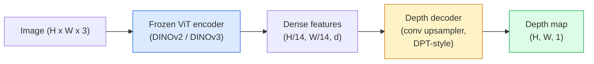

# Profundeza monocular e Estimação Geométrica

> O mapa de profundidade é um quadro de um único canal, em que cada pixel indica a distância da câmera. No passado, se não houver estereótipo ou LiDAR, apenas a partir de um RGB  previsão é considerada impossível. Até 2026, um encoder ViT de um conjunto de cabeças de nível leve, alcançará apenas alguns centos de pontos de diferença com a verdade do solo.

**类型：**构建 + 使用
**语言：**Python
**前置要求：**Fase 4 Lição 14 (ViT), Fase 4 Lição 17 (Visão auto-supervisionada), Fase 4 Lição 07 (U-Net)
**时间：**Cerca de 60 minutos

## Objectivo de aprendizagem

- 区分相对深度 和 метриco depth,并说明每个生产级模型 ((MiDaS, Marigold, Depth Anything V3, ZoeDepth) resolver é qual
- Utilize Depth Qualquer coisa V3(DINOv2 espinha dorsal) em caso de calibração sem necessidade, para qualquer um de um
- 解释为什么单张图像中成立 (percepcionais, gradientes de textura, antecedentes aprendidos),以及它无法恢复什么 (máquina de escala absoluta, geometria oculta)
- Utilize mapa de profundidade e intrínsecas de câmera de pinhole irá detectar 2D  elevar para pontos 3D

## 问题

A profundidade é o eixo de falta de visão por computador em 2D. Dado RGB, você sabe a posição dos objetos no plano de imagem; mas você não sabe como eles estão longe. Sensores de profundidade (stereo rigs, LiDAR, tempo de voo) podem resolver o problema diretamente, mas são caros, fracos e o alcance é limitado.

Estimação de profundidade monocular, ou seja, de um quadro RGB  pré-projeção de profundidade, passado habitualmente produzir um modo de extrair confuso e confiável. Até 2026, grandes codificadores pré-treinados  alteraram este ponto: Depth Anything V3 Using结 of DINOv2,并生成能够泛化到室内、室外、医学、和卫星域的深度地图──Marigold irá 重新表述为条件扩散问题──ZoeDepth 回归真实的米特里距离──

A profundidade também é um ponto de encontro entre a detecção 2D e a compreensão 3D. A profundidade é multiplicada pelos pixels da caixa detectada, para que o objeto 2D possa ser elevado para a nuvem de pontos 3D.

## 概念

### Profundeza relativa vs. métrica

- **Relative depth** 没有真实世界单位的有序 `z`Valores: A pixel A é mais próxima do que a pixel B, mas a proporção de distância não está determinada em metros.
- **Metric depth** A partir da câmera, a partir de uma distância absoluta de metros, o modelo requer aprender a relação entre as imagens e a distância real.

MiDaS 和 Depth Anything V3 生成 relativa profundidade。Marigold 生成 relativa profundidade。ZoeDepth、UniDepth 和 Metric3D 生成 métrica profundidade。Modelos métricos para a intrínseca da câmera 敏感;relativos modelos 则不敏感。

### Encoder-decoder 模式



Depth Anything V3 结 encoder, apenas treinar DPT-style decoder──encoder  fornecer recursos ricos; decoder irá estes recursos 插值回图像分辨率,并回归深度──

### Por que só imagens podem produzir profundidade ?

Uma imagem 2D contém muitas dicas monoculares relacionadas à profundidade:

- **Perspective** 3D 中的平行线在 2D 中会收──
- **Texture gradient**A superfície de distância tem uma textura menor e mais densa.
- **Occlusion order**Os objetos mais próximos cobrirão os mais distantes.
- **Size constancy** 已知物体 (objetos já conhecidos)  carros ̇ humanos) fornecem escala aproximada 
- **Atmospheric perspective** Em cenas ao ar livre, objetos distantes parecem mais...

A ViT, que treinou em bilhões de imagens, irá incorporar essas dicas.

### Profundidade monócular Não posso fazer nada

- Não há elementos intrínsecos ou conhecidos no cenário.**absolute metric scale** rede pode prever cup  distância  é duas vezes  de colher, mas não sabe  cup  é 1 m ou 10 m 
- **Occluded geometry**A parte de trás da cadeira é invisível, não pode ser concluída.
- **真正无 texture / reflective surfaces** espelhos, vidro, paredes uniformes, rede, relatório parecer razoável mas errôneo profundidade.

### 2026  Depth Anything V3

- Utilize原生 DINOv2 ViT-L/14 作为编码器(结)。
- Descódigo DPT:
- Em pares de imagens de várias origens, além da consistência fotométrica, não é necessária uma supervisão de profundidade evidente)
- 能够从 **任意数量的 visual inputs 中预测空间一致的 geometry，无论是否已知 camera poses**- Não.
- Em profundidade monocular, geometria de qualquer visão, renderização visual, avaliação de posição da câmera,

Este é um modelo de deposição que deve ser utilizado em 2026 para a necessidade de profundidade.

### Marigold  Usando a difusão de profundidade

Marigold(Ke et al., CVPR 2024) vai estimar a profundidade 重新表述为条件图像-to-image diffusion──Conditioning:RGB──Target:depth map──Use pre-trained Stable Diffusion 2 U-Net 作为骨干──输出深度maps 在对象边界处格外清晰──权衡:inference比 feed-forward models 更慢(10-50 个 个 个 个 个 否定步骤)──

### Intrínseca e câmera de buraco de pinhoque

Vai ter profundidade.`d`De pixel `(u, v)`提升为相机坐标 中的3D点 `(X, Y, Z)`- Não .

```
fx, fy, cx, cy = camera intrinsics
X = (u - cx) * d / fx
Y = (v - cy) * d / fy
Z = d
```

Intrínseca de metadados EXIF、 padrão de calibração, ou estimador intrínseco monocular ((Perspectiva Fields、UniDepth) ︎ ︎ ︎ ︎ ︎ ︎ ︎ ︎ ︎ ︎ ︎ ︎ ︎ ︎ ︎ ︎ ︎ ︎ ︎ ︎ ︎ ︎ ︎ ︎ ︎ ︎ ︎ ︎ ︎ ︎ ︎ ︎ ︎ ︎ ︎ ︎ ︎ ︎ ︎ ︎ ︎ ︎ ︎ ︎ ︎ ︎ ︎ ︎ ︎ ︎ ︎ ︎ ︎ ︎ ︎ ︎ ︎ ︎ ︎ ︎ ︎ ︎ ︎ ︎ ︎ ︎ ︎ ︎ ︎ ︎ ︎ ︎ ︎ ︎ ︎ ︎ ︎ ︎ ︎ ︎ ︎ ︎ ︎ ︎ ︎ ︎ ︎ ︎ ︎ ︎ ︎ ︎ ︎ ︎ ︎ ︎ ︎ ︎ ︎ ︎ ︎ ︎ ︎ ︎ ︎ ︎ ︎ ︎ ︎ ︎ ︎ ︎ ︎ ︎ ︎ ︎ ︎ ︎ ︎ ︎ ︎ ︎ ︎ ︎ ︎ ︎ ︎ ︎ ︎  ︎  

### Avaliação

 Dois critérios:

- **AbsRel**(erro relativo absoluto):`mean(|d_pred - d_gt| / d_gt)`△越低越好── modelos de classe de produção geralmente são de 0,05-0,1──
- **delta < 1.25**(precisão do limiar):满足 `max(d_pred/d_gt, d_gt/d_pred) < 1.25`Os pixels 占比──越高越好──SOTA geralmente é de 0,9+──

 Para a profundidade relativa ((Depth Anything V3、MiDaS), avaliação 


```figure
depth-sweep
```

## Construção

### 步骤 1: Metricas de profundidade

```python
import torch

def abs_rel_error(pred, target, mask=None):
    if mask is not None:
        pred = pred[mask]
        target = target[mask]
    return (torch.abs(pred - target) / target.clamp(min=1e-6)).mean().item()


def delta_accuracy(pred, target, threshold=1.25, mask=None):
    if mask is not None:
        pred = pred[mask]
        target = target[mask]
    ratio = torch.maximum(pred / target.clamp(min=1e-6), target / pred.clamp(min=1e-6))
    return (ratio < threshold).float().mean().item()
```

Em avaliação 前,始终面膜 无效的深度像素 ((zero、Na、N、saturated) ⋅

### 步骤 2:Alineamento de escala e de mudança

Para modelos de profundidade relativa, em métricas de cálculo, a previsão será feita em conformidade com a verdade do fundo.`a * pred + b = target`Fazer as partes menores de quadrado:

```python
def align_scale_shift(pred, target, mask=None):
    if mask is not None:
        p = pred[mask]
        t = target[mask]
    else:
        p = pred.flatten()
        t = target.flatten()
    A = torch.stack([p, torch.ones_like(p)], dim=1)
    coeffs, *_ = torch.linalg.lstsq(A, t.unsqueeze(-1))
    a, b = coeffs[:2, 0]
    return a * pred + b
```

Em avaliação de MiDaS / Profundidade Qualquer coisa 时,先运行 `align_scale_shift`, re运行 `abs_rel_error`- Não.

### Passo 3: A profundidade será aumentada para nuvem de pontos

```python
import numpy as np

def depth_to_point_cloud(depth, intrinsics):
    H, W = depth.shape
    fx, fy, cx, cy = intrinsics
    v, u = np.meshgrid(np.arange(H), np.arange(W), indexing="ij")
    z = depth
    x = (u - cx) * z / fx
    y = (v - cy) * z / fy
    return np.stack([x, y, z], axis=-1)


depth = np.random.uniform(0.5, 4.0, (240, 320))
intr = (320.0, 320.0, 160.0, 120.0)
pc = depth_to_point_cloud(depth, intr)
print(f"point cloud shape: {pc.shape}  (H, W, 3)")
```

Uma função, aplicável a todas as aplicações 3D-lifted──将点云 导出为`.ply`, e abre-se em MeshLab ou CloudCompare.

### Passo 4: Use a cena de profundidade sintética fazer um teste de fumaça

```python
def synthetic_depth(size=96):
    yy, xx = np.meshgrid(np.arange(size), np.arange(size), indexing="ij")
    # Floor: linear gradient from near (top) to far (bottom)
    depth = 1.0 + (yy / size) * 4.0
    # Box in the middle: closer
    mask = (np.abs(xx - size / 2) < size / 6) & (np.abs(yy - size * 0.6) < size / 6)
    depth[mask] = 2.0
    return depth.astype(np.float32)


gt = torch.from_numpy(synthetic_depth(96))
pred = gt + 0.3 * torch.randn_like(gt)  # simulated prediction
aligned = align_scale_shift(pred, gt)
print(f"before align  absRel = {abs_rel_error(pred, gt):.3f}")
print(f"after align   absRel = {abs_rel_error(aligned, gt):.3f}")
```

### 步骤 5: Profundidade Qualquer coisa V3 使用方式(referência)

```python
import torch
from transformers import pipeline
from PIL import Image

pipe = pipeline(task="depth-estimation", model="LiheYoung/depth-anything-v2-large")

image = Image.open("street.jpg").convert("RGB")
out = pipe(image)
depth_np = np.array(out["depth"])
```

Três.`out["depth"]`É a escala de cinza PIL; transformado em numpy 后用于数学计算──对于 Depth Anything V3,发布后替换模型 id 即可;API 保持不变──

## Utilização

- **Depth Anything V3**(Meta AI / ByteDance, 2024-2026)  profundidade relativa de um modelo de espinha dorsal grande ViT mais rápido em produção.
- **Marigold**(ETH, 2024)  Alta qualidade visual, interferência 慢──
- **UniDepth**(ETH, 2024) profundidade métrica,并带 câmera intrínseca estimativa。
- **ZoeDepth**(Intel, 2023)  profundidade métrica; mais antiga, mas ainda é confiável
- **MiDaS v3.1** legado mas estabil;适合作为比较基线──

Padrão típico de integração:

1. O quadro RGB chegou.
2. Modelo de profundidade 生成 mapa de profundidade
3. Detector: Caixas feitas.
4.  através da profundidade  caixa centroides 升升到3D; se houver nuvem de pontos, 与其合并
5. O que é que é o "Stereo Replacement"?

Para uso em tempo real, Depth Anything V2 Small ((INT8 quantizado) em GPU de consumo acima de 518x518 pode atingir cerca de 30 fps.

## 交付

本课会生成:

- `outputs/prompt-depth-model-picker.md` De acordo com a latência ∆metric-vs-relativo  需求和场类, entre Depth Anything V3 ∆Marigold、UniDepth、MiDaS ∆做做选择──
- `outputs/skill-depth-to-pointcloud.md` Um mapa de profundidade  Construir nuvens de pontos  Habilidade de processar intrínsecas e de extrair `.ply`- Não.

## 练习

1. **（Easy）**Em sua tela, qualquer 10 张图像上运行 Depth Anything V2──将深度 保存为灰度 PNGs并检查──找出一个预测深度 看看看错误的对象,并解释为什么单光线索 失败──
2. **（Medium）**给定 Depth Qualquer coisa V2 de RGB + profundidade, será elevatado para nuvem ponto não usados `open3d`染──比较两个场景(室内/室外),并记录哪个看起来更可信──
3. **（Hard）**拍摄五对图像, cada对只改变一个已知物体的位置 (例如, uma garrafa em direção a uma área próxima se move 30 cm) ⋅ Use UniDepth 在两张图像上预测米特里深度──报告预测的距离与真实30 cm 的差别──

## 关键术语

| Term | 人们常说 | 实际含义 |
|------|----------------|----------------------|
| Monocular depth | "Single-image depth" | 从一帧 RGB 进行 depth estimation，不使用 stereo 或 LiDAR |
| Relative depth | "Ordered depth" | 没有真实世界单位的有序 z-values |
| Metric depth | "Absolute distance" | 以 metres 表示的 depth；需要 calibration 或使用 metric supervision 训练的 model |
| AbsRel | "Absolute relative error" | |d_pred - d_gt| / d_gt 的平均值；标准 depth metric |
| Delta accuracy | "delta < 1.25" | prediction 位于 ground truth 25% 以内的 pixels 占比 |
| Pinhole camera | "fx, fy, cx, cy" | 用于将 (u, v, d) 提升到 (X, Y, Z) 的 camera model |
| DPT | "Dense Prediction Transformer" | 位于冻结 ViT encoders 之上的 conv-based decoder，用于 depth |
| DINOv2 backbone | "The reason it works" | 无需 depth labels 即可跨 domains 泛化的 self-supervised features |

## 延伸阅读

- [Depth Anything V3 paper page](https://depth-anything.github.io/) Utilize DINOv2 codificador de profundidade monocular SOTA
- [Marigold (Ke et al., CVPR 2024)](https://marigoldmonodepth.github.io/) Estimação de profundidade baseada na difusão
- [UniDepth (Piccinelli et al., 2024)](https://arxiv.org/abs/2403.18913)profundidade métrica de intrínsecas
- [MiDaS v3.1 (Intel ISL)](https://github.com/isl-org/MiDaS) linha de base de profundidade relativa canónica
- [DINOv3 blog post (Meta)](https://ai.meta.com/blog/dinov3-self-supervised-vision-model/) 提升深度精度 的编码家族
