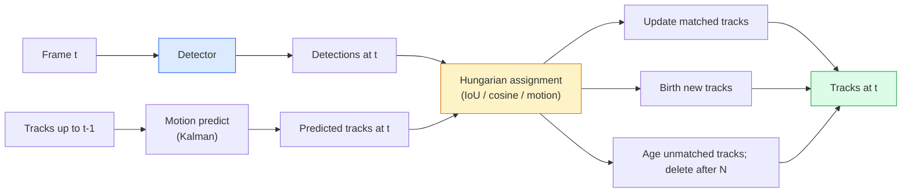

# Multi-Object Tracking e Memória de Vídeo

> O rastreamento é a detecção加 associação──检测每一── de acordo com a ID, as detecções atuais 匹配到上一的痕迹──

**Type:** Build
**Languages:** Python
**Prerequisites:** Phase 4 Lesson 06 (YOLO Detection), Phase 4 Lesson 08 (Mask R-CNN), Phase 4 Lesson 24 (SAM 3)
**Time:** ~60 分钟

## Objectivo de aprendizagem

- 区分 tracking-by-detection 与 query-based tracking,并说出算法家族名称(SORT, DeepSORT, ByteTrack, BoT-SORT, SAM 2 memória rastreador, SAM 3.1 Object Multiplex)
- Desde zero realçar IOU + atribuição húngara, para classico rastreamento por detecção
- Explicar o banco de memória do SAM 2, e por que é mais capaz de processar a oclusão do que a associação baseada em IoU
- 读懂三种追踪 métricas(MOTA, IDF1, HOTA),并为给定用例 选择最重要的一项

## 问题

O detector vai dizer-te onde estão os objetos. O rastreador vai dizer-te o quadro.`t`O que é que se passa com o quadro?`t-1`A detecção no meio é o mesmo objeto. Sem isso, não consegues calcular o número de vezes que os objetos atravessam uma linha. Não consegues seguir uma bola durante a oclusão.

O rastreamento de cada produto em cada face de vídeo são essenciais: análise esportiva, vigilância, condução autônoma, análise de vídeo médico, monitoramento de vida selvagem, contagem de palavras.

O ano 2026 traz dois novos modelos:**SAM 2 memory-based tracking**(Uz memória de características 替代 motion-model association)**SAM 3.1 Object Multiplex**(Para várias instâncias do mesmo conceito, a memória é compartilhada)

## 核心概念

### Seguimento por detecção



Cada rastreador que encontrar em 2026 é uma variação deste ciclo.

- **SORT**(2016): Kalman filter + IoU Hungarian。简单、快速,没有外观模型。
- **DeepSORT**(2017): SORT + Cada traço Uma característica de aparência baseada na CNN (ReID Embedding)
- **ByteTrack**(2021): 将低信度检测 作为第二阶段进行协会; não requer características de aparência, mas em MOT17 上表现领先──
- **BoT-SORT**(2022): Byte + compensação de movimento da câmera + ReID。
- **StrongSORT / OC-SORT** O método de retorno do ByteTrack, com melhor movimento e aparência.

### 一段话 compreender Filtro de Kalman

Filtro Kalman para cada pista  Mantenha um estado de covariância `(x, y, w, h, dx, dy, dw, dh)`Em cada um, ele usa um modelo de velocidade constante.**predict**- E depois, com a detecção de correspondência.**update** Quando a incerteza de previsão                                                                                                                                                                                                                                                                                                   

Cada rastreador clássico está em fase de previsão de movimento usando o filtro Kalman.

### Algoritmo húngaro

- Não .`M x N`Matriz de custos ((tracks x detections), busca fazer o total custo, a menor das tarefas.`1 - IoU(track_bbox, detection_bbox)`, ou características de aparência de semelhança cosínica negativa. O tempo de execução é O(((M+N) ^3); quando M、N máxima é de aproximadamente 1000 时, através `scipy.optimize.linear_sum_assignment`É muito rápido.

### ByteTrack's principais ideias

標準トラッカー 会丢弃低置信度 detections(< 0.5) ・・・ByteTrack 会保留它们作为 **second-stage candidates**Primeiro, as pistas serão combinadas com as detecções de alta confiança, depois, deixe as pistas não correspondentes ser combinadas com um limiar de IoU um pouco mais flexível.

### SAM 2 rastreamento baseado em memória

SAM 2                                                                                                                                                                                                                                                                                                                                                                                                                                                                                                                            **memory bank**Para processar o vídeo. Em seguida, ele irá codificar a instância na memória. Em seguida, a memória irá fazer uma reunião com novos recursos.

没有 Kalman filter,也没有匈牙利任务──Associação 隐含在记忆-注意中──

优点:
- Para grandes oclusões 鲁棒(memória 会跨多携带实例身份)
- Com SAM 3 de texto de solicitações 结合时支持开放词库──
- Não é necessário um modelo de movimento único.

缺点:
- Para rastrear muitos objetos, é mais lento do que o ByteTrack.
- Banco de memória 会增长; janela de contexto 受限──

### SAM 3.1 Objeto Multiplex

O SAM 2 / SAM 3 de rastreamento irá manter um banco de memória independente para cada instância. 50 objetos são 50 bancos de memória.**per-instance query tokens**de memória compartilhada.Costo: crescimento de números em sequência.

Multiplex é um novo conceito para o seguimento da multidão em 2026: multidões de concertos, trabalhadores de armazéns, interseções de trânsito.

### 需要掌握的三种计量

- **MOTA (Multi-Object Tracking Accuracy)** 1 - (FN + FP + ID switches) / GT。 segundo o tipo de erro 加权; é uma única métrica 混合在一起的将检测和关联失误──
- **IDF1 (ID F1)** Precision ID e mean harmonica de recall.  Focus Measure Each Ground-Truth Track 在时间保持其 ID 的程度.
- **HOTA (Higher Order Tracking Accuracy)** 分解为检测精度 (DetA) 与关联精度 (AssA) ⋅ desde 2020 年以来的社区标准;最全面──

对于监视(who is who):报告 IDF1──对体育分析(counting passes):HOTA──对一般学术比较:HOTA──


```figure
cv3-track-assoc
```

## Construí-lo

### 步骤 1: baseada em matriz de custos de IOU

```python
import numpy as np


def bbox_iou(a, b):
    """
    a, b: [x1, y1, x2, y2] 的 (N, 4) arrays。
    返回 (N_a, N_b) IoU matrix。
    """
    ax1, ay1, ax2, ay2 = a[:, 0], a[:, 1], a[:, 2], a[:, 3]
    bx1, by1, bx2, by2 = b[:, 0], b[:, 1], b[:, 2], b[:, 3]
    inter_x1 = np.maximum(ax1[:, None], bx1[None, :])
    inter_y1 = np.maximum(ay1[:, None], by1[None, :])
    inter_x2 = np.minimum(ax2[:, None], bx2[None, :])
    inter_y2 = np.minimum(ay2[:, None], by2[None, :])
    inter = np.clip(inter_x2 - inter_x1, 0, None) * np.clip(inter_y2 - inter_y1, 0, None)
    area_a = (ax2 - ax1) * (ay2 - ay1)
    area_b = (bx2 - bx1) * (by2 - by1)
    union = area_a[:, None] + area_b[None, :] - inter
    return inter / np.clip(union, 1e-8, None)
```

### 步骤 2: 最小 SORT 风格 tracker

Para simplificar, Kalman prevê que a velocidade constante é necessária.`sort`Pacote Python 提供完整版本──

```python
from scipy.optimize import linear_sum_assignment


class Track:
    def __init__(self, tid, bbox, frame):
        self.id = tid
        self.bbox = bbox
        self.last_frame = frame
        self.hits = 1

    def update(self, bbox, frame):
        self.bbox = bbox
        self.last_frame = frame
        self.hits += 1


class SimpleTracker:
    def __init__(self, iou_threshold=0.3, max_age=5):
        self.tracks = []
        self.next_id = 1
        self.iou_threshold = iou_threshold
        self.max_age = max_age

    def step(self, detections, frame):
        if not self.tracks:
            for d in detections:
                self.tracks.append(Track(self.next_id, d, frame))
                self.next_id += 1
            return [(t.id, t.bbox) for t in self.tracks]

        track_boxes = np.array([t.bbox for t in self.tracks])
        det_boxes = np.array(detections) if len(detections) else np.empty((0, 4))

        iou = bbox_iou(track_boxes, det_boxes) if len(det_boxes) else np.zeros((len(track_boxes), 0))
        cost = 1 - iou
        cost[iou < self.iou_threshold] = 1e6

        matched_track = set()
        matched_det = set()
        if cost.size > 0:
            row, col = linear_sum_assignment(cost)
            for r, c in zip(row, col):
                if cost[r, c] < 1.0:
                    self.tracks[r].update(det_boxes[c], frame)
                    matched_track.add(r); matched_det.add(c)

        for i, d in enumerate(det_boxes):
            if i not in matched_det:
                self.tracks.append(Track(self.next_id, d, frame))
                self.next_id += 1

        self.tracks = [t for t in self.tracks if frame - t.last_frame <= self.max_age]
        return [(t.id, t.bbox) for t in self.tracks]
```

60 行── Receber detecções por quadro, retornar IDs de pista por quadro──真实系统也会加入卡尔曼预测、ByteTrack segundo estágio re-match, bem como características de aparência──

### 步骤 3: Teste de trajetória sintética

```python
def synthetic_frames(num_frames=20, num_objects=3, H=240, W=320, seed=0):
    rng = np.random.default_rng(seed)
    starts = rng.uniform(20, 200, size=(num_objects, 2))
    velocities = rng.uniform(-5, 5, size=(num_objects, 2))
    frames = []
    for f in range(num_frames):
        dets = []
        for i in range(num_objects):
            cx, cy = starts[i] + f * velocities[i]
            dets.append([cx - 10, cy - 10, cx + 10, cy + 10])
        frames.append(dets)
    return frames


tracker = SimpleTracker()
for f, dets in enumerate(synthetic_frames()):
    tracks = tracker.step(dets, f)
```

Três objetos em movimento direto devem poder manter sua identidade em todos os 20 .

### 步骤 4: Metrica de interruptor de identificação

```python
def count_id_switches(tracks_per_frame, gt_per_frame):
    """
    tracks_per_frame:  list of list of (track_id, bbox)
    gt_per_frame:      list of list of (gt_id, bbox)
    返回 ID switches 的数量。
    """
    prev_assignment = {}
    switches = 0
    for tracks, gts in zip(tracks_per_frame, gt_per_frame):
        if not tracks or not gts:
            continue
        t_boxes = np.array([b for _, b in tracks])
        g_boxes = np.array([b for _, b in gts])
        iou = bbox_iou(g_boxes, t_boxes)
        for g_idx, (gt_id, _) in enumerate(gts):
            j = iou[g_idx].argmax()
            if iou[g_idx, j] > 0.5:
                t_id = tracks[j][0]
                if gt_id in prev_assignment and prev_assignment[gt_id] != t_id:
                    switches += 1
                prev_assignment[gt_id] = t_id
    return switches
```

Esta é uma métrica simplificada, próxima da IDF1:统计一个地面真相对象更换其分配预测轨道ID的次数――真实的MOTA / IDF1 / HOTA 工具位于`py-motmetrics`和 `TrackEval`- Não.

## Use-o

Traqueadores de classe de produção de 2026:

- `ultralytics` YOLOv8 + 内置 ByteTrack / BOT-SORT。`results = model.track(source, tracker="bytetrack.yaml")`❖默认选择──
- `supervision`(Roboflow)  Envelopes ByteTrack + utilitários de anotação。
- SAM 2 / SAM 3.1  通過 `processor.track()` realizar um rastreamento baseado em memória¬¬¬¬¬¬¬¬¬¬¬¬¬¬¬¬¬¬¬¬¬¬¬¬¬¬¬¬¬¬¬¬¬¬¬¬¬¬¬¬¬¬¬¬¬¬¬¬¬¬¬¬¬¬¬¬¬¬¬¬¬¬¬¬¬¬¬¬¬¬¬¬¬¬¬¬¬¬¬¬¬¬¬¬¬¬¬¬¬¬¬¬¬¬¬¬¬¬¬¬¬¬¬¬¬¬¬¬¬¬¬¬¬¬¬¬¬¬¬¬¬¬¬¬¬¬¬¬¬¬¬¬¬¬¬¬¬¬¬¬¬¬¬¬¬¬¬¬¬¬¬¬¬¬¬¬¬¬¬¬¬¬¬¬¬¬¬¬¬¬¬¬¬¬¬¬¬¬¬¬¬¬¬¬¬¬¬¬¬¬¬¬¬¬¬¬¬¬¬¬¬¬¬¬¬¬¬¬¬¬¬¬¬¬¬¬¬¬¬¬¬¬¬¬¬¬¬¬¬¬¬¬¬¬¬¬¬¬¬¬¬¬¬¬¬¬¬¬¬¬¬¬¬¬¬¬¬¬¬¬¬¬¬¬¬¬¬¬¬¬¬¬¬¬¬¬¬¬¬¬¬¬¬¬¬¬¬¬¬¬¬¬¬¬¬¬¬¬¬¬¬¬¬¬¬¬¬¬¬¬¬¬¬¬¬¬¬¬¬¬¬¬¬¬¬¬¬¬¬¬¬¬¬¬¬¬¬¬¬¬¬¬¬¬¬¬¬¬¬¬¬¬¬¬¬¬¬¬¬¬¬¬¬¬¬¬¬¬¬¬¬¬¬¬¬¬¬¬¬¬¬¬¬¬¬¬¬¬¬¬¬¬¬¬¬¬¬¬¬¬¬¬¬¬¬¬¬¬¬¬¬¬¬¬¬¬¬¬¬¬¬¬¬¬¬¬¬¬¬¬¬¬¬¬¬¬¬¬¬¬¬¬¬¬¬¬¬¬¬¬¬¬¬¬¬¬¬¬¬¬¬¬¬¬¬¬¬¬¬¬¬¬¬¬¬¬¬¬¬¬¬¬¬¬¬¬¬¬¬¬¬¬¬¬¬¬¬¬¬
- Estaca personalizada: detector (YOLOv8 / RT-DETR) + `sort-tracker`- Não .`OC-SORT`- Não .`StrongSORT`- Não.

选择方式:

- 30+ fps Abaixo pedestres / carros / caixas:**ByteTrack with ultralytics**- Não.
- Muitos casos de um tipo ou outro de grupo de pessoas:**SAM 3.1 Object Multiplex**- Não.
- As oclusões pesadas com aparência reconhecível:**DeepSORT / StrongSORT**(Figurações de ReID)
- Esportes / interações complexas:**BoT-SORT**Ou rastreadores aprendidos (MOTRv3)

## Entrega-o

本课会产出:

- `outputs/prompt-tracker-picker.md`  De acordo com o tipo de cena、 padrões de oclusão 和 orçamento de latência 选择 SORT / ByteTrack / BoT-SORT / SAM 2 / SAM 3.1。
- `outputs/skill-mot-evaluator.md` 编写一个完整的评估带,用于针对地面真相轨迹 评估MOTA / IDF1 / HOTA。

## 练习

1. **(Easy)**Use o rastreador sintético acima, separando-se de 3、10 e 30 objetos.
2. **(Medium)**Em associação 之前加入常速 Kalman预测步──展示短暂(2-3 )
3. **(Hard)**集成 SAM 2                                                                                                                                                                                                                                                                                                                                                                                                                                                                                                                         `transformers`) como backend de rastreador alternativo.

## 关键术语

| Term | 常见说法 | 实际含义 |
|------|----------------|----------------------|
| Tracking-by-detection | “先 detect 再 associate” | Per-frame detector + 基于 IoU / appearance 的 Hungarian assignment |
| Kalman filter | “Motion predict” | Linear dynamics + covariance，用于平滑 track predictions 和处理 occlusion |
| Hungarian algorithm | “Optimal assignment” | 求解 minimum-cost bipartite matching 问题；`scipy.optimize.linear_sum_assignment` |
| ByteTrack | “低置信度 second pass” | 将未匹配 tracks 重新匹配到低置信度 detections，以恢复短暂 occlusions |
| DeepSORT | “SORT + appearance” | 添加 ReID feature 用于跨帧匹配；更利于保持 ID |
| Memory bank | “SAM 2 trick” | 跨帧存储的 per-instance spatio-temporal features；cross-attention 替代显式 association |
| Object Multiplex | “SAM 3.1 shared memory” | 使用带 per-instance queries 的单一 shared memory，实现快速 many-object tracking |
| HOTA | “现代 tracking metric” | 分解为 detection 和 association accuracy；社区标准 |

## 延伸阅读

- [SORT (Bewley et al., 2016)](https://arxiv.org/abs/1602.00763) 最小 rastreamento por detecção 论文
- [DeepSORT (Wojke et al., 2017)](https://arxiv.org/abs/1703.07402) 添加 recurso de aparência
- [ByteTrack (Zhang et al., 2022)](https://arxiv.org/abs/2110.06864) 低置信度 segundo pass
- [BoT-SORT (Aharon et al., 2022)](https://arxiv.org/abs/2206.14651) Compensamento de movimento da câmera
- [HOTA (Luiten et al., 2020)](https://arxiv.org/abs/2009.07736) 分解式 métrica de rastreamento
- [SAM 2 video segmentation (Meta, 2024)](https://ai.meta.com/sam2/) Tracker baseado em memória
- [SAM 3.1 Object Multiplex (Meta, March 2026)](https://ai.meta.com/blog/segment-anything-model-3/)
