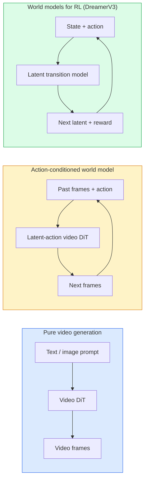

# Modelos mundiais e difusão de vídeos

> Um modelo de vídeo capaz de prever cenários futuros em alguns segundos é um simulador de mundo.

**Type:** Learn + Build
**Languages:** Python
**Prerequisites:** Phase 4 Lesson 10 (Diffusion), Phase 4 Lesson 12 (Video Understanding), Phase 4 Lesson 23 (DiT + Rectified Flow)
**Time:** ~75 分钟

## Objectivo de aprendizagem
- 解释纯视频生成模型(Sora 2) e o modelo do mundo com condição de ação(Genie 3, DreamerV3)
-  descrição de vídeo DiT: patches espaciotemporais  3D codificação de posição                    `(T, H, W)`Tokens de atenção conjunta
- 追踪 World Model 如何接入机器人:VLM 规划 → vídeo modelo 模拟 → dinâmica inversa 输出动作
- 针对给定用例 ((creativo vídeo、interativo sim、autônomo-condução síntese) 在 Sora 2、Genie 3、Runway GWM-1 Worlds、Wan-Video 和 HunyuanVideo 之间做选择

## 问题
视频生成和 World Model 在 2026年走向融合──一个能够生成连连贯一分钟视频的模型, já aprendi, de certo modo, como o mundo se move:persistência do objeto, gravidade, causalidade, estilo── se você colocar essa previsão condicionada em movimento, o modelo de vídeo se tornará um simulador aprendizagem, pode substituir o motor de jogo, o simulador de condução ou o ambiente robótico──

O seu impacto é muito específico. Genie 3 pode ser gerado a partir de imagens simples gerando ambiente jogável. Runway GWM-1 Worlds  Sintetizado infinito explorável.

Este curso é uma fase 4 de um curso de "Grande Imagens" que envolve a geração de imagens, a compreensão de vídeos e o raciocínio agencial, ligado ao padrão de arquitetura que está a ser estudado na maior parte das vezes.

## 概念
### O modelo mundial de três tipos de sistemas



- **Sora 2**Não há nenhuma interfaz de movimentação. Não podes controlar o vídeo no meio do lançamento.
- **Genie 3**- Não.**GWM-1 Worlds**- Não.**Mirage / Magica**são modelos mundiais condicionados a ação. Eles deduzem ações latentes no vídeo de observação, depois colocam o futuro em condições de ação.
- **DreamerV3**和经典 RL World Model 家族 realizar pré-aceptação no espaço latente,并带有显式行动条件, baseado em sinal de recompensa 训练――视觉性较弱; mas para RL sample-efficient 更有用――

### Arquitetura de vídeo

```
Video latent:          (C, T, H, W)
Patchify (spatial):    grid of P_h x P_w patches per frame
Patchify (temporal):   group P_t frames into a temporal patch
Resulting tokens:      (T / P_t) * (H / P_h) * (W / P_w) tokens
```

A codificação posicional é 3D: para cada um`(t, h, w)`坐标使用 rotary 或 learning embedding──Attenção pode ser:

- **Full joint** Todos os tokens assistem até todos os tokens。 para N 个 tokens é O(N^2)。 para长视频来说代价过高──
- **Divided** 交替执行 temporal attention mesma posição espacial 跨时间:`(H*W) * T^2`) e atenção espacial:`T * (H*W)^2`O TimeSformer e a maioria dos DiTs de vídeo usam este método.
- **Window** Em `(t, h, w)`中使用局部 windows──Video Swin

Cada 2026 de vídeo difusão  modelo  todos usará esta três modalidades, mais adicionando AdaLN condicionamento (Lessão 23) e fluxo rectificado.

### 基于动作的 Condicionamento:modelos de acção latentes

Genie 通过判别式地预测一对连续之间的动作,为每一学习一个 **latent action** Então o decodificador do modelo                                                                                                                                                                                                                                                                                                                                                                                                                                                                                                                    

Sora  completamente saltou o movimento de interface. Seu decodificador de tokens do espaço-tempo passado  pré-determinar o próximo tokens do espaço-tempo.

### Plausível física

A Sora 2 foi lançada em 2026 .**physical plausibility**O modelo teve melhorias evidentes em cenários como: peso, equilíbrio, permanência de objetos, causa e efeito, avaliação artificial, comparação com a Sora 1.

A plausibilidade continua a ser um dos principais problemas. Os vídeos de 2024-2025 expõem a falta de uma representação de objetos duradouros.

### Modelos mundiais autônomos

Modelos de condução de mundo serão gerados com base em trajetórias, caixas de ligação ou mapas de navegação, em condições de real estrada.

- **Cosmos-Drive-Dreams**(NVIDIA)  Para treinamento RL 生成数分钟驾驶视频。
- **Gaia-2**(Wayve)  Usado para a síntese de cenários condicionados por trajetória da avaliação de políticas。
- **DrivingWorld**(Tesla)  模拟多样气, hora do dia 和交通条件──
- **Vista**(ByteDance)  响应式驾驶场景合成──

Eles substituíram a coleta de dados do mundo real, para cobrir casos de canto, como o tipo de veículo raro, ou seja, milhões de quilômetros de carro para ser recolhido.

### 机器人技术:VLM + modelo de vídeo + dinâmica inversa

Está a aparecer três componentes do ciclo robótico:

1. **VLM**解析目标(拿起红色杯子), planejar uma sequência de ação de alto nível。
2. **Video generation model**模拟执行每个动作会是什么样子,预测未来 N  observações。
3. **Inverse dynamics model**提取会产生 estas observações de comandos motores específicos.

Este substituiu a formação de recompensas e a RL pesada em amostras. O Modelo Mundial é responsável pela imaginação; dinâmica inversa em execução em um nível fechado.

### Avaliação

- **Visual quality** FVD (Fréchet Video Distance) 、 usuário estudo。
- **Prompt alignment** Cada avaliação de CLIPScore  VQA-style──
- **Physical plausibility** Na suíte de benchmark 上人工评分(Sora 2 内部 benchmark、VBench)
- **Controllability**(para modelos interativos do mundo)  ação → consistência de observação; você pode voltar ao estado anterior?

### Modelo edição de 2026 ano

| Model | Use | Parameters | Output | License |
|-------|-----|------------|--------|---------|
| Sora 2 | text-to-video, audio | — | 1-min 1080p + audio | API only |
| Runway Gen-5 | text/image-to-video | — | 10s clips | API |
| Runway GWM-1 Worlds | interactive world | — | infinite 3D rollout | API |
| Genie 3 | interactive world from image | 11B+ | playable frames | research preview |
| Wan-Video 2.1 | open text-to-video | 14B | high-quality clips | non-commercial |
| HunyuanVideo | open text-to-video | 13B | 10s clips | permissive |
| Cosmos / Cosmos-Drive | autonomous driving sim | 7-14B | driving scenes | NVIDIA open |
| Magica / Mirage 2 | AI-native game engine | — | modifiable worlds | product |


```figure
v4-world-rollout
```

## Construí-lo
### 步骤 1: video de 3D patchify

```python
import torch
import torch.nn as nn


class VideoPatch3D(nn.Module):
    def __init__(self, in_channels=4, dim=64, patch_t=2, patch_h=2, patch_w=2):
        super().__init__()
        self.proj = nn.Conv3d(
            in_channels, dim,
            kernel_size=(patch_t, patch_h, patch_w),
            stride=(patch_t, patch_h, patch_w),
        )
        self.patch_t = patch_t
        self.patch_h = patch_h
        self.patch_w = patch_w

    def forward(self, x):
        # x: (N, C, T, H, W)
        x = self.proj(x)
        n, c, t, h, w = x.shape
        tokens = x.reshape(n, c, t * h * w).transpose(1, 2)
        return tokens, (t, h, w)
```

Um passo é o 3D conv do kernel, que será um patchador espaço-temporal.`(T, H, W) -> (T/2, H/2, W/2)`Os tokens são:

### 步骤 2: codificação de posição rotativa 3D

Embutidos de posição rotativa (RoPE) 分別沿 `t`- Não.`h`- Não.`w`轴应用:

```python
def rope_3d(tokens, t_dim, h_dim, w_dim, grid):
    """
    tokens: (N, T*H*W, D)
    grid: (T, H, W) sizes
    t_dim + h_dim + w_dim == D
    """
    T, H, W = grid
    n, seq, d = tokens.shape
    if t_dim + h_dim + w_dim != d:
        raise ValueError(f"t_dim+h_dim+w_dim ({t_dim}+{h_dim}+{w_dim}) must equal D={d}")
    assert seq == T * H * W
    t_idx = torch.arange(T, device=tokens.device).repeat_interleave(H * W)
    h_idx = torch.arange(H, device=tokens.device).repeat_interleave(W).repeat(T)
    w_idx = torch.arange(W, device=tokens.device).repeat(T * H)
    # Simplified: just scale channels by frequencies. Real RoPE rotates pairs.
    freqs_t = torch.exp(-torch.log(torch.tensor(10000.0)) * torch.arange(t_dim // 2, device=tokens.device) / (t_dim // 2))
    freqs_h = torch.exp(-torch.log(torch.tensor(10000.0)) * torch.arange(h_dim // 2, device=tokens.device) / (h_dim // 2))
    freqs_w = torch.exp(-torch.log(torch.tensor(10000.0)) * torch.arange(w_dim // 2, device=tokens.device) / (w_dim // 2))
    emb_t = torch.cat([torch.sin(t_idx[:, None] * freqs_t), torch.cos(t_idx[:, None] * freqs_t)], dim=-1)
    emb_h = torch.cat([torch.sin(h_idx[:, None] * freqs_h), torch.cos(h_idx[:, None] * freqs_h)], dim=-1)
    emb_w = torch.cat([torch.sin(w_idx[:, None] * freqs_w), torch.cos(w_idx[:, None] * freqs_w)], dim=-1)
    return tokens + torch.cat([emb_t, emb_h, emb_w], dim=-1)
```

É uma forma aditiva simplificada. A verdadeira RoPE irá girar em frequência em canais; a informação de localização é a mesma.

### 步骤 3: Bloco de atenção dividido

```python
class DividedAttentionBlock(nn.Module):
    def __init__(self, dim=64, heads=2):
        super().__init__()
        self.time_attn = nn.MultiheadAttention(dim, heads, batch_first=True)
        self.space_attn = nn.MultiheadAttention(dim, heads, batch_first=True)
        self.ln1 = nn.LayerNorm(dim)
        self.ln2 = nn.LayerNorm(dim)
        self.ln3 = nn.LayerNorm(dim)
        self.mlp = nn.Sequential(nn.Linear(dim, 4 * dim), nn.GELU(), nn.Linear(4 * dim, dim))

    def forward(self, x, grid):
        T, H, W = grid
        n, seq, d = x.shape
        # time attention: same (h, w), across t
        xt = x.view(n, T, H * W, d).permute(0, 2, 1, 3).reshape(n * H * W, T, d)
        a, _ = self.time_attn(self.ln1(xt), self.ln1(xt), self.ln1(xt), need_weights=False)
        xt = (xt + a).reshape(n, H * W, T, d).permute(0, 2, 1, 3).reshape(n, seq, d)
        # space attention: same t, across (h, w)
        xs = xt.view(n, T, H * W, d).reshape(n * T, H * W, d)
        a, _ = self.space_attn(self.ln2(xs), self.ln2(xs), self.ln2(xs), need_weights=False)
        xs = (xs + a).reshape(n, T, H * W, d).reshape(n, seq, d)
        xs = xs + self.mlp(self.ln3(xs))
        return xs
```

Atenção ao tempo em cada posição espacial dentro do tempo; atenção ao espaço em cada posição transversal dentro do tempo.

### 步骤 4: 组合一个小视频 DiT

```python
class TinyVideoDiT(nn.Module):
    def __init__(self, in_channels=4, dim=64, depth=2, heads=2):
        super().__init__()
        self.patch = VideoPatch3D(in_channels=in_channels, dim=dim, patch_t=2, patch_h=2, patch_w=2)
        self.blocks = nn.ModuleList([DividedAttentionBlock(dim, heads) for _ in range(depth)])
        self.out = nn.Linear(dim, in_channels * 2 * 2 * 2)

    def forward(self, x):
        tokens, grid = self.patch(x)
        for blk in self.blocks:
            tokens = blk(tokens, grid)
        return self.out(tokens), grid
```

Não é um gerador de vídeo funcional; é uma demonstração de estrutura, provando que cada forma da parte é correta.

### 步骤 5: 检查 formas

```python
vid = torch.randn(1, 4, 8, 16, 16)  # (N, C, T, H, W)
model = TinyVideoDiT()
out, grid = model(vid)
print(f"input  {tuple(vid.shape)}")
print(f"tokens grid {grid}")
print(f"output {tuple(out.shape)}")
```

correção 后预期 `grid = (4, 8, 8)`且 `out = (1, 256, 32)`;head 后投投投到每个代币对应的空间-时间补丁,准备不补丁 回视频──

## Use-o
Modelo de produção de 2026:

- **Sora 2 API**(OpenAI)  texto-a-vídeo、同步音频──Preços premium──
- **Runway Gen-5 / GWM-1**(Runway)  imagem-a-vídeo mundo interativo 
- **Wan-Video 2.1 / HunyuanVideo**  开源自托管──
- **Cosmos / Cosmos-Drive**Simulação de condução de pesos abertos
- **Genie 3** pré-visualização da investigação, necessita de solicitar visita

Construir uma demonstração interativa de modelo de mundo: desde Wan-Video  começar a obter qualidade, re-superponha um adaptador de ação latente para realizar interação  Para a simulação de condução autônoma: Cosmos-Drive é uma referência aberta de 2026 

现实中的 robótica stack:

1. Objetivo de língua -> VLM (Qwen3-VL) -> plano de alto nível。
2. Plano -> Modelo de vídeo de ação latente -> implantação imaginária。
3. Rollout -> modelo de dinâmica inversa -> ações de baixo nível。
4. 执行 Actions -> observação reintegrada na etapa 1。

## Entrega-o
本课产出:

- `outputs/prompt-video-model-picker.md`                                                                                                                                                                                                                                                              
- `outputs/skill-physical-plausibility-checks.md` Uma definição de auto-exame de habilidade de permanência de objeto, gravidade, continuidade, usada em qualquer vídeo gerado antes de entrega.

## 练习
1. **(Easy)**計算一个 5 秒 360p 视频在补丁-t=2、补丁-h=8、补丁-w=8 时的代币数――推理这个规模下关注的内存需求――
2. **(Medium)**Colocar o bloqueio de atenção dividido acima  substituir o bloqueio de atenção conjunta completo,并测量形和参数数.
3. **(Hard)**构建一个最小潜动视频模型:使用 `(frame_t, action_t, frame_{t+1})`três números de dados ((( qualquer simples jogo 2D), treinar um baseado em embaixamentos de ação  condicionalizado pequeno vídeo DiT,并展示不同动作会产生不同的下一──

## 关键术语
| Term | What people say | What it actually means |
|------|----------------|----------------------|
| World model | “Learned simulator” | 一个在给定 state 和 action 时预测未来 observations 的模型 |
| Video DiT | “Spacetime transformer” | 使用 3D patchification 和 divided attention 的 Diffusion transformer |
| Latent action | “Inferred control” | 从帧对中推断出的离散或连续 action latent；用于条件化 next-frame generation |
| Divided attention | “Time then space” | 每个 block 中的两个 attention 操作：先跨时间，再跨空间，用来让 O(N^2) 保持可控 |
| Object permanence | “Things stay real” | video models 必须学会的场景属性；在食物、玻璃器皿上的经典失败模式 |
| FVD | “Fréchet Video Distance” | FID 的视频等价物；主要 visual quality metric |
| Inverse dynamics model | “Observations to actions” | 给定 `(state, next state)`，输出连接二者的 action；闭合 robotics loop |
| Cosmos-Drive | “NVIDIA driving sim” | 用于 RL 和 evaluation 的 open-weights autonomous-driving world model |

## 延伸阅读
- [Sora technical report (OpenAI)](https://openai.com/index/video-generation-models-as-world-simulators/)
- [Genie: Generative Interactive Environments (Bruce et al., 2024)](https://arxiv.org/abs/2402.15391) Modelos latentes de mundo de ação
- [TimeSformer (Bertasius et al., 2021)](https://arxiv.org/abs/2102.05095) Usando a atenção dividida dos transformadores de vídeo
- [DreamerV3 (Hafner et al., 2023)](https://arxiv.org/abs/2301.04104) Usados para modelos mundiais de RL
- [Cosmos-Drive-Dreams (NVIDIA, 2025)](https://research.nvidia.com/labs/toronto-ai/cosmos-drive-dreams/) Modelo mundial de condução
- [Top 10 Video Generation Models 2026 (DataCamp)](https://www.datacamp.com/blog/top-video-generation-models)
- [From Video Generation to World Model — survey repo](https://github.com/ziqihuangg/Awesome-From-Video-Generation-to-World-Model/)
