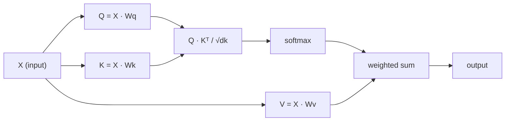

# Desde o zero de auto-atenção

> A atenção é uma carta de consulta, cada palavra tem que perguntar:

**类型：**Construção
**语言：**Python
**先修要求：**Fase 3 (Core de Aprendizagem Profunda), Fase 5 Lição 10 (Sequência a Sequência)
**时间：**- 90 minutos.

## Objectivo de aprendizagem

- 仅使用 NumPy 从零实现 规模点产品自注意,包括查询/key/value 投影和 softmax 加权求和
- Construir várias cabeças de atenção 层, para desmontar cabeças 計算并行注意,并拼接结果
-                                                                                                                                                                                                                                                                                                                                                                                                                                                                                                                              
-  aplicar mascaramento causal,将 atenção bidirecional 转换为 autoregressiva(estilo de decodificador) atenção

## 问题

RNNs uma vez processam um Token. Até que você chegue aos 50 Tokens, a informação do 1o Token já foi comprimida 50 vezes.

O artigo de Bahdanau Attention de 2014 mostra como entender: deixar o decodificador voltar a olhar para cada codificador e decidir quais são as posições importantes para os passos atuais. Mas ainda está inserido no RNN.

Auto-atenção  Deixar cada posição da sequência estar presente em cada outra posição em um único passo em linha.

## 概念

### Classificação de dados

Imagine a atenção como uma consulta de base de dados:

```
Traditional database:
  Query: "capital of France"  -->  exact match  -->  "Paris"

Attention:
  Query: "capital of France"  -->  similarity to ALL keys  -->  weighted blend of ALL values
```

Cada token gerará três vetores:
- **Query (Q)**O que é que eu estou procurando?
- **Key (K)**O que é que eu contém?
- **Value (V)**Se for escolhido, que informação lhe dará?

Uma consulta com todos os pontos de todas as chaves irá gerar pontuações de atenção.

### Q、K、V 計算

Cada token incorporado vai passar por três matrizes de peso que você vai aprender para fazer projeções:

```
Input embeddings (sequence of n tokens, each d-dimensional):

  X = [x1, x2, x3, ..., xn]       shape: (n, d)

Three weight matrices:

  Wq  shape: (d, dk)
  Wk  shape: (d, dk)
  Wv  shape: (d, dv)

Projections:

  Q = X @ Wq    shape: (n, dk)      each token's query
  K = X @ Wk    shape: (n, dk)      each token's key
  V = X @ Wv    shape: (n, dv)      each token's value
```

Desde o ponto de vista, para um Token:

```
             Wq
  x_i ------[*]------> q_i    "What am I looking for?"
       |
       |     Wk
       +----[*]------> k_i    "What do I contain?"
       |
       |     Wv
       +----[*]------> v_i    "What do I offer?"
```

### Matriz de atenção

Uma vez que obtiverem os pontos Q,K,V, atenção, formará uma Matriz:

```
Scores = Q @ K^T    shape: (n, n)

              k1    k2    k3    k4    k5
        +-----+-----+-----+-----+-----+
   q1   | 2.1 | 0.3 | 0.1 | 0.8 | 0.2 |   <- how much q1 attends to each key
        +-----+-----+-----+-----+-----+
   q2   | 0.4 | 1.9 | 0.7 | 0.1 | 0.3 |
        +-----+-----+-----+-----+-----+
   q3   | 0.2 | 0.6 | 2.3 | 0.5 | 0.1 |
        +-----+-----+-----+-----+-----+
   q4   | 0.9 | 0.1 | 0.4 | 1.7 | 0.6 |
        +-----+-----+-----+-----+-----+
   q5   | 0.1 | 0.3 | 0.2 | 0.5 | 2.0 |
        +-----+-----+-----+-----+-----+

Each row: one token's attention over the entire sequence
```

Uma vez olhou uma consulta como passar todas as chaves: cada linha dá a cada token 打分,softmax Colocar as pontuações em pesos, enquanto o vetor de contexto é o valor de adição de peso.

```figure
attention-matrix
```

### Porque é que é que te vais encurtar?

Os produtos dotados vão aumentar de forma constante. Se dk = 64, os produtos dotados podem atingir vários pontos, coloque o softmax na área de desaparecimento do gradiente.

```
Scaled scores = (Q @ K^T) / sqrt(dk)
```

Isso mantém o valor numérico no softmax para produzir Gradientes úteis.

### Softmax vai transformar as pontuações em Peso

Softmax 会将原始分分 转换为每一行概率分布:

```
Raw scores for q1:   [2.1, 0.3, 0.1, 0.8, 0.2]
                            |
                         softmax
                            |
Attention weights:   [0.52, 0.09, 0.07, 0.14, 0.08]   (sums to ~1.0)
```

Agora, cada token tem um grupo de pesos, indicando que deve estar presente em grande parte em cada outro token.

### Valores de aumento e

Cada token é o resultado final de todos os vetores de valor.

```
output_i = sum( attention_weight[i][j] * v_j  for all j )

For token 1:
  output_1 = 0.52 * v1 + 0.09 * v2 + 0.07 * v3 + 0.14 * v4 + 0.08 * v5
```

### 完整流程



Uma linha de fórmula:

```
Attention(Q, K, V) = softmax( Q @ K^T / sqrt(dk) ) @ V
```

```figure
softmax-attention-scaling
```

## Construí-lo

### 步骤 1: implementar Softmax a partir de zero

Softmax 会将原始ログિટ 转换为概率──为了数值稳定性, primeiro reduzir o máximo valor──

```python
import numpy as np

def softmax(x):
    shifted = x - np.max(x, axis=-1, keepdims=True)
    exp_x = np.exp(shifted)
    return exp_x / np.sum(exp_x, axis=-1, keepdims=True)

logits = np.array([2.0, 1.0, 0.1])
print(f"logits:  {logits}")
print(f"softmax: {softmax(logits)}")
print(f"sum:     {softmax(logits).sum():.4f}")
```

### 步骤 2:Atendimento escalado de ponto-produto

核心函数──接收 Q、K、V matrizes,并返回注意输出 和重量矩阵──

```python
def scaled_dot_product_attention(Q, K, V):
    dk = Q.shape[-1]
    scores = Q @ K.T / np.sqrt(dk)
    weights = softmax(scores)
    output = weights @ V
    return output, weights
```

### 步骤 3:带学习投影的 Auto-atenção aula

Um módulo completo de auto-atenção, contendo o uso de matrizes de peso Wq、Wk、Wv de escalagem semelhante a Xavier.

```python
class SelfAttention:
    def __init__(self, d_model, dk, dv, seed=42):
        rng = np.random.default_rng(seed)
        scale = np.sqrt(2.0 / (d_model + dk))
        self.Wq = rng.normal(0, scale, (d_model, dk))
        self.Wk = rng.normal(0, scale, (d_model, dk))
        scale_v = np.sqrt(2.0 / (d_model + dv))
        self.Wv = rng.normal(0, scale_v, (d_model, dv))
        self.dk = dk

    def forward(self, X):
        Q = X @ self.Wq
        K = X @ self.Wk
        V = X @ self.Wv
        output, weights = scaled_dot_product_attention(Q, K, V)
        return output, weights
```

### 步骤 4: em um parágrafo

Para um artigo criar falsos embutidos,并 observar pesos de atenção.

```python
sentence = ["The", "cat", "sat", "on", "the", "mat"]
n_tokens = len(sentence)
d_model = 8
dk = 4
dv = 4

rng = np.random.default_rng(42)
X = rng.normal(0, 1, (n_tokens, d_model))

attn = SelfAttention(d_model, dk, dv, seed=42)
output, weights = attn.forward(X)

print("Attention weights (each row: where that token looks):\n")
print(f"{'':>6}", end="")
for token in sentence:
    print(f"{token:>6}", end="")
print()

for i, token in enumerate(sentence):
    print(f"{token:>6}", end="")
    for j in range(n_tokens):
        w = weights[i][j]
        print(f"{w:6.3f}", end="")
    print()
```

### 步骤 5: usar mapa de calor ASCII 可视化 Atenção

A atenção é pesada em um mapa, rápido obtendo resultados de vídeo.

```python
def ascii_heatmap(weights, tokens, chars=" ░▒▓█"):
    n = len(tokens)
    print(f"\n{'':>6}", end="")
    for t in tokens:
        print(f"{t:>6}", end="")
    print()

    for i in range(n):
        print(f"{tokens[i]:>6}", end="")
        for j in range(n):
            level = int(weights[i][j] * (len(chars) - 1) / weights.max())
            level = min(level, len(chars) - 1)
            print(f"{'  ' + chars[level] + '   '}", end="")
        print()

ascii_heatmap(weights, sentence)
```

## Use-o

PyTorch `nn.MultiheadAttention` doing just is what we are just building, além disso, também inclui divisão multi-head e projeção de saída:

```python
import torch
import torch.nn as nn

d_model = 8
n_heads = 2
seq_len = 6

mha = nn.MultiheadAttention(embed_dim=d_model, num_heads=n_heads, batch_first=True)

X_torch = torch.randn(1, seq_len, d_model)

output, attn_weights = mha(X_torch, X_torch, X_torch)

print(f"Input shape:            {X_torch.shape}")
print(f"Output shape:           {output.shape}")
print(f"Attention weight shape: {attn_weights.shape}")
print(f"\nAttn weights (averaged over heads):")
print(attn_weights[0].detach().numpy().round(3))
```

关键区别:multi-head attention 会并行运行多个注意功能, cada um tem suas próprias projeções Q、K、V,大小为 dk = d_model / n_heads,然后拼接结果──这让模型能够同时参加到不同类型的关系──

## Entrega-o

本课会产出:
- `outputs/prompt-attention-explainer.md`- Uma consulta de base de dados para explicar Atenção de prompt

## 练习

1. 修改 `scaled_dot_product_attention`, deixe-o aceitar uma matriz de máscara seletiva, antes de softmax  irá definir certas posições para ser negativo infinito ((esse é o modo de trabalho do mascaramento causal/decoder)
2. Desde zero para conseguir atenção multi-head:将 Q、K、V 拆分为 `n_heads`个块,在每个块上运行注意,拼接,并通过最终重量矩阵 Wo 投影
3. Tome duas sentenças diferentes de igual comprimento, introduza-as na mesma instância de autoatentação, e compare seus padrões de atenção.

## 关键术语

| Term | 人们常说 | 实际含义 |
|------|----------------|----------------------|
| Query (Q) | “问题 Vector” | 输入的一个学习投影，表示这个 Token 正在寻找什么信息 |
| Key (K) | “标签 Vector” | 一个学习投影，表示这个 Token 包含什么信息，并会与 queries 进行匹配 |
| Value (V) | “内容 Vector” | 一个学习投影，携带会基于 attention scores 被聚合的实际信息 |
| Scaled dot-product attention | “Attention 公式” | softmax(QK^T / sqrt(dk)) @ V - 缩放可以防止高维中的 softmax 饱和 |
| Self-attention | “Token 看自己和其他 Token” | Q、K、V 都来自同一序列的 Attention，让每个位置都能 attend 到其他每个位置 |
| Attention weights | “关注程度” | 位置上的概率分布，由 scaled dot products 上的 softmax 产生 |
| Multi-head attention | “并行 Attention” | 使用不同 projections 运行多个 attention functions，然后拼接结果，以获得更丰富的 representations |

## 延伸阅读

- [Attention Is All You Need (Vaswani et al., 2017)](https://arxiv.org/abs/1706.03762)- Originiador transformador 论文
- [The Illustrated Transformer (Jay Alammar)](https://jalammar.github.io/illustrated-transformer/)- A melhor explicação visual para a estrutura completa
- [The Annotated Transformer (Harvard NLP)](https://nlp.seas.harvard.edu/annotated-transformer/)- 带解释的逐行 PyTorch 实现
