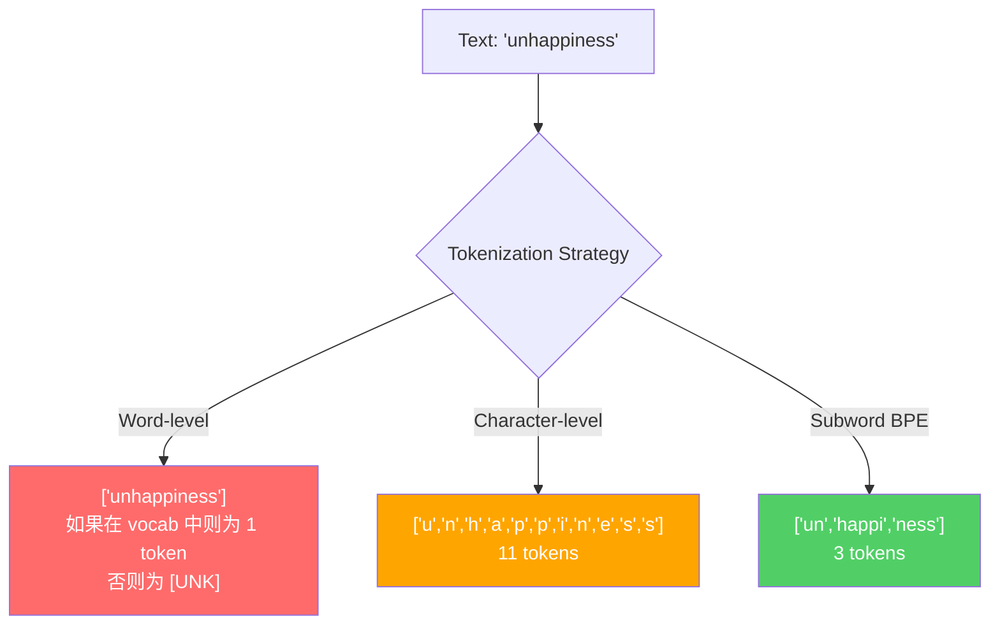
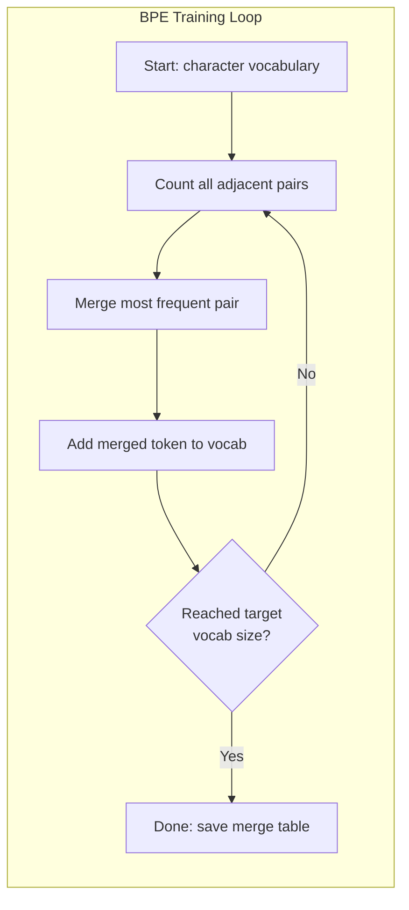
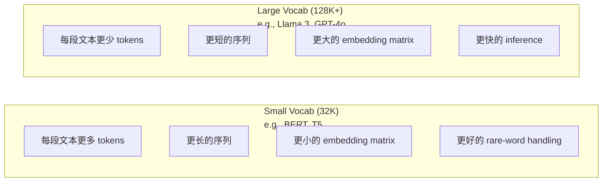

# Tokenizers: BPE, WordPiece, SentencePiece

> Seu LLM não read取英文──它读取整数── Tokenizer decide que estes números inteiros suportam o significado ou o desperdício──

**Type:** Build
**Languages:** Python
**Prerequisites:** Phase 05 (NLP Foundations)
**Time:** ~90 minutes

## Objectivo de aprendizagem
- Desde zero implementação de BPE, WordPiece e algoritmos de tokenização Unigram, e compara as suas estratégias de fusão
- 解释词汇大小会产生长序列, 过大会浪费嵌入参数 如何影响模型效率:过小会产生长序列,过大会浪费嵌入参数
- 分析不同语言和代码中的代码化文物,识别特定代码化者 在哪里失效
- Utilize tiktoken 和 sentencepiece libraries para tokenize texto, e verifique IDs de tokens gerados

## 问题
Seu LLM não se lê em inglês.

A diferença entre "Olá, mundo!" e [15496, 11, 995, 0] é o Tokenizer. Cada palavra, cada espaço, cada símbolo de marcação, tem de ser transformado em inteiro, para que o modelo possa processá-lo. Essa transformação não é de natureza secundária.

Se aqui fizer erro, o modelo vai perder capacidade, usando vários tokens para codificar o seu código. "Infelizmente" vai se transformar em quatro tokens, em vez de um. "Para um texto com muitos vozes, a janela de contexto de 128K é realmente reduzida em 75%".

Você emagrece cada chamada de API em GPT-4 ou Claude, são de acordo com o token 定价――model gerado cada token 城市消耗计算――表示一个输出所需的代币 越少,端到端推断 就越快――tokenization 不是预处理――它是建筑──

## 概念
### 三种失败的方法 (三种失败的方法) (também um método de vencer)

Para converter o texto em números, existem três métodos evidentes.

**Word-level tokenization**O gato sentou-se, ele se transformou, mas a tokenização é como? GPT-4o, ou como "Geschwindigkeitsbegrenzung" é o mesmo?`[UNK]`token -- é o modelo em dizendo 我完全不知道这是什么──只英文就有超过一百万种词形──再加代码,URLs,科学计数法以及另外100种语言,你就需要一个无限大的词汇──

**Character-level tokenization**走向另一个方向──"Hello" 会变成 ["h", "e", "l", "l", "o"]──Vocabulário 很小(几百个字符)──永远不会有未知代号──但序列会变得极长──一个本来是10个字级代号的句子,会变成50个字符级代号──模型必须学会"t","",h",、"e" 放在一起表示"the" -- 把注意力消耗在一个人类三岁就能学会的东西上──

**Subword tokenization**找到了平衡点──常见词保持完整:"the" 是一个代币──罕见词会分解成有意义的片段:"unhappy" 变成 ["un", "happy", "ness"]──vocabulary 保持可控(30K到128K tokens)──序列保持较短──tokens desconhecidos 基本消失,因为 qualquer palavra pode ser constituída por subverbos──构建出来──

Cada MLL moderno usa tokenization de subpalavras. GPT-2、GPT-4、BERT、Llama 3、Claude -- 全都是──.



### BPE: codificação em pares de byte

O BPE é um algoritmo de compressão de cor, mais tarde reutilizado para tokenização.

Desde um único caracter começam. Todos os pares de palavras em cada lado do idioma.

Abaixo está um corpus muito pequeno de BPE em operação, que contém "menor""",menor" e "mais novo":

```
Corpus（带 word frequencies）:
  "lower"  x5
  "lowest" x2
  "newest" x6

Step 0 -- 从字符开始:
  l o w e r       (x5)
  l o w e s t     (x2)
  n e w e s t     (x6)

Step 1 -- 统计相邻 pairs:
  (e,s): 8    (s,t): 8    (l,o): 7    (o,w): 7
  (w,e): 13   (e,r): 5    (n,e): 6    ...

Step 2 -- Merge 最高频 pair (w,e) -> "we":
  l o we r        (x5)
  l o we s t      (x2)
  n e we s t      (x6)

Step 3 -- 重新统计并 merge (e,s) -> "es":
  l o we r        (x5)
  l o we s t      (x2)    <- 'es' 只由 'e'+'s' 形成，不是 'we'+'s'
  n e we s t      (x6)    <- 等等，'we' 前面有 'e'，'we' 后面有 's'

实际精确跟踪如下:
  在 "we" merge 之后，剩余 pairs:
  (l,o): 7   (o,we): 7   (we,r): 5   (we,s): 8
  (s,t): 8   (n,e): 6    (e,we): 6

Step 3 -- Merge (we,s) -> "wes" 或 (s,t) -> "st"（同为 8，选第一个）:
  Merge (we,s) -> "wes":
  l o we r        (x5)
  l o wes t       (x2)
  n e wes t       (x6)

Step 4 -- Merge (wes,t) -> "west":
  l o we r        (x5)
  l o west        (x2)
  n e west        (x6)

...继续，直到达到目标 vocab size。
```

A tabela de fusão é o Tokenizer. É necessário codificar o novo texto, de acordo com a ordem de aplicação das fusões. O corpo de treinamento decide quais fusões existem, e esta seleção irá formar permanentemente o modelo para ver o conteúdo.



### BPE de nível de byte (GPT-2, GPT-3, GPT-4)

BPE padrão em caracteres Unicode 上运行──BPE de nível de byte em bytes originais(0-255) 上运行── Isso lhe dará um vocabulário básico de 256 palavras, capaz de processar qualquer linguagem ou codificação, e nunca produzirá um token desconhecido──

GPT-2 introduziu esse método. O vocabulário básico cobre todos os tipos de byte possíveis.

- GPT-2: 50.257 tokens
- GPT-3.5/GPT-4: ~100,256 tokens (coding cl100k_base)
- GPT-4o: 200 019 tokens (o200k_base encoding)

### O que é o "Piece" (BERT)

O WordPiece parece ser similar ao BPE, mas a forma de selecionar as fusões é diferente. Não é usando a frequência original, mas maximizar a probabilidade de treinamento de dados:

```
BPE merge criterion:      count(A, B)
WordPiece merge criterion: count(AB) / (count(A) * count(B))
```

A BPE  pergunta é: Qual par surgiu mais frequentemente? WordPiece  pergunta é: Qual par surgiu com maior frequência do que a previsão de casos casuais? Esta pequena diferença gerará diferentes vocabulários。 WordPiece  preferem as combinações surpreendentes, não apenas as combinações frequentes。

WordPiece também usa o prefixo "##" para indicar subpalavras de continuação:

```
"unhappiness" -> ["un", "##happi", "##ness"]
"embedding"   -> ["em", "##bed", "##ding"]
```

Prefixo "##"  tell you this piece 延续前一个 Token──BERT Utilize WordPiece, vocabulário é 30,522 tokens── cada variante de BERT -- DistilBERT, RoBERTa's Tokenizer  na verdade é BPE, mas BERT é WordPiece──

### SentençaPiece (Llama, T5)

SentencePiece Coloque o ingresso como um caracteres Unicode original 流, incluindo 符空白. Não há etapa de pré-tokenization. Não há regras específicas de linguagem sobre o limite de palavras. Isso torna-o realmente linguístico-agnóstico. É adequado para o chino文、日文、泰文, bem como outras não usam 空格分隔词的语言.

SentencePiece 支持两种算法:
- **BPE mode**: Comparável com o padrão BPE, lógica de fusão, é aplicada para sequência de caracteres originais
- **Unigram mode**A partir de um vocabulário grande  começando, então 代移除对整体概率 影响最小的 Tokens──它是BPE的反向过程-- 不是合并,而是剪切──

Llama 2 utiliza SentencePiece BPE,vocabulário é de 32.000 tokens。T5 utiliza SentencePiece Unigram,vocabulário é de 32.000 tokens。 Nota: Llama 3 切换到了基于TikToken的字节级BPE Tokenizer,包含 128,256 tokens。

### Comércio de tamanho do vocabulário

É uma decisão de engenharia real e tem consequências mensuráveis.



具体数字──对于一个128K词汇和 4,096维嵌入,仅嵌矩阵就是128,000 x 4,096 = 5,24亿参数──对于32K词汇,则是1.31亿参数──仅仅因为Tokenizer 选择不同,就会产生400M参数的差异──

Mas vocabulários maiores vão ser mais intensivos em comprimir textos. O mesmo segmento em inglês, com 32K vocabulário, pode ser necessário 100 tokens, com 128K vocabulário, pode ser necessário apenas 70 tokens. Isso significa que a geração de passes adiantadas   reduziu 30%  Para o modelo de serviços com milhões de pedidos, isso reduzirá diretamente o custo de computação.

趋势很明确:vocabulary size 正在增长──GPT-2 使用 50,257──GPT-4 使用 ~100K──Llama 3 使用 128K──GPT-4o 使用 200K──

| Model | Vocab Size | Tokenizer Type | Avg Tokens per English Word |
|-------|-----------|----------------|---------------------------|
| BERT | 30,522 | WordPiece | ~1.4 |
| GPT-2 | 50,257 | Byte-level BPE | ~1.3 |
| Llama 2 | 32,000 | SentencePiece BPE | ~1.4 |
| GPT-4 | ~100,256 | Byte-level BPE | ~1.2 |
| Llama 3 | 128,256 | Byte-level BPE (tiktoken) | ~1.1 |
| GPT-4o | 200,019 | Byte-level BPE | ~1.0 |

### O Imposto Multilíngue

Tokenizers baseados principalmente em inglês são muito cruéis para outras línguas. Em GPT-2, cada palavra precisa de 2-3 tokens. Isso significa que apenas metade dos usuários de inglês paga o mesmo preço, mas obtém menor densidade de informação.

É por isso que a Llama 3 irá ampliar o vocabulário de 32K para 128K. A distribuição de Tokens para sistemas de letras não-inglês será mais eficiente.


```figure
tokenizer-bpe
```

```figure
tokenizer-tradeoff
```

## Construí-lo
### 步骤 1: Tokenizer de Nível de Caracteres

Desde o início, o Tokenizer de nível de caracteres irá mapear cada caracteres até seu ponto de código Unicode. Não há necessidade de treinamento.

```python
class CharTokenizer:
    def encode(self, text):
        return [ord(c) for c in text]

    def decode(self, tokens):
        return "".join(chr(t) for t in tokens)
```

"Bem" vai se transformar em [104, 101, 108, 108, 111].

### 步骤 2: Tokenizer BPE do zero

Realização real. Nós estamos em bytes primitivos.

```python
from collections import Counter

class BPETokenizer:
    def __init__(self):
        self.merges = {}
        self.vocab = {}

    def _get_pairs(self, tokens):
        pairs = Counter()
        for i in range(len(tokens) - 1):
            pairs[(tokens[i], tokens[i + 1])] += 1
        return pairs

    def _merge_pair(self, tokens, pair, new_token):
        merged = []
        i = 0
        while i < len(tokens):
            if i < len(tokens) - 1 and tokens[i] == pair[0] and tokens[i + 1] == pair[1]:
                merged.append(new_token)
                i += 2
            else:
                merged.append(tokens[i])
                i += 1
        return merged

    def train(self, text, num_merges):
        tokens = list(text.encode("utf-8"))
        self.vocab = {i: bytes([i]) for i in range(256)}

        for i in range(num_merges):
            pairs = self._get_pairs(tokens)
            if not pairs:
                break
            best_pair = max(pairs, key=pairs.get)
            new_token = 256 + i
            tokens = self._merge_pair(tokens, best_pair, new_token)
            self.merges[best_pair] = new_token
            self.vocab[new_token] = self.vocab[best_pair[0]] + self.vocab[best_pair[1]]

        return self

    def encode(self, text):
        tokens = list(text.encode("utf-8"))
        for pair, new_token in self.merges.items():
            tokens = self._merge_pair(tokens, pair, new_token)
        return tokens

    def decode(self, tokens):
        byte_sequence = b"".join(self.vocab[t] for t in tokens)
        return byte_sequence.decode("utf-8", errors="replace")
```

O ciclo de treinamento é o núcleo do BPE: pares de estatísticas, pares de fusão, dupla, dupla, dupla, dupla, dupla, dupla, dupla, dupla, dupla, dupla, dupla, dupla, dupla, dupla, dupla, dupla, dupla, dupla, dupla, dupla, dupla, dupla, dupla, dupla, dupla, dupla, dupla, dupla, dupla, dupla, dupla, dupla, dupla, dupla, dupla, dupla, dupla, dupla, dupla, dupla, dupla, dupla, dupla, dupla, dupla, dupla, dupla, dupla, dupla, dupla, dupla, dupla, dupla, dupla, dupla, dupla, dupla, dupla, dupla, dupla, dupla, dupla, dupla, dupla, dupla, dupla, dupla, dupla, dupla, dupla, dupla, dupla, dupla, dupla, dupla, dupla, dupla, dupla, dupla, dupla, dupla, dupla, dupla, dupla, dupla, dupla, dupla, dupla, dupla, dupla, dupla, dupla, dupla, dupla, dupla, dupla, dupla, dupla, dupla, dupla, dupla, dupla, dupla, dupla, dupla, dupla, dupla, dupla, dupla, dupla, dupla, dupla, dupla, dupla, dupla, dupla, dupla, dupla, dupla, dupla, dupla, dupla, dupla, dupla, dupla, dupla, dupla, dupla, dupla, dupla, dupla, dupla, dupla, dupla, dupla, dupla, dupla, dupla, dupla, dupla, dupla, dupla, dupla, dupla, dupla, dupla, dupla, dupla, dupla, dupla, dupla.`num_merges`Depois, o vocabulário de 256 bytes base cresceu para 256 + num_merges.

A codificação irá de acordo com o que aprender até que a aplicação se funde. Isto é muito importante. Se a fusão 1  criar "th", a fusão 5  criar "the", então a codificação  deve primeiro aplicar a fusão 1, para que "the" 才能在 merge 5 中由 "th" + "e" 形成──

A descodificação é um processo inverso: em vocabulário, procura cada token ID, liga bytes, e decodifica para UTF-8.

### 步骤 3: Encode e decode Roundtrip

```python
corpus = (
    "The cat sat on the mat. The cat ate the rat. "
    "The dog sat on the log. The dog ate the frog. "
    "Natural language processing is the study of how computers "
    "understand and generate human language. "
    "Tokenization is the first step in any NLP pipeline."
)

tokenizer = BPETokenizer()
tokenizer.train(corpus, num_merges=40)

test_sentences = [
    "The cat sat on the mat.",
    "Natural language processing",
    "tokenization pipeline",
    "unhappiness",
]

for sentence in test_sentences:
    encoded = tokenizer.encode(sentence)
    decoded = tokenizer.decode(encoded)
    raw_bytes = len(sentence.encode("utf-8"))
    ratio = len(encoded) / raw_bytes
    print(f"'{sentence}'")
    print(f"  Tokens: {len(encoded)} (from {raw_bytes} bytes) -- ratio: {ratio:.2f}")
    print(f"  Roundtrip: {'PASS' if decoded == sentence else 'FAIL'}")
```

A taxa de compressão  diz-te Tokenizer tem muito eficaz. Ratio é de 0,50 indicando que o Tokenizer irá comprimir o texto para bytes originais, uma metade da quantidade de Tokens.

### 步骤 4: Compare com tiktoken

```python
import tiktoken

enc = tiktoken.get_encoding("cl100k_base")

texts = [
    "The cat sat on the mat.",
    "unhappiness",
    "Hello, world!",
    "def fibonacci(n): return n if n < 2 else fibonacci(n-1) + fibonacci(n-2)",
    "Geschwindigkeitsbegrenzung",
]

for text in texts:
    our_tokens = tokenizer.encode(text)
    tiktoken_tokens = enc.encode(text)
    tiktoken_pieces = [enc.decode([t]) for t in tiktoken_tokens]
    print(f"'{text}'")
    print(f"  Our BPE:   {len(our_tokens)} tokens")
    print(f"  tiktoken:  {len(tiktoken_tokens)} tokens -> {tiktoken_pieces}")
```

O TikTok usa o mesmo algoritmo, mas é treinado em 100 GB de texto, e contém 100.000 fusões. O algoritmo é o mesmo. A diferença é que o TikTok só treina em um estágio, e só 40 fusões, não pode ser combinado em grande escala com o TikTok.

### 步骤 5: Análise do Vocabulário

```python
def analyze_vocabulary(tokenizer, test_texts):
    total_tokens = 0
    total_chars = 0
    token_usage = Counter()

    for text in test_texts:
        encoded = tokenizer.encode(text)
        total_tokens += len(encoded)
        total_chars += len(text)
        for t in encoded:
            token_usage[t] += 1

    print(f"Vocabulary size: {len(tokenizer.vocab)}")
    print(f"Total tokens across all texts: {total_tokens}")
    print(f"Total characters: {total_chars}")
    print(f"Avg tokens per character: {total_tokens / total_chars:.2f}")

    print(f"\nMost used tokens:")
    for token_id, count in token_usage.most_common(10):
        token_bytes = tokenizer.vocab[token_id]
        display = token_bytes.decode("utf-8", errors="replace")
        print(f"  Token {token_id:4d}: '{display}' (used {count} times)")

    unused = [t for t in tokenizer.vocab if t not in token_usage]
    print(f"\nUnused tokens: {len(unused)} out of {len(tokenizer.vocab)}")
```

Isto irá revelar a distribuição Zipf no seu vocabulário. Poucos Tokens 占占占据主导(空格、"the"、"e") ∼ A maioria dos Tokens 很少被使用── Produtos de nível Tokenizers irá em torno desta distribuição para otimizar -- 常见模式 获得较短的代币ID,罕见模式 使用更长的表示──

## Use-o
O seu BPE pode funcionar. Agora, veja como é que é o seu instrumento de produção.

### Tiktoken (OpenAI)

```python
import tiktoken

enc = tiktoken.get_encoding("cl100k_base")

text = "Tokenizers convert text to integers"
tokens = enc.encode(text)
print(f"Tokens: {tokens}")
print(f"Pieces: {[enc.decode([t]) for t in tokens]}")
print(f"Roundtrip: {enc.decode(tokens)}")
```

Tiktoken usa Rust 编写,并提供Python bindings──它每秒可以编码数百万代币──同样BPE算法,工业级实现──

### Embarcando Tokenizers Face

```python
from tokenizers import Tokenizer
from tokenizers.models import BPE
from tokenizers.trainers import BpeTrainer
from tokenizers.pre_tokenizers import ByteLevel

tokenizer = Tokenizer(BPE())
tokenizer.pre_tokenizer = ByteLevel()

trainer = BpeTrainer(vocab_size=1000, special_tokens=["<pad>", "<eos>", "<unk>"])
tokenizer.train(["corpus.txt"], trainer)

output = tokenizer.encode("The cat sat on the mat.")
print(f"Tokens: {output.tokens}")
print(f"IDs: {output.ids}")
```

Abraçar a biblioteca de tokenizadores de rosto  Base é a mesma que Rust ⋅ Pode ser usado em segundos baseado em corpora GB   treinar BPE ⋅ é o seu modelo de treinamento ⋅

### Carregando o Tokenizer de Llama

```python
from transformers import AutoTokenizer

tokenizer = AutoTokenizer.from_pretrained("meta-llama/Llama-3.1-8B")

text = "Tokenizers are the unsung heroes of LLMs"
tokens = tokenizer.encode(text)
print(f"Token IDs: {tokens}")
print(f"Tokens: {tokenizer.convert_ids_to_tokens(tokens)}")
print(f"Vocab size: {tokenizer.vocab_size}")

multilingual = ["Hello world", "Hola mundo", "Bonjour le monde"]
for text in multilingual:
    ids = tokenizer.encode(text)
    print(f"'{text}' -> {len(ids)} tokens")
```

O vocabulário de 128K do Llama 3 para a compressão de textos não-inglês é claramente superior ao vocabulário de 50K do GPT-2. Você pode verificar isso por si mesmo - usando várias linguagens para codificar com uma frase, então统计 Tokens──

## Entrega-o
本课会产出 `outputs/prompt-tokenizer-analyzer.md`-- Um prompt replicável, para analisar a eficiência de tokenização de qualquer texto e conjunto de modelos.

## 练习
1. Modifique o Tokenizer BPE, deixe-o em cada passo de fusão imprimir o vocabulário. Observe como "t" + "h" se transforma em "th", então "th" + "e" se transforma em "the" e segue o seu vocabulário.

2. 向 BPE Tokenizer 添加 tokens especiais(`<pad>`- Não.`<eos>`- Não.`<unk>`)── dar-lhes distribuir IDs 0、1、2,并相应地移动所有其他 Tokens── realizar um passo de pré-tokenization, em execução BPE 之前按白空切分──

3. 实现 WordPiece merge criterion ()  Use probabilidade ratio ()                                                                                                                                                                                                                                                     

4. Construir um padrão de eficiência de Tokenizer multilingue.  Seleção de 10 sentenças em cada idioma.  Utilize tiktoken (cl100k_base) para tokenizar cada frase.

5. Em maior corpus 上訓練你的BPE Tokenizer(下载一篇 Wikipedia 文章) ・调整 merge 数量,使其在同一文本上的压缩比 达到 tiktoken 的 10% 以内──这将迫使你理解体积、结合数和压缩质量 之间的关系──

## 关键术语
| Term | What people say | What it actually means |
|------|----------------|----------------------|
| Token | “一个词” | 模型 vocabulary 中的一个单元 -- 可以是字符、subword、word，或 multi-word chunk |
| BPE | “某种压缩东西” | Byte Pair Encoding -- 迭代 merge 出现最频繁的相邻 token pair，直到达到目标 vocabulary size |
| WordPiece | “BERT 的 Tokenizer” | 类似 BPE，但 merges 最大化 likelihood ratio count(AB)/(count(A)*count(B))，而不是原始 frequency |
| SentencePiece | “一个 Tokenizer library” | 一种 language-agnostic Tokenizer，在没有 pre-tokenization 的情况下直接处理原始 Unicode，并支持 BPE 和 Unigram algorithms |
| Vocabulary size | “它知道多少词” | 唯一 Tokens 的总数：GPT-2 有 50,257，BERT 有 30,522，Llama 3 有 128,256 |
| Fertility | “不是 Tokenizer 术语” | 每个词的平均 Tokens 数 -- 衡量 Tokenizer 在不同语言上的效率（1.0 是理想值，3.0 表示模型要多工作三倍） |
| Byte-level BPE | “GPT 的 Tokenizer” | 在原始 bytes（0-255）而不是 Unicode characters 上运行的 BPE，保证任何输入都不会产生 unknown tokens |
| Merge table | “Tokenizer 文件” | 训练期间学习到的有序 pair merges 列表 -- 这就是 Tokenizer 本身，而且顺序很重要 |
| Pre-tokenization | “按空格切分” | 在 subword tokenization 之前应用的规则：whitespace splitting、digit separation、punctuation handling |
| Compression ratio | “Tokenizer 有多高效” | 生成的 Tokens 数除以输入 bytes 数 -- 越低表示压缩越好，inference 越快 |

## 延伸阅读
- [Sennrich et al., 2016 -- "Neural Machine Translation of Rare Words with Subword Units"](https://arxiv.org/abs/1508.07909)Este artigo vai introduzir o BPE na PNL, transformando um algoritmo de compressão de 1994 na base da tokenização moderna.
- [Kudo & Richardson, 2018 -- "SentencePiece: A simple and language independent subword tokenizer"](https://arxiv.org/abs/1808.06226)-- Tokenization linguistic-agnostic, fazer modelos multilingues  become practical
- [OpenAI tiktoken repository](https://github.com/openai/tiktoken)-- 用 Rust 编写并带有Python bindings 的生产级 BPE 实现, por GPT-3.5/4/4o 使用
- [Hugging Face Tokenizers documentation](https://huggingface.co/docs/tokenizers)-- 具備 腐性能的生产级 Tokenizer training
