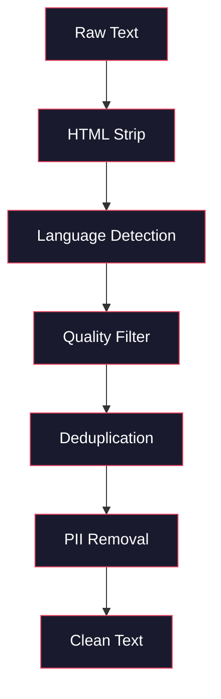
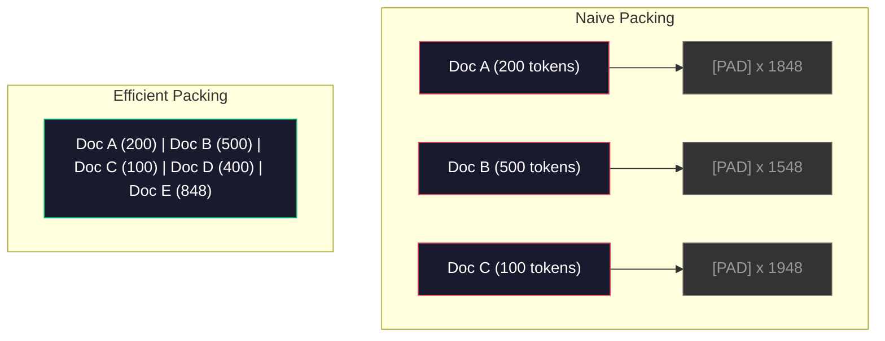

# Os canais de dados pré-treinamento

> O modelo é um espelho. Reflecte qualquer informação que lhe seja dada.

**Type:** Build
**Languages:** Python
**Prerequisites:** Phase 10, Lessons 01-02 (Tokenizers, Building a Tokenizer)
**Time:** ~90 minutes

## Objectivo de aprendizagem

- Construir um pipeline de dados de streaming, em caso de não colocar todos os dados em memória, para realizar Tokenization, cutocks, shuffles e batches de textos de nível TB
- 实现真实预训管道 中使用的数据质量过器(deduplication、lingua detection、content filtering)
- 创建固定长度训练序列,并正确处理注意力面具 和文档边界
- Perfil de tráfego de tubo, garantir o carregador de dados 能跟上 GPU 训练速度

## 问题

Já tens um Tokenizer. Agora precisas de dados.

Não é um conjunto de dados, não é um CSV, mas sim um CD de TB.

A maioria das pessoas achava que o núcleo de um LLM era a estrutura do modelo. Não é. A Llama 3 utilizou 15,6 trilhões de tokens. A GPT-3 utilizou 300 bilhões. A DeepSeek-V2 utilizou 8,1 trilhões. A estrutura de todos estes três é a mesma: um bloco de transformador, que inclui atenção e uma camada anterior.

O artigo Chinchilla do DeepMind explicou isso com precisão. Para um determinado orçamento de cálculo, o número de parâmetros de modelos e o número de tokens de treinamento existe uma proporção ideal. Chinchilla mostra que a maioria dos modelos de 2022 estão gravemente subtraídos: em comparação com a quantidade de dados que eles veem, os seus parâmetros são muito grandes.

O seu fluxo de dados determina se o seu modelo aprende linguagem ou ruído.

## 核心概念

### Os dados vêm de onde?

Cada modelo de linguagem grande é treinado em dados mistos de várias fontes. Para a maioria dos laboratórios, a composição de dados é de extrema sigilha, mas já sabemos o suficiente para compreender essas categorias.

| Source | Size | Quality | Used By |
|--------|------|---------|---------|
| Common Crawl | ~250 TB raw | 低（需要大量过滤） | GPT-3, Llama, most open models |
| Wikipedia | ~20 GB | 高 | Every major LLM |
| GitHub code | ~1 TB+ | 中等（大量重复、废弃代码） | StarCoder, CodeLlama, DeepSeek-Coder |
| Books (BookCorpus, Pile) | ~100 GB | 高 | GPT-2, GPT-3, early models |
| Academic papers (arXiv, S2ORC) | ~100 GB | STEM 领域质量高 | Llama, Galactica |
| StackOverflow, Reddit | ~100 GB | 中等 | Llama, Falcon |
| Curated web (C4, RefinedWeb) | ~5 TB | 中高（已预过滤） | T5, Falcon |

Llama 3 revelou sua proporção de dados mistos: cerca de 50% de dados da web, 25% de código, 13% de livros e artigos acadêmicos, 8% de dados matemáticos, bem como 4% de dados da web multilíngue.

Por exemplo, o volume e o volume são igualmente importantes. Os dados da web são demais, o modelo se torna Reddit. O código é muito pequeno, não pode ser programado.

### Número de dados

Os dados web primitivos 很脏── 个典型的 Common Crawl dump 包含:

- Tags HTML e JavaScript
- 模板化 cabeçalhos, pés, menus de navegação
- 重复页面(完全重复和近似重复)
- 机器生成的垃圾邮件
- Informações de identificação pessoal (PII)
- 低质量文本(关键词列表、SEO spam)
- É texto em forma codificada de conteúdo não-textual

Limpeza não é opcional. Determina se o modelo é gerar segmentos continuos ou emitir tags HTML em uma lista de produtos.



Cada passo vai eliminar um tipo de ruído:

**HTML stripping:**移除所有标记──只保留可见文本内容──像 `trafilatura`Ou `readability`A biblioteca assim extraia o conteúdo do artigo, ao mesmo tempo que abandonava a orientação, a publicidade e a modelagem do conteúdo.

**Language detection:**Utilize fastText's language identification model (FASTTEXT's language identification model) para cada documento ser classificado. Se um documento for classificado em inglês, mas a sua confiabilidade seja inferior a 0,8, é muito provável que não seja em inglês puro.

**Quality filtering:**Aqui começa a tornar-se interessante. RefinedWeb (Falcon 背后的数据集) usa filtro baseado em perplexidade: primeiro, na Wikipédia, treinar um pequeno modelo de linguagem, depois, dar a cada documento um parcela.

**Deduplication:**单个最有影响力的清洗步骤――Common Crawl 包含海量重复页面:法律免责声明、cookie notifications、服务条款──在重复数据上训练会浪费计算,并可能导致模型记忆并逐字吐出特定段落──

**PII removal:**姓名、电子邮件地址、电话号码、社会安全号码── para PII estruturada Utilize testes baseados em regex, para nomes em cima abaixo utiliza modelos NER──

### Utilize MinHash fazer Deduplicação

精确排版 很容易:对每文档做哈希,移除重复项──但真正的问题是近似重复──两份相同新闻文章的复制,周围广告略有不同,就是近似重复──内容 95% similar,但按字节比较不一致──

MinHash + localidade-sensível Hashing (LSH) pode ser altamente eficaz para resolver este problema.


Pensa-se:

1. **Shingling:**将每个文档转换为 n-gram 集合(例如词或字符的5gram) ・・・"a rapida raposa" 使用3word shingles 会变成 {"a rapida raposa", "rapida raposa"}。

2. **MinHash:**Para cada conjunto de barandas de arquivos, calcular k 个 hash 值── cada hash 值 é a função hash diferente  下所有 barandas de menor hash── assim criar uma firma  定小, usada para estimar de forma aproximada a similaridade Jaccard entre qualquer dois arquivos──

3. **LSH:**De acordo com a banda de assinatura da MinHash, divide o arquivo em baldes.

4. **Verify:**Para cada par de candidatos, calcular a semelhança de Jaccard. Se a semelhança exceder o valor, normalmente 0,8, é necessário remover uma dupla.

O grupo Llama relatou que eles, através da deduplicação, removeram cerca de 38% dos dados da web.

### Embalagem de sequência

Seu modelo espera fixar a duração da sequência de entrada. Seu arquivo tem duração variável. Alguns são 50 tokens.

Prática simples: colocar cada pad de arquivo até a maior sequência de comprimento.

Melhor prática: colocar vários documentos em um conjunto de documentos, sem usar o token final de sequência separado.



Mascara de atenção 必須正确设置──同一个包装序列 中,Document A 的 Token 不应出席文件 B 的 Token──这需要一个区块横角的注意口罩──

长文档会在序列边界处被切断或拆分分分点很重要:在句子中拆分会迫使模型看到不完整的思路──有些管道会尽可能把拆分分分到齐到段落或句子边界──

### Lei de Escalada Chinchilla

 Para o orçamento de cálculo fixo C 以 FLOPs 衡量), o modelo mais ideal é o grande N 和 conjunto de dados  大小 D 

```
N_opt ~ C^0.5
D_opt ~ C^0.5
```

Na prática, isso significa que você deve ser aproximadamente igual proporção de expansão modelo grande e conjunto de dados grande.

| Model | Parameters | Training Tokens | Chinchilla-Optimal? |
|-------|-----------|----------------|-------------------|
| GPT-3 | 175B | 300B | 否（undertrained 3-4x） |
| Chinchilla | 70B | 1.4T | 是（按设计） |
| Llama 2 | 70B | 2T | Overtrained（有意为之） |
| Llama 3 | 70B | 15T | 严重 overtrained |

Llama 3 deliberadamente violar a lei de Chinchilla. Meta descobriu que, em mais dados, a sobreformação, a relação computacional-ótima, produzirá um modelo mais adequado à inferência.


```figure
l5-data-pipeline
```

## Construí-lo

### 步骤 1: Limpeza de texto

剥离 HTML、规范化白空间、移除文本内容──我们将使用公用域文本(Project Gutenberg) como um pequeno corpo──

```python
import re

def clean_text(text):
    text = re.sub(r"<[^>]+>", "", text)
    text = re.sub(r"http\S+", "", text)
    text = re.sub(r"[^\x20-\x7E\n]", "", text)
    text = re.sub(r"\n{3,}", "\n\n", text)
    text = re.sub(r" {2,}", " ", text)
    return text.strip()

def quality_filter(text, min_words=50, max_ratio_caps=0.3, max_ratio_special=0.1):
    words = text.split()
    if len(words) < min_words:
        return False
    caps_ratio = sum(1 for w in words if w.isupper()) / len(words)
    if caps_ratio > max_ratio_caps:
        return False
    special_chars = sum(1 for c in text if not c.isalnum() and not c.isspace())
    if special_chars / max(len(text), 1) > max_ratio_special:
        return False
    return True
```

Este filtro de qualidade irá capturar spam SEO ((Todos os CAPS) ✓ máquinas gerando ruído ✓ Alta proporção de caracteres especiais) ✓ e páginas de estúdio ✓ ✓ ✓ ✓ ✓ ✓ ✓ ✓ ✓ ✓ ✓ ✓ ✓ ✓ ✓ ✓ ✓ ✓ ✓ ✓ ✓ ✓ ✓ ✓ ✓ ✓ ✓ ✓ ✓ ✓ ✓ ✓ ✓ ✓ ✓ ✓ ✓ ✓ ✓ ✓ ✓ ✓ ✓ ✓ ✓ ✓ ✓ ✓ ✓ ✓ ✓ ✓ ✓ ✓ ✓ ✓ ✓ ✓ ✓ ✓ ✓ ✓ ✓ ✓ ✓ ✓ ✓ ✓ ✓ ✓ ✓ ✓ ✓ ✓ ✓ ✓ ✓ ✓ ✓ ✓ ✓ ✓ ✓ ✓ ✓ ✓ ✓ ✓ ✓ ✓ ✓ ✓ ✓ ✓ ✓ ✓ ✓ ✓ ✓ ✓ ✓ ✓ ✓ ✓ ✓ ✓ ✓ ✓ ✓ ✓ ✓ ✓ ✓ ✓ ✓ ✓ ✓ ✓ ✓ ✓ ✓ ✓ ✓ ✓ ✓ ✓ ✓ ✓ ✓ ✓ ✓ ✓ ✓ ✓ ✓ ✓ ✓ ✓ ✓ ✓ ✓ ✓ ✓ ✓ ✓ ✓ ✓ ✓ ✓ ✓ ✓ ✓ ✓ ✓ ✓ ✓ ✓ ✓ ✓ ✓ ✓ ✓ ✓ ✓ ✓ ✓ ✓ ✓ ✓ ✓ ✓ ✓ ✓ ✓ ✓ ✓ ✓ ✓ ✓ ✓ ✓ ✓ ✓ ✓ ✓ ✓ ✓ ✓ ✓ ✓ ✓ ✓ ✓ ✓ ✓ ✓ ✓ ✓ ✓ ✓ ✓ ✓ ✓ ✓ ✓ ✓ ✓ ✓ ✓ 

### 步骤 2: MinHash Deduplicação

Desde o zero de implementação MinHash. Não é necessário.`hashlib`- Não.

```python
import hashlib
from collections import defaultdict

def get_shingles(text, k=5):
    words = text.lower().split()
    if len(words) < k:
        return set()
    return {" ".join(words[i:i+k]) for i in range(len(words) - k + 1)}

def minhash_signature(shingles, num_hashes=128):
    signature = []
    for i in range(num_hashes):
        min_hash = float("inf")
        for shingle in shingles:
            h = int(hashlib.sha256(f"{i}:{shingle}".encode()).hexdigest(), 16)
            min_hash = min(min_hash, h)
        signature.append(min_hash)
    return signature

def lsh_buckets(signature, bands=16):
    rows_per_band = len(signature) // bands
    buckets = []
    for b in range(bands):
        start = b * rows_per_band
        band_data = tuple(signature[start:start + rows_per_band])
        bucket_hash = hashlib.md5(str(band_data).encode()).hexdigest()
        buckets.append((b, bucket_hash))
    return buckets

def deduplicate(documents, threshold=0.8, num_hashes=128, bands=16):
    signatures = []
    shingle_sets = []
    for doc in documents:
        shingles = get_shingles(doc)
        shingle_sets.append(shingles)
        signatures.append(minhash_signature(shingles, num_hashes))

    bucket_map = defaultdict(list)
    for doc_idx, sig in enumerate(signatures):
        for band_id, bucket_hash in lsh_buckets(sig, bands):
            bucket_map[(band_id, bucket_hash)].append(doc_idx)

    duplicate_pairs = set()
    for bucket_docs in bucket_map.values():
        if len(bucket_docs) < 2:
            continue
        for i in range(len(bucket_docs)):
            for j in range(i + 1, len(bucket_docs)):
                duplicate_pairs.add((bucket_docs[i], bucket_docs[j]))

    removed = set()
    for i, j in duplicate_pairs:
        if i in removed or j in removed:
            continue
        s1, s2 = shingle_sets[i], shingle_sets[j]
        if not s1 or not s2:
            continue
        jaccard = len(s1 & s2) / len(s1 | s2)
        if jaccard >= threshold:
            removed.add(j)

    return [doc for idx, doc in enumerate(documents) if idx not in removed], len(removed)
```

`num_hashes=128`和 `bands=16`参数控制精度回忆 tradeoff──更多哈希会给出更准确的相似性──估计──更多频段会提高回忆──捕获更多重复项),代价是更多虚假积极──这些值对典型的网页文本 效果很好──

### 步骤 3: Tokenize 并打包序列

¢¢¢¢¢¢¢¢¢¢¢¢¢¢¢¢¢¢¢¢¢¢¢¢¢¢¢¢¢¢¢¢¢¢¢¢¢¢¢¢¢¢¢¢¢¢¢¢¢¢¢¢¢¢¢¢¢¢¢¢¢¢¢¢¢¢¢¢¢¢¢¢¢¢¢¢¢¢¢¢¢¢¢¢¢¢¢¢¢¢¢¢¢¢¢¢¢¢¢¢¢¢¢¢¢¢¢¢¢¢¢¢¢¢¢¢¢¢¢¢¢¢¢¢¢¢¢¢¢¢¢¢¢¢¢¢¢¢¢¢¢¢¢¢¢¢¢¢¢¢¢¢¢¢¢¢¢¢¢¢¢¢¢¢¢¢¢¢¢¢¢¢¢¢¢¢¢¢¢¢¢¢¢¢¢¢¢¢¢¢¢¢¢¢¢¢¢¢¢¢¢¢¢¢¢¢¢¢¢¢¢¢¢¢¢¢¢¢¢¢¢¢¢¢¢¢¢¢¢¢¢¢¢¢¢¢¢¢¢¢¢¢¢¢¢¢¢¢¢¢¢¢¢¢¢¢¢¢¢¢¢¢¢¢¢¢¢¢¢¢¢¢¢¢¢¢¢¢¢¢¢¢¢¢¢¢¢¢¢¢¢¢¢¢¢¢¢¢¢¢¢¢¢¢¢¢¢¢¢¢¢¢¢¢¢¢¢¢¢¢¢¢¢¢¢¢¢¢¢¢¢¢¢¢¢¢¢¢¢¢¢¢¢¢¢¢¢¢¢¢¢¢¢¢¢¢¢¢¢¢¢¢¢¢¢¢¢¢¢¢¢¢¢¢¢¢¢¢¢¢¢¢¢¢¢¢¢¢¢¢¢¢¢¢¢¢¢¢¢¢¢¢¢¢¢¢¢¢¢¢¢¢¢¢¢¢¢¢¢¢¢¢¢¢¢¢¢¢¢¢¢¢¢¢¢¢¢¢¢¢¢¢¢¢¢¢¢¢¢¢¢¢¢¢¢¢¢¢¢¢¢¢¢¢¢¢¢¢¢¢¢¢¢¢¢¢¢¢¢¢¢¢¢¢¢¢¢¢¢¢¢¢¢¢¢¢¢¢¢¢¢¢¢¢¢¢¢¢¢

```python
def tokenize_corpus(documents, tokenizer):
    all_tokens = []
    for doc in documents:
        tokens = tokenizer.encode(doc)
        all_tokens.extend(tokens)
        all_tokens.append(tokenizer.eos_id)
    return all_tokens

def pack_sequences(token_ids, seq_length, pad_id=0):
    sequences = []
    attention_masks = []
    for i in range(0, len(token_ids), seq_length):
        seq = token_ids[i:i + seq_length]
        mask = [1] * len(seq)
        if len(seq) < seq_length:
            pad_count = seq_length - len(seq)
            seq = seq + [pad_id] * pad_count
            mask = mask + [0] * pad_count
        sequences.append(seq)
        attention_masks.append(mask)
    return sequences, attention_masks
```

### 步骤 4: Utilize o DataLoader de treinamento

产出包装序列的随机批次――这是训练循环的内容――

```python
import random

class PreTrainingDataLoader:
    def __init__(self, sequences, attention_masks, batch_size, shuffle=True):
        self.sequences = sequences
        self.attention_masks = attention_masks
        self.batch_size = batch_size
        self.shuffle = shuffle

    def __len__(self):
        return (len(self.sequences) + self.batch_size - 1) // self.batch_size

    def __iter__(self):
        indices = list(range(len(self.sequences)))
        if self.shuffle:
            random.shuffle(indices)
        for start in range(0, len(indices), self.batch_size):
            batch_idx = indices[start:start + self.batch_size]
            batch_seqs = [self.sequences[i] for i in batch_idx]
            batch_masks = [self.attention_masks[i] for i in batch_idx]
            yield batch_seqs, batch_masks
```

### 步骤 5: Estatísticas de conjuntos de dados

計算重要数字:总 Token 数、唯一 Token 数、compressão ratio、文档长度分布──

```python
from collections import Counter

def compute_statistics(documents, token_ids, sequences, tokenizer_vocab_size):
    total_chars = sum(len(d) for d in documents)
    total_tokens = len(token_ids)
    unique_tokens = len(set(token_ids))
    compression_ratio = total_chars / total_tokens

    doc_lengths = [len(d.split()) for d in documents]
    avg_doc_length = sum(doc_lengths) / max(len(doc_lengths), 1)
    max_doc_length = max(doc_lengths) if doc_lengths else 0
    min_doc_length = min(doc_lengths) if doc_lengths else 0

    token_counts = Counter(token_ids)
    top_tokens = token_counts.most_common(10)

    non_pad_tokens = sum(sum(1 for t in seq if t != 0) for seq in sequences)
    total_positions = sum(len(seq) for seq in sequences)
    utilization = non_pad_tokens / max(total_positions, 1)

    stats = {
        "total_documents": len(documents),
        "total_characters": total_chars,
        "total_tokens": total_tokens,
        "unique_tokens": unique_tokens,
        "vocab_utilization": unique_tokens / tokenizer_vocab_size,
        "compression_ratio": compression_ratio,
        "avg_doc_length_words": avg_doc_length,
        "max_doc_length_words": max_doc_length,
        "min_doc_length_words": min_doc_length,
        "num_sequences": len(sequences),
        "sequence_utilization": utilization,
        "top_10_tokens": top_tokens,
    }
    return stats
```

A relação de compressão  diz-te que o Tokenizer é muito eficaz neste corpus. O texto em inglês geralmente se comprime para cada token de cerca de 3 a 4 caracteres. Se você ver cada token de 1,5 caracteres, indique que o seu Tokenizer está muito ativado. Se você ver 8+, indique que ele aprendeu a mergar em um campo muito específico.

Utilização de sequência  diz-lhe que há muitos dados reais em sequências embaladas, e não em padding.

## Use-o

### Comparado com HuggingFace Datasets

通过 HuggingFace的数据集库加载同一个体积,并比较管道速度──

```python
from datasets import load_dataset
from transformers import AutoTokenizer

ds = load_dataset("wikitext", "wikitext-2-raw-v1", split="train")
tokenizer = AutoTokenizer.from_pretrained("meta-llama/Meta-Llama-3-8B")

import time

start = time.time()
tokenized = ds.map(
    lambda x: tokenizer(x["text"], truncation=True, max_length=2048),
    batched=True,
    num_proc=4,
)
hf_time = time.time() - start
total_tokens = sum(len(t) for t in tokenized["input_ids"])
print(f"HuggingFace: {total_tokens:,} tokens in {hf_time:.2f}s ({total_tokens/hf_time:,.0f} tokens/sec)")
```

HuggingFace pipeline em baixo usando tokenizers de Rust, e em 4 núcleos para realizar o processamento de emissão.

## Entrega-o

Este curso produz um rápido, para verificar e modificar o processo de formação de LLM.`outputs/prompt-data-quality-checker.md`- Não.

## 练习

1. **Easy:**Use a simple startup method (em inglês) para limpar o fluxo de dados.
2. **Medium:**Além da deduplicação próxima do MinHash, use hashes SHA-256 para obter a deduplicação exata.
3. **Hard:**Construir um filtro de qualidade baseado em perplexidade.  Em Wikipedia 文本上訓練一小型bigram語模型, 根据 perplexity 给每个文档打分,并移除底部20%── Comparar em dados filtrados 和未过的数据上訓練时的模型输出质量──

## 关键术语

| Term | 人们通常怎么说 | 它真正的含义 |
|------|----------------|----------------------|
| Common Crawl | “互联网” | 一个每月抓取 web 的非营利组织：约 250TB 原始数据，是大多数 LLM 训练数据的起点 |
| MinHash | “某种 hashing trick” | 一种使用固定大小 signature 来估计集合间 Jaccard similarity 的技术：支持大规模 near-duplicate detection |
| LSH | “Locality-Sensitive Hashing” | 一种把相似项分到同一 bucket 的方法：将 pairwise comparisons 从 O(n^2) 降到接近线性 |
| Sequence packing | “拼接文档” | 用正确的 attention masks 把多个文档放入固定长度序列：消除 padding 浪费 |
| Chinchilla scaling | “在更多数据上训练” | 对于固定计算预算，最优性能要求模型大小和训练 Token 数大致等比例扩展 |
| Fertility | “Tokens per word” | 每个词平均对应的 Token 数：GPT-4 中英文约为 1.3，非拉丁文字系统更高 |
| Data mixing | “选择训练数据” | code、text、math、multilingual data 之间的比例：没有公式，需要实验 |
| Perplexity filter | “质量打分” | 使用小型语言模型给文档打分：高 perplexity 意味着文本不像干净的 reference data |
| Deduplication | “移除副本” | 消除完全重复和近似重复文档：通常会移除 30-40% 的原始 web data |
| Attention mask | “要看哪些 Token” | 一种 binary mask，用于阻止 packed sequences 中跨文档边界的 Attention |

## 延伸阅读

- [Hoffmann et al., 2022 -- Training Compute-Optimal Large Language Models (Chinchilla)](https://arxiv.org/abs/2203.15556)--  alterar o nosso entendimento do modo de escala de dados
- [Penedo et al., 2023 -- The RefinedWeb Dataset for Falcon LLM](https://arxiv.org/abs/2306.01116)-- 如何将普通爬虫 过成高质量数据
- [Touvron et al., 2023 -- Llama 2: Open Foundation and Fine-Tuned Chat Models](https://arxiv.org/abs/2307.09288)-- Llama 2 de dados pipeline 细节
- [Lee et al., 2022 -- Deduplicating Training Data Makes Language Models Better](https://arxiv.org/abs/2107.06499)- Por que a deduplicação é mais importante do que imaginas ?
- [Broder, 1997 -- On the Resemblance and Containment of Documents](https://ieeexplore.ieee.org/document/666900)- O papel original da MinHash
- [Meta, 2024 -- Llama 3 Technical Report](https://arxiv.org/abs/2407.21783)-- 15,6T Token DATA mixing ratios Filtrando pipeline
