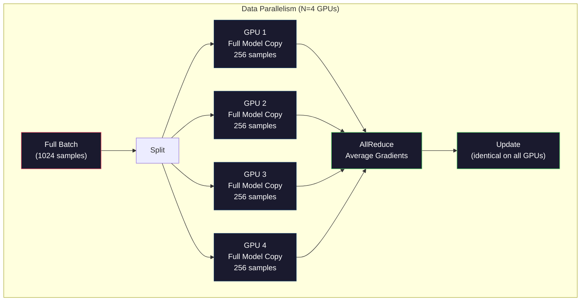
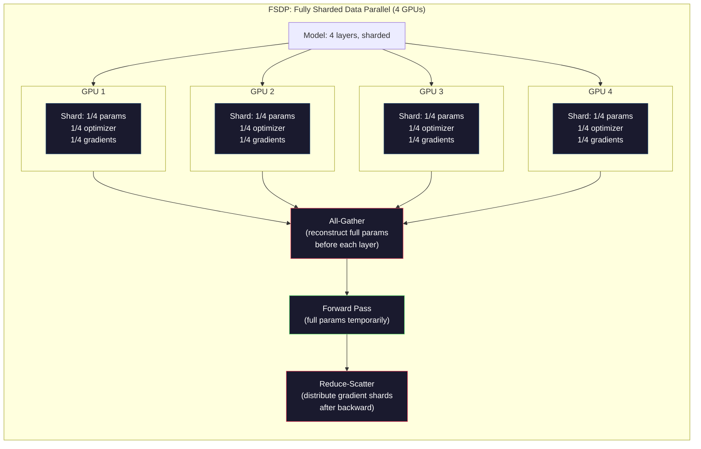
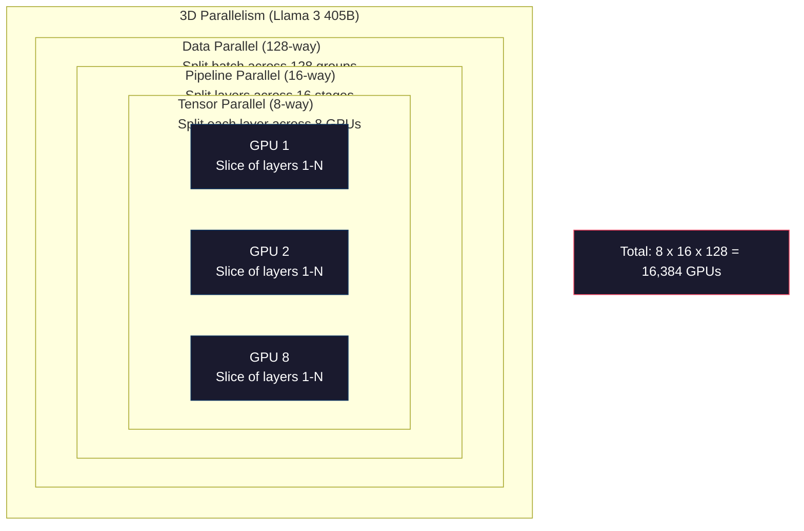

# Escalagem: Treinamento distribuído, FSDP, DeepSpeed

> Seu modelo 124M já está em um bloco de GPU. O treinamento foi concluído.

**Type:** Build
**Languages:** Python
**Prerequisites:** Phase 10, Lesson 04 (Pre-Training a Mini GPT)
**Time:** ~120 minutes

## Objectivo de aprendizagem
- 解释三种平行性 (Datos, Tensor, Pipeline), bem como quando é necessário usá-los, de acordo com a dimensão do modelo e a dimensão do grupo
- Utilize PyTorch DDP  implementar treinamento paralelo de dados, e em simultâneo entre vários blocos de GPU  Gradiente
- 计算给定模型规模的显存预算(pesos + estados de otimização + gradientes + ativações), para determinar a demanda mínima de hardware
- Configurar FSDP ou estágios de ZeRO DeepSpeed, separar o estado do modelo para vários blocos de GPU, para assim permitir mais do que um modelo de cartão de armazenamento

## 问题
Um modelo de parâmetros 7B usando FP16 时, apenas pesos precisa de 14GB──Adam optimizer irá reservar duas duplicadas para cada parâmetro extra armazenamento ((primeiro momento e segundo momento estimativas)── isto também precisa de 28GB──Repropagação 期间的 Gradients 再增加 14GB──还没有存储任何激活,你已经用掉了56GB──

Um bloco NVIDIA A100 tem 80 GB de armazenamento.

80GB já consumiu 56GB. Apenas restam 24GB para ativações, ou seja, o valor médio calculado durante o passagem avançada, eles devem ser mantidos até a Backpropagation.

Agora tente 70B 参数── apenas pesos:FP16 下 140GB──单块 GPU 放不下── você precisa de pelo menos 2 blocos A100(2 x 80GB = 160GB) para apenas deixar os pesos abaixo──加上优化状态和梯度,需要的 GPU 远不止这些:最低3+块,实际通常取决于碎片化策略,需要8-16块──

Llama 3 405B Utilize 16,384 blocos de GPUs NVIDIA H100  Train。 Este treinamento operação estimativa gasto cerca de 1 bilhão de dólares computação 成本。DeepSeek V3 通過更巧妙的架構(Mixura de Especialistas significa cada token apenas ativar uma pequena parte dos parâmetros)

Este curso apresenta quatro estratégias para tornar possível o treinamento em grande escala: paralelo de dados, paralelo de tensores, paralelo de pipeline e paralelo de dados totalmente fragmentados. Você vai primeiro usar Python, para entender cada estratégia, e depois voltar a entrar em contato com o framework de treinamento distribuído.

## 概念
### Por que é necessário distribuir

Abaixo está a evidência de cálculo do modelo real. Cada número é calculado, não uma estimativa.

| Model | Params | Weights (FP16) | Adam States | Gradients (FP16) | Total (no activations) |
|-------|--------|----------------|-------------|------------------|----------------------|
| GPT-2 Small | 124M | 248 MB | 992 MB | 248 MB | 1.5 GB |
| Llama 3 8B | 8B | 16 GB | 64 GB | 16 GB | 96 GB |
| Llama 3 70B | 70B | 140 GB | 560 GB | 140 GB | 840 GB |
| Llama 3 405B | 405B | 810 GB | 3,240 GB | 810 GB | 4,860 GB |

Adam States 这一列才是真正的显存杀手──Adam 会为每个参数存储运行平均 (m) 和运行变量 (v),两者都是FP32──对于70B 模型,这就是70B x 4 bytes x 2 = 560GB──只有优化器就需要七块A100──

单块H100 有80GB──Llama 3 405B 至少需要61块H100 才能容纳权重、优化和梯度──加上激活,数量也将继续增加──Meta Utilize 16,384块GPU não é porque eles pensam assim, mas porque eles precisam fazê-lo──

### Paralelismo dos dados

A estratégia mais simples é a de replicar o modelo completo em N blocos de GPUs. Devolver cada lote de treinamento em N 个相等部分. Cada bloco de GPU em seu próprio shard de dados para frente e para trás. Depois, em todos os GPUs, os gradientes médios.

**优点：**Throughput 近似线性扩展──N 块 GPU Cada passo 处理 N 倍数据──通信只限于梯度平均化,并且可以与计算重叠──

**缺点：**Cada bloco de GPU tem um modelo completo, estados de otimização e gradientes. Para um modelo de 70B, cada bloco de GPU precisa de 840GB.

**计算：**Tamanho de lote efetivo = por_gpu_batch_size x N。 para N=64 blocos de GPU 且 por lote de GPU 为 16, tamanho de lote efetivo 为 1,024。Llama 3 使用的有效批量是每步1600万代币。



### Paralelismo de tensão

Colocar uma única camada  demolição em vários blocos de GPU 上。 Uma vez a multiplicação de matriz é dividida em vários blocos de GPU, cada bloco de GPU                                                                                                                                                                                                                                                                                                                                                                                                                                                                                    

考虑 feedforward layer 中一个形 为 (8192, 8192) 的权力矩阵――使用四方向 tensor parallelism 时,每个块 GPU 拥有一个 (8192, 2048) 碎片――每个块 GPU 用输入乘以自己的碎片,产生一个部分结果――部分结果会被组合――通过全部减或全部集)生成完整输出――

**优点：**Reduzir os pesos de cada bloco de GPU 显存占用── um modelo de 70B 拆分到8块 GPU 上, significa que cada bloco de GPU 持有约8.75B 参数规模的权重──

**缺点：**Cada camada depois de tudo precisa de GPUs de alta velocidade 间通信──每次 matmul 后的全减会增加延迟──这在NVLink((同一节点内 GPU 间 900 GB/s) 上效果很好,但通过InfiniBand(400 Gb/s,约50 GB/s) 连接的节点之间效果差距──Tensor paralelismo 几乎总是限制在单个节点内(8块 GPU)──

**真实用法：**Megatron-LM                                                                                                                                                                                                                                                                                                                                                                                                                                                                                                                         

### Paralelismo de oleodutos

按层 拆分模型──GPU 1 运行层 1-8──GPU 2 运行层 9-16──GPU 3 运行层 17-24──GPU 4 运行层 25-32──数据流经管道:GPU 1 计算自己的层并把激活 发送给 GPU 2,GPU 2 计算自己的层 后发送给 GPU 3,依此类推──

**优点：**GPU 间通信极少, apenas transmite camada 边界处的激活;相比梯度或重量,这些数据很小──因为带宽需求低,所以可以跨节点工作──

**缺点：**Bubbles de pipeline ⋅ quando GPU 4 está calculado o micro-batch 1 passando para a frente ⋅ quando GPU 1 ⋅ 2 ⋅ 3 estão em estado de vazio ⋅ já completaram seu próprio passagem para a frente ⋅ parte) ⋅ passagem para trás ⋅ durante o tempo, mode反过来── usando pipelining ingênuo ⋅ N ⋅ fases de pipeline ⋅ utilizamento de GPU ⋅ apenas 1/N⋅

**GPipe and PipeDream**通過把批發 拆分成微批來解決泡泡 问题──GPU 1 一完成微批 1 的前進,就開始處理微批 2──这让不同的管道阶段的计算发生重叠──使用M 个微批 和 N 个阶段 时,泡泡分 降为 (N-1) /M──N=4阶段、M=16 micro批 时,泡 为 3/16 = 18.75% do tempo inativo──

### FSDP: Dados totalmente fragmentados paralelamente

O FSDP combina a expansibilidade e a eficiência de armazenamento de parálelas de dados. Cada bloco de GPU não possui mais uma cópia completa do modelo, mas apenas um parâmetro de 1/N, gradientes e estados de otimização.

Em uma camada de passagem para a frente, o FSDP irá funcionar.**all-gather**, , , , , , , , , , , , , , , , , , , , , , , , , , , , , , , , , , , , , , , , , , , , , , , , , , , , , , , , , , , , , , , , , , , , , , , , , , , , , , , , , , , , , , , , , , , , , , , , , , , , , , , , , , , , , , , , , , , , , , , , , , , , , , , , , , , , , , , , , , , , , , , , , , , , , , , , , , , , , , , , , , , , , , , , , , , , , , , , , , , , , , , , , , , , , , , , , , , , , , , , , , , , , , , , , , , , , , , , , , , , , , , , , , , , , , , , , , , , , , , , , , , , , , , , , , , , , , , , , , , , , , , , , , , , , , , , , , , , , , , , , , , , , , , , , , , , , , , , , , , , , , , , , , , , , , , , , , , , , , , , , , , , , , , , , , , , , , , , , , , , , , , , , , , , , , , , , , , , , , , , , , , , , , , , , , , , , , , , , , , , , , , , , , , , , , , , , , , , , , , , , , , , , , , , , , , , , , , , , , , , , , , , , , , , , , , , , , , , , , , , , , , , , , , , , , , , , , , , , , , , , , , , , , , , , , , , , , , , , , , , , , , , , , , , , , , , , , , , , , , , , , , , , , , , , ,**reduce-scatter**Divide os fragmentos de gradientes, deixe cada bloco de GPU armazenar apenas gradientes de 1/N.

**70B 模型在 8 块 GPU 上的计算：**

| Component | Without FSDP | With FSDP |
|-----------|-------------|-----------|
| Weights (FP16) | 140 GB per GPU | 17.5 GB per GPU |
| Adam States (FP32) | 560 GB per GPU | 70 GB per GPU |
| Gradients (FP16) | 140 GB per GPU | 17.5 GB per GPU |
| **Total** | **840 GB per GPU** | **105 GB per GPU** |

 Sem FSDP , você não pode colocar 70B 模型 em um único bloco de 80GB GPU                                                                                                                                                                                                                                                   

O custo de comunicação é maior do que o paralelo de dados de vainilha, pois cada camada precisa de tudo reunido antes.



### DeepSpeed ZeRO

O ZeRO de DeepSpeed (Zero Redundancy Optimizer) é conceptualmente semelhante ao FSDP, mas desenvolvido pela Microsoft independentemente.

| Stage | Shards | Memory Savings | Communication |
|-------|--------|---------------|---------------|
| ZeRO-1 | 仅 Optimizer states | ~4x reduction | 与 data parallel 相同 |
| ZeRO-2 | + Gradients | ~8x reduction | 略多 |
| ZeRO-3 | + Parameters | ~Nx reduction (N GPUs) | 每层 All-gather |

ZeRO-3 é o mesmo que o FSDP.

A DeepSpeed também introduziu o ZeRO-Offload (otimizador de estados de descarga para a RAM do CPU, RAM do CPU mais barato e com maior capacidade) e o ZeRO-Infinity (o descarga para SSDs NVMe) (a) e estes programas usam a velocidade de cálculo para trocar a capacidade de armazenamento: operações descarregadas mais lentas, mas com capacidade de liberar GPU 显存――).

### Treinamento Misto de Precisão

现代训练会同时使用多种浮点格式:

- **Forward pass**:FP16 ou BF16 ((16 bits) ∼显存是FP32 的一半──Matmuls 在 tensor cores 上运行速度快 2倍──
- **Master weights**:FP32(32 bits)。 Por optimizador 维护, usado durante as atualizações de peso 保持数值精度──
- **Loss scaling**Em passagem para trás, a perda de uma grande constante é multiplicada por um grande número, para evitar que os gradientes FP16 baixem para zero.

BF16(Brain Float 16) tem um intervalo de exponentes semelhante ao FP32 ((8 bits de exponente), mas a precisão é menor ((7 bits de mantissa, enquanto FP32 é 23)。 É muito raro que precise de perda de escala, pois pode representar o mesmo alcance de quantidade。FP16 tem 5 bits de exponente e 10 bits de mantissa, pode representar um valor de quantidade mais detalhada, mas em extremidades de nível de quantidade baixa irá sobre-florar/subflorar。

Os TPUs do Google usam o BF16 e a NVIDIA A100 e H100, e o FP16 e BF16 são também apoiados.

**7B 模型的显存对比：**

| Precision | Weights | Optimizer | Gradients | Total |
|-----------|---------|-----------|-----------|-------|
| FP32 everywhere | 28 GB | 56 GB | 28 GB | 112 GB |
| Mixed (BF16 + FP32 master) | 14 GB | 56 GB | 14 GB | 84 GB |

Neste modelo, precisão mista economizou 28GB. Otimizador ainda mantém o FP32, que também é a maior parte do consumo de armazenamento.

### Megatron-LM e paralelo 3D

A verdade é que o treinamento em grande escala combina três paralelos:

- **Data parallelism**跨节点组(扩展 tamanho do lote)
- **Tensor parallelism**Em um ponto de entrada, você pode desmontar as camadas para 8 blocos de GPU.
- **Pipeline parallelism**跨节点(把 grupos de camadas 拆到多台机器)

Llama 3 405B em 16,384 blocos H100 上:
- Cada ponto tem paralelo de tensor de 8 vias
- 跨节点 16 vias paralelismo de oleodutos ((16 个 oleodutos fases)
- 余余维度上 128 direção paralelo de dados ((16,384 / 8 / 16 = 128)

Esta decomposição 3D ((8 x 16 x 128 = 16,384) é um método de expandir para milhares de blocos de GPUs.

O DeepSeek V3 adotou diferentes métodos. A sua arquitetura de expertos combina 671B em cada token.




```figure
paged-kv-cache
```

## Construí-lo
### 步骤 1: Simulação de Parallelismo de Dados

Colocar um lote de GPU em forma de GPU em cima. Cada GPU em seu próprio fragmento calcula o passo para frente.

```python
import numpy as np

def simulate_data_parallelism(data, num_gpus, model_fn):
    batch_size = len(data)
    shard_size = batch_size // num_gpus
    remainder = batch_size % num_gpus

    gpu_losses = []
    gpu_gradients = []

    offset = 0
    for gpu_id in range(num_gpus):
        extra = 1 if gpu_id < remainder else 0
        shard = data[offset:offset + shard_size + extra]
        offset += shard_size + extra

        loss, grad = model_fn(shard)
        gpu_losses.append(loss)
        gpu_gradients.append(grad)

    avg_loss = np.mean(gpu_losses)
    avg_gradient = np.mean(gpu_gradients, axis=0)

    return avg_loss, avg_gradient
```

operação de redução total (do grego "gradientes médios") é a única comunicação entre os paralelos de dados. Na prática, a GPU da NVIDIA utilizou a biblioteca NCCL, que realizou o anel de redução total: cada bloco da GPU coloca 1/N dos seus gradientes em uma GPU vizinha, recebe 1/N da outra GPU vizinha, passa por N-1                                                                                                                                                                                                                                                                                                                                                                                                                                  

### 步骤 2: Simulação de Parallelismo de Tensor

Colocar a matriz de peso  demolição em vários blocos de GPU 上。 cada bloco de GPU 计算部分 Matrix multiplicação。组合结果。

```python
def simulate_tensor_parallelism(input_data, weight_matrix, num_gpus):
    d_in, d_out = weight_matrix.shape
    assert d_out % num_gpus == 0, f"d_out {d_out} not divisible by num_gpus {num_gpus}"
    shard_size = d_out // num_gpus

    partial_results = []
    for gpu_id in range(num_gpus):
        start = gpu_id * shard_size
        end = start + shard_size
        weight_shard = weight_matrix[:, start:end]

        partial = input_data @ weight_shard
        partial_results.append(partial)

    full_output = np.concatenate(partial_results, axis=-1)

    direct_output = input_data @ weight_matrix
    error = np.abs(full_output - direct_output).max()

    return full_output, error
```

erro 应该严格为零((或机器epsilon) ――Tensor paralelismo é matematicamente preciso, o resultado é produzido com um bloco de GPU em cima de calcular matmul completo, assim como △Cut along output dimension 进行, portanto, cada bloco de GPU produz diferentes colunas de pedaço,concatenation 会重建完整的结果──

对于列-parallel linear layers(切分输出维度),你执行 concatenate──对于列-parallel(切分输入维度),你执行 sum──在变压器 FFN 中,第一个线性(扩展) 使用列-parallel,第二个线性(合同) 使用列-parallel──这样可以避免两层之间一次全减少──

### 步骤 3: Simulação de paralelismo de oleodutos

Colocar camadas de modelo  demolição para GPU virtual  上。 mostrar problema de bolha: estágios iniciais 会在后续阶段 计算时处于空。

```python
def simulate_pipeline_parallelism(num_layers, num_stages, num_microbatches):
    layers_per_stage = num_layers // num_stages

    timeline = {}
    clock = 0

    for mb in range(num_microbatches):
        for stage in range(num_stages):
            start_time = max(
                timeline.get((stage, mb - 1, "fwd"), (0, 0))[1] if mb > 0 else 0,
                timeline.get((stage - 1, mb, "fwd"), (0, 0))[1] if stage > 0 else 0,
            )
            end_time = start_time + layers_per_stage
            timeline[(stage, mb, "fwd")] = (start_time, end_time)

    last_fwd_end = max(v[1] for v in timeline.values())

    for mb in range(num_microbatches - 1, -1, -1):
        for stage in range(num_stages - 1, -1, -1):
            deps = [last_fwd_end]
            if mb < num_microbatches - 1 and (stage, mb + 1, "bwd") in timeline:
                deps.append(timeline[(stage, mb + 1, "bwd")][1])
            if stage < num_stages - 1 and (stage + 1, mb, "bwd") in timeline:
                deps.append(timeline[(stage + 1, mb, "bwd")][1])
            start_time = max(deps)
            end_time = start_time + layers_per_stage
            timeline[(stage, mb, "bwd")] = (start_time, end_time)

    total_time = max(v[1] for v in timeline.values())
    compute_time = num_microbatches * num_stages * layers_per_stage * 2
    bubble_fraction = 1.0 - compute_time / (total_time * num_stages)

    return timeline, total_time, bubble_fraction
```

Utilize 4 etapas e 1 micro-batch, a fração de bolhas é de 75%, ou seja, há três blocos vazios em qualquer momento em quatro blocos de GPUs. Utilize 16 micro-batches, ele vai diminuir para cerca de 19%.

### 步骤 4: Calculador de memória

計算任意模型规模訓練時的精确显存需求──

```python
def memory_calculator(
    params_billions,
    precision_bytes=2,
    optimizer="adam",
    num_gpus=1,
    sharding="none",
    sequence_length=2048,
    batch_size_per_gpu=1,
    hidden_dim=None,
    num_layers=None,
):
    params = params_billions * 1e9

    weight_memory = params * precision_bytes

    if optimizer == "adam":
        optimizer_memory = params * 4 * 2
    elif optimizer == "sgd":
        optimizer_memory = params * 4
    else:
        optimizer_memory = 0

    gradient_memory = params * precision_bytes

    total_no_activation = weight_memory + optimizer_memory + gradient_memory

    if hidden_dim and num_layers:
        activation_per_layer = (
            sequence_length * batch_size_per_gpu * hidden_dim * precision_bytes * 4
        )
        activation_memory = activation_per_layer * num_layers
    else:
        activation_memory = params * precision_bytes * 0.5

    if sharding == "fsdp" or sharding == "zero3":
        weight_memory /= num_gpus
        optimizer_memory /= num_gpus
        gradient_memory /= num_gpus
    elif sharding == "zero2":
        optimizer_memory /= num_gpus
        gradient_memory /= num_gpus
    elif sharding == "zero1":
        optimizer_memory /= num_gpus

    per_gpu_total = weight_memory + optimizer_memory + gradient_memory + activation_memory

    return {
        "params_billions": params_billions,
        "weights_gb": weight_memory / 1e9,
        "optimizer_gb": optimizer_memory / 1e9,
        "gradients_gb": gradient_memory / 1e9,
        "activations_gb": activation_memory / 1e9,
        "per_gpu_total_gb": per_gpu_total / 1e9,
        "total_across_gpus_gb": per_gpu_total * num_gpus / 1e9,
        "fits_on_80gb": per_gpu_total / 1e9 <= 80,
        "num_gpus": num_gpus,
        "sharding": sharding,
    }
```

Esta calculadora respondeu a cada engenheiro de ML que se perguntaria: I need how many blocks of GPU? input model size, see see if you put it down── adjust sharding strategy, until per-GPU total 低于80GB──

### 步骤 5: Simulação de Precissão Mista

Comparar o uso de FP32、FP16 e o uso de treinamento de precisão mista

```python
def mixed_precision_comparison(params_billions):
    params = params_billions * 1e9

    fp32_weights = params * 4
    fp32_optimizer = params * 4 * 2
    fp32_gradients = params * 4
    fp32_total = fp32_weights + fp32_optimizer + fp32_gradients

    fp16_weights = params * 2
    fp16_master = params * 4
    fp16_optimizer = params * 4 * 2
    fp16_gradients = params * 2
    fp16_total = fp16_weights + fp16_master + fp16_optimizer + fp16_gradients

    mixed_weights = params * 2
    mixed_optimizer = params * 4 * 2
    mixed_gradients = params * 2
    mixed_total = mixed_weights + mixed_optimizer + mixed_gradients

    return {
        "fp32_total_gb": fp32_total / 1e9,
        "fp16_with_master_gb": fp16_total / 1e9,
        "mixed_bf16_gb": mixed_total / 1e9,
        "savings_vs_fp32": 1 - mixed_total / fp32_total,
    }
```

Para a maioria das pessoas, a maior incrível é: precisão misturada não reduzirá a metade dos estados de otimização (Adam's m 和 v) independentemente da precisão, manterá o FP32 (FP32 e FP32) para o modelo 7B, o treinamento do FP32 utiliza 112GB (FP32) (FP32) (FP32) (FP32) (FP32) (FP32) (FP32) (FP32) (FP32) (FP32) (FP32) (FP32) (FP32) (FP32) (FP32) (FP32) (FP32) (F32) (F32) (F32) (F32) (F32) (F32) (F32) (F32) (F32) (F32) (F32) (F32) (F42) (F42) (F42) (F42) (F42) (F42) (F42) (F42)), que é uma redução de 25% em vez de 50% (F43) (F43) (F43) (F43) (F43) (F43) (F43) (F43) (F43) (F44) (F44) (F44) (F44) (F44) (F) (F) (F) (F) (F) (F) (F) (F) (F) (F) (F) (F) (F) (F) (F) (F) (F) (F) (F) (F) (F) (F)), F) (F) (F) (F) (F) (F)), p) (F) (F) (F) (F) (F) (F)), p) (F) (F) (F) (F) (F)), p) (F) (F)),),),),),),),),),),),),), (F) (F) (F) (F) (F) (F) (F) (F) (F) (F) (F) (F) (F) (F) (F) (F) (F) (F) (F) (F)

## Use-o
### Executa todas as simulações

```python
def run_all_demos():
    print("=" * 70)
    print("DATA PARALLELISM SIMULATION")
    print("=" * 70)

    np.random.seed(42)
    data = np.random.randn(64, 32)
    weight = np.random.randn(32, 16)

    def model_fn(batch):
        output = batch @ weight
        loss = np.mean(output ** 2)
        grad = 2 * batch.T @ (batch @ weight) / len(batch)
        return loss, grad

    for n_gpus in [1, 2, 4, 8]:
        loss, grad = simulate_data_parallelism(data, n_gpus, model_fn)
        print(f"  {n_gpus} GPUs: loss={loss:.4f}, grad_norm={np.linalg.norm(grad):.4f}")

    print()
    print("=" * 70)
    print("TENSOR PARALLELISM SIMULATION")
    print("=" * 70)

    x = np.random.randn(4, 8192)
    W = np.random.randn(8192, 8192)

    for n_gpus in [1, 2, 4, 8]:
        output, error = simulate_tensor_parallelism(x, W, n_gpus)
        print(f"  {n_gpus} GPUs: output_shape={output.shape}, max_error={error:.2e}")

    print()
    print("=" * 70)
    print("PIPELINE PARALLELISM SIMULATION")
    print("=" * 70)

    for n_mb in [1, 4, 8, 16, 32]:
        _, total_t, bubble = simulate_pipeline_parallelism(32, 4, n_mb)
        print(f"  {n_mb:2d} micro-batches: total_time={total_t:4d}, bubble={bubble:.1%}")

    print()
    print("=" * 70)
    print("MEMORY CALCULATOR")
    print("=" * 70)

    configs = [
        (7, "none", 1),
        (7, "fsdp", 8),
        (70, "none", 1),
        (70, "fsdp", 8),
        (70, "fsdp", 16),
        (405, "fsdp", 64),
        (405, "fsdp", 128),
    ]

    print(f"  {'Model':>8} {'Sharding':>8} {'GPUs':>5} {'Per-GPU':>10} {'Fits 80GB':>10}")
    print("  " + "-" * 50)
    for params, shard, gpus in configs:
        result = memory_calculator(params, num_gpus=gpus, sharding=shard)
        fits = "Yes" if result["fits_on_80gb"] else "No"
        print(f"  {params:>6}B {shard:>8} {gpus:>5} {result['per_gpu_total_gb']:>8.1f}GB {fits:>10}")

    print()
    print("=" * 70)
    print("MIXED PRECISION COMPARISON")
    print("=" * 70)

    for params_b in [7, 13, 70, 405]:
        result = mixed_precision_comparison(params_b)
        print(f"  {params_b}B: FP32={result['fp32_total_gb']:.0f}GB, "
              f"Mixed BF16={result['mixed_bf16_gb']:.0f}GB, "
              f"Savings={result['savings_vs_fp32']:.0%}")
```

## Entrega-o
本课会产出 `outputs/prompt-distributed-training-planner.md`Um instante, ele recebe o tamanho do modelo e o hardware disponível, e então gera um plano de treinamento distribuído completo: estratégia de paralelismo, orçamento de memória, despesas gerais de comunicação e capacidade de produção esperada.

## 练习
1. Modificar a calculadora de memória, incluir o checkpointing de ativação. Usar checkpointing.

2. 扩展管道平行模拟,实现 PipeDream 使用的 1F1B(um para frente, um para trás)horário。 para 4 etapas 和 8 micro-batches, compare-lo com a fração de bolha do cronograma ingênuo。1F1B cronograma 应该具有更低的峰值记忆,因为它更早开始回转过──

3.  implementar um simulador de acumulação de gradientes. Não em cada micro-parcela 后都 redução, mas em local acumulação de gradientes K 步, então depois tudo-redução.

4. Construir um estimador de custos.$2/hr，H100 at $3.50/h) e estratégia paralelo, estimativa total de custos de treinamento (USD)$100M，DeepSeek V3 成本约 $5,6M.

5. Em calculador de memória, insira o ZeRO-Offload. Suponha que cada ponto tenha 512GB de RAM de CPU e 2TB de NVMe. Mostre como fazer com que os estados do optimizador sejam descarregados até o CPU.

## 关键术语
| Term | What people say | What it actually means |
|------|----------------|----------------------|
| Data parallelism | “把模型复制到每块 GPU” | 每块 GPU 处理不同的 data shard；每一步之后通过 all-reduce 平均 gradients |
| Tensor parallelism | “把一层拆到多块 GPU 上” | 切分 weight matrices，让每块 GPU 计算 matmul 的一部分；需要高速 NVLink interconnect |
| Pipeline parallelism | “把 layers 拆到多块 GPU 上” | 每块 GPU 运行不同的一组 layers；数据通过 pipeline 流动，并使用 micro-batches 减少 bubbles |
| FSDP | “Shard everything” | Fully Sharded Data Parallel：每块 GPU 持有 1/N 的 weights、gradients 和 optimizer states；计算前执行 all-gather |
| ZeRO | “DeepSpeed 版本的 FSDP” | Zero Redundancy Optimizer，包含 3 个 stages：shard optimizer（Stage 1）、+ gradients（Stage 2）、+ parameters（Stage 3） |
| All-reduce | “在 GPU 之间求平均” | collective operation，让每块 GPU 最终都拥有所有 GPU 输入的 sum（或 average），通常实现为 ring all-reduce |
| All-gather | “从所有 GPU 收集” | collective operation，让每块 GPU 最终都拥有所有 GPU 数据的 concatenation；FSDP 中用于重建完整 parameters |
| Reduce-scatter | “求和并分发” | collective operation，对数据进行 reduce（sum）并把不同 chunks scatter 到不同 GPU；FSDP 中用于 gradient sharding |
| Mixed precision | “用 half precision 训练” | forward/backward 使用 FP16/BF16，optimizer states 使用 FP32；节省约 25% 显存，而不是 50%，因为 optimizer 占主导 |
| Pipeline bubble | “pipeline 中的 idle time” | GPU 等待上一 stage 数据时处于空闲的时间比例；可通过使用更多 micro-batches 降低 |

## 延伸阅读
- [Rajbhandari et al., 2020 -- "ZeRO: Memory Optimizations Toward Training Trillion Parameter Models"](https://arxiv.org/abs/1910.02054)-- definição de três fases de fragmentação de DeepSpeed ZeRO papel
- [Shoeybi et al., 2020 -- "Megatron-LM: Training Multi-Billion Parameter Language Models Using Model Parallelism"](https://arxiv.org/abs/1909.08053)-- NVIDIA 面向变压器 的 tensor parallelism
- [Narayanan et al., 2021 -- "Efficient Large-Scale Language Model Training on GPU Clusters Using Megatron-LM"](https://arxiv.org/abs/2104.04473)-- 结合数据、tensor 和 pipeline 3D paralelismo
- [Zhao et al., 2023 -- "PyTorch FSDP: Experiences on Scaling Fully Sharded Data Parallel"](https://arxiv.org/abs/2304.11277)-- Realização do FSDP original de PyTorch
- [Llama 3 Technical Report](https://arxiv.org/abs/2407.21783)-- 16.384 treinamento de GPU paralelo 3D 细节
- [DeepSeek-V3 Technical Report](https://arxiv.org/abs/2412.19437)-- Arquitetura do MoE  como reduzir os custos de treinamento num nível quantitativo
