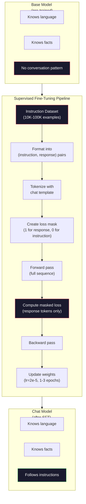

# Apontação de instruções (SFT)

> Modelo base 会预测下一个 Token──仅此而已── não segue instruções, responde a questões, nem rejeita pedidos prejudiciais──SFT é um ponto de encontro entre um token 预测器 e um assistente útil──Everyone model you've ever conversed with -- Claude、GPT、Llama Chat -- 都经历过这个步骤──

**类型：**Construir
**语言：**Python (com numpy)
**前置要求：**Fase 10, Lição 04 (Pre- Treinamento de um Mini GPT)
**时间：**- 90 minutos.

## Objectivo de aprendizagem

- 实现 supervisado fine-tuning (SFT),将 base language model 转换为遵循指令的助手
- Utilize contendo sistema, usuário e assistente 角色的聊天模板 格式化训练数据,并对非助手代币 屏蔽 Loss
- Explicar por que a FFT é necessária: os modelos baseados continuam a ser utilizados em vez de responderem a questões
- 通過在保留的指示集合 上比较基模型与精细调调模型的回复,评估 SFT质量

## 问题

Você treinou um modelo na lição 04 e deu-lhe uma sequência, que pode prever o próximo token.

Agora tente isto: para ele: "Qual é a capital da França?" modelo base não responderá "Paris".

É o que acontece com o modelo base GPT-3 (em junho de 2020) e o ChatGPT (em junho de 2022): a diferença entre a mesma arquitetura e a mesma pré-formação.

Stanford Alpaca  provou que você não precisa de milhões de exemplos. Em março de 2023, eles apenas usaram GPT-3.5 para fazer uma resposta a instruções para o Llama 7B. O resultado foi um chatbot capaz de seguir instruções, responder a perguntas e realizar um diálogo. Não é como o ChatGPT, mas com 600 dólares e algumas horas de treinamento, já está perto de ser surpreendente.

Meta's Llama 2 Chat usou apenas cerca de 27.000 exemplos de alta qualidade na fase inicial da SFT.

## 概念

### SFT  实际做了什么

Supervisado Fine-Tuning continuou o mesmo ciclo de treinamento no pré-treino - passagem avançada, perda de cálculo, passagem atrasada, pesos de atualização - mas usou outro tipo de dados.

```json
{
  "system": "You are a helpful assistant.",
  "user": "What is the capital of France?",
  "assistant": "The capital of France is Paris."
}
```

modelo  já sabe que Paris é a capital da França. É uma das principais formas de ensino na Wikipédia.

Pode assim entender-se. Pre-treinamento.

### Formato de dados

Na indústria há três principais formatos. Cada formato codifica a mesma informação.

**Alpaca Format**(Stanford, março 2023):

```json
{
  "instruction": "Summarize the following article in 3 sentences.",
  "input": "The European Central Bank raised interest rates...",
  "output": "The ECB increased rates by 25 basis points..."
}
```

简单且被广泛使用──`input`字段是可选的-- 许多指令不需要额外上下文──Stanford 发布了52,000 种类型的例子,由GPT-3.5 以 600 美元成本生成──这开启了开源指示调节运动──

**ShareGPT Format**(Comunidade, 2023):

```json
{
  "conversations": [
    {"from": "system", "value": "You are a helpful assistant."},
    {"from": "human", "value": "What causes tides?"},
    {"from": "gpt", "value": "Tides are caused by the gravitational pull of the Moon..."},
    {"from": "human", "value": "How often do they occur?"},
    {"from": "gpt", "value": "Most coastal areas experience two high tides and two low tides per day..."}
  ]
}
```

支持多轮对话──按照惯例,"from"字段使用"human" 和 "gpt",不管实际模型是什么──Vicuna 使用从用户共享的ChatGPT transcripts 中抓取的70,000条 ShareGPT 对话进行训练──

**ChatML Format**(OpenAI, utilizado por muitos modelos de código aberto):

```
<|im_start|>system
You are a helpful assistant.<|im_end|>
<|im_start|>user
What is the capital of France?<|im_end|>
<|im_start|>assistant
The capital of France is Paris.<|im_end|>
```

Use especial Token`<|im_start|>`- Não.`<|im_end|>`(→ "Total") para "Profesão de Distribuição": "Total" para "Total" para "Total" para "Total" para "Total" para "Total" para "Total" para "Total" para "Total" para "Total" para "Total" para "Total" para "Total" para "Total" para "Total" para "Total" para "Total" para "Total" para "Total" para "Total" para "Total" para "Total" para "Total" para "Total" para "Total" para "Total" para "Total" para "Total" para "Total" para "Total" para "Total" para "Total" para "Total" para "Total" para "Total" para "Total" para "Total" para "Total" para "Total" para "Total" para "Total" para "Total" para "Total" para "Total" para "Total" para "Total" para "Total" para "Total" para "Total" para "Total" para "Total" para "Total" para "Total" para "Total" para "Total" para "Total" para "Total" para "Total" para "Total" para "Total"

Os três tipos de formações conseguem a mesma coisa: eles dizem ao modelo que é instrução, é resposta, é aprendizagem deste modelo.

### Por que é que funciona?

O modelo já foi desenvolvido desde o pré-treino na escola de língua. Ele já viu bilhões de perguntas e respostas, instruções e respostas, bem como exemplos de diálogos entre pessoas.

SFT irá concentrar-se nesta potencial capacidade. O modelo não precisa mais de julgar-se a partir do texto acima ou abaixo, deve responder ao problema ou continuar a ser documentado.

É por isso que 27 mil exemplos são suficientes. Você não está ensinando um modelo de inglês. Você não está ensinando fatos do mundo. Você está ensinando um comportamento simples.

### Perda mascarada

É o mais importante detalhe técnico da SFT, e a maioria dos cursos salta-o.

Durante o período de pré-treino, você vai ver cada token  calcular Loss──modelo 学习预测序列中的每一个下一个Token── durante o SFT, você só vai ver *resposta* Token 计算 Loss──instrução Token 用作上下文, mas o modelo não vai ser punido por erros 预测它们而受到惩罚──

Porquê? Porque não queres modelo 学会*生成* instrução。你希望它学会*响应* instrução。 Se você estiver em jogo com a instrução Token 计算 Loss, estás em jogo com o modelo 预测 "Qual é a capital da França?", assim como é apenas um questionador。 Isso vai desperdiçar um sinal gradiente,并可能让模型产生混对自己的角色──

Na prática, você vai criar uma máscara de perda: resposta Token para 1, instrução Token para 0── em média, vai perder cada Token 乘以这个面具──

```
Tokens:    [SYS] You are helpful [USER] What is the capital? [ASST] Paris is the capital [EOS]
Loss mask:   0    0    0     0      0     0   0  0     0       1     1    1   1     1      1
```

Só ...`[ASST]`后后的Token 会贡献 Loss──model 在前进传递期间将看到完整对话(它需要指示 才能产生正确反应),但只根据它的预测反应的效果来更新权重──

### 訓練 Hiperparametros

Os hiperparâmetros utilizados pela SFT são muito diferentes dos de pré-treino.

| Parameter | Pre-Training (Llama 2 7B) | SFT (Llama 2 Chat) |
|-----------|---------------------------|---------------------|
| Learning rate | 3e-4 (peak) | 2e-5 |
| Epochs | 1（单次遍历数据） | 2 |
| Batch size | 4M tokens | 64 examples |
| Warmup steps | 2,000 | 0-100 |
| Weight decay | 0.1 | 0.0-0.1 |
| Data size | 2T tokens | 27,000 examples |

Taxa de aprendizagem de SFT 低15倍──这点非常关键──fine-tuning 期间过高的学习率 会破坏预训知识──model 会忘记它学到的内容,并过适到小型细调数据集上──这是灾难性的忘记──

两个时代意味着模型会看到每个训练示例两次――在小数据集上超过3时代会导致记忆化 - modelo 开始逐字复现训练示例,而不是泛化――

### Esquecimento catastrófico

O ajuste fino pode prejudicar a capacidade geral. Em instruções de seguimento de dados, o modelo pode perder a capacidade de escrever código, fazer matemática ou gerar textos criativos.

Três formas de acelerar:

1. **低 learning rate。**1e-5 até 5e-5── menor atualização significa menos destruição de recursos pré-treinados──

2. **短训练。**1-3 épocas──在模型过之前停止──

3. **混入 pre-training 数据。**Llama 2 Chat 将一小部分(2-5%) original pré-treinamento dados misturados em SFT conjunto de dados.

### Número real

Em 10.000 pares de instruções de alta qualidade, para ajustar perfeitamente um modelo 7B, usando um único NVIDIA A100 80GB GPU, cerca de 1 hora é necessária.

- 10 mil exemplos x 平均 512 tokens = 5,12M tokens
- 2 épocas =  总计 10.24M tokens
- A100 para 7B modelo de ajuste fino de pronúncia: ~ 3.000 tokens/segundo
- 10.24M / 3.000 = ~ 3.400 segundos = ~ 57 minutos

Para o nosso mini GPT ((4 camadas, 128 dims), o treino é quase instantâneo.




```figure
loss-masking
```

## Construção

### 步骤 1: conjunto de dados de instruções

Criar um conjunto de dados de instruções sintéticas Em ambiente de produção, empresas como AI e Anthropic empregarão marcadores artificiais para escrever esses dados Nós usamos um método programado para criá-los, em formato de demonstração

```python
import numpy as np

INSTRUCTION_DATA = [
    {
        "instruction": "What is the capital of France?",
        "response": "The capital of France is Paris."
    },
    {
        "instruction": "Explain gravity in one sentence.",
        "response": "Gravity is the force that attracts objects with mass toward each other."
    },
    {
        "instruction": "Write a haiku about the ocean.",
        "response": "Waves crash on the shore, salt and foam beneath the sun, endless blue expanse."
    },
    {
        "instruction": "What is 15 multiplied by 7?",
        "response": "15 multiplied by 7 is 105."
    },
    {
        "instruction": "Name three programming languages.",
        "response": "Three programming languages are Python, Rust, and TypeScript."
    },
    {
        "instruction": "Summarize photosynthesis.",
        "response": "Photosynthesis converts sunlight, water, and carbon dioxide into glucose and oxygen."
    },
    {
        "instruction": "What year did World War II end?",
        "response": "World War II ended in 1945."
    },
    {
        "instruction": "Define machine learning.",
        "response": "Machine learning is a field where algorithms learn patterns from data to make predictions."
    },
]
```

Os exemplos são muito poucos. A Stanford Alpaca usou 52.000 exemplares. Mas, seja você com 8 ou 52.000, o mecanismo é o mesmo: tokenize, masque, apenas para respostas.

### 步骤 2: Use Chat Template  executar Tokenize

Para que os pares de instruções-resposta  transformados em marcas de papel especiais  Token 序列── estes marcadores  dizer instrução modelo 在哪里结束,resposta 从哪里开始──

```python
SPECIAL_TOKENS = {
    "INST_START": 253,
    "INST_END": 254,
    "RESP_START": 255,
}


def tokenize_instruction_pair(instruction, response, vocab_size=256):
    inst_tokens = list(instruction.encode("utf-8"))
    resp_tokens = list(response.encode("utf-8"))

    inst_tokens = [min(t, vocab_size - 4) for t in inst_tokens]
    resp_tokens = [min(t, vocab_size - 4) for t in resp_tokens]

    tokens = (
        [SPECIAL_TOKENS["INST_START"]]
        + inst_tokens
        + [SPECIAL_TOKENS["INST_END"]]
        + [SPECIAL_TOKENS["RESP_START"]]
        + resp_tokens
    )

    return tokens


def create_loss_mask(tokens):
    mask = np.zeros(len(tokens), dtype=np.float32)
    in_response = False

    for i, token in enumerate(tokens):
        if token == SPECIAL_TOKENS["RESP_START"]:
            in_response = True
            continue
        if in_response:
            mask[i] = 1.0

    return mask
```

Máquina de perda para instrução Token 全部为零, para resposta Token 全部为一。`RESP_START`O símbolo é uma máscara de 0, porque é um separador, não é parte do conteúdo da resposta.

### 步骤 3: Perda de entropia cruzada mascarada

標準 cross-entropy, mas乘以損失面具──只有回应代币 会贡献 Gradient──

```python
def masked_cross_entropy_loss(logits, targets, loss_mask):
    batch, seq_len, vocab_size = logits.shape
    logits_flat = logits.reshape(-1, vocab_size)
    targets_flat = targets.reshape(-1)
    mask_flat = loss_mask.reshape(-1)

    max_logits = logits_flat.max(axis=-1, keepdims=True)
    log_softmax = logits_flat - max_logits - np.log(
        np.exp(logits_flat - max_logits).sum(axis=-1, keepdims=True)
    )

    per_token_loss = -log_softmax[np.arange(len(targets_flat)), targets_flat]

    masked_loss = per_token_loss * mask_flat
    num_response_tokens = mask_flat.sum()
    if num_response_tokens == 0:
        return 0.0
    loss = masked_loss.sum() / num_response_tokens

    return loss
```

- Não .`num_response_tokens`Não é .`seq_len` Se se divide em total sequência de longitude, mais longa instruções 会稀释 Gradient 信号── Se se divide em resposta Token número pode garantir que, independentemente da instrução 长度如何, cada resposta Token o peso é o mesmo──

### 步骤 4: ciclo de treinamento de FFT

O MiniGPT do Leção 04 em geral parece quase semelhante ao pré-treino, apenas adicionou a formalização de instrução e a perda mascarada.

```python
import sys
import os
sys.path.insert(0, os.path.join(os.path.dirname(__file__), "..", "..", "04-pre-training-mini-gpt", "code"))
from main import MiniGPT, LayerNorm, FeedForward, MultiHeadAttention, TransformerBlock, Embedding


def sft_train(model, dataset, num_epochs=2, lr=2e-5, seq_len=64):
    formatted_data = []
    for example in dataset:
        tokens = tokenize_instruction_pair(example["instruction"], example["response"])
        mask = create_loss_mask(tokens)
        formatted_data.append((tokens, mask))

    print(f"SFT Training: {len(formatted_data)} examples, {num_epochs} epochs, lr={lr}")
    print(f"Total tokens: {sum(len(t) for t, _ in formatted_data):,}")
    print()

    losses = []

    for epoch in range(num_epochs):
        epoch_loss = 0.0
        num_batches = 0

        indices = np.random.permutation(len(formatted_data))

        for idx in indices:
            tokens, mask = formatted_data[idx]

            if len(tokens) < 3:
                continue
            if len(tokens) > seq_len:
                tokens = tokens[:seq_len]
                mask = mask[:seq_len]

            input_ids = np.array(tokens[:-1]).reshape(1, -1)
            target_ids = np.array(tokens[1:]).reshape(1, -1)
            loss_mask = np.array(mask[1:]).reshape(1, -1)

            logits = model.forward(input_ids)
            loss = masked_cross_entropy_loss(logits, target_ids, loss_mask)

            batch_size, s_len, v_size = logits.shape
            probs = np.exp(logits - logits.max(axis=-1, keepdims=True))
            probs = probs / probs.sum(axis=-1, keepdims=True)
            dlogits = probs.copy()
            dlogits[np.arange(batch_size)[:, None], np.arange(s_len), target_ids] -= 1.0

            mask_expanded = loss_mask[:, :, np.newaxis]
            num_resp = loss_mask.sum()
            if num_resp > 0:
                dlogits = dlogits * mask_expanded / num_resp

            for block in model.blocks:
                block.ffn.W1 -= lr * np.random.randn(*block.ffn.W1.shape) * 0.01
                block.ffn.W2 -= lr * np.random.randn(*block.ffn.W2.shape) * 0.01
                block.ffn.b1 -= lr * np.random.randn(*block.ffn.b1.shape) * 0.01
                block.ffn.b2 -= lr * np.random.randn(*block.ffn.b2.shape) * 0.01

            epoch_loss += loss
            num_batches += 1
            losses.append(loss)

        avg_loss = epoch_loss / max(num_batches, 1)
        print(f"Epoch {epoch + 1}/{num_epochs} | Avg Loss: {avg_loss:.4f}")

    return model, losses
```

Taxa de aprendizagem é 2e-5,  Llama 2 Chat 匹配──将它与预训中使用的 3e-4 对比-- 小 15 倍── Gradiente 被面具:指示令令令令令令令令令令令令令令令令令令令令令令令令令令令令令令令令令令令令令令令令令令令令令令令令令令令令令令令令令令令令令令令令令令令令令令令令令令令令令令令令令令令令令令令令令令令令令令令令令令令令令令令令令令令令令令令令令令令令令令令令令令令令令令令令令令令令令令令令令令令令令令令令令令令令令令令令令令令令令令令令令令令令令令令令令令令令令令令令令令令令令令令令令令令令令令令令令令令令令令令令令令令令令令令令令令令令令令令令令令令令令令令令令令令令令令令令令令令令令令令令令令令令令令令令令令令令令令令令令令令令令令令令令令令令令令令令令令令令令令令令令令令令令令令令令令令令令令令令令令令令令令令令令令令令令令令令令令令令令令令令令令令令令令令令令令令令令令令令令令令令令令令令令令令令令令令令令令令令令令令令令令令令令令令令令令令令令令令令令令令令令令令令令令令令令令令令令令令令令令令令令令令令令令令令令令令令令令令令令令令令令令令令令令令令令令令令令令令令令令令令令令令令令令令令令令令令令令令令令令令令令令令

### 步骤 5: Comparar o modelo Base com o modelo SFT

Todo o significado de SFT está em mudanças de comportamento.

```python
def generate_response(model, prompt_tokens, max_new_tokens=50, temperature=0.8):
    tokens = list(prompt_tokens)
    seq_len = model.embedding.pos_embed.shape[0]

    for _ in range(max_new_tokens):
        context = np.array(tokens[-seq_len:]).reshape(1, -1)
        logits = model.forward(context)
        next_logits = logits[0, -1, :]

        next_logits = next_logits / max(temperature, 1e-8)
        probs = np.exp(next_logits - next_logits.max())
        probs = probs / probs.sum()
        probs = np.clip(probs, 1e-10, 1.0)
        probs = probs / probs.sum()

        next_token = np.random.choice(len(probs), p=probs)
        tokens.append(int(next_token))

    return tokens


def evaluate_instruction_following(model, instructions):
    print("Evaluating instruction following:")
    print("-" * 50)

    for instruction in instructions:
        tokens = (
            [SPECIAL_TOKENS["INST_START"]]
            + [min(t, 252) for t in list(instruction.encode("utf-8"))]
            + [SPECIAL_TOKENS["INST_END"]]
            + [SPECIAL_TOKENS["RESP_START"]]
        )

        output = generate_response(model, tokens, max_new_tokens=30, temperature=0.6)
        response_start = len(tokens)
        response_tokens = output[response_start:]
        response_bytes = bytes([t for t in response_tokens if t < 128])
        response_text = response_bytes.decode("utf-8", errors="replace")

        print(f"  Q: {instruction}")
        print(f"  A: {response_text[:80]}")
        print()
```

Em apenas 8 exemplos de modelos pequenos, o feedback não terá significado real. É esperado. É importante que o modelo tenha uma estrutura de resposta para gerar o resultado, em vez de continuar a gerar instruções.

### 步骤 6: 衡量 Catastrophic Forgetting

Comparar a capacidade de previsão de tokens próximos do modelo anterior do SFT. Se o SFT prejudicar a capacidade geral, a perda do texto bruto acima vai aumentar.

```python
def measure_forgetting(model, test_text, seq_len=64):
    tokens = np.array(list(test_text.encode("utf-8")[:512]))

    total_loss = 0.0
    num_windows = 0

    for start in range(0, len(tokens) - seq_len - 1, seq_len):
        input_ids = tokens[start:start + seq_len].reshape(1, -1)
        target_ids = tokens[start + 1:start + seq_len + 1].reshape(1, -1)

        logits = model.forward(input_ids)

        batch, s_len, vocab_size = logits.shape
        logits_flat = logits.reshape(-1, vocab_size)
        targets_flat = target_ids.reshape(-1)

        max_logits = logits_flat.max(axis=-1, keepdims=True)
        log_softmax = logits_flat - max_logits - np.log(
            np.exp(logits_flat - max_logits).sum(axis=-1, keepdims=True)
        )

        loss = -log_softmax[np.arange(len(targets_flat)), targets_flat].mean()
        total_loss += loss
        num_windows += 1

    return total_loss / max(num_windows, 1)
```

Em real-tuning, você vai acompanhar esta métrica durante todo o processo de treinamento. Se o texto bruto perda aumenta mais de 10 a 15%, significa que o seu SFT está muito ativado.

## Utilização

### 完整 SFT Pipeline Demo

```python
if __name__ == "__main__":
    np.random.seed(42)

    test_text = """The transformer architecture processes sequences through self-attention.
Each layer applies multi-head attention followed by a feedforward network.
Residual connections and layer normalization stabilize deep networks.
The model learns to predict the next token given all previous tokens."""

    print("=" * 70)
    print("INSTRUCTION TUNING (SFT) DEMO")
    print("=" * 70)
    print()

    model = MiniGPT(
        vocab_size=256, embed_dim=128, num_heads=4,
        num_layers=4, max_seq_len=128, ff_dim=512
    )
    print(f"Model: {model.count_parameters():,} parameters")
    print(f"Config: 4 layers, 4 heads, 128 dims (mini GPT from Lesson 04)")
    print()

    print("PRE-SFT: Measuring base model loss on raw text")
    base_loss = measure_forgetting(model, test_text)
    print(f"  Base model loss: {base_loss:.4f}")
    print()

    print("=" * 70)
    print("SFT TRAINING")
    print("=" * 70)

    model, losses = sft_train(
        model, INSTRUCTION_DATA, num_epochs=3, lr=2e-5, seq_len=128
    )

    print()
    print("POST-SFT: Measuring fine-tuned model loss on raw text")
    sft_loss = measure_forgetting(model, test_text)
    print(f"  SFT model loss: {sft_loss:.4f}")
    print(f"  Change: {((sft_loss - base_loss) / base_loss * 100):+.1f}%")
    if abs(sft_loss - base_loss) / base_loss < 0.15:
        print("  Minimal forgetting (< 15% change)")
    else:
        print("  Significant forgetting detected")
    print()

    print("=" * 70)
    print("INSTRUCTION FOLLOWING EVALUATION")
    print("=" * 70)
    print()

    test_instructions = [
        "What is the capital of France?",
        "Name a programming language.",
        "Define gravity.",
    ]
    evaluate_instruction_following(model, test_instructions)

    print("=" * 70)
    print("DATA FORMAT EXAMPLES")
    print("=" * 70)
    print()

    for i, example in enumerate(INSTRUCTION_DATA[:3]):
        tokens = tokenize_instruction_pair(example["instruction"], example["response"])
        mask = create_loss_mask(tokens)
        resp_count = int(mask.sum())
        total_count = len(tokens)
        print(f"  Example {i + 1}: {total_count} tokens, {resp_count} response tokens ({resp_count/total_count:.0%} of sequence)")
        print(f"    Instruction: {example['instruction']}")
        print(f"    Response: {example['response']}")
        print()

    print("=" * 70)
    print("TRAINING LOSS CURVE")
    print("=" * 70)
    print()

    if losses:
        window = max(1, len(losses) // 5)
        for i in range(0, len(losses), window):
            chunk = losses[i:i + window]
            avg = sum(chunk) / len(chunk)
            print(f"  Steps {i:3d}-{i + len(chunk) - 1:3d}: avg loss = {avg:.4f}")
```

## 交付

本课会产出 `outputs/prompt-sft-data-curator.md`-- Um prompt, ajudando você a projetar e planejar conjuntos de dados de instruções SFT.

## 练习

1. 添加 sistema prompt 支持──修改 `tokenize_instruction_pair`, fazer-lhe aceitar a mensagem do sistema,并将其放在指示之前──创建 5 个带有不同的系统提示的例子:"Você é um poeta"",Você é um professor de matemática") ,并验证模型 在训练期间会看到不同的系统提示──

2. 实现 data mixing── criar uma função, receber um conjunto de dados SFT 和 um corpus de texto bruto, e então gerar lotes de treinamento, dos quais 5% são exemplos de texto bruto(sem mascaragem), 95% são pares de instruções(mascarados)──运行 3 个时代,并将忘记计量与纯SFT training 进行比较──

3. 构建数据质量评分器──对每个命令-响应对,计算:(a) duração da resposta em tokens,(b) relação instrução-resposta,(c) diversidade de vocabulário(tokens únicos / tokens totais)──过掉响应长度 < 10 tokens 或 diversity < 0.3 的示例──展示过如何影响最终 Loss──

4. 实现 multi-turn conversas training── expand tokenization, make it processar conversas de 3 turnos(usuário-assistente-usuário-assistente-usuário-assistente)──perda de máscara 应覆盖全部三个助理转――通过打印一个示例的代币-mask alignment 来验证面具 是否正确──

5. Comparar taxas de aprendizagem。 com lr=1e-4、lr=2e-5 和 lr=1e-6 分別訓練同一個模型三次──绘制损失曲線──1e-4 的运行应显示快速初始下降但最终 Loss 更高(overfitting)──1e-6 的运行应几乎没有变化──2e-5 的运行应是最佳点──

## 关键术语

| Term | 常见说法 | 实际含义 |
|------|----------------|----------------------|
| SFT | “在对话上 fine-tuning” | Supervised Fine-Tuning：在 (instruction, response) pairs 上继续训练，并且只对 response Token 计算 Loss |
| Instruction tuning | “教 model 遵循指令” | 在显式 instruction-response pairs 上训练，使 base model 学会对话模式，而不是新知识 |
| Loss masking | “忽略 prompt” | 将 instruction Token 的 Loss 设为零，使 Gradient 只来自 response Token 预测 |
| ChatML | “Chat Markup Language” | 一种 Token 格式，使用 `<\|im_start\|>` 和 `<\|im_end\|>` 分隔符标记 conversation data 中的说话者角色 |
| Alpaca format | “Stanford 的格式” | 一种包含 instruction/input/output 字段的 JSON 格式，用于 52K 个由 GPT-3.5 生成、成本为 600 美元的示例 |
| Catastrophic forgetting | “model 变笨了” | Fine-tuning 会破坏 pre-trained capabilities，因为 Gradient 更新会用 task-specific patterns 覆盖 general knowledge |
| Weight tying | “共享 Embeddings” | 对 input Token Embeddings 和 output prediction head 使用同一个 Matrix，从而节省参数并提升一致性 |
| Chat template | “prompt 的格式化方式” | 用于为 model 结构化对话的特定 Token 序列（role markers、delimiters） |

## 延伸阅读

- [Ouyang et al., 2022 -- "Training language models to follow instructions with human feedback" (InstructGPT)](https://arxiv.org/abs/2203.02155)-- 在 OpenAI 引入 instrução sintonização + RLHF 的论文
- [Taori et al., 2023 -- "Stanford Alpaca: An Instruction-following LLaMA Model"](https://github.com/tatsu-lab/stanford_alpaca)-- Em 600 $ gerados 52K exemplos de instruções, prova SFT em pequeno conjunto de dados também é válido
- [Touvron et al., 2023 -- "Llama 2: Open Foundation and Fine-Tuned Chat Models"](https://arxiv.org/abs/2307.09288)-- Meta utiliza 27K High Quality exemplo de SFT + RLHF oleoduto
- [Chiang et al., 2023 -- "Vicuna: An Open-Source Chatbot Impressing GPT-4"](https://lmsys.org/blog/2023-03-30-vicuna/)-- em 70K ShareGPT conversas para fazer treinamento
- [Zhou et al., 2023 -- "LIMA: Less Is More for Alignment"](https://arxiv.org/abs/2305.11206)--  provando que 1000 exemplos de planejamento preciso podem ser combinados com SFTs em grandes conjuntos de dados
