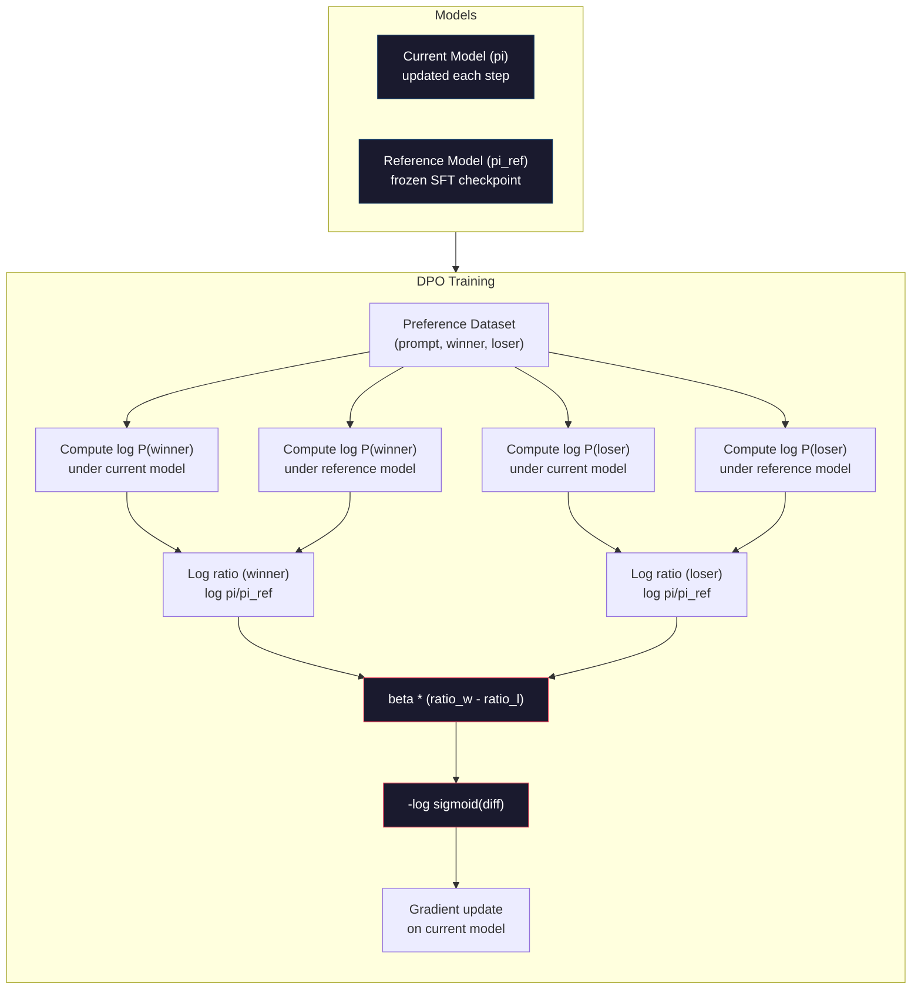

# DPO: Optimização direta de preferências

> RLHF tem efeito. Mas também precisa treinar três modelos (SFT, modelo de recompensa, política), gerir a instabilidade do PPO,并调节 KL penalty,──DPO 会问:

**Type:** Build
**Languages:** Python (with numpy)
**Prerequisites:** Phase 10, Lesson 07 (RLHF)
**Time:** ~90 分钟

## Objectivo de aprendizagem
-                                                                                                                                                                                                                                                                                                                                                                                                                                                                                                                              
- 推导 DPO Função de perda,并解释它如何通过政策的日志概率 隐式表示奖励模型
- A partir do ângulo de treinamento de estabilidade, custo de cálculo e número de modelos necessários, comparar DPO com RLHF
- 调节 beta 参数, controlar a política de formação 偏离参考模型的程度

## 问题
Você construiu um pipeline RLHF na lição 07── três fases── três modelos── modelo SFT、recompensação modelo, bem como modelo de política de optimização PPO ⋅ modelo de recompensa apenas, é necessário milhares de pares de preferências individuais 和 um ciclo de treinamento individual──PPO ⋅ precisa仔细调节 KL coeficiente、taxa de aprendizagem、clip ratio 和 épocas 数量──

Na prática, o treinamento da OPPO é chamado de "inestabilidade". Muitos pequenos hiperparâmetros podem mudar para levar ao treinamento. O modelo de recompensa é um agente imperfeito das preferências humanas, enquanto a política encontrará uma maneira de aproveitar suas fraquezas.

Esta complexidade explica por que, nos anos seguintes à publicação do InstructGPT, a maioria dos modelos de código aberto foi difícil de usar RLHF.

Em maio de 2023, Rafael Rafailov, de Stanford, Archit Sharma e seus colegas publicaram Direct Preference Optimization: Your Language Model Is Secretly a Reward Model──核心洞见是:你不需要单独的奖励模型──最优奖励功能 在数学上由语言模型自身的代币 概率决定── você pode completamente saltar o modelo de recompensa, diretamente em pares de preferências 上优语言模型──

O DPO simplificará o RLHF em um processo de aprendizagem supervisionada 步骤――一个模型――一个损失函数――一个训练循环――没有强化学学习――Zephyr-7B é um dos primeiros modelos de DPO a grande escala, em vários padrões de referência, acima de acompanhar ou superar o modelo de treinamento RLHF completo――Meta utilizou o DPO――Anthropic também em sua pesquisa de alinhamento em uma linha de alinhamento de Llama 3 mencionou métodos de estilo DPO―.

## 概念
### O principal conhecimento

RLHF 优化这个目标:

```
maximize: E[R(x, y)] - beta * KL(pi || pi_ref)
```

Entre eles, R é o modelo de recompensa, pi é a política, pi_ref é o modelo de referência, beta é o coeficiente KL。

O documento DPO prova, este objetivo existe encerrado ⇒ Optimal.

```
pi*(y | x) = pi_ref(y | x) * exp(R(x, y) / beta) / Z(x)
```

Entre eles, Z ((x) é um número regular de re-requilíbrio:

```
R(x, y) = beta * log(pi*(y | x) / pi_ref(y | x)) + beta * log Z(x)
```

É o que se passa com o modelo de remuneração: a probabilidade de uma política é expressa com a probabilidade de um modelo de referência.

Substitui-o para o modelo de preferência Bradley-Terry:

```
P(y_w > y_l | x) = sigmoid(R(x, y_w) - R(x, y_l))
                  = sigmoid(beta * (log pi(y_w|x)/pi_ref(y_w|x) - log pi(y_l|x)/pi_ref(y_l|x)))
```

Z(x) 项会抵消, pois duas respostas são do mesmo prompt x 为条件――剩下只是政策模型和参考模型 在喜欢与拒绝答案 上的日志概率的函数――

### A perda do DPO

```
L_DPO = -log(sigmoid(beta * (log pi(y_w|x)/pi_ref(y_w|x) - log pi(y_l|x)/pi_ref(y_l|x))))
```

Vamos desmontar cada parte:

- **y_w**= resposta preferida
- **y_l**= rejeitado (perdido) resposta
- **x**= rápido
- **pi**= 当前模型( está treinando)
- **pi_ref**= modelo de referência ((结的SFT checkpoint)
- **beta**= 控制偏离 度温度 参数(normalmente entre 0,1 e 0,5)

比值 `log pi(y|x) / pi_ref(y|x)`É a relação log-probabilidade. Quando este valor é válido, a probabilidade de resposta do modelo atual é maior do que a de referência.

DPO Loss vai impulsionar o modelo a aumentar a relação de log-probabilidade das respostas preferidas, e reduzir a relação de log-probabilidade das respostas rejeitadas.



### Por que o DPO é mais simples

| Aspect | RLHF (PPO) | DPO |
|--------|-----------|-----|
| 需要训练的模型 | 3（SFT + reward + policy） | 1（仅 policy） |
| Training loops | 3（SFT、RM training、PPO） | 2（SFT、DPO） |
| Hyperparameters | lr、KL coeff、clip ratio、RM lr、epochs x3 | lr、beta、epochs |
| Reward model | 必需（单独训练） | 隐式存在于模型概率中 |
| RL algorithm | PPO（复杂、不稳定） | Supervised learning（稳定） |
| GPU memory | PPO 期间内存中有 3-4 个模型 | 2 个模型（current + reference） |
| 训练稳定性 | 对 hyperparameters 敏感 | 稳健，类似 SFT |

O treinamento do DPO precisa colocar em memória dois modelos: modelo atual e referência. O RLHF precisa de três ou quatro: modelo de política, referência, recompensa, bem como função base de valor selecionável. Para o modelo 70B, cada edição no FP16 necessita de 140 GB.

### Quando o DPO vence o RLHF

**小数据集。**Em escala de 5.000-20.000 pares de preferências, o DPO geralmente pode acompanhar ou superar o RLHF. O modelo de recompensa no RLHF necessita de dados suficientes para se generalizar; quando o dados são limitados, ele se adapta e produz sinais de recompensa não confiáveis.

**计算资源有限。**DPO só precisa de um RLHF completo. Para um grupo sem grandes clusters de GPUs, é uma escolha mais prática.

**快速迭代。**想尝试 10 diferentes conjuntos de dados preferenciais,看看哪个能产生最佳模型?DPO 让你能在几个小时内完成每个实验――RLHF 则需要为每个数据集重新训练奖励模型――

### Quando a RLHF vence o DPO

**大规模训练。**Na escala do GPT-4 ou do Claude, o modelo de recompensa individual do RLHF pode capturar sinais de preferência mais detalhados.

**复杂 reward signals。**Quando se trata de várias dimensões (ajuda, inofensividade, honestidade), o modelo de recompensa pode ser aprendido com este tipo de balanço multi-objetivo.

**迭代式 alignment。**Os canais de RLHF podem usar a política atual para gerar novas respostas, fazer o homem avaliar, e depois re-treinar o modelo de recompensa em um ciclo online.

### DPO 之外: KTO, ORPO, SimPO

O DPO iniciou uma série de métodos de alinhamento simplificados.

**KTO (Kahneman-Tversky Optimization, 2024)：**Você nem precisa fazer parte do conjunto de dados. Utilize un配对反: apenas precisa marcar cada resposta good ou bad, e não precisa compará-la com outra alternativa. Isso simplifica significativamente a coleta de dados. Não é para o marcador mostrar duas respostas e perguntar qual é melhor?, mas para mostrar uma resposta e perguntar se é bom?Loss Function  aplicou a perda na teoria da perspectiva: respostas ruins são castigadas por serem maiores do que boas respostas  obtendo recompensas

**ORPO (Odds Ratio Preference Optimization, 2024)：**O ORPO não é primeiro fazer o SFT e fazer o DPO, mas modificar o SFT Loss, fazendo com que contenha o sinal de preferência.

**SimPO (Simple Preference Optimization, 2024)：**完全取消引用模型──SIMPO 不再针对结的引用──计算 log-probability ratios,而是使用答案的平均 log-probability──按长度归结) 作为隐式回报──这省内存──不需要引用模型──并简化训练──长度归结防止模型偏好更短的答案──

| Method | Year | Models in Memory | Needs Pairs? | Needs Reference? | Training Loops |
|--------|------|-----------------|-------------|-----------------|----------------|
| RLHF | 2022 | 3-4 | Yes（用于 RM） | Yes | 3 |
| DPO | 2023 | 2 | Yes | Yes | 2 |
| KTO | 2024 | 2 | No（未配对） | Yes | 2 |
| ORPO | 2024 | 1 | Yes | No | 1 |
| SimPO | 2024 | 1 | Yes | No | 1 |

 Tendências são claras: cada método elimina uma parte da complexidade. RLHF  precisa de um modelo de recompensa e PPO  DPO  elimina o segundo. KTO  elimina o conjunto de dados  ORPO  elimina o SFT  fase individual. SimPO  elimina o modelo de referência                                                                                                                                                                                                                                                                                                                                                                                                                                                            

### Deploições reais de DPO

**Zephyr-7B (HuggingFace, October 2023)：**Em base em Mistral 7B base, em UltraChat ((200K exemplos) fazer SFT, em seguida, em UltraFeedback ((60K pares de preferência) fazer DPO. Em MT-Bench acima de pontuação 6.47, é o maior 7B modelo de então. Em comparação, Llama 2 Chat 70B obter 6.86, o que significa Zephyr  apenas com alinhamento DPO, alcançar um maior 10 vezes modelo 6% em nível interno.

**Llama 3 (Meta, April 2024)：**Na fase inicial do RLHF, a combinação indica que o DPO e o RLHF podem ser complementados: o RLHF é usado para um alinhamento amplo, o DPO é usado para um aperfeiçoamento específico.

**Neural Magic / nm-chat (2024)：**A DPO é aplicada a vários modelos de código aberto, e demonstra-se de forma estável uma melhoria relativamente a apenas a linha de base da SFT nos benchmarks de alinhamento acima de 5-15%:


```figure
dpo-loss
```

## Construí-lo
### 步骤 1: Preferência conjunto de dados

Com RLHF Use the same format: ((pronto, preferido, rejeitado) 三元组──DPO 直接消费这些数据,不需要中间的奖励模型──

```python
import numpy as np
import sys
import os
sys.path.insert(0, os.path.join(os.path.dirname(__file__), "..", "..", "04-pre-training-mini-gpt", "code"))
from main import MiniGPT, LayerNorm, Embedding, TransformerBlock

PREFERENCE_DATA = [
    {
        "prompt": "What is the capital of France?",
        "preferred": "The capital of France is Paris.",
        "rejected": "France is a country in Europe. It has many cities. The capital is Paris. Paris is known for the Eiffel Tower.",
    },
    {
        "prompt": "Explain gravity in one sentence.",
        "preferred": "Gravity is the force that attracts objects with mass toward each other.",
        "rejected": "Gravity is something that makes things fall down when you drop them.",
    },
    {
        "prompt": "What is 15 times 7?",
        "preferred": "15 times 7 is 105.",
        "rejected": "Let me think about this. 15 times 7. Well, 10 times 7 is 70, and 5 times 7 is 35, so the answer might be around 105.",
    },
    {
        "prompt": "Name three programming languages.",
        "preferred": "Python, Rust, and TypeScript.",
        "rejected": "There are many programming languages. Some popular ones include various languages like Python and others.",
    },
    {
        "prompt": "What year did World War II end?",
        "preferred": "World War II ended in 1945.",
        "rejected": "World War II was a major global conflict. It involved many countries. The war ended in the mid-1940s, specifically in 1945.",
    },
    {
        "prompt": "Define machine learning.",
        "preferred": "Machine learning is a field where algorithms learn patterns from data to make predictions without being explicitly programmed.",
        "rejected": "Machine learning is a type of AI. AI stands for artificial intelligence. Machine learning uses data to learn.",
    },
]
```

### 步骤 2: Segurança de sequência

DPO Loss 需要计算给定提示时某个响应的总日记概率──这意味着要在完整的(快速+响应)序列上运行模型,并对每个响应代币的日记概率求和──

```python
def tokenize_sequence(text, vocab_size=256):
    return [min(t, vocab_size - 1) for t in list(text.encode("utf-8"))]


def compute_sequence_log_prob(model, prompt_tokens, response_tokens, max_seq_len=128):
    full_sequence = prompt_tokens + response_tokens
    if len(full_sequence) > max_seq_len:
        full_sequence = full_sequence[:max_seq_len]

    if len(full_sequence) < 2:
        return 0.0

    input_ids = np.array(full_sequence[:-1]).reshape(1, -1)
    target_ids = np.array(full_sequence[1:])

    logits = model.forward(input_ids)
    logits = logits[0]

    max_logits = logits.max(axis=-1, keepdims=True)
    log_probs = logits - max_logits - np.log(
        np.exp(logits - max_logits).sum(axis=-1, keepdims=True)
    )

    prompt_len = len(prompt_tokens)
    response_start = max(0, prompt_len - 1)
    response_end = len(target_ids)

    if response_start >= response_end:
        return 0.0

    response_log_probs = log_probs[response_start:response_end, :]
    response_targets = target_ids[response_start:response_end]

    total_log_prob = 0.0
    for i, target in enumerate(response_targets):
        total_log_prob += response_log_probs[i, target]

    return total_log_prob
```

Esta função é o instrumento central do DPO. Para cada par de preferências, ela vai funcionar quatro vezes: modelo 计算 preferência resposta, modelo 计算 rejeitada resposta, referência 计算 preferência resposta, referência 计算 rejeitada resposta.

### 步骤 3: A perda do DPO

论文核心用代码表示──一函数──一 Loss──不需要奖励模型──

```python
def sigmoid(x):
    return np.where(
        x >= 0,
        1.0 / (1.0 + np.exp(-x)),
        np.exp(x) / (1.0 + np.exp(x))
    )


def dpo_loss(policy_logprob_preferred, policy_logprob_rejected,
             ref_logprob_preferred, ref_logprob_rejected, beta=0.1):
    preferred_ratio = policy_logprob_preferred - ref_logprob_preferred
    rejected_ratio = policy_logprob_rejected - ref_logprob_rejected

    logit = beta * (preferred_ratio - rejected_ratio)

    loss = -np.log(sigmoid(logit) + 1e-8)

    preferred_reward = beta * preferred_ratio
    rejected_reward = beta * rejected_ratio

    return loss, {
        "preferred_ratio": float(preferred_ratio),
        "rejected_ratio": float(rejected_ratio),
        "logit": float(logit),
        "implicit_preferred_reward": float(preferred_reward),
        "implicit_rejected_reward": float(rejected_reward),
        "reward_margin": float(preferred_reward - rejected_reward),
    }
```

`preferred_ratio`和 `rejected_ratio`É o DPO 推导中的 log-probability ratios。当前模型相对于参考) para resposta preferida 分配更高概率,并为拒绝反应 分配更低概率时,logit 为正,Loss 较低──训练信号正是把模型推向这个方向──

`implicit_preferred_reward`和 `implicit_rejected_reward`O DPO Loss  Hidden distribuir recompensas  Você pode extrair-las para verificar se o treinamento é eficaz: a margem entre recompensas preferidas e rejeitadas    deve aumentar no processo de treinamento 

### 步骤 4: Loop de formação do DPO

Um ciclo de treinamento supervisionado padrão. Não há PPO. Não há modelo de recompensa.

```python
def copy_model_weights(source, target):
    target.embedding.token_embed = source.embedding.token_embed.copy()
    target.embedding.pos_embed = source.embedding.pos_embed.copy()
    target.ln_f.gamma = source.ln_f.gamma.copy()
    target.ln_f.beta = source.ln_f.beta.copy()
    for s_block, t_block in zip(source.blocks, target.blocks):
        t_block.attn.W_q = s_block.attn.W_q.copy()
        t_block.attn.W_k = s_block.attn.W_k.copy()
        t_block.attn.W_v = s_block.attn.W_v.copy()
        t_block.attn.W_out = s_block.attn.W_out.copy()
        t_block.ffn.W1 = s_block.ffn.W1.copy()
        t_block.ffn.W2 = s_block.ffn.W2.copy()
        t_block.ffn.b1 = s_block.ffn.b1.copy()
        t_block.ffn.b2 = s_block.ffn.b2.copy()
        t_block.ln1.gamma = s_block.ln1.gamma.copy()
        t_block.ln1.beta = s_block.ln1.beta.copy()
        t_block.ln2.gamma = s_block.ln2.gamma.copy()
        t_block.ln2.beta = s_block.ln2.beta.copy()


def dpo_train(policy_model, reference_model, preference_data,
              num_epochs=5, lr=5e-6, beta=0.1, max_seq_len=128):
    print(f"DPO Training: {len(preference_data)} pairs, {num_epochs} epochs, "
          f"lr={lr}, beta={beta}")
    print()

    losses = []
    margins = []

    for epoch in range(num_epochs):
        epoch_loss = 0.0
        epoch_margin = 0.0
        num_examples = 0

        indices = np.random.permutation(len(preference_data))

        for idx in indices:
            pair = preference_data[idx]

            prompt_tokens = tokenize_sequence(pair["prompt"])
            preferred_tokens = tokenize_sequence(pair["preferred"])
            rejected_tokens = tokenize_sequence(pair["rejected"])

            pi_logprob_w = compute_sequence_log_prob(
                policy_model, prompt_tokens, preferred_tokens, max_seq_len
            )
            pi_logprob_l = compute_sequence_log_prob(
                policy_model, prompt_tokens, rejected_tokens, max_seq_len
            )
            ref_logprob_w = compute_sequence_log_prob(
                reference_model, prompt_tokens, preferred_tokens, max_seq_len
            )
            ref_logprob_l = compute_sequence_log_prob(
                reference_model, prompt_tokens, rejected_tokens, max_seq_len
            )

            loss, metrics = dpo_loss(
                pi_logprob_w, pi_logprob_l,
                ref_logprob_w, ref_logprob_l, beta
            )

            update_direction = 1.0 if metrics["logit"] < 0 else -0.1
            for block in policy_model.blocks:
                block.ffn.W1 += lr * update_direction * np.random.randn(*block.ffn.W1.shape) * 0.01
                block.ffn.W2 += lr * update_direction * np.random.randn(*block.ffn.W2.shape) * 0.01

            epoch_loss += loss
            epoch_margin += metrics["reward_margin"]
            num_examples += 1
            losses.append(float(loss))
            margins.append(metrics["reward_margin"])

        avg_loss = epoch_loss / max(num_examples, 1)
        avg_margin = epoch_margin / max(num_examples, 1)

        print(f"  Epoch {epoch + 1}/{num_epochs} | Loss: {avg_loss:.4f} | "
              f"Avg Margin: {avg_margin:.4f}")

    return policy_model, losses, margins
```

Comparado com RLHF, este ciclo de treinamento 简洁得令人耳目一新── para cada par de preferências: calcular quatro log-probabilidades(dois modelos、 duas respostas), irá incorporá-las em DPO Loss, calcular Gradient, actualizar a política── não há etapa de geração── não há dedução do modelo de recompensa── não há estimativa de vantagem── não há clipping──

### 步骤 5: Comparar DPO vs RLHF

测量隐式奖励率和 log-probability shifts,将 DPO comparar com o modelo RLHF do lecionamento 07 中

```python
def evaluate_preference_accuracy(model, reference_model, preference_data, beta=0.1, max_seq_len=128):
    correct = 0
    total = 0

    for pair in preference_data:
        prompt_tokens = tokenize_sequence(pair["prompt"])
        preferred_tokens = tokenize_sequence(pair["preferred"])
        rejected_tokens = tokenize_sequence(pair["rejected"])

        pi_w = compute_sequence_log_prob(model, prompt_tokens, preferred_tokens, max_seq_len)
        pi_l = compute_sequence_log_prob(model, prompt_tokens, rejected_tokens, max_seq_len)
        ref_w = compute_sequence_log_prob(reference_model, prompt_tokens, preferred_tokens, max_seq_len)
        ref_l = compute_sequence_log_prob(reference_model, prompt_tokens, rejected_tokens, max_seq_len)

        preferred_reward = beta * (pi_w - ref_w)
        rejected_reward = beta * (pi_l - ref_l)

        if preferred_reward > rejected_reward:
            correct += 1
        total += 1

    return correct / max(total, 1)


def analyze_implicit_rewards(model, reference_model, preference_data, beta=0.1, max_seq_len=128):
    print("Implicit Reward Analysis:")
    print("-" * 65)
    print(f"  {'Prompt':<30} {'Pref Reward':>12} {'Rej Reward':>12} {'Margin':>10}")
    print("  " + "-" * 60)

    for pair in preference_data:
        prompt_tokens = tokenize_sequence(pair["prompt"])
        preferred_tokens = tokenize_sequence(pair["preferred"])
        rejected_tokens = tokenize_sequence(pair["rejected"])

        pi_w = compute_sequence_log_prob(model, prompt_tokens, preferred_tokens, max_seq_len)
        pi_l = compute_sequence_log_prob(model, prompt_tokens, rejected_tokens, max_seq_len)
        ref_w = compute_sequence_log_prob(reference_model, prompt_tokens, preferred_tokens, max_seq_len)
        ref_l = compute_sequence_log_prob(reference_model, prompt_tokens, rejected_tokens, max_seq_len)

        pref_reward = beta * (pi_w - ref_w)
        rej_reward = beta * (pi_l - ref_l)
        margin = pref_reward - rej_reward

        truncated = pair["prompt"][:28] + ".." if len(pair["prompt"]) > 30 else pair["prompt"]
        print(f"  {truncated:<30} {pref_reward:>12.4f} {rej_reward:>12.4f} {margin:>10.4f}")

    print()
```

### 步骤 6: Análise de sensibilidade beta

O beta 参数 é o DPO 中对应 RLHF 里 KL coeficiente. O modelo de controle pode ser desviado da referência.

```python
def beta_sensitivity_analysis(sft_model, preference_data, betas, max_seq_len=128):
    print("Beta Sensitivity Analysis")
    print("-" * 60)
    print(f"  {'Beta':>8} {'Final Loss':>12} {'Final Margin':>14} {'Accuracy':>10}")
    print("  " + "-" * 55)

    results = []

    for beta in betas:
        policy = MiniGPT(
            vocab_size=256, embed_dim=128, num_heads=4,
            num_layers=4, max_seq_len=max_seq_len, ff_dim=512
        )
        reference = MiniGPT(
            vocab_size=256, embed_dim=128, num_heads=4,
            num_layers=4, max_seq_len=max_seq_len, ff_dim=512
        )
        copy_model_weights(sft_model, policy)
        copy_model_weights(sft_model, reference)

        policy, losses, margins_list = dpo_train(
            policy, reference, preference_data,
            num_epochs=3, lr=5e-6, beta=beta, max_seq_len=max_seq_len
        )

        accuracy = evaluate_preference_accuracy(
            policy, reference, preference_data, beta, max_seq_len
        )

        final_loss = losses[-1] if losses else 0
        final_margin = margins_list[-1] if margins_list else 0

        print(f"  {beta:>8.3f} {final_loss:>12.4f} {final_margin:>14.4f} {accuracy:>10.1%}")
        results.append({
            "beta": beta,
            "final_loss": final_loss,
            "final_margin": final_margin,
            "accuracy": accuracy,
        })

        print()

    return results
```

较小的beta(0.01) permite que o modelo livre de desvio de referência: aprender rápido, mas com um risco de degradação.

## Use-o
### Demo completo do oleoduto DPO

```python
if __name__ == "__main__":
    np.random.seed(42)

    print("=" * 70)
    print("DPO: DIRECT PREFERENCE OPTIMIZATION")
    print("=" * 70)
    print()

    print("STEP 1: Initialize SFT Model (from Lesson 06)")
    print("-" * 50)
    sft_model = MiniGPT(
        vocab_size=256, embed_dim=128, num_heads=4,
        num_layers=4, max_seq_len=128, ff_dim=512
    )
    print(f"  Parameters: {sft_model.count_parameters():,}")
    print()

    print("STEP 2: DPO Training")
    print("-" * 50)

    policy_model = MiniGPT(
        vocab_size=256, embed_dim=128, num_heads=4,
        num_layers=4, max_seq_len=128, ff_dim=512
    )
    reference_model = MiniGPT(
        vocab_size=256, embed_dim=128, num_heads=4,
        num_layers=4, max_seq_len=128, ff_dim=512
    )
    copy_model_weights(sft_model, policy_model)
    copy_model_weights(sft_model, reference_model)

    policy_model, losses, margins = dpo_train(
        policy_model, reference_model, PREFERENCE_DATA,
        num_epochs=5, lr=5e-6, beta=0.1
    )
    print()

    print("=" * 70)
    print("STEP 3: Evaluate")
    print("=" * 70)
    print()

    pre_accuracy = evaluate_preference_accuracy(
        sft_model, reference_model, PREFERENCE_DATA, beta=0.1
    )
    post_accuracy = evaluate_preference_accuracy(
        policy_model, reference_model, PREFERENCE_DATA, beta=0.1
    )

    print(f"  Preference accuracy (pre-DPO):  {pre_accuracy:.1%}")
    print(f"  Preference accuracy (post-DPO): {post_accuracy:.1%}")
    print()

    analyze_implicit_rewards(policy_model, reference_model, PREFERENCE_DATA, beta=0.1)

    print("=" * 70)
    print("STEP 4: Training Dynamics")
    print("=" * 70)
    print()

    if losses:
        print("  Loss curve:")
        window = max(1, len(losses) // 5)
        for i in range(0, len(losses), window):
            chunk = losses[i:i + window]
            avg = sum(chunk) / len(chunk)
            print(f"    Steps {i:3d}-{i + len(chunk) - 1:3d}: loss = {avg:.4f}")
        print()

    if margins:
        print("  Reward margin curve:")
        window = max(1, len(margins) // 5)
        for i in range(0, len(margins), window):
            chunk = margins[i:i + window]
            avg = sum(chunk) / len(chunk)
            print(f"    Steps {i:3d}-{i + len(chunk) - 1:3d}: margin = {avg:.4f}")
        print()

    print("=" * 70)
    print("STEP 5: Beta Sensitivity")
    print("=" * 70)
    print()

    beta_results = beta_sensitivity_analysis(
        sft_model, PREFERENCE_DATA, betas=[0.01, 0.1, 0.3, 1.0]
    )

    print("=" * 70)
    print("DPO vs RLHF COMPARISON")
    print("=" * 70)
    print()
    print("  DPO advantages:")
    print("    - 1 training loop (vs 3 for RLHF)")
    print("    - 2 models in memory (vs 3-4 for RLHF)")
    print("    - Supervised learning (vs RL, more stable)")
    print("    - No reward model to train or maintain")
    print()
    print("  RLHF advantages:")
    print("    - Separate reward model captures complex preferences")
    print("    - Online learning: generate, rate, retrain")
    print("    - Better for multi-objective alignment")
    print("    - Proven at largest scales (GPT-4, Claude)")
    print()
    print("  Practical guidance:")
    print("    - Start with DPO. It's simpler and often sufficient.")
    print("    - Switch to RLHF if DPO plateaus on your eval metrics.")
    print("    - Many production systems use both: RLHF first, DPO to refine.")
```

## Entrega-o
本课会产出 `outputs/prompt-alignment-method-selector.md`Um exemplo é: um que te ajude a escolher o alinhamento correto 方法(SFT、RLHF、DPO、KTO、ORPO、SimPO) de um exemplo.

## 练习
1.  Realizar KTO (Kahneman-Tversky Optimization) ・ KTO não precisa de dados, só precisa de marcar cada resposta  bom ou  ruim── perda de boa resposta é `-log(sigmoid(beta * log_ratio))`, má resposta de perda é`-log(1 - sigmoid(beta * log_ratio))`,并对不良反应 Loss 使用损失厌恶乘数(normalmente 1,5x) ・・・ 在同一份数据上训练(分别将优先 当作好、拒绝 当作坏),并与DPO比较精度──

2. 实现 DPO-normalizado de comprimento― não usar probabilidades de logs originais, mas, em vez disso, a quantidade de tokens de resposta:`normalized_logprob = total_logprob / num_tokens` Isso pode evitar que os modelos prefiram respostas mais curtas

3. 构建一个ORPO 风格的组合损失──向DPO Loss 中添加首选响应 上的标准下一个代码预测损失:`L = L_sft(preferred) + alpha * L_dpo` tentar 0.1、0.5 和 1.0 ′ alfa 值── perda combinada 应产生一个既能遵循指令 () 来自 SFT 项 () 则偏好更好的反应 () 来自 DPO 项 () 的模型,从而消除对单独 SFT 阶段的需求──

4.  implementar DPO iterativo── executar DPO 3 个时代, em seguida, a partir do modelo de treinamento posterior gerar novas respostas, compará-las com as respostas preferenciais originais 配对为新偏好对, novamente executar DPO── executar duas rochas deste self-play流程── comparar a precisão de preferência da 1a rodada e da 2a rodada posterior, ver se o aperfeiçoamento da geração 有助之之.

5. Comparar com diferentes modelos de referência de DPO── não usar o ponto de verificação SFT como referência, mas tentar: a) modelo base pre-SFT), b) ponto de verificação da primeira fase do DPO, c) média móvel exponencial do modelo de política── relatar qual referência   produz a maior precisão de preferência 和 a mais estável curva de treinamento──

## 关键术语
| Term | What people say | What it actually means |
|------|----------------|----------------------|
| DPO | “没有 RL 的 RLHF” | Direct Preference Optimization：一种 supervised learning algorithm，直接在 preference pairs 上优化语言模型，绕过 reward model 和 PPO |
| Implicit reward | “reward 在模型里” | reward function 由 policy 与 reference models 之间的 log-probability ratio 决定，不需要单独的 reward model |
| Beta (DPO) | “temperature” | 控制 policy 可以偏离 reference model 的程度：小 beta 允许大偏离，大 beta 让模型保持接近 |
| Log-probability ratio | “模型变化了多少” | log pi(y\|x) - log pi_ref(y\|x)：正值表示当前模型分配的概率高于 reference |
| Reference model | “冻结的 checkpoint” | SFT model 的一个副本，其 weights 永不改变，用作计算概率比的锚点 |
| KTO | “没有成对数据的 DPO” | Kahneman-Tversky Optimization：使用未配对的“good”或“bad”labels，而不是要求 preference pairs |
| ORPO | “一步 alignment” | Odds Ratio Preference Optimization：通过向 SFT Loss 添加 preference term，将 SFT 和 alignment 合并到单个 training loop |
| SimPO | “不需要 reference” | Simple Preference Optimization：通过使用长度归一化的平均 log-probability 作为隐式 reward，消除 reference model |
| Alignment tax | “让模型安全的成本” | 从 base model 到 aligned model 所需的额外计算、数据和复杂性；DPO 显著降低了这一成本 |

## 延伸阅读
- [Rafailov et al., 2023 -- "Direct Preference Optimization: Your Language Model is Secretly a Reward Model"](https://arxiv.org/abs/2305.18290)-- Alignar do RLHF  Simplificação para aprendizagem supervisionada
- [Tunstall et al., 2023 -- "Zephyr: Direct Distillation of LM Alignment"](https://arxiv.org/abs/2310.16944)- Zephyr-7B, mostrou o ultrafeedback superior do DPO em benchmarks acima de RLHF
- [Ethayarajh et al., 2024 -- "KTO: Model Alignment as Prospect Theoretic Optimization"](https://arxiv.org/abs/2402.01306)--  eliminando a necessidade de preferências
- [Hong et al., 2024 -- "ORPO: Monolithic Preference Optimization without Reference Model"](https://arxiv.org/abs/2403.07691)-- 将 SFT 和 alignment 合并为一步
- [Meng et al., 2024 -- "SimPO: Simple Preference Optimization with a Reference-Free Reward"](https://arxiv.org/abs/2405.14734)-- completamente eliminar o modelo de referência
- [Llama 3 Technical Report](https://arxiv.org/abs/2407.21783)-- Meta 结合 RLHF e DPO de alinhamento de pipeline
