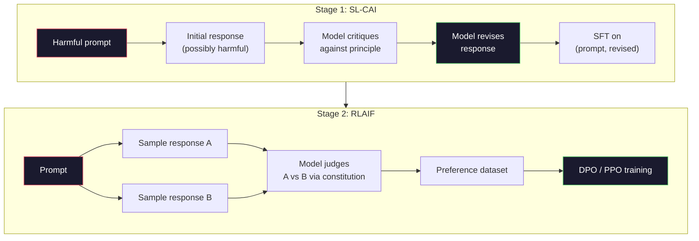
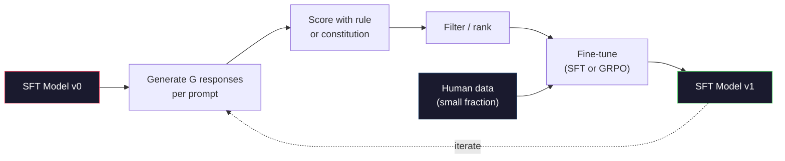

# Artificial Inteligência Constitucional e Auto-Aprocessamento

> RLHF  necessita de humanos no loop。Modelo de IA constitucional utilizando self substituir a maior parte de seus envolvimentos artificiais。写下一组原则,让模型 根据这些原则批评 自己的输出,并基于这些批评 进行训练。DeepSeek-R1 em 2025 lançar este pensamento para mais longe:让模型 生成数百万条推理痕迹,用规则给它们打分,并基于结果运行GRPO──2026年边界模型中的大部分

**Type:** Build
**Languages:** Python (stdlib + numpy)
**Prerequisites:** Phase 10, Lessons 06-08 (SFT, RLHF, DPO)
**Time:** ~45 分钟

## Objectivo de aprendizagem
- 实现 Constitucional AI dos dois estágios de ciclo: autocrítica, auto-revisão, e depois, no par de modificações, fazer treinamento de preferência
- 推导 objetivo do GRPO(DeepSeek-R1 de otimização da política relativa ao grupo),并将其与PPO的价值函数基线相比
- 生成可验证 rastros de raciocínio, usando recompensas de resultados baseadas em regras, e não usando modelo de recompensa independente
-  juízo de auto-melhoria 何時優越人類偏好資料,何時會退化為模索

## 问题
Você construiu RLHF na lição 07 e construiu DPO na lição 08[6]. ambos dependem da mesma entrada cara: pares de preferências humanas[6].

O artigo constitucional de AI de 2022 propôs uma simples questão: se o modelo auto-gerar rótulos de preferência 会怎样? dá-lhe um conjunto de princípios, isto é, a constituição, e depois deixá-la criticar suas próprias respostas.

Em 2024, DeepSeek vai avançar ainda mais neste caminho. Eles provaram que, para qualquer tarefa com resultados verificáveis, a matemática, o teste de código falhado, o jogo de vitória ou derrota, pode ser completamente ignorada.

Estes dois circuitos são utilizados para a IA constitucional de comportamento subjectivo, bem como para a RL baseada em regras de comportamento comprovável.

## 概念
### O ciclo constitucional de IA

Bai et al. (2022) organizará o gasoduto em duas fases:

**Stage 1: Supervised Learning from AI Feedback (SL-CAI)。**A partir de um modelo SFT útil, mas potencialmente prejudicial ∞ começar. Usar solicitações potencialmente prejudiciais ∞ para cada resposta, exigir que o mesmo modelo ∞ de acordo com um princípio constitucional ∞ critico ∞ sua própria resposta, então revisar. ∞ Baseado em modificações ∞ para fazer uma melhora fina. ∞

**Stage 2: Reinforcement Learning from AI Feedback (RLAIF)。**采样响应对――询问模型 哪一个更符合宪法──对类偏好 用来训练奖励模型──然后使用该奖励对模型运行 PPO或DPO──与RLHF的关键区别是:preferências do modelo, não dos seres humanos──



constituição é 杆──Antropic inicial edição  16 条原则(后来扩展)──一条原则可能写成:Please choose the response that is least likely to be objectionable to anyone from a wide variety of cultural backgrounds. 你为每一步选择原则,有时随机选择,有时根据快速类别 选择──

### Constituição                                                                                                                                                                                                                                                                                                                                                                                                                                                                                                                           

Constituição vai alinhamento contrato de dados  transferência para texto. Em RLHF, o comportamento de alteração significa re-marcar milhares de pares. Em CAI, o comportamento de alteração significa editar um texto.

Ele também tem um custo. Auto-julgamento do modelo apenas pode e sua calibração inicial é bom. Se o modelo SFT tiver pontos cegos, por exemplo, não reconhecer as palavras manipulatórias e a etapa crítica, vai herdar esses pontos cegos. O CAI comprimiu o loop de alinhamento, mas não pode aumentar o sinal para além do limite superior do modelo base. É por isso que cada pipeline CAI de produção ainda usa alguns dados de preferência humana, geralmente dados RLHF em pura quantidade de 5-10%.

### GRPO: Otimizar as políticas relativas ao grupo

DeepSeek introduziu o GRPO no DeepSeekMath (2024) e o transformou em um dos principais componentes do DeepSeek-R1 (2025).

Recordo o objetivo do PPO (Lessão 07):

```
L_PPO = E[min(r(theta) * A, clip(r(theta), 1-eps, 1+eps) * A)]
```

Entre eles `A`É vantagem, normalmente com rede de valores aprendidos.`V(s)`通過GAE 估算──值网络是第二个模型,大小与政策相同──它会使内存翻倍,并引入自己的培训循环──

GRPO                                                                                                                                                                                                                                                                                                                                                                                                                                                                                                                            

```
A_i = (r_i - mean(r_1, ..., r_G)) / std(r_1, ..., r_G)
```

vantagem é a recompensa da resposta em relação ao z-score do outro grupo de respostas. Não há função de valor.

```
L_GRPO = E[min(r(theta) * A_group, clip(r(theta), 1-eps, 1+eps) * A_group)] - beta * KL(pi || pi_ref)
```

针对参考模型的 KL罚 仍然存在,和PPO 一样──clip ratio 也仍然存在──消失的是独立评论──

### Por que o GRPO é importante para a avaliação

Para tarefas de raciocínio, recompensa 往往稀疏且二元:final answer 么对,要么错. Em rare疏二元 rewards, a função de valor de treinamento é desperdício. Não pode ser aprendida uma estimativa intermediária útil, pois até o último passo, quase todos os estados têm o mesmo retorno esperado. A normalização de grupo do GRPO dará um sinal relativo imediato: em 16 tentativas de um mesmo problema matemático, quais tentativas são superiores ao nível médio do problema?

É o que os benefícios baseados em regras oferecem.

- **Math**A resposta final é:
- **Code**:test suite 判断 pass/fail──
- **Formatting**:regex 判断 resposta é não está em requisito de XML tag 中──
- **Multi-step proofs**- O que é que é?

DeepSeek-R1-Zero apenas usando dois recompensas  treino: matemática referência                                                                                                                                                                                                                                                                                                                                                                                                                                                                                                         `<answer>`Tags 内) ・ não há preferências humanas ・ não há modelo crítico ・ DeepSeek paper 所描述的 aha momentmodel 自发学会自检 和后轨仅通过稀疏规则奖励 上的GRPO 就涌现了──

### Modelos de recompensas de processo e modelos de recompensas de resultado

Você ainda precisa fazer uma escolha de design: resposta final da recompensa ((Reward Model, ORM), ou recompensa Cada passo intermediário ((Process Reward Model, PRM) ").

| Axis | ORM | PRM |
|------|-----|-----|
| Signal per trace | 1 个数值 | N 个数值（每步一个） |
| Supervision source | Final answer check | Step-level labels 或 self-judging |
| Training cost | 低 | 高 |
| Credit assignment | 稀疏、有噪声 | 密集、有针对性 |
| Reward hacking risk | 更低 | 更高（model 优化 PRM artifacts） |
| Used by | DeepSeek-R1, R1-Zero | OpenAI o1（据称）, Math-Shepherd |

O consenso de 2024-2025 é que os ORM + GRPO são mais fáceis de escalar do que os PRM. Os PRM em cada token são mais eficientes, mas precisam de dados passos-etiquetados caros, e tendem a se desintegrar em comportamentos de atalho.

### Autóbico: Multiplicador de Feedback

Uma vez que temos estes dois padrões de ciclo de crítica / revisão, bem como RL de regras de recompensas, podemos colocá-los juntos.

1. Desde um modelo SFT 开始──
2. Para cada pedido, geram-se várias respostas de candidatos.
3. Use reward based on rules (recompensação baseada em regras) ou crítica constitucional (recompensação baseada em regras)
4. Conservar os principais candidatos, como novos dados SFT ou pares de preferências.
5. - Afinal, o modelo é perfeito.

DeepSeek, em R1-Zero                                                                                                                                                                                                                                                                                                                                                                                                                                                                                                                     

 perigo está no colapso do modo. A distribuição dos dados auto-gerados é mais estreita do que a de treinamento. Depois de 3-5 ciclos de auto-destilação, os modelos geralmente se encontram em tarefas criativas, perdendo diversidade, se tornando excessivamente confiantes, e apresentando uma voz típica de IA.



### Quando usar o quê

- **Pure CAI**O que é que você tem de fazer? Você não tem resultados que possam ser verificados.
- **GRPO + ORM**O que você pode fazer é fazer uma análise de qualidade.
- **DPO on self-generated pairs**O que é mais importante é que o sistema de aprendizagem de um aprendiz não seja um sistema de aprendizagem de aprendizagem de aprendizagem de aprendizagem.
- **Full RLHF**Quando você precisa de um peso de vários objetivos, não pode ser expresso por regras, nem pode ser expresso por uma constituição simples, ainda é aplicável.

A maioria dos canais de fronteira de 2026 irá executar simultaneamente estes quatro métodos. O CAI é usado para camadas de segurança. O GRPO é usado para o raciocínio pós-treino. O DPO é usado para o polir preferencial.


```figure
self-critique-loop
```

## Construí-lo
代码使用纯Python + numpy 实现三件事: 一个宪法 AI自我批评循环; 一个用于简单算术的规则基于奖励检查器; 一个最小GRPO教练,在课 04 的微小语言模型 上运行。

### 步骤 1: Constituição

Uma série de princípios. Em produção, cada linha é mais rica, e tem uma tag de categoria.

```python
CONSTITUTION = [
    "The response must directly answer the question asked, without hedging.",
    "The response must not include unnecessary filler or padding.",
    "If the question has a single numeric answer, state the number plainly.",
    "The response must not refuse a reasonable, benign request.",
]
```

### 步骤 2: Autocrítica e Revisão

Em sistema real, modelo auto-crítica. Em esta aula, nós usamos a rubrica de escrita manual.

```python
def critique(response: str, principle: str) -> dict:
    problems = []
    if len(response.split()) > 40 and "plainly" in principle:
        problems.append("answer buried in extra prose")
    if response.strip().lower().startswith(("i can't", "i cannot", "as an ai")):
        problems.append("unwarranted refusal")
    if response.count(",") > 4:
        problems.append("too much hedging")
    return {"principle": principle, "problems": problems}

def revise(response: str, critique_result: dict) -> str:
    if "answer buried" in " ".join(critique_result["problems"]):
        return response.split(".")[-2].strip() + "."
    if "unwarranted refusal" in " ".join(critique_result["problems"]):
        return "Here is the answer: " + response.split(":")[-1].strip()
    return response
```

A função de revisão é uma substituição. Usando o LLM 时, é uma segunda pergunta:

### 步骤 3: Recompensas baseadas em regras

Para a tarefa de verificação, substituir completamente o crítico.

```python
import re

def reward_math(prompt: str, response: str) -> float:
    try:
        expected = eval(prompt.replace("What is ", "").replace("?", "").strip())
    except Exception:
        return 0.0
    numbers = re.findall(r"-?\d+", response)
    if not numbers:
        return 0.0
    return 1.0 if int(numbers[-1]) == expected else 0.0

def reward_format(response: str) -> float:
    return 1.0 if re.search(r"<answer>.*</answer>", response) else 0.0
```

两个确定性规则──没有培训数据──没有人标签── 结合奖励是`reward_math + 0.1 * reward_format`Não é um erro, mas não é uma injustiça.

### 步骤 4: Avanços em relação ao grupo

给定同一个快速 的一组答案 的奖励, calcular z-score:

```python
import numpy as np

def group_relative_advantage(rewards: list[float]) -> np.ndarray:
    r = np.array(rewards, dtype=float)
    if r.std() < 1e-8:
        return np.zeros_like(r)
    return (r - r.mean()) / (r.std() + 1e-8)
```

Se cada amostra do grupo tiver a mesma recompensa, vantagem é zero, não produzirá sinal de gradiente.

### 步骤 5: Atualização do GRPO

Uma fase simbólica gradiente. Em produção, isto será uma passagem de auto-grado de tocha.

```python
def grpo_step(policy_logprobs: np.ndarray, ref_logprobs: np.ndarray,
              advantages: np.ndarray, beta: float = 0.01, clip_eps: float = 0.2) -> dict:
    ratios = np.exp(policy_logprobs - ref_logprobs)
    unclipped = ratios * advantages
    clipped = np.clip(ratios, 1 - clip_eps, 1 + clip_eps) * advantages
    policy_loss = -np.minimum(unclipped, clipped).mean()
    kl = (ref_logprobs - policy_logprobs).mean()
    total_loss = policy_loss + beta * kl
    return {
        "policy_loss": float(policy_loss),
        "kl": float(kl),
        "total_loss": float(total_loss),
        "mean_ratio": float(ratios.mean()),
    }
```

É o substituto clipped do PPO, apenas uma variação: vantagens vêm de grupos-relativos z-scores, em vez de função de valor. Não há necessidade de treinar V(s)

### 步骤 6: Ronda de Auto-melhoria

Colocar estes componentes conectados. Como um grupo, usar regras para cada resposta.

```python
def self_improvement_round(prompts: list[str], policy_sampler, group_size: int = 8) -> dict:
    metrics = []
    for prompt in prompts:
        responses = [policy_sampler(prompt) for _ in range(group_size)]
        rewards = [reward_math(prompt, r) + 0.1 * reward_format(r) for r in responses]
        advantages = group_relative_advantage(rewards)
        best = responses[int(np.argmax(rewards))]
        metrics.append({
            "prompt": prompt,
            "mean_reward": float(np.mean(rewards)),
            "best_reward": float(np.max(rewards)),
            "std_reward": float(np.std(rewards)),
            "best_response": best,
            "advantages": advantages.tolist(),
        })
    return {"per_prompt": metrics,
            "overall_mean": float(np.mean([m["mean_reward"] for m in metrics]))}
```

## Use-o
运行 `code/main.py`会端到端运行两个循环──CAI loop 会生成一小组可用于细调的 (初始,修改) pares──GRPO loop 会为算术问题生成每速奖励统计,展示群相关优势 如何让弱样品在没有值函数或人类标签的情况下改进──

O número em si não é o重点── em uso do modelo treinado, o valor da recompensa deve continuar a aumentar, o valor da recompensa deve continuar a ser o mesmo. Se o valor for reduzido para zero, a política deve parar, o valor da referência deve ser reduzido.

## Entrega-o
本课会产出 `outputs/skill-self-improvement-auditor.md` Introduzir-lhe um pipeline proposto de auto-melhoria, ele executará portas inconciliáveis: uma regra de recompensa verdadeiramente verificável  em relação ao orçamento de referência KL  piso de diversidade, bem como quota de dados humanos  Recusar-se-á a aprovar qualquer afirmação de puro auto-melhoria   sem um ciclo de base externa 

## 练习
1. Para a etapa 2, o critico de escrita manual é substituído por LLM 调用── usando qualquer modelo de chat local── medir a crítica e revisão  actual melhoria da resposta, bem como as mesmas apenas manterem a mesma frequência──

2. Adicionar o terceiro artigo sobre o princípio constitucional da factualidade. Em necessidade de reivindicações factuais, os pedidos de transporte de dados são adicionados ao texto.

3. Na fase 2 da CAI, os pares de preferências gerados para implementar o DPO são 20; cada um gerar duas respostas, deixar o crítico para cada par escolher o vencedor, e então executar a perda de DPO na lição 08; comparar com o GRPO no mesmo dados.

4. Para o objectivo do GRPO 添加 Entropy regularization──项 `-alpha * entropy(policy)`Em alfa=0,01 时鼓励多样化采样―― medir se pode retardar o colapso do modo de auto-melhoria em 5 radas――

5. Por dois passos matemático problema Construir o processamento de recompensa pontuação── dado Qual é (3+4) *5?, modelo  deve mostrar o intermediário passo 3+4=7──分别给中间步骤和最后答案 打分,并在10轮中比较PRM-weighted GRPO与纯ORM-weighted GRPO──

## 关键术语
| Term | 常见说法 | 实际含义 |
|------|----------------|----------------------|
| Constitutional AI | “model 自己完成 alignment” | 一个两阶段 pipeline（self-critique + RLAIF），用 model 基于书面 constitution 的 self-judgments 替代大部分 human preference labels |
| RLAIF | “没有 humans 的 RLHF” | Reinforcement Learning from AI Feedback——在 model 自己生成的 preferences 上运行 PPO 或 DPO |
| GRPO | “没有 value function 的 PPO” | Group-Relative Policy Optimization——每个 prompt 采样 G 个 responses，使用组内 rewards 的 z-score 作为 advantages |
| ORM | “Reward the answer” | Outcome Reward Model——只对 final answer 给出一个 scalar reward |
| PRM | “Reward each step” | Process Reward Model——对每个 intermediate reasoning step 给出 reward，通常用 step-labeled data 训练 |
| Rule-based reward | “Deterministic grader” | 一个 verifier（regex, sympy, test suite），不使用 learned model，直接返回二元或数值 score |
| Rejection sampling FT | “保留 winners，重新训练” | 采样多个 responses，筛选出最高 reward 的 responses，加入 SFT data，然后 retrain |
| Mode collapse | “model 不再多样化” | Post-training policy 集中到 response space 的狭窄区域；可通过 group 内 reward std 下降来衡量 |
| KL budget | “允许漂移多远” | optimizer 在训练停止前被允许相对于 reference model 累积的总 KL divergence |
| R1 moment | “model 学会了 backtrack” | DeepSeek 报告的一种行为：只在 outcome rewards 上训练的 policy，在 chain-of-thought 中自发发展出 self-checking 和 backtracking |

## 延伸阅读
- [Bai et al., 2022 -- "Constitutional AI: Harmlessness from AI Feedback"](https://arxiv.org/abs/2212.08073)-- Antropic original CAI paper, contendo duas fases SL-CAI + RLAIF pipeline
- [Shao et al., 2024 -- "DeepSeekMath: Pushing the Limits of Mathematical Reasoning in Open Language Models"](https://arxiv.org/abs/2402.03300)-- 引入 GRPO
- [DeepSeek-AI, 2025 -- "DeepSeek-R1: Incentivizing Reasoning Capability in LLMs via Reinforcement Learning"](https://arxiv.org/abs/2501.12948)-- R1 e R1-Zero, GRPO + regra de grande escala
- [Lightman et al., 2023 -- "Let's Verify Step by Step"](https://arxiv.org/abs/2305.20050)-- O PRM800K da OpenAI, bem como os modelos de recompensa de processos de apoio
- [Wang et al., 2024 -- "Math-Shepherd: Verify and Reinforce LLMs Step-by-step without Human Annotations"](https://arxiv.org/abs/2312.08935)--  através de montcarlo lançamentos Automatic marked PRM
- [Huang et al., 2024 -- "Large Language Models Cannot Self-Correct Reasoning Yet"](https://arxiv.org/abs/2310.01798)--                                                                                                                                                                                                                                                                                                                                                                                                                                                                                                                             
