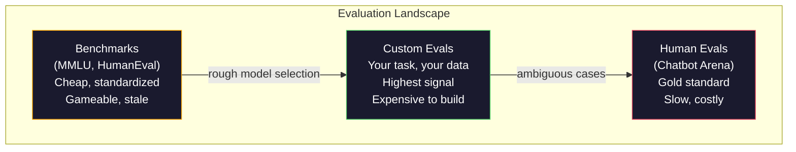
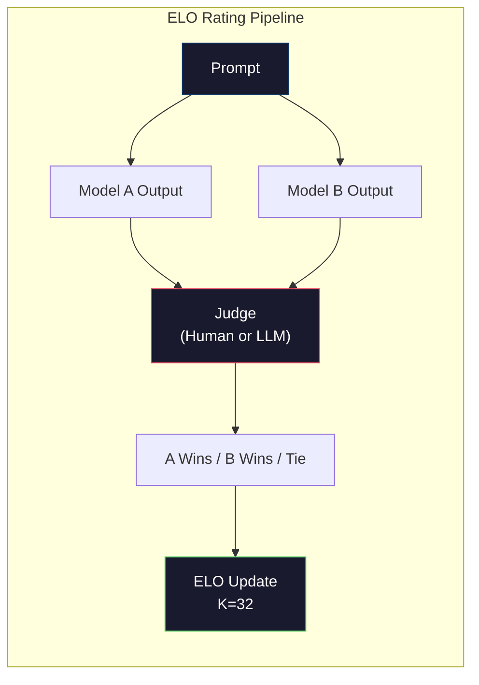

# Avaliação:Bensmarks、Evals、LM Harness

> Lei de Goodhart: quando um indicador se torna um objetivo, já não é um bom indicador. Cada laboratório de fronteira irá ter em conta os benchmarks, fazer otimizar.

**Type:** Build
**Languages:** Python
**前置要求:**Fase 10, curso 01-05 (LLM do zero)
**Time:** ~90 minutes

## Objectivo de aprendizagem
- Construir um arsenal de avaliação auto-definida, usado para o modelo de linguagem 运行 múltiplas opções 和 open-end benchmarks
- 解释为什么标准基准(MMLU、HumanEval) 会和, é incapaz de distinguir os modelos de fronteira
- Utilize adaptadas métricas  realçar avaliações específicas de tarefas: correspondência exata 、F1、BLEU 和 LLM-as-judge score
- design face to your specific use case  auto-definition evaluation suite, em vez de apenas depender de rankboards públicos

## 问题
MMLU  foi lançado em 2020, contendo 57 个学科的 15,908 道题──三年内, frontier models 就让它和了──GPT-4 得分 86.4%──Claude 3 Opus 得分 86.8%──Llama 3 405B 得分 88.6%──leaderboard Comprimido para 3 分范围内, entre os quais a diferença é apenas ruído estatístico, e não falhas de capacidade real──

Ao mesmo tempo, esses modelos falham em uma tarefa que uma criança de 10 anos não precisa pensar sobre a qual ela pode ser concluída. Claude 3.5 Sonnet em MMLU tem uma pontuação de 88,7%, mas inicialmente não consegue contar o número de letras em "frango". Esta tarefa não requer nenhum conhecimento mundial, nem precisa de raciocínio, apenas requer iteração de nível de personagem. HumanEval usa 164 problemas para testar a geração de código.

A diferença entre o desempenho de benchmark e a confiabilidade do mundo real é o problema central da avaliação do LLM. Os benchmarks só podem dizer-lhe como o modelo em benchmark se apresenta. Eles quase não podem dizer-lhe como o modelo se apresenta em suas tarefas específicas, seus dados específicos, seus modos de falha específicos. Se você está construindo um bot de suporte ao cliente, MMLU é absolutamente insignificante. Se você está construindo um assistente de código, HumanEval apenas cobre a geração de nível de função, não há nenhuma indicação sobre depuração, refactoring ou código de interpretação de documentos.

Você precisa de avaliações personalizadas. Não porque os benchmarks não sejam usados, os benchmarks para escolher um modelo grosseiro são úteis, mas porque a avaliação final deve ser precisa para se adequar às suas condições de implantação.

## 概念
### A paisagem de Eval

A avaliação é dividida em três categorias, cada uma das quais tem custos e qualidade de sinal diferentes.

**Benchmarks**O benefício é: todos usam o mesmo teste, por isso podem comparar o modelo. O benefício é: os dados de modelo e treinamento são cada vez mais fáceis de contaminar esses benchmarks. Os laboratórios estão em formação sobre os dados do problema que contém o benchmark.

**Custom evals**É o que você faz para seu próprio caso de uso construir suítes de testes  Você define entradas  resultados esperados  pontuação função  Resumo de documentos de lei  Avaliação em documentos de lei  Gerador de SQL  Avaliação em seu esquema de banco de dados  Avaliação  Estes valores  Custo de criação  Alta, mas são os únicos capazes de prever a avaliação de desempenho de produção 

**Human evals**Utilize pay fee annotators, baseada na utilidade, corretão, fluência e segurança, etc. Standards evaluation model output. Para a pontuação automática, as tarefas de pontuação aberta não funcionam, é o padrão de ouro. Chatbot Arena já reuniu mais de 200 milhões de votos de preferências de mais de 100 modelos.$0.10-$2.00) e velocidade (((várias horas a várias semanas)



### Por que os índices de referência se quebram

Três mecanismos levarão a que a referência de divisão não reflita mais a capacidade real.

**Data contamination。**訓練语料会抓取互联网──Benchmark 问题也在互联网──模型在训练期间看到了答案──这是不是传统意义上的骗局,实验室并非有意含基准数据──但网络规模的抓取使得排除它们几乎不可能──

**Teaching to the test。**Os laboratórios vão ter como objetivo o desempenho de referência  Otimizar os treinos de dados mistos. Se 5% dos dados mistos de treinamento são opções múltiplas de estilo MMLU, o modelo vai ter um formato e uma distribuição de respostas.

**Saturation。**Quando cada modelo de fronteira consegue 85-90% em um índice de referência, este índice de referência acaba de parar de distinguir. O problema restante de 10-15% pode ser ambíguo, marcar erros ou exigir conhecimento de domínio de domínio de frio.

### Perplexidade: 快速健康检查

Perplexidade  Messa modelo para uma série de tokens There are many unexpected.

```
PPL = exp(-1/N * sum(log P(token_i | context)))
```

Perplexidade 为 10 表示模型在平均意义上,就像在每个代币位置中均选择一样不确定──越低越好──GPT-2 在 WikiText-103 上的 perplexity 约为 30──GPT-3 约为 20──Llama 3 8B 约为 7──

Perplexidade  Para um modelo comparativo no mesmo conjunto de testes é útil, mas tem pontos cegos. O modelo pode ser bem preparado para prever um modelo comum e obter baixa perplexidade, mas também não é muito bom em um modelo raro, mas importante. Também não pode explicar a instrução seguindo raciocínio ou precisão factual.

### Mestrado em Direito

Utilize forte modelo para avaliação 弱模型的输出──ideas muito simples: fazer GPT-4o ou Claude Sonnet 根据 1-5 分评价响应的正确度,有用度和安全性── quando usar GPT-4o-mini 时, por julgamento, custa cerca de $0,01, e a correlação com o julgamento humano é esperada, a maioria das tarefas tem cerca de 80% de acordo──

O pontuação de um ponto é mais importante do que o modelo em si mesmo. O ponto é mais importante. O ponto é mais importante.

Modos de falha: os modelos de juízo vão exibir preconceito de posição ((( em comparações pares 中偏好第一反应) ̇verbosity bias ((preconceito maior de respostas) ̇ e auto-preferência(GPT-4 para os resultados do GPT-4 ̇ ̇ ̇ ̇ ̇ ̇ ̇ ̇ ̇ ̇ ̇ ̇ ̇ ̇ ̇ ̇ ̇ ̇ ̇ ̇ ̇ ̇ ̇ ̇ ̇ ̇ ̇ ̇ ̇ ̇ ̇ ̇ ̇ ̇ ̇ ̇ ̇ ̇ ̇ ̇ ̇ ̇ ̇ ̇ ̇ ̇ ̇ ̇ ̇ ̇ ̇ ̇ ̇ ̇ ̇ ̇ ̇ ̇ ̇ ̇ ̇ ̇ ̇ ̇ ̇ ̇ ̇ ̇ ̇ ̇ ̇ ̇ ̇ ̇ ̇ ̇ ̇ ̇ ̇ ̇ ̇ ̇ ̇ ̇ ̇ ̇ ̇ ̇ ̇ ̇ ̇ ̇ ̇ ̇ ̇ ̇ ̇ ̇ ̇ ̇ ̇ ̇ ̇ ̇ ̇ ̇ ̇ ̇ ̇ ̇ ̇ ̇ ̇ ̇ ̇ ̇ ̇ ̇ ̇ ̇ ̇ ̇ ̇ ̇ ̇ ̇ ̇ ̇ ̇ ̇ ̇ ̇ ̇ ̇ ̇ ̇ ̇ ̇ ̇ ̇ ̇ ̇ ̇ ̇ ̇ ̇ ̇ ̇ ̇ ̇ ̇ ̇ ̇ ̇ ̇ ̇ ̇ ̇ ̇ ̇ ̇ ̇ ̇ ̇ ̇ ̇ ̇ ̇ ̇ ̇ ̇ ̇ ̇ ̇ ̇ ̇ ̇ ̇ ̇ ̇ ̇ ̇ ̇ ̇ ̇ ̇ ̇ ̇ ̇ ̇ ̇ ̇ ̇ ̇ ̇ ̇ ̇ ̇ ̇ ̇ ̇ ̇ ̇ ̇ ̇ ̇ ̇ ̇ ̇ ̇ ̇ ̇ ̇ ̇ ̇ ̇ ̇ ̇ ̇ ̇ ̇ ̇

###  Baseado em comparação

É o método do Chatbot Arena. Ao mesmo instante, mostramos duas respostas de diferentes modelos. O humano (ou o juiz de LLM) escolhe um melhor.

ELO's advantages: ranking relativo em relação ao escore absoluto mais confiável, capaz de lidar com os laços, e comparado independentemente a cada saída打分需要更少的比较 就能收──截至2026年初,Chatbot Arena 排名显示GPT-4o、Claude 3.5 Sonnet 和 Gemini 1.5 Pro 在榜首彼此相差不不到20 ELO点──



### Estruturas equivalentes

**lm-evaluation-harness**(EleutherAI): Standard's open-source eval framework──support 200+ benchmarks──uzo use uma条命令即可让任意 Hugging Face 模型跑 MMLU、HellaSwag、ARC等──Open LLM Leaderboard──uzo usar

**RAGAS**O que é um dos principais aspectos da avaliação de dados da RAG é a sua relevância e a sua correção.

**promptfoo**Para utilização na engenharia de prompt: avaliação orientada por configuração. Em YAML, define casos de teste, para vários modelos de execução, obtém relatório de passagem/falha.

### Construir Evals à Custom

Esta é a única avaliação importante para a produção.

1. **Define the task。**模型到底应该做什么?要精确──"Resposta às perguntas" 太模糊──"Dado um e-mail de reclamação do cliente, extrair o nome do produto, categoria do problema e sentimento" 才是一个可以评估的任务──

2. **Create test cases。**O protótipo eval pelo menos 50 个, produção pelo menos 200 个. Cada caso de teste é um (input, expected_output) para.

3. **Define scoring。**Output estruturado Use exact match──文本相似度── BLEU/ROUGE──Open-end quality── LLM-as-judge──Extração de tarefas── F1──用权重组合多个指标──

4. **Automate。**Cada avaliação pode ser executada com uma ordem. Não há passos manuais.

5. **Track over time。**单独一个评分 没有意义――你需要趋势线――上一次促变 后分数是否提升?切换模型后是否回归?把评与提示 一起版本――

| Eval Type | 每次 judgment 成本 | 与人类的一致性 | 最适合 |
|-----------|------------------|----------------------|----------|
| Exact match | ~$0 | 100%（适用时） | Structured output、classification |
| BLEU/ROUGE | ~$0 | ~60% | Translation、summarization |
| LLM-as-judge | ~$0.01 | ~80% | Open-ended generation |
| Human eval | $0.10-$2.00 | N/A（即 ground truth） | Ambiguous、high-stakes tasks |


```figure
perplexity-loss
```

## Construí-lo
### 步骤 1: mínimo Eval 框架

定義核心抽象──一 eval case 有输入、预期输出 和可选的元数据 dict──一个得分者 接收预测 和引用,并返回 0 到 1 之间的分数──

```python
import json
from collections import Counter

class EvalCase:
    def __init__(self, input_text, expected, metadata=None):
        self.input_text = input_text
        self.expected = expected
        self.metadata = metadata or {}

class EvalSuite:
    def __init__(self, name, cases, scorers):
        self.name = name
        self.cases = cases
        self.scorers = scorers

    def run(self, model_fn):
        results = []
        for case in self.cases:
            prediction = model_fn(case.input_text)
            scores = {}
            for scorer_name, scorer_fn in self.scorers.items():
                scores[scorer_name] = scorer_fn(prediction, case.expected)
            results.append({
                "input": case.input_text,
                "expected": case.expected,
                "prediction": prediction,
                "scores": scores,
            })
        return results
```

### 步骤 2: Funções de pontuação

Construir uma correspondência exata com o F1 e um jogador de LLM como juiz.

```python
def exact_match(prediction, expected):
    return 1.0 if prediction.strip().lower() == expected.strip().lower() else 0.0

def token_f1(prediction, expected):
    pred_tokens = set(prediction.lower().split())
    exp_tokens = set(expected.lower().split())
    if not pred_tokens or not exp_tokens:
        return 0.0
    common = pred_tokens & exp_tokens
    precision = len(common) / len(pred_tokens)
    recall = len(common) / len(exp_tokens)
    if precision + recall == 0:
        return 0.0
    return 2 * (precision * recall) / (precision + recall)

def llm_judge_simulated(prediction, expected):
    pred_words = set(prediction.lower().split())
    exp_words = set(expected.lower().split())
    if not exp_words:
        return 0.0
    overlap = len(pred_words & exp_words) / len(exp_words)
    length_penalty = min(1.0, len(prediction) / max(len(expected), 1))
    return round(overlap * 0.7 + length_penalty * 0.3, 3)
```

### 步骤 3: Sistema de classificação ELO

Use updates ELO  realçar comparações em pares  This is Chatbot Arena Used to model ranking system 

```python
class ELOTracker:
    def __init__(self, k=32, initial_rating=1500):
        self.ratings = {}
        self.k = k
        self.initial_rating = initial_rating
        self.history = []

    def _ensure_player(self, name):
        if name not in self.ratings:
            self.ratings[name] = self.initial_rating

    def expected_score(self, rating_a, rating_b):
        return 1 / (1 + 10 ** ((rating_b - rating_a) / 400))

    def record_match(self, player_a, player_b, outcome):
        self._ensure_player(player_a)
        self._ensure_player(player_b)

        ea = self.expected_score(self.ratings[player_a], self.ratings[player_b])
        eb = 1 - ea

        if outcome == "a":
            sa, sb = 1.0, 0.0
        elif outcome == "b":
            sa, sb = 0.0, 1.0
        else:
            sa, sb = 0.5, 0.5

        self.ratings[player_a] += self.k * (sa - ea)
        self.ratings[player_b] += self.k * (sb - eb)

        self.history.append({
            "a": player_a, "b": player_b,
            "outcome": outcome,
            "rating_a": round(self.ratings[player_a], 1),
            "rating_b": round(self.ratings[player_b], 1),
        })

    def leaderboard(self):
        return sorted(self.ratings.items(), key=lambda x: -x[1])
```

### 步骤 4: Calculo de perplexidade

Utilize token probabilidades  calcular perplexidade。 na prática, você vai obter estes valores entre logits do modelo。 aqui utilizamos probabilidade distribuição simulação。

```python
import numpy as np

def perplexity(log_probs):
    if not log_probs:
        return float("inf")
    avg_neg_log_prob = -np.mean(log_probs)
    return float(np.exp(avg_neg_log_prob))

def token_log_probs_simulated(text, model_quality=0.8):
    np.random.seed(hash(text) % 2**31)
    tokens = text.split()
    log_probs = []
    for i, token in enumerate(tokens):
        base_prob = model_quality
        if len(token) > 8:
            base_prob *= 0.6
        if i == 0:
            base_prob *= 0.7
        prob = np.clip(base_prob + np.random.normal(0, 0.1), 0.01, 0.99)
        log_probs.append(float(np.log(prob)))
    return log_probs
```

### 步骤 5: Resultados agregados

计算一次 eval run: média, média, limiar, taxa de aprovação, bem como desagregações de métricas

```python
def summarize_results(results, threshold=0.8):
    all_scores = {}
    for r in results:
        for metric, score in r["scores"].items():
            all_scores.setdefault(metric, []).append(score)

    summary = {}
    for metric, scores in all_scores.items():
        arr = np.array(scores)
        summary[metric] = {
            "mean": round(float(np.mean(arr)), 3),
            "median": round(float(np.median(arr)), 3),
            "std": round(float(np.std(arr)), 3),
            "min": round(float(np.min(arr)), 3),
            "max": round(float(np.max(arr)), 3),
            "pass_rate": round(float(np.mean(arr >= threshold)), 3),
            "n": len(scores),
        }
    return summary

def print_summary(summary, suite_name="Eval"):
    print(f"\n{'=' * 60}")
    print(f"  {suite_name} Summary")
    print(f"{'=' * 60}")
    for metric, stats in summary.items():
        print(f"\n  {metric}:")
        print(f"    Mean:      {stats['mean']:.3f}")
        print(f"    Median:    {stats['median']:.3f}")
        print(f"    Std:       {stats['std']:.3f}")
        print(f"    Range:     [{stats['min']:.3f}, {stats['max']:.3f}]")
        print(f"    Pass rate: {stats['pass_rate']:.1%} (threshold >= 0.8)")
        print(f"    N:         {stats['n']}")
```

### 步骤 6: Execute o oleoduto completo

Colocar tudo o conteúdo conectado para cima. Define uma tarefa, criar casos de teste, simula dois modelos, executar avaliações, comparar em pares.

```python
def demo_model_good(prompt):
    responses = {
        "What is the capital of France?": "Paris",
        "What is 2 + 2?": "4",
        "Who wrote Hamlet?": "William Shakespeare",
        "What language is PyTorch written in?": "Python and C++",
        "What is the boiling point of water?": "100 degrees Celsius",
    }
    return responses.get(prompt, "I don't know")

def demo_model_bad(prompt):
    responses = {
        "What is the capital of France?": "Paris is the capital city of France",
        "What is 2 + 2?": "The answer is four",
        "Who wrote Hamlet?": "Shakespeare",
        "What language is PyTorch written in?": "Python",
        "What is the boiling point of water?": "212 Fahrenheit",
    }
    return responses.get(prompt, "Unknown")

cases = [
    EvalCase("What is the capital of France?", "Paris"),
    EvalCase("What is 2 + 2?", "4"),
    EvalCase("Who wrote Hamlet?", "William Shakespeare"),
    EvalCase("What language is PyTorch written in?", "Python and C++"),
    EvalCase("What is the boiling point of water?", "100 degrees Celsius"),
]

suite = EvalSuite(
    name="General Knowledge",
    cases=cases,
    scorers={
        "exact_match": exact_match,
        "token_f1": token_f1,
        "llm_judge": llm_judge_simulated,
    },
)

results_good = suite.run(demo_model_good)
results_bad = suite.run(demo_model_bad)

print_summary(summarize_results(results_good), "Model A (concise)")
print_summary(summarize_results(results_bad), "Model B (verbose)")
```

"bom" modelo dá resposta precisa. "ruim" modelo dá paráfrases de冗長.

### 步骤 7: Torneio ELO

Em várias rodadas, comparações em pares entre modelos de condução.

```python
elo = ELOTracker(k=32)

for case in cases:
    pred_a = demo_model_good(case.input_text)
    pred_b = demo_model_bad(case.input_text)

    score_a = token_f1(pred_a, case.expected)
    score_b = token_f1(pred_b, case.expected)

    if score_a > score_b:
        outcome = "a"
    elif score_b > score_a:
        outcome = "b"
    else:
        outcome = "tie"

    elo.record_match("model_a_concise", "model_b_verbose", outcome)

print("\nELO Leaderboard:")
for name, rating in elo.leaderboard():
    print(f"  {name}: {rating:.0f}")
```

### 步骤 8: Perplexidade Comparação

Perplexidade do modelo em comparação com o nível de qualidade diferente.

```python
test_text = "The quick brown fox jumps over the lazy dog in the garden"

for quality, label in [(0.9, "Strong model"), (0.7, "Medium model"), (0.4, "Weak model")]:
    log_probs = token_log_probs_simulated(test_text, model_quality=quality)
    ppl = perplexity(log_probs)
    print(f"  {label} (quality={quality}): perplexity = {ppl:.2f}")
```

## Use-o
### - Valorização de uso (EleutherAI)

Instrumentos de padrão para executar benchmarks em modelos arbitrários.

```python
# pip install lm-eval
# Command line:
# lm_eval --model hf --model_args pretrained=meta-llama/Llama-3.1-8B --tasks mmlu --batch_size 8

# Python API:
# import lm_eval
# results = lm_eval.simple_evaluate(
#     model="hf",
#     model_args="pretrained=meta-llama/Llama-3.1-8B",
#     tasks=["mmlu", "hellaswag", "arc_easy"],
#     batch_size=8,
# )
# print(results["results"])
```

### promptfoo

Utilizado para a avaliação de configuração de engenharia rápida, definido em testes do YAML, e dirigido a vários provedores.

```yaml
# promptfoo.yaml
providers:
  - openai:gpt-4o-mini
  - anthropic:claude-3-haiku

prompts:
  - "Answer in one word: {{question}}"

tests:
  - vars:
      question: "What is the capital of France?"
    assert:
      - type: contains
        value: "Paris"
  - vars:
      question: "What is 2 + 2?"
    assert:
      - type: equals
        value: "4"
```

### RAGAS para avaliação de RAG

```python
# pip install ragas
# from ragas import evaluate
# from ragas.metrics import faithfulness, answer_relevancy, context_precision
#
# result = evaluate(
#     dataset,
#     metrics=[faithfulness, answer_relevancy, context_precision],
# )
# print(result)
```

RAGAS Messa avaliações gerais 会遗漏的内容: modelo resposta se baseia no contexto recuperado, não apenas em sentido abstrato se é 正确──

## Entrega-o
本课会产出 `outputs/prompt-eval-designer.md`, é um prompt replicável, usado para projetar suites de avaliação personalizadas para qualquer tarefa. Dá-lhe uma descrição de tarefa, gerará casos de teste, funções de pontuação e limiar de passagem / falha.

Ele vai voltar a aparecer.`outputs/skill-llm-evaluation.md`, é um quadro de decisão, usado de acordo com o seu tipo de tarefa, orçamento e requisitos de latência  escolher a estratégia de avaliação adequada 

## 练习
1. Adicione um marcador de "consistência": use a mesma entrada 让模型运行 5 times,并衡量输出 匹配的频率──deterministic inputs 上的不一致答案会暴露脆弱的提示或过高的温度设置──

2.  ampliar o rastreador ELO, torná-lo capaz de suportar várias funções de juiz (exacto match 、F1、LLM-as-judge) e aumentar o seu poder para eles.

3. Para uma tarefa específica, construir uma suite de avaliação: classificar os e-mails para 5 categorias. Crie 100 casos de teste, contendo vários exemplos e casos de ponta.

4.  Realizar a detecção de contaminação: given determined one set of evalu questions 和 a training corpus, check check has how much proportion of evalu questions (a) (ou parafrases próximas) aparecem nos dados de treinamento.

5. Construir uma ferramenta de "modelo diferente" ⋅ para determinar os resultados de avaliação de duas versões de modelos, quais casos específicos de teste ▌ foram elevados, quais retornaram, quais permaneceram inalterados ⋅ é o código de avaliação      versão diferente, para entender uma mudança é importante se ajuda ou se prejudica ⋅

## 关键术语
| Term | 人们的说法 | 它实际上的含义 |
|------|----------------|----------------------|
| MMLU | "The benchmark" | Massive Multitask Language Understanding，包含 57 个学科的 15,908 道 multiple choice questions，到 2025 年已在 88% 以上饱和 |
| HumanEval | "Code eval" | OpenAI 的 164 个 Python function-completion problems，只测试 isolated function generation |
| SWE-bench | "Real coding eval" | 来自 12 个 Python repos 的 2,294 个 GitHub issues，衡量包括 test generation 在内的 end-to-end bug fixing |
| Perplexity | "How confused the model is" | exp(-avg(log P(token_i given context)))，越低表示模型给实际 tokens 分配的概率越高 |
| ELO rating | "Chess ranking for models" | 根据 pairwise win/loss records 计算的 relative skill rating，Chatbot Arena 用它对 100+ models 排名 |
| LLM-as-judge | "Using AI to grade AI" | 强模型按照 rubric 评价弱模型 outputs，与人类 judges 约 80% agreement，成本约 $0.01/judgment |
| Data contamination | "The model saw the test" | Training data 包含 benchmark questions，在不提升真实 capability 的情况下抬高分数 |
| Eval suite | "A bunch of tests" | 一个 versioned collection，由 (input, expected_output, scorer) triples 组成，用于衡量特定 capability |
| Pass rate | "What percentage it gets right" | Eval cases 中得分超过阈值的比例，比 mean score 更可操作，因为它衡量 reliability |
| Chatbot Arena | "Model ranking website" | LMSYS 平台，拥有 2M+ human preference votes，并通过 ELO ratings 生成最可信的 LLM leaderboard |

## 延伸阅读
- [Hendrycks et al., 2021 -- "Measuring Massive Multitask Language Understanding"](https://arxiv.org/abs/2009.03300)- O artigo da MMLU, apesar de já ter sido publicado, continua a ser o referencial mais citado para o LLM
- [Chen et al., 2021 -- "Evaluating Large Language Models Trained on Code"](https://arxiv.org/abs/2107.03374)-- O artigo HumanEval da OpenAI, estabeleceu uma metodologia de avaliação da geração de código
- [Zheng et al., 2023 -- "Judging LLM-as-a-Judge"](https://arxiv.org/abs/2306.05685)-- para a utilização de LLM avaliação LLM de análise sistêmica, incluindo posicionamento preconceito e verbosidade preconceito
- [LMSYS Chatbot Arena](https://chat.lmsys.org/)-- plataforma de comparação de modelos com crowdsourcing, possuindo mais de 2 milhões de votos, é o ranking mais credível de LLM no mundo real
