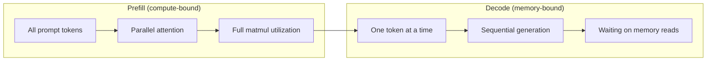
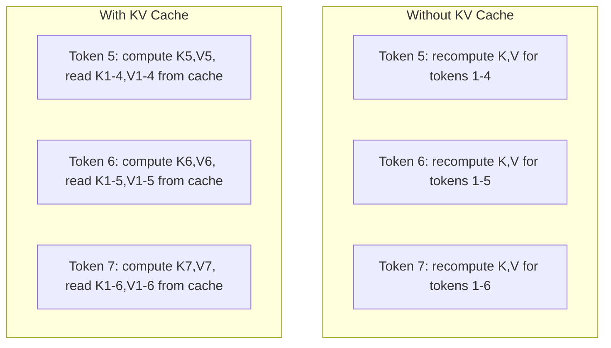
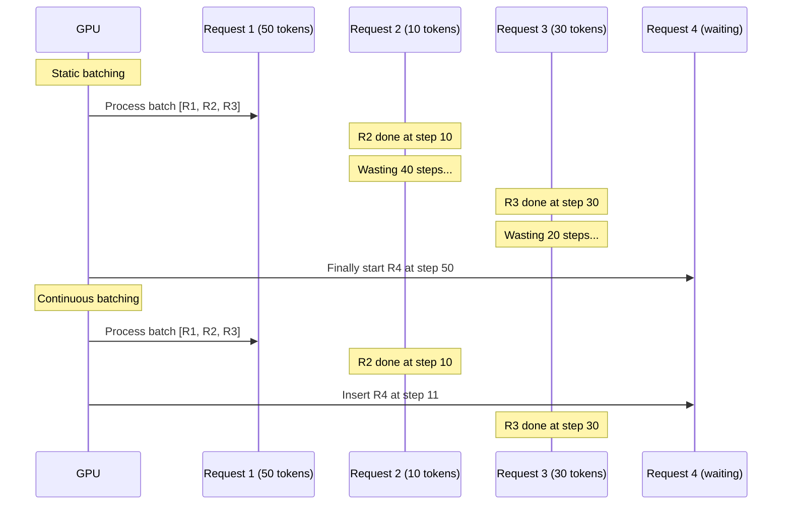
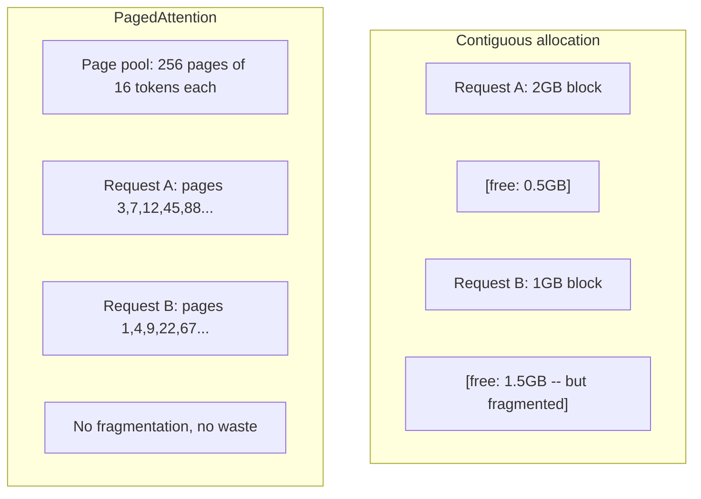
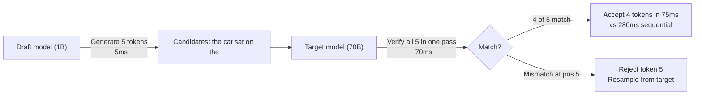

# Inferência 优化

> 两个阶段定义了LLM inference──Prefill 并行处理你的提示――计算-bound──Decode 一次生成一个代币――记忆-bound──每种优化都针对其中一个或两个阶段──

**Type:** Build
**Languages:** Python
**Prerequisites:** Phase 10, Lessons 01-08 (Transformer architecture, attention)
**Time:** ~120 分钟

## Objectivo de aprendizagem

-                                                                                                                                                                                                                                                                                                                                                                                                                                                                                                                              
-                                                                                                                                                                                                                                                                                                                                                                                                                                                                                                                              
- 实现 batching contínuo 和 PagedAttention 概念, para maximizar a taxa de utilização da GPU em um requisito de desenvolvimento
- Comparar inferências 优化技术(KV-cache  especulativa decodificação  flash attention) e seu rendimento/latencia 取舍

## 问题

Você está em 4xA100 GPUs para a implementação de Llama 3 70B── utilizador individual pode obter cerca de 50 tokens por segundo── senti-se muito rápido── então 100 utilizadores simultaneamente visitam o endpoint── através da produção cai para 3 tokens/segundo/usuário── você tem uma conta de GPU de 25.000 dólares por mês, fornecendo a velocidade de resposta, mas em comparação com os utilizadores de digitação também é lento──

O modelo em si não mudou entre um usuário e 100 usuários. O mesmo peso, a mesma arquitetura, a mesma matemática. O que mudou foi como você trabalha.

Não é uma questão de escalação. É uma questão de programação. É uma técnica de esta aula. Caching KV, batch contínuo, PagedAttention, decodificação especulativa, prefixo de caching. É uma conclusão de 25 mil dólares por mês.

VLLM em 4xA100-80GB em cima servindo Llama 3 70B 时, em baixa并发下 atingir cerca de 50 tokens/segundo/usuário,并通过持续批发 和 PagedAttention em 100 个并发请求维持 15-25 TPS/usuário──没有这些优化,同样硬件在该并发下只能提供 5 TPS/usuário──同样的GPUs、同样的模型,吞吐量提升4倍──

## 概念

### Preencher versus Decodificar

Cada inferência de LLM Petição tem duas fases diferentes.

**Prefill**处理整个输入提示──所有代币都已知,因此注意可以在完整序列上并行计算──这是一个大型矩阵乘法-- GPU cores 会保持忙碌──瓶是计算:你的硬件每秒能提供多少FLOPS──A100可达到 312 TFLOPS (BF16)──在单张 A100 上,70B 模型对 4,096-代币提示做做预填 约需要400ms──

**Decode**Uma vez gerar um token de saída. Cada novo token atende a todos os tokens anteriores, mas cada passagem avançada produz apenas um token. As matrizes de peso têm a mesma dimensão que as preenchimentos, mas você usa um único vetor e não uma matriz para transportá-las.



**ops:byte ratio**(também chamado de intensidade aritmética) desenhou este tipo de análise.

```
ops:byte ratio = FLOPs per token / bytes read from memory
```

Em um lote de 4.096 tokens preenchimento, por carga, você executará cerca de 4.096 vezes multiplicar-acumular operações. Esta proporção é muito alta. Você é computação-limitado. Em um lote de tamanho 为 1 de decodificação, cada carga executar um peso apenas cerca de 1 vez operação. Esta proporção é muito baixa. Você é memória-limitado.

核心洞察:*decode é limitado à memória, porque você lê todo o modelo apenas para produzir um token*。

### Caches de KV

Em atenção, cada token de consulta irá atender a cada token anterior chave e valor vetores. Sem caching. Quando, gerar token N 需要重新计算前面 N-1 个 token 个 token 的关键和值预测.

KV cache  armazenamento de projeções de chave e valor de todos os tokens anteriores。 gerar token N 时, você só calcula a chave e valor do token N, e então colocá-los com tokens 1 a N-1 caché K/V 拼拼拼拼起来──



**KV cache 的 memory 公式：**

```
KV cache size = 2 * num_layers * num_kv_heads * head_dim * seq_len * bytes_per_param
```

对于Llama 3 70B(80 camadas、8 cabeças KV com GQA、head_dim=128、BF16):

```
per token: 2 * 80 * 8 * 128 * 2 bytes = 327,680 bytes = 320 KB
at 4,096 tokens: 320 KB * 4,096 = 1.28 GB
at 128K tokens: 320 KB * 131,072 = 40 GB
```

Uma conversa de contexto 128K de Llama 3 70B irá consumir 40 GB de cache KV -- 半张 A100 de memória──100 个并发用户、 por token 4K 时, apenas KV cache necessita de 128 GB── é por isso que o gerenciamento de cache KV é o desafio central da inferência 优化──

### Batchamento contínuo

Batchamento estático 会 esperar um lote de N 个 solicitações chegar, processá-los juntos, e espera até que *totalidade* seja concluída para aceitar o novo pedido.

Batch contínuo (também chamado batch de nível de iteração) será inserido em batch imediatamente após o cumprimento de qualquer pedido.



A taxa de alta de transmissão depende da variação da taxa de saída. Quando a taxa de transmissão é igual à taxa de variação estática, a taxa de transmissão pode ser de 2 a 5 vezes maior, pois as slots da GPU nunca ficam vazias.

### PagedAttention

Cada pedido de cache KV é um bloco de memória contígua. Com o pedido de chegada e saída, a memória se fragmenta - assim como a fragmentação de RAM no sistema operacional. Uma solicitação com token 4K precisa de 1,28 GB contígua. Mesmo que o total seja de 2 GB gratuito, você também pode não ter 1,28 GB contígua. Você vai perder memória, ou rejeitar a solicitação.

PagedAttention( proveniente de vLLM) vai ser aplicada memória virtual de estilo OS  aplicada ao cache KV。 não é para cada pedido distribuir um bloco contíguo, mas distribuir fixa de "páginas" ((normalmente por 16 tokens de página)。Páginas podem estar em qualquer posição da memória física da GPU。Tabela de página irá posicionar as posições da sequência lógica de cada pedido 映射到物理页位置──



PagedAttention também suporta prefixos compartilhados de **copy-on-write**◊ Se 50 solicitações compartilham um mesmo sistema de solicitação, esta página de cache KV de um sistema de solicitação só é armazenada uma vez, e é citada em conjunto por 50 solicitações.

O relatório vLLM  relatou que, através da PagedAttention, pode-se conseguir quase zero de desperdício de memória (cerca de 4%) enquanto a alocação ingênua é de cerca de 60-80%)

### Descrição especulativa

Decodificar é lento porque é sequencial - você gera um token, coloca-o de volta, reproduz-o para o próximo. Mas se você puder barato adivinhar os próximos 5 tokens, então verificar-os uma vez?

Descodagem especulativa usando um pequeno e rápido**draft model**生成 K 个 candidato tokens──massiva **target model**Em seguida, em uma única passagem avançada, você vai processar todos os K's candidatos. Se ele estiver na posição j não concordar, você aceitará os tokens 1 a j-1, e abandonará o resto.



A velocidade depende de**acceptance rate**-- previsão do modelo de projeto com a frequência de correspondência de alvo.  Usando Llama 3 8B para Llama 3 70B para fazer o projeto, as taxas de aceitação típicas em linguagem natural são de 70-85%.

Descodificação especulativa de três métodos:

| Method | Draft source | Acceptance rate | Overhead |
|--------|-------------|-----------------|----------|
| Draft-target (Leviathan et al.) | 独立小模型 | 70-85% | Draft model memory |
| EAGLE (Li et al.) | Target 上的轻量 head | 75-90% | ~1% extra parameters |
| N-gram lookup | Token n-gram table | 40-60% | 可忽略 |

**EAGLE**Em estados ocultas do modelo alvo 之上训练一个小型 autoregressive head──它使用目标模型 倒数第二层功能来预测下一个代币的嵌入──因为它操作的是目标模型 自身的表示(而不是独立模型的),所以能以极极少的额外内存 获得更高的接受率──EAGLE-2 增加了动态草案树,可根据背景调整候选人数──

**N-gram speculative decoding**维护来自当前文脈或预构建 corpus的 n-gram continuations table──如果草案匹配同样的对话中此前出现的内容(重复模式、代码、结构化输出),它将以零 Neural Network overhead 触发──平均接受率更低,但每次猜测的成本基本为零──

A descodificação especulativa é matematicamente precisa * - 输出分布与目标模型的分布完全相同──它不是近似── Verificação passo 确保每个接受的代币都具有目标模型 原本会分配的确切概率──

### Prefixo Cachado

许多请求共享相同前──Chatbot system prompt──RAG context block──Few-shot example set──没有前缓存 时,每个请求都会从头重新计算这些共享代币的KV缓存──

Prefixo cache  armazenamento cache KV de prefixos comuns, e em requisitos entre duplo uso。 Quando novo pedido com prefixo conhecido até chegar, sistema irá copiar(or citação) entradas KV em cache,并只计算 KV的唯一后尾──

Para todos os pedidos compartilhados, o sistema de 2.000 tokens de prompt, prefixo de cache irá eliminar cada pedido de cerca de 400ms de prefill. Em 100 pedidos/segundo, isso poupa 40 segundos de computação de GPU - mais de um GPU de trabalho.

Utilize radix tree(trie) implementar prefixo caching, de acordo com o conteúdo do token 索引 prefixes。 qualquer correspondência armazenada prefixo de solicitação都会免费获得其KV cache。 esta árvore 支持部分 prefixo matches-- Se você com alguma entrada caché 共享 2,000 个 prefixo tokens Out of 1,500 个,就复用这1,500 个,只重新计算 500 个──

### Motores de interferência

Três motores 主导 produção LLM servindo:

| Engine | Key innovation | Best for |
|--------|---------------|----------|
| vLLM | PagedAttention、continuous batching | 通用 serving、最高兼容性 |
| SGLang | RadixAttention（prefix caching）、structured generation | Multi-turn chatbots、constrained decoding |
| TensorRT-LLM | NVIDIA kernel fusion、FP8 quantization | NVIDIA hardware 上的最大 single-GPU throughput |

**vLLM**É um ponto de partida de forma padrão. Suporta o modelo mais amplo, pode funcionar em qualquer fornecedor de GPU (NVIDIA, AMD, Intel), e através de PagedAttention + batching contínuo                                                                                                                                                                                                                                                                                                                                                                                                                                                                           

**SGLang**建立在与vLLM相似的基础之上,但增加了用于前置缓存的RadixAttention, bem como para uso de domínio específico de programas de LLM estruturados.

**TensorRT-LLM**将模型编译成优化NVIDIA GPU kernels──它融合操作(attention + linear + activation 在一个内核中), em H100 GPUs 上使用FP8,并与NVIDIA Triton Inference Server 集集成进行生产部署──它实现最高单GPU吞吐量在NVIDIA硬件上,但设置更多,并且只适用于NVIDIA GPUs──

Llama 3 70B 的真实世界数字(4xA100-80GB,BF16):

| Metric | vLLM | SGLang | TensorRT-LLM |
|--------|------|--------|---------------|
| Throughput（1 user） | ~50 TPS | ~55 TPS | ~65 TPS |
| Throughput（100 users） | ~2,500 total TPS | ~3,200 total TPS | ~3,000 total TPS |
| Time to first token | ~400ms | ~300ms（prefix hit） | ~350ms |
| Max context | 128K | 128K | 128K |

### Ops:Byte 框架

Você não pode se optimizar sem medir coisas. O porção de bytes diz-lhe que a carga de trabalho é computacional ou computacional, e isso determina quais são as melhorias realmente importantes.

```
Compute roof: peak FLOPS of the GPU
Memory roof:  peak bandwidth * ops:byte ratio
```

Quando ops:byte 较低时(decode、小批), você vai tocar sobre o teto de largura de banda de memória。 aumentar mais computação(更高钟、更多核心) não ajuda。 você precisa reduzir as leituras de memória(quantização、KV cache compressão), ou aumentar o tamanho do lote, será lendo repartição para mais útil trabalho。

Quando ops:byte 较高时(prefill、大批), você vai tocar sobre o telhado da computação。Optimização da largura de banda de memória 没有帮助──你需要更快的GPUs、核融合或降低精度 来挤出更多FLOPS──

| Scenario | ops:byte | Bound | Optimize with |
|----------|----------|-------|---------------|
| Prefill, batch=1 | ~4,096 | Compute | Kernel fusion, FP8 |
| Decode, batch=1 | ~1 | Memory | Quantization, KV compression |
| Decode, batch=32 | ~32 | Memory | Larger batch, continuous batching |
| Decode, batch=256 | ~256 | Transitioning | 两者都重要 |
| Decode, batch=1024 | ~1,024 | Compute | Kernel fusion, tensor parallelism |

A100  上的交叉点 大约是 ops:byte = 156(312 TFLOPS / 2 TB/s) ⋅低于 156 时,你是记忆绑定的.高于 156 时,你是计算绑定的.Continuous batching 通过每次反复 打包更多代币,将解码 推向这个交叉式──


```figure
context-window-slide
```

## Construí-lo

### 步骤 1: Desde zero implementar o KV Cache

Nós construímos um cache KV multi-head, ele por camada, cabeça, chave de armazenamento e projeções de valor, e mostramos a memória, o modo de crescimento.

```python
import numpy as np

class KVCache:
    def __init__(self, num_layers, num_heads, head_dim, max_seq_len, dtype=np.float16):
        self.num_layers = num_layers
        self.num_heads = num_heads
        self.head_dim = head_dim
        self.max_seq_len = max_seq_len
        self.dtype = dtype

        self.k_cache = np.zeros(
            (num_layers, num_heads, max_seq_len, head_dim), dtype=dtype
        )
        self.v_cache = np.zeros(
            (num_layers, num_heads, max_seq_len, head_dim), dtype=dtype
        )
        self.seq_len = 0

    def update(self, layer_idx, new_keys, new_values):
        num_new = new_keys.shape[1]
        end = self.seq_len + num_new
        self.k_cache[layer_idx, :, self.seq_len:end, :] = new_keys
        self.v_cache[layer_idx, :, self.seq_len:end, :] = new_values
        return (
            self.k_cache[layer_idx, :, :end, :],
            self.v_cache[layer_idx, :, :end, :]
        )

    def advance(self, num_tokens):
        self.seq_len += num_tokens

    def memory_bytes(self):
        return self.k_cache.nbytes + self.v_cache.nbytes

    def used_bytes(self):
        per_token = 2 * self.num_layers * self.num_heads * self.head_dim * np.dtype(self.dtype).itemsize
        return per_token * self.seq_len
```

### 步骤 2: Use KV Cache de Atenção

Uma atenção simplificada de várias cabeças, usando cache KV em etapas de decodificação.

```python
def scaled_dot_product_attention(query, keys, values):
    head_dim = query.shape[-1]
    scores = np.matmul(query, keys.transpose(0, 1, 3, 2)) / np.sqrt(head_dim)
    seq_len_q = scores.shape[-2]
    seq_len_k = scores.shape[-1]
    if seq_len_q > 1:
        mask = np.triu(np.ones((seq_len_q, seq_len_k), dtype=np.float32), k=seq_len_k - seq_len_q + 1)
        scores = scores + mask * (-1e9)
    max_scores = np.max(scores, axis=-1, keepdims=True)
    exp_scores = np.exp(scores - max_scores)
    attn_weights = exp_scores / np.sum(exp_scores, axis=-1, keepdims=True)
    return np.matmul(attn_weights, values)


class MultiHeadAttention:
    def __init__(self, d_model, num_heads):
        self.num_heads = num_heads
        self.head_dim = d_model // num_heads
        scale = np.sqrt(2.0 / d_model)
        self.W_q = np.random.randn(d_model, d_model).astype(np.float32) * scale
        self.W_k = np.random.randn(d_model, d_model).astype(np.float32) * scale
        self.W_v = np.random.randn(d_model, d_model).astype(np.float32) * scale
        self.W_o = np.random.randn(d_model, d_model).astype(np.float32) * scale

    def forward(self, x, kv_cache=None, layer_idx=0):
        batch, seq_len, d_model = x.shape
        Q = np.matmul(x, self.W_q).reshape(batch, seq_len, self.num_heads, self.head_dim).transpose(0, 2, 1, 3)
        K = np.matmul(x, self.W_k).reshape(batch, seq_len, self.num_heads, self.head_dim).transpose(0, 2, 1, 3)
        V = np.matmul(x, self.W_v).reshape(batch, seq_len, self.num_heads, self.head_dim).transpose(0, 2, 1, 3)

        if kv_cache is not None:
            K_full, V_full = kv_cache.update(layer_idx, K[0], V[0])
            K = K_full[np.newaxis, :, :, :]
            V = V_full[np.newaxis, :, :, :]
            if seq_len == 1:
                kv_cache.advance(1)

        attn_out = scaled_dot_product_attention(Q, K, V)
        attn_out = attn_out.transpose(0, 2, 1, 3).reshape(batch, -1, d_model)
        return np.matmul(attn_out, self.W_o)
```

### 步骤 3: Batchings contínuos 模拟器

É como uma diferença de temperatura entre batches estáticos e batches contínuos.

```python
import heapq

class Request:
    def __init__(self, request_id, prompt_tokens, output_tokens, arrival_step):
        self.request_id = request_id
        self.prompt_tokens = prompt_tokens
        self.output_tokens = output_tokens
        self.arrival_step = arrival_step
        self.tokens_generated = 0
        self.start_step = None
        self.end_step = None

    def is_done(self):
        return self.tokens_generated >= self.output_tokens


def simulate_static_batching(requests, batch_size):
    step = 0
    completed = []
    queue = list(requests)
    queue.sort(key=lambda r: r.arrival_step)

    while queue:
        batch = []
        while queue and len(batch) < batch_size:
            r = queue.pop(0)
            r.start_step = max(step, r.arrival_step)
            batch.append(r)

        if batch:
            step = max(step, max(r.start_step for r in batch))
            max_output = max(r.output_tokens for r in batch)
            for r in batch:
                r.tokens_generated = r.output_tokens
                r.end_step = step + max_output
            step += max_output
            completed.extend(batch)

    return completed


def simulate_continuous_batching(requests, batch_size):
    step = 0
    completed = []
    queue = sorted(requests, key=lambda r: r.arrival_step)
    queue_idx = 0
    active = []
    waiting = []

    while queue_idx < len(queue) or active or waiting:
        while queue_idx < len(queue) and queue[queue_idx].arrival_step <= step:
            waiting.append(queue[queue_idx])
            queue_idx += 1

        while waiting and len(active) < batch_size:
            r = waiting.pop(0)
            r.start_step = step
            active.append(r)

        if not active:
            if waiting:
                step += 1
                continue
            elif queue_idx < len(queue):
                step = queue[queue_idx].arrival_step
                continue
            else:
                break

        for r in active:
            r.tokens_generated += 1

        done = [r for r in active if r.is_done()]
        for r in done:
            r.end_step = step + 1
            completed.append(r)
        active = [r for r in active if not r.is_done()]

        step += 1

    return completed


def batching_stats(completed):
    latencies = [r.end_step - r.arrival_step for r in completed]
    total_time = max(r.end_step for r in completed) - min(r.arrival_step for r in completed)
    total_tokens = sum(r.output_tokens for r in completed)
    return {
        "avg_latency": np.mean(latencies),
        "p50_latency": np.median(latencies),
        "p99_latency": np.percentile(latencies, 99),
        "total_time": total_time,
        "throughput": total_tokens / total_time if total_time > 0 else 0,
    }
```

### 步骤 4: Prefixo Cache

Um cache de prefixos baseado em trie, usado para armazenar entradas de KV de prefixos compartilhados.

```python
class TrieNode:
    def __init__(self):
        self.children = {}
        self.kv_data = None
        self.hit_count = 0


class PrefixCache:
    def __init__(self, max_entries=1000):
        self.root = TrieNode()
        self.max_entries = max_entries
        self.total_entries = 0
        self.hits = 0
        self.misses = 0

    def _walk(self, token_ids):
        node = self.root
        depth = 0
        for tid in token_ids:
            if tid not in node.children:
                break
            node = node.children[tid]
            depth += 1
        return node, depth

    def lookup(self, token_ids):
        node, depth = self._walk(token_ids)
        if depth > 0:
            self.hits += 1
            current = self.root
            for tid in token_ids[:depth]:
                current = current.children[tid]
                current.hit_count += 1
            kv_entries = []
            current = self.root
            for tid in token_ids[:depth]:
                current = current.children[tid]
                if current.kv_data is not None:
                    kv_entries.append(current.kv_data)
            return depth, kv_entries
        self.misses += 1
        return 0, []

    def insert(self, token_ids, kv_per_token):
        node = self.root
        for i, tid in enumerate(token_ids):
            if tid not in node.children:
                if self.total_entries >= self.max_entries:
                    return i
                node.children[tid] = TrieNode()
                self.total_entries += 1
            node = node.children[tid]
            if i < len(kv_per_token):
                node.kv_data = kv_per_token[i]
        return len(token_ids)

    def hit_rate(self):
        total = self.hits + self.misses
        return self.hits / total if total > 0 else 0.0
```

### 步骤 5: Descódigo especulativo 模拟器

Usamos taxas de aceitação configuráveis para desenhar o código especulativo de um projeto-alvo.

```python
class DraftModel:
    def __init__(self, vocab_size, acceptance_rate=0.8):
        self.vocab_size = vocab_size
        self.acceptance_rate = acceptance_rate

    def generate(self, context, num_tokens):
        tokens = np.random.randint(0, self.vocab_size, size=num_tokens)
        return tokens

    def get_probs(self, context, token):
        probs = np.random.dirichlet(np.ones(self.vocab_size))
        return probs


class TargetModel:
    def __init__(self, vocab_size):
        self.vocab_size = vocab_size

    def get_probs(self, context, tokens=None):
        if tokens is not None:
            return [np.random.dirichlet(np.ones(self.vocab_size)) for _ in tokens]
        return np.random.dirichlet(np.ones(self.vocab_size))


def speculative_decode(draft_model, target_model, context, num_speculative=5,
                       draft_cost=1.0, target_cost=10.0, verify_cost=12.0):
    total_tokens = 0
    total_cost = 0.0
    accepted_counts = []
    context = list(context)

    max_tokens = 100

    while total_tokens < max_tokens:
        draft_tokens = draft_model.generate(context, num_speculative)
        total_cost += draft_cost * num_speculative

        target_probs = target_model.get_probs(context, draft_tokens)
        total_cost += verify_cost

        accepted = 0
        for i, token in enumerate(draft_tokens):
            draft_p = draft_model.get_probs(context + list(draft_tokens[:i]), token)
            target_p = target_probs[i]

            r = np.random.random()
            acceptance_prob = min(1.0, target_p[token] / (draft_p[token] + 1e-10))

            if r < draft_model.acceptance_rate:
                accepted += 1
                context.append(token)
                total_tokens += 1
            else:
                new_token = np.random.choice(draft_model.vocab_size, p=target_p)
                context.append(new_token)
                total_tokens += 1
                break

        accepted_counts.append(accepted)

        if accepted == num_speculative:
            bonus_probs = target_model.get_probs(context)
            bonus_token = np.random.choice(draft_model.vocab_size, p=bonus_probs)
            context.append(bonus_token)
            total_tokens += 1

    sequential_cost = total_tokens * target_cost
    return {
        "total_tokens": total_tokens,
        "speculative_cost": total_cost,
        "sequential_cost": sequential_cost,
        "speedup": sequential_cost / total_cost if total_cost > 0 else 1.0,
        "avg_accepted": np.mean(accepted_counts),
        "acceptance_rate": np.mean(accepted_counts) / num_speculative,
    }


def compare_speculation_strategies(vocab_size=1000, num_trials=20):
    results = {}

    for name, acceptance_rate, spec_tokens in [
        ("Draft-target (8B->70B)", 0.78, 5),
        ("EAGLE", 0.85, 6),
        ("N-gram", 0.50, 4),
        ("No speculation", 0.0, 0),
    ]:
        if spec_tokens == 0:
            results[name] = {
                "speedup": 1.0,
                "acceptance_rate": 0.0,
                "avg_accepted": 0.0,
            }
            continue

        trial_results = []
        for _ in range(num_trials):
            draft = DraftModel(vocab_size, acceptance_rate=acceptance_rate)
            target = TargetModel(vocab_size)
            context = list(np.random.randint(0, vocab_size, size=10))
            result = speculative_decode(draft, target, context, num_speculative=spec_tokens)
            trial_results.append(result)

        results[name] = {
            "speedup": np.mean([r["speedup"] for r in trial_results]),
            "acceptance_rate": np.mean([r["acceptance_rate"] for r in trial_results]),
            "avg_accepted": np.mean([r["avg_accepted"] for r in trial_results]),
        }

    return results
```

### 步骤 6: KV Cache Memória Profil

计算真实模型配置的 KV cache memory requirements──

```python
MODEL_CONFIGS = {
    "Llama-3-8B": {
        "num_layers": 32, "num_kv_heads": 8, "head_dim": 128,
        "model_params_b": 8, "gqa": True,
    },
    "Llama-3-70B": {
        "num_layers": 80, "num_kv_heads": 8, "head_dim": 128,
        "model_params_b": 70, "gqa": True,
    },
    "Llama-3-405B": {
        "num_layers": 126, "num_kv_heads": 8, "head_dim": 128,
        "model_params_b": 405, "gqa": True,
    },
    "Mistral-7B": {
        "num_layers": 32, "num_kv_heads": 8, "head_dim": 128,
        "model_params_b": 7, "gqa": True,
    },
    "GPT-4-est": {
        "num_layers": 120, "num_kv_heads": 96, "head_dim": 128,
        "model_params_b": 1800, "gqa": False,
    },
}


def kv_cache_memory(config, seq_len, dtype_bytes=2):
    per_token = 2 * config["num_layers"] * config["num_kv_heads"] * config["head_dim"] * dtype_bytes
    total = per_token * seq_len
    return {
        "per_token_bytes": per_token,
        "per_token_kb": per_token / 1024,
        "total_bytes": total,
        "total_mb": total / (1024 ** 2),
        "total_gb": total / (1024 ** 3),
    }


def memory_budget(config, gpu_memory_gb, model_dtype_bytes=2, kv_dtype_bytes=2):
    model_memory_gb = config["model_params_b"] * 1e9 * model_dtype_bytes / (1024 ** 3)
    overhead_gb = gpu_memory_gb * 0.1
    available_for_kv = gpu_memory_gb - model_memory_gb - overhead_gb

    if available_for_kv <= 0:
        return {"error": "Model does not fit in GPU memory", "model_memory_gb": model_memory_gb}

    per_token = 2 * config["num_layers"] * config["num_kv_heads"] * config["head_dim"] * kv_dtype_bytes
    max_tokens = int(available_for_kv * (1024 ** 3) / per_token)

    return {
        "gpu_memory_gb": gpu_memory_gb,
        "model_memory_gb": round(model_memory_gb, 1),
        "overhead_gb": round(overhead_gb, 1),
        "available_for_kv_gb": round(available_for_kv, 1),
        "max_total_tokens": max_tokens,
        "max_users_at_2k": max_tokens // 2048,
        "max_users_at_4k": max_tokens // 4096,
        "max_users_at_32k": max_tokens // 32768,
    }
```

## Use-o

Utilize VLLM:

```python
from vllm import LLM, SamplingParams

llm = LLM(
    model="meta-llama/Llama-3-70B-Instruct",
    tensor_parallel_size=4,
    enable_prefix_caching=True,
    max_model_len=8192,
    gpu_memory_utilization=0.9,
)

params = SamplingParams(temperature=0.7, max_tokens=256)
outputs = llm.generate(["Explain inference optimization in one paragraph."], params)
```

Utilize SGLang fazer prefixo caching + saída estruturada:

```python
import sglang as sgl

@sgl.function
def classify(s, text):
    s += sgl.system("You are a classifier. Output JSON only.")
    s += sgl.user(f"Classify this text: {text}")
    s += sgl.assistant(sgl.gen("result", regex=r'\{"label": "(positive|negative|neutral)"\}'))

runtime = sgl.Runtime(model_path="meta-llama/Llama-3-70B-Instruct", tp_size=4)
sgl.set_default_backend(runtime)

results = classify.run_batch([
    {"text": "This product is amazing!"},
    {"text": "Terrible experience."},
    {"text": "It was okay I guess."},
])
```

Utilize TensorRT-LLM:

```python
import tensorrt_llm
from tensorrt_llm.runtime import ModelRunner

runner = ModelRunner.from_dir("./llama-70b-trt-engine/", rank=0)

outputs = runner.generate(
    batch_input_ids=[tokenizer.encode("Explain KV caching.")],
    max_new_tokens=256,
    temperature=0.7,
)
```

## Entrega-o

本课产出:
- `outputs/skill-inference-optimization.md`-- uma habilidade para diagnóstico e otimização de inferência LLM servindo

## 练习

1. Modificar o perfil de cache KV, comparar quantização de cache FP16 vs FP8 vs INT4 KV. Para o contexto 4K, calcular cada configuração em 4xA100-80GB.

2. 扩展持续批发 模拟器,以跟踪 GPU utilization(cada passo 被填满的批发槽比例) ⋅对静态和持续批发 分别绘制利用时间,其中 50 个请求的输出长度服从Pareto分布(shape=1.5,scale=20) ――Continuous batching 应保持>80% utilization──

3. 实现 a                                                                                                                                                                                                                                                                                                                                                                                                                                                                                                                           `num_kv_heads < num_query_heads`◊ Llama 3 70B Utilize 64 cabeças de consulta, mas apenas 8 cabeças de KV── calcula em relação à economia de memória de atenção multi-cabeça completa( tamanho do cache de KV  Reduzido 8 vezes)。

4. Construir um cache de prefixos para despejo do LRU                                                                                                                                                                                                                                                       

5. 扩展 模拟器,实现 tree-based speculation(EAGLE-2 风格) ―― não é uma cadeia de tokens de projeto K 个, mas gerar árvore candidata(por exemplo, cada 3 níveis de 2 ramos = 8 candidatos de folha) △ Comparar cada rodada de verificação   total de tokens aceitos com a diferença de especulação linear。

## 关键术语

| Term | 人们怎么说 | 它实际意味着什么 |
|------|----------------|----------------------|
| Prefill | "Processing the prompt" | 在所有输入 tokens 上并行计算 attention -- compute-bound，因为完整 matrix multiplication 会让 GPU cores 保持忙碌 |
| Decode | "Generating tokens" | 每次 forward pass 产生一个 token，每次都读取完整 model weights -- memory-bound，因为 compute 会在下一批 weights 到达前完成 |
| KV cache | "Caching attention states" | 存储所有 previous tokens 的 key 和 value projections，使它们不会在每个 decode step 被重新计算 -- 用 memory 换 compute |
| Continuous batching | "Dynamic batching" | 在任何请求完成后立即将新请求插入 running batch，每个 decode iteration 都进行评估，而不是等待整个 batch |
| PagedAttention | "Virtual memory for KV cache" | 用固定大小 pages 而不是 contiguous blocks 分配 KV cache，消除 memory fragmentation，并为 shared prefixes 启用 copy-on-write |
| Speculative decoding | "Draft and verify" | 使用快速 draft model 提出多个 tokens，然后在一次 target model forward pass 中全部验证 -- 数学上精确，2-3 倍 speedup |
| EAGLE | "Self-speculative decoding" | 一种 speculative decoding 变体，在 target model 自身的 hidden states 上训练 lightweight head，相比独立 draft model 获得更高 acceptance rates |
| Prefix caching | "Reusing system prompt KV" | 为 common prefixes（system prompts、few-shot examples）存储已计算的 KV cache entries，并跨请求复用它们以跳过冗余 prefill |
| Ops:byte ratio | "Arithmetic intensity" | Compute operations 与读取的 memory bytes 之比 -- 决定 workload 是 compute-bound（高 ratio）还是 memory-bound（低 ratio） |
| Time to first token | "TTFT" | 从接收请求到产生第一个输出 token 的延迟 -- 对于长 prompts，主要由 prefill time 主导 |

## 延伸阅读

- Kwon et al., "Eficiente Gestão de Memória para Modelo de Grande Língua Servindo com PagedAttention" (2023) -- 介绍 paged KV cache management 的 vLLM 论文,如今它已成为推断服务的行业标准
- Leviathan et al., "Inferência Rápida dos Transformadores através da Descodagem Especulativa" (2023) -- documento de base, prova de especulação de verificação de projetos, em simultâneo, produzirá distribuições de modelos-alvo precisas
- Li et al., "EAGLE: Especulative Sampling Requires Rethinking Feature Uncertainty" (2024) -- 通过在目标模型 自身特征 上训练头,而不是使用独立草案模型,获得更高接受率
- Zheng et al., "SGLang: Execução eficiente de programas de modelo de linguagem estruturada" (2024) -- 介绍用于前置缓存的RadixAttention,以及用于多调LLM programas de modelo de programação
- Williams et al., "Roofline: Um Modelo de Performance Visual Insightful para Arquiteturas Multicore" (2009) -- papel original de cobertura, formalizado para ser usado para calcular gargalos de botão computacional vs memória
