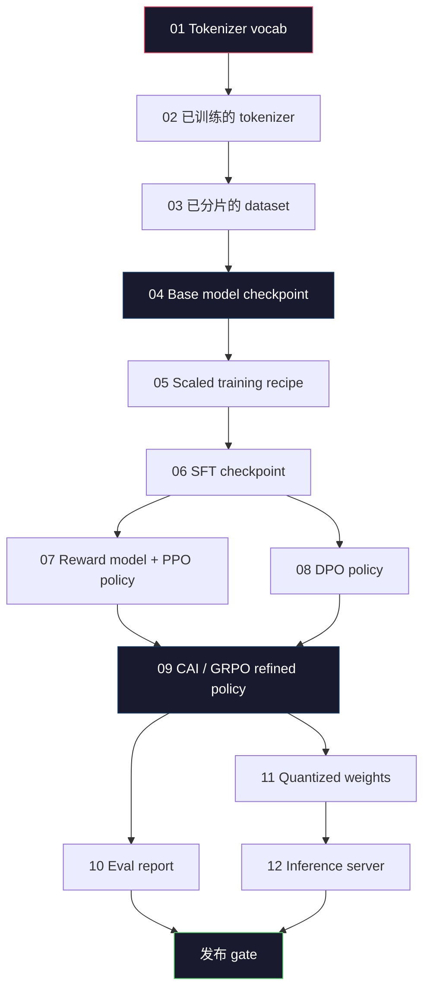
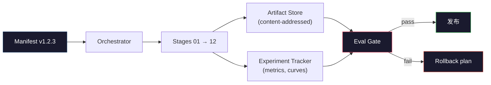

# Construir um oleoduto completo de LLM

> Lições 01 a 12 são todas as matérias de um mesmo pipeline. O curso é transformar essas fases em um guião de execução de um lado para o outro: tokenize, pre-train, escala, SFT, align, evaluar, quantizar, servir. Você não vai treinar um modelo 70B no computador de computador. Você vai produzir uma camada de orquestração, manifesto, portal e plano de rollback, ou seja, uma equipe de fronteira de 2026 para decidir o que pode ser lançado.

**Type:** Build
**Languages:** Python (stdlib)
**Prerequisites:** All Phase 10 lessons 01-12
**Time:** ~120 minutes

## Objectivo de aprendizagem
- 将前十一课(tokenizer、data、pre-training、scaling、SFT、RLHF、DPO、CAI、eval、quantização、inferência) 组合成一个可复现的管道规范
- Definir contrato de artefactos entre cada fase: cada fase consome o que, produz o que, bem como a próxima fase como verificar a entrada
- Construir um orquestrador, para acompanhar experiências, para artefatos, fazer hash, e basear-se em prazos de avaliação decidir se é aprovado o gate
- Design rollback plan: quais artefatos re-lançar custos baixos, quais custos altos, bem como um ponto de controle de deterioração

## 问题
O servidor de inferência está iniciado. Cada um deles é um notebook. Cada um tem sua própria definição, sua própria saída, sua própria semente.

A formação de fronteira não é um notebook. Llama 3 405B, cerca de 30 milhões de horas H100, durou cerca de 54 dias. DeepSeek-V3 utilizou cerca de 2,8 milhões de horas H800. Durante esse período, um ponto de controle de deterioração, uma contaminação de dados, uma regressão de avaliação, tudo pode fazer com que a equipe perca um dia de relógio de parede e um mês de orçamento de GPU.

É o ponto final. Você não vai executar todo o pipeline de ponta a ponta no computador de computador. Você vai escrever um coordenação de cada fase do orquestrador. Descreverá o manifesto do seu funcionamento.

Este modelo de parâmetros de 100M a 1T não mudam. Os mesmos quatro componentes - manifesto, orquestrador, portal de eval, loja de artefatos - já podem funcionar Llama 3, também podem funcionar o seu GPT residual. A diferença é na dimensão digital de cada fase, e não na forma do pipeline.

## 概念
### As Doze Etapas

Cada um dos episódios da fase 10 é um ciclo de aprendizagem.



阶段 07 和 08 可以并行运行──其他所有阶段都是硬依赖──阶段 02(tokenizer) de mudanças fará com que todos os artefatos da down游 失效──阶段 10(eval) de mudanças apenas fará com que a decisão de publicação falhe──

### O Manifesto

O manifesto é um único documento, que deve ser completo para ser reproduzido. Todo o conteúdo que surja da pipeline não deve depender do estado fora do manifesto.

```
pipeline_version: 1.2.3
seed: 42
git_commit: a1b2c3d4
stages:
  01_tokenizer:
    recipe: bpe_32k
    input_hash: sha256:...
    output_hash: sha256:...
    wall_clock_sec: 3600
    cost_usd: 12
```

阶段 N 阶段 N 阶段 N + 1 阶段 N + 1 阶段 N + 1 阶段 N + 1 阶段 N + 1 阶段 N + 1 阶段 N + 1 阶段 N + 1 阶段 N + 1 阶段 N + 1 阶段 N + 1 阶段 N + 1 阶段 N + 1 阶段 N + 1 阶段 N + 1 阶段 N + 1 阶段 N + 1 阶段 N + 1 阶段 N + 1 阶段 N + 1 阶段 N 阶段 N 阶段 N 阶段 N 阶段 N 阶段 N 阶段 N 阶段 N 阶段 N 阶段 N 阶段 N 阶段 N 阶段 N 阶段 N 阶段 N 阶段 N 阶段 N 阶段 N 阶段 N 阶段 N 阶段 N 阶段 N 阶段 N 阶段 N 阶段 N 阶段 N 阶段 N 阶段 N 阶段 N 阶段 N 阶段 N 阶段 N 阶段 N 阶段 N 阶段 N 阶段 N 阶段 N 阶段 N 阶段 N 阶段 N 阶段 N 阶段 N 阶段 N 阶段 N 阶段 N 阶段 N 阶段 N 阶段 N 阶段 N 阶段 N 阶段 N 阶段 N 阶段 N 阶段 N 阶段 N 阶段 N 阶段 N 阶段 N 阶段 N 阶段 N 阶段 N 阶段 N 阶段 N 阶段 N 阶段 N 阶 阶 阶 阶 阶 阶 阶 阶 阶 阶 阶 阶 阶 阶 阶 阶 阶 阶 阶 阶 阶 阶 阶 阶 阶 阶 阶 阶 阶 阶 阶 阶 阶 阶 阶 阶 阶 阶 阶 阶 阶 阶 阶 阶 阶 阶 阶 阶 阶 阶 阶 阶 阶 阶 阶 阶 阶 阶 阶 阶 阶

Na prática, a equipe usará um pequeno esquema YAML, adicionado a um chequeiro manifesto, para fazer diferença na operação de sucesso da última vez. Qualquer coisa que apareça no delta fora do esperado (cost ≈ clock) é uma bandeira vermelha.

### Tipografia de artefatos

Cada fase de saída é um artefato tipado. Não é uma mancha de catálogo, não é um pickle, mas um tipo de nome de esquema conhecido.

| Stage | Artifact Type | Key Fields |
|-------|--------------|-----------|
| 01-02 | Tokenizer | vocab.json, merges.txt, config.json, hash |
| 03 | Dataset | shards[], row count, token count, dedup stats |
| 04-05 | Checkpoint | weights.safetensors, config.json, optimizer state, step count |
| 06 | SFT Model | checkpoint + SFT recipe + data mix |
| 07 | Reward Model | RM checkpoint + preference data hash |
| 08-09 | Policy | checkpoint + reference hash + beta + KL budget consumed |
| 10 | Eval Report | benchmark scores + regression diffs + eval data hash |
| 11 | Quantized Model | quantized weights + calibration data + accuracy delta vs FP16 |
| 12 | Server Spec | endpoint + model hash + config + observability hooks |

Tipografia 能防止最常见的失败模式:把阶段 08 的输出当成阶段 06 的输入,通过SFT 路径发布一个DPO 训练过的模型――Typed artefacts和 typed stage signatures 会让这些错误变成编译时失败,而不是第五天才发现的失败――

### A Porta de Eval

发布不是培训完成──发布是培训完成和 eval gate passed──Gate 在运行开始前就定义好──

```
gates:
  mmlu:      >= baseline + 0.5   # 无 regression
  humaneval: >= baseline + 1.0
  truthfulqa: >= baseline         # 无下降
  safety_refusal_rate: <= 0.05
  kl_from_reference: <= 25.0
  cost_total_usd: <= 50000
```

Cada porta é um limiar numérico. Não há um limite de entrada. Não há um limite de entrada. Se todos os portões forem passados, o artefato será marcado como enviável. Se qualquer porta falhar, esta operação será mantida, aguardando a anulação do revisor, e a anulação também será registrada até o manifesto.

两个门 能抓住大多数灾难──*Regression* gate(新模型在核心基准上必须至少和之前一样好) 能抓住培训 bugs──*KL budget* gate(aligned policy 偏离参考程度不能超过 X) 能抓住alignment 过度加工──每个生产管道都同时拥有这两者──

### O Orquestrador

É um pequeno código, lê-se manifesto, estágios de expedição, rastreia de artefatos e qualquer violação de contrato, para parar. Não é Airflow. Não é Kubeflow. Para higiene de canalização, é preciso escrever o que você mesmo escreve.

O cargo do Orquestrador é muito restrito:

1. Desde o manifesto 解析 DAG。
2. Para cada fase, verifica se o resultado de saída já existe correctamente (se existe, salta)
3. 运行该阶段, capture stdout/stderr, measure wall clock 和 cost──
4. 根据下游阶段预期的输入哈希 验证输出哈希──
5. 失败时, write in contén­ta精确失败阶段的部分宣言,并以非零状态退出──

É cerca de 200 páginas de Python.`code/main.py`文件──底层真实管道 会使用 `torchrun`Ou `ray`Em grupos, executa cada fase, mas o orquestrador, em si, opera em uma máquina única.

### Experimento de rastreamento e armazenamento de artefatos

O sistema de condução é de dois sistemas externos.

**Experiment tracker (wandb, neptune, mlflow).**按阶段记录损失曲线、eval metrics、system telemetry──当你三周后需要比较运行 A 和运行 B 时,tracker就是你查看的地方──团队几乎总是使用主机追踪器──自写会浪费本应用于训练时间──

**Artifact store (S3, R2, GCS).**Used for checkpoints, datasets, tokenizers, eval reports of immutable object store──Artifacts 通过 hash 寻址,而不是通过文件名──像 `latest.pt`Esse nome de arquivo é "Pistola de pé";`ckpt-7b-step-20000-sha256:abc123.safetensors`É um contrato.

Orquestração 会同时写入二者──Tracker 面向看图片 的人──Artifact store 面向需要查找输入的下一个阶段──

### Custo

A execução de fronteiras está ligada a um número de dólares.

**Pre-run estimate.**Desde o manifesto  calcular os FLOPs esperados ((pre-treinamento: 6 x parâmetros x tokens) 、horas de GPU esperadas (((FLOPs / pico de produção / utilização), bem como a taxa de aluguel actual  calcular o custo em dólares― Se a estimativa ≈ exceder o orçamento, a linha de transporte irá recusar a inicialização―

**In-run tracking.** Cada fase de um relógio de parede e os custos serão registrados até o manifesto. Depois de cada fase, todos irão verificar o orçamento restante. Se um estágio for superado, o portão da próxima fase usará o novo orçamento restante para avaliar. Você não vai esperar até que o VC telefone e descubra que o dinheiro já está gasto.

Llama 3  relatório custo $61M。DeepSeek-V3 报告 main pre-training run 为 $5.6M. Essa proporção vem principalmente da eficiência do hardware, além de mistura de especialistas - mas o custo específico é, portanto, visível, porque as duas equipes estão seguindo por fase, e não apenas por execução completa.

### Reprodução vs Determinismo

O segundo é diferente. *Reproducible* significa o mesmo manifesto, o mesmo código e a mesma infraestrutura, produzir um ponto de controle em métricas de baixa corrente, acima do preço.

现代 LLM training é reprodutivo, mas não determinista. O treinamento distribuído de redução de ordem, não-determinismo do kernel de GPU (cuBLAS, flash-attn) e redondamento de precisão mista irá produzir um conjunto de operações entre 1e-5 quantidades diferentes de flutuação.



### Plano de retorno

Antes de começar a operar, escreva o que acontece quando cada fase falha.

- **重新运行成本低**(horas):tokenizer、eval、quantização、servidor de inferência。
- **中等成本**(días):SFT、DPO、CAI──reservar o modelo base; apenas re-lançar os estágios de alinhamento──
- **成本高**(semanas 和数百万美元):pre-treinamento. O plano de retrocesso aqui não é re-run.

Como as dependências de estágio são tipografadas e hashadas, o orquestrador pode calcular automaticamente o set de rollback: make failure阶段 e todos os seus descendentes 失效.

### 2026 Ano observado de produção

A maioria das equipes de fronteira recebeu o mesmo esqueleto.

- Tokenizer:128k BPE com fallback de byte.
- Pre-treinamento: 10-20T tokens, principalmente por web 加 code 加合成 组成──Muon 或 AdamW optimizer──FSDP2 或 DeepSpeed ZeRO-3──Gradient checkpointing──BF16 weights,FP32 master──
- SFT:500k-2M pares de instruções, misturados humanos e sintéticos,并严格对 eval set做 dedup──
- Alignamento: DPO ou CAI + GRPO― apenas em sinal de preferência para DPO para dimensionar o tempo de utilização RLHF―
- Eval:MMLU-Pro、MATH、HumanEval+、GPQA、SWE-Bench Verificado、LiveBench, adicionado a um conjunto público 永远看不到的私人持有
- Quantização:servição Utilização GPTQ ou AWQ de 4 bits; precisão de delta  importantes avaliações de segurança Utilização 8-bit。
- Servidora: vLLM、TensorRT-LLM 或 interna──contínua batchagem──descodificação especulativa──KV cache evição──

O número de pessoas que estão a mudar todos os meses.


```figure
beam-search
```

## Construí-lo
O código do curso é o orquestrador e o verificador de manifesto, e não os 12 scripts de treinamento. Cada fase é feita com um lugar contendo, para criar um artefato de saída de forma correta e hash.

完整实现见 `code/main.py`❖ 关键部分:

- `Manifest`Dataclass:version pipeline、seed、git commit、stages、gates。
- `Stage`Dataclass: nome, tipo, entradas, hashes, saída, hash, relógio de parede, custo.
- `Orchestrator.run()`: resolver DAG, fases de envio, verificação de hashes, renovação de manifesto.
- `EvalGate.check()`• Read取 thresholds• Com o último relatório de avaliação
- `ArtifactStore`(em memória) (em memória): por hash put/get,模拟 S3。
- `CostTracker`O custo acumulado, por fase, excede o limite de tempo de suspensão.

`main.py`O pipeline central irá executar 12 estágios de placeholder, gerar um manifesto, e demonstrar um gate de avaliação fracassado, para mostrar a forma de execução realizada.

## Use-o
O fluxo de trabalho canônico tem três ordens:

```
python code/main.py plan    # 验证 manifest，计算 cost estimate，打印 DAG
python code/main.py run     # 执行 stages，写入 manifest.out.yaml
python code/main.py gate    # 读取 manifest.out.yaml，应用 eval gates，ship-or-hold
```

Cada vez que eu faço o que eu faço`plan`◊ A maioria dos erros de pipeline 会在计划时间 出现 -- 缺失门门, hashes stales, orçamento excede¬¬¬运行`plan`É gratuito.`run`É muito caro. Por um lado, apanha os bugs para salvar dinheiro.

`gate`O que é que é o resultado?`SHIP`- Não , não .`HOLD: <reason>`❖ O que foi feito não é um fracasso; é um ponto de decisão.

## Entrega-o
本课会产出 `outputs/skill-llm-pipeline-reviewer.md` Colocar um manifesto de pipeline proposto  lhe dar, ele irá verificar todos os contratos: fase de digitação, cadeia de hash, portas, plano de retrocesso, estimativa de custos.

## 练习
1. 扩展乐团员,让它支持阶段 07 和 08 的并行执行──使用 stdlib `concurrent.futures`O módulo  confirma o manifesto final                                                                                                                                                                                                                                                                                                                                                                                                                                                                                                                    

2. 添加一个污染检查门──给定 eval dataset hash 和 training dataset shards,计算重叠(exacto coincidência de cadeia ou coincidência de 13 gramas)── Se a sobreposição 超过 0.1%,gate 失败──进入一个被污染的训练集,并确认 gate 会保持这个次运行──

3. A partir dos primeiros princípios  implementar um estimador de custos ∙ para a fase 04  pré-treinamento),  FLOPs  estimativa  6 x parâmetros x tokens, suposição H100  BF16  989 TFLOPs, MFU  FLOPs modelo utilização)  40%, preço  2,50$/GPU-hora ∙ relatório  Estimativa  modelo 7B  em tokens 2T  treinamento    com Llama 2 

4. Construir um rollback parcial. • • • • • • • • • • • • • • • • • • • • • • • • • • • • • • • • • • • • • • • • • • • • • • • • • • • • • • • • • • • • • • • • • • • • • • • • • • • • • • • • • • • • • • • • • • • • • • • • • • • • • • • • • • • • • • • • • • • • • • • • • • • • • • • • • • • • • • • • • • • • • • • • • • • • • • • • • • • • • • • • • • • • • • • • • • • • • • • • • • • • • • • • • • • • • • • • • • • • • • • • • • • • • • • • • • • • • • • • • • • • • • • • • • • • • • • • • • • • • • • • • • • • • • • • • • • • • • • • • • • • • • • • • • • • • • • • • • • • • • • • • • • • • • • • • • • • • • • • • • • • • • • • • • • • • • • • • • • • • • • • • • • • • • • • • • • • • • • • • • • • • • • • • • • • • • • • • • • • • • • • • • • • • • • • • • • • • • • • • • • • • • • • • • • • • • • • • • • • • • • • • • • • • • • • • • • • • • • • • • • • • • • • • • • • • • • • • • • • • • • • • • • • • • • • • • • • • • • • • • • • • • • • • • • • • • • • • • • • • • • • • • • • • • • • • • • • • • • • • • • • • • •

5. 添加可观看性──为每阶段发发发 OpenTelemetry spans,attributes包括params、tokens seen、loss 和 cost──将 spans 管道传到本地收集者──重点不是仪表板;重点是每个阶段的健康 都能通过单个追踪ID 追踪──

## 关键术语
| Term | What people say | What it actually means |
|------|----------------|----------------------|
| Manifest | “recipe file” | 描述 pipeline version、seed、per-stage config 和 gate thresholds 的 YAML 或 JSON，足以 replay 一次 run |
| Content-addressed | “按 hash 而不是 name” | Artifacts 按其内容的 SHA-256 存储，因此你永远不会把 version A 和 version B 混淆 |
| Eval gate | “发布标准” | Benchmark metrics 和 safety scores 上的 numeric thresholds，必须通过后 artifact 才会被标记为 shippable |
| KL budget | “alignment drifted 有多远” | 对 alignment stages 上累计 KL(policy || reference) 的 cap，并作为 gate 强制执行 |
| MFU | “你用了多少 GPU” | Model FLOPs Utilization，即 achieved FLOPs 除以 theoretical peak。70B scale 典型值为 40%，7B 为 55% |
| Rollback plan | “出问题时我们做什么” | 每个阶段失败时预先写好的 actions：re-run、fall back、使用修订后的 inputs retrain |
| Orchestrator | “conductor” | 读取 manifest、dispatch stages、验证 hashes，并在任何 contract violation 时停止的 process |
| Artifact store | “用于 weights 的 versioned S3” | Immutable content-addressed object store，是 checkpoints、datasets、eval reports 的 single source of truth |
| Reproducible | “Replay 时 metrics 相同” | Bit-level weights 不同但 downstream metrics 等价，这是 distributed LLM training 的现实目标 |
| Cost gate | “不能超过 X” | Pre-run cost estimate 加 in-run tracker；如果 estimate 超过 budget，pipeline 会拒绝启动 |

## 延伸阅读
- [Dubey et al., 2024 -- "The Llama 3 Herd of Models"](https://arxiv.org/abs/2407.21783)- a linha de transporte de fronteiras, a mais detalhada descrição pública, que abrange dados, formação, alinhamento,
- [DeepSeek-AI, 2024 -- "DeepSeek-V3 Technical Report"](https://arxiv.org/abs/2412.19437)-- Em função da eficiência, o custo é de cerca de 1/10 da formação de classe Llama 3
- [Kaplan et al., 2020 -- "Scaling Laws for Neural Language Models"](https://arxiv.org/abs/2001.08361)-- inicial relação de escalagem computação-parâmetros de dados
- [Hoffmann et al., 2022 -- "Training Compute-Optimal Large Language Models (Chinchilla)"](https://arxiv.org/abs/2203.15556)-- para a revisão do Kaplan, re-classificação dos orçamentos de dados modernos
- [PyTorch FSDP2 documentation](https://pytorch.org/docs/stable/fsdp.html)-- em PyTorch 2.4+ 中替代FSDP1 的分布式训练原始
- [Weights & Biases LLM Reports](https://wandb.ai/site/llms)-- Open-source LLM executa de verdade manifestos e experimentos de tracker de saída, como modelos de
