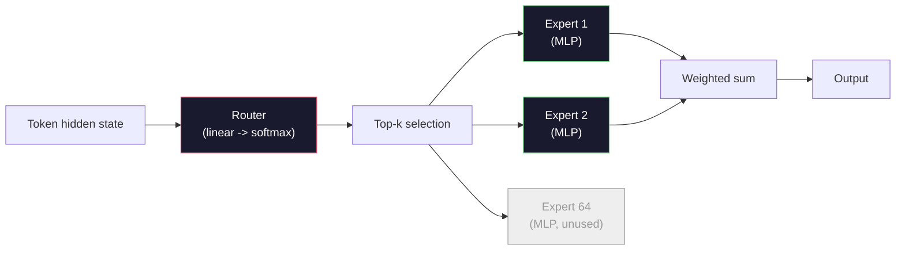

# Modelos abertos: 架构讲解

> Você em quarta aula construiu um modelo aberto de GPT-2 Small──2026 anos de vanguarda  pertence a mesma família, apenas há cinco e seis mudanças específicas──usando RMSNorm 取代LayerNorm──usando SwiGLU 取代GELU──usando RoPE 取代学会的位置──usando GQA或MLA 取代完整的MHA──usando MMA──大规模使用混合专家── Você já domina 95% das matemáticas.

**Type:** Learn
**Languages:** Python (stdlib)
**Prerequisites:** Phase 10, Lessons 04, 05, 12 (Pre-training, Scaling, Inference)
**Time:** ~45 minutes

## Objectivo de aprendizagem
- 阅读 Llama 3、Mistral、Mixtral、Gemma 2、Qwen 2.5 和 DeepSeek-V3 的 config.json,并解释每一个字段
- Explicar cada modelo em relação ao GPT-2 Pequeno feito de mudanças específicas de estrutura, e não de primeira natureza
-  apenas com base na configuração  calcular qualquer modelo aberto   KV cache                                                                                                                                                                                                                                                                                                                                                                                                                                                                                                             
- Em determinado tempo de atraso, memória e capacidade, para a implementação, escolha um modelo aberto adequado

## 问题
Na quarta aula, você escreveu 350 linhas de numpy, obteve um modelo de forma GPT-2 ⋅ Llama 3 405B tem um relatório técnico de 200 páginas⋅ Sua intuição pode pensar que são espécies diferentes⋅ Na verdade não são⋅ que as 200 páginas descrevem o mesmo objeto, apenas há cinco ou seis movimentos de modificações definidas, adicionando-se a um grande número de detalhes de implementação sobre a escalação⋅ estrutura não mudou:embedding、transformer blocosAttenção、MLP、normhead、。

Este curso é uma diferença. Para cada modelo aberto principal, nós vamos identificar o que mudou em relação ao GPT-2.

 Recetas reais são: quando Meta lança Llama 5, ou DeepSeek lança V4, você não precisa de um novo modelo mental. Você vai olhar para o config, ver quais são as rotas de conhecimento que foram modificadas, e então saber o que é o impacto do novo modelo.

## 概念
### O núcleo invariavel

Todos os modelos abertos autoregressivos são partilhados:

- Marca de inserção Matriz ((vocab_size x hidden_dim) 』
- N 个 decodificador blocos 堆叠:norma, auto-atenção, residuais, norma, MLP, residuais
- Nota final 和投影到 vocab_size 的直线头 (normalmente ligada ao peso dos embutidos)
- Mascara causal, perda de entropia cruzada de signos seguintes.

É assim que se forma o resto é giro.

### Os seis botões que realmente funcionam

Em todos os modelos abertos de 2024-2026, seis modelos de design apareceram repetidamente:

1. **Normalization.**LayerNorm -> RMSNorm。
2. **Positional encoding.**Aprendi absoluto -> RoPE(加上变体:YaRN、NTK)
3. **Activation.**GELU -> SwiGLU(or GeGLU)
4. **Attention head sharing.**MHA -> GQA -> MQA -> MLA。
5. **Dense vs sparse MLP.**Densa -> Mistura de Especialistas
6. **Pre-norm placement.**保持 Pre-norm──Post-norm 已消失──

其他一切(programas de taxa de aprendizagem, mix de dados, tamanho de lote, comprimento de contexto) são de configuração de treinamento, e não de estrutura.

### Nodo 1: RMSNorm

LayerNorm 会减减平均值、除以 std、缩放并平移──RMSNorm apenas manter em menor:

```
RMSNorm(x) = x / sqrt(mean(x^2) + eps) * gamma
```

没有均值消除──没有偏见──每个代币少一次 matmul──Zhang and Sennrich (2019) 认为它在机器翻译上可以匹配LayerNorm,同时快 10%──所有现代开放模型都使用它──

代价:没有──收益:小幅吞吐量 提升,代码更简单──

### Nótulo 2: RoPE

Embedings de posição aprendidas em GPT-2 é um 1024 slot de busca de um formulário.

Embutida em posição rotativa (RoPE, Su et al. 2021) através do produto de ponto de atenção, cada vetor Q e K será inserido em posição.

```
q_rotated = rotate(q, angle(pos))
k_rotated = rotate(k, angle(pos))
score = q_rotated . k_rotated
```

Cada Llama、Mistral、Qwen、DeepSeek 和 Gemma 都使用 RoPE──Gemma 2 使用混合方式(A maioria das camadas utiliza RoPE, outras camadas utiliza local de janela deslizante atenção)──

### Noto 3: SwiGLU

A MLP do GPT-2 é`x -> gelu(xW1 + b1) -> (...)W2 + b2`──SwiGLU(Shazeer 2020) Used gated product 替换激活:

```
SwiGLU(x) = (xW1) * sigmoid(xW1) * xV
```

两个并行投射,而不是一个,由Swiss激活 进行 gate。实证上,它在每参数困难上更强。Llama 2 采用它,随后大家都跟进──MLP 隐藏大小通常会设置让总参数匹配原始密集 MLP:如果GPT-2 使用`ff_dim = 4 * hidden`,SwiGLU `ff_dim = (2/3) * 4 * hidden = 8/3 * hidden`- Não.

### Noque 4: Partilha de cabeça de atenção

GPT-2 使用 **Multi-Head Attention (MHA)**Cada cabeça tem sua própria projeção Q 、K 、V.

**Multi-Query Attention (MQA, Shazeer 2019)**Em todos os cabeças  compartilhar um K e um V ⋅ vai KV cache 按 num_heads 缩减, em modelo típico é 12x até 32x de baixa ⋅ Precision 在困难基准上会略有下降──

**Grouped-Query Attention (GQA, Ainslie et al. 2023)**É o meio-termo: G 组 Q heads 共享一个 K 和一个 V。Llama 3 8B GQA, contém 32 个 Q heads 和 8 个 KV heads(G=8), então相相较完整MHA,KV cache 缩小4x。

**Multi-Head Latent Attention (MLA, DeepSeek 2024)**Em um ambiente latente de baixo nível, reapressa-se o teste 投影回去── ele reduz ainda mais o cache KV, enquanto mantém a capacidade de expressão de cada cabeça──DeepSeek-V2 和 V3 depende de ele para alcançar o desempenho de longo contexto──

| Scheme | KV Heads | KV Cache | Accuracy |
|--------|----------|----------|----------|
| MHA    | num_heads | full | 最好 |
| GQA    | num_groups (G < num_heads) | num_heads / G 缩减 | 接近 MHA |
| MQA    | 1 | num_heads 缩减 | 小幅损失 |
| MLA    | latent, per-head decompression | 小于 MQA | 接近 MHA |

Para qualquer modelo com mais de 13B, GQA ou MLA são, na verdade, necessários.

### No 5 - Mistura de Especialistas

O MLP denso vai para cada token  ativar todos os parâmetros。 O MLP MOE em cada bloco tem K 个 especialistas, bem como um roteador, ele vai para cada token  escolher os principais especialistas k 

```
router_logits = xW_r
indices, weights = top_k(router_logits, k=2)
output = sum_i weights[i] * expert[indices[i]](x)
```

吸引力在于: você pode ter 64 个各自 7B 大小的专家((所以总参数巨大), mas cada Token apenas运行其中2个((所以 per token computador 匹配密集 7B 模型)  Mixtral 8x7B 总参数为47B,但每个 Token只激活13B──DeepSeek-V3 总参数为671B,但每个 Token只激活37B──



优点: igual computação 更多参数 更多强容量──缺点:expert memory 仍然必须放在某处((所以服务需要比密集等价模型更多的VRAM) 路由器的负载平衡很难,而且在调整期间调整路由器 本身就是一个研究领域──

### Nobre 6: Restos pré-normais

Primeiro transformador em cada subcamada                                                                                                                                                                                                                                                                                                                                                                                                                                                                                                                      

### Diferença modelo por modelo

A seguinte tabela especifica tudo o que está em seu conteúdo.

| Model | Year | Total Params | Active Params | Norm | Activation | Position | Attention | MoE | Context |
|-------|------|-------------|---------------|------|-----------|----------|-----------|-----|---------|
| GPT-2 Small | 2019 | 124M | 124M | LayerNorm | GELU | Learned | MHA (12 heads) | no | 1k |
| Llama 3 8B | 2024 | 8B | 8B | RMSNorm | SwiGLU | RoPE | GQA (32/8) | no | 128k |
| Llama 3 70B | 2024 | 70B | 70B | RMSNorm | SwiGLU | RoPE | GQA (64/8) | no | 128k |
| Llama 3 405B | 2024 | 405B | 405B | RMSNorm | SwiGLU | RoPE | GQA (128/16) | no | 128k |
| Mistral 7B | 2023 | 7.2B | 7.2B | RMSNorm | SwiGLU | RoPE | GQA | no | 32k |
| Mixtral 8x7B | 2023 | 47B | 13B | RMSNorm | SwiGLU | RoPE | GQA | yes (8 experts, top-2) | 32k |
| Gemma 2 9B | 2024 | 9B | 9B | RMSNorm (pre+post) | GeGLU | RoPE + sliding | GQA | no | 8k |
| Qwen 2.5 72B | 2024 | 72B | 72B | RMSNorm | SwiGLU | RoPE (YaRN) | GQA (64/8) | no | 128k |
| DeepSeek V2 236B | 2024 | 236B | 21B | RMSNorm | SwiGLU | RoPE | MLA | yes (160 experts, top-6) | 128k |
| DeepSeek V3 | 2024 | 671B | 37B | RMSNorm | SwiGLU | RoPE | MLA | yes (256 experts, top-8) | 128k |

扫描这些列──RMSNorm é comum──SwiGLU ou seu GeGLU 近亲是通用──RoPE é comum──7B 以上 GQA é comum, salvo que seja substituído por MLA──MoE é o ponto de diferença do modelo de topo──

### Lendo um config.json

Llama 3 8B configuração:

```
{
  "hidden_size": 4096,
  "intermediate_size": 14336,
  "num_hidden_layers": 32,
  "num_attention_heads": 32,
  "num_key_value_heads": 8,
  "max_position_embeddings": 131072,
  "rope_theta": 500000.0,
  "rms_norm_eps": 1e-5,
  "vocab_size": 128256
}
```

Cada episódio é para o que já conseguiste.

- `hidden_size`: dimensão de inserção:
- `intermediate_size`: MLP tamanho oculto ((3.5x oculto -- SwiGLU 数学) 』
- `num_hidden_layers`: profundidade da pilha。
- `num_attention_heads`- Capazes de Q:
- `num_key_value_heads`: cabeças de KV ((GQA)。
- `max_position_embeddings`: longo prazo do contexto de formação.
- `rope_theta`: Frequência base do RoPE──Meta irá transformá-lo de 10k em escala até 500k, para extrapolação de longo contexto──
- `rms_norm_eps`: estabilidade numérica。
- `vocab_size`: tokens。

 apenas com estes, você pode calcular                                                                                                                                                                                                                                                           `code/main.py`- Não.

### Orçamento de memória de ativação

Em mais de alguns bilhões de parametros, as atividades serão orientadas pela memória de treinamento.

```
activation_mem ~ batch_size * seq_len * hidden_size * num_layers * bytes_per_element
```

对于Llama 3 8B,在批 1、seq 8192、BF16、32层、隐藏 4096 时:仅激活就约需要8GB(使用检查点),不使用则约40GB──这就是闪点注意和环点注意 重要原因:它们重写注意计算,让激活能够放下──

### Orçamento de caché KV

对于最大背景下的推论:

```
kv_cache = 2 * num_layers * num_kv_heads * head_dim * max_seq_len * bytes_per_element
```

Llama 3 8B em contexto 128k ЅF16 Ѕhead_dim = oculto / num_heads = 128 时:
`2 * 32 * 8 * 128 * 131072 * 2 = 17.2 GB`Cada sequência.

Os pesos de 8B em BF16 são 16 GB. Em uma sequência de 128k, o cache KV é maior do que os pesos. Isso é o que impulsiona a quantização do cache GQA, MLA e KV.

### Quando cada modelo ganha

- **单张 80GB GPU，无 MoE**Llama 3 8B、Mistral 7B、Gemma 2 9B。
- **单节点（8x80GB），大 capacity**Llama 3 70B、Qwen 2.5 72B― maior capacidade de abertura densa―
- **最大的 open capability，可接受 MoE 复杂度**Profundidade: Procurar V3、Mixtral 8x22B― para cada FLOP ativo 
- **Long-context 需求**A Llama 3 (a partir da escalação do RoPE) alcança 128k (a) ∆ Profundos Buscas (a)  MLA 优势) 
- **Low-latency serving**:Gemma 2 9B(janela deslizante 降低 computação de longo contexto)


```figure
rmsnorm-vs-layernorm
```

## Construí-lo
O código deste curso é uma calculadora.

```python
config = {
    "hidden_size": 4096, "intermediate_size": 14336,
    "num_hidden_layers": 32, "num_attention_heads": 32,
    "num_key_value_heads": 8, "vocab_size": 128256,
    "max_position_embeddings": 131072,
}
```

脚本会逐字段遍历架构,计算嵌入、attention(带 GQA reduction)、MLP(带 SwiGLU expansion)、layernorms 和 head 的参数──然后它会根据给定的背景长度计算 KV cache,并打印总结──

实现见 `code/main.py`- Não.

## Use-o
运行计算器, usando o script em conjunto Llama 3 8B、Mistral 7B、Mixtral 8x7B 和 DeepSeek V3 configurações。 comparar parâmetros de desintegração。 atenção MoE modelos de parâmetros de parâmetros de parâmetros de parâmetros muito densos, mas a contagem ativa 往往更小。 atenção DeepSeek V3 KV cache 虽然总参数更多,但小于 Llama 3 405B 的 KV cache ―这就是 MLA 的效果──

Depois, coloque o configurador do seu modelo local, leia o resumo e decida se ele é adequado para a sua GPU.

## Entrega-o
本课会生成 `outputs/skill-open-model-picker.md` Definir um objetivo de implementação (GPU tipo, VRAM, comprimento de contexto, orçamento de atraso) e uma tarefa (chat, código, raciocínio, longo contexto), que irá sugerir um modelo aberto, esquema de quantização na 11a classe, bem como a pilha de inferências na 12a classe, e explicando claramente seis teorias relacionadas com a estrutura.

## 练习
1. Desde HuggingFace 阅读 Qwen 2.5 72B config.

2. DeepSeek V3 utiliza 256 especialistas, não adota o roteamento de 8 principais, não utiliza a proporção de especialistas ativados com a proporção total de especialistas, não compara com os 8 principais dos Mixtral 8x7B, não é de 25% para 3% para cada capacidade de FLOP.

3. 計算 Llama 3 405B em contexto de 128k 下使用FP8 和 BF16 时的KV cache──FP8 é um dos valores do BF16 数值的一半──在单个8xH100节点上(每张 80GB = 总计 640GB,减重内存),你能服务多少的平行序列?

4. Gemma 2 交替使用全注意 和滑走窗-注意层──当一半层 使用4096-token滑走窗而不是全文 context 时,写出KV cache的数学公式──在8k total context 下能节省多少内存?

5.  encontrar um modelo aberto de avanço de recente prazo publicado após a conclusão deste curso. Identificar quais dos seis rotos ele escolheu, bem como se introduziu a sétima rotora.  O objetivo é atualizar sua forma de trabalho sob a premissa de não reconstruir o modelo mental.

## 关键术语
| Term | What people say | What it actually means |
|------|----------------|----------------------|
| RMSNorm | “没有均值的 LayerNorm” | 只按 root mean square 进行 normalize，并使用 learned scale -- 更便宜且可与 LayerNorm 相比 |
| RoPE | “Rotary positions” | 将每个 Q 和 K Vector 按 2D pairs 旋转，角度取决于 position -- 结合 scaling 技巧可外推到训练长度之外 |
| SwiGLU | “新的 MLP activation” | 带 Swish 的 gated linear unit：`(xW1) * sigmoid(xW1) * xV` -- 是每个 2024+ open model 的标准配置 |
| GQA | “中间路线 attention” | Grouped-Query Attention：G 组 Q heads 共享一个 K 和一个 V head -- 在避免 MQA accuracy 损失的同时缩小 KV cache |
| MLA | “DeepSeek 的 attention” | Multi-Head Latent Attention：将 K/V 压缩到共享 low-rank latent，再按 head 解压 -- 大模型中最小的 KV cache |
| MoE | “Sparse experts” | Mixture of Experts：每个 block 有 N 个 MLPs，router 为每个 Token 选择 top-k -- 巨大的 total params，较小的 active params |
| Top-k routing | “每个 Token 选择 k 个 experts” | Router 为每个 expert 计算分数，并激活最高的 k 个 -- 典型 k 从 2（Mixtral）到 8（DeepSeek） |
| YaRN | “拉伸 RoPE” | Yet another RoPE extension -- 通过插值 rotary angles，在 inference 时将 context 从 8k 扩展到 128k+ |
| Sliding-window attention | “不要 attend to everything” | 每个 Token 只 attend 到最近 W 个 Tokens -- 将 attention cost 限制为每 Token O(W)，用于 Gemma 2 和早期 Mistral |
| Active params | “每个 Token 实际运行的部分” | 对于 MoE models，指每个 Token 会经历 forward pass 的参数量（远小于 total params）-- 决定 per-token FLOPs |

## 延伸阅读
- [Dubey et al., 2024 -- "The Llama 3 Herd of Models"](https://arxiv.org/abs/2407.21783)-- densa Llama 3 família de estrutura e treinamento referência
- [DeepSeek-AI, 2024 -- "DeepSeek-V3 Technical Report"](https://arxiv.org/abs/2412.19437)-- MLA加 auxiliar-loss-free balancing of load 加 671B MoE
- [Jiang et al., 2024 -- "Mixtral of Experts"](https://arxiv.org/abs/2401.04088)-- 经典 MoE modelo aberto 论文
- [Su et al., 2021 -- "RoFormer: Enhanced Transformer with Rotary Position Embedding"](https://arxiv.org/abs/2104.09864)-- RoPE 论文
- [Shazeer, 2020 -- "GLU Variants Improve Transformer"](https://arxiv.org/abs/2002.05202)-- SwiGLU、GeGLU 及相关方法
- [Ainslie et al., 2023 -- "GQA: Training Generalized Multi-Query Transformer Models"](https://arxiv.org/abs/2305.13245)-- GQA 论文
- [Gemma 2 Team, 2024 -- "Gemma 2: Improving Open Language Models at a Practical Size"](https://arxiv.org/abs/2408.00118)-- híbrido de atenção completa+deslizante
- [Qwen Team, 2024 -- "Qwen 2.5 Technical Report"](https://arxiv.org/abs/2412.15115)-- Extensão do contexto da RNY e receitas de formação em longo contexto
