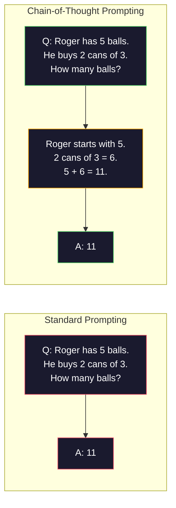
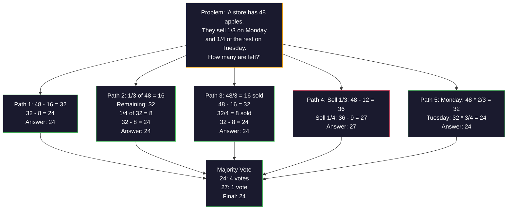
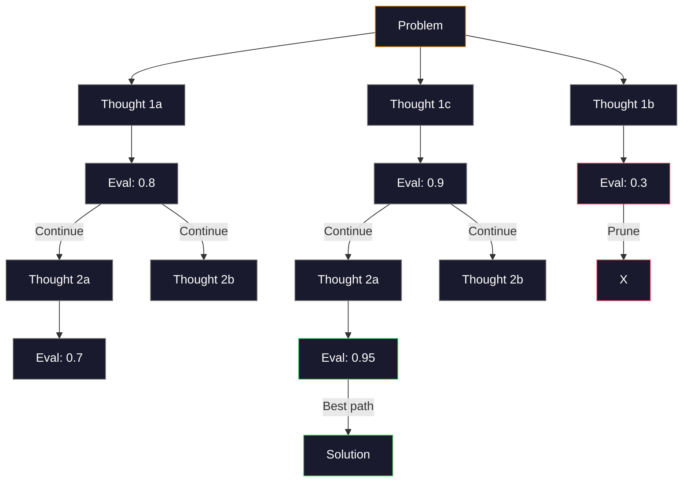

# Pouco-Shot,Chain-of-Thought,Tree-of-Thought

> Diga ao modelo o que fazer é incitar. Mostre-lhe como pensar é engenharia. O mesmo modelo, a mesma tarefa, os mesmos dados, a diferença de 78% a 91% de precisão, não é um melhor modelo, mas uma melhor estratégia de raciocínio.

**类型：**Construção
**语言：**Python
**先修要求：**Lição 11.01 (Engenharia de Pronto)
**时间：**Cerca de 45 minutos

## Objectivo de aprendizagem

-                                                                                                                                                                                                                                                                                                                                                                                                                                                                                                                              
-  aplicação de cadeia de pensamento (CoT)  recomendação, melhoria da precisão dos problemas de aplicação matemática e outros passos
- Construir um arvore de pensamento rápido, explorar vários caminhos e escolher o melhor caminho
- Em referência padrão, a medida de zero-shot, poucos-shot e CoT aumentam a taxa de precisão

## 问题

Você está construindo um aplicativo de orientação matemática. Seu prompt escreve: "Solução deste problema de palavra".

Adicionalmente, a taxa de precisão de dados aumentou para 91% e, em seguida, alguns exemplos de soluções completas chegaram a 95%.

Não é um hack. É o modo de pensar. O ser humano não vai dar um salto de cabeça para resolver o problema de várias etapas. O transformador também não vai. Quando você forçar um modelo a gerar um token intermediário, estes tokens serão os seguintes tokens.

Mas, se você tiver uma proposta de ideias, como é que ela vai ser feita? Se você tiver uma proposta de ideias, como é que ela vai ser feita? Se você tiver uma proposta de ideias, como é que ela vai ser feita?

## 核心概念

### Zero-Shot vs Few-Shot: exemplo de quando venceu instruções

Instrução de tiro zero apenas dá ao modelo uma tarefa, além disso nada nada dá. Instrução de tiro poucos irá dar primeiro um exemplo do modelo.

Wei et al. (2022) em 8 benchmarks acima mediram este ponto. Para tarefas simples como emoção, zero-shot e poucos-shot, a diferença de desempenho é de 2% em. Para tarefas complexas como multi-fase aritmética e raciocínio de símbolos, poucos-shot pode aumentar a taxa de precisão de 10-25%.

直觉是: exemplo é instrução de compressão posterior. Com sua descrição de um formato de saída, não como demonstração direta. Com sua interpretação do processo de dedução, não como demonstração direta. Comparado a explicação de instruções de abstração, o modelo é mais confiável para executar a correspondência de modelos em exemplo.


**few-shot 适合的场景：**Termos específicos em matéria de tarefas sensíveis ao formato, categorias, extrações estruturadas, bem como qualquer tarefa que precise de um modelo adequado a um determinado modelo.

**zero-shot 适合的场景：** simples fatos  exemplos de tarefas criativas limitantes, bem como encontrar bons exemplos de tarefas mais difíceis de escrever.

### Demonstração de escolha:

Não são todos os exemplos os mesmos. Os exemplos de seleção semelhantes a metas são de 5-15% em comparação com as seleções arbitrárias em tarefas de classe.

1. **语义相似性**:选择 Embedding 空间中最接近输入的示例
2. **标签多样性**Exemplos para cobrir todas as categorias de saída
3. **难度匹配**• nível de complexidade do problema de correspondência

Para a maioria das tarefas, o melhor número de exemplos é de 3-5 ⋅ menos de 3 ⋅ horas, o modelo não tem um modelo de extração de sinal suficiente ⋅ mais de 5 ⋅ horas, o lucro diminui e o desperdício de janelas de contexto Token⋅ para várias categorias de tags, cada um dos tags usa um exemplo ⋅

### Cadeia de Pensamento: Give模型草稿纸

A cadeia de pensamento (CoT) foi proposto por Google Brain's Wei et al. (2022) ⋅ ideia é simples: não apenas exigir que o modelo dê a resposta, mas primeiro exigir que ele mostre os seus passos.



Do mecanismo, por que isso é válido? Transformador produzido cada token será o próximo token. Sem CoT, o modelo deve comprimir todas as teorias para um estado oculto de passagem avançada.

**GSM8K benchmark（小学数学，8.5K 道题）：**

| Model | Zero-Shot | Zero-Shot CoT | Few-Shot CoT |
|-------|-----------|---------------|--------------|
| GPT-4o | 78% | 91% | 95% |
| GPT-5 | 94% | 97% | 98% |
| o4-mini (reasoning) | 97% | — | — |
| Claude Opus 4.7 | 93% | 97% | 98% |
| Gemini 3 Pro | 92% | 96% | 98% |
| Llama 4 70B | 80% | 89% | 94% |
| DeepSeek-V3.1 | 89% | 94% | 96% |

**关于 reasoning models 的说明。**O-série de OpenAI ((o3、o4-mini) e DeepSeek-R1 等 modelos irá funcionar dentro da cadeia de pensamento                                                                                                                                                                                                                                               

A TCC tem duas formas:

**Zero-shot CoT**Em seguida, o número de dados que são utilizados para o cálculo é de aproximadamente 0,005 e, em seguida, de 0,005 e, em seguida, de 0,005 e, em seguida, de 0,005 e, em seguida, de 0,006 e, em seguida, de 0,006 e, em seguida, de 0,006 e, em seguida, de 0,006 e, em seguida, de 0,006 e, em seguida, de 0,006 e, em seguida, de 0,006 e, em seguida, de 0,006 e, em seguida, de 0,006 e, em seguida, de 0,006 e, em seguida, de 0,006 e, em seguida, de 0,006 e, em seguida, de 0,00 e, em seguida, de 0,00 e, em seguida, de 0,00 e, em seguida, de 0,00 e, em seguida, de 0,00 e, em seguida, de 0,00 e, em seguida, de 0,00 e, em seguida, de 0,00 e, em seguida, de 0,00 e, em seguida, de 0,00 e, em seguida, de 0,00 e, em seguida, de 0,00 e, em seguida, de 0,00 e, em seguida, de 0,00 e, em seguida, de 0,00 e, em seguida, de 0,00 e de 0,00 e de 0,00 e de 0,00 e de 0,00 e de 0,00 e de 0,00 e de 0,00 e de 0,00 e de 0,00 e de 0,00 e de 0,00 e de 0,00 de 0,00 e de 0,00 de 0,00 e de 0,00 de 0,00 e de 0,00 de 0,00 de 0,00 e de 0,00 de 0,00 de 0,00 de 0,00 de 0,00 de 0,00 de 0,00 de 0,00 de 0,00 de 0,00 de 0,00 de 0,00 de 0,00 de 0,00 de 0,00 de 0,00 de 0,00 de 0,00 de 0,00 de 0,00 de 0,00 de 0,00 de 0,00 de 0,00 de 0,00 de 0,00 de 0,00 de 0,00 de 0,00 de 0,00 de 0,00 de 0,00 de 0,00 de 0,00 de 0,00 de 0,00 de 0,00 de 0,00 de 0,00 de 0,00 de 0,00 de 0,00 de 0,00 de 0,00 de 0,00 de 0,00 de 0,00 de 0,00 de 0,00 de 0,00 de 0,

**Few-shot CoT**O modelo pode ver o formato de cálculo preciso de suas expectativas.

**CoT 会伤害表现的场景**A taxa de expansão é de aproximadamente 50 a 200 toneladas por consulta. Para as tarefas de alta densidade, é um custo de desperdício.

### Autoconsistência: várias vezes, uma vez votado

Wang et al. (2023)  propôs autoconsistência.  O seu principal intuito é que um único caminho de CoT pode conter errores de cálculo.



Em experimentos originais do PaLM 540B, a autoconsistência aumentará a taxa de precisão do GSM8K de 56,5% (→ 1a linha de CoT) para 74,4% (→ N=40 时).

权衡是:N 个样本意味着N 倍 API 成本和延迟―― na prática,N=5 能获得大部分收益――N=3 é o valor mínimo de voto significativo―― para a maioria das tarefas,N > 10 收益递减――

### Árvore do Pensamento:分支式探索

Yao et al. (2023)  propôs Tree-of-Thought (ToT) ;;CoT  along a 条条线性推理路径前进, enquanto ToT 会探索多个分支, e continuar antes de avaliar quais分支有最前景──



A TT tem três componentes:

1. **Thought generation**: gerar vários candidatos
2. **State evaluation**Para cada candidato, pode utilizar o Mestrado em Direito (LLM) como avaliador.
3. **Search algorithm**Por meio de BFS ou DFS, através de árvores,

Em jogo de 24 任务中 ([[Uzu 算术组合 4 个数字得到 24), o GPT-4 解题率 de utilização de standard prompting é de 7,3%── utilizar o CoT é de 4,0%──CoT é aqui, na verdade, prejudicial, pois o espaço de busca é muito amplo── utilizar o ToT 则达到 74%──

Para cada um dos pontos da árvore, é necessário uma única mudança de Mestrado em Ciências Humanas.

### ReAct: Pensar + Fazer

Yao et al. (2022) vai trocar entre o método de pensar e o método de calcular.

```mermaid
graph LR
    Q["Question:\nWhat is the\npopulation of the\ncountry where\nthe Eiffel Tower\nis located?"]
    T1["Thought: I need to\nfind which country\nhas the Eiffel Tower"]
    A1["Action: search\n'Eiffel Tower location'"]
    O1["Observation:\nParis, France"]
    T2["Thought: Now I need\nFrance's population"]
    A2["Action: search\n'France population 2024'"]
    O2["Observation:\n68.4 million"]
    T3["Thought: I have\nthe answer"]
    F["Answer:\n68.4 million"]

    Q --> T1 --> A1 --> O1 --> T2 --> A2 --> O2 --> T3 --> F

    style Q fill:#1a1a2e,stroke:#ffa500,color:#fff
    style T1 fill:#1a1a2e,stroke:#51cf66,color:#fff
    style A1 fill:#1a1a2e,stroke:#e94560,color:#fff
    style O1 fill:#1a1a2e,stroke:#808080,color:#fff
    style T2 fill:#1a1a2e,stroke:#51cf66,color:#fff
    style A2 fill:#1a1a2e,stroke:#e94560,color:#fff
    style O2 fill:#1a1a2e,stroke:#808080,color:#fff
    style T3 fill:#1a1a2e,stroke:#51cf66,color:#fff
    style F fill:#1a1a2e,stroke:#51cf66,color:#fff
```



ReAct em tarefas de tipo intenso de conhecimento é superior ao CoT puro, porque ele pode colocar a hipótese definida em dados reais. Em HotpotQA, usando o ReAct do GPT-4 alcança 35,1% de correspondência exata, enquanto o CoT individual é 29,4%.

ReAct é a base dos agentes modernos de IA. Cada framework de agentes (LangChain, CrewAI, AutoGen) irá realizar um certo ciclo de pensamento-ação-observação.

### Prompting estruturado:Tags XML, Delimitadores, Cabeças

Com os pedidos 变复杂, estrutura能防止模型混不同部分──三种方法:

**XML tags**(mais adequado a Claude, em todos os lugares estável):
```
<context>
You are reviewing a pull request.
The codebase uses TypeScript and React.
</context>

<task>
Review the following diff for bugs, security issues, and style violations.
</task>

<diff>
{diff_content}
</diff>

<output_format>
List each issue with: file, line, severity (critical/warning/info), description.
</output_format>
```

**Markdown headers**(Página inicial):
```
## Role
Senior security engineer at a fintech company.

## Task
Analyze this API endpoint for vulnerabilities.

## Input
{api_code}

## Rules
- Focus on OWASP Top 10
- Rate each finding: critical, high, medium, low
- Include remediation steps
```

**Delimiters**(极简但有效):
```
---INPUT---
{user_text}
---END INPUT---

---INSTRUCTIONS---
Summarize the above in 3 bullet points.
---END INSTRUCTIONS---
```

### Encaixamento rápido:顺序分解

Algumas tarefas para um único prompt são muito complexas. A cadeia de prompt irá dissolvê-las em vários passos, um dos quais o resultado do prompt se torna o resultado do próximo.


A cadeia é simples. Há três razões:

1. **每一步更简单**Modelo: processar uma tarefa focada, em vez de simultaneamente e assumir todas as coisas
2. **中间输出可检查**Você pode verificar e corrigir entre os passos
3. **不同步骤可以使用不同模型**Com modelos baratos, com modelos caros, com modelos caros, com modelos caros, com modelos caros, com modelos caros, com modelos caros, com modelos caros, com modelos caros, com modelos caros, com modelos caros, com modelos caros, com modelos caros, com modelos caros, com modelos caros, com modelos caros, com modelos caros, com modelos caros, com modelos caros, com modelos caros, com modelos caros, com modelos caros, com modelos caros, com modelos caros, com modelos caros, com modelos caros, com modelos caros, com modelos caros, com modelos caros, com modelos caros, com modelos caros, com modelos caros, com modelos caros, com modelos caros, com modelos caros, com modelos caros, com modelos caros, com modelos caros, com modelos caros, com modelos caros, com modelos caros, com modelos caros, com modelos caros, com modelos caros, com modelos caros, com modelos caros, com modelos caros, com modelos caros, com modelos caros, com modelos caros, com modelos caros, com modelos caros, com modelos caros, com modelos caros, com modelos caros, com modelos caros, com modelos caros, com modelos caros, com modelos caros, com modelos, com modelos caros, com modelos caros, com modelos, com modelos de caros, com modelos, com modelos, com modelos caros, com modelos, com modelos, e com modelos de caros, e com modelos, com modelos, com modelos de caros, e com modelos, com modelos, com modelos, com modelos, com modelos de caros, e com modelos, e com modelos, com modelos de caros, com caros, e com caros, e com caros, e com caros, e com caros, e com caros, e com caros, e com caros, e com caros.

###  desempenho

| Technique | Best For | GSM8K Accuracy (GPT-5) | API Calls | Token Overhead | Complexity |
|-----------|----------|------------------------|-----------|----------------|------------|
| Zero-Shot | 简单任务 | 94% | 1 | 无 | 极低 |
| Few-Shot | 格式匹配 | 96% | 1 | 200-500 tokens | 低 |
| Zero-Shot CoT | 快速推理提升 | 97% | 1 | 50-200 tokens | 极低 |
| Few-Shot CoT | 最高单次调用准确率 | 98% | 1 | 300-600 tokens | 低 |
| Self-Consistency (N=5) | 高风险推理 | 98.5% | 5 | 5x token cost | 中 |
| Reasoning model (o4-mini) | CoT 的直接替代 | 97% | 1 | hidden (2-10x internal) | 极低 |
| Tree-of-Thought | 搜索/规划问题 | N/A (74% on Game of 24) | 10-40+ | 10-40x token cost | 高 |
| ReAct | 基于知识的推理 | N/A (35.1% on HotpotQA) | 3-10+ | 可变 | 高 |
| Prompt Chaining | 复杂多步骤任务 | 96% (pipeline) | 2-5 | 2-5x token cost | 中 |

A tecnologia depende de três fatores: precisão de taxas de exigência, orçamento atrasado e tolerância ao custo. Para a maioria dos sistemas de produção, o CoT de pouca quantidade, adicionado a 3 amostras de autoconsistência, pode cobrir 90% dos casos de utilização.


```figure
few-shot-curve
```

## Construí-lo

Vamos construir um problema matemático, colocar alguns tiros de incitação, cadeia de pensamento, raciocínio e auto-consistência de votação, fazer um pipeline, e depois, para os problemas, juntar-se à árvore de pensamento.

                                                                                                                                                                                                                                                                                                                                                                                                                                                                                                                             `code/advanced_prompting.py`O que é que se passa?

### 步骤 1: Pouco-Shot Exemplo Loja

Primeiro componente gerenciar exemplos de poucos tiros,并为给定问题选择最相关的示例──

```python
GSM8K_EXAMPLES = [
    {
        "question": "Janet's ducks lay 16 eggs per day. She eats three for breakfast every morning and bakes muffins for her friends every day with four. She sells every egg at the farmers' market for $2. How much does she make every day at the farmers' market?",
        "reasoning": "Janet's ducks lay 16 eggs per day. She eats 3 and bakes 4, using 3 + 4 = 7 eggs. So she has 16 - 7 = 9 eggs left. She sells each for $2, so she makes 9 * 2 = $18 per day.",
        "answer": "18"
    },
    ...
]
```

Cada exemplo contém três partes: problema, cadeia de sugestões e resposta final.

### 步骤 2: Construtor de Promptos de Cadeia de Pensamento

O construtor de prompt irá enviar uma mensagem do sistema, com alguns exemplos de cadeia de sugestões, bem como um problema de objetivo.

```python
def build_cot_prompt(question, examples, num_examples=3):
    system = (
        "You are a math problem solver. "
        "For each problem, show your step-by-step reasoning, "
        "then give the final numerical answer on the last line "
        "in the format: 'The answer is [number]'."
    )

    example_text = ""
    for ex in examples[:num_examples]:
        example_text += f"Q: {ex['question']}\n"
        example_text += f"A: {ex['reasoning']} The answer is {ex['answer']}.\n\n"

    user = f"{example_text}Q: {question}\nA:"
    return system, user
```

格式约束(A resposta é [número])至关重要──没有它,自连性就无法跨样本抽取并比较答案──

### 步骤 3: Votação de autoconsistência

采样 N 条推理路径,并取多数答案──

```python
def self_consistency_solve(question, examples, client, model, n_samples=5):
    system, user = build_cot_prompt(question, examples)

    answers = []
    reasonings = []
    for _ in range(n_samples):
        response = client.chat.completions.create(
            model=model,
            messages=[
                {"role": "system", "content": system},
                {"role": "user", "content": user}
            ],
            temperature=0.7
        )
        text = response.choices[0].message.content
        reasonings.append(text)
        answer = extract_answer(text)
        if answer is not None:
            answers.append(answer)

    vote_counts = Counter(answers)
    best_answer = vote_counts.most_common(1)[0][0] if vote_counts else None
    confidence = vote_counts[best_answer] / len(answers) if best_answer else 0

    return best_answer, confidence, reasonings, vote_counts
```

A temperatura 0,7  é muito importante. Quando a temperatura 0,0 , todas as N 个样本都会相同,从而失去意义. Você precisa de suficiente aleatoriedade para produzir vários caminhos de raciocínio, mas não pode ser aleatório para fazer o modelo sair.

### 步骤 4: Solvente de Árvore de Pensamento

Para o problema do fracasso da raciocínio linear, a Comissão explorará várias formas de avaliar quais são as melhores perspectivas.

```python
def tree_of_thought_solve(question, client, model, breadth=3, depth=3):
    thoughts = generate_initial_thoughts(question, client, model, breadth)
    scored = [(t, evaluate_thought(t, question, client, model)) for t in thoughts]
    scored.sort(key=lambda x: x[1], reverse=True)

    for current_depth in range(1, depth):
        next_thoughts = []
        for thought, score in scored[:2]:
            extensions = extend_thought(thought, question, client, model, breadth)
            for ext in extensions:
                ext_score = evaluate_thought(ext, question, client, model)
                next_thoughts.append((ext, ext_score))
        scored = sorted(next_thoughts, key=lambda x: x[1], reverse=True)

    best_thought = scored[0][0] if scored else ""
    return extract_answer(best_thought), best_thought
```

评估器本身也是一次 LLM 调用──你问模型: Em uma escala de 0,0 a 1,0, quão promissora é esta via de raciocínio para resolver o problema?

### 步骤 5: Completo oleoduto

O processo de desenvolvimento de um sistema de gestão de dados e de dados é um processo de desenvolvimento de um sistema de gestão de dados e de dados.

```python
def solve_with_escalation(question, examples, client, model):
    system, user = build_cot_prompt(question, examples)
    single_response = call_llm(client, model, system, user, temperature=0.0)
    single_answer = extract_answer(single_response)

    sc_answer, confidence, _, _ = self_consistency_solve(
        question, examples, client, model, n_samples=5
    )

    if confidence >= 0.8:
        return sc_answer, "self_consistency", confidence

    tot_answer, _ = tree_of_thought_solve(question, client, model)
    return tot_answer, "tree_of_thought", None
```

升级逻辑:先尝试便宜方案(单次 CoT) ・・・ Se a confiança em si mesma for inferior a 0,8  5 样本中少于 4 个一致), então se elevará para ToT──这样能平衡成本和准确率大多数问题便宜地解决,难题获得更多计算──

## Use-o

### Com a LangChain

LangChain para templates de prompt e parsing de saída fornecer suporte interno, pode simplificar alguns tiros e padrões de CoT:

```python
from langchain_core.prompts import FewShotPromptTemplate, PromptTemplate
from langchain_openai import ChatOpenAI

example_prompt = PromptTemplate(
    input_variables=["question", "reasoning", "answer"],
    template="Q: {question}\nA: {reasoning} The answer is {answer}."
)

few_shot_prompt = FewShotPromptTemplate(
    examples=examples,
    example_prompt=example_prompt,
    suffix="Q: {input}\nA: Let's think step by step.",
    input_variables=["input"]
)

llm = ChatOpenAI(model="gpt-4o", temperature=0.7)
chain = few_shot_prompt | llm
result = chain.invoke({"input": "If a train travels 120 km in 2 hours..."})
```

LangChain também é usado para linguagem semelhante à seleção sexual.`ExampleSelector`Classe:

```python
from langchain_core.example_selectors import SemanticSimilarityExampleSelector
from langchain_openai import OpenAIEmbeddings

selector = SemanticSimilarityExampleSelector.from_examples(
    examples,
    OpenAIEmbeddings(),
    k=3
)
```

### Com DSPy

DSPy vai levar estratégias 视为可优化模块──你无需手写CoT instruções,而是定义一个签名,然后让DSPy 优化提示:

```python
import dspy

dspy.configure(lm=dspy.LM("openai/gpt-4o", temperature=0.7))

class MathSolver(dspy.Module):
    def __init__(self):
        self.solve = dspy.ChainOfThought("question -> answer")

    def forward(self, question):
        return self.solve(question=question)

solver = MathSolver()
result = solver(question="Janet's ducks lay 16 eggs per day...")
```

DSPy `ChainOfThought`Vai automaticamente adicionar o seu caminho.`dspy.majority`realizar a autoconsistência:

```python
result = dspy.majority(
    [solver(question=q) for _ in range(5)],
    field="answer"
)
```

### Conversão:From-Scratch vs Frameworks

| Feature | From-Scratch (this lesson) | LangChain | DSPy |
|---------|--------------------------|-----------|------|
| 对 prompt format 的控制 | 完全控制 | 基于 template | 自动 |
| Self-consistency | 手动投票 | 手动 | 内置（`dspy.majority`） |
| Example selection | 自定义逻辑 | `ExampleSelector` | `dspy.BootstrapFewShot` |
| Tree-of-Thought | 自定义 tree search | Community chains | 未内置 |
| Prompt optimization | 手动迭代 | 手动 | 自动编译 |
| 最适合 | 学习、自定义 pipelines | 标准 workflows | 研究、优化 |

## Entrega-o

O livro produz dois artefatos.

**1. Reasoning Chain Prompt**(`outputs/prompt-reasoning-chain.md`): um modelo de prompt pronto para produção, usado para trazer auto-consistência de CoT poucos tiros ⋅ conectado em seu exemplo e problema área ⋅ utilização ⋅

**2. CoT Pattern Selection Skill**(`outputs/skill-cot-patterns.md`): um quadro de decisão, utilizado com base no tipo de tarefa, na precisão dos requisitos e no custo de escolha da técnica de avaliação adequada.

## 练习

1. **衡量差距**O que é que você tem de fazer com que o seu modelo seja melhorado?

2. **示例选择实验**Para os mesmos 10 problemas, comparar escolha de exemplos e seleção manual semelhantes a exemplos.

3. **Self-consistency 成本曲线**Em 20 vias GSM8K em questão, usar N=1、3、5、7、10 运行自一致性──绘制准确率 vs 成本(总代币)── para o seu modelo, onde está o ponto de virada da curva?

4. **构建 ReAct loop**: Usando ferramenta de calculadora  expandir pipeline── quando o modelo gera expressão matemática, usando Python `eval()`(Em caixa de areia) executá-lo, e ele vai fazer o resultado de volta atrás.

5. **ToT 用于创意任务**O que é um livro de ficção? O que é um livro de ficção?

## 关键术语

| Term | 人们通常说 | 实际含义 |
|------|----------------|----------------------|
| Few-shot prompting | “给它一些示例” | 在 prompt 中包含 input-output demonstrations，用于锚定模型的输出格式和行为 |
| Chain-of-Thought | “让它一步步思考” | 引出中间推理 Token，在生成最终答案前延长模型的有效计算 |
| Self-Consistency | “多运行几次” | 在 temperature > 0 下采样 N 条多样推理路径，并通过多数投票选择最常见的最终答案 |
| Tree-of-Thought | “让它探索选项” | 对推理分支进行结构化搜索，每个部分解法都会被评估，只有有前景的路径会被扩展 |
| ReAct | “思考 + 工具使用” | 在 Thought-Action-Observation loop 中交织推理轨迹与外部动作（搜索、计算、API calls） |
| Prompt chaining | “拆成步骤” | 将复杂任务分解为顺序 prompts，每一步输出都会馈入下一步输入 |
| Zero-shot CoT | “只加上 ‘think step by step’” | 不提供任何示例，只在 prompt 后追加推理触发短语，依赖模型的潜在推理能力 |

## 延伸阅读

- [Chain-of-Thought Prompting Elicits Reasoning in Large Language Models](https://arxiv.org/abs/2201.11903)-- Wei et al. 2022──O original CoT do Google Brain 论文──read第 2-3 节了解核心结果──
- [Self-Consistency Improves Chain of Thought Reasoning in Language Models](https://arxiv.org/abs/2203.11171)-- Wang et al. 2023― autoconsistência 论文―表 1 有你需要的所有数字―
- [Tree of Thoughts: Deliberate Problem Solving with Large Language Models](https://arxiv.org/abs/2305.10601)-- Yao et al. 2023──ToT 论文──第 4 节的24 结果是亮点──
- [ReAct: Synergizing Reasoning and Acting in Language Models](https://arxiv.org/abs/2210.03629)-- Yao et al. 2022── base dos agentes da IA moderna──第 3 节 explicou o ciclo Pensamento-Ação-Observação──
- [Large Language Models are Zero-Shot Reasoners](https://arxiv.org/abs/2205.11916)- Kojima et al. 2022― Vamos pensar passo a passo 论文―以如此简单的方式取得出人意料的效果―
- [DSPy: Compiling Declarative Language Model Calls into Self-Improving Pipelines](https://arxiv.org/abs/2310.03714)-- Khattab et al. 2023── vai provocar 视为编译问题── se você quiser ultrapassar manual de engenharia de prompt, vale a pena ler──
- [OpenAI — Reasoning models guide](https://platform.openai.com/docs/guides/reasoning)-- 关于何时链-of-thought 会从快速级技巧 变成内部 根据Token 计价的 理性 模式的供应商指导――
- [Lightman et al., "Let's Verify Step by Step" (2023)](https://arxiv.org/abs/2305.20050)-- Modelos de recompensa de processo (PRM), utilizados para dar a cada etapa da cadeia; é comparado com recompensas de apenas resultado, mais bem sucedido de sugestão de supervisão.
- [Snell et al., "Scaling LLM Test-Time Compute Optimally" (2024)](https://arxiv.org/abs/2408.03314)-- para a CoT 长度、自一致性样本和 MCTS 的系统研究; quando a taxa de precisão é mais importante do que a demora, pense passo a passo  会走向何处──
