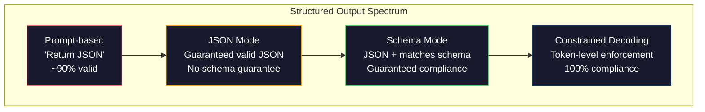
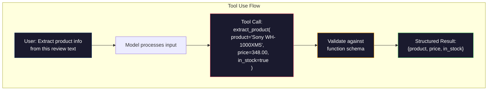

# 结构化输出:JSON、Schema Validation、Constrained Decoding

> Seu LLM  retornar é um string ⋅ sua aplicação precisa é JSON ⋅ esta falha levou a um colapso do sistema de produção, mais do que qualquer modelo imaginação ⋅ estruturado de saída é um ponte entre linguagem natural e tipos de dados ⋅ fazer para, seu LLM ⋅ se tornará uma API confiável ⋅ fazer erro, você é a 3 horas da manhã ⋅ ainda está usando regex 解析自由文本 ⋅

**类型：**Construir
**语言：**Python
**先修要求：**Fase 10, Lições 01-05 (LLM do zero)
**时间：**Cerca de 90 minutos
**相关内容：**Fase 5 · 20 (Output estruturado e decodificação restrita)  abrangendo o decodificador 层面的理论(FSM/CFG logit processadores、Outlines、XGrammar)`response_format`、Uso de ferramentas antropológicas 、Instructor)  Se quiser entender o que aconteceu sob a API , leia primeiro a Fase 5 · 20。

## Objectivo de aprendizagem

- Utilize OpenAI e API Antropic 参数 realçar JSON-modo e schema-constrangido de saída
- Construir uma camada de validação Pydantic, para rejeitar formatos errados de resultados de LLM, e fazer um teste de novo através de erro
-  Explicar decodificação restrita  como em Token  nível forçados a gerar JSON válido , sem necessidade de processamento posterior
- design estábil de extração de pedidos, será texto não estruturado de forma confiável transformado em estrutura de dados tipografados

## 问题

Você pergunta LLM:

```
The product is the Sony WH-1000XM5 headphones, which cost $348.00 and are currently in stock.
```

É uma resposta totalmente correta. Para sua aplicação, também é completamente inútil.`{"product": "Sony WH-1000XM5", "price": 348.00, "in_stock": true}`◊ Você precisa de um objeto JSON com uma chave específica ◊ Tipo específico e um conjunto de valores específicos ◊ Você não precisa de uma frase ◊

朴素解法: 在快速里加上JSON中回答. Isso é válido em 90% dos casos. Em outros 10% dos casos, o modelo coloca o JSON 包在标签码围中,或者加上类似Here's the JSON:的前言,或者因为提前关闭括号而生成语法无效的 JSON──你的 JSON parser 崩──你的管道中断──加上试/除你和再试──重试有时会产生不同的数据──现在你在解析循环问题上又一个一致性问题──

Não é um problema de engenharia rápida. É um problema de decodificação. O modelo gera Token de esquerda para direita. Em cada posição, ele seleciona o próximo Token mais possível entre o vocabulário de mais de 100.000 opções. Em qualquer posição determinada, a maioria das opções geram JSON ineficaz.`{"price":`, 下一个 Token 必须是数字、引号(para usar uma cadeia) 、`null`- Não.`true`- Não.`false`Ou negativo número. Todo o resto do conteúdo gerará JSON inefficiente. Sem restrições, o modelo pode escolher uma palavra em inglês que pareça totalmente razoável, mas na gramática é um erro catastrófico.

## 概念

###  Struktural de produção

O controle estruturado de saída tem quatro níveis, cada um deles mais confiável do que o anterior.



**基于 Prompt**(Responder em JSON válido): não há restrições obrigatórias. O modelo normalmente será observado, mas às vezes não será.

**JSON mode**A API garante que o output é válido JSON。OpenAI `response_format: { type: "json_object" }`O modo será ativado. O resultado pode ser resolvido sem erros. Mas não é necessariamente adequado ao esquema que você espera.

**Schema mode**A API recebe um esquema JSON, e garante a sua compatibilidade com o mesmo. Até 2026, todos os principais provedores estão a apoiar o esquema.`response_format: { type: "json_schema", json_schema: {...} }`(Também pode ser aprovado)`tool_choice="required"`)、Uso de ferramentas antropicas 配合 `input_schema`, bem como os Gémeos .`response_schema`+ `response_mime_type: "application/json"`◊输遇包含你指定的精确键、类型和约束──

**Constrained decoding**A posição de cada token no processo de geração, o decodador irá bloquear tudo que irá levar a um token sem saída efetiva. Se o esquema exigir um número, e o modelo em breve emitir uma letra, a probabilidade desse token será definida como zero. O modelo só pode gerar para um token de saída válida.

### JSON Schema:契约语言

JSON Schema é o que você usa para dizer ao modelo (ou nível de validação) que o output deve ter uma forma. Todos os principais sistemas de saída estruturados o usam.

```json
{
  "type": "object",
  "properties": {
    "product": { "type": "string" },
    "price": { "type": "number", "minimum": 0 },
    "in_stock": { "type": "boolean" },
    "categories": {
      "type": "array",
      "items": { "type": "string" }
    }
  },
  "required": ["product", "price", "in_stock"]
}
```

Esse esquema mostra: output deve ser um objeto, contendo string 类型 `product`Número não negativo tipo`price`、boolean 类型 `in_stock`, e uma cadeia de números opcionais .`categories`Qualquer saída que não coincida será rejeitada.

Esquemas podem lidar com dificuldades:嵌套 objetos、conta matrizes、enums de itens de tipo ̇enums(将 string 约束到特定取值) ̇pattern matching(对 strings 使用 regex), bem como combinadores(用于多态输出oneOf、anyOf、allOf) ̇

### Pydantic 模式

Em Python, você não vai escrever JSON Schema. Você define um modelo Pydantic, ele irá gerar um esquema para você.

```python
from pydantic import BaseModel

class Product(BaseModel):
    product: str
    price: float
    in_stock: bool
    categories: list[str] = []
```

Esta será gerada com o mesmo esquema JSON acima. A biblioteca do instrutor (e o SDK do OpenAI) pode receber diretamente os modelos Pydantic:

### Função de chamada / Utilização de ferramentas

É outra forma de interfaça do mesmo problema. Você não deixa o modelo gerar diretamente JSON, mas define ferramentas de tipos de parâmetros.



Quando o modelo precisa escolher qual função é utilizada, não apenas quando se preenche os parâmetros, use a ferramenta mais adequada. Se você tiver 10 tipos diferentes de esquemas de extração, e o modelo deve escolher o tipo de entrada correto, o uso da ferramenta irá dar-lhe simultaneamente a seleção de esquemas e a saída estruturada.

### 常见失败模式

Mesmo com a aplicação do esquema, as saídas estruturadas podem ainda falhar de forma delicada.

**幻觉值**O modelo é gerado por um modelo de modelo de modelo de modelo de modelo de modelo de modelo de modelo de modelo de modelo de modelo de modelo de modelo de modelo de modelo de modelo de modelo de modelo de modelo de modelo de modelo de modelo de modelo de modelo de modelo de modelo de modelo de modelo de modelo de modelo de modelo de modelo de modelo de modelo de modelo de modelo de modelo de modelo de modelo de modelo de modelo de modelo de modelo de modelo de modelo de modelo de modelo de modelo de modelo de modelo de modelo de modelo de modelo de modelo de modelo de modelo de modelo de modelo de modelo de modelo de modelo de modelo de modelo de modelo de modelo de modelo de modelo de modelo de modelo de modelo de modelo de modelo de modelo de modelo de modelo de modelo de modelo de modelo de modelo de modelo de modelo de modelo de modelo de modelo de modelo de modelo de modelo de modelo de modelo de modelo de modelo de modelo de modelo de modelo de modelo de modelo de modelo de modelo de modelo de modelo de modelo de modelo de modelo de modelo de modelo de modelo de modelo de modelo de modelo de modelo de modelo de modelo de modelo de modelo de modelo de modelo de modelo de modelo de modelo de modelo de modelo de modelo de modelo de modelo de modelo de modelo de modelo de modelo de modelo de modelo de modelo de modelo de modelo de modelo de modelo de modelo de modelo de modelo de modelo de modelo de modelo de modelo de modelo de modelo de modelo de modelo de modelo de modelo de modelo de modelo de modelo de modelo de modelo de modelo de modelo de modelo de modelo de modelo de modelo de modelo de modelo de modelo de modelo de modelo de modelo de modelo de modelo de modelo de modelo de modelo de modelo de modelo de modelo de modelo de modelo de modelo de modelo de modelo de modelo de modelo de modelo de modelo de modelo de modelo de modelo de modelo de modelo de modelo de modelo de modelo de modelo de modelo de modelo de modelo de modelo de modelo de modelo de modelo de modelo de modelo de modelo de modelo de modelo de modelo de modelo de modelo de modelo de modelo de modelo de modelo de modelo de modelo de modelo de modelo de modelo de modelo de modelo de modelo de modelo de modelo de modelo de modelo de modelo de modelo de modelo de modelo de modelo de modelo de modelo de modelo de modelo de modelo de`{"price": 299.99}` Validação de esquema 捕捉不到这一点类型正确,但值错误──

**Enum 混淆**- Não, não.`["in_stock", "out_of_stock", "preorder"]` Modelo de saída`"available"`语义正确, mas não permitido no conjunto.

**嵌套 object 深度**Os esquemas de emplacamentos de nível profundo (ou mais) geram mais erros.

**Array 长度**Modelo pode gerar mais ou menos itens em uma matriz.`minItems`和 `maxItems`Mas nem todos os provedores estão a executá-los a nível de decodificação.

**可选字段省略**O modelo irá ignorar as técnicas opcionais, mas por seu uso, por exemplo, é importante em termos de linguagem. Mesmo que os dados tenham faltado, também os deve colocar no esquema para a geração de modelos obrigatórios necessários.`null`- Não.


```figure
mx-schema-funnel
```

## Construí-lo

### 步骤 1: Validador de esquema JSON

Desde zero construir um validador, para verificar se o objeto Python é ou não correspondente ao JSON Schema.

```python
import json

def validate_schema(data, schema):
    errors = []
    _validate(data, schema, "", errors)
    return errors

def _validate(data, schema, path, errors):
    schema_type = schema.get("type")

    if schema_type == "object":
        if not isinstance(data, dict):
            errors.append(f"{path}: expected object, got {type(data).__name__}")
            return
        for key in schema.get("required", []):
            if key not in data:
                errors.append(f"{path}.{key}: required field missing")
        properties = schema.get("properties", {})
        for key, value in data.items():
            if key in properties:
                _validate(value, properties[key], f"{path}.{key}", errors)

    elif schema_type == "array":
        if not isinstance(data, list):
            errors.append(f"{path}: expected array, got {type(data).__name__}")
            return
        min_items = schema.get("minItems", 0)
        max_items = schema.get("maxItems", float("inf"))
        if len(data) < min_items:
            errors.append(f"{path}: array has {len(data)} items, minimum is {min_items}")
        if len(data) > max_items:
            errors.append(f"{path}: array has {len(data)} items, maximum is {max_items}")
        items_schema = schema.get("items", {})
        for i, item in enumerate(data):
            _validate(item, items_schema, f"{path}[{i}]", errors)

    elif schema_type == "string":
        if not isinstance(data, str):
            errors.append(f"{path}: expected string, got {type(data).__name__}")
            return
        enum_values = schema.get("enum")
        if enum_values and data not in enum_values:
            errors.append(f"{path}: '{data}' not in allowed values {enum_values}")

    elif schema_type == "number":
        if not isinstance(data, (int, float)):
            errors.append(f"{path}: expected number, got {type(data).__name__}")
            return
        minimum = schema.get("minimum")
        maximum = schema.get("maximum")
        if minimum is not None and data < minimum:
            errors.append(f"{path}: {data} is less than minimum {minimum}")
        if maximum is not None and data > maximum:
            errors.append(f"{path}: {data} is greater than maximum {maximum}")

    elif schema_type == "boolean":
        if not isinstance(data, bool):
            errors.append(f"{path}: expected boolean, got {type(data).__name__}")

    elif schema_type == "integer":
        if not isinstance(data, int) or isinstance(data, bool):
            errors.append(f"{path}: expected integer, got {type(data).__name__}")
```

### 步骤 2:Pydantic 风格 Modelo até esquema

构建一个最小的类到方案转换器── define uma classe Python,并自动生成它的JSON Schema──

```python
class SchemaField:
    def __init__(self, field_type, required=True, default=None, enum=None, minimum=None, maximum=None):
        self.field_type = field_type
        self.required = required
        self.default = default
        self.enum = enum
        self.minimum = minimum
        self.maximum = maximum

def python_type_to_schema(field):
    type_map = {
        str: "string",
        int: "integer",
        float: "number",
        bool: "boolean",
    }

    schema = {}

    if field.field_type in type_map:
        schema["type"] = type_map[field.field_type]
    elif field.field_type == list:
        schema["type"] = "array"
        schema["items"] = {"type": "string"}
    elif isinstance(field.field_type, dict):
        schema = field.field_type

    if field.enum:
        schema["enum"] = field.enum
    if field.minimum is not None:
        schema["minimum"] = field.minimum
    if field.maximum is not None:
        schema["maximum"] = field.maximum

    return schema

def model_to_schema(name, fields):
    properties = {}
    required = []

    for field_name, field in fields.items():
        properties[field_name] = python_type_to_schema(field)
        if field.required:
            required.append(field_name)

    return {
        "type": "object",
        "properties": properties,
        "required": required,
    }
```

### 步骤 3: Filtro de Token Constrained

模拟限制解码──给定一个部分 JSON string 和一个 schema,判断当前位点哪些 Token 类别是有效的──

```python
def next_valid_tokens(partial_json, schema):
    stripped = partial_json.strip()

    if not stripped:
        return ["{"]

    try:
        json.loads(stripped)
        return ["<EOS>"]
    except json.JSONDecodeError:
        pass

    last_char = stripped[-1] if stripped else ""

    if last_char == "{":
        return ['"', "}"]
    elif last_char == '"':
        if stripped.endswith('":'):
            return ['"', "0-9", "true", "false", "null", "[", "{"]
        return ["a-z", '"']
    elif last_char == ":":
        return [" ", '"', "0-9", "true", "false", "null", "[", "{"]
    elif last_char == ",":
        return [" ", '"', "{", "["]
    elif last_char in "0123456789":
        return ["0-9", ".", ",", "}", "]"]
    elif last_char == "}":
        return [",", "}", "]", "<EOS>"]
    elif last_char == "]":
        return [",", "}", "<EOS>"]
    elif last_char == "[":
        return ['"', "0-9", "true", "false", "null", "{", "[", "]"]
    else:
        return ["any"]

def demonstrate_constrained_decoding():
    partial_states = [
        '',
        '{',
        '{"product"',
        '{"product":',
        '{"product": "Sony"',
        '{"product": "Sony",',
        '{"product": "Sony", "price":',
        '{"product": "Sony", "price": 348',
        '{"product": "Sony", "price": 348}',
    ]

    print(f"{'Partial JSON':<45} {'Valid Next Tokens'}")
    print("-" * 80)
    for state in partial_states:
        valid = next_valid_tokens(state, {})
        display = state if state else "(empty)"
        print(f"{display:<45} {valid}")
```

### 步骤 4: extra extrair o gasoduto

Colocar todo o conteúdo em um pipeline de extração: definir esquema, simulação de LLM, produzir resultados estruturados, verificar saída,并处理重试――

```python
def simulate_llm_extraction(text, schema, attempt=0):
    if "headphones" in text.lower() or "sony" in text.lower():
        if attempt == 0:
            return '{"product": "Sony WH-1000XM5", "price": 348.00, "in_stock": true, "categories": ["audio", "headphones"]}'
        return '{"product": "Sony WH-1000XM5", "price": 348.00, "in_stock": true}'

    if "laptop" in text.lower():
        return '{"product": "MacBook Pro 16", "price": 2499.00, "in_stock": false, "categories": ["computers"]}'

    return '{"product": "Unknown", "price": 0, "in_stock": false}'

def extract_with_retry(text, schema, max_retries=3):
    for attempt in range(max_retries):
        raw = simulate_llm_extraction(text, schema, attempt)

        try:
            data = json.loads(raw)
        except json.JSONDecodeError as e:
            print(f"  Attempt {attempt + 1}: JSON parse error -- {e}")
            continue

        errors = validate_schema(data, schema)
        if not errors:
            return data

        print(f"  Attempt {attempt + 1}: Schema validation errors -- {errors}")

    return None

product_schema = {
    "type": "object",
    "properties": {
        "product": {"type": "string"},
        "price": {"type": "number", "minimum": 0},
        "in_stock": {"type": "boolean"},
        "categories": {"type": "array", "items": {"type": "string"}},
    },
    "required": ["product", "price", "in_stock"],
}
```

### 步骤 5:运行完整管道

```python
def run_demo():
    print("=" * 60)
    print("  Structured Output Pipeline Demo")
    print("=" * 60)

    print("\n--- Schema Definition ---")
    product_fields = {
        "product": SchemaField(str),
        "price": SchemaField(float, minimum=0),
        "in_stock": SchemaField(bool),
        "categories": SchemaField(list, required=False),
    }
    generated_schema = model_to_schema("Product", product_fields)
    print(json.dumps(generated_schema, indent=2))

    print("\n--- Schema Validation ---")
    test_cases = [
        ({"product": "Test", "price": 10.0, "in_stock": True}, "Valid object"),
        ({"product": "Test", "price": -5.0, "in_stock": True}, "Negative price"),
        ({"product": "Test", "in_stock": True}, "Missing price"),
        ({"product": "Test", "price": "ten", "in_stock": True}, "String as price"),
        ("not an object", "String instead of object"),
    ]

    for data, label in test_cases:
        errors = validate_schema(data, product_schema)
        status = "PASS" if not errors else f"FAIL: {errors}"
        print(f"  {label}: {status}")

    print("\n--- Constrained Decoding Simulation ---")
    demonstrate_constrained_decoding()

    print("\n--- Extraction Pipeline ---")
    texts = [
        "The Sony WH-1000XM5 headphones are priced at $348 and currently available.",
        "The new MacBook Pro 16-inch laptop costs $2499 but is sold out.",
        "This is a random sentence with no product info.",
    ]

    for text in texts:
        print(f"\n  Input: {text[:60]}...")
        result = extract_with_retry(text, product_schema)
        if result:
            print(f"  Output: {json.dumps(result)}")
        else:
            print(f"  Output: FAILED after retries")
```

## Use-o

### Outputes estruturadas da OpenAI

```python
# from openai import OpenAI
# from pydantic import BaseModel
#
# client = OpenAI()
#
# class Product(BaseModel):
#     product: str
#     price: float
#     in_stock: bool
#
# response = client.beta.chat.completions.parse(
#     model="gpt-5-mini",
#     messages=[
#         {"role": "system", "content": "Extract product information."},
#         {"role": "user", "content": "Sony WH-1000XM5, $348, in stock"},
#     ],
#     response_format=Product,
# )
#
# product = response.choices[0].message.parsed
# print(product.product, product.price, product.in_stock)
```

Modo de saída estruturado de OpenAI em uso interno de decodificação restrita. Todos os tokens gerados pelo modelo são garantidos para produzir um correspondente output do esquema Pydantic. Não é necessário retratar. Não é necessário validar.

### Utilização de Ferramentas Antropicas

```python
# import anthropic
#
# client = anthropic.Anthropic()
#
# response = client.messages.create(
#     model="claude-opus-4-7",
#     max_tokens=1024,
#     tools=[{
#         "name": "extract_product",
#         "description": "Extract product information from text",
#         "input_schema": {
#             "type": "object",
#             "properties": {
#                 "product": {"type": "string"},
#                 "price": {"type": "number"},
#                 "in_stock": {"type": "boolean"},
#             },
#             "required": ["product", "price", "in_stock"],
#         },
#     }],
#     messages=[{"role": "user", "content": "Extract: Sony WH-1000XM5, $348, in stock"}],
# )
```

Antropic  através do uso de ferramentas   realçar a saída estruturada 模型会发发出一个工具调用,其中包含匹配 input_schema 的结构化参数 △结果相同,API surface 不同──

### Biblioteca de instrutores

```python
# pip install instructor
# import instructor
# from openai import OpenAI
# from pydantic import BaseModel
#
# client = instructor.from_openai(OpenAI())
#
# class Product(BaseModel):
#     product: str
#     price: float
#     in_stock: bool
#
# product = client.chat.completions.create(
#     model="gpt-5-mini",
#     response_model=Product,
#     messages=[{"role": "user", "content": "Sony WH-1000XM5, $348, in stock"}],
# )
```

Instructor  embalar qualquer cliente LLM,并加入带验证的自动重试――如果第一次尝试验证 失败,它将把错误作为背景 发送回给模型,并要求模型修复输出―― Isso se aplica a qualquer fornecedor, não apenas a OpenAI――

## Entrega-o

本课会产出 `outputs/prompt-structured-extractor.md` Um modelo de prompt replicável, usado de acordo com a definição de esquema para extrair dados estruturados de qualquer texto.

Ele vai voltar a aparecer.`outputs/skill-structured-outputs.md` um quadro de decisão, utilizado em função dos requisitos de confiabilidade e esquema do seu fornecedor  complexidade de seleção de estratégias de saída estruturadas corretas

## 练习

1. 扩展 schema validator,使其支持 `oneOf`(Dados devem ser adequados a um dos vários esquemas) .`Product`O objeto também pode ser de forma diferente.`Service`Objeto

2. Construir um schema diff tool, para comparar dois esquemas,并识别破解变化 (emagrecer os campos necessários  modificar os tipos) e não-breaking (emagrecer os novos campos opcionais  ampliar as restrições) 

3. 实现一个更真实的限制解码模拟器──给定一个 JSON Schema 和一个包含100 个 Tokens的词汇──字母,数字,点击,关键字),逐步走过代,在每个位置屏蔽不有效 Tokens──衡量每一步词汇中有效 Token 的比例──

4. Construir uma suíte de avaliação de extração.  Crie 50 条 条 条 条 条 条 条 条 条 条 条 条 条 条 条 条 条 条 条 条 条 条 条 条 条 条 条 条 条 条 条 条 条 条 条 条 条 条 条 条 条 条 条 条 条 条 条 条 条 条 条 条 条 条 条 条 条 条 条 条 条 条 条 条 条 条 条 条 条 条 条 条 条 条 条 条 条 条 条 条 条 条 条 条 条 条 条 条 条 条 条 条 条 条 条 条 条 条 条 条 条 条 条 条 条 条 条 条 条 条 条 条 条 条 条 条 条 条 条 条                                                                                                                                                                                                                                                            

5. Para o seu pipeline de extração 添加信心分──对每抽取字段,估计模型的信任度(基于Token probabilities,或通过运行3次抽取并测量一致性)──将低置信度字段标记给人工审核──

## 关键术语

| Term | 人们通常怎么说 | 它实际意味着什么 |
|------|----------------|----------------------|
| JSON mode | “返回 JSON” | 一个 API flag，保证输出在语法上是有效 JSON，但不强制任何特定 schema |
| Structured output | “类型化 JSON” | 匹配特定 JSON Schema 的输出，具有正确的 key、type 和 constraint |
| Constrained decoding | “引导式生成” | 在每个 Token 位置屏蔽会产生无效输出的 Tokens——保证 100% schema compliance |
| JSON Schema | “一个 JSON template” | 用于描述 JSON 数据结构、type 和 constraint 的声明式语言（被 OpenAPI、JSON Forms 等使用） |
| Pydantic | “Python dataclasses+” | Python library，用于定义带有 type validation 的 data models，FastAPI 和 Instructor 使用它生成 JSON Schemas |
| Function calling | “Tool use” | LLM 输出结构化 function invocation（name + typed arguments），而不是 free text——OpenAI 和 Anthropic 都支持 |
| Instructor | “面向 LLMs 的 Pydantic” | Python library，用于包装 LLM clients 以返回经过验证的 Pydantic instances，并在 validation failure 时自动 retry |
| Token masking | “过滤 vocabulary” | 在 generation 期间将特定 Token probabilities 设为零，使模型无法生成它们 |
| Schema compliance | “匹配形状” | 输出包含每个 required field、正确 types、约束范围内的 values，并且没有额外的不允许字段 |
| Retry loop | “不断重试直到成功” | 将 validation errors 发回给模型，并要求它修复输出——Instructor 会自动执行这一点，最多重试到可配置上限 |

## 延伸阅读

- [OpenAI Structured Outputs Guide](https://platform.openai.com/docs/guides/structured-outputs)OpenAI API 中 JSON Schema baseada em decodificação restrita 官方文档
- [Willard & Louf, 2023——“Efficient Guided Generation for Large Language Models”](https://arxiv.org/abs/2307.09702)Outlines 论文, descrever como fazer JSON Schemas 编译为有限状态机器以实现 Token 级约束
- [Instructor documentation](https://python.useinstructor.com/) usar Pydantic validação 和 retries de arbitrária LLM  obter estruturas de saída de padrões
- [Anthropic Tool Use Guide](https://docs.anthropic.com/en/docs/tool-use)Claude  como usar ferramentas 和 JSON Schema input_schema  realizar saída estruturada
- [JSON Schema specification](https://json-schema.org/) todos os principais resultados estruturados  sistemas de uso de linguagem de esquema 完整规范
- [Outlines library](https://github.com/outlines-dev/outlines) usar regex 和编译为有限状态机的 JSON Schema 进行开源限制生成
- [Dong et al., “XGrammar: Flexible and Efficient Structured Generation Engine for Large Language Models” (MLSys 2025)](https://arxiv.org/abs/2411.15100) Atualmente o mais avançado mecanismo de gramática; compilação automática de empurrão, pode ser usado a uma velocidade de cerca de 100 ns / Token para proteger Tokens。
- [Beurer-Kellner et al., “Prompting Is Programming: A Query Language for Large Language Models” (LMQL)](https://arxiv.org/abs/2212.06094)LMQL 论文,将限制解码表述为带有类型和值限制的查询语言──
- [Microsoft Guidance (framework docs)](https://github.com/guidance-ai/guidance)Generação limitada orientada por modelos;Outlines 和 XGrammar's provider-agnostic 补充──
