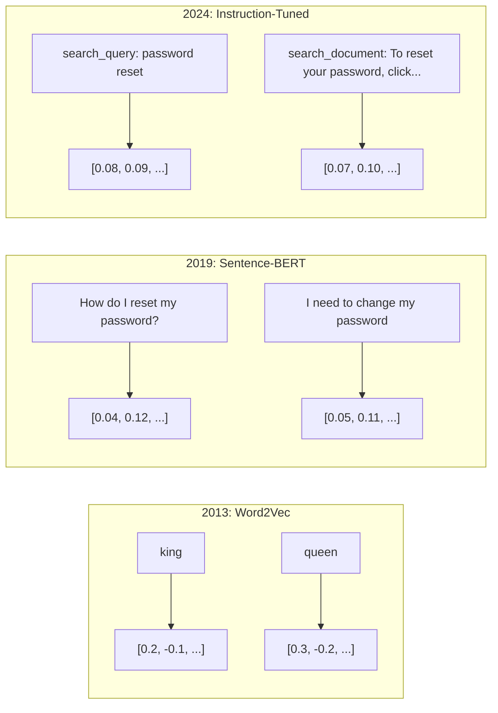
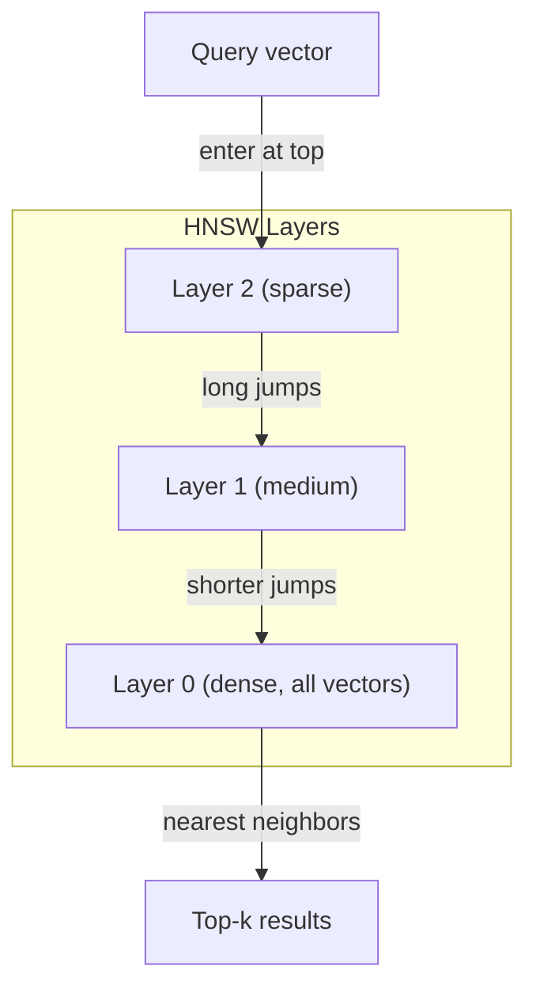

# Embedments 与 Vector expressão

> 文本是离散的──数学是连续的── 每当你要求LLM 查找相似文档、比较含义,或超越关键词进行搜索时,你都依赖于连接这两个世界的一个桥──这座桥就是嵌入──

**Type:** Build
**Languages:** Python
**Prerequisites:** Phase 11, Lesson 01 (Prompt Engineering)
**Time:** ~75 minutes
**Related:**Fase 5 · 22 (Inmobrigação de Modelos de Mergulho Profundo) 涵盖密集 VS稀稀 VS多向量、Matryoshka 截断,以及按轴选择模型──本课聚焦生产管eline(вектор DBs、HNSW、相似度数学)──在选择模型之前,请先阅读Fase 5 · 22──

## Objectivo de aprendizagem
- Utilize provedores de API e modelos de código aberto
-  explica por que embutidos 能解决 keyword search 无法处理的词汇不匹配问题
- Construir um índice de pesquisa semântica, baseado no significado e não no precisão
- Utilize retrieval benchmarks(precision@k、recall) avaliar Embedding 质量,并为你的任务选择合适的 Embedding model

## 问题
Você tem 10.000 张支持工单――一位客户写道:我的支付没有通过. 你需要找到相似的历史工单――Keyword search 会找到包含 支付 和 没有通过 的工单――它会漏掉 交易失败,  收费被拒绝,  和 结账错误. 这些工单使用完全不同的词描述完全相同的问题──

É o problema da falta de correspondência do vocabulário. A linguagem humana tem muitas formas de expressar a mesma coisa. A pesquisa de palavras-chave.

Você precisa de um texto para dizer que a semelhança é determinada pelo significado, e não pela escrita. Você precisa de um método para fazer o meu pagamento não passar e a transação foi recusada.

É assim que se diz "embedding".

## 概念
### O que é um implante?

Embedding é um vector denso composto por flows de pontos, usado para expressar o significado do texto.

O gato sentou-se no tapete.`[0.023, -0.041, 0.087, ..., 0.012]`O que é diferente de acordo com o modelo, é uma lista que contém 768 a 3072 números. Estes números codificados significam. Você não os verifica diretamente. Você os comparará.

### O avanço da Word2Vec

Em 2013, o Google, Tomas Mikolov e seus colegas publicaram o Word2Vec──核心洞见是: train a Neural Network, according neighbourhood word prediction a word (de acordo com o que é chamado de "neural network"), hid hidden layer power (o que é chamado de "vector") transformará-se em vetor significativo.

著名结果:

```
king - man + woman = queen
```

Para as incorporações de palavras  realizar aritmética vectorial pode ser capturado significância de relação man até woman direção, é aproximadamente igual a direção de king até queen .

O Word2Vec é composto por 300 vectores. Cada palavra, independentemente do que se escreve, tem apenas um vector.

### De palavras a frases

Embedings de palavras indicam Tokens individuais. O sistema de produção precisa de fazer embedamentos em toda a frase.

**Averaging**O valor médio de todos os vetores de palavras em uma frase é baixo, mas também não é errado.

**CLS token**:transformer models(BERT, 2018)输出一个特殊的 [CLS] token embedding,表示整个输入──比平均更好,但[CLS] token 是为下文预测 训练的,不是为相似度训练的──

**Contrastive learning**Reimers & Gurevych, 2019) usou esse método, e tornou-se a base dos modelos modernos de incorporação.

**Instruction-tuned embeddings**O modelo pode ser usado para executar várias tarefas.



### Modelos modernos de incorporação

O mercado já recebeu uma pequena quantidade de opções de nível de produção (MTEB v2):

| Model | Provider | Dimensions | MTEB | Context | Cost / 1M tokens |
|-------|----------|-----------|------|---------|------------------|
| Gemini Embedding 2 | Google | 3072 (Matryoshka) | 67.7 (retrieval) | 8192 | $0.15 |
| embed-v4 | Cohere | 1024 (Matryoshka) | 65.2 | 128K | $0.12 |
| voyage-4 | Voyage AI | 1024/2048 (Matryoshka) | 66.8 | 32K | $0.12 |
| text-embedding-3-large | OpenAI | 3072 (Matryoshka) | 64.6 | 8192 | $0.13 |
| text-embedding-3-small | OpenAI | 1536 (Matryoshka) | 62.3 | 8192 | $0.02 |
| BGE-M3 | BAAI | 1024 (dense+sparse+ColBERT) | 63.0 multilingual | 8192 | Open-weight |
| Qwen3-Embedding | Alibaba | 4096 (Matryoshka) | 66.9 | 32K | Open-weight |
| Nomic-embed-v2 | Nomic | 768 (Matryoshka) | 63.1 | 8192 | Open-weight |

MTEB(Massive Text Embedding Benchmark) v2  cobre mais de 100 个任务, incluindo recuperação, classificação, clustering, re-ranking, e resumo.

### Metricas de semelhança

Dados dois vetores de inserção, há três formas de medir as suas semelhanças:

**Cosine similarity**: dois vetores 间角的余弦值──范围从 -1(相反) 到 1(方向相同)──忽略大小 如果一个10 词句和一个500 词文档指向相同方向,它们可以得到1.0──这是90%的默认选择──

```
cosine_sim(a, b) = dot(a, b) / (||a|| * ||b||)
```

**Dot product**Quando os vetores  já se regruparam (unidade de comprimento), ele se torna similar ao cosino.

```
dot(a, b) = sum(a_i * b_i)
```

**Euclidean (L2) distance**O vector  espaço  linha reta distância 越小 = 越相似── para grande diferença sensível ⋅ quando a posição absoluta no espaço é importante, não apenas a direção é importante quando usado ⋅

```
L2(a, b) = sqrt(sum((a_i - b_i)^2))
```

Qual é o tipo de produto?

| Metric | Use when | Avoid when |
|--------|----------|------------|
| Cosine similarity | 比较长度不同的文本；大多数 retrieval 任务 | 大小携带信息 |
| Dot product | Embeddings 已经归一化；需要最高速度 | Vectors 大小不同 |
| Euclidean distance | Clustering；空间 nearest-neighbor 问题 | 比较长度差异巨大的文档 |

### Base de dados de vetores e HNSW

Quando há um milhão de 1536 dimensões de vetores, cada consulta requer 15 bilhões de vezes multiplicar-add operação.

Base de dados vetoriais usando algoritmo Approximate Nearest Neighbor (ANN) resolver este problema.

1. Construir um gráfico de vetores de várias camadas
2. A camada superior é escassa e estabelece ligações de longa distância entre aglomerados distantes.
3. A superfície é densa e estabelece uma ligação entre os vectores próximos.
4. Busca de cima para baixo, ganância para baixo e detalhamento gradual
5. 以 O(log n) 时间 retornar resultados quase-c, em vez de O(n)

HNSW utiliza muito pequena perda de precisão de taxa (normalmente 95-99% de recall) em troca de uma enorme velocidade de aumento. Em 1000 milhões de vetores, pesquisa violenta requer poucos segundos.



Produção:

| Database | Type | Best for | Max scale |
|----------|------|----------|-----------|
| Pinecone | Managed SaaS | 零运维生产环境 | Billions |
| Weaviate | Open source | 自托管、hybrid search | 100M+ |
| Qdrant | Open source | 高性能、过滤 | 100M+ |
| ChromaDB | Embedded | 原型开发、本地开发 | 1M |
| pgvector | Postgres extension | 已经使用 Postgres | 10M |
| FAISS | Library | 进程内、研究 | 1B+ |

### Estratégias de desmantelamento

文档太长,不能作为单个矢量 进行嵌入──一个50页 PDF 覆盖几十主题它的嵌入会变成所有内容的平均值,结果不像任何具体内容──你要把文档切成块,并对每块做嵌入──

**Fixed-size chunking**: Cada N 个 Tokens 切分一次,并带 M-token overlap──简单且可预测──当文档没有清晰结构时效果很好──一块512-tokens 带50-tokens overlap:chunk 1是代币0-511,chunk 2是代币462-973──

**Sentence-based chunking**Em um ponto de referência, você pode cortar uma frase em dois pedaços.

**Recursive chunking**Primeiro tente em maiores limites de divisão (seção) e, se ainda for grande, tente novamente os limites de parágrafos, depois os limites de frases, e finalmente os limites de caracteres.`RecursiveCharacterTextSplitter`É muito bom para os corpos de formato místico.

**Semantic chunking**Para cada frase fazer embuxação, em seguida, embuxações 相似的连续句子分组──当嵌入的相似性 低于某个值时,开始新的块──成本高──需要对每个句子单独做嵌入),但能产生最连贯的块──

| Strategy | Complexity | Quality | Best for |
|----------|-----------|---------|----------|
| Fixed-size | Low | Decent | 非结构化文本、logs |
| Sentence-based | Low | Good | 文章、emails |
| Recursive | Medium | Good | Markdown、HTML、mixed docs |
| Semantic | High | Best | 对 retrieval 质量要求关键的场景 |

Mas uma vez que o sistema está em desenvolvimento, o sistema está em desenvolvimento.

### Bi-Encodificadores versus Cross-Encodificadores

Bi-encoder 会独立对查询 和文档做嵌入,然后比较矢量──速度快你只需要对查询做一次嵌入,然后与预先计算好的文档嵌入比较──这是检索使用方式──

O cross-encoder vai colocar a consulta e um documento como uma única entrada e saída de pontuação de relevância.

O modelo de produção é: bi-encoder 检查 top-100 candidatos, cross-encoder irá re-ranquear para o top-10― é o retorno-depois-re-ranquear pipeline―


Modelos de Rango:Cohere Rango 3.5 ((per 1000 vezes consulta $2) 、BGE-Rangoer-v2(免费, código aberto) 、Jina Rangoer v2(免费, código aberto) ‖

### Embedings de Matryoshka

Embedings tradicionais são totalmente ou totalmente não. Um 1536 维 矢量 使用 1536 浮点──你不能在不重训的情况下截断到 256 维──

Matryoshka Representation Learning ((Kusupati et al., 2022) corrigiu este problema. O modelo foi treinado para fazer o primeiro N 个维度 capture as informações mais importantes, assim como o russo.

OpenAI's text-embedding-3-small 和 text-embedding-3-large 通过 `dimensions`参数支持 Matryoshka 截断──请求 256 维而不是 1536 维, armazenamento reduzido 6 vezes, em MTEB benchmarks 上准确率大约损失 3-5%──

### Quantização binária

Uma embalagem de 1536 dimensões em float32  armazenamento requer 6.144 字节── multiplicada por 1000.000 文档:

Quantização binária Colocar cada flutuação 转成单个位:正值变成1,负值变成0── armazém de 6.144 字节降至192 字节减少32 倍──相似度使用 Hamming distance(统计不同位数) 计算, CPU pode usar单条命令完成──

O impacto da taxa de precisão de recuperação de memória é de cerca de 5-10%[6]. O padrão comum é: primeiro, use a quantização binária em milhões de vetores para fazer a primeira ronda de pesquisa, e depois, use vetores de precisão completa para o top-1000 重新打分── assim, pode-se obter uma taxa de precisão completa de 95%+ com menos de 32 vezes de memória.


```figure
cosine-similarity
```

## Construí-lo
Nós começamos a construir um mecanismo de pesquisa semântica. Não usamos uma base de dados vetorial. Não usamos API externa de incorporação.

### 步骤 1: Chunking de texto

```python
def chunk_text(text, chunk_size=200, overlap=50):
    words = text.split()
    chunks = []
    start = 0
    while start < len(words):
        end = start + chunk_size
        chunk = " ".join(words[start:end])
        chunks.append(chunk)
        start += chunk_size - overlap
    return chunks


def chunk_by_sentences(text, max_chunk_tokens=200):
    sentences = text.replace("\n", " ").split(".")
    sentences = [s.strip() + "." for s in sentences if s.strip()]
    chunks = []
    current_chunk = []
    current_length = 0
    for sentence in sentences:
        sentence_length = len(sentence.split())
        if current_length + sentence_length > max_chunk_tokens and current_chunk:
            chunks.append(" ".join(current_chunk))
            current_chunk = []
            current_length = 0
        current_chunk.append(sentence)
        current_length += sentence_length
    if current_chunk:
        chunks.append(" ".join(current_chunk))
    return chunks
```

### 步骤 2: Construir Embedments a partir do zero

Usamos a normalização TF-IDF e L2 para realizar um simples embutimento denso. Não é um embutimento neural, mas segue o mesmo acordo:

```python
import math
import numpy as np
from collections import Counter

class SimpleEmbedder:
    def __init__(self):
        self.vocab = []
        self.idf = []
        self.word_to_idx = {}

    def fit(self, documents):
        vocab_set = set()
        for doc in documents:
            vocab_set.update(doc.lower().split())
        self.vocab = sorted(vocab_set)
        self.word_to_idx = {w: i for i, w in enumerate(self.vocab)}
        n = len(documents)
        self.idf = np.zeros(len(self.vocab))
        for i, word in enumerate(self.vocab):
            doc_count = sum(1 for doc in documents if word in doc.lower().split())
            self.idf[i] = math.log((n + 1) / (doc_count + 1)) + 1

    def embed(self, text):
        words = text.lower().split()
        count = Counter(words)
        total = len(words) if words else 1
        vec = np.zeros(len(self.vocab))
        for word, freq in count.items():
            if word in self.word_to_idx:
                tf = freq / total
                vec[self.word_to_idx[word]] = tf * self.idf[self.word_to_idx[word]]
        norm = np.linalg.norm(vec)
        if norm > 0:
            vec = vec / norm
        return vec
```

### 步骤 3: Funções de semelhança

```python
def cosine_similarity(a, b):
    dot = np.dot(a, b)
    norm_a = np.linalg.norm(a)
    norm_b = np.linalg.norm(b)
    if norm_a == 0 or norm_b == 0:
        return 0.0
    return float(dot / (norm_a * norm_b))


def dot_product(a, b):
    return float(np.dot(a, b))


def euclidean_distance(a, b):
    return float(np.linalg.norm(a - b))
```

### 步骤 4: Índice de vetores com Busca de força bruta

```python
class VectorIndex:
    def __init__(self):
        self.vectors = []
        self.texts = []
        self.metadata = []

    def add(self, vector, text, meta=None):
        self.vectors.append(vector)
        self.texts.append(text)
        self.metadata.append(meta or {})

    def search(self, query_vector, top_k=5, metric="cosine"):
        scores = []
        for i, vec in enumerate(self.vectors):
            if metric == "cosine":
                score = cosine_similarity(query_vector, vec)
            elif metric == "dot":
                score = dot_product(query_vector, vec)
            elif metric == "euclidean":
                score = -euclidean_distance(query_vector, vec)
            else:
                raise ValueError(f"Unknown metric: {metric}")
            scores.append((i, score))
        scores.sort(key=lambda x: x[1], reverse=True)
        results = []
        for idx, score in scores[:top_k]:
            results.append({
                "text": self.texts[idx],
                "score": score,
                "metadata": self.metadata[idx],
                "index": idx
            })
        return results

    def size(self):
        return len(self.vectors)
```

### 步骤 5: O mecanismo de busca semântica

```python
class SemanticSearchEngine:
    def __init__(self, chunk_size=200, overlap=50):
        self.embedder = SimpleEmbedder()
        self.index = VectorIndex()
        self.chunk_size = chunk_size
        self.overlap = overlap

    def index_documents(self, documents, source_names=None):
        all_chunks = []
        all_sources = []
        for i, doc in enumerate(documents):
            chunks = chunk_text(doc, self.chunk_size, self.overlap)
            all_chunks.extend(chunks)
            name = source_names[i] if source_names else f"doc_{i}"
            all_sources.extend([name] * len(chunks))
        self.embedder.fit(all_chunks)
        for chunk, source in zip(all_chunks, all_sources):
            vec = self.embedder.embed(chunk)
            self.index.add(vec, chunk, {"source": source})
        return len(all_chunks)

    def search(self, query, top_k=5, metric="cosine"):
        query_vec = self.embedder.embed(query)
        return self.index.search(query_vec, top_k, metric)

    def search_with_scores(self, query, top_k=5):
        results = self.search(query, top_k)
        return [
            {
                "text": r["text"][:200],
                "source": r["metadata"].get("source", "unknown"),
                "score": round(r["score"], 4)
            }
            for r in results
        ]
```

### 步骤 6: Comparar Metricas de Similaridade

```python
def compare_metrics(engine, query, top_k=3):
    results = {}
    for metric in ["cosine", "dot", "euclidean"]:
        hits = engine.search(query, top_k=top_k, metric=metric)
        results[metric] = [
            {"score": round(h["score"], 4), "preview": h["text"][:80]}
            for h in hits
        ]
    return results
```

## Use-o
Utilize embedder API 时,架构保持一致──只有嵌入器 会变:

```python
from openai import OpenAI

client = OpenAI()

def openai_embed(texts, model="text-embedding-3-small", dimensions=None):
    kwargs = {"model": model, "input": texts}
    if dimensions:
        kwargs["dimensions"] = dimensions
    response = client.embeddings.create(**kwargs)
    return [item.embedding for item in response.data]
```

Utilizando OpenAI de Matryoshka 截断同一个模型,更少维度,更低存储:

```python
full = openai_embed(["semantic search query"], dimensions=1536)
compact = openai_embed(["semantic search query"], dimensions=256)
```

256-d Vector Utilizando o armazenamento reduzido 6 vezes. Para 1000 milhões de documentos, é 10 GB vs 61 GB.

Utilize Cohere  realizar um rebanque:

```python
import cohere

co = cohere.ClientV2()

results = co.rerank(
    model="rerank-v3.5",
    query="What is the refund policy?",
    documents=["Full refund within 30 days...", "No refunds after 90 days..."],
    top_n=3
)
```

Utilize embutidos em locais, não depende da API:

```python
from sentence_transformers import SentenceTransformer

model = SentenceTransformer("BAAI/bge-small-en-v1.5")
embeddings = model.encode(["semantic search query", "another document"])
```

A classe VectorIndex que construímos pode ser combinada com estes quaisquer programas.

## Entrega-o
本课产出:
- `outputs/prompt-embedding-advisor.md` um usado para escolher casos específicos Embedding modelos e estratégias de prompt
- `outputs/skill-embedding-patterns.md` um professor agentes  como usar eficazmente em produção Embeddings habilidade

## 练习
1. **Metric comparison**Usando a semelhança cosínica, produto de pontos e distância euclidiana, para os documentos de amostra 运行相同的 5 个查询――记录每种方法的前3结果―― quais perguntas acima estas métricas não coincidem?

2. **Chunk size experiment**Usando 50、100、200 和 500 palavras de tamanhos de pedaços indexar documentos de amostra。 para cada configuração executar 5 consultas,并记录 top-1 similarity score── desenhar o tamanho do pedaço e a qualidade da recuperação △ relação entre encontrar pedaços maiores ⋅ começar a produzir um impacto negativo ponto──

3. **Matryoshka simulation**Construir um que produz vectores de 500-d SimpleEmbedder. Cortar até 50、100、200 和 500 维── medir cada tipo de recall de recuperação.

4. **Binary quantization**:取搜索引擎 中的嵌入式,将它们转换为二进制,并实现 Hamming distance search──将 top-10 results与完全精度共数相似性比较──衡量重叠百分比比──

5. **Sentence-based chunking**:用 `chunk_by_sentences`替代固定尺寸分断――运行相同查询并比较检索分――尊重句子边界是否改善结果?

## 关键术语
| Term | What people say | What it actually means |
|------|----------------|----------------------|
| Embedding | “文本到数字” | 一种 dense Vector，其中几何接近性编码语义相似性 |
| Word2Vec | “最早的经典 Embedding” | 2013 年通过预测上下文词学习 word vectors 的模型；证明 Vector arithmetic 可以编码含义 |
| Cosine similarity | “两个 Vectors 有多相似” | Vectors 夹角的余弦值；1 = 方向相同，0 = 正交，-1 = 相反 |
| HNSW | “快速 Vector search” | Hierarchical Navigable Small World graph——一种多层结构，可实现 O(log n) 的 approximate nearest neighbor search |
| Bi-encoder | “分开 Embedding，快速比较” | 将 query 和 document 独立编码为 Vectors；支持预计算和快速 retrieval |
| Cross-encoder | “慢但准确的 reranker” | 让 query-document pair 联合通过完整模型处理；准确率更高，但无法预计算 |
| Matryoshka embeddings | “可截断的 Vectors” | 经过训练的 Embeddings，使前 N 个维度捕捉最重要的信息，从而支持可变大小存储 |
| Binary quantization | “1-bit embeddings” | 将 float vectors 转换为 binary（仅保留 sign bit），通过 Hamming distance search 实现 32 倍存储减少 |
| Chunking | “为 Embedding 拆分文档” | 将文档拆成 256-512 token 片段，使每个片段都可以独立 Embedding 和检索 |
| Vector database | “Embeddings 的搜索引擎” | 为存储 Vectors 并在规模化场景下执行 approximate nearest neighbor search 而优化的数据存储 |
| Contrastive learning | “通过比较训练” | 一种训练方法，把相似配对的 Embeddings 拉近，把不相似配对的 Embeddings 推远 |
| MTEB | “Embedding benchmark” | Massive Text Embedding Benchmark——覆盖 8 类任务的 56 个数据集；用于比较 Embedding models 的标准 |

## 延伸阅读
- Mikolov et al., "Eficiente Estimação de Representações de Palavras no Espaço Vétorial" (2013) Word2Vec 论文, através de rei-rainha 类比开启了 Embedding 革命
- Reimers & Gurevych, "Sentence-BERT: Sentence Embeddings using Siamese BERT-Networks" (2019)how to train in用于句子级相似度的双码码器,现代 Embedding models 的基础
- Kusupati et al., "Matryoshka Representation Learning" (2022) 可变维度 Embeddings 背后的技术,OpenAI em text-embedding-3 adoptou-o
- Malkov & Yashunin, "Eficiente e robusto aprox. próximo próximo usando gráficos de mundo pequeno navegável hierárquico" (2018) HNSW 论文,多数生产 Vector search 背后的算法
- Guia de Embedings da OpenAI (platform.openai.com/docs/guides/embedings) text-embedding-3 modelos 实用参考, incluindo Matryoshka 维度缩减
- MTEB Leaderboard (huggingface.co/spaces/mteb/leaderboard)  realtime benchmark, usado para comparar todos os modelos de incorporação em diferentes tarefas e linguagens
- [Muennighoff et al., "MTEB: Massive Text Embedding Benchmark" (EACL 2023)](https://arxiv.org/abs/2210.07316) definição de 8 类任务(classificação, agrupamento, par classificação, re-ranking, recuperação, STS, resumo, mineração de texto) de referência,leaderboard 会报告这些类别;在信任任何单一MTEB score 之前请先阅读──
- [Sentence Transformers documentation](https://www.sbert.net/)bi-encoder vs cross-encoder pooling strategies, bem como o poder de implementação do ingest-split-embed-store RAG pipeline
