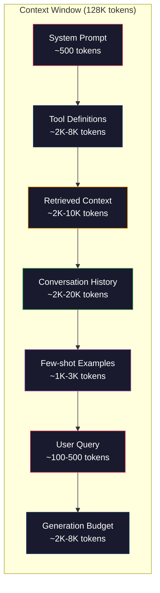
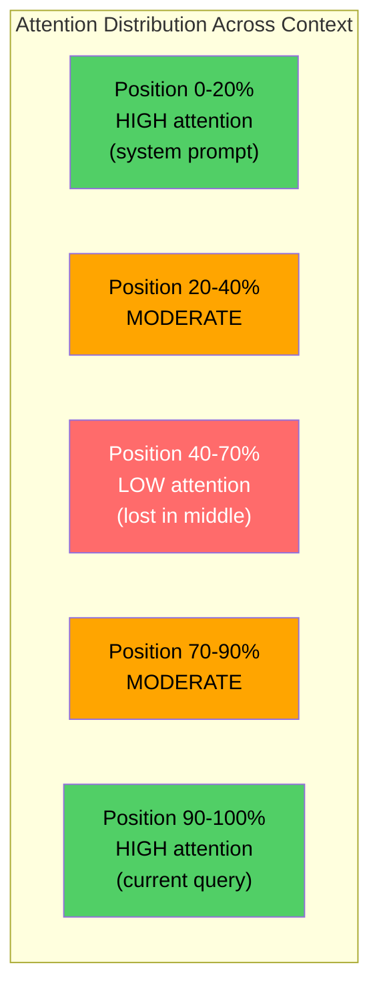
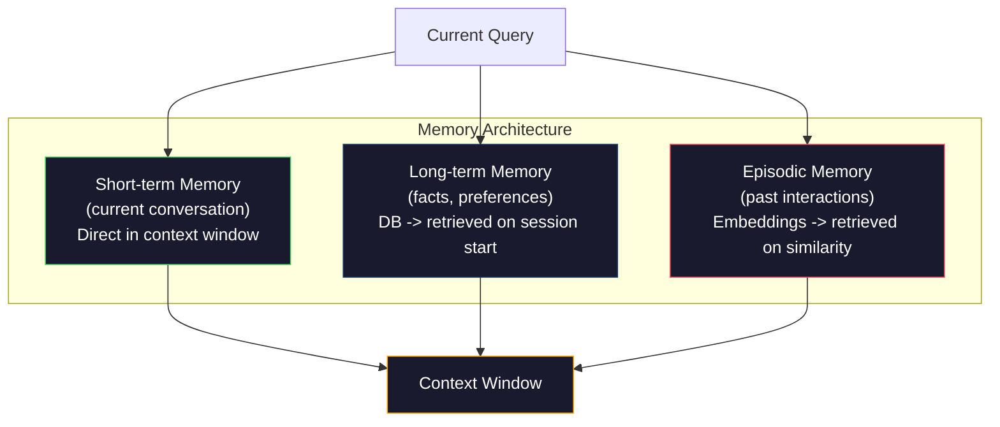

# Engenharia de contexto: Window­tk, orçamento, memória e recuperação

> A engenharia rápida é um subconjunto. A engenharia de contexto é uma série de informações. A engenharia de contexto é um conjunto de informações. O contexto é um conjunto de informações que podem ser encontradas na janela do modelo.

**类型：**Construir
**语言：**Python
**前置要求：**Fase 10 ((LLM do zero)  Fase 11 Lição 01-02
**时间：**Cerca de 90 minutos
**相关：**Fase 11 · 15(Cachagem rápida)  layout amigável ao cache é engenharia de contexto 延伸──Fase 5 · 28(Evalução de longo contexto)讲解如何使用NIAH/RULER 衡量 lost-in-the-middle──

## Objectivo de aprendizagem

- 计算所有 context window 组件的 Token 预算(sistema de instrução, ferramentas, história, documentos recuperados, espaço de geração)
- 实现 context window 管理策略:截断、摘要, bem como para usar a janela deslizante do histórico de conversação
- Para o conteúdo de componentes de prioridade de classificação e edificação, deixe o modelo de atenção maximizar a concentração na informação mais relevante
- Construir um assembler de contexto, de acordo com a consulta  tipo e disponível janela espaço

## 问题

Claude Opus 4.7 tem 200K Token  Window(beta 中为1M) ――GPT-5 tem 400K。Gemini 3 Pro tem 2M。Llama 4 声称有10M。 Estes números parecem muito grandes, até que você realmente os preencha。

Abaixo está um assistente de codificação de real divisão. Sistema de execução: 500 Tokens──50 个工具的工具定义: 8,000 Tokens──Retrieved documentation: 4,000 Tokens──Conversation history(10轮): 6,000 Tokens──当前用户查询:200 Token──Generation budget(max output):4,000 Tokens──总计:22,700 Tokens──这只占据128K 窗口的18%──

Mas a atenção não vai com o contexto de comprimento linear expansão. O modelo de contexto de tokens de 128K tem que pagar a segunda atenção. Os transformadores de vainilha são O (n^2), embora a maioria dos modelos de produção utilizem alta eficiência.

Lício prático é: 200K Token disponível não significa usar 200K Token 就有效──精心选的10K Token context 往往胜过直接倾倒的100K Token context──文本工程是在文本窗口内最大化信号-噪音比的学科──

Cada token que você coloca na janela, todos os outros são eliminados. Todos os tokens podem ser usados para fornecer informações mais relevantes.

## 概念

### Janela de contexto é raramente disponível

Coloque a janela de contexto em RAM, em vez de disco. É muito rápido, pode ser acessado diretamente, mas a capacidade é limitada.



Cada componente está em competição de espaço. Añadir mais definições de ferramentas significa espaço de história da conversação mudar menos. Añadir mais contexto recuperado significa espaço de poucos exemplos de tiros.

### Perdido no meio

É a experiência mais importante da engenharia de contexto. O modelo se concentra melhor no contexto, o início e o fim das informações.

Liu et al. ((2023) realizaram um teste sistêmico sobre isso. Eles colocaram um documento relacionado em diferentes posições entre 20 documentos não relacionados, e mediram a taxa de precisão da resposta. Quando o documento relacionado está na primeira ou última posição, a taxa de precisão é de 85-90%.

Isso afetará diretamente o design do projeto:

- Colocar as informações mais importantes na primeira página.
- Colocar a consulta atual e conteúdo mais relevante em última instância (precisão recente ajuda)
- Colocar o contexto entre as regiões de menor prioridade
- Se tiver de colocar a informação no meio, é no final.



### Context 组件

**System prompt**A definição de código de código de código de código de código de código de código de código de código de código de código de código de código de código de código de código de código de código de código de código de código de código de código de código de código de código de código de código de código de código de código de código de código de código de código de código de código de código de código de código de código de código de código de código de código de código de código de código de código de código de código de código de código de código de código de código de código de código de código de código de código de código de código de código de código de código de código de código de código de código de código de código de código de código de código de código de código de código de código de código de código de código de código de código de código de código de código de código de código de código de código de código de código de código de código de código de código de código de código de código de código de código de código de código de código de código de código de código de código de código de código de código de código de código de código de código de código de código de código de código de código de código de código de código de código de código de código de código de código de código de código de código de código de código de código de código de código de código de código de código de código de código de código de código de código de código de código de código de código de código de código de código de código de código de código de código de código de código de código de código de código de código de código de código de código de código de código de código de código de código de código de código de código de código de código de código de código de código de código de código de código de código de código de código de código de código de código de código de código de código de código de código de código de código de código de código de código de código de código de código de código de código de código de código de código de código de código de código de código de código de código de código de código de código de código de código de código de código de código de código de código de código de código de código de código de código de código de código de código de código de código de código de código de código de código de código de código de código de código de código de código de código de código de código de código de código de código de código de código de código de código de código de código de

**Tool definitions**Cada ferramenta aumentará 50-200 Tokens (nome, descrição, esquema de parâmetros) ⋅ 50 ⋅ ferramentas ⋅ cada 150 Tokens, antes de qualquer conversa ⋅ ocorrer é 7.500 Tokens ⋅ Seleção de ferramentas dinâmicas, ou seja, apenas contém ferramentas relacionadas com a consulta atual ⋅ pode reduzir 60-80% ⋅

**Retrieved context**A recuperação 质量直接决定 response 质量──糟糕的Retrieval 比没有Retrieval 更差,因为它会用噪声填满窗口,并主动误导模型──

**Conversation history**Cada vez mais, a resposta do usuário é de 50 rotas de conversação, 200 tokens por rotada, é o histórico de 10.000 tokens.

**Few-shot examples**O resultado é o resultado de um processo de produção de dados, que é um processo de produção de dados e de dados.

**Generation budget**Se você encher a janela, o modelo não tem espaço para responder. Pelo menos para a geração, você pode reservar entre 2.000 e 4.000 tokens.

### Context Compression 策略

**History summarization**Não podemos mais trocar palavras para manter todas as voltas anteriores, mas sim uma conversa regularmente.

**Relevance filtering**De acordo com a consulta atual                                                                                                                                                                                                                                                                                                                                                                                                                                                                                                                       

**Tool pruning**O código não precisa de ferramentas de calendário. O problema não precisa de ferramentas de sistema de arquivos. Isso pode reduzir as definições de ferramentas de 8.000 Tokens para 1.000.

**Recursive summarization**Para um longo arquivo, um resumo de cada seção, um resumo de cada seção, uma edição de 50 páginas se transforma num digestão de 500 tokens, capturando um ponto-chave.

### Sistemas de memória

Engenharia de contexto 跨越三个时间尺度──

**Short-term memory**Contato: : : : : : : : : : : : : : : : : : : : : : : : : : : : : : : : : : : : : : : : : : : : : : : : : : : : : : : : : : : : : : : : : : : : : : : : : : : : : : : : : : : : : : : : : : : : : : : : : : : : : : : : : : : : : : : : : : : : : : : : : : : : : : : : : : : : : : : : : : : : : : : : : : : : : : : : : : : : : : : : : : : : : : : : : :

**Long-term memory**O usuário prefere o TypeScript.  O projeto usa PostgreSQL.  armazenado em banco de dados, e recuperado no início da sessão.

**Episodic memory**                                                                                                                                                                                                                                                              



### Assembléia de contexto dinâmico

关键洞察: diferentes consultas 需要不同的背景──静态系统提示 + 静态工具 + 静态历史 很浪费──最好的系统会为每个查询 动态组装背景──

1. Categoria de intenção de consulta
2. 选择相关工具( não são todas as ferramentas)
3. Recuperação de documentos relacionados (não são conjuntos fixos)
4. 包含相关历史转 (não é toda a história)
5. 添加与任务类型 匹配的几次示例
6. 按重要性排序所有内容:关键的放最前,重要的放最后,可选的放中间

É o mesmo que o aplicativo de IA excelente e o aplicativo de IA superior. O modelo é o mesmo.


```figure
lost-in-the-middle
```

## Construí-lo

### 步骤 1: Contador de toques

Você não pode fazer orçamento para coisas incomensuráveis. Construir um simples contador de tokens.

```python
import json
import numpy as np
from collections import OrderedDict

def count_tokens(text):
    if not text:
        return 0
    return int(len(text.split()) * 1.3)

def count_tokens_json(obj):
    return count_tokens(json.dumps(obj))
```

### 步骤 2: Gestor de orçamento de contexto

核心抽象──预算管理员 会跟踪每个组件使用多少代币,并强制执行限制──

```python
class ContextBudget:
    def __init__(self, max_tokens=128000, generation_reserve=4000):
        self.max_tokens = max_tokens
        self.generation_reserve = generation_reserve
        self.available = max_tokens - generation_reserve
        self.allocations = OrderedDict()

    def allocate(self, component, content, max_tokens=None):
        tokens = count_tokens(content)
        if max_tokens and tokens > max_tokens:
            words = content.split()
            target_words = int(max_tokens / 1.3)
            content = " ".join(words[:target_words])
            tokens = count_tokens(content)

        used = sum(self.allocations.values())
        if used + tokens > self.available:
            allowed = self.available - used
            if allowed <= 0:
                return None, 0
            words = content.split()
            target_words = int(allowed / 1.3)
            content = " ".join(words[:target_words])
            tokens = count_tokens(content)

        self.allocations[component] = tokens
        return content, tokens

    def remaining(self):
        used = sum(self.allocations.values())
        return self.available - used

    def utilization(self):
        used = sum(self.allocations.values())
        return used / self.max_tokens

    def report(self):
        total_used = sum(self.allocations.values())
        lines = []
        lines.append(f"Context Budget Report ({self.max_tokens:,} token window)")
        lines.append("-" * 50)
        for component, tokens in self.allocations.items():
            pct = tokens / self.max_tokens * 100
            bar = "#" * int(pct / 2)
            lines.append(f"  {component:<25} {tokens:>6} tokens ({pct:>5.1f}%) {bar}")
        lines.append("-" * 50)
        lines.append(f"  {'Used':<25} {total_used:>6} tokens ({total_used/self.max_tokens*100:.1f}%)")
        lines.append(f"  {'Generation reserve':<25} {self.generation_reserve:>6} tokens")
        lines.append(f"  {'Remaining':<25} {self.remaining():>6} tokens")
        return "\n".join(lines)
```

### 步骤 3:Reordem de perdas no meio

实现重排策略: os itens mais importantes  colocarem o mais anterior e o mais último, o mais não importante em meio―

```python
def reorder_lost_in_middle(items, scores):
    paired = sorted(zip(scores, items), reverse=True)
    sorted_items = [item for _, item in paired]

    if len(sorted_items) <= 2:
        return sorted_items

    first_half = sorted_items[::2]
    second_half = sorted_items[1::2]
    second_half.reverse()

    return first_half + second_half

def score_relevance(query, documents):
    query_words = set(query.lower().split())
    scores = []
    for doc in documents:
        doc_words = set(doc.lower().split())
        if not query_words:
            scores.append(0.0)
            continue
        overlap = len(query_words & doc_words) / len(query_words)
        scores.append(round(overlap, 3))
    return scores
```

### 步骤 4:Conversão História Compressor

总结旧的对话转转,以回收 Token 预算──

```python
class ConversationManager:
    def __init__(self, max_history_tokens=5000):
        self.turns = []
        self.summaries = []
        self.max_history_tokens = max_history_tokens

    def add_turn(self, role, content):
        self.turns.append({"role": role, "content": content})
        self._compress_if_needed()

    def _compress_if_needed(self):
        total = sum(count_tokens(t["content"]) for t in self.turns)
        if total <= self.max_history_tokens:
            return

        while total > self.max_history_tokens and len(self.turns) > 4:
            old_turns = self.turns[:2]
            summary = self._summarize_turns(old_turns)
            self.summaries.append(summary)
            self.turns = self.turns[2:]
            total = sum(count_tokens(t["content"]) for t in self.turns)

    def _summarize_turns(self, turns):
        parts = []
        for t in turns:
            content = t["content"]
            if len(content) > 100:
                content = content[:100] + "..."
            parts.append(f"{t['role']}: {content}")
        return "Previous: " + " | ".join(parts)

    def get_context(self):
        parts = []
        if self.summaries:
            parts.append("[Conversation Summary]")
            for s in self.summaries:
                parts.append(s)
        parts.append("[Recent Conversation]")
        for t in self.turns:
            parts.append(f"{t['role']}: {t['content']}")
        return "\n".join(parts)

    def token_count(self):
        return count_tokens(self.get_context())
```

### 步骤 5: Selector de ferramentas dinâmicas

Apenas contém ferramentas relacionadas com a consulta atual.

```python
TOOL_REGISTRY = {
    "read_file": {
        "description": "Read contents of a file",
        "tokens": 120,
        "categories": ["code", "files"],
    },
    "write_file": {
        "description": "Write content to a file",
        "tokens": 150,
        "categories": ["code", "files"],
    },
    "search_code": {
        "description": "Search for patterns in codebase",
        "tokens": 130,
        "categories": ["code"],
    },
    "run_command": {
        "description": "Execute a shell command",
        "tokens": 140,
        "categories": ["code", "system"],
    },
    "create_calendar_event": {
        "description": "Create a new calendar event",
        "tokens": 180,
        "categories": ["calendar"],
    },
    "list_emails": {
        "description": "List recent emails",
        "tokens": 160,
        "categories": ["email"],
    },
    "send_email": {
        "description": "Send an email message",
        "tokens": 200,
        "categories": ["email"],
    },
    "web_search": {
        "description": "Search the web for information",
        "tokens": 140,
        "categories": ["research"],
    },
    "query_database": {
        "description": "Run a SQL query on the database",
        "tokens": 170,
        "categories": ["code", "data"],
    },
    "generate_chart": {
        "description": "Generate a chart from data",
        "tokens": 190,
        "categories": ["data", "visualization"],
    },
}

def classify_intent(query):
    query_lower = query.lower()

    intent_keywords = {
        "code": ["code", "function", "bug", "error", "file", "implement", "refactor", "debug", "test"],
        "calendar": ["meeting", "schedule", "calendar", "appointment", "event"],
        "email": ["email", "mail", "send", "inbox", "message"],
        "research": ["search", "find", "what is", "how does", "explain", "look up"],
        "data": ["data", "query", "database", "chart", "graph", "analytics", "sql"],
    }

    scores = {}
    for intent, keywords in intent_keywords.items():
        score = sum(1 for kw in keywords if kw in query_lower)
        if score > 0:
            scores[intent] = score

    if not scores:
        return ["code"]

    max_score = max(scores.values())
    return [intent for intent, score in scores.items() if score >= max_score * 0.5]

def select_tools(query, token_budget=2000):
    intents = classify_intent(query)
    relevant = {}
    total_tokens = 0

    for name, tool in TOOL_REGISTRY.items():
        if any(cat in intents for cat in tool["categories"]):
            if total_tokens + tool["tokens"] <= token_budget:
                relevant[name] = tool
                total_tokens += tool["tokens"]

    return relevant, total_tokens
```

### 步骤 6: Completo Context Assembly Pipeline

Colocar todas as partes conectadas.

```python
class ContextEngine:
    def __init__(self, max_tokens=128000, generation_reserve=4000):
        self.budget = ContextBudget(max_tokens, generation_reserve)
        self.conversation = ConversationManager(max_history_tokens=5000)
        self.system_prompt = (
            "You are a helpful AI assistant. You have access to tools for "
            "code editing, file management, web search, and data analysis. "
            "Use the appropriate tools for each task. Be concise and accurate."
        )
        self.knowledge_base = [
            "Python 3.12 introduced type parameter syntax for generic classes using bracket notation.",
            "The project uses PostgreSQL 16 with pgvector for embedding storage.",
            "Authentication is handled by Supabase Auth with JWT tokens.",
            "The frontend is built with Next.js 15 using the App Router.",
            "API rate limits are set to 100 requests per minute per user.",
            "The deployment pipeline uses GitHub Actions with Docker multi-stage builds.",
            "Test coverage must be above 80% for all new modules.",
            "The codebase follows the repository pattern for data access.",
        ]

    def assemble(self, query):
        self.budget = ContextBudget(self.budget.max_tokens, self.budget.generation_reserve)

        system_content, _ = self.budget.allocate("system_prompt", self.system_prompt, max_tokens=1000)

        tools, tool_tokens = select_tools(query, token_budget=2000)
        tool_text = json.dumps(list(tools.keys()))
        tool_content, _ = self.budget.allocate("tools", tool_text, max_tokens=2000)

        relevance = score_relevance(query, self.knowledge_base)
        threshold = 0.1
        relevant_docs = [
            doc for doc, score in zip(self.knowledge_base, relevance)
            if score >= threshold
        ]

        if relevant_docs:
            doc_scores = [s for s in relevance if s >= threshold]
            reordered = reorder_lost_in_middle(relevant_docs, doc_scores)
            doc_text = "\n".join(reordered)
            doc_content, _ = self.budget.allocate("retrieved_context", doc_text, max_tokens=3000)

        history_text = self.conversation.get_context()
        if history_text.strip():
            history_content, _ = self.budget.allocate("conversation_history", history_text, max_tokens=5000)

        query_content, _ = self.budget.allocate("user_query", query, max_tokens=500)

        return self.budget

    def chat(self, query):
        self.conversation.add_turn("user", query)
        budget = self.assemble(query)
        response = f"[Response to: {query[:50]}...]"
        self.conversation.add_turn("assistant", response)
        return budget


def run_demo():
    print("=" * 60)
    print("  Context Engineering Pipeline Demo")
    print("=" * 60)

    engine = ContextEngine(max_tokens=128000, generation_reserve=4000)

    print("\n--- Query 1: Code task ---")
    budget = engine.chat("Fix the bug in the authentication module where JWT tokens expire too early")
    print(budget.report())

    print("\n--- Query 2: Research task ---")
    budget = engine.chat("What is the best approach for implementing vector search in PostgreSQL?")
    print(budget.report())

    print("\n--- Query 3: After conversation history builds up ---")
    for i in range(8):
        engine.conversation.add_turn("user", f"Follow-up question number {i+1} about the implementation details of the system")
        engine.conversation.add_turn("assistant", f"Here is the response to follow-up {i+1} with technical details about the architecture")

    budget = engine.chat("Now implement the changes we discussed")
    print(budget.report())

    print("\n--- Tool Selection Examples ---")
    test_queries = [
        "Fix the bug in auth.py",
        "Schedule a meeting with the team for Tuesday",
        "Show me the database query performance stats",
        "Search for best practices on error handling",
    ]

    for q in test_queries:
        tools, tokens = select_tools(q)
        intents = classify_intent(q)
        print(f"\n  Query: {q}")
        print(f"  Intents: {intents}")
        print(f"  Tools: {list(tools.keys())} ({tokens} tokens)")

    print("\n--- Lost-in-the-Middle Reordering ---")
    docs = ["Doc A (most relevant)", "Doc B (somewhat relevant)", "Doc C (least relevant)",
            "Doc D (relevant)", "Doc E (moderately relevant)"]
    scores = [0.95, 0.60, 0.20, 0.80, 0.50]
    reordered = reorder_lost_in_middle(docs, scores)
    print(f"  Original order: {docs}")
    print(f"  Scores:         {scores}")
    print(f"  Reordered:      {reordered}")
    print(f"  (Most relevant at start and end, least relevant in middle)")
```

## Use-o

### Claude Code  Context 策略

Claude Code Utilize Separate Level Method Management Context.System prompt incluem regras de comportamento e definições de ferramentas.Quando você abre um arquivo, o conteúdo do arquivo será inserido no contexto.Quando você pesquisa, os resultados serão adicionados.

关键工程决策是:Claude Code não vai colocar toda a sua base de código 倾倒进文脈──它会按需检索 相关文件──这是实践中的文脈工程──

### Carregamento de contexto dinâmico do cursor

Cursor irá colocar toda a sua base de código indexado para Embeddings. Quando você inserir uma consulta, ele vai usar Vector similarity Retrieval.

模式就是这样:embed everything,按需检索,只包含重要内容──

### Memória ChatGPT

O ChatGPT irá guardar as preferências e fatos dos usuários para a memória de longo prazo. Em cada conversa, as memórias relacionadas serão recuperadas e incluídas no prompt do sistema. O usuário prefere Python.

### RAG  como Engenharia de Contexto

RAG é engenharia de contexto formalizada. Não é um processo de inserção de conhecimento em um modelo, mas sim um processo de inserção de informações em um contexto.

## Entrega-o

本课会产出 `outputs/prompt-context-optimizer.md`, é um prompt reutilizab, usado para auditoria de assembleia de contexto 策略并推优化──把你的系统提示、工具数、平均历史长度 和检索策略 输入给它,它会识别代币 浪费并提出改进建议──

Ele vai voltar a aparecer.`outputs/skill-context-engineering.md`, é um quadro de decisão, usado de acordo com o tipo de tarefa, tamanho da janela de contexto e orçamento de latência para projetar canais de montagem de contexto.

## 练习

1. 给 ContextBudget class 添加一个token waste detector──它应标记使用超过30% 预算组件,并针对每个组件类型建议具体压缩策略(summarize history、prune tools、re-rank documents) ⋅

2. Para o contexto recuperado  realizar a deduplicação semântica。 Se a similaridade de dois documentos recuperados exceder 80% ((por sobreposição de palavras ou semelhança cosínica de seus embutidos), apenas retém o número de pontos mais alto do outroƒ.

3. Construir uma transcrição de conversação determinada, através de ContextEngine 重放,并可视化预算配置 如何逐轮变化──绘制每个组件随时间变化的Token usage──识别文本 开始被压缩的那一轮──

4. 实现一项优先基础工具选择――不要使用二元包括/排除,而是为每个工具分分其对当前查询的相关性分点――按相关性降序包含工具,直到工具预算耗尽――比较包含 5、10、20 和 50 工具 时的任务表现――

5.  Construir um compressor de contexto multi-estratégico.  Realizar três estratégias de compressão:  truncamento, resumo, extração de frases-chave,  e comparar os 20 个文档集合  medir a relação de compressão com a retenção de informações 

## 关键术语

| Term | 人们通常怎么说 | 它实际意味着什么 |
|------|----------------|----------------------|
| Context window | “模型能读多少内容” | 模型在单次 forward pass 中处理的最大 Token 数（input + output）——GPT-5 为 400K，Claude Opus 4.7 为 200K（1M beta），Gemini 3 Pro 为 2M |
| Context engineering | “高级 prompt engineering” | 决定什么进入 context window、按什么顺序、以什么优先级进入的学科——涵盖 Retrieval、compression、tool selection 和 memory management |
| Lost-in-the-middle | “模型会忘记中间的东西” | 经验发现：LLMs 更关注 context 的开头和结尾，放在中间的信息会出现 10-20% 的准确率下降 |
| Token budget | “你还剩多少 Token” | 对 context window 容量在各组件之间的显式分配（system prompt、tools、history、retrieval、generation），并带有按组件设置的限制 |
| Dynamic context | “临时加载东西” | 根据 intent classification、relevant tool selection 和 retrieval results，为每个 query 以不同方式组装 context window |
| History summarization | “压缩对话” | 用简洁摘要替换逐字记录的旧 conversation turns，在保留关键信息的同时降低 Token 成本 |
| Tool pruning | “只包含相关 tools” | 分类 query intent，并只包含匹配的 tool definitions，将 tool Token 成本降低 60-80% |
| Long-term memory | “跨 sessions 记住内容” | 存储在数据库中并在 session start 时 retrieved 的事实和偏好——CLAUDE.md、ChatGPT Memory 及类似系统 |
| Episodic memory | “记住特定过去事件” | 作为 Embeddings 存储的过去交互，并在当前 query 与过去 conversation 相似时 retrieved |
| Generation budget | “给答案留空间” | 为模型输出预留的 Token——如果 context 完全填满窗口，模型就没有空间响应 |

## 延伸阅读

- [Liu et al., 2023 -- "Lost in the Middle: How Language Models Use Long Contexts"](https://arxiv.org/abs/2307.03172)  Sobre a posição dependente Pesquisa de autoridade da atenção, mostrando que o modelo é difícil de lidar com o longo contexto
- [Anthropic's Contextual Retrieval blog post](https://www.anthropic.com/news/contextual-retrieval) Antropic como lidar com a recuperação de peças conscientes do contexto, vai falhar a recuperação  redução de 49%
- [Simon Willison's "Context Engineering"](https://simonwillison.net/2025/Jun/27/context-engineering/)  nomear esta disciplina 并将其与快速工程 区分开的博客帖子
- [LangChain documentation on RAG](https://python.langchain.com/docs/tutorials/rag/) Implementar a RAG como padrão de engenharia contextual
- [Greg Kamradt's Needle in a Haystack test](https://github.com/gkamradt/LLMTest_NeedleInAHaystack)                                                                                                                                                                                                                                                                                                                                                                                                                                                                                                                            
- [Pope et al., "Efficiently Scaling Transformer Inference" (2022)](https://arxiv.org/abs/2211.05102) Por que comprimento de contexto 会驱动内存和延迟, bem como cache KV、MQA、GQA 如何改变预算计算──
- [Agrawal et al., "SARATHI: Efficient LLM Inference by Piggybacking Decodes with Chunked Prefills" (2023)](https://arxiv.org/abs/2308.16369) As duas fases da inferência, fazem que os pedidos de longa data sejam mais caros; é um contexto de pacotes de troca.
- [Ainslie et al., "GQA: Training Generalized Multi-Query Transformer Models from Multi-Head Checkpoints" (EMNLP 2023)](https://arxiv.org/abs/2305.13245) agrupado-questionar atenção 论文, em caso de não perda de qualidade, irá decodificadores de produção em médio KV memória  reduzir 8×。
