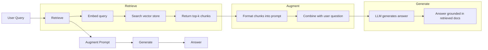
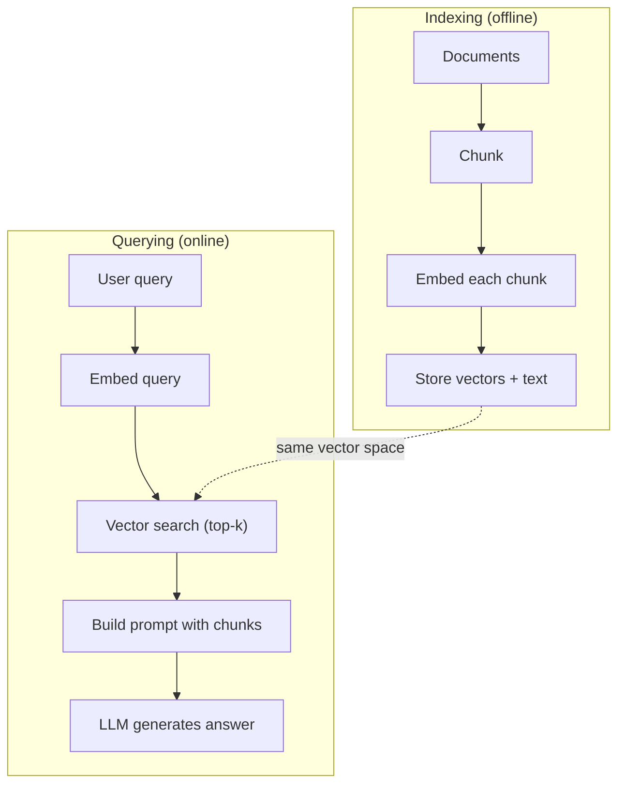

# RAG (Geração Aumentada pela Recuperação)

> Seu LLM sabe tudo antes do final do seu treinamento. Não entende os documentos da sua empresa, sua biblioteca de códigos, nem os registros de conferências da semana passada.

**Type:** Build
**Languages:** Python
**Prerequisites:** Phase 10 (LLMs from Scratch), Phase 11 Lessons 01-05
**Time:** ~90 minutes
**Related:**Fase 5 · 23 (Estratégias de Chunking para RAG) 讲解六种 chunking 算法以及各自适用场景──Fase 5 · 22 (Embedding Models Deep Dive) 讲解如何选择嵌入者──Fase 11 · 07 (Advanced RAG) 讲解混合搜索、重排和查询转变──

## Objectivo de aprendizagem
- Construir um gasoduto RAG completo:carregamento de documentos, clustering, inserção, armazenamento de vetores, recuperação e geração
- Utilize vector database (ChromaDB、FAISS ou Pinecone)并配合合适的索引, realize semântica busca
- explicar por que em aplicações baseadas em conhecimento  RAG  melhor do que ajuste fino                                                                                                                                                                                                                                                                                                                                                                                                                                                                                                       
- Utilize metricas de recuperação (precisão, recall) e metricas de geração (fidelidade, relevância)

## 问题
Você construiu um chatbot para a empresa. Pergunta do cliente: qual é a política de reembolso do programa empresarial? LLM deu uma resposta geral sobre a política de reembolso SaaS típica. A política real foi enterrada em uma wiki interna de 200 páginas, que estabelece que os clientes empresariais têm 60 janelas, e podem devolver em proporção. LLM nunca viu este documento. Não é possível saber o que não apareceu no treinamento.

O ajuste fino é uma solução. Tome este LLM, treine-o com o seu arquivo interno, e depois implante um modelo atualizado. É possível, mas há sérios problemas.

RAG é outra solução. Mantém o modelo inalterado. Quando o problema entra, pesquise passagens relacionadas em sua loja de documentos, aplique-as no prompt da frente do problema, deixe o modelo basear-se nessas passagens como contexto para responder.

## 概念
### O padrão RAG

Todo o modelo pode ser enumeracionado em quatro etapas:



Query -> Retrieve -> Augment prompt -> Generate。 Cada RAG 系统都遵循这个模式。 Production class RAG 系统之间的差异体现在每一步的细节中:如何分块、如何嵌、如何搜索,以及如何构建提示──

### Por que o RAG é melhor do que o ajuste fino

| Concern | Fine-tuning | RAG |
|---------|------------|-----|
| 成本 | 每次 training run 需要 $1,000-$100,000+ | 每次 query 约 $0.01-$0.10（embedding + LLM） |
| 新鲜度 | 重新训练前一直过时 | 通过重新 indexing docs，可在几分钟内更新 |
| 可审计性 | 无法追踪 answer 到 source | 可以展示准确检索到的 passages |
| Hallucination | 仍然会自由 hallucinate | 基于检索到的 documents |
| 数据隐私 | training data 被烘焙进 weights | documents 留在你的 vector store 中 |

A ajuste fina irá alterar permanentemente os pesos do modelo. O RAG irá alterar temporariamente o contexto do modelo. Para a maioria das aplicações, o contexto temporário é o que você quer.

O único caso de que o ajuste perfeito vença: você precisa de um modelo que adota um determinado estilo, linguagem ou modelo de raciocínio, mas isso não pode ser realizado apenas por meio de incitação.

### Introdução de modelos

Modelo de incorporação 会把文本转换成密集向量──相似文本会在这个高维空间产生彼此接近的向量── Como eu redefinir minha senha? 和 Eu preciso mudar minha senha 尽管共享的词很少,却会产生几乎相同的向量── O gato sentado no chão 则会产生非常不同的向量──

常见嵌入型号(2026 阵容  完整分析见 Fase 5 · 22):

| Model | Dimensions | Provider | Notes |
|-------|-----------|----------|-------|
| text-embedding-3-small | 1536 (Matryoshka) | OpenAI | 适合大多数用例的最佳性价比 |
| text-embedding-3-large | 3072 (Matryoshka) | OpenAI | 更高准确率，可截断到 256/512/1024 |
| Gemini Embedding 2 | 3072 (Matryoshka) | Google | 顶级 MTEB retrieval；8K context |
| voyage-4 | 1024/2048 (Matryoshka) | Voyage AI | 领域变体（code、finance、law） |
| Cohere embed-v4 | 1024 (Matryoshka) | Cohere | 强 multilingual，128K context |
| BGE-M3 | 1024 (dense + sparse + ColBERT) | BAAI (open-weight) | 一个模型提供三种视图 |
| Qwen3-Embedding | 4096 (Matryoshka) | Alibaba (open-weight) | 顶级 open-weight retrieval score |
| all-MiniLM-L6-v2 | 384 | Open-weight (Sentence Transformers) | prototyping baseline |

Neste curso, vamos usar o TF-IDF para construir nossa própria simples incorporação. Não porque o TF-IDF seja um esquema que o sistema de produção usa, mas porque faz o conceito se tornar específico: texto de entrada, vetor de saída, semelhante texto para produzir vetores semelhantes.

### Semelhança de vetores

Dados dois vetores, como medir a similaridade?

**Cosine similarity**: dois vetores 之间角的余弦值──范围从 -1(相反) 到 1(完全相同)──忽略大小,只关注方向──这是RAG的默认选择──

```
cosine_sim(a, b) = dot(a, b) / (||a|| * ||b||)
```

**Dot product**O produto interno original. Vectores maiores obterão maior número de pontos. Quando a magnitude é útil, os documentos mais longos podem ser mais relevantes.

```
dot(a, b) = sum(a_i * b_i)
```

**L2 (Euclidean) distance**:espaço vetorial Centro de distância de linha reta.

```
L2(a, b) = sqrt(sum((a_i - b_i)^2))
```

A semelhança cosínica é um padrão de seleção. É através da magnitude, capaz de lidar com documentos de diferentes dimensões. Quando alguém diz que a pesquisa vectorial é quase sempre referente à semelhança cosínica.

### Estratégias de desmantelamento

Documentos 太长,不能作为单单向量来嵌入──一页50页 PDF可能会产生非常糟糕的嵌入,因为它包含几十主题──相反, você deveria demover documentos 断片,并分别嵌入每个块──

**Fixed-size chunking**Cada N 个代币 拆分一次──简单且可预测── 配合 50代币重叠, significa que 1代币 0-511, 2代币 462-973,以此类推──重叠 确保你不会在不走运的边界处切断句子──

**Semantic chunking**O que é mais complexo é a realização, mas o resultado é melhor.

**Recursive chunking**Se um parágrafo ainda for grande, basta separar-se. É um método de LangChain Recursive CharacterTextSplitter, que é muito bom na prática.

O tamanho do pedaço é mais importante do que as pessoas pensam:

- 太小(64-128 tokens): cada pedaço 缺乏背景── Ele aumentou 15% no último trimestre Se não saber it指什么,就没有意义──
- 太大(2048+ tokens): cada peça 覆盖多主题,稀释相关性── quando você pesquisa dados de receita 时, você obtém um 10% 关于收入、90% 关于人数 的部分──
- 理想范围(256-512 tokens):context 足够自包含,同时足够聚焦以保持相关性──

A maioria da produção de RAG utiliza 256-512 tokens, e 50 tokens se sobrepõem.

### Base de dados de vetores

Uma vez que você tem embutidos, você precisa de um lugar para armazená-los e pesquisar.

| Database | Type | Best for |
|----------|------|----------|
| FAISS | Library (in-process) | Prototyping，中小型 datasets |
| Chroma | Lightweight DB | 本地开发，小型部署 |
| Pinecone | Managed service | 无需运维负担的生产环境 |
| Weaviate | Open source DB | 自托管生产环境 |
| pgvector | Postgres extension | 已经在使用 Postgres |
| Qdrant | Open source DB | 高性能自托管 |

Neste curso, vamos construir um simples armazém de vetores em memória. Ele coloca vetores na lista de existências, e executa uma pesquisa de semelhança cosínica de força bruta. Isso equivale a usar o FAISS de índice plano. Ele pode se expandir para cerca de 100.000 vetores.

### O oleoduto completo



O processo de indexação é executado em cada documento uma vez ou em documentos novos. O processo de indexação é executado em cada pedido de usuário.

### Números reais

A maioria dos sistemas RAG de produção usa estes parâmetros:

- **k = 5 to 10**: por consulta 检索的块 数量
- **Chunk size = 256 to 512 tokens**,并配 50 tokens sobreposição
- **Context budget**: por consulta Usar 2.500-5.000 tokens de conteúdo recuperado
- **Total prompt**: cerca de 8.000-16.000 tokens(promete do sistema + pedaços recuperados + histórico de conversa + consulta do usuário)
- **Embedding dimension**3:84-3072, depende do modelo
- **Indexing throughput**: usar API embutidos 时每秒 100-1,000 documentos
- **Query latency**Retorno de 50-200 ms, geração 500-3000 ms


```figure
rag-chunking
```

## Construí-lo
### 步骤 1: Chunking de documentos

```python
def chunk_text(text, chunk_size=200, overlap=50):
    words = text.split()
    chunks = []
    start = 0
    while start < len(words):
        end = start + chunk_size
        chunk = " ".join(words[start:end])
        chunks.append(chunk)
        start += chunk_size - overlap
    return chunks
```

### 步骤 2: Embalagens do TF-IDF

Nós construímos uma função de incorporação simples. TF-IDF (Term Frequency-Inverse Document Frequency) não é uma incorporação neural, mas é capaz de capturar a importância do texto em vectores.

```python
import math
from collections import Counter

def build_vocabulary(documents):
    vocab = set()
    for doc in documents:
        vocab.update(doc.lower().split())
    return sorted(vocab)

def compute_tf(text, vocab):
    words = text.lower().split()
    count = Counter(words)
    total = len(words)
    return [count.get(word, 0) / total for word in vocab]

def compute_idf(documents, vocab):
    n = len(documents)
    idf = []
    for word in vocab:
        doc_count = sum(1 for doc in documents if word in doc.lower().split())
        idf.append(math.log((n + 1) / (doc_count + 1)) + 1)
    return idf

def tfidf_embed(text, vocab, idf):
    tf = compute_tf(text, vocab)
    return [t * i for t, i in zip(tf, idf)]
```

### 步骤 3: Pesquisa de semelhança cosínica

```python
def cosine_similarity(a, b):
    dot = sum(x * y for x, y in zip(a, b))
    norm_a = math.sqrt(sum(x * x for x in a))
    norm_b = math.sqrt(sum(x * x for x in b))
    if norm_a == 0 or norm_b == 0:
        return 0.0
    return dot / (norm_a * norm_b)

def search(query_embedding, stored_embeddings, top_k=5):
    scores = []
    for i, emb in enumerate(stored_embeddings):
        sim = cosine_similarity(query_embedding, emb)
        scores.append((i, sim))
    scores.sort(key=lambda x: x[1], reverse=True)
    return scores[:top_k]
```

### 步骤 4: Construção rápida

É o que acontece no RAG. Retirando os fragmentos de pesquisa, formá-los em um prompt, e então exigindo o LLM com base em um determinado contexto.

```python
def build_rag_prompt(query, retrieved_chunks):
    context = "\n\n---\n\n".join(
        f"[Source {i+1}]\n{chunk}"
        for i, chunk in enumerate(retrieved_chunks)
    )
    return f"""Answer the question based ONLY on the following context.
If the context doesn't contain enough information, say "I don't have enough information to answer that."

Context:
{context}

Question: {query}

Answer:"""
```

### 步骤 5: O oleoduto RAG completo

```python
class RAGPipeline:
    def __init__(self):
        self.chunks = []
        self.embeddings = []
        self.vocab = []
        self.idf = []

    def index(self, documents):
        all_chunks = []
        for doc in documents:
            all_chunks.extend(chunk_text(doc))
        self.chunks = all_chunks
        self.vocab = build_vocabulary(all_chunks)
        self.idf = compute_idf(all_chunks, self.vocab)
        self.embeddings = [
            tfidf_embed(chunk, self.vocab, self.idf)
            for chunk in all_chunks
        ]

    def query(self, question, top_k=5):
        query_emb = tfidf_embed(question, self.vocab, self.idf)
        results = search(query_emb, self.embeddings, top_k)
        retrieved = [(self.chunks[i], score) for i, score in results]
        prompt = build_rag_prompt(
            question, [chunk for chunk, _ in retrieved]
        )
        return prompt, retrieved
```

### 步骤 6: Geração (simulado)

Em ambiente de produção, aqui vamos usar a API LLM.

```python
def simple_generate(prompt, retrieved_chunks):
    query_words = set(prompt.lower().split("question:")[-1].split())
    best_sentence = ""
    best_score = 0
    for chunk in retrieved_chunks:
        for sentence in chunk.split("."):
            sentence = sentence.strip()
            if not sentence:
                continue
            words = set(sentence.lower().split())
            overlap = len(query_words & words)
            if overlap > best_score:
                best_score = overlap
                best_sentence = sentence
    return best_sentence if best_sentence else "I don't have enough information."
```

## Use-o
Utilize real embedding model 和 LLM 时,代码几乎不变:

```python
from openai import OpenAI

client = OpenAI()

def embed(text):
    response = client.embeddings.create(
        model="text-embedding-3-small",
        input=text
    )
    return response.data[0].embedding

def generate(prompt):
    response = client.chat.completions.create(
        model="gpt-4o-mini",
        messages=[{"role": "user", "content": prompt}],
        temperature=0
    )
    return response.choices[0].message.content
```

Ou usar Anthropic:

```python
import anthropic

client = anthropic.Anthropic()

def generate(prompt):
    response = client.messages.create(
        model="claude-sonnet-4-20250514",
        max_tokens=1024,
        messages=[{"role": "user", "content": prompt}]
    )
    return response.content[0].text
```

pipeline é igual de... substituir a função de embedimento... substituir a função de geração... recuperação de lógica... chunking... construção rápida...

Para armazenamento de vetores de grande escala, usar base de dados de vetores adequados  substituir a pesquisa de força bruta:

```python
import chromadb

client = chromadb.Client()
collection = client.create_collection("my_docs")

collection.add(
    documents=chunks,
    ids=[f"chunk_{i}" for i in range(len(chunks))]
)

results = collection.query(
    query_texts=["What is the refund policy?"],
    n_results=5
)
```

Chroma 会在内部处理嵌入式 (默认使用全-MiniLM-L6-v2),并把向量 存储在本地数据库中──同样模式,不同的管道实现──

## Entrega-o
本课会产出:
- `outputs/prompt-rag-architect.md` Um prompt para uso específico para designar RAG  sistemas
- `outputs/skill-rag-pipeline.md` Um agente de formação  como construir e modificar os oleodutos RAG

## 练习
1. Use simples de sacos de palavras 方法替换TF-IDF embedings(二值:词存在则为 1,不存在则为 0) ⋅ em documentos de amostra 上比较检索质量──TF-IDF 应该表现更好,因为它会给罕见词更高权重──

2. 试验不同分片大小: 上尝试 50、100、200 和 500 words── para cada tamanho, executar as mesmas 5 consultas,并统计有多少能在前3中返回相关分片──找到检索质量 达到峰值的甜点──

3. Para cada peça 添加元数据 (adjunta metadados)  (nome do documento fonte )  (posição do documento)  (modificar o modelo de pedido para incluir a atribuição da fonte, deixe o LLM 引用其来源).

4. 实现 uma avaliação simples: fornecer 10 pares de perguntas e respostas, deixe cada pergunta  através do RAG pipeline,并衡检索到的块中有多少比例含答──这是在 k──

5. Construir um canal RAG conversativo: manter o histórico das últimas 3 rotas de trocas,并将其与获取的块 一起包含在快速中──使用后续问题测试,例如在询问价格 后再问  What about enterprise?──

## 关键术语
| Term | What people say | What it actually means |
|------|----------------|----------------------|
| RAG | “能阅读你文档的 AI” | 检索相关 documents，把它们粘贴到 prompt 中，并生成一个基于这些 documents 的 answer |
| Embedding | “把文本转换成数字” | 文本的 dense vector representation，其中相似含义会产生相似 vectors |
| Vector database | “面向 AI 的搜索引擎” | 为存储 vectors 并按 similarity 找到 nearest neighbors 而优化的数据存储 |
| Chunking | “把 docs 拆成片段” | 将 documents 拆成更小的 segments（通常 256-512 tokens），以便每个 segment 可以独立 embed 和 retrieve |
| Cosine similarity | “两个 vectors 有多相似” | 两个 vectors 之间夹角的余弦值；1 = 方向相同，0 = 正交，-1 = 相反 |
| Top-k retrieval | “取 k 个最佳匹配” | 从 vector store 中返回与 query 最相似的 k 个 chunks |
| Context window | “LLM 能看到多少文本” | LLM 在单次请求中可以处理的最大 tokens 数；retrieved chunks 必须放入这个范围内 |
| Augmented generation | “使用给定 context 回答” | 使用检索到的 documents 作为 context 来生成响应，而不是仅依赖训练得到的知识 |
| TF-IDF | “词语重要性评分” | Term Frequency 乘以 Inverse Document Frequency；根据词语在 corpus 中的区分度为其加权 |
| Indexing | “为搜索准备 docs” | 离线执行 chunking、embedding 和 storing documents 的过程，使它们能在 query time 被搜索 |

## 延伸阅读
- Lewis et al., Retrieval-Augmented Generation for Knowledge-Intensive NLP Tasks (2020)  Facebook AI Research 提出的原始 RAG 论文,形式化了回收-then-genera 模式
- Documentação do RAG do Anthropic (docs.anthropic.com)                                                                                                                                                                                                                                                     
- Pinecone Learning Center, O que é RAG?   Use clara可视化解释 RAG pipeline,并包含生产环境考量
- Sentença-BERT: Reimers & Gurevych (2019)  todos os modelos de incorporação MiniLM 背后的论文,展示如何为语义相似之 训练双码码器
- [Karpukhin et al., “Dense Passage Retrieval for Open-Domain Question Answering” (EMNLP 2020)](https://arxiv.org/abs/2004.04906) DPR 论文, prova densa bi-encoder retrieval em domínio aberto QA 上优于BM25,并确立了现代RAG retrievers的模式──
- [LlamaIndex High-Level Concepts](https://docs.llamaindex.ai/en/stable/getting_started/concepts.html) Construir oleodutos RAG 时需要了解的主要概念:carregadores de dados, parseres de nós, índices, retrievers, sintetizadores de resposta,
- [LangChain RAG tutorial](https://python.langchain.com/docs/tutorials/rag/) 另一种风格的管弦乐器;以 cadeia de executáveis 视角理解同一个检索然后生成模式──
