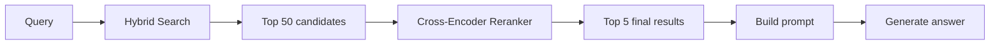
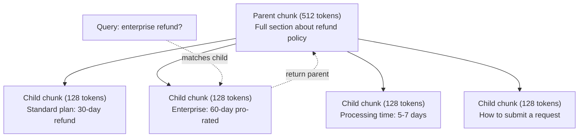
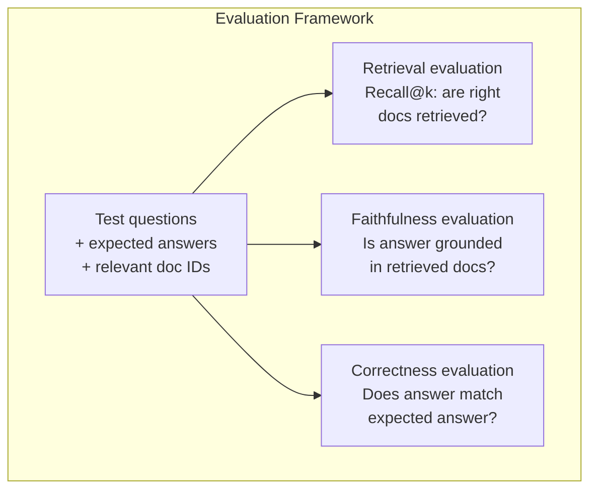

# RAG avançado ((Crumming、Ranking、Hybrid Search)

> O RAG básico irá verificar o mais semelhante do top-k. Isto é válido para um simples problema. Mas face ao raciocínio multi-hop, a pergunta é inadequada.

**类型：**Construção
**语言：**Python
**前置要求：**Fase 11, Lição 06 (RAG)
**时间：**- 90 minutos.
**相关：**A fase 5 · 23 (Estratégias de Chunking para RAG) abrange todas as seis espécies de algoritmos de chunking: recursivo, semântico, sentença, documento-mãe, chunking tardío, recuperação contextual, não contendo referência vectara/antrópica.

## Objectivo de aprendizagem

- 实现能够保留文档结构和上下文的先进分断策略 
- Construir um pipeline de pesquisa híbrida, combinar BM25 palavras-chave com pesquisa semântica vectorial e reencoder cross-ranking 结合起来
-  aplicar a transformação de consultas 技术(HyDE、multi-query、step-back), melhorar a forma ou o problema complexo
- 诊断并修复常见 RAG 失败:检索到错误块、答案不在背景 中、multi-hop reasoning 崩

## 问题

Você construiu um pipeline RAG básico na lição 06 . Ele responde diretamente ao problema em corpus pequeno .

**模糊 query**:"Qual foi a receita no último trimestre?" Pesquisa semântica  Retorno sobre estratégia de receita  projeções de receita, bem como CFO para o crescimento de receita                                                                                                                                                                                                                                        $47.2M in Q3 2025"，但使用的是 "earnings" 而不是 "revenue"。Embedding model 认为 "revenue strategy" 比 "Q3 earnings were $47,2M" mais perto da consulta.

**Multi-hop question**:"Qual equipe teve a maior melhoria na pontuação de satisfação do cliente?" É preciso encontrar a pontuação de satisfação de cada equipe, fazer comparação, e identificar o valor máximo.

**大规模 corpus 问题**Você tem 200 milhões de peças. Em esta escala, a busca de vizinhos mais próximas introduzirá erros suficientes, levando os resultados relacionados a ser excluídos.

RAG básico  fracassou por causa de semelhança vectorial não é igual a correlação. Uma peça pode ser em sentido linguístico com uma consulta, semelhante, mas para responder a pergunta não ajuda. RAG avançado usa quatro técnicas para resolver este problema: busca híbrida (incluindo a correspondência de palavras-chave) renquente (mais detalhadamente ao candidato 打分) transformação de consulta (em busca pre-modificação de consulta), bem como melhor chunking (em busca de grauda) 

## 核心概念

### Busca híbrida: Semântica + Palavra-chave

Pesquisa semântica(Similaridade vectorial)擅长理解含义──"Como cancelar minha assinatura?" 即使与"Pasos para cancelar seu plano" 没有共享单词,也能匹配──但它会漏掉精确匹配──"Code de erro E-4021"可能不能匹配包含"E-4021"的部分,因为嵌入模型可能把它当作噪声──

Busca de palavras-chave(BM25) é muito bom, mas não é muito bom.

Busca híbrida irá executar simultaneamente os dois, e depois juntar os resultados.

**BM25**(Best Matching 25) é o algoritmo de pesquisa de palavras-chave padrão. Desde os anos 1990, tem sido o núcleo do motor de pesquisa.

```
BM25(q, d) = sum over terms t in q:
    IDF(t) * (tf(t,d) * (k1 + 1)) / (tf(t,d) + k1 * (1 - b + b * |d| / avgdl))
```

Entre eles, tf(t,d) é o termo t, em documento d.

Como diz o termo comum: quando o documento contém um termo de consulta (especialmente um termo raro), o BM25 vai dar um maior número de documentos, mas o resultado do período de repetição vai diminuir.

### Fusão de Câncreas Reciprocas (RRF)

Você tem duas listas classificadas: uma de busca de vetores, outra de BM25... Como as combinar?

```
RRF_score(d) = sum over rankings R:
    1 / (k + rank_R(d))
```

Entre eles, k é um número constante (normalmente 60), para evitar que os resultados da classificação ocupem grandes vantagens.

Um em busca de vetores em classificação #1  BM25 em classificação #5 文档得分为:1/(60+1) + 1/(60+5) = 0.0164 + 0.0154 = 0.0318

Um em busca de vetores em ranking #3 ∼ em BM25 ∼ ranking #2 ∼ em BM25 ∼ ranking ∼ ranking ∼ ranking ∼ ranking ∼ ranking ∼ ranking ∼ ranking ∼ ranking ∼ ranking ∼ ranking ∼ ranking ∼ ranking ∼ ranking ∼ ranking ∼ ranking ∼ ranking ∼ ranking ∼ ranking ∼ ranking ∼ ranking ∼ ranking ∼ ranking ∼ ranking ∼ ranking ∼ ranking ∼ ranking ∼ ranking ∼ ranking ∼ ranking ∼ ranking ∼ ranking ∼ ranking ∼ ranking ∼ ranking ∼ ranking ∼ ranking ∼ ranking ∼ ranking ∼ ranking ∼ ranking ∼ ranking ∼ ranking ∼ ranking ∼ ranking ∼ ranking ∼ ranking ∼ ranking ∼ ranking ∼ ranking ∼ ranking ∼ ranking ∼ ranking                                                                                                                                                                                                                                                                                     

RRF encontrará um equilíbrio natural entre estes dois tipos de sinais. Um dos arquivos que se classifica muito alto entre duas listas obtém a melhor pontuação. Um de um arquivos que se classifica em uma certa lista obtém o número um, mas os que faltam em outra lista obtêm o número de pontos médio. Isso é muito estável, pois usa o ranking, e não o número de pontos primários, de modo que a diferença de distribuição de pontos entre dois sistemas não terá impacto.

### Renclassificação

Retrieval (ou seja, Vector, palavra-chave ou híbrido) rápido, mas não preciso o suficiente.

Rango usando cross-encoder:query 和 candidato document 会一起输入模型,模型输出相关性分数――模型能同时看到两段文本,因此可以捕捉它们之间的细粒度交互――Cross-encoder 能理解"Qual foram os ganhos do Q3?"

O peso é: o cross-encoder é mais lento do que o bi-encoder 100-1000 vezes, porque requer o tratamento conjunto de um par de documentos de consulta. Você não pode calcular o cross-encoder por um milhão de documentos.



常见 re-ranking model(2026 阵容):
- Cohere Rerank 3.5:API gerenciado,多语言,在混合 corpus 上 recall gain 最佳
- Rango de viagem-2.5:API gerenciada,latencia em gestão de dados,
- Jina-Reranker-v2 Multilingue:open-weight,支持 100+ 语言
- bge-re-ranquer-v2-m3: peso aberto, linha de base forte
- cross-encoder/ms-marco-MiniLM-L-6-v2: open-weight,可在 CPU 上运行,适合原型制作
- ColBERTv2 / Jina-ColBERT-v2: retraso interação multi-vector re-ranqueador, em avaliação são O(tokens) e não O(docs)

### Transformação de consulta

Há problemas que não são encontrados, mas na consulta. "O que foi essa coisa sobre a nova mudança de política?" é uma pergunta de pesquisa muito ruim. Não contém nenhum termo específico.

**Query rewriting**A consulta do usuário pode ser feita através de um sistema de pesquisa de dados.

```
User: "What was that thing about the new policy change?"
Rewritten: "Recent policy changes and updates"
```

**HyDE（Hypothetical Document Embeddings）**Não com uma pergunta, mas sim com uma resposta hipotética, em que se incide, e depois se busca um documento real semelhante.

```
Query: "What is the refund policy for enterprise?"
Hypothetical answer: "Enterprise customers are eligible for a full refund
within 60 days of purchase. Refunds are pro-rated based on the remaining
subscription period and processed within 5-7 business days."
```

Para a resposta hipotética fazer Embedding,并搜索与它相似的真实文档──直觉是:相比原始问题,hypothetical answer 在 Embedding 空间中更接近真答案──问题和答案具有不同的语言结构──通过生成假答,你在 Embedding 中架建立了"question space"和"answer space"之间的桥梁──

HyDE 会在检索前增加一次LLM调调――这将增加500-2000ms latency――当原始查询检索质量较差时,这是值得的――

### Parentes e filhos

標準 chunking 迫使你做取舍: 小部分 用于精确回取, 大部分 用于提供足够的背景──Parent-child chunking 消除了这个取舍──

索引小块(128 tokens) para recuperação. Quando se faz o seu retorno, coloque o seu parente.



A consulta "reembolso da empresa?" 会精确匹配儿童部分 C2――但提示 收到的是完整的父母部分 P,其中包含关于处理时间和提交流程的周边背景──

### Filtragem de metadados

Em execução de pesquisa vectorial 之前, according metadata 过 corpus:date、source、categoria、author、language。

"O que mudou na política de segurança no mês passado?" 应该只搜索最近30 天、安全类 中的文档──如果没有转录的 metadata,你会搜索整个库,可能检索到一个2年前的安全文件,只是因为它在语义上相似──

Produção RAG  sistemas                                                                                                                                                                                                                                                                                                                                                                                                                                                                                                                        

### Avaliação

Você construiu um sistema RAG... como saber se é eficaz?

**Retrieval relevance（Recall@k）**Para um grupo de questões de teste com documentos relacionados conhecidos, qual a proporção de documentos relacionados que aparecem no top k? Se a resposta a uma pergunta estiver no item #47, item #47 se aparecer no top 5?

**Faithfulness**Se o pedaço de pesquisa é escrito como "flor de reembolso de 60 dias", enquanto o modelo responde "flor de reembolso de 90 dias", é que a fidelidade 失败── o modelo ainda está alucinando em um contexto correto──

**Answer correctness**O resultado é o resultado da análise de dados e da análise de dados.

Uma simples fidelidade check:取生成答案中的每个索赔,并验证它是否 (在实质上) appears in the recovered piece 中――如果答案包含任何回收的部分中都没有事实,它很可能是幻觉的──




```figure
agentic-rag-loop
```

## Construção

### 步骤 1:BM25  realização

```python
import math
from collections import Counter

class BM25:
    def __init__(self, k1=1.2, b=0.75):
        self.k1 = k1
        self.b = b
        self.docs = []
        self.doc_lengths = []
        self.avg_dl = 0
        self.doc_freqs = {}
        self.n_docs = 0

    def index(self, documents):
        self.docs = documents
        self.n_docs = len(documents)
        self.doc_lengths = []
        self.doc_freqs = {}

        for doc in documents:
            words = doc.lower().split()
            self.doc_lengths.append(len(words))
            unique_words = set(words)
            for word in unique_words:
                self.doc_freqs[word] = self.doc_freqs.get(word, 0) + 1

        self.avg_dl = sum(self.doc_lengths) / self.n_docs if self.n_docs else 1

    def score(self, query, doc_idx):
        query_words = query.lower().split()
        doc_words = self.docs[doc_idx].lower().split()
        doc_len = self.doc_lengths[doc_idx]
        word_counts = Counter(doc_words)
        score = 0.0

        for term in query_words:
            if term not in word_counts:
                continue
            tf = word_counts[term]
            df = self.doc_freqs.get(term, 0)
            idf = math.log((self.n_docs - df + 0.5) / (df + 0.5) + 1)
            numerator = tf * (self.k1 + 1)
            denominator = tf + self.k1 * (1 - self.b + self.b * doc_len / self.avg_dl)
            score += idf * numerator / denominator

        return score

    def search(self, query, top_k=10):
        scores = [(i, self.score(query, i)) for i in range(self.n_docs)]
        scores.sort(key=lambda x: x[1], reverse=True)
        return scores[:top_k]
```

### 步骤 2: Fusão de Rango Reciproco

```python
def reciprocal_rank_fusion(ranked_lists, k=60):
    scores = {}
    for ranked_list in ranked_lists:
        for rank, (doc_id, _) in enumerate(ranked_list):
            if doc_id not in scores:
                scores[doc_id] = 0.0
            scores[doc_id] += 1.0 / (k + rank + 1)
    fused = sorted(scores.items(), key=lambda x: x[1], reverse=True)
    return fused
```

### 步骤 3: Pipeline de Busca Híbrida

```python
def hybrid_search(query, chunks, vector_embeddings, vocab, idf, bm25_index, top_k=5, fusion_k=60):
    query_emb = tfidf_embed(query, vocab, idf)
    vector_results = search(query_emb, vector_embeddings, top_k=top_k * 3)
    bm25_results = bm25_index.search(query, top_k=top_k * 3)
    fused = reciprocal_rank_fusion([vector_results, bm25_results], k=fusion_k)
    return fused[:top_k]
```

### 步骤 4: simples Reranker

Em produção, você usará um modelo de codificação cruzada. Aqui construímos um re-ranqueador, usando a sobreposição de palavras.

```python
def rerank(query, candidates, chunks):
    query_words = set(query.lower().split())
    stop_words = {"the", "a", "an", "is", "are", "was", "were", "what", "how",
                  "why", "when", "where", "do", "does", "for", "of", "in", "to",
                  "and", "or", "on", "at", "by", "it", "its", "this", "that",
                  "with", "from", "be", "has", "have", "had", "not", "but"}
    query_terms = query_words - stop_words

    scored = []
    for doc_id, initial_score in candidates:
        chunk = chunks[doc_id].lower()
        chunk_words = set(chunk.split())

        term_overlap = len(query_terms & chunk_words)

        query_bigrams = set()
        q_list = [w for w in query.lower().split() if w not in stop_words]
        for i in range(len(q_list) - 1):
            query_bigrams.add(q_list[i] + " " + q_list[i + 1])
        bigram_matches = sum(1 for bg in query_bigrams if bg in chunk)

        position_boost = 0
        for term in query_terms:
            pos = chunk.find(term)
            if pos != -1 and pos < len(chunk) // 3:
                position_boost += 0.5

        rerank_score = (
            term_overlap * 1.0
            + bigram_matches * 2.0
            + position_boost
            + initial_score * 5.0
        )
        scored.append((doc_id, rerank_score))

    scored.sort(key=lambda x: x[1], reverse=True)
    return scored
```

### 步骤 5:HyDE(Inmoblagens de documento hipotético)

```python
def hyde_generate_hypothesis(query):
    templates = {
        "what": "The answer to '{query}' is as follows: Based on our documentation, {topic} involves specific policies and procedures that define how the process works.",
        "how": "To address '{query}': The process involves several steps. First, you need to initiate the request. Then, the system processes it according to the defined rules.",
        "default": "Regarding '{query}': Our records indicate specific details and policies related to this topic that provide a comprehensive answer."
    }
    query_lower = query.lower()
    if query_lower.startswith("what"):
        template = templates["what"]
    elif query_lower.startswith("how"):
        template = templates["how"]
    else:
        template = templates["default"]

    topic_words = [w for w in query.lower().split()
                   if w not in {"what", "is", "the", "how", "do", "does", "a", "an",
                                "for", "of", "to", "in", "on", "at", "by", "and", "or"}]
    topic = " ".join(topic_words) if topic_words else "this topic"

    return template.format(query=query, topic=topic)


def hyde_search(query, chunks, vector_embeddings, vocab, idf, top_k=5):
    hypothesis = hyde_generate_hypothesis(query)
    hypothesis_emb = tfidf_embed(hypothesis, vocab, idf)
    results = search(hypothesis_emb, vector_embeddings, top_k)
    return results, hypothesis
```

### 步骤 6: Parente-Criança Chunking

```python
def create_parent_child_chunks(text, parent_size=200, child_size=50):
    words = text.split()
    parents = []
    children = []
    child_to_parent = {}

    parent_idx = 0
    start = 0
    while start < len(words):
        parent_end = min(start + parent_size, len(words))
        parent_text = " ".join(words[start:parent_end])
        parents.append(parent_text)

        child_start = start
        while child_start < parent_end:
            child_end = min(child_start + child_size, parent_end)
            child_text = " ".join(words[child_start:child_end])
            child_idx = len(children)
            children.append(child_text)
            child_to_parent[child_idx] = parent_idx
            child_start += child_size

        parent_idx += 1
        start += parent_size

    return parents, children, child_to_parent
```

### 步骤 7: Avaliação da fidelidade

```python
def evaluate_faithfulness(answer, retrieved_chunks):
    answer_sentences = [s.strip() for s in answer.split(".") if len(s.strip()) > 10]
    if not answer_sentences:
        return 1.0, []

    grounded = 0
    ungrounded = []
    context = " ".join(retrieved_chunks).lower()

    for sentence in answer_sentences:
        words = set(sentence.lower().split())
        stop_words = {"the", "a", "an", "is", "are", "was", "were", "and", "or",
                      "to", "of", "in", "for", "on", "at", "by", "it", "this", "that"}
        content_words = words - stop_words
        if not content_words:
            grounded += 1
            continue

        matched = sum(1 for w in content_words if w in context)
        ratio = matched / len(content_words) if content_words else 0

        if ratio >= 0.5:
            grounded += 1
        else:
            ungrounded.append(sentence)

    score = grounded / len(answer_sentences) if answer_sentences else 1.0
    return score, ungrounded


def evaluate_retrieval_recall(queries_with_relevant, retrieval_fn, k=5):
    total_recall = 0.0
    results = []

    for query, relevant_indices in queries_with_relevant:
        retrieved = retrieval_fn(query, k)
        retrieved_indices = set(idx for idx, _ in retrieved)
        relevant_set = set(relevant_indices)
        hits = len(retrieved_indices & relevant_set)
        recall = hits / len(relevant_set) if relevant_set else 1.0
        total_recall += recall
        results.append({
            "query": query,
            "recall": recall,
            "hits": hits,
            "total_relevant": len(relevant_set)
        })

    avg_recall = total_recall / len(queries_with_relevant) if queries_with_relevant else 0
    return avg_recall, results
```

## Utilização

Utilize real cross-encoder  realizar o re-ranqueamento:

```python
from sentence_transformers import CrossEncoder

reranker = CrossEncoder("cross-encoder/ms-marco-MiniLM-L-6-v2")

def rerank_with_cross_encoder(query, candidates, chunks, top_k=5):
    pairs = [(query, chunks[doc_id]) for doc_id, _ in candidates]
    scores = reranker.predict(pairs)
    scored = list(zip([doc_id for doc_id, _ in candidates], scores))
    scored.sort(key=lambda x: x[1], reverse=True)
    return scored[:top_k]
```

Utilize Cohere' s gerenciado re-ranqueador:

```python
import cohere

co = cohere.Client()

def rerank_with_cohere(query, candidates, chunks, top_k=5):
    docs = [chunks[doc_id] for doc_id, _ in candidates]
    response = co.rerank(
        model="rerank-english-v3.0",
        query=query,
        documents=docs,
        top_n=top_k
    )
    return [(candidates[r.index][0], r.relevance_score) for r in response.results]
```

Utilize real LLM 实现 HyDE:

```python
import anthropic

client = anthropic.Anthropic()

def hyde_with_llm(query):
    response = client.messages.create(
        model="claude-sonnet-4-20250514",
        max_tokens=256,
        messages=[{
            "role": "user",
            "content": f"Write a short paragraph that would be a good answer to this question. Do not say you don't know. Just write what the answer would look like.\n\nQuestion: {query}"
        }]
    )
    return response.content[0].text
```

Utilize Weaviate  realizar uma busca híbrida de produção:

```python
import weaviate

client = weaviate.connect_to_local()

collection = client.collections.get("Documents")
response = collection.query.hybrid(
    query="enterprise refund policy",
    alpha=0.5,
    limit=10
)
```

Alfa 参数控制平衡:0.0 = 纯键词(BM25),1.0 = 纯矢量,0.5 = 等权重── maioria da produção 系统使用 0.3 到 0.7 之间的 alpha──

## 交付

本课会产出:
- `outputs/prompt-advanced-rag-debugger.md`-- para diagnóstico e reparação de RAG  Qualidade de questões de urgência
- `outputs/skill-advanced-rag.md`-- para construir habilidades RAG de nível de produção com busca híbrida e re-ranqueamento

## 练习

1. Em um documento de amostra, comparecer BM25、 Pesquisa de vetores 和 Pesquisa híbrida── para cada uma das 5 consultas de teste, registar quais métodos estão na posição #1  Returnar o pedaço mais relevante── Pesquisa híbrida  deve ganhar pelo menos 3  em 5 

2. 实现 metadata filter──为每个文档 添加一个"类别"字段(security、billing、api、product)──在运行 矢量搜索 前,只过出相关类别的部分──用"Qual é a criptografia usada?" 测试,并验证它只搜索 segurança-category 块──

3. Utilize Lesson 06 中的简单生成函数 构建完整的HyDE pipeline──在全部 5 测试查询 上比较直接查询搜索与HyDE搜索的检索质量(top-3 relevance)──HyDE 应能改善模糊查询的结果──

4. Em um documento de amostra, 上实现父母-child chunking 策略──使用 child_size=30 和 parent_size=100──使用儿童块 搜索,但在快速中返回父母块──将生成答案与子_size=50 的标准块 进行比较──

5. 创建评估数据集:10 个问题,带已知答案分别测量 (a) 仅 Vector search,(b) 仅 BM25,(c) 混合搜索,(d) 混合+重排的 Recall@3、Recall@5 和 Recall@10──绘制结果,并识别重排 最有帮助的位置──

## 关键术语

| Term | 人们通常怎么说 | 实际含义 |
|------|----------------|----------------------|
| BM25 | "Keyword search" | 一种概率排序算法，根据 term frequency、inverse document frequency 和 document length normalization 给文档打分 |
| Hybrid search | "Best of both worlds" | 并行运行 semantic（Vector）search 和 keyword（BM25）search，然后用 rank fusion 合并结果 |
| Reciprocal Rank Fusion | "Merge ranked lists" | 对每个文档在所有列表中的 1/(k + rank) 求和，从而组合多个 ranked list |
| Reranking | "Second pass scoring" | 使用成本更高的 cross-encoder model，对 initial retrieval 得到的 candidate set 重新打分 |
| Cross-encoder | "Joint query-document model" | 将 query 和 document 作为单个输入并生成相关性分数的模型；比 bi-encoder 更准确，但对 full corpus search 来说太慢 |
| Bi-encoder | "Independent embedding model" | 独立对 query 和 document 做 Embedding 的模型；由于 Embedding 可预计算，因此速度快，但不如 cross-encoder 准确 |
| HyDE | "Search with a fake answer" | 为 query 生成 hypothetical answer，对其做 Embedding，并搜索与它相似的真实文档 |
| Parent-child chunking | "Small search, big context" | 为精确 retrieval 索引小 chunk，但返回更大的 parent chunk 以提供足够 context |
| Metadata filtering | "Narrow before searching" | 在运行 Vector search 前，根据属性（date、source、category）过滤文档以缩小搜索空间 |
| Faithfulness | "Did it stay grounded" | 生成答案是否由 retrieved document 支持，而不是来自模型训练数据的 hallucination |

## 延伸阅读

- Robertson & Zaragoza, "O quadro de relevância probabilística: BM25 e além" (2009) -- BM25's authority reference, explain公式背后的概率基础
- Cormack et al., "Fusão de Rank Reciprocal supera os métodos de aprendizagem de Condorcet e Rank Individual" (2009) -- RRF 原始论文,展示它优于更复杂的融合方法
- Gao et al., "Precisos zero-shot denso retrieval sem etiquetas de relevância" (2022) -- HyDE 论文, provando um documento hipotético Embedings podem melhorar a recuperação sem nenhum treinamento dados
- Nogueira & Cho, "Passage Re-ranking with BERT" (2019) -- 展示在 BM25 之上进行跨编码重新排名能显著提升检索质量
- [Khattab et al., "DSPy: Compiling Declarative Language Model Calls into Self-Improving Pipelines" (2023)](https://arxiv.org/abs/2310.03714)-- vai construir rapidamente e selecionar o peso 视为检索管道 上的优化问题; ler este artigo para entender "program LLM", em vez de "prompt LLM".
- [Edge et al., "From Local to Global: A Graph RAG Approach to Query-Focused Summarization" (Microsoft Research 2024)](https://arxiv.org/abs/2404.16130)-- GraphRAG 论文: extração de relações entre entidades + detecção da comunidade de Leiden, para resumo focado em consulta; bem como distinção entre recuperação global e local.
- [Asai et al., "Self-RAG: Learning to Retrieve, Generate, and Critique through Self-Reflection" (ICLR 2024)](https://arxiv.org/abs/2310.11511)-- 带 reflection tokens 的自评估 RAG;静态 retrieve-then-generate 后后的代理前沿──
- [LangChain Query Construction blog](https://blog.langchain.dev/query-construction/)-- 如何将自然语言查询 转换为结构化数据库查询(Text-to-SQL、Cypher), como etapa de pré-retorno。
